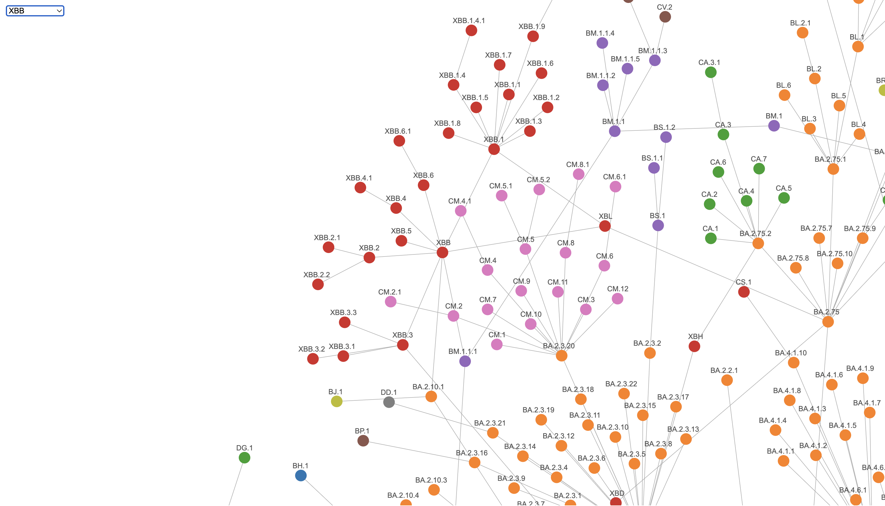

# pango-watch 

Watch for updates in [pango-designation](https://github.com/cov-lineages/pango-designation/blob/master/lineage_notes.txt)!

[Pango lineages interactive tree](https://mdu-phl.github.io/pango-watch/tree/)

[Pango lineages interactive graph](https://mdu-phl.github.io/pango-watch/graph/)

## Changes
> Note: Links to lineages on https://cov-lineages.org will not work until the site is updated to include the changes.

### 2025-12-03
- \+ [NY.7.1.2](https://cov-lineages.org/lineage.html?lineage=NY.7.1.2) Alias of B.1.1.529.2.86.1.1.11.1.1.1.3.8.1.1.7.1.2, S:N487D
- \+ [QM.2](https://cov-lineages.org/lineage.html?lineage=QM.2) Alias of B.1.1.529.2.86.1.1.11.1.1.1.3.8.1.2.1.2.1.2, S:T345S
- \+ [QM.3](https://cov-lineages.org/lineage.html?lineage=QM.3) Alias of B.1.1.529.2.86.1.1.11.1.1.1.3.8.1.2.1.2.1.3, C7732T, C19884T
- \+ [RG.1](https://cov-lineages.org/lineage.html?lineage=RG.1) Alias of B.1.1.529.2.86.1.1.11.1.1.1.3.8.1.2.1.2.2.1, S:S680A
- \+ [RG.1.1](https://cov-lineages.org/lineage.html?lineage=RG.1.1) Alias of B.1.1.529.2.86.1.1.11.1.1.1.3.8.1.2.1.2.2.1.1, S:N532D
- \+ [RG.1.2](https://cov-lineages.org/lineage.html?lineage=RG.1.2) Alias of B.1.1.529.2.86.1.1.11.1.1.1.3.8.1.2.1.2.2.1.2, S:K679R
- \+ [NW.1.8](https://cov-lineages.org/lineage.html?lineage=NW.1.8) Alias of B.1.1.529.2.86.1.1.11.1.1.1.3.8.1.2.1.8, ORF1a:Q245K, C15237T
- \+ [PF.1](https://cov-lineages.org/lineage.html?lineage=PF.1) Alias of B.1.1.529.2.86.1.1.11.1.1.1.3.8.1.6.1, S:K478E, on A9328G branch, from #2933
- \+ [PF.3](https://cov-lineages.org/lineage.html?lineage=PF.3) Alias of B.1.1.529.2.86.1.1.11.1.1.1.3.8.1.6.3, ORF1a:T319I, C29614T
- \+ [PF.3.1](https://cov-lineages.org/lineage.html?lineage=PF.3.1) Alias of B.1.1.529.2.86.1.1.11.1.1.1.3.8.1.6.3.1, S:A475V
- \+ [PF.4](https://cov-lineages.org/lineage.html?lineage=PF.4) Alias of B.1.1.529.2.86.1.1.11.1.1.1.3.8.1.6.4, S:S256L, S:S689N
- \+ [PF.5](https://cov-lineages.org/lineage.html?lineage=PF.5) Alias of B.1.1.529.2.86.1.1.11.1.1.1.3.8.1.6.5, S:K679R, ORF1b:P2321L, on A9328G branch
- \+ [PE.1.4.3](https://cov-lineages.org/lineage.html?lineage=PE.1.4.3) Alias of B.1.1.529.2.86.1.1.11.1.3.1.1.10.2.1.1.4.3, S:Q52K, New Zealand
- \+ [PE.4](https://cov-lineages.org/lineage.html?lineage=PE.4) Alias of B.1.1.529.2.86.1.1.11.1.3.1.1.10.2.1.4, A25983C
- \+ [PE.4.1](https://cov-lineages.org/lineage.html?lineage=PE.4.1) Alias of B.1.1.529.2.86.1.1.11.1.3.1.1.10.2.1.4.1, S:H445P
- \+ [RF.1](https://cov-lineages.org/lineage.html?lineage=RF.1) Alias of B.1.1.529.2.86.1.1.16.1.7.9.1.1.1.1.1, C12439T
- \+ [RF.2](https://cov-lineages.org/lineage.html?lineage=RF.2) Alias of B.1.1.529.2.86.1.1.16.1.7.9.1.1.1.1.2, ORF1b:T239I, ORF3a:S26L
- \+ [RF.3](https://cov-lineages.org/lineage.html?lineage=RF.3) Alias of B.1.1.529.2.86.1.1.16.1.7.9.1.1.1.1.3, S:R182G, ORF1a:Q2034R
- \+ [RF.4](https://cov-lineages.org/lineage.html?lineage=RF.4) Alias of B.1.1.529.2.86.1.1.16.1.7.9.1.1.1.1.4, C8683T
- \+ [PY.7](https://cov-lineages.org/lineage.html?lineage=PY.7) Alias of B.1.1.529.2.86.1.1.16.1.7.9.1.7, S:V1264L, ORF1b:R2483K, ORF1b:K2557R
- \+ [LF.7.11.4](https://cov-lineages.org/lineage.html?lineage=LF.7.11.4) Alias of B.1.1.529.2.86.1.1.16.1.7.11.4, N:P6L
- \+ [RD.1](https://cov-lineages.org/lineage.html?lineage=RD.1) Alias of B.1.1.529.3.2.1.1, A10978G
- \+ [RD.1.1](https://cov-lineages.org/lineage.html?lineage=RD.1.1) Alias of B.1.1.529.3.2.1.1.1, S:V227L
- \+ [RD.1.2](https://cov-lineages.org/lineage.html?lineage=RD.1.2) Alias of B.1.1.529.3.2.1.1.2, N:T296I
- \+ [RE.1](https://cov-lineages.org/lineage.html?lineage=RE.1) Alias of B.1.1.529.3.2.2.1, ORF1a:G227S, ORF1a:A776V
- \+ [RE.1.1](https://cov-lineages.org/lineage.html?lineage=RE.1.1) Alias of B.1.1.529.3.2.2.1.1, ORF1a:R24H, ORF1a:A131V, ORF1a:K3353R, ORF1b:R276C, Australia
- \+ [RE.2](https://cov-lineages.org/lineage.html?lineage=RE.2) Alias of B.1.1.529.3.2.2.2, ORF1a:E1015G
- \+ [RE.2.1](https://cov-lineages.org/lineage.html?lineage=RE.2.1) Alias of B.1.1.529.3.2.2.2.1, N:T296I, on ORF1a:T1896I branch
- \+ [RE.2.2](https://cov-lineages.org/lineage.html?lineage=RE.2.2) Alias of B.1.1.529.3.2.2.2.2, C5884T, A10864G

### 2025-12-02
- \+ [RC.1](https://cov-lineages.org/lineage.html?lineage=RC.1) Alias of XDV.1.5.1.1.8.1.2.8.1.1, S:I478T (rev)
- \+ [RC.2](https://cov-lineages.org/lineage.html?lineage=RC.2) Alias of XDV.1.5.1.1.8.1.2.8.1.2, ORF1a:K958R
- \+ [PQ.2.8.2](https://cov-lineages.org/lineage.html?lineage=PQ.2.8.2) Alias of XDV.1.5.1.1.8.1.2.8.2, S:V289I
- \+ [PQ.14.1](https://cov-lineages.org/lineage.html?lineage=PQ.14.1) Alias of XDV.1.5.1.1.8.1.14.1, A532G
- \+ [PQ.14.1.1](https://cov-lineages.org/lineage.html?lineage=PQ.14.1.1) Alias of XDV.1.5.1.1.8.1.14.1.1, S:I478T (rev), T11371C, A16311G
- \+ [PQ.14.2](https://cov-lineages.org/lineage.html?lineage=PQ.14.2) Alias of XDV.1.5.1.1.8.1.14.2, C12664T, on C28603T
- \+ [PQ.14.3](https://cov-lineages.org/lineage.html?lineage=PQ.14.3) Alias of XDV.1.5.1.1.8.1.14.3, M:L29F, on C28603T
- \+ [PQ.14.3.1](https://cov-lineages.org/lineage.html?lineage=PQ.14.3.1) Alias of XDV.1.5.1.1.8.1.14.3.1, S:H445P, S:K679R, S:A829T
- \+ [PQ.14.4](https://cov-lineages.org/lineage.html?lineage=PQ.14.4) Alias of XDV.1.5.1.1.8.1.14.4, C12049T
- \+ [PQ.38](https://cov-lineages.org/lineage.html?lineage=PQ.38) Alias of XDV.1.5.1.1.8.1.38, ORF1a:T1840I, C27513T
- \+ [PQ.39](https://cov-lineages.org/lineage.html?lineage=PQ.39) Alias of XDV.1.5.1.1.8.1.39, S:H445P
- \+ [XFC.1.2.1](https://cov-lineages.org/lineage.html?lineage=XFC.1.2.1) S:R445P, ORF1a:S1561A, ORF1a:T2280I
- \+ [XFC.1.3.1](https://cov-lineages.org/lineage.html?lineage=XFC.1.3.1) S:A435S, S:A475V
- \+ [XFC.1.10](https://cov-lineages.org/lineage.html?lineage=XFC.1.10) ORF1a:Y947H
- \+ [XFC.1.11](https://cov-lineages.org/lineage.html?lineage=XFC.1.11) ORF1b:Q1546H, ORF7a:I103V
- \+ [XFC.1.12](https://cov-lineages.org/lineage.html?lineage=XFC.1.12) T1771A
- \+ [XFC.4](https://cov-lineages.org/lineage.html?lineage=XFC.4) A1393G, C15720T
- \+ [XFG.1.2](https://cov-lineages.org/lineage.html?lineage=XFG.1.2) C16111T
- \+ [XFG.1.3](https://cov-lineages.org/lineage.html?lineage=XFG.1.3) ORF7a:I10V
- \+ [QF.2.1](https://cov-lineages.org/lineage.html?lineage=QF.2.1) Alias of XFG.3.4.1.2, S:N641K
- \+ [XFG.3.6.2](https://cov-lineages.org/lineage.html?lineage=XFG.3.6.2) N:S197L, ORF1a:T1597I, ORF1b:N1790S
- \+ [XFG.3.10.1](https://cov-lineages.org/lineage.html?lineage=XFG.3.10.1) T3616C, C6445T, A29125G
- \+ [XFG.3.10.2](https://cov-lineages.org/lineage.html?lineage=XFG.3.10.2) ORF1b:T2332A
- \+ [QW.1.1](https://cov-lineages.org/lineage.html?lineage=QW.1.1) Alias of XFG.5.4.1.1.1, S:L176F, C7834T
- \+ [XFG.23.1.1](https://cov-lineages.org/lineage.html?lineage=XFG.23.1.1) N:P67H, N:P365L, on C29137T
- \+ [RB.1](https://cov-lineages.org/lineage.html?lineage=RB.1) Alias of XFG.23.1.1.1, S:I210S
- \+ [RB.2](https://cov-lineages.org/lineage.html?lineage=RB.2) Alias of XFG.23.1.1.2, S:S704L
- \+ [XFG.23.1.3](https://cov-lineages.org/lineage.html?lineage=XFG.23.1.3) S:A1174V, on C29137T
- \+ [XFG.23.1.4](https://cov-lineages.org/lineage.html?lineage=XFG.23.1.4) S:W258R, ORF1a:A2855V, ORF3a:T89I
- \+ [XFG.23.1.5](https://cov-lineages.org/lineage.html?lineage=XFG.23.1.5) ORF1a:S944L, ORF3a:S74F
- \+ [XFG.23.2](https://cov-lineages.org/lineage.html?lineage=XFG.23.2) S:Y796H
- \+ [RA.1](https://cov-lineages.org/lineage.html?lineage=RA.1) Alias of XFJ.3.1.1.1, S:T236S
- \+ [XFJ.3.1.3](https://cov-lineages.org/lineage.html?lineage=XFJ.3.1.3) ORF1a:H1108Y
- \+ [XFJ.8.1](https://cov-lineages.org/lineage.html?lineage=XFJ.8.1) S:V1264L, ORF1a:N434D
- \+ [XFJ.10](https://cov-lineages.org/lineage.html?lineage=XFJ.10) C21682T
- \+ [XGD](https://cov-lineages.org/lineage.html?lineage=XGD) Recombinant lineage of XFJ.4, XFJ.3.1.3 (breakpoints 6278-18252)

### 2025-11-17
- \+ [XFG.3.6.1](https://cov-lineages.org/lineage.html?lineage=XFG.3.6.1) S:A942S, ORF1a:T1638I, ORF1b:P1666S
- \+ [XFG.6.3.1](https://cov-lineages.org/lineage.html?lineage=XFG.6.3.1) C920T
- \+ [XFG.6.3.2](https://cov-lineages.org/lineage.html?lineage=XFG.6.3.2) S:K679R
- \+ [XFG.6.9](https://cov-lineages.org/lineage.html?lineage=XFG.6.9) C27059T
- \+ [XFG.6.10](https://cov-lineages.org/lineage.html?lineage=XFG.6.10) G28079T
- \+ [XFG.6.11](https://cov-lineages.org/lineage.html?lineage=XFG.6.11) ORF1b:G1772S
- \+ [XFG.6.12](https://cov-lineages.org/lineage.html?lineage=XFG.6.12) G2875A
- \+ [XFG.7.1.1](https://cov-lineages.org/lineage.html?lineage=XFG.7.1.1) S:K150E, G28079T
- \+ [QZ.1](https://cov-lineages.org/lineage.html?lineage=QZ.1) S:A688V, from sars-cov-2-variants/lineage-proposals#2906
- \+ [XFG.7.1.2](https://cov-lineages.org/lineage.html?lineage=XFG.7.1.2) S:V90I, S:W152R
- \+ [XFG.8.2.1](https://cov-lineages.org/lineage.html?lineage=XFG.8.2.1) S:G946R, ORF1a:T1844I
- \+ [XFG.36](https://cov-lineages.org/lineage.html?lineage=XFG.36) T10567C
- \+ [XFY.1](https://cov-lineages.org/lineage.html?lineage=XFY.1) S:I1169V, C4456T, ORF1b:K1537R

### 2025-11-15
- \+ [XFG.9.6](https://cov-lineages.org/lineage.html?lineage=XFG.9.6) S:V1104L, C24337T
- \+ [XFW.1.1.1](https://cov-lineages.org/lineage.html?lineage=XFW.1.1.1) S:Q677R, ORF7a:T39I
- \+ [XFZ.1](https://cov-lineages.org/lineage.html?lineage=XFZ.1) S:M153V, A22486G

### 2025-11-08
- \+ [XFG.3.30](https://cov-lineages.org/lineage.html?lineage=XFG.3.30) C10207T, on C10615T branch

### 2025-11-05
- \+ [XFG.3.25](https://cov-lineages.org/lineage.html?lineage=XFG.3.25) S:L441I, N:T24I, ORF1a:H2092Y, on C10615T branch, from sars-cov-2-variants/lineage-proposals#2998
- \+ [XFG.3.26](https://cov-lineages.org/lineage.html?lineage=XFG.3.26) S:K679R, ORF1b:Y2329H, on C10615T branch, from sars-cov-2-variants/lineage-proposals#2795
- \+ [XFG.3.27](https://cov-lineages.org/lineage.html?lineage=XFG.3.27) ORF3a:R134H, A1588G, on C10615T branch, from sars-cov-2-variants/lineage-proposals#2891
- \+ [XFG.3.28](https://cov-lineages.org/lineage.html?lineage=XFG.3.28) S:G184A, ORF1a:S2500F, N:P67S, on C10615T branch
- \+ [XFG.3.29](https://cov-lineages.org/lineage.html?lineage=XFG.3.29) S:N532S, T15330C, on C10615T branch
- \+ [XFG.3.30](https://cov-lineages.org/lineage.html?lineage=XFG.3.30) C10207T
- \+ [XFG.3.30.1](https://cov-lineages.org/lineage.html?lineage=XFG.3.30.1) S:G219D
- \+ [XFG.3.30.2](https://cov-lineages.org/lineage.html?lineage=XFG.3.30.2) S:K679T, ORF1a:T1638N, ORF1a:L4126F
- \+ [XFG.4.5](https://cov-lineages.org/lineage.html?lineage=XFG.4.5) S:G219D, ORF1a:N854D
- \+ [XFG.34](https://cov-lineages.org/lineage.html?lineage=XFG.34) S:F135L, on C20178T branch, South America, from sars-cov-2-variants/lineage-proposals#2942
- \+ [XFG.35](https://cov-lineages.org/lineage.html?lineage=XFG.35) ORF8:R52I, C5581T, T10913C, T19158C, on C20178T branch, Costa Rica
- \+ [XGA](https://cov-lineages.org/lineage.html?lineage=XGA) Recombinant lineage of XFJ.4.1, PY.1, XFG.6.2 (breakpoints 15661-18251, 19030-20177), from #3077
- \+ [XGC](https://cov-lineages.org/lineage.html?lineage=XGC) Recombinant lineage of PY.2, XFG.4 (breakpoints 12892-15660), from sars-cov-2-variants/lineage-proposals#2651

### 2025-11-03
- \+ [QF.5.1](https://cov-lineages.org/lineage.html?lineage=QF.5.1) Alias of XFG.3.4.1.5.1, S:S704L
- \+ [QF.6](https://cov-lineages.org/lineage.html?lineage=QF.6) Alias of XFG.3.4.1.6, S:A958S, UK
- \+ [XFG.3.7.1](https://cov-lineages.org/lineage.html?lineage=XFG.3.7.1) S:S680F
- \+ [XFG.3.29](https://cov-lineages.org/lineage.html?lineage=XFG.3.29) S:N532S, T15330C

### 2025-10-28
- \+ [QF.1.1](https://cov-lineages.org/lineage.html?lineage=QF.1.1) Alias of XFG.3.4.1.1.1, ORF8:G66V
- \+ [QF.1.1.1](https://cov-lineages.org/lineage.html?lineage=QF.1.1.1) Alias of XFG.3.4.1.1.1.1, S:A1174V
- \+ [QF.2](https://cov-lineages.org/lineage.html?lineage=QF.2) Alias of XFG.3.4.1.2, C27812T
- \+ [QF.3](https://cov-lineages.org/lineage.html?lineage=QF.3) Alias of XFG.3.4.1.3, ORF1a:P1921L
- \+ [QF.4](https://cov-lineages.org/lineage.html?lineage=QF.4) Alias of XFG.3.4.1.4, C15960A, C28651T
- \+ [QF.5](https://cov-lineages.org/lineage.html?lineage=QF.5) Alias of XFG.3.4.1.5, C5284T
- \+ [XFG.3.28](https://cov-lineages.org/lineage.html?lineage=XFG.3.28) S:G184A, ORF1a:S2500F, N:P67S
- \+ [XFG.9.3.1](https://cov-lineages.org/lineage.html?lineage=XFG.9.3.1) S:E154V
- \+ [XFG.9.3.2](https://cov-lineages.org/lineage.html?lineage=XFG.9.3.2) ORF1a:H2125Y
- \+ [XFJ.1.3](https://cov-lineages.org/lineage.html?lineage=XFJ.1.3) S:I105V, S:K444R, ORF1a:T708I, USA
- \+ [XFJ.3.1.1](https://cov-lineages.org/lineage.html?lineage=XFJ.3.1.1) S:K679N (rev)
- \+ [XFJ.3.1.2](https://cov-lineages.org/lineage.html?lineage=XFJ.3.1.2) N:A152S, N:K229T
- \+ [XFJ.3.2](https://cov-lineages.org/lineage.html?lineage=XFJ.3.2) ORF1b:A241T
- \+ [XFN.2.1](https://cov-lineages.org/lineage.html?lineage=XFN.2.1) S:K484R, ORF1a:P1921S, ORF1b:A374S, Orf9b:S10F, UK

### 2025-10-16
- \+ [QU.1](https://cov-lineages.org/lineage.html?lineage=QU.1) Alias of B.1.1.529.2.86.1.1.11.1.1.1.3.8.1.1.3.1.2.1, S:A475V, from sars-cov-2-variants/lineage-proposals#2644
- \+ [NY.20.1](https://cov-lineages.org/lineage.html?lineage=NY.20.1) Alias of B.1.1.529.2.86.1.1.11.1.1.1.3.8.1.1.20.1, S:M153V, Spain, from sars-cov-2-variants/lineage-proposals#2199
- \+ [NY.23](https://cov-lineages.org/lineage.html?lineage=NY.23) Alias of B.1.1.529.2.86.1.1.11.1.1.1.3.8.1.1.23, ORF3a:L101F, from sars-cov-2-variants/lineage-proposals#2635
- \+ [NY.25.1](https://cov-lineages.org/lineage.html?lineage=NY.25.1) Alias of B.1.1.529.2.86.1.1.11.1.1.1.3.8.1.1.25.1, S:K147E, ORF1a:A967V, from sars-cov-2-variants/lineage-proposals#2199
- \+ [NY.26.1](https://cov-lineages.org/lineage.html?lineage=NY.26.1) Alias of B.1.1.529.2.86.1.1.11.1.1.1.3.8.1.1.26.1, S:L441V, from sars-cov-2-variants/lineage-proposals#2199
- \+ [NY.26.3](https://cov-lineages.org/lineage.html?lineage=NY.26.3) Alias of B.1.1.529.2.86.1.1.11.1.1.1.3.8.1.1.26.3, S:D936Y, from sars-cov-2-variants/lineage-proposals#2199
- \+ [NW.1.2.4](https://cov-lineages.org/lineage.html?lineage=NW.1.2.4) Alias of B.1.1.529.2.86.1.1.11.1.1.1.3.8.1.2.1.2.4, S:N211-, S:L212T, ORF1a:I2198M, from sars-cov-2-variants/lineage-proposals#2879
- \+ [NW.1.7.2](https://cov-lineages.org/lineage.html?lineage=NW.1.7.2) Alias of B.1.1.529.2.86.1.1.11.1.1.1.3.8.1.2.1.7.2, ORF3a:N82Y, from sars-cov-2-variants/lineage-proposals#2672
- \+ [NW.1.7.4](https://cov-lineages.org/lineage.html?lineage=NW.1.7.4) Alias of B.1.1.529.2.86.1.1.11.1.1.1.3.8.1.2.1.7.4, ORF1a:E1047K, from sars-cov-2-variants/lineage-proposals#2916
- \+ [NW.3.2](https://cov-lineages.org/lineage.html?lineage=NW.3.2) Alias of B.1.1.529.2.86.1.1.11.1.1.1.3.8.1.2.3.2, S:A435S, ORF1a:T727I, ORF1a:T2777K, from sars-cov-2-variants/lineage-proposals#2664
- \+ [PD.1.2.1](https://cov-lineages.org/lineage.html?lineage=PD.1.2.1) Alias of B.1.1.529.2.86.1.1.11.1.1.1.3.8.1.4.1.2.1, S:L441V, Brazil, from sars-cov-2-variants/lineage-proposals#2739
- \+ [PE.3](https://cov-lineages.org/lineage.html?lineage=PE.3) Alias of B.1.1.529.2.86.1.1.11.1.3.1.1.10.2.1.3, N:T362I, ORF1a:S1510F, ORF7a:T28I, New Zealand, from sars-cov-2-variants/lineage-proposals#2682
- \+ [PC.3.3](https://cov-lineages.org/lineage.html?lineage=PC.3.3) Alias of B.1.1.529.2.86.1.1.16.1.7.2.1.3.3, S:T572I, S:S680F, from sars-cov-2-variants/lineage-proposals#2659
- \+ [PC.3.4](https://cov-lineages.org/lineage.html?lineage=PC.3.4) Alias of B.1.1.529.2.86.1.1.16.1.7.2.1.3.4, S:S680F, ORF1b:A2222V, from sars-cov-2-variants/lineage-proposals#2659
- \+ [QV.1](https://cov-lineages.org/lineage.html?lineage=QV.1) Alias of B.1.1.529.2.86.1.1.16.1.7.2.2.1, S:A376S, from sars-cov-2-variants/lineage-proposals#2462
- \+ [QR.2](https://cov-lineages.org/lineage.html?lineage=QR.2) Alias of B.1.1.529.2.86.1.1.16.1.7.7.2.2, S:K478R, S:T572I, from sars-cov-2-variants/lineage-proposals#2759
- \+ [MV.3](https://cov-lineages.org/lineage.html?lineage=MV.3) Alias of B.1.1.529.2.86.1.1.49.1.1.1.1.3, S:K478R, G670A, from sars-cov-2-variants/lineage-proposals#2306
- \+ [NB.1.1.1](https://cov-lineages.org/lineage.html?lineage=NB.1.1.1) Alias of XDV.1.5.1.1.1.1, N:A208S, ORF1a:A372V, ORF1a:A3610V, from sars-cov-2-variants/lineage-proposals#2789
- \+ [QL.1](https://cov-lineages.org/lineage.html?lineage=QL.1) Alias of XDV.1.5.1.1.1.1.1, S:A435S, ORF1a:H45Y, from sars-cov-2-variants/lineage-proposals#2789
- \+ [NB.1.5.1](https://cov-lineages.org/lineage.html?lineage=NB.1.5.1) Alias of XDV.1.5.1.1.5.1, S:M177I, from sars-cov-2-variants/lineage-proposals#2380
- \+ [PQ.1.6.1](https://cov-lineages.org/lineage.html?lineage=PQ.1.6.1) Alias of XDV.1.5.1.1.8.1.1.6.1, S:I478T (rev), from sars-cov-2-variants/lineage-proposals#2889
- \+ [PQ.2.6](https://cov-lineages.org/lineage.html?lineage=PQ.2.6) Alias of XDV.1.5.1.1.8.1.2.6, S:S446T, N:A359S, ORF1a:A2850T, from sars-cov-2-variants/lineage-proposals#2685
- \+ [PQ.2.7.1](https://cov-lineages.org/lineage.html?lineage=PQ.2.7.1) Alias of XDV.1.5.1.1.8.1.2.7.1, S:N148H, from sars-cov-2-variants/lineage-proposals#2825
- \+ [PQ.2.8.1](https://cov-lineages.org/lineage.html?lineage=PQ.2.8.1) Alias of XDV.1.5.1.1.8.1.2.8.1, S:H445P, from sars-cov-2-variants/lineage-proposals#2803
- \+ [PQ.9.1.1](https://cov-lineages.org/lineage.html?lineage=PQ.9.1.1) Alias of XDV.1.5.1.1.8.1.9.1.1, S:R681H, S:F939L, from sars-cov-2-variants/lineage-proposals#2823
- \+ [PQ.10.1.2](https://cov-lineages.org/lineage.html?lineage=PQ.10.1.2) Alias of XDV.1.5.1.1.8.1.10.1.2, S:P174S, from sars-cov-2-variants/lineage-proposals#2943
- \+ [PQ.10.1.3](https://cov-lineages.org/lineage.html?lineage=PQ.10.1.3) Alias of XDV.1.5.1.1.8.1.10.1.3, ORF3a:A103S, New Zealand, from sars-cov-2-variants/lineage-proposals#2597
- \+ [PQ.13.2](https://cov-lineages.org/lineage.html?lineage=PQ.13.2) Alias of XDV.1.5.1.1.8.1.13.2, S:S680F, ORF1a:L590F, ORF1a:G1100S, ORF1a:D2980N, from sars-cov-2-variants/lineage-proposals#2775
- \+ [PQ.17.3](https://cov-lineages.org/lineage.html?lineage=PQ.17.3) Alias of XDV.1.5.1.1.8.1.17.3, S:S680F, from sars-cov-2-variants/lineage-proposals#2912
- \+ [PQ.17.4](https://cov-lineages.org/lineage.html?lineage=PQ.17.4) Alias of XDV.1.5.1.1.8.1.17.4, S:R683Q, from sars-cov-2-variants/lineage-proposals#2953
- \+ [PQ.29](https://cov-lineages.org/lineage.html?lineage=PQ.29) Alias of XDV.1.5.1.1.8.1.29, S:H445P, ORF1a:A859T, ORF1b:N734H, ORF1b:A1443T, from sars-cov-2-variants/lineage-proposals#2769
- \+ [PQ.30](https://cov-lineages.org/lineage.html?lineage=PQ.30) Alias of XDV.1.5.1.1.8.1.30, ORF1a:A3697V, ORF3a:L101F, from sars-cov-2-variants/lineage-proposals#2597
- \+ [PQ.32](https://cov-lineages.org/lineage.html?lineage=PQ.32) Alias of XDV.1.5.1.1.8.1.32, S:T572I, from sars-cov-2-variants/lineage-proposals#2640
- \+ [PQ.34](https://cov-lineages.org/lineage.html?lineage=PQ.34) Alias of XDV.1.5.1.1.8.1.34, S:R683Q, from sars-cov-2-variants/lineage-proposals#2788
- \+ [PQ.35](https://cov-lineages.org/lineage.html?lineage=PQ.35) Alias of XDV.1.5.1.1.8.1.35, ORF3a:T151I, from sars-cov-2-variants/lineage-proposals#2597
- \+ [PQ.37](https://cov-lineages.org/lineage.html?lineage=PQ.37) Alias of XDV.1.5.1.1.8.1.37, S:S680P, ORF1a:V2061F, M:L29F, from sars-cov-2-variants/lineage-proposals#2835
- \+ [NB.1.9](https://cov-lineages.org/lineage.html?lineage=NB.1.9) Alias of XDV.1.5.1.1.9, S:L176F, S:H445P, from sars-cov-2-variants/lineage-proposals#2460
- \+ [NB.1.11](https://cov-lineages.org/lineage.html?lineage=NB.1.11) Alias of XDV.1.5.1.1.11, S:A958S, N:A182S, ORF1a:R1163G, from sars-cov-2-variants/lineage-proposals#2321
- \+ [NB.1.12](https://cov-lineages.org/lineage.html?lineage=NB.1.12) Alias of XDV.1.5.1.1.12, S:H445P, ORf1a:L624F, ORF1a:A2690V, from sars-cov-2-variants/lineage-proposals#2575
- \+ [XDY.3.1](https://cov-lineages.org/lineage.html?lineage=XDY.3.1) S:R346T, ORF1b:Y710C, from sars-cov-2-variants/lineage-proposals#2281
- \+ [XEC.18.1.1](https://cov-lineages.org/lineage.html?lineage=XEC.18.1.1) S:K478E, S:V1264L, ORF1a:E1801D, ORF3a:Q38R, Malaysia/Thailand, from sars-cov-2-variants/lineage-proposals#2690
- \+ [XEC.27.2.2](https://cov-lineages.org/lineage.html?lineage=XEC.27.2.2) S:K478T (rev), T6763C, from sars-cov-2-variants/lineage-proposals#2869
- \+ [XFG.1.1](https://cov-lineages.org/lineage.html?lineage=XFG.1.1) S:W452R (rev), ORF7a:V8A (rev), M:V104L, from sars-cov-2-variants/lineage-proposals#2796
- \+ [XFG.2.3](https://cov-lineages.org/lineage.html?lineage=XFG.2.3) G27621A, from sars-cov-2-variants/lineage-proposals#2738
- \+ [XFG.2.3.1](https://cov-lineages.org/lineage.html?lineage=XFG.2.3.1) S:N417T, from sars-cov-2-variants/lineage-proposals#2738
- \+ [XFG.2.4](https://cov-lineages.org/lineage.html?lineage=XFG.2.4) S:L176F, from sars-cov-2-variants/lineage-proposals#3011
- \+ [QK.1.1](https://cov-lineages.org/lineage.html?lineage=QK.1.1) Alias of XFG.3.1.2.1.1, S:A845S, from sars-cov-2-variants/lineage-proposals#2901
- \+ [QK.2](https://cov-lineages.org/lineage.html?lineage=QK.2) Alias of XFG.3.1.2.2, S:S680P, ORF1a:A1060T, ORF1a:H1113Y, from sars-cov-2-variants/lineage-proposals#2814
- \+ [QK.3](https://cov-lineages.org/lineage.html?lineage=QK.3) Alias of XFG.3.1.2.3, S:L8F, from sars-cov-2-variants/lineage-proposals#2724
- \+ [XFG.3.1.4](https://cov-lineages.org/lineage.html?lineage=XFG.3.1.4) S:D936Y, ORF1b:S1779I, from sars-cov-2-variants/lineage-proposals#2857
- \+ [XFG.3.1.5](https://cov-lineages.org/lineage.html?lineage=XFG.3.1.5) S:V308L, from sars-cov-2-variants/lineage-proposals#2866
- \+ [XFG.3.1.6](https://cov-lineages.org/lineage.html?lineage=XFG.3.1.6) ORF3a:K16R, Singapore, from sars-cov-2-variants/lineage-proposals#2728
- \+ [XFG.3.1.7](https://cov-lineages.org/lineage.html?lineage=XFG.3.1.7) S:G268S, S:A376S, from sars-cov-2-variants/lineage-proposals#2746
- \+ [XFG.3.1.10](https://cov-lineages.org/lineage.html?lineage=XFG.3.1.10) S:S704L, C5167T, from sars-cov-2-variants/lineage-proposals#2768
- \+ [QT.1.1](https://cov-lineages.org/lineage.html?lineage=QT.1.1) Alias of XFG.3.4.2.1.1, S:S680P, on ORF1b:T1637I branch, from sars-cov-2-variants/lineage-proposals#2779
- \+ [QT.2](https://cov-lineages.org/lineage.html?lineage=QT.2) Alias of XFG.3.4.2.2, S:K529R, N:E136D, ORF1a:Y1920H, Brazil, from sars-cov-2-variants/lineage-proposals#2847
- \+ [QT.3](https://cov-lineages.org/lineage.html?lineage=QT.3) Alias of XFG.3.4.2.3, S:K679R, from sars-cov-2-variants/lineage-proposals#2970
- \+ [QS.1](https://cov-lineages.org/lineage.html?lineage=QS.1) Alias of XFG.3.4.3.1, C8419T, from sars-cov-2-variants/lineage-proposals#2916
- \+ [QS.2](https://cov-lineages.org/lineage.html?lineage=QS.2) Alias of XFG.3.4.3.2, S:K679R, from sars-cov-2-variants/lineage-proposals#2765
- \+ [XFG.3.4.4](https://cov-lineages.org/lineage.html?lineage=XFG.3.4.4) S:V367I, N:A152S, ORF1b:A520T, on T15762C branch, from sars-cov-2-variants/lineage-proposals#2816
- \+ [XFG.3.8](https://cov-lineages.org/lineage.html?lineage=XFG.3.8) ORF3a:E19G, on A28877T, G28878C branch, from sars-cov-2-variants/lineage-proposals#2784
- \+ [XFG.3.8.1](https://cov-lineages.org/lineage.html?lineage=XFG.3.8.1) S:V622A , from sars-cov-2-variants/lineage-proposals#2784
- \+ [XFG.3.12.1](https://cov-lineages.org/lineage.html?lineage=XFG.3.12.1) S:A376S, ORF1a:R560C, from sars-cov-2-variants/lineage-proposals#2746
- \+ [XFG.3.13](https://cov-lineages.org/lineage.html?lineage=XFG.3.13) S:G946R, ORF1a:L3339F, on A28877T, G28878C branch, from sars-cov-2-variants/lineage-proposals#2794
- \+ [XFG.3.14](https://cov-lineages.org/lineage.html?lineage=XFG.3.14) S:S704L, C6031T, on C10615T branch, from sars-cov-2-variants/lineage-proposals#2768
- \+ [XFG.3.16.1](https://cov-lineages.org/lineage.html?lineage=XFG.3.16.1) S:W64L, from sars-cov-2-variants/lineage-proposals#2960
- \+ [XFG.3.18.1](https://cov-lineages.org/lineage.html?lineage=XFG.3.18.1) S:A845S, Brazil, from sars-cov-2-variants/lineage-proposals#2753
- \+ [XFG.3.25](https://cov-lineages.org/lineage.html?lineage=XFG.3.25) S:L441I, N:T24I, ORF1a:H2092Y, from sars-cov-2-variants/lineage-proposals#2998
- \+ [XFG.3.26](https://cov-lineages.org/lineage.html?lineage=XFG.3.26) S:K679R, ORF1b:Y2329H, from sars-cov-2-variants/lineage-proposals#2795
- \+ [XFG.3.27](https://cov-lineages.org/lineage.html?lineage=XFG.3.27) ORF3a:R134H, A1588G, from sars-cov-2-variants/lineage-proposals#2891
- \+ [XFG.4.1.1](https://cov-lineages.org/lineage.html?lineage=XFG.4.1.1) S:S680Y, from sars-cov-2-variants/lineage-proposals#2826
- \+ [XFG.4.1.5](https://cov-lineages.org/lineage.html?lineage=XFG.4.1.5) S:A67V, ORF10:A8V, from sars-cov-2-variants/lineage-proposals#2836
- \+ [XFG.4.2](https://cov-lineages.org/lineage.html?lineage=XFG.4.2) S:K1191R, ORF3a:del24-27, F28I, from sars-cov-2-variants/lineage-proposals#2734
- \+ [XFG.5.1.2](https://cov-lineages.org/lineage.html?lineage=XFG.5.1.2) S:V1228L, from sars-cov-2-variants/lineage-proposals#2858
- \+ [XFG.5.1.3](https://cov-lineages.org/lineage.html?lineage=XFG.5.1.3) S:S680F, UK, from sars-cov-2-variants/lineage-proposals#2838
- \+ [XFG.5.1.5](https://cov-lineages.org/lineage.html?lineage=XFG.5.1.5) S:L441I, C24034T, from sars-cov-2-variants/lineage-proposals#2861
- \+ [XFG.5.2.1](https://cov-lineages.org/lineage.html?lineage=XFG.5.2.1) S:S680F, from sars-cov-2-variants/lineage-proposals#2808
- \+ [XFG.5.2.6](https://cov-lineages.org/lineage.html?lineage=XFG.5.2.6) S:S704L, C12295T, from sars-cov-2-variants/lineage-proposals#2768
- \+ [QW.1](https://cov-lineages.org/lineage.html?lineage=QW.1) Alias of XFG.5.4.1.1, S:Q677R, ORF1a:G400S, from sars-cov-2-variants/lineage-proposals#2896
- \+ [XFG.6.1](https://cov-lineages.org/lineage.html?lineage=XFG.6.1) S:T678I, from sars-cov-2-variants/lineage-proposals#2829
- \+ [XFG.6.2.1](https://cov-lineages.org/lineage.html?lineage=XFG.6.2.1) S:D253G, from sars-cov-2-variants/lineage-proposals#2962
- \+ [XFG.6.6](https://cov-lineages.org/lineage.html?lineage=XFG.6.6) ORF1a:T1881I, ORF3a:L94F, ORF3a:A110V, ORF10:N22D, from sars-cov-2-variants/lineage-proposals#2987
- \+ [XFG.7.1.1](https://cov-lineages.org/lineage.html?lineage=XFG.7.1.1) S:K150E, S:A688V, from sars-cov-2-variants/lineage-proposals#2906
- \+ [XFG.9.2](https://cov-lineages.org/lineage.html?lineage=XFG.9.2) S:L8F, from sars-cov-2-variants/lineage-proposals#2910
- \+ [XFG.9.4.1](https://cov-lineages.org/lineage.html?lineage=XFG.9.4.1) S:V227L, ORF3a:S40P, from sars-cov-2-variants/lineage-proposals#2937
- \+ [XFG.9.5](https://cov-lineages.org/lineage.html?lineage=XFG.9.5) S:L176F, from sars-cov-2-variants/lineage-proposals#2830
- \+ [XFG.10.4](https://cov-lineages.org/lineage.html?lineage=XFG.10.4) S:A435S, from sars-cov-2-variants/lineage-proposals#2936
- \+ [XFG.14.2.1](https://cov-lineages.org/lineage.html?lineage=XFG.14.2.1) S:P1162L, ORf1a:L3694F, ORF3a:I35T, from sars-cov-2-variants/lineage-proposals#2954
- \+ [XFG.14.3](https://cov-lineages.org/lineage.html?lineage=XFG.14.3) S:K147E, ORF1a:D1440G, ORF1b:P970L, pre-ORF7a:E121Q, from sars-cov-2-variants/lineage-proposals#2624
- \+ [XFG.17.1](https://cov-lineages.org/lineage.html?lineage=XFG.17.1) S:F59S, from sars-cov-2-variants/lineage-proposals#2701
- \+ [XFG.17.2](https://cov-lineages.org/lineage.html?lineage=XFG.17.2) S:K679R, from sars-cov-2-variants/lineage-proposals#2828
- \+ [XFG.17.2.1](https://cov-lineages.org/lineage.html?lineage=XFG.17.2.1) S:G219S, from sars-cov-2-variants/lineage-proposals#2828
- \+ [QQ.1](https://cov-lineages.org/lineage.html?lineage=QQ.1) Alias of XFG.17.2.1.1, S:Q677H, N:F307L, from sars-cov-2-variants/lineage-proposals#2988
- \+ [XFG.17.3](https://cov-lineages.org/lineage.html?lineage=XFG.17.3) S:L335F, Orf9b:A82V , from sars-cov-2-variants/lineage-proposals#2586
- \+ [XFG.17.4](https://cov-lineages.org/lineage.html?lineage=XFG.17.4) S:G219D, S:T345S, from sars-cov-2-variants/lineage-proposals#2867
- \+ [XFG.22.1](https://cov-lineages.org/lineage.html?lineage=XFG.22.1) S:A263S, from sars-cov-2-variants/lineage-proposals#2881
- \+ [XFG.24](https://cov-lineages.org/lineage.html?lineage=XFG.24) S:G75V, on ORF1b:P1821S branch, from sars-cov-2-variants/lineage-proposals#2676
- \+ [XFG.26](https://cov-lineages.org/lineage.html?lineage=XFG.26) ORF8:E19*, on C20178T branch, from sars-cov-2-variants/lineage-proposals#2718
- \+ [XFG.32](https://cov-lineages.org/lineage.html?lineage=XFG.32) S:F127L, S:D253G, from sars-cov-2-variants/lineage-proposals#2744
- \+ [XFG.34](https://cov-lineages.org/lineage.html?lineage=XFG.34) S:F135L, South America, from sars-cov-2-variants/lineage-proposals#2942
- \+ [XFJ.1.2](https://cov-lineages.org/lineage.html?lineage=XFJ.1.2) S:K150E, on A15036G branch, from sars-cov-2-variants/lineage-proposals#2622
- \+ [XFJ.2.1](https://cov-lineages.org/lineage.html?lineage=XFJ.2.1) S:K478I, from sars-cov-2-variants/lineage-proposals#2599
- \+ [XFJ.3.1](https://cov-lineages.org/lineage.html?lineage=XFJ.3.1) S:I19V, ORF1a:T1543I, from sars-cov-2-variants/lineage-proposals#2604
- \+ [XFV.1](https://cov-lineages.org/lineage.html?lineage=XFV.1) S:G252S, from sars-cov-2-variants/lineage-proposals#2841
- \+ [XFV.2](https://cov-lineages.org/lineage.html?lineage=XFV.2) S:A688V, from sars-cov-2-variants/lineage-proposals#2950
- \+ [XFW.1](https://cov-lineages.org/lineage.html?lineage=XFW.1) S:R681H, ORF1b:S997L, from sars-cov-2-variants/lineage-proposals#2740
- \+ [XFW.1.1](https://cov-lineages.org/lineage.html?lineage=XFW.1.1) S:T676P, from sars-cov-2-variants/lineage-proposals#2740

### 2025-10-15
- \+ [QY.1](https://cov-lineages.org/lineage.html?lineage=QY.1) Alias of XFG.4.1.3.1, S:R683Q, ORF7a:L12H, India
- \+ [XFG.5.1.5](https://cov-lineages.org/lineage.html?lineage=XFG.5.1.5) S:L441I, C24034T
- \+ [QQ.1](https://cov-lineages.org/lineage.html?lineage=QQ.1) Alias of XFG.17.2.1.1, S:Q677H, N:F307L

### 2025-10-14
- \+ [NY.26](https://cov-lineages.org/lineage.html?lineage=NY.26) Alias of B.1.1.529.2.86.1.1.11.1.1.1.3.8.1.1.26, G709A, C24109T
- \+ [NY.26.1](https://cov-lineages.org/lineage.html?lineage=NY.26.1) Alias of B.1.1.529.2.86.1.1.11.1.1.1.3.8.1.1.26.1, S:L441V
- \+ [NY.26.2](https://cov-lineages.org/lineage.html?lineage=NY.26.2) Alias of B.1.1.529.2.86.1.1.11.1.1.1.3.8.1.1.26.2, ORF1b:T2432I
- \+ [NY.26.3](https://cov-lineages.org/lineage.html?lineage=NY.26.3) Alias of B.1.1.529.2.86.1.1.11.1.1.1.3.8.1.1.26.3, S:D936Y
- \+ [NY.26.4](https://cov-lineages.org/lineage.html?lineage=NY.26.4) Alias of B.1.1.529.2.86.1.1.11.1.1.1.3.8.1.1.26.4, S:N657S, T1237C
- \+ [PD.1.2.1](https://cov-lineages.org/lineage.html?lineage=PD.1.2.1) Alias of B.1.1.529.2.86.1.1.11.1.1.1.3.8.1.4.1.2.1, S:L441V, Brazil

### 2025-10-13
- \+ [PL.6](https://cov-lineages.org/lineage.html?lineage=PL.6) Alias of B.1.1.529.2.86.1.1.16.1.7.1.10.6, S:K478T (rev), S:T500A
- \+ [LF.7.1.15](https://cov-lineages.org/lineage.html?lineage=LF.7.1.15) Alias of B.1.1.529.2.86.1.1.16.1.7.1.15, ORF1a:L2146I
- \+ [XFG.3.27](https://cov-lineages.org/lineage.html?lineage=XFG.3.27) ORF3a:R134H, A1588G
- \+ [XFG.3.27.1](https://cov-lineages.org/lineage.html?lineage=XFG.3.27.1) ORF1a:K1753R, on A4624G branch
- \+ [XFG.3.27.2](https://cov-lineages.org/lineage.html?lineage=XFG.3.27.2) C11339T, C12085T, on A4624G branch
- \+ [QY.1](https://cov-lineages.org/lineage.html?lineage=QY.1) Alias of XFG.4.1.3.1, S:R638Q, ORF7a:L12H, India
- \+ [XFG.4.1.5](https://cov-lineages.org/lineage.html?lineage=XFG.4.1.5) S:A67V, ORF10:A8V
- \+ [XFG.8.4](https://cov-lineages.org/lineage.html?lineage=XFG.8.4) T18630C
- \+ [XFG.8.5](https://cov-lineages.org/lineage.html?lineage=XFG.8.5) C21306T

### 2025-10-12
- \+ [PQ.2.9](https://cov-lineages.org/lineage.html?lineage=PQ.2.9) Alias of XDV.1.5.1.1.8.1.2.9, C18814T
- \+ [XFC.3.1](https://cov-lineages.org/lineage.html?lineage=XFC.3.1) S:K478E, C5020T, C21697T, T25072C, C28732T, Costa Rica
- \+ [XFC.3.2](https://cov-lineages.org/lineage.html?lineage=XFC.3.2) S:K478T (rev), ORF3a:R134C
- \+ [XFC.3.3](https://cov-lineages.org/lineage.html?lineage=XFC.3.3) ORF1b:A2431V
- \+ [XFG.2.4](https://cov-lineages.org/lineage.html?lineage=XFG.2.4) S:L176F
- \+ [QK.1.1](https://cov-lineages.org/lineage.html?lineage=QK.1.1) Alias of XFG.3.1.2.1.1, S:A845S
- \+ [XFG.3.1.8](https://cov-lineages.org/lineage.html?lineage=XFG.3.1.8) ORF1a:D996N, ORF1a:T1240I
- \+ [XFG.3.1.9](https://cov-lineages.org/lineage.html?lineage=XFG.3.1.9) N:I379T (rev)
- \+ [XFG.3.1.10](https://cov-lineages.org/lineage.html?lineage=XFG.3.1.10) S:S704L, C5167T
- \+ [XFG.3.25](https://cov-lineages.org/lineage.html?lineage=XFG.3.25) S:L441I, N:T24I, ORF1a:H2092Y
- \+ [XFG.3.26](https://cov-lineages.org/lineage.html?lineage=XFG.3.26) S:K679R, ORF1b:Y2329H
- \+ [XFG.5.1.3](https://cov-lineages.org/lineage.html?lineage=XFG.5.1.3) S:S680F, UK
- \+ [XFG.5.1.4](https://cov-lineages.org/lineage.html?lineage=XFG.5.1.4) C2485T
- \+ [XFG.5.1.5](https://cov-lineages.org/lineage.html?lineage=XFG.5.1.5) S:L44I, C24034T
- \+ [XFG.5.1.6](https://cov-lineages.org/lineage.html?lineage=XFG.5.1.6) S:A688T
- \+ [XFG.5.2.3](https://cov-lineages.org/lineage.html?lineage=XFG.5.2.3) C23758T
- \+ [XFG.5.2.4](https://cov-lineages.org/lineage.html?lineage=XFG.5.2.4) ORF1a:D2980G
- \+ [XFG.5.2.5](https://cov-lineages.org/lineage.html?lineage=XFG.5.2.5) ORF1a:P2079S, N:T24I, ORF7a:A66V, ORF7b:Y10C, ORF10:I27M
- \+ [XFG.5.2.6](https://cov-lineages.org/lineage.html?lineage=XFG.5.2.6) S:S704L, C12295T
- \+ [XFG.5.4](https://cov-lineages.org/lineage.html?lineage=XFG.5.4) T2698C
- \+ [XFG.5.4.1](https://cov-lineages.org/lineage.html?lineage=XFG.5.4.1) ORF3a:D155Y
- \+ [QW.1](https://cov-lineages.org/lineage.html?lineage=QW.1) Alias of XFG.5.4.1.1, S:Q677R, ORF1a:G400S
- \+ [XFG.8.1](https://cov-lineages.org/lineage.html?lineage=XFG.8.1) C15024T
- \+ [XFG.8.2](https://cov-lineages.org/lineage.html?lineage=XFG.8.2) ORF1a:T1597I
- \+ [XFG.8.3](https://cov-lineages.org/lineage.html?lineage=XFG.8.3) C2857T
- \+ [XFG.10.2](https://cov-lineages.org/lineage.html?lineage=XFG.10.2) ORF1a:T1847I
- \+ [XFG.10.3](https://cov-lineages.org/lineage.html?lineage=XFG.10.3) C11416T
- \+ [XFG.10.4](https://cov-lineages.org/lineage.html?lineage=XFG.10.4) S:A435S
- \+ [XFG.14.2.1](https://cov-lineages.org/lineage.html?lineage=XFG.14.2.1) S:P1162L, ORf1a:L3694F, ORF3a:I35T
- \+ [XFG.14.4](https://cov-lineages.org/lineage.html?lineage=XFG.14.4) ORF1a:A3548V, C25680T, C28744T
- \+ [QQ.1](https://cov-lineages.org/lineage.html?lineage=QQ.1) Alias of XFG.17.2.1, S:Q677H, N:F307L
- \+ [XFG.22.3](https://cov-lineages.org/lineage.html?lineage=XFG.22.3) N:T282I
- \+ [XFG.34](https://cov-lineages.org/lineage.html?lineage=XFG.34) S:F135L, South America
- \+ [XFG.35](https://cov-lineages.org/lineage.html?lineage=XFG.35) ORF8:R52I, C5581T, T10913C, T19158C, Costa Rica

### 2025-10-08
- \+ [XEC.18.1.1](https://cov-lineages.org/lineage.html?lineage=XEC.18.1.1) S:K478E, S:V1264L, ORF1a:E1801D, ORF3a:Q38R, Malaysia/Thailand
- \+ [QT.3](https://cov-lineages.org/lineage.html?lineage=QT.3) Alias of XFG.3.4.2.3, S:K679R
- \+ [XFG.3.16.1](https://cov-lineages.org/lineage.html?lineage=XFG.3.16.1) S:W64L
- \+ [XFG.6.5.1](https://cov-lineages.org/lineage.html?lineage=XFG.6.5.1) S:S680Y, UK
- \+ [XFG.6.7](https://cov-lineages.org/lineage.html?lineage=XFG.6.7) ORF1b:A1291V, USA
- \+ [XFG.6.8](https://cov-lineages.org/lineage.html?lineage=XFG.6.8) C583T, T6673C

### 2025-10-07
- \+ [XGC](https://cov-lineages.org/lineage.html?lineage=XGC) Recombinant lineage of PY.2, XFG.4, PY.2 (breakpoints 12892-15660, 25523-29408), from sars-cov-2-variants/lineage-proposals#2651

### 2025-10-06
- \+ [XFG.3.4.5](https://cov-lineages.org/lineage.html?lineage=XFG.3.4.5) S:S680P, S:A1174V, N:G5E
- \+ [XFG.3.4.6](https://cov-lineages.org/lineage.html?lineage=XFG.3.4.6) C15763T
- \+ [XFG.3.4.7](https://cov-lineages.org/lineage.html?lineage=XFG.3.4.7) ORF1b:P2169S, T580A
- \+ [XFG.3.4.8](https://cov-lineages.org/lineage.html?lineage=XFG.3.4.8) C29200T
- \+ [XFG.3.4.9](https://cov-lineages.org/lineage.html?lineage=XFG.3.4.9) ORF1a:V2766F
- \+ [XFG.3.18.1](https://cov-lineages.org/lineage.html?lineage=XFG.3.18.1) S:A845S, Brazil
- \+ [XFG.6.2.1](https://cov-lineages.org/lineage.html?lineage=XFG.6.2.1) S:D253G
- \+ [XFG.6.5](https://cov-lineages.org/lineage.html?lineage=XFG.6.5) C23758T
- \+ [XFG.6.6](https://cov-lineages.org/lineage.html?lineage=XFG.6.6) ORF1a:T1881I, ORF3a:L94F, ORF3a:A110V, ORF10:N22D
- \+ [XFG.9.4.1](https://cov-lineages.org/lineage.html?lineage=XFG.9.4.1) S:V227L, ORF3a:S40P
- \+ [XFG.9.4.2](https://cov-lineages.org/lineage.html?lineage=XFG.9.4.2) S:L189F
- \+ [XFW.1](https://cov-lineages.org/lineage.html?lineage=XFW.1) S:R681H, ORF1b:S997L
- \+ [XFW.1.1](https://cov-lineages.org/lineage.html?lineage=XFW.1.1) S:T676P
- \+ [XFW.1.2](https://cov-lineages.org/lineage.html?lineage=XFW.1.2) S:Q677R, ORF7a:T39I

### 2025-10-05
- \+ [PQ.10.1.1](https://cov-lineages.org/lineage.html?lineage=PQ.10.1.1) Alias of XDV.1.5.1.1.8.1.10.1.1, S:S221L
- \+ [PQ.10.1.2](https://cov-lineages.org/lineage.html?lineage=PQ.10.1.2) Alias of XDV.1.5.1.1.8.1.10.1.2, S:P174S
- \+ [PQ.10.1.3](https://cov-lineages.org/lineage.html?lineage=PQ.10.1.3) Alias of XDV.1.5.1.1.8.1.10.1.3, ORF3a:A103S, New Zealand
- \+ [PQ.10.1.4](https://cov-lineages.org/lineage.html?lineage=PQ.10.1.4) Alias of XDV.1.5.1.1.8.1.10.1.4, ORF1a:G519C
- \+ [PQ.17.3](https://cov-lineages.org/lineage.html?lineage=PQ.17.3) Alias of XDV.1.5.1.1.8.1.17.3, S:S680F
- \+ [PQ.17.4](https://cov-lineages.org/lineage.html?lineage=PQ.17.4) Alias of XDV.1.5.1.1.8.1.17.4, S:R683Q
- \+ [PQ.25.3](https://cov-lineages.org/lineage.html?lineage=PQ.25.3) Alias of XDV.1.5.1.1.8.1.25.3, C22498T
- \+ [PQ.25.3.1](https://cov-lineages.org/lineage.html?lineage=PQ.25.3.1) Alias of XDV.1.5.1.1.8.1.25.3.1, S:T95I
- \+ [PQ.34.1](https://cov-lineages.org/lineage.html?lineage=PQ.34.1) Alias of XDV.1.5.1.1.8.1.34.1, S:T572I
- \+ [PQ.36](https://cov-lineages.org/lineage.html?lineage=PQ.36) Alias of XDV.1.5.1.1.8.1.36, T13120C
- \+ [PQ.37](https://cov-lineages.org/lineage.html?lineage=PQ.37) Alias of XDV.1.5.1.1.8.1.37, S:S680P, ORF1a:V2061F, M:L29F

### 2025-10-04
- \+ [NY.25](https://cov-lineages.org/lineage.html?lineage=NY.25) Alias of B.1.1.529.2.86.1.1.11.1.1.1.3.8.1.1.25, C13225T
- \+ [NW.1.2.1](https://cov-lineages.org/lineage.html?lineage=NW.1.2.1) Alias of B.1.1.529.2.86.1.1.11.1.1.1.3.8.1.2.1.2.1, ORF8:A51T, ORF9b:G38D, on G9646A branch
- \+ [PE.1.4](https://cov-lineages.org/lineage.html?lineage=PE.1.4) Alias of B.1.1.529.2.86.1.1.11.1.3.1.1.10.2.1.1.4, S:H445P, on ORF7a:T28I, ORF1a:del84-85 branch, Australia, from sars-cov-2-variants/lineage-proposals#2650
- \+ [PE.1.7](https://cov-lineages.org/lineage.html?lineage=PE.1.7) Alias of B.1.1.529.2.86.1.1.11.1.3.1.1.10.2.1.1.7, S:H445P, S:T547K, ORF1a:R77Q, ORF1a:A3454V, on ORF7a:T28I, ORF1a:del84-85 branch, Australia
- \+ [PL.4](https://cov-lineages.org/lineage.html?lineage=PL.4) Alias of B.1.1.529.2.86.1.1.16.1.7.1.10.4, ORF1a:R24C, ORF1a:D2402N, on S:ins16IPLF branch
- \+ [PL.5](https://cov-lineages.org/lineage.html?lineage=PL.5) Alias of B.1.1.529.2.86.1.1.16.1.7.1.10.5, ORF1a:T1638N, ORF1a:P2739S, on S:ins16IPLF branch
- \+ [QR.1](https://cov-lineages.org/lineage.html?lineage=QR.1) Alias of B.1.1.529.2.86.1.1.16.1.7.7.2.1, T1183A, C7765T, T17166C, C24130T
- \+ [QR.2](https://cov-lineages.org/lineage.html?lineage=QR.2) Alias of B.1.1.529.2.86.1.1.16.1.7.7.2.2, S:K478R, S:T572I
- \+ [XFG.3.1](https://cov-lineages.org/lineage.html?lineage=XFG.3.1) S:D1084G, ORF1a:L2122F, 29770-29775del, from sars-cov-2-variants/lineage-proposals#2617
- \+ [QT.1.2](https://cov-lineages.org/lineage.html?lineage=QT.1.2) Alias of XFG.3.4.2.1.2, ORF1a:L1914I, ORf7a:T120I, on ORF1b:T1637I branch
- \+ [XFG.3.4.4](https://cov-lineages.org/lineage.html?lineage=XFG.3.4.4) S:V367I, N:A152S, ORF1b:A520T, on T15762C branch
- \+ [XFG.3.14](https://cov-lineages.org/lineage.html?lineage=XFG.3.14) S:S704L, C6031T, on C10615T branch
- \+ [XFG.3.15](https://cov-lineages.org/lineage.html?lineage=XFG.3.15) G28681A, on C10615T branch
- \+ [XFG.3.16](https://cov-lineages.org/lineage.html?lineage=XFG.3.16) C3565T (rev), C25096T, on C10615T branch
- \+ [XFG.3.18](https://cov-lineages.org/lineage.html?lineage=XFG.3.18) C11866T, on C10615T branch
- \+ [XFG.3.19](https://cov-lineages.org/lineage.html?lineage=XFG.3.19) C2143T, after C29769T, on A28877T, G28878C branch
- \+ [XFG.3.20](https://cov-lineages.org/lineage.html?lineage=XFG.3.20) C6040T, after C29769T, on A28877T, G28878C branch
- \+ [XFG.3.21](https://cov-lineages.org/lineage.html?lineage=XFG.3.21) G2185A, after C29769T, on A28877T, G28878C branch
- \+ [XFG.3.23](https://cov-lineages.org/lineage.html?lineage=XFG.3.23) ORF1a:S944L, on C10615T branch
- \+ [XFG.3.24](https://cov-lineages.org/lineage.html?lineage=XFG.3.24) A15189G, on C10615T branch
- \+ [XFG.4.1.2](https://cov-lineages.org/lineage.html?lineage=XFG.4.1.2) S:P1263L
- \+ [XFG.4.1.3](https://cov-lineages.org/lineage.html?lineage=XFG.4.1.3) C2509T
- \+ [XFG.4.1.4](https://cov-lineages.org/lineage.html?lineage=XFG.4.1.4) T25139C
- \+ [XFG.4.2](https://cov-lineages.org/lineage.html?lineage=XFG.4.2) S:K1191R, ORF3a:del24-27, F28I
- \+ [XFG.4.3](https://cov-lineages.org/lineage.html?lineage=XFG.4.3) T28474A
- \+ [XFG.4.4](https://cov-lineages.org/lineage.html?lineage=XFG.4.4) G8017T
- \+ [XFG.14.3](https://cov-lineages.org/lineage.html?lineage=XFG.14.3) S:K147E, ORF1a:D1440G, ORF1b:P970L, pre-ORF7a:E121Q
- \+ [XFG.17.3](https://cov-lineages.org/lineage.html?lineage=XFG.17.3) S:L335F, Orf9b:A82V
- \+ [XFG.23.1.1](https://cov-lineages.org/lineage.html?lineage=XFG.23.1.1) N:P67H, N:P365L
- \+ [XFG.23.1.2](https://cov-lineages.org/lineage.html?lineage=XFG.23.1.2) C5944T, C18912T, C21676T, C29546T
- \+ [XFG.25](https://cov-lineages.org/lineage.html?lineage=XFG.25) S:A262V, on C20178T branch, from sars-cov-2-variants/lineage-proposals#2854
- \+ [XFG.26](https://cov-lineages.org/lineage.html?lineage=XFG.26) ORF8:E19*, on C20178T branch
- \+ [XFG.28](https://cov-lineages.org/lineage.html?lineage=XFG.28) C18306T, on C20178T branch
- \+ [XFG.29](https://cov-lineages.org/lineage.html?lineage=XFG.29) A13444G, on C20178T branch
- \+ [XFG.30](https://cov-lineages.org/lineage.html?lineage=XFG.30) ORF1a:P1640S, on C20178T branch
- \+ [XFG.31](https://cov-lineages.org/lineage.html?lineage=XFG.31) G5017A, on C20178T branch
- \+ [XFG.33](https://cov-lineages.org/lineage.html?lineage=XFG.33) ORF1a:del141-143, ORF1a:F1594L

### 2025-10-03
- \+ [PC.5](https://cov-lineages.org/lineage.html?lineage=PC.5) Alias of B.1.1.529.2.86.1.1.16.1.7.2.1.5, S:H445P, ORF1a:P2079S
- \+ [QV.1](https://cov-lineages.org/lineage.html?lineage=QV.1) Alias of B.1.1.529.2.86.1.1.16.1.7.2.2.1, S:A376S
- \+ [QV.2](https://cov-lineages.org/lineage.html?lineage=QV.2) Alias of B.1.1.529.2.86.1.1.16.1.7.2.2.2, S:R273S, ORF1a:H3580Y
- \+ [PQ.2.4.1](https://cov-lineages.org/lineage.html?lineage=PQ.2.4.1) Alias of XDV.1.5.1.1.8.1.2.4.1, S:D111N, ORF1b:T1034A
- \+ [PQ.2.4.2](https://cov-lineages.org/lineage.html?lineage=PQ.2.4.2) Alias of XDV.1.5.1.1.8.1.2.4.2, S:I478T (rev)
- \+ [PQ.2.5.1](https://cov-lineages.org/lineage.html?lineage=PQ.2.5.1) Alias of XDV.1.5.1.1.8.1.2.5.1, S:N532S
- \+ [PQ.2.5.2](https://cov-lineages.org/lineage.html?lineage=PQ.2.5.2) Alias of XDV.1.5.1.1.8.1.2.5.2, C1912T
- \+ [PQ.2.7](https://cov-lineages.org/lineage.html?lineage=PQ.2.7) Alias of XDV.1.5.1.1.8.1.2.7, C28603T
- \+ [PQ.2.7.1](https://cov-lineages.org/lineage.html?lineage=PQ.2.7.1) Alias of XDV.1.5.1.1.8.1.2.7.1, S:N148H
- \+ [PQ.2.8](https://cov-lineages.org/lineage.html?lineage=PQ.2.8) Alias of XDV.1.5.1.1.8.1.2.8, C8344T
- \+ [PQ.2.8.1](https://cov-lineages.org/lineage.html?lineage=PQ.2.8.1) Alias of XDV.1.5.1.1.8.1.2.8.1, S:H445P
- \+ [XFG.3.1.7](https://cov-lineages.org/lineage.html?lineage=XFG.3.1.7) S:G268S, S:A376S
- \+ [XFV.2](https://cov-lineages.org/lineage.html?lineage=XFV.2) S:A688V

### 2025-10-02
- \+ [KS.1.4](https://cov-lineages.org/lineage.html?lineage=KS.1.4) Alias of B.1.1.529.2.86.1.1.13.1.1.4, S:K478T (rev), S:R237K, C22414T, from sars-cov-2-variants/lineage-proposals#1752
- \+ [XFG.5.1.2](https://cov-lineages.org/lineage.html?lineage=XFG.5.1.2) S:V1228L

### 2025-09-29
- \+ [NY.3.1.2](https://cov-lineages.org/lineage.html?lineage=NY.3.1.2) Alias of B.1.1.529.2.86.1.1.11.1.1.1.3.8.1.1.3.1.2, ORF7b:L19F (rev), C16092T
- \+ [QU.1](https://cov-lineages.org/lineage.html?lineage=QU.1) Alias of B.1.1.529.2.86.1.1.11.1.1.1.3.8.1.1.3.1.2.1, S:A475V
- \+ [QU.2](https://cov-lineages.org/lineage.html?lineage=QU.2) Alias of B.1.1.529.2.86.1.1.11.1.1.1.3.8.1.1.3.1.2.2, ORF1a:V3420L
- \+ [NY.3.1.3](https://cov-lineages.org/lineage.html?lineage=NY.3.1.3) Alias of B.1.1.529.2.86.1.1.11.1.1.1.3.8.1.1.3.1.3, ORF1a:M3129T
- \+ [NY.3.7](https://cov-lineages.org/lineage.html?lineage=NY.3.7) Alias of B.1.1.529.2.86.1.1.11.1.1.1.3.8.1.1.3.7, S:N137K, S:D138H, on C6250T branch
- \+ [NY.3.7.1](https://cov-lineages.org/lineage.html?lineage=NY.3.7.1) Alias of B.1.1.529.2.86.1.1.11.1.1.1.3.8.1.1.3.7.1, S:K150E, ORF1b:A1521V, Spain/France
- \+ [NY.3.8](https://cov-lineages.org/lineage.html?lineage=NY.3.8) Alias of B.1.1.529.2.86.1.1.11.1.1.1.3.8.1.1.3.8, ORF1a:V3091I, ORF7a:V74I, on C6250T branch
- \+ [PC.2.2.1](https://cov-lineages.org/lineage.html?lineage=PC.2.2.1) Alias of B.1.1.529.2.86.1.1.16.1.7.2.1.2.2.1, S:G75V, ORF1b:D2183Y, Singapore
- \+ [PQ.35](https://cov-lineages.org/lineage.html?lineage=PQ.35) Alias of XDV.1.5.1.1.8.1.35, ORF3a:T151I
- \+ [XFG.6.3](https://cov-lineages.org/lineage.html?lineage=XFG.6.3) T8359C
- \+ [XFG.6.4](https://cov-lineages.org/lineage.html?lineage=XFG.6.4) ORF1a:T2611I
- \+ [XFG.14.1.1](https://cov-lineages.org/lineage.html?lineage=XFG.14.1.1) C9598T, C12754T
- \+ [XFG.14.1.2](https://cov-lineages.org/lineage.html?lineage=XFG.14.1.2) S:A942T
- \+ [XFG.14.1.3](https://cov-lineages.org/lineage.html?lineage=XFG.14.1.3) C10798T

### 2025-09-28
- \+ [QK.1](https://cov-lineages.org/lineage.html?lineage=QK.1) Alias of XFG.3.1.2.1, S:Q218H, on ORF1b:D161G branch, from sars-cov-2-variants/lineage-proposals#2785
- \+ [QK.4](https://cov-lineages.org/lineage.html?lineage=QK.4) Alias of XFG.3.1.2.4, ORF1a:P2018L, on ORF1b:D161G branch
- \+ [XFG.3.1.6](https://cov-lineages.org/lineage.html?lineage=XFG.3.1.6) ORF3a:K16R, Singapore
- \+ [QT.1](https://cov-lineages.org/lineage.html?lineage=QT.1) Alias of XFG.3.4.2.1, C3817T
- \+ [QT.1.1](https://cov-lineages.org/lineage.html?lineage=QT.1.1) Alias of XFG.3.4.2.1.1, S:S680P, on ORF1b:T1637I branch
- \+ [QT.1.2](https://cov-lineages.org/lineage.html?lineage=QT.1.2) Alias of XFG.3.4.2.1.2, ORF1a:L1914, ORf7a:T120I, on ORF1b:T1637I branch
- \+ [QT.2](https://cov-lineages.org/lineage.html?lineage=QT.2) Alias of XFG.3.4.2.2, S:K529R, N:E136D, ORF1a:Y1920H, Brazil
- \+ [XFG.3.23](https://cov-lineages.org/lineage.html?lineage=XFG.3.23) ORF1a:S944L
- \+ [XFG.3.24](https://cov-lineages.org/lineage.html?lineage=XFG.3.24) A15189G
- \+ [XFG.5.2.1](https://cov-lineages.org/lineage.html?lineage=XFG.5.2.1) S:S680F
- \+ [XFG.5.2.2](https://cov-lineages.org/lineage.html?lineage=XFG.5.2.2) T26972C
- \+ [XFJ.1.1](https://cov-lineages.org/lineage.html?lineage=XFJ.1.1) A12928G, C29200T, on A15036G branch
- \+ [XFJ.1.2](https://cov-lineages.org/lineage.html?lineage=XFJ.1.2) S:K150E, on A15036G branch
- \+ [XFJ.2.2](https://cov-lineages.org/lineage.html?lineage=XFJ.2.2) C7768T, C29386T
- \+ [XFJ.3.1](https://cov-lineages.org/lineage.html?lineage=XFJ.3.1) S:I19V, ORF1a:T1543I
- \+ [XFJ.4.1](https://cov-lineages.org/lineage.html?lineage=XFJ.4.1) T1501C, A27300T
- \+ [XFJ.5](https://cov-lineages.org/lineage.html?lineage=XFJ.5) S:A262S, ORF1a:P2260L
- \+ [XFJ.6](https://cov-lineages.org/lineage.html?lineage=XFJ.6) C7006T
- \+ [XFJ.7](https://cov-lineages.org/lineage.html?lineage=XFJ.7) ORF6:L4P
- \+ [XFJ.8](https://cov-lineages.org/lineage.html?lineage=XFJ.8) ORF1a:L552F, ORF1b:Q2335K
- \+ [XFJ.9](https://cov-lineages.org/lineage.html?lineage=XFJ.9) T2308C, T10273C

### 2025-09-27
- \+ [XEC.27.2.1](https://cov-lineages.org/lineage.html?lineage=XEC.27.2.1) ORF7a:I100V
- \+ [XEC.27.2.2](https://cov-lineages.org/lineage.html?lineage=XEC.27.2.2) S:K478T (rev), T6763C

### 2025-09-26
- \+ [NW.1.2.6](https://cov-lineages.org/lineage.html?lineage=NW.1.2.6) Alias of B.1.1.529.2.86.1.1.11.1.1.1.3.8.1.2.1.2.6, S:S680Y, ORF1a:S2553F
- \+ [PS.3](https://cov-lineages.org/lineage.html?lineage=PS.3) Alias of B.1.1.529.2.86.1.1.49.1.1.1.1.1.1.1.3, S:N185T, ORF1a:T568I, ORF1a:P971L, ORF1a:P2079L, ORF1b:T2432A, USA
- \+ [MV.1.3.1](https://cov-lineages.org/lineage.html?lineage=MV.1.3.1) Alias of B.1.1.529.2.86.1.1.49.1.1.1.1.1.3.1, S:H445P, C5497T, A15369G, C22675T, Malaysia
- \+ [MV.1.3.2](https://cov-lineages.org/lineage.html?lineage=MV.1.3.2) Alias of B.1.1.529.2.86.1.1.49.1.1.1.1.1.3.2, S:A1070V, Thailand
- \+ [MV.1.4.1](https://cov-lineages.org/lineage.html?lineage=MV.1.4.1) Alias of B.1.1.529.2.86.1.1.49.1.1.1.1.1.4.1, S:A688V, ORF1a:T1542I, Australia
- \+ [MV.1.7](https://cov-lineages.org/lineage.html?lineage=MV.1.7) Alias of B.1.1.529.2.86.1.1.49.1.1.1.1.1.7, C4234T
- \+ [MV.1.8](https://cov-lineages.org/lineage.html?lineage=MV.1.8) Alias of B.1.1.529.2.86.1.1.49.1.1.1.1.1.8, ORF1a:A2618V
- \+ [MV.1.9](https://cov-lineages.org/lineage.html?lineage=MV.1.9) Alias of B.1.1.529.2.86.1.1.49.1.1.1.1.1.9, ORF1a:V2604I, ORF1a:P3613S, C26873T, Ecuador
- \+ [MV.3](https://cov-lineages.org/lineage.html?lineage=MV.3) Alias of B.1.1.529.2.86.1.1.49.1.1.1.1.3, S:K478R, G670A
- \+ [XFG.3.19](https://cov-lineages.org/lineage.html?lineage=XFG.3.19) C2143T, on A28877T, G28878C branch
- \+ [XFG.3.20](https://cov-lineages.org/lineage.html?lineage=XFG.3.20) C6040T, on A28877T, G28878C branch
- \+ [XFG.3.21](https://cov-lineages.org/lineage.html?lineage=XFG.3.21) G2185A, on A28877T, G28878C branch
- \+ [XFG.3.22](https://cov-lineages.org/lineage.html?lineage=XFG.3.22) ORF1a:E670K, C2455T, on A28877T, G28878C branch
- \+ [XFG.22.2](https://cov-lineages.org/lineage.html?lineage=XFG.22.2) C7834T, G28878C, A28877T

### 2025-09-17
- \+ [LB.1.7.4](https://cov-lineages.org/lineage.html?lineage=LB.1.7.4) Alias of B.1.1.529.2.86.1.1.9.2.1.7.4, S:R190S, from sars-cov-2-variants/lineage-proposals#1771
- \+ [LB.1.11](https://cov-lineages.org/lineage.html?lineage=LB.1.11) Alias of B.1.1.529.2.86.1.1.9.2.1.11, S:R190S (on polytomy), from sars-cov-2-variants/lineage-proposals#1771
- \+ [NY.1.2](https://cov-lineages.org/lineage.html?lineage=NY.1.2) Alias of B.1.1.529.2.86.1.1.11.1.1.1.3.8.1.1.1.2, S:K478E, from sars-cov-2-variants/lineage-proposals#2199
- \+ [NY.1.2.1](https://cov-lineages.org/lineage.html?lineage=NY.1.2.1) Alias of B.1.1.529.2.86.1.1.11.1.1.1.3.8.1.1.1.2, S:A67V, from sars-cov-2-variants/lineage-proposals#2199
- \+ [NY.3.3.1](https://cov-lineages.org/lineage.html?lineage=NY.3.3.1) Alias of B.1.1.529.2.86.1.1.11.1.1.1.3.8.1.1.3.3.1, S:T572I, from sars-cov-2-variants/lineage-proposals#2661
- \+ [NY.19](https://cov-lineages.org/lineage.html?lineage=NY.19) Alias of B.1.1.529.2.86.1.1.11.1.1.1.3.8.1.1.19, S:T572I, from sars-cov-2-variants/lineage-proposals#2199
- \+ [NW.1.7](https://cov-lineages.org/lineage.html?lineage=NW.1.7) Alias of B.1.1.529.2.86.1.1.11.1.1.1.3.8.1.2.1.7, ORF1b:I1611V, ORF9b:T79I , from sars-cov-2-variants/lineage-proposals#2672
- \+ [QH.1](https://cov-lineages.org/lineage.html?lineage=QH.1) Alias of B.1.1.529.2.86.1.1.11.1.1.1.3.8.1.7.1, S:A475V, from sars-cov-2-variants/lineage-proposals#2220
- \+ [PP.1.1](https://cov-lineages.org/lineage.html?lineage=PP.1.1) Alias of B.1.1.529.2.86.1.1.11.1.1.1.3.8.1.8.1.1, S:D80G, from sars-cov-2-variants/lineage-proposals#2199
- \+ [QE.1](https://cov-lineages.org/lineage.html?lineage=QE.1) Alias of B.1.1.529.2.86.1.1.11.1.1.1.3.8.1.16.1, S:A688V, from sars-cov-2-variants/lineage-proposals#2199
- \+ [MC.45](https://cov-lineages.org/lineage.html?lineage=MC.45) Alias of B.1.1.529.2.86.1.1.11.1.3.1.1.45, ORF1a:T2274I, from sars-cov-2-variants/lineage-proposals#1653
- \+ [MC.46.1](https://cov-lineages.org/lineage.html?lineage=MC.46.1) Alias of B.1.1.529.2.86.1.1.11.1.3.1.1.46.1, S:A435S, ORF1a:T2274I, Canada, from sars-cov-2-variants/lineage-proposals#2322
- \+ [QJ.1](https://cov-lineages.org/lineage.html?lineage=QJ.1) Alias of B.1.1.529.2.86.1.1.16.1.7.1.6.1, S:H445P, N:A398V, from sars-cov-2-variants/lineage-proposals#2535
- \+ [QD.1](https://cov-lineages.org/lineage.html?lineage=QD.1) Alias of B.1.1.529.2.86.1.1.16.1.7.1.8.1, S:K478I, S:N641K, ORF1a:L1853F, ORf1a:A4285V, from sars-cov-2-variants/lineage-proposals#2215
- \+ [PL.2](https://cov-lineages.org/lineage.html?lineage=PL.2) Alias of B.1.1.529.2.86.1.1.16.1.7.1.10.2, S:L5F, S:K478I, ORF1b:K2557R, on S:ins16IPLF branch, from sars-cov-2-variants/lineage-proposals#2618
- \+ [PL.3](https://cov-lineages.org/lineage.html?lineage=PL.3) Alias of B.1.1.529.2.86.1.1.16.1.7.1.10.3, S:L335F, S:K478T (rev), T1036C, G4936A, T24238A, on S:ins16IPLF branch, from sars-cov-2-variants/lineage-proposals#2719
- \+ [LF.7.1.14](https://cov-lineages.org/lineage.html?lineage=LF.7.1.14) Alias of B.1.1.529.2.86.1.1.16.1.7.1.14, S:K478R, from sars-cov-2-variants/lineage-proposals#2361
- \+ [QC.2.1](https://cov-lineages.org/lineage.html?lineage=QC.2.1) Alias of B.1.1.529.2.86.1.1.16.1.7.6.2.2.1, S:A475V, on ORF1b:V658I branch, from sars-cov-2-variants/lineage-proposals#2543
- \+ [LF.7.6.5](https://cov-lineages.org/lineage.html?lineage=LF.7.6.5) Alias of B.1.1.529.2.86.1.1.16.1.7.6.5, S:T572I, C23575T, on ORF1a:E1340D Branch, from sars-cov-2-variants/lineage-proposals#2215
- \+ [PW.3](https://cov-lineages.org/lineage.html?lineage=PW.3) Alias of B.1.1.529.2.86.1.1.16.1.7.9.2.3, S:Q52R, Spain, from sars-cov-2-variants/lineage-proposals#2691
- \+ [LF.7.11](https://cov-lineages.org/lineage.html?lineage=LF.7.11) Alias of B.1.1.529.2.86.1.1.16.1.7.11, S:H445P, S:K478T (rev), note: for now define broadly not requiring S:G946R, from sars-cov-2-variants/lineage-proposals#2714
- \+ [LF.7.12](https://cov-lineages.org/lineage.html?lineage=LF.7.12) Alias of B.1.1.529.2.86.1.1.16.1.7.12, S:A475V, ORF1b:S997P, from sars-cov-2-variants/lineage-proposals#2526
- \+ [LF.7.12.1](https://cov-lineages.org/lineage.html?lineage=LF.7.12.1) Alias of B.1.1.529.2.86.1.1.16.1.7.12.1, S:H445R, S:K529N, S:T604I, from sars-cov-2-variants/lineage-proposals#2526
- \+ [PQ.1.2](https://cov-lineages.org/lineage.html?lineage=PQ.1.2) Alias of XDV.1.5.1.1.8.1.1.2, S:I478T (rev), from sars-cov-2-variants/lineage-proposals#2594
- \+ [PQ.1.4](https://cov-lineages.org/lineage.html?lineage=PQ.1.4) Alias of XDV.1.5.1.1.8.1.1.4, S:T1117I, on ORF1b:V222I branch, from sars-cov-2-variants/lineage-proposals#2708
- \+ [PQ.2.2](https://cov-lineages.org/lineage.html?lineage=PQ.2.2) Alias of XDV.1.5.1.1.8.1.2.2, S:H1088R, Malaysia, from sars-cov-2-variants/lineage-proposals#2705
- \+ [PQ.2.3](https://cov-lineages.org/lineage.html?lineage=PQ.2.3) Alias of XDV.1.5.1.1.8.1.2.3, S:Q677H, T20310C, from sars-cov-2-variants/lineage-proposals#2776
- \+ [PQ.2.4](https://cov-lineages.org/lineage.html?lineage=PQ.2.4) Alias of XDV.1.5.1.1.8.1.2.4, T2680C, T17449C, from sars-cov-2-variants/lineage-proposals#2597
- \+ [PQ.4.1](https://cov-lineages.org/lineage.html?lineage=PQ.4.1) Alias of XDV.1.5.1.1.8.1.4.1, S:T572I, S:K679N, from sars-cov-2-variants/lineage-proposals#2773
- \+ [PQ.5.1](https://cov-lineages.org/lineage.html?lineage=PQ.5.1) Alias of XDV.1.5.1.1.8.1.5.1, ORF3a:A99S, ORF8:T87I, after ORF3a:P42L, from sars-cov-2-variants/lineage-proposals#2577
- \+ [PQ.8.1](https://cov-lineages.org/lineage.html?lineage=PQ.8.1) Alias of XDV.1.5.1.1.8.1.8.1, S:I478T, from sars-cov-2-variants/lineage-proposals#2594
- \+ [PQ.9.1](https://cov-lineages.org/lineage.html?lineage=PQ.9.1) Alias of XDV.1.5.1.1.8.1.9.1, S:I478T (rev), from sars-cov-2-variants/lineage-proposals#2594
- \+ [PQ.18](https://cov-lineages.org/lineage.html?lineage=PQ.18) Alias of XDV.1.5.1.1.8.1.18, S:S680F, from sars-cov-2-variants/lineage-proposals#2706
- \+ [PQ.19](https://cov-lineages.org/lineage.html?lineage=PQ.19) Alias of XDV.1.5.1.1.8.1.19, S:T51A, S:R346K, from sars-cov-2-variants/lineage-proposals#2633
- \+ [PQ.20](https://cov-lineages.org/lineage.html?lineage=PQ.20) Alias of XDV.1.5.1.1.8.1.20, S:G181A, from sars-cov-2-variants/lineage-proposals#2696
- \+ [PQ.21](https://cov-lineages.org/lineage.html?lineage=PQ.21) Alias of XDV.1.5.1.1.8.1.21, S:A234S, Malaysia/Singapore, from sars-cov-2-variants/lineage-proposals#2723
- \+ [PQ.25](https://cov-lineages.org/lineage.html?lineage=PQ.25) Alias of XDV.1.5.1.1.8.1.25, S:I1114T, from sars-cov-2-variants/lineage-proposals#2668
- \+ [PQ.28](https://cov-lineages.org/lineage.html?lineage=PQ.28) Alias of XDV.1.5.1.1.8.1.28, S:S98F, from sars-cov-2-variants/lineage-proposals#2755
- \+ [QG.1](https://cov-lineages.org/lineage.html?lineage=QG.1) Alias of XEC.4.1.2.1, S:Q1201K, from sars-cov-2-variants/lineage-proposals#2545
- \+ [XES.1](https://cov-lineages.org/lineage.html?lineage=XES.1) S:R346T, from sars-cov-2-variants/lineage-proposals#2049
- \+ [XFG.2.1](https://cov-lineages.org/lineage.html?lineage=XFG.2.1) S:A1070V, from sars-cov-2-variants/lineage-proposals#2751
- \+ [XFG.2.2](https://cov-lineages.org/lineage.html?lineage=XFG.2.2) S:P1263L, from sars-cov-2-variants/lineage-proposals#2667
- \+ [QK.1](https://cov-lineages.org/lineage.html?lineage=QK.1) Alias of XFG.3.1.2.1, S:Q218H, from sars-cov-2-variants/lineage-proposals#2785
- \+ [XFG.3.3](https://cov-lineages.org/lineage.html?lineage=XFG.3.3) S:S680F, on C10615T branch, from sars-cov-2-variants/lineage-proposals#2609
- \+ [XFG.3.4.1](https://cov-lineages.org/lineage.html?lineage=XFG.3.4.1) S:S680P, on T15762C branch, from sars-cov-2-variants/lineage-proposals#2602
- \+ [XFG.3.5.1](https://cov-lineages.org/lineage.html?lineage=XFG.3.5.1) S:A688V, from sars-cov-2-variants/lineage-proposals#2697
- \+ [XFG.3.7](https://cov-lineages.org/lineage.html?lineage=XFG.3.7) ORF3a:L52F, on C10615T branch, from sars-cov-2-variants/lineage-proposals#2656
- \+ [XFG.4.1](https://cov-lineages.org/lineage.html?lineage=XFG.4.1) ORF1b:S997L, India, from sars-cov-2-variants/lineage-proposals#2677
- \+ [XFG.9.1](https://cov-lineages.org/lineage.html?lineage=XFG.9.1) S:A845S, ORF1a:E745D, from sars-cov-2-variants/lineage-proposals#2745
- \+ [XFG.14](https://cov-lineages.org/lineage.html?lineage=XFG.14) S:K529T, S:V1264L, ORF1a:Q998H, ORF1a:H2092Y, from sars-cov-2-variants/lineage-proposals#2624
- \+ [XFG.14.2](https://cov-lineages.org/lineage.html?lineage=XFG.14.2) S:Q677L, from sars-cov-2-variants/lineage-proposals#2747
- \+ [XFG.16](https://cov-lineages.org/lineage.html?lineage=XFG.16) ORF1a:G507S, ORF9b:V30A, G4354A, from sars-cov-2-variants/lineage-proposals#2666
- \+ [XFG.18.1](https://cov-lineages.org/lineage.html?lineage=XFG.18.1) S:L335F, from sars-cov-2-variants/lineage-proposals#2586
- \+ [XFG.19](https://cov-lineages.org/lineage.html?lineage=XFG.19) S:T286I, ORF1a:T2283I, ORF1b:T239I, from sars-cov-2-variants/lineage-proposals#2713
- \+ [XFG.23.1](https://cov-lineages.org/lineage.html?lineage=XFG.23.1) S:L335F, ORF1a:I114T, from sars-cov-2-variants/lineage-proposals#2586
- \+ [XFR](https://cov-lineages.org/lineage.html?lineage=XFR) Recombinant lineage of LF.7.3, LB.1.11.1 (breakpoint 21654-22106), from sars-cov-2-variants/lineage-proposals#2472
- \+ [XFS](https://cov-lineages.org/lineage.html?lineage=XFS) Recombinant lineage of LF.7.1, LP.8.1.9 (breakpoint 22108-22892), from sars-cov-2-variants/lineage-proposals#2454

### 2025-09-15
- \+ [NW.1.7.1](https://cov-lineages.org/lineage.html?lineage=NW.1.7.1) Alias of B.1.1.529.2.86.1.1.11.1.1.1.3.8.1.2.1.7.1, G8017T
- \+ [NW.1.7.2](https://cov-lineages.org/lineage.html?lineage=NW.1.7.2) Alias of B.1.1.529.2.86.1.1.11.1.1.1.3.8.1.2.1.7.2, ORF3a:N82Y
- \+ [NW.1.7.3](https://cov-lineages.org/lineage.html?lineage=NW.1.7.3) Alias of B.1.1.529.2.86.1.1.11.1.1.1.3.8.1.2.1.7.3, S:K679R, N:A134V, ORF1a:T2121I
- \+ [NW.1.7.4](https://cov-lineages.org/lineage.html?lineage=NW.1.7.4) Alias of B.1.1.529.2.86.1.1.11.1.1.1.3.8.1.2.1.7.4, ORF1a:E1047K
- \+ [KP.7](https://cov-lineages.org/lineage.html?lineage=KP.7) Alias of B.1.1.529.2.86.1.1.11.1.7, T1411C
- \+ [KP.7.1](https://cov-lineages.org/lineage.html?lineage=KP.7.1) Alias of B.1.1.529.2.86.1.1.11.1.7.1, M>I to S:ins16IPLF, ORF1a:L27F, Canada
- \+ [PL.1.2](https://cov-lineages.org/lineage.html?lineage=PL.1.2) Alias of B.1.1.529.2.86.1.1.16.1.7.1.10.1.2, T23443C
- \+ [PL.2](https://cov-lineages.org/lineage.html?lineage=PL.2) Alias of B.1.1.529.2.86.1.1.16.1.7.1.10.2, S:L5F, S:K478I, on S:ins16IPLF branch, from sars-cov-2-variants/lineage-proposals#2618
- \+ [PL.4](https://cov-lineages.org/lineage.html?lineage=PL.4) Alias of B.1.1.529.2.86.1.1.16.1.7.1.10.4, ORF1a:R24C, ORF1a:D2402N
- \+ [PL.5](https://cov-lineages.org/lineage.html?lineage=PL.5) Alias of B.1.1.529.2.86.1.1.16.1.7.1.10.5, ORF1a:T1638N, ORF1a:P2739S
- \+ [PC.3.3](https://cov-lineages.org/lineage.html?lineage=PC.3.3) Alias of B.1.1.529.2.86.1.1.16.1.7.2.1.3.3, S:T572I, S:S680F
- \+ [PC.3.4](https://cov-lineages.org/lineage.html?lineage=PC.3.4) Alias of B.1.1.529.2.86.1.1.16.1.7.2.1.3.4, S:S680F, ORF1b:A2222V
- \+ [QR.1](https://cov-lineages.org/lineage.html?lineage=QR.1) Alias of B.1.1.529.2.86.1.1.16.1.7.7.2.1.1, T1183A, C7765T, T17166C, C24130T
- \+ [QR.2](https://cov-lineages.org/lineage.html?lineage=QR.2) Alias of B.1.1.529.2.86.1.1.16.1.7.7.2.1.2, S:K478R, S:T572I
- \+ [LF.7.11](https://cov-lineages.org/lineage.html?lineage=LF.7.11) Alias of B.1.1.529.2.86.1.1.16.1.7.11, S:H445P, S:K478T (rev), S:G946R
- \+ [LF.7.11.1](https://cov-lineages.org/lineage.html?lineage=LF.7.11.1) Alias of B.1.1.529.2.86.1.1.16.1.7.11.1, ORF1b:N1932K, before S:A1174V, N:A90T branch
- \+ [LF.7.11.2](https://cov-lineages.org/lineage.html?lineage=LF.7.11.2) Alias of B.1.1.529.2.86.1.1.16.1.7.11.2, ORF1a:S2488F, on S:A1174V, N:A90T branch
- \+ [LF.7.11.3](https://cov-lineages.org/lineage.html?lineage=LF.7.11.3) Alias of B.1.1.529.2.86.1.1.16.1.7.11.3, ORF1b:E513D, on S:A1174V, N:A90T branch
- \+ [XEK.7.1](https://cov-lineages.org/lineage.html?lineage=XEK.7.1) S:R346T
- \+ [QS.1](https://cov-lineages.org/lineage.html?lineage=QS.1) Alias of XFG.3.4.3.1, C8419T
- \+ [QS.2](https://cov-lineages.org/lineage.html?lineage=QS.2) Alias of XFG.3.4.3.2, S:K679R
- \+ [XFG.3.18](https://cov-lineages.org/lineage.html?lineage=XFG.3.18) C11866T
- \+ [XFG.6.2](https://cov-lineages.org/lineage.html?lineage=XFG.6.2) N:I379T (rev)
- \+ [XFG.9.3](https://cov-lineages.org/lineage.html?lineage=XFG.9.3) T12865C
- \+ [XFG.9.4](https://cov-lineages.org/lineage.html?lineage=XFG.9.4) T7225G
- \+ [XFG.9.5](https://cov-lineages.org/lineage.html?lineage=XFG.9.5) S:L176F
- \+ [XFG.14.3](https://cov-lineages.org/lineage.html?lineage=XFG.14.3) S:K147E, ORF1a:D1440G, ORF1b:P5371L, pre-ORF7a:E121Q
- \+ [XFG.33](https://cov-lineages.org/lineage.html?lineage=XFG.33) ORF1a:F1594L
- \+ [XGA](https://cov-lineages.org/lineage.html?lineage=XGA) Recombinant lineage of XFJ.4, PY.1, XFG.6.2 (breakpoints 15661-18251, 19030-20177), from #3077
- \+ [XGB](https://cov-lineages.org/lineage.html?lineage=XGB) Recombinant lineage of NW.1.7.4, QS.1 (breakpoint 5239-6255), from sars-cov-2-variants/lineage-proposals#2916

### 2025-09-14
- \+ [NY.20](https://cov-lineages.org/lineage.html?lineage=NY.20) Alias of B.1.1.529.2.86.1.1.11.1.1.1.3.8.1.1.20, ORF1a:S692F, ORF1a:A1049V, Spain
- \+ [NY.20.1](https://cov-lineages.org/lineage.html?lineage=NY.20.1) Alias of B.1.1.529.2.86.1.1.11.1.1.1.3.8.1.1.20.1, S:M153V, Spain
- \+ [NY.21](https://cov-lineages.org/lineage.html?lineage=NY.21) Alias of B.1.1.529.2.86.1.1.11.1.1.1.3.8.1.1.21, ORF1b:T2488M
- \+ [NY.22](https://cov-lineages.org/lineage.html?lineage=NY.22) Alias of B.1.1.529.2.86.1.1.11.1.1.1.3.8.1.1.22, ORF3a:S26L
- \+ [NY.23](https://cov-lineages.org/lineage.html?lineage=NY.23) Alias of B.1.1.529.2.86.1.1.11.1.1.1.3.8.1.1.23, ORF3a:L101F
- \+ [NY.24](https://cov-lineages.org/lineage.html?lineage=NY.24) Alias of B.1.1.529.2.86.1.1.11.1.1.1.3.8.1.1.24, ORF1b:A520V
- \+ [NY.25](https://cov-lineages.org/lineage.html?lineage=NY.25) Alias of B.1.1.529.2.86.1.1.11.1.1.1.3.8.1.1.25, C13255T
- \+ [NY.25.1](https://cov-lineages.org/lineage.html?lineage=NY.25.1) Alias of B.1.1.529.2.86.1.1.11.1.1.1.3.8.1.1.25.1, S:K147E, ORF1a:A967V
- \+ [NW.1.2.4](https://cov-lineages.org/lineage.html?lineage=NW.1.2.4) Alias of B.1.1.529.2.86.1.1.11.1.1.1.3.8.1.2.1.2.4, S:N211-, S:L212T, ORF1a:I2198M
- \+ [NW.1.2.5](https://cov-lineages.org/lineage.html?lineage=NW.1.2.5) Alias of B.1.1.529.2.86.1.1.11.1.1.1.3.8.1.2.1.2.5, T3232C, C23191T, C25587T, G29473A
- \+ [PE.1.1.1](https://cov-lineages.org/lineage.html?lineage=PE.1.1.1) Alias of B.1.1.529.2.86.1.1.11.1.3.1.1.10.2.1.1.1.1, S:D253H
- \+ [PE.1.4](https://cov-lineages.org/lineage.html?lineage=PE.1.4) Alias of B.1.1.529.2.86.1.1.11.1.3.1.1.10.2.1.1.4, S:H445P, ORF1a:del84-85, on ORF7a:T28I branch, Australia, from sars-cov-2-variants/lineage-proposals#2650
- \+ [PE.1.4.1](https://cov-lineages.org/lineage.html?lineage=PE.1.4.1) Alias of B.1.1.529.2.86.1.1.11.1.3.1.1.10.2.1.1.4.1, S:V1176F, Australia
- \+ [PE.1.4.2](https://cov-lineages.org/lineage.html?lineage=PE.1.4.2) Alias of B.1.1.529.2.86.1.1.11.1.3.1.1.10.2.1.1.4.2, ORF1a:H2659Y, ORF8:Q72H, Australia
- \+ [PE.1.6](https://cov-lineages.org/lineage.html?lineage=PE.1.6) Alias of B.1.1.529.2.86.1.1.11.1.3.1.1.10.2.1.1.6, C11050T, Australia
- \+ [PE.1.7](https://cov-lineages.org/lineage.html?lineage=PE.1.7) Alias of B.1.1.529.2.86.1.1.11.1.3.1.1.10.2.1.1.7, S:H445P, S:T547K, ORF1a:R77Q, ORF1a:A3454V, on ORF7a:T28I branch, Australia
- \+ [PE.2](https://cov-lineages.org/lineage.html?lineage=PE.2) Alias of B.1.1.529.2.86.1.1.11.1.3.1.1.10.2.1.2, ORF1a:E632G, New Zealand
- \+ [PE.3](https://cov-lineages.org/lineage.html?lineage=PE.3) Alias of B.1.1.529.2.86.1.1.11.1.3.1.1.10.2.1.3, N:T362I, ORF1a:S1510F, ORF7a:T28I, New Zealand
- \+ [QP.1](https://cov-lineages.org/lineage.html?lineage=QP.1) Alias of B.1.1.529.2.86.1.1.11.1.3.1.1.10.2.2.1, ORF1a:A3523V, T7402C, C17676T
- \+ [PQ.2.6](https://cov-lineages.org/lineage.html?lineage=PQ.2.6) Alias of XDV.1.5.1.1.8.1.2.6, S:S446T, N:A359S, ORF1a:A2850T
- \+ [PQ.13.2](https://cov-lineages.org/lineage.html?lineage=PQ.13.2) Alias of XDV.1.5.1.1.8.1.13.2, S:S680F, ORF1a:L590F, ORF1a:G1100S, ORF1a:D2980N
- \+ [PQ.25.1](https://cov-lineages.org/lineage.html?lineage=PQ.25.1) Alias of XDV.1.5.1.1.8.1.25.1, T29524C
- \+ [PQ.25.2](https://cov-lineages.org/lineage.html?lineage=PQ.25.2) Alias of XDV.1.5.1.1.8.1.25.2, S:I478T (rev), ORF1a:L204F, ORF1b:P1570S
- \+ [PQ.31.1](https://cov-lineages.org/lineage.html?lineage=PQ.31.1) Alias of XDV.1.5.1.1.8.1.31.1, S:I478T (rev)
- \+ [PQ.32](https://cov-lineages.org/lineage.html?lineage=PQ.32) Alias of XDV.1.5.1.1.8.1.32, S:T572I
- \+ [PQ.33](https://cov-lineages.org/lineage.html?lineage=PQ.33) Alias of XDV.1.5.1.1.8.1.33, ORF1a:A687T, C11668T
- \+ [PQ.34](https://cov-lineages.org/lineage.html?lineage=PQ.34) Alias of XDV.1.5.1.1.8.1.34, S:R683Q
- \+ [XEC.42](https://cov-lineages.org/lineage.html?lineage=XEC.42) N:G214S, ORF1a:M2365I, ORF1b:H1550R
- \+ [XEC.43](https://cov-lineages.org/lineage.html?lineage=XEC.43) ORF1a:C2210F
- \+ [QK.3](https://cov-lineages.org/lineage.html?lineage=QK.3) Alias of XFG.3.1.2.3, S:L8F
- \+ [XFG.3.17](https://cov-lineages.org/lineage.html?lineage=XFG.3.17) C10993T, C16260T
- \+ [XFG.9.2](https://cov-lineages.org/lineage.html?lineage=XFG.9.2) S:L8F
- \+ [XGA](https://cov-lineages.org/lineage.html?lineage=XGA) Recombinant lineage of XFJ.4, PY.1, XFG.6 (breakpoints 15661-18251, 19030-20177), from #3077

### 2025-09-13
- \+ [PQ.4.2](https://cov-lineages.org/lineage.html?lineage=PQ.4.2) Alias of XDV.1.5.1.1.8.1.4.2, S:A522P
- \+ [PQ.4.3](https://cov-lineages.org/lineage.html?lineage=PQ.4.3) Alias of XDV.1.5.1.1.8.1.4.3, S:V193L
- \+ [PQ.4.4](https://cov-lineages.org/lineage.html?lineage=PQ.4.4) Alias of XDV.1.5.1.1.8.1.4.4, ORF1a:Y3685C
- \+ [PQ.4.5](https://cov-lineages.org/lineage.html?lineage=PQ.4.5) Alias of XDV.1.5.1.1.8.1.4.5, ORF1a:P971L
- \+ [XFG.4.1.1](https://cov-lineages.org/lineage.html?lineage=XFG.4.1.1) S:S680Y
- \+ [XFG.4.2](https://cov-lineages.org/lineage.html?lineage=XFG.4.2) S:K1191R

### 2025-09-12
- \+ [NY.3.7](https://cov-lineages.org/lineage.html?lineage=NY.3.7) Alias of B.1.1.529.2.86.1.1.11.1.1.1.3.8.1.1.3.7, S:N137K, S:D138H
- \+ [XFG.1.1](https://cov-lineages.org/lineage.html?lineage=XFG.1.1) S:W452R (rev), ORF7a:V8A (rev), M:V104L

### 2025-09-10
- \+ [PG.6](https://cov-lineages.org/lineage.html?lineage=PG.6) Alias of B.1.1.529.2.86.1.1.11.1.3.3.5.6, S:R346T, S:S446N, G29706T

### 2025-09-08
- \+ [NW.3.1](https://cov-lineages.org/lineage.html?lineage=NW.3.1) Alias of B.1.1.529.2.86.1.1.11.1.1.1.3.8.1.2.3.1, S:L249F, S:V1128I, Brazil
- \+ [NW.3.2](https://cov-lineages.org/lineage.html?lineage=NW.3.2) Alias of B.1.1.529.2.86.1.1.11.1.1.1.3.8.1.2.3.2, S:A435S, ORF1a:T727I, ORF1a:T2777K
- \+ [PQ.1.5](https://cov-lineages.org/lineage.html?lineage=PQ.1.5) Alias of XDV.1.5.1.1.8.1.1.5, ORF1a:A2345V, C25156T
- \+ [PQ.1.6](https://cov-lineages.org/lineage.html?lineage=PQ.1.6) Alias of XDV.1.5.1.1.8.1.1.6, ORF1a:I2230T, on ORF1b:V222I branch
- \+ [PQ.1.6.1](https://cov-lineages.org/lineage.html?lineage=PQ.1.6.1) Alias of XDV.1.5.1.1.8.1.1.6.1, S:I478T (rev)
- \+ [PQ.2.4](https://cov-lineages.org/lineage.html?lineage=PQ.2.4) Alias of XDV.1.5.1.1.8.1.2.4, T2680C, T17449C
- \+ [PQ.17.1](https://cov-lineages.org/lineage.html?lineage=PQ.17.1) Alias of XDV.1.5.1.1.8.1.17.1, C7834T, C29708T
- \+ [PQ.17.2](https://cov-lineages.org/lineage.html?lineage=PQ.17.2) Alias of XDV.1.5.1.1.8.1.17.2, ORF1a:A4257V

### 2025-09-07
- \+ [PG.6.1](https://cov-lineages.org/lineage.html?lineage=PG.6.1) Alias of B.1.1.529.2.86.1.1.11.1.3.3.5.6.1, S:R346T, S:S446N
- \+ [NB.1.1.1](https://cov-lineages.org/lineage.html?lineage=NB.1.1.1) Alias of XDV.1.5.1.1.1.1, N:A208S, ORF1a:A372V, ORF1a:A3610V
- \+ [QL.1](https://cov-lineages.org/lineage.html?lineage=QL.1) Alias of XDV.1.5.1.1.1.1.1, S:A435S, ORF1a:H45Y
- \+ [XFG.3.1.5](https://cov-lineages.org/lineage.html?lineage=XFG.3.1.5) S:V308L
- \+ [XFG.7.1.1](https://cov-lineages.org/lineage.html?lineage=XFG.7.1.1) S:K150E, S:A688V
- \+ [XFT.1](https://cov-lineages.org/lineage.html?lineage=XFT.1) S:A475V

### 2025-09-05
- \+ [XFG.17.4](https://cov-lineages.org/lineage.html?lineage=XFG.17.4) S:G219D, S:T345S

### 2025-08-31
- \+ [XFG.3.5.2](https://cov-lineages.org/lineage.html?lineage=XFG.3.5.2) S:S680F
- \+ [XFG.22.1](https://cov-lineages.org/lineage.html?lineage=XFG.22.1) S:A263S

### 2025-08-28
- \+ [LH.3](https://cov-lineages.org/lineage.html?lineage=LH.3) Alias of B.1.1.529.2.86.1.1.18.4.3, S:S60P

### 2025-08-27
- \+ [QK.2](https://cov-lineages.org/lineage.html?lineage=QK.2) Alias of XFG.3.1.2.2, S:S680P, ORF1a:A1060T, ORF1a:H1113Y
- \+ [XFG.3.1.4](https://cov-lineages.org/lineage.html?lineage=XFG.3.1.4) S:D936Y, ORF1b:S1779I
- \+ [XFG.3.14](https://cov-lineages.org/lineage.html?lineage=XFG.3.14) S:S704L, C6031T
- \+ [XFG.3.15](https://cov-lineages.org/lineage.html?lineage=XFG.3.15) G28681A
- \+ [XFG.3.16](https://cov-lineages.org/lineage.html?lineage=XFG.3.16) C3565T (rev), C25096T
- \+ [XFG.5.1.1](https://cov-lineages.org/lineage.html?lineage=XFG.5.1.1) S:A688V, ORF3a:I37T, England/Wales
- \+ [XFG.10.1](https://cov-lineages.org/lineage.html?lineage=XFG.10.1) ORF1a:L2122F
- \+ [XFG.17.2.1](https://cov-lineages.org/lineage.html?lineage=XFG.17.2.1) S:G219S
- \+ [XFG.25](https://cov-lineages.org/lineage.html?lineage=XFG.25) S:A262V, C20178T, from sars-cov-2-variants/lineage-proposals#2854
- \+ [XFG.26](https://cov-lineages.org/lineage.html?lineage=XFG.26) ORF8:E19*
- \+ [XFG.28](https://cov-lineages.org/lineage.html?lineage=XFG.28) C18306T
- \+ [XFG.29](https://cov-lineages.org/lineage.html?lineage=XFG.29) A13444G
- \+ [XFG.30](https://cov-lineages.org/lineage.html?lineage=XFG.30) ORF1a:P1640S
- \+ [XFG.31](https://cov-lineages.org/lineage.html?lineage=XFG.31) G5017A
- \+ [XFG.32](https://cov-lineages.org/lineage.html?lineage=XFG.32) S:F127L, S:D253G

### 2025-08-25
- \+ [PG.3.2](https://cov-lineages.org/lineage.html?lineage=PG.3.2) Alias of B.1.1.529.2.86.1.1.11.1.3.3.5.3.2, ORF1a:N2531S
- \+ [XFG.3.8](https://cov-lineages.org/lineage.html?lineage=XFG.3.8) ORF3a:E19G, on A28877T, G28878C branch
- \+ [XFG.3.13](https://cov-lineages.org/lineage.html?lineage=XFG.3.13) S:G946R, ORF1a:L3339F, on A28877T, G28878C branch
- \+ [XFG.17](https://cov-lineages.org/lineage.html?lineage=XFG.17) A9970T, most with A28877T, G28878C
- \+ [XFY](https://cov-lineages.org/lineage.html?lineage=XFY) Recombinant lineage of XFG.5.1, NB.1.8.1 (breakpoint 25793-28432) with extra S:Q677H, from sars-cov-2-variants/lineage-proposals#2837
- \+ [XFZ](https://cov-lineages.org/lineage.html?lineage=XFZ) Recombinant lineage of XFC.3, PG.3.2 (breakpoint 23600-24818), from sars-cov-2-variants/lineage-proposals#2805

### 2025-08-23
- \+ [PQ.30](https://cov-lineages.org/lineage.html?lineage=PQ.30) Alias of XDV.1.5.1.1.8.1.30, ORF1a:A3697V, ORF3a:L101F
- \+ [PQ.31](https://cov-lineages.org/lineage.html?lineage=PQ.31) Alias of XDV.1.5.1.1.8.1.31, C19662T, C23896T
- \+ [XFG.3.13](https://cov-lineages.org/lineage.html?lineage=XFG.3.13) S:G946R, ORF1a:L3339F
- \+ [XFG.6.1](https://cov-lineages.org/lineage.html?lineage=XFG.6.1) S:T678I
- \+ [XFJ.2.1](https://cov-lineages.org/lineage.html?lineage=XFJ.2.1) S:K478I
- \+ [XFV.1](https://cov-lineages.org/lineage.html?lineage=XFV.1) S:G252S

### 2025-08-21
- \+ [LF.7.2.2](https://cov-lineages.org/lineage.html?lineage=LF.7.2.2) Alias of B.1.1.529.2.86.1.1.16.1.7.2.2, C16293T, C17745T
- \+ [XDY.3.1](https://cov-lineages.org/lineage.html?lineage=XDY.3.1) S:R346T, ORF1b:Y710C
- \+ [XDY.3.2](https://cov-lineages.org/lineage.html?lineage=XDY.3.2) C18657T, on G10870C branch
- \+ [XDY.3.3](https://cov-lineages.org/lineage.html?lineage=XDY.3.3) ORF1a:I581V, on G10870C branch
- \+ [XFG.3.9](https://cov-lineages.org/lineage.html?lineage=XFG.3.9) T7999C
- \+ [XFG.3.10](https://cov-lineages.org/lineage.html?lineage=XFG.3.10) C27893T
- \+ [XFG.3.11](https://cov-lineages.org/lineage.html?lineage=XFG.3.11) C15738T, Myanmar
- \+ [XFG.3.12](https://cov-lineages.org/lineage.html?lineage=XFG.3.12) C556T
- \+ [XFG.3.12.1](https://cov-lineages.org/lineage.html?lineage=XFG.3.12.1) S:A376S, ORF1a:R560C
- \+ [XFG.17.1](https://cov-lineages.org/lineage.html?lineage=XFG.17.1) S:F59S
- \+ [XFG.17.2](https://cov-lineages.org/lineage.html?lineage=XFG.17.2) S:K679R
- \+ [XFG.17.3](https://cov-lineages.org/lineage.html?lineage=XFG.17.3) S:L335F
- \+ [XFW](https://cov-lineages.org/lineage.html?lineage=XFW) Recombinant lineage of XDY.3, LF.7, XDY.3 (breakpoints 8818-12651, 22132-22865), from sars-cov-2-variants/lineage-proposals#2740
- \+ [XFW.1](https://cov-lineages.org/lineage.html?lineage=XFW.1) S:T676P, S:R681H, ORF1b:S997L

### 2025-08-19
- \+ [QL.1](https://cov-lineages.org/lineage.html?lineage=QL.1) Alias of XDV.1.5.1.1.1.1.1, N:A208S, ORF1a:A372V, ORF1a:A3610V
- \+ [QL.1.1](https://cov-lineages.org/lineage.html?lineage=QL.1.1) Alias of XDV.1.5.1.1.1.1.1.1, S:A435S, ORF1a:H45Y
- \+ [NB.1.5.1](https://cov-lineages.org/lineage.html?lineage=NB.1.5.1) Alias of XDV.1.5.1.1.5.1, S:M177I
- \+ [QN.1](https://cov-lineages.org/lineage.html?lineage=QN.1) Alias of XDV.1.5.1.1.5.1.1, S:R346T
- \+ [NB.1.5.2](https://cov-lineages.org/lineage.html?lineage=NB.1.5.2) Alias of XDV.1.5.1.1.5.2, S:H445P
- \+ [NB.1.5.3](https://cov-lineages.org/lineage.html?lineage=NB.1.5.3) Alias of XDV.1.5.1.1.5.3, S:I478T (rev)
- \+ [PQ.29](https://cov-lineages.org/lineage.html?lineage=PQ.29) Alias of XDV.1.5.1.1.8.1.29, S:H445P, ORF1a:A859T, ORF1b:N734H, ORF1b:A1443T
- \+ [NB.1.9](https://cov-lineages.org/lineage.html?lineage=NB.1.9) Alias of XDV.1.5.1.1.9, S:L176F, S:H445P
- \+ [NB.1.10](https://cov-lineages.org/lineage.html?lineage=NB.1.10) Alias of XDV.1.5.1.1.10, S:S680F
- \+ [NB.1.11](https://cov-lineages.org/lineage.html?lineage=NB.1.11) Alias of XDV.1.5.1.1.11, S:A958S, N:A182S, ORF1a:R1163G
- \+ [NB.1.12](https://cov-lineages.org/lineage.html?lineage=NB.1.12) Alias of XDV.1.5.1.1.12, S:H445P, ORf1a:L624F, ORF1a:A2690V
- \+ [NB.1.13](https://cov-lineages.org/lineage.html?lineage=NB.1.13) Alias of XDV.1.5.1.1.13, S:H445P, ORF1a:T708I, ORf1a:V1211F

### 2025-08-18
- \+ [NY.13.1](https://cov-lineages.org/lineage.html?lineage=NY.13.1) Alias of B.1.1.529.2.86.1.1.11.1.1.1.3.8.1.1.13.1, N:T24I, on C23638T branch
- \+ [NY.13.2](https://cov-lineages.org/lineage.html?lineage=NY.13.2) Alias of B.1.1.529.2.86.1.1.11.1.1.1.3.8.1.1.13.2, N:S201N
- \+ [NY.13.2.1](https://cov-lineages.org/lineage.html?lineage=NY.13.2.1) Alias of B.1.1.529.2.86.1.1.11.1.1.1.3.8.1.1.13.2.1, S:S446N
- \+ [NY.13.3](https://cov-lineages.org/lineage.html?lineage=NY.13.3) Alias of B.1.1.529.2.86.1.1.11.1.1.1.3.8.1.1.13.3, ORF1a:G519S
- \+ [NY.13.3.1](https://cov-lineages.org/lineage.html?lineage=NY.13.3.1) Alias of B.1.1.529.2.86.1.1.11.1.1.1.3.8.1.1.13.3.1, S:T572I
- \+ [NY.15.1](https://cov-lineages.org/lineage.html?lineage=NY.15.1) Alias of B.1.1.529.2.86.1.1.11.1.1.1.3.8.1.1.15.1, A13222G
- \+ [NY.15.2](https://cov-lineages.org/lineage.html?lineage=NY.15.2) Alias of B.1.1.529.2.86.1.1.11.1.1.1.3.8.1.1.15.2, C29149T
- \+ [NW.1.2.1](https://cov-lineages.org/lineage.html?lineage=NW.1.2.1) Alias of B.1.1.529.2.86.1.1.11.1.1.1.3.8.1.2.1.2.1, ORF8:A51T, G28396A, on G9646A branch
- \+ [QM.1](https://cov-lineages.org/lineage.html?lineage=QM.1) Alias of B.1.1.529.2.86.1.1.11.1.1.1.3.8.1.2.1.2.1.1, S:T572I, ORF1a:S1612L
- \+ [NW.1.2.2](https://cov-lineages.org/lineage.html?lineage=NW.1.2.2) Alias of B.1.1.529.2.86.1.1.11.1.1.1.3.8.1.2.1.2.2, G25401A
- \+ [NW.1.2.3](https://cov-lineages.org/lineage.html?lineage=NW.1.2.3) Alias of B.1.1.529.2.86.1.1.11.1.1.1.3.8.1.2.1.2.3, T9610C, C27294T
- \+ [PY.1.5](https://cov-lineages.org/lineage.html?lineage=PY.1.5) Alias of B.1.1.529.2.86.1.1.16.1.7.9.1.1.5, C11173A
- \+ [PY.1.6](https://cov-lineages.org/lineage.html?lineage=PY.1.6) Alias of B.1.1.529.2.86.1.1.16.1.7.9.1.1.6, C29144T
- \+ [PY.1.7](https://cov-lineages.org/lineage.html?lineage=PY.1.7) Alias of B.1.1.529.2.86.1.1.16.1.7.9.1.1.7, C16338T
- \+ [PY.1.8](https://cov-lineages.org/lineage.html?lineage=PY.1.8) Alias of B.1.1.529.2.86.1.1.16.1.7.9.1.1.8, C1387T, G27516A
- \+ [NB.1.6.1](https://cov-lineages.org/lineage.html?lineage=NB.1.6.1) Alias of XDV.1.5.1.1.6.1, S:I478T (rev), from sars-cov-2-variants/lineage-proposals#2363
- \+ [QL.1](https://cov-lineages.org/lineage.html?lineage=QL.1) Alias of XDV.1.5.1.1.6.1.1, N:A208S, ORF1a:A372V, ORF1a:A3610V
- \+ [QL.1.1](https://cov-lineages.org/lineage.html?lineage=QL.1.1) Alias of XDV.1.5.1.1.6.1.1.1, S:A435S, ORF1a:H45Y
- \+ [PQ.9.1.1](https://cov-lineages.org/lineage.html?lineage=PQ.9.1.1) Alias of XDV.1.5.1.1.8.1.9.1.1, S:R681H, S:F939L
- \+ [XFG.2.3](https://cov-lineages.org/lineage.html?lineage=XFG.2.3) G27621A
- \+ [XFG.2.3.1](https://cov-lineages.org/lineage.html?lineage=XFG.2.3.1) S:N417T
- \+ [XFG.3.4.4](https://cov-lineages.org/lineage.html?lineage=XFG.3.4.4) S:V367I, N:A152S, ORF1b:A520T
- \+ [XFG.3.8](https://cov-lineages.org/lineage.html?lineage=XFG.3.8) ORF3a:E19G
- \+ [XFG.3.8.1](https://cov-lineages.org/lineage.html?lineage=XFG.3.8.1) S:V622A
- \+ [XFG.24](https://cov-lineages.org/lineage.html?lineage=XFG.24) S:G75V, on ORF1b:P1821S branch
- \+ [XFG.25](https://cov-lineages.org/lineage.html?lineage=XFG.25) S:A262V, on ORF1b:P1821S branch

### 2025-08-05
- \+ [NL.5.2.1](https://cov-lineages.org/lineage.html?lineage=NL.5.2.1) Alias of B.1.1.529.2.86.1.1.9.2.1.3.1.5.2.1, N:L219F, ORF1a:del82-85
- \+ [NL.6.1](https://cov-lineages.org/lineage.html?lineage=NL.6.1) Alias of B.1.1.529.2.86.1.1.9.2.1.3.1.6.1, ORF7b:F14- out of frame, ORF1a:L3754F, from sars-cov-2-variants/lineage-proposals#2532
- \+ [NL.22.1](https://cov-lineages.org/lineage.html?lineage=NL.22.1) Alias of B.1.1.529.2.86.1.1.9.2.1.3.1.22.1, S:R190S, ORF7b:F14- out of frame
- \+ [NY.3.5](https://cov-lineages.org/lineage.html?lineage=NY.3.5) Alias of B.1.1.529.2.86.1.1.11.1.1.1.3.8.1.1.3.5, ORF1b:T217M, on Orf1b:C688S branch
- \+ [NY.3.6](https://cov-lineages.org/lineage.html?lineage=NY.3.6) Alias of B.1.1.529.2.86.1.1.11.1.1.1.3.8.1.1.3.6, S:A262V, S:K478T (rev), on Orf1b:C688S branch
- \+ [NW.1.7](https://cov-lineages.org/lineage.html?lineage=NW.1.7) Alias of B.1.1.529.2.86.1.1.11.1.1.1.3.8.1.2.1.7, ORF1b:I1611V, ORF9b:T79I
- \+ [MC.18.2](https://cov-lineages.org/lineage.html?lineage=MC.18.2) Alias of B.1.1.529.2.86.1.1.11.1.3.1.1.18.2, S:R346T, ORF1a:Y1920H, South Africa
- \+ [KS.1.1.1](https://cov-lineages.org/lineage.html?lineage=KS.1.1.1) Alias of B.1.1.529.2.86.1.1.13.1.1.1.1, ORF1a:N470T (A1674C), ORF1a:T609I (C2091T), Russia/Uzbekistan
- \+ [PL.3](https://cov-lineages.org/lineage.html?lineage=PL.3) Alias of B.1.1.529.2.86.1.1.16.1.7.1.10.3, S:L335F, S:K478T (rev), T1036C, G4936A, T24238A, on S:ins16IPLF branch
- \+ [QC.2.1](https://cov-lineages.org/lineage.html?lineage=QC.2.1) Alias of B.1.1.529.2.86.1.1.16.1.7.6.2.2.1, S:A475V, on ORF1b:V658I branch
- \+ [QC.2.2](https://cov-lineages.org/lineage.html?lineage=QC.2.2) Alias of B.1.1.529.2.86.1.1.16.1.7.6.2.2.2, M:L29F, on ORF1b:V658I branch
- \+ [LF.7.6.4](https://cov-lineages.org/lineage.html?lineage=LF.7.6.4) Alias of B.1.1.529.2.86.1.1.16.1.7.6.4, S:K478T (rev), S:T572I, on ORF1a:E1340D Branch
- \+ [LF.7.6.5](https://cov-lineages.org/lineage.html?lineage=LF.7.6.5) Alias of B.1.1.529.2.86.1.1.16.1.7.6.5, S:T572I, C23575T, on ORF1a:E1340D Branch
- \+ [JN.1.56](https://cov-lineages.org/lineage.html?lineage=JN.1.56) Alias of B.1.1.529.2.86.1.1.56, ORF3a:Q213K
- \+ [B.1.429](https://cov-lineages.org/lineage.html?lineage=B.1.429) A lineage predominantly circulating in California but with exports to other countries. Characterised by the S:L452R mutation but also has S:W152C ORF1ab:D5584Y, and N:T205I, from #3
- \+ [GK.1.10](https://cov-lineages.org/lineage.html?lineage=GK.1.10) Alias of XBB.1.5.70.1.10, ORF1a:I573V, ORF1a:T4129I, ORF9b:T95M, Brazil, from #2375
- \+ [EG.14](https://cov-lineages.org/lineage.html?lineage=EG.14) Alias of XBB.1.9.2.14, ORF1b:K1383R, from #2274
- \+ [PQ.5.1](https://cov-lineages.org/lineage.html?lineage=PQ.5.1) Alias of XDV.1.5.1.1.8.1.5.1, ORF3a:A99S, ORF8:T87I, after ORF3a:P42L
- \+ [XFC.1.6](https://cov-lineages.org/lineage.html?lineage=XFC.1.6) ORF1b:D729E
- \+ [XFG.1](https://cov-lineages.org/lineage.html?lineage=XFG.1) S:E96D, S:R445P, on T16224C branch, from sars-cov-2-variants/lineage-proposals#2560
- \+ [QK.1](https://cov-lineages.org/lineage.html?lineage=QK.1) Alias of XFG.3.1.2.1, S:Q218H
- \+ [XFG.3.5](https://cov-lineages.org/lineage.html?lineage=XFG.3.5) ORF1b:M2025V, on C10615T branch
- \+ [XFG.3.6](https://cov-lineages.org/lineage.html?lineage=XFG.3.6) ORF1a:L3086F, on C10615T branch
- \+ [XFG.3.7](https://cov-lineages.org/lineage.html?lineage=XFG.3.7) ORF3a:L52F, on C10615T branch
- \+ [XFG.8](https://cov-lineages.org/lineage.html?lineage=XFG.8) T17610C, C19170T, A20163G, on C20178T branch
- \+ [XFG.9](https://cov-lineages.org/lineage.html?lineage=XFG.9) ORF1a:G2499S, on C20178T branch
- \+ [XFG.10](https://cov-lineages.org/lineage.html?lineage=XFG.10) T979A, on C20178T branch
- \+ [XFG.11](https://cov-lineages.org/lineage.html?lineage=XFG.11) ORF7a:P34L, on C20178T branch
- \+ [XFG.12](https://cov-lineages.org/lineage.html?lineage=XFG.12) ORF1b:T1453I, on C20178T branch
- \+ [XFG.13](https://cov-lineages.org/lineage.html?lineage=XFG.13) S:A67V, ORF1a:T4090I, ORF1a:I4175V, ORF1b:L2017F, on C20178T branch
- \+ [XFG.15](https://cov-lineages.org/lineage.html?lineage=XFG.15) S:R681H, ORF1b:A1525S, ORF1b:T2432I, on C20178T branch
- \+ [XFG.16](https://cov-lineages.org/lineage.html?lineage=XFG.16) ORF1a:G507S, ORF9b:V30A, G4354A
- \+ [XFG.17](https://cov-lineages.org/lineage.html?lineage=XFG.17) A9970T, most with A28877T,G28878C
- \+ [XFG.21](https://cov-lineages.org/lineage.html?lineage=XFG.21) ORF1b:V2223L, on T16224C branch
- \+ [XFG.22](https://cov-lineages.org/lineage.html?lineage=XFG.22) S:A958S, on C20178T branch

### 2025-08-04
- \+ [PQ.2.3](https://cov-lineages.org/lineage.html?lineage=PQ.2.3) Alias of XDV.1.5.1.1.8.1.2.3, S:Q677H, T20310C
- \+ [PQ.2.4](https://cov-lineages.org/lineage.html?lineage=PQ.2.4) Alias of XDV.1.5.1.1.8.1.2.4, T26890C, T17449C
- \+ [PQ.2.5](https://cov-lineages.org/lineage.html?lineage=PQ.2.5) Alias of XDV.1.5.1.1.8.1.2.5, ORF3a:I20T
- \+ [QK.1](https://cov-lineages.org/lineage.html?lineage=QK.1) S:Q218H
- \+ [XFG.18.1](https://cov-lineages.org/lineage.html?lineage=XFG.18.1) S:L335F
- \+ [XFG.23](https://cov-lineages.org/lineage.html?lineage=XFG.23) ORF1a:L1546I
- \+ [XFG.23.1](https://cov-lineages.org/lineage.html?lineage=XFG.23.1) S:L335F, ORF1a:I114T

### 2025-08-03
- \+ [MC.44](https://cov-lineages.org/lineage.html?lineage=MC.44) Alias of B.1.1.529.2.86.1.1.11.1.3.1.1.44, A20712G, C21859T
- \+ [MC.45](https://cov-lineages.org/lineage.html?lineage=MC.45) Alias of B.1.1.529.2.86.1.1.11.1.3.1.1.45, ORF1a:T2274I
- \+ [MC.46](https://cov-lineages.org/lineage.html?lineage=MC.46) Alias of B.1.1.529.2.86.1.1.11.1.3.1.1.46, C26028T
- \+ [MC.46.1](https://cov-lineages.org/lineage.html?lineage=MC.46.1) Alias of B.1.1.529.2.86.1.1.11.1.3.1.1.46.1, S:A435S, ORF1a:T2274I, Canada
- \+ [XFG.5.1](https://cov-lineages.org/lineage.html?lineage=XFG.5.1) ORF1a:T2093I
- \+ [XFG.5.2](https://cov-lineages.org/lineage.html?lineage=XFG.5.2) A9079G
- \+ [XFG.5.3](https://cov-lineages.org/lineage.html?lineage=XFG.5.3) S:S254F, Canada
- \+ [XFG.7.1](https://cov-lineages.org/lineage.html?lineage=XFG.7.1) ORF1a:K2029R, ORF1a:S3242G

### 2025-07-30
- \+ [NL.5.2.1](https://cov-lineages.org/lineage.html?lineage=NL.5.2.1) Alias of B.1.1.529.2.86.1.1.9.2.1.3.1.5.2.1, N:L219F
- \+ [NL.23](https://cov-lineages.org/lineage.html?lineage=NL.23) Alias of B.1.1.529.2.86.1.1.9.2.1.3.1.23, ORF1a:S2803P
- \+ [LB.1.7.4](https://cov-lineages.org/lineage.html?lineage=LB.1.7.4) Alias of B.1.1.529.2.86.1.1.9.2.1.7.4, S:R190S
- \+ [LB.1.11](https://cov-lineages.org/lineage.html?lineage=LB.1.11) Alias of B.1.1.529.2.86.1.1.9.2.1.11, S:R190S (on polytomy)
- \+ [LB.1.11.1](https://cov-lineages.org/lineage.html?lineage=LB.1.11.1) Alias of B.1.1.529.2.86.1.1.9.2.1.11.1, S:K478T (rev)
- \+ [LB.1.11.2](https://cov-lineages.org/lineage.html?lineage=LB.1.11.2) Alias of B.1.1.529.2.86.1.1.9.2.1.11.2, S:T430I
- \+ [QH.1](https://cov-lineages.org/lineage.html?lineage=QH.1) Alias of B.1.1.529.2.86.1.1.11.1.1.1.3.8.1.7.1, S:A475V
- \+ [QJ.1](https://cov-lineages.org/lineage.html?lineage=QJ.1) Alias of B.1.1.529.2.86.1.1.16.1.7.1.6.1, S:H445P, N:A398V
- \+ [QJ.2](https://cov-lineages.org/lineage.html?lineage=QJ.2) Alias of B.1.1.529.2.86.1.1.16.1.7.1.6.2, S:A475V
- \+ [LF.7.1.14](https://cov-lineages.org/lineage.html?lineage=LF.7.1.14) Alias of B.1.1.529.2.86.1.1.16.1.7.1.14, S:K478R
- \+ [QC.2.1](https://cov-lineages.org/lineage.html?lineage=QC.2.1) Alias of B.1.1.529.2.86.1.1.16.1.7.6.2.2.1, S:A475V
- \+ [QC.2.2](https://cov-lineages.org/lineage.html?lineage=QC.2.2) Alias of B.1.1.529.2.86.1.1.16.1.7.6.2.2.2, M:L29F
- \+ [QC.2.3](https://cov-lineages.org/lineage.html?lineage=QC.2.3) Alias of B.1.1.529.2.86.1.1.16.1.7.6.2.2.3, S:D808E
- \+ [QC.4.1](https://cov-lineages.org/lineage.html?lineage=QC.4.1) Alias of B.1.1.529.2.86.1.1.16.1.7.6.2.4.1, S:A475V, French-Guiana
- \+ [QC.6](https://cov-lineages.org/lineage.html?lineage=QC.6) Alias of B.1.1.529.2.86.1.1.16.1.7.6.2.6, S:G181R, ORF1b:L1681F
- \+ [LF.7.6.3](https://cov-lineages.org/lineage.html?lineage=LF.7.6.3) Alias of B.1.1.529.2.86.1.1.16.1.7.6.3, ORF1a:T224I
- \+ [LF.7.6.4](https://cov-lineages.org/lineage.html?lineage=LF.7.6.4) Alias of B.1.1.529.2.86.1.1.16.1.7.6.4, S:K478T (rev), S:T572I
- \+ [LF.7.6.5](https://cov-lineages.org/lineage.html?lineage=LF.7.6.5) Alias of B.1.1.529.2.86.1.1.16.1.7.6.5, S:T572I, C23575T
- \+ [PQ.4.1](https://cov-lineages.org/lineage.html?lineage=PQ.4.1) Alias of XDV.1.5.1.1.8.1.4.1, S:T572I, S:K679N
- \+ [PQ.5.1](https://cov-lineages.org/lineage.html?lineage=PQ.5.1) Alias of XDV.1.5.1.1.8.1.5.1, ORF3a:P42L, ORF3a:A99S, ORF8:T87I
- \+ [PQ.5.1.1](https://cov-lineages.org/lineage.html?lineage=PQ.5.1.1) Alias of XDV.1.5.1.1.8.1.5.1.1, S:K150N
- \+ [PQ.5.1.2](https://cov-lineages.org/lineage.html?lineage=PQ.5.1.2) Alias of XDV.1.5.1.1.8.1.5.1.2, S:S967G, ORF1a:S1857A
- \+ [PQ.26](https://cov-lineages.org/lineage.html?lineage=PQ.26) Alias of XDV.1.5.1.1.8.1.26, N:S23P
- \+ [PQ.27](https://cov-lineages.org/lineage.html?lineage=PQ.27) Alias of XDV.1.5.1.1.8.1.27, S:D253V
- \+ [PQ.28](https://cov-lineages.org/lineage.html?lineage=PQ.28) Alias of XDV.1.5.1.1.8.1.28, S:S98F
- \+ [QG.1](https://cov-lineages.org/lineage.html?lineage=QG.1) Alias of XEC.4.1.2.1, S:Q1201K
- \+ [XFG.3.1.1](https://cov-lineages.org/lineage.html?lineage=XFG.3.1.1) ORF1b:T2171N
- \+ [XFG.3.1.2](https://cov-lineages.org/lineage.html?lineage=XFG.3.1.2) C11653T
- \+ [XFG.3.1.3](https://cov-lineages.org/lineage.html?lineage=XFG.3.1.3) T29026C
- \+ [XFG.3.3.1](https://cov-lineages.org/lineage.html?lineage=XFG.3.3.1) ORF1a:L2062F
- \+ [XFG.3.5](https://cov-lineages.org/lineage.html?lineage=XFG.3.5) ORF1b:M2025V
- \+ [XFG.3.5.1](https://cov-lineages.org/lineage.html?lineage=XFG.3.5.1) S:A688V
- \+ [XFG.3.6](https://cov-lineages.org/lineage.html?lineage=XFG.3.6) ORF1a:L3086F
- \+ [XFG.3.7](https://cov-lineages.org/lineage.html?lineage=XFG.3.7) ORF3a:L52F
- \+ [XFR](https://cov-lineages.org/lineage.html?lineage=XFR) Recombinant lineage of LF.7.3, LB.1.11.1 (breakpoint 21654-22106)
- \+ [XFS](https://cov-lineages.org/lineage.html?lineage=XFS) Recombinant lineage of LF.7.1, LP.8.1.9 (breakpoint 22108-22892)
- \+ [XFT](https://cov-lineages.org/lineage.html?lineage=XFT) Recombinant lineage of LF.7.7.2, LP.8.1.1 (breakpoint 21654-22106), from sars-cov-2-variants/lineage-proposals#2710
- \+ [XFU](https://cov-lineages.org/lineage.html?lineage=XFU) Recombinant lineage of LF.7.6.2, PG.3.1 (breakpoint 22896-23039), from sars-cov-2-variants/lineage-proposals#2757
- \+ [XFV](https://cov-lineages.org/lineage.html?lineage=XFV) Recombinant lineage of LP.8.1, XFG.3.3.1 (breakpoint 5240-7112), from sars-cov-2-variants/lineage-proposals#2749

### 2025-07-29
- \+ [LF.7.12](https://cov-lineages.org/lineage.html?lineage=LF.7.12) Alias of B.1.1.529.2.86.1.1.16.1.7.12, S:A475V, ORF1b:S997P
- \+ [LF.7.12.1](https://cov-lineages.org/lineage.html?lineage=LF.7.12.1) Alias of B.1.1.529.2.86.1.1.16.1.7.12.1, S:H445R, S:K529N, S:T604I
- \+ [\*XFG.20](https://cov-lineages.org/lineage.html?lineage=*XFG.20) Withdrawn: C10615T (didn't realize it was a dropout branch of XFG.3 when designating)

### 2025-07-26
- \+ [PG.3.1](https://cov-lineages.org/lineage.html?lineage=PG.3.1) Alias of B.1.1.529.2.86.1.1.11.1.3.3.5.3.1, A9235G, C15240T, G29227T
- \+ [XFG.2.1](https://cov-lineages.org/lineage.html?lineage=XFG.2.1) S:A1070V
- \+ [XFG.2.2](https://cov-lineages.org/lineage.html?lineage=XFG.2.2) S:P1263L
- \+ [XFG.3.4.3](https://cov-lineages.org/lineage.html?lineage=XFG.3.4.3) T24289A, on T15762C branch
- \+ [XFG.20](https://cov-lineages.org/lineage.html?lineage=XFG.20) C10615T
- \+ [XFG.21](https://cov-lineages.org/lineage.html?lineage=XFG.21) ORF1b:V2223L
- \+ [XFG.22](https://cov-lineages.org/lineage.html?lineage=XFG.22) S:A958S

### 2025-07-25
- \+ [XFN.1](https://cov-lineages.org/lineage.html?lineage=XFN.1) T28600C
- \+ [XFN.2](https://cov-lineages.org/lineage.html?lineage=XFN.2) ORF1b:G1772S

### 2025-07-23
- \+ [NW.1.4](https://cov-lineages.org/lineage.html?lineage=NW.1.4) Alias of B.1.1.529.2.86.1.1.11.1.1.1.3.8.1.2.1.4, S:L585F, ORF1b:P1727L, ORF1b:K2557R, England
- \+ [NW.1.5](https://cov-lineages.org/lineage.html?lineage=NW.1.5) Alias of B.1.1.529.2.86.1.1.11.1.1.1.3.8.1.2.1.5, S:K679R, ORF7a:Q21H
- \+ [NW.1.6](https://cov-lineages.org/lineage.html?lineage=NW.1.6) Alias of B.1.1.529.2.86.1.1.11.1.1.1.3.8.1.2.1.6, C27741T
- \+ [NW.1.7](https://cov-lineages.org/lineage.html?lineage=NW.1.7) Alias of B.1.1.529.2.86.1.1.11.1.1.1.3.8.1.2.1.7, ORF1b:I1611V, C28519T
- \+ [NW.3](https://cov-lineages.org/lineage.html?lineage=NW.3) Alias of B.1.1.529.2.86.1.1.11.1.1.1.3.8.1.2.3, T22972C
- \+ [NW.3.1](https://cov-lineages.org/lineage.html?lineage=NW.3.1) Alias of B.1.1.529.2.86.1.1.11.1.1.1.3.8.1.2.3.1, T22972C
- \+ [PP.1.1](https://cov-lineages.org/lineage.html?lineage=PP.1.1) Alias of B.1.1.529.2.86.1.1.11.1.1.1.3.8.1.8.1.1, S:D80G
- \+ [PP.1.1.1](https://cov-lineages.org/lineage.html?lineage=PP.1.1.1) Alias of B.1.1.529.2.86.1.1.11.1.1.1.3.8.1.8.1.1.1, S:W64G, N:R204P, ORF1b:P2313S
- \+ [PL.3](https://cov-lineages.org/lineage.html?lineage=PL.3) Alias of B.1.1.529.2.86.1.1.16.1.7.1.10.3, S:L335F, S:K478T (rev), T1036C, G4936A, T24238A
- \+ [PW.3](https://cov-lineages.org/lineage.html?lineage=PW.3) Alias of B.1.1.529.2.86.1.1.16.1.7.9.2.3, S:Q52R, Spain
- \+ [LF.7.10.2](https://cov-lineages.org/lineage.html?lineage=LF.7.10.2) Alias of B.1.1.529.2.86.1.1.16.1.7.10.2, S:K478T (rev), T24523A, Kenya
- \+ [XES.1](https://cov-lineages.org/lineage.html?lineage=XES.1) S:R346T
- \+ [XES.1.1](https://cov-lineages.org/lineage.html?lineage=XES.1.1) S:A522P
- \+ [XFC.1.5](https://cov-lineages.org/lineage.html?lineage=XFC.1.5) C9541T
- \+ [XFC.1.6](https://cov-lineages.org/lineage.html?lineage=XFC.1.6) ORF1a:D5130
- \+ [XFC.1.7](https://cov-lineages.org/lineage.html?lineage=XFC.1.7) C4084T
- \+ [XFC.1.8](https://cov-lineages.org/lineage.html?lineage=XFC.1.8) G13201T
- \+ [XFC.1.9](https://cov-lineages.org/lineage.html?lineage=XFC.1.9) T26756A

### 2025-07-22
- \+ [XFG.14.1](https://cov-lineages.org/lineage.html?lineage=XFG.14.1) S:T604I
- \+ [XFG.14.2](https://cov-lineages.org/lineage.html?lineage=XFG.14.2) S:Q677L
- \+ [XFG.16](https://cov-lineages.org/lineage.html?lineage=XFG.16) ORF1a:G507S, G4354A
- \+ [XFG.17](https://cov-lineages.org/lineage.html?lineage=XFG.17) A9970T
- \+ [XFG.18](https://cov-lineages.org/lineage.html?lineage=XFG.18) S:L922F, C1960T
- \+ [XFG.19](https://cov-lineages.org/lineage.html?lineage=XFG.19) S:T286I, ORF1a:T2283I, ORF1b:T239I

### 2025-07-20
- \+ [NY.19](https://cov-lineages.org/lineage.html?lineage=NY.19) Alias of B.1.1.529.2.86.1.1.11.1.1.1.3.8.1.1.19, S:T572I

### 2025-07-19
- \+ [NY.1.1](https://cov-lineages.org/lineage.html?lineage=NY.1.1) Alias of B.1.1.529.2.86.1.1.11.1.1.1.3.8.1.1.1.1, ORF1a:N1109S
- \+ [NY.1.2](https://cov-lineages.org/lineage.html?lineage=NY.1.2) Alias of B.1.1.529.2.86.1.1.11.1.1.1.3.8.1.1.1.2, S:K478E
- \+ [NY.1.2.1](https://cov-lineages.org/lineage.html?lineage=NY.1.2.1) Alias of B.1.1.529.2.86.1.1.11.1.1.1.3.8.1.1.1.2, S:A67V
- \+ [NY.3.3](https://cov-lineages.org/lineage.html?lineage=NY.3.3) Alias of B.1.1.529.2.86.1.1.11.1.1.1.3.8.1.1.3.3, ORF1a:T1543I
- \+ [NY.3.3.1](https://cov-lineages.org/lineage.html?lineage=NY.3.3.1) Alias of B.1.1.529.2.86.1.1.11.1.1.1.3.8.1.1.3.3.1, S:T572I
- \+ [NY.3.4](https://cov-lineages.org/lineage.html?lineage=NY.3.4) Alias of B.1.1.529.2.86.1.1.11.1.1.1.3.8.1.1.3.4, T7297A
- \+ [NY.3.5](https://cov-lineages.org/lineage.html?lineage=NY.3.5) Alias of B.1.1.529.2.86.1.1.11.1.1.1.3.8.1.1.3.5, ORF1b:T217M
- \+ [NY.3.6](https://cov-lineages.org/lineage.html?lineage=NY.3.6) Alias of B.1.1.529.2.86.1.1.11.1.1.1.3.8.1.1.3.6, S:A262V, S:K478T (rev)
- \+ [LP.8.1.16](https://cov-lineages.org/lineage.html?lineage=LP.8.1.16) Alias of B.1.1.529.2.86.1.1.11.1.1.1.3.8.1.16, C13115T, South Africa/Portugal
- \+ [QE.1](https://cov-lineages.org/lineage.html?lineage=QE.1) Alias of B.1.1.529.2.86.1.1.11.1.1.1.3.8.1.16.1, S:A688V
- \+ [MC.18.1](https://cov-lineages.org/lineage.html?lineage=MC.18.1) Alias of B.1.1.529.2.86.1.1.11.1.3.1.1.18.1, ORF1a:A181T, ORF1b:L2560F, Canada
- \+ [MC.18.2](https://cov-lineages.org/lineage.html?lineage=MC.18.2) Alias of B.1.1.529.2.86.1.1.11.1.3.1.1.18.2, S:R346T, ORF!a:Y1920H, South Africa
- \+ [LF.7.9.3](https://cov-lineages.org/lineage.html?lineage=LF.7.9.3) Alias of B.1.1.529.2.86.1.1.16.1.7.9.3, ORF1b:T310I, M:L29F
- \+ [LF.7.9.4](https://cov-lineages.org/lineage.html?lineage=LF.7.9.4) Alias of B.1.1.529.2.86.1.1.16.1.7.9.4, ORF1a:A2139V
- \+ [LF.7.9.5](https://cov-lineages.org/lineage.html?lineage=LF.7.9.5) Alias of B.1.1.529.2.86.1.1.16.1.7.9.5, C12100T
- \+ [PQ.25](https://cov-lineages.org/lineage.html?lineage=PQ.25) Alias of XDV.1.5.1.1.8.1.25, S:I1114T
- \+ [XFC.1.3](https://cov-lineages.org/lineage.html?lineage=XFC.1.3) ORF1a:A1473V
- \+ [XFC.1.4](https://cov-lineages.org/lineage.html?lineage=XFC.1.4) S:K478E
- \+ [XFC.3](https://cov-lineages.org/lineage.html?lineage=XFC.3) ORF1a:A2128T
- \+ [QF.1](https://cov-lineages.org/lineage.html?lineage=QF.1) Alias of XFG.3.4.1.1, S:L244S, C3695T, C9979T
- \+ [XFG.3.4.2](https://cov-lineages.org/lineage.html?lineage=XFG.3.4.2) ORF1a:A372T
- \+ [XFG.9.1](https://cov-lineages.org/lineage.html?lineage=XFG.9.1) S:A845S, ORF1a:E745D

### 2025-07-15
- \+ [QD.1](https://cov-lineages.org/lineage.html?lineage=QD.1) Alias of B.1.1.529.2.86.1.1.16.1.7.1.8.1, S:K478I, S:N641K, ORF1a:L1853F, ORf1a:A4285V
- \+ [LF.7.11](https://cov-lineages.org/lineage.html?lineage=LF.7.11) Alias of B.1.1.529.2.86.1.1.16.1.7.11, S:H445P, S:K478T (rev), note: for now define broadly not requiring S:G946R
- \+ [PQ.1.2](https://cov-lineages.org/lineage.html?lineage=PQ.1.2) Alias of XDV.1.5.1.1.8.1.1.2, S:I478T (rev)
- \+ [PQ.1.3](https://cov-lineages.org/lineage.html?lineage=PQ.1.3) Alias of XDV.1.5.1.1.8.1.1.3, ORF1a:T1754I
- \+ [PQ.1.4](https://cov-lineages.org/lineage.html?lineage=PQ.1.4) Alias of XDV.1.5.1.1.8.1.1.4, S:T1117I, on ORF1b:V222I branch
- \+ [PQ.2.2](https://cov-lineages.org/lineage.html?lineage=PQ.2.2) Alias of XDV.1.5.1.1.8.1.2.2, S:H1088R, Malaysia
- \+ [PQ.8.1](https://cov-lineages.org/lineage.html?lineage=PQ.8.1) Alias of XDV.1.5.1.1.8.1.8.1, S:I478T
- \+ [PQ.9.1](https://cov-lineages.org/lineage.html?lineage=PQ.9.1) Alias of XDV.1.5.1.1.8.1.9.1, S:I478T (rev)
- \+ [PQ.18](https://cov-lineages.org/lineage.html?lineage=PQ.18) Alias of XDV.1.5.1.1.8.1.18, S:S680F
- \+ [PQ.19](https://cov-lineages.org/lineage.html?lineage=PQ.19) Alias of XDV.1.5.1.1.8.1.19, S:T51A, S:R346K
- \+ [PQ.20](https://cov-lineages.org/lineage.html?lineage=PQ.20) Alias of XDV.1.5.1.1.8.1.20, S:G181A
- \+ [PQ.21](https://cov-lineages.org/lineage.html?lineage=PQ.21) Alias of XDV.1.5.1.1.8.1.21, S:A234S, Malaysia/Singapore
- \+ [PQ.22](https://cov-lineages.org/lineage.html?lineage=PQ.22) Alias of XDV.1.5.1.1.8.1.22, S:R681H
- \+ [PQ.23](https://cov-lineages.org/lineage.html?lineage=PQ.23) Alias of XDV.1.5.1.1.8.1.23, S:A688V
- \+ [PQ.24](https://cov-lineages.org/lineage.html?lineage=PQ.24) Alias of XDV.1.5.1.1.8.1.24, S:I210T, from #3013
- \+ [XFG.3.2](https://cov-lineages.org/lineage.html?lineage=XFG.3.2) ORF1a:H1500Y, ORF1a:V2047I
- \+ [XFG.3.3](https://cov-lineages.org/lineage.html?lineage=XFG.3.3) S:S680F, on C10615T branch
- \+ [XFG.3.4](https://cov-lineages.org/lineage.html?lineage=XFG.3.4) C18885T, T28822G, on C10615T branch
- \+ [XFG.3.4.1](https://cov-lineages.org/lineage.html?lineage=XFG.3.4.1) S:S680P, on T15762C branch
- \+ [XFG.4.1](https://cov-lineages.org/lineage.html?lineage=XFG.4.1) ORF1b:S997L, India
- \+ [XFG.8](https://cov-lineages.org/lineage.html?lineage=XFG.8) T17610C, C19170T, A20163G
- \+ [XFG.9](https://cov-lineages.org/lineage.html?lineage=XFG.9) ORF1a:G2499S
- \+ [XFG.10](https://cov-lineages.org/lineage.html?lineage=XFG.10) T979A
- \+ [XFG.11](https://cov-lineages.org/lineage.html?lineage=XFG.11) ORF7a:P34L
- \+ [XFG.12](https://cov-lineages.org/lineage.html?lineage=XFG.12) ORF1b:T1453I
- \+ [XFG.13](https://cov-lineages.org/lineage.html?lineage=XFG.13) S:A67V, ORF1a:T4090I, ORF1a:I4175V, ORF1b:L2017F
- \+ [XFG.14](https://cov-lineages.org/lineage.html?lineage=XFG.14) S:K529T, S:V1264L, ORF1a:Q998H, ORF1a:H2092Y
- \+ [XFG.15](https://cov-lineages.org/lineage.html?lineage=XFG.15) S:R681H, ORF1b:A1525S, ORF1b:T2432I
- \+ [XFP.1.1](https://cov-lineages.org/lineage.html?lineage=XFP.1.1) ORF1a:E457D
- \+ [XFP.2](https://cov-lineages.org/lineage.html?lineage=XFP.2) ORF1a:K636R
- \+ [XFQ](https://cov-lineages.org/lineage.html?lineage=XFQ) Recombinant lineage of LF.7.1.10, XFG.3.1 (breakpoint 13609-17453), from #3018

### 2025-07-08
- \+ [NL.6.1](https://cov-lineages.org/lineage.html?lineage=NL.6.1) Alias of B.1.1.529.2.86.1.1.9.2.1.3.1.6.1, Orf7b:F14- out of frame, ORF1a:L3754F, from sars-cov-2-variants/lineage-proposals#2532
- \+ [NL.20](https://cov-lineages.org/lineage.html?lineage=NL.20) Alias of B.1.1.529.2.86.1.1.9.2.1.3.1.20, S:W64L, N:A156S, N:L219F, from sars-cov-2-variants/lineage-proposals#2469
- \+ [NL.21](https://cov-lineages.org/lineage.html?lineage=NL.21) Alias of B.1.1.529.2.86.1.1.9.2.1.3.1.21, S:S704L, T457C, from sars-cov-2-variants/lineage-proposals#2436
- \+ [NY.3.1.1](https://cov-lineages.org/lineage.html?lineage=NY.3.1.1) Alias of B.1.1.529.2.86.1.1.11.1.1.1.3.8.1.1.3.1.1, S:K444R, S:A475V, from sars-cov-2-variants/lineage-proposals#2615
- \+ [NY.3.2](https://cov-lineages.org/lineage.html?lineage=NY.3.2) Alias of B.1.1.529.2.86.1.1.11.1.1.1.3.8.1.1.3.2, S:K478E, from sars-cov-2-variants/lineage-proposals#2199
- \+ [NY.4.1](https://cov-lineages.org/lineage.html?lineage=NY.4.1) Alias of B.1.1.529.2.86.1.1.11.1.1.1.3.8.1.1.4.1, S:R765S, from sars-cov-2-variants/lineage-proposals#2199
- \+ [NY.7.1.1](https://cov-lineages.org/lineage.html?lineage=NY.7.1.1) Alias of B.1.1.529.2.86.1.1.11.1.1.1.3.8.1.1.7.1.1, S:A475V, ORF1b:R2257S, from sars-cov-2-variants/lineage-proposals#2199
- \+ [NY.7.2](https://cov-lineages.org/lineage.html?lineage=NY.7.2) Alias of B.1.1.529.2.86.1.1.11.1.1.1.3.8.1.1.7.2, S:K478E, ORF1a:K3353R, N:G19E, from sars-cov-2-variants/lineage-proposals#2199
- \+ [NY.11.1](https://cov-lineages.org/lineage.html?lineage=NY.11.1) Alias of B.1.1.529.2.86.1.1.11.1.1.1.3.8.1.1.11.1, S:A67V, from sars-cov-2-variants/lineage-proposals#2555
- \+ [NY.14](https://cov-lineages.org/lineage.html?lineage=NY.14) Alias of B.1.1.529.2.86.1.1.11.1.1.1.3.8.1.1.14, S:Y266H, on ORF1b:A241V branch, from sars-cov-2-variants/lineage-proposals#2199
- \+ [NY.15](https://cov-lineages.org/lineage.html?lineage=NY.15) Alias of B.1.1.529.2.86.1.1.11.1.1.1.3.8.1.1.15, ORF1a:S3344F, ORF3a:A103T, from sars-cov-2-variants/lineage-proposals#2588
- \+ [NY.16.1](https://cov-lineages.org/lineage.html?lineage=NY.16.1) Alias of B.1.1.529.2.86.1.1.11.1.1.1.3.8.1.1.16.1, S:T572I, from sars-cov-2-variants/lineage-proposals#2199
- \+ [NY.17.1](https://cov-lineages.org/lineage.html?lineage=NY.17.1) Alias of B.1.1.529.2.86.1.1.11.1.1.1.3.8.1.1.17.1, S:K478E, on ORF1a:E933G branch, from sars-cov-2-variants/lineage-proposals#2199
- \+ [NY.17.2](https://cov-lineages.org/lineage.html?lineage=NY.17.2) Alias of B.1.1.529.2.86.1.1.11.1.1.1.3.8.1.1.17.2, S:N477D, on ORF1a:E933G branch, from sars-cov-2-variants/lineage-proposals#2199
- \+ [NY.18.1](https://cov-lineages.org/lineage.html?lineage=NY.18.1) Alias of B.1.1.529.2.86.1.1.11.1.1.1.3.8.1.1.18.1, S:K147N, ORF1a:D1639N, from sars-cov-2-variants/lineage-proposals#2199
- \+ [NW.1.1.1](https://cov-lineages.org/lineage.html?lineage=NW.1.1.1) Alias of B.1.1.529.2.86.1.1.11.1.1.1.3.8.1.2.1.1.1, S:T572I, S:S155I, Singapore, from sars-cov-2-variants/lineage-proposals#2199
- \+ [NW.1.2](https://cov-lineages.org/lineage.html?lineage=NW.1.2) Alias of B.1.1.529.2.86.1.1.11.1.1.1.3.8.1.2.1.2, S:T22N, ORF1b:P2256S, from sars-cov-2-variants/lineage-proposals#2563
- \+ [PD.1.1](https://cov-lineages.org/lineage.html?lineage=PD.1.1) Alias of B.1.1.529.2.86.1.1.11.1.1.1.3.8.1.4.1.1, S:A475V, G29702A, from sars-cov-2-variants/lineage-proposals#2579
- \+ [PD.2.1](https://cov-lineages.org/lineage.html?lineage=PD.2.1) Alias of B.1.1.529.2.86.1.1.11.1.1.1.3.8.1.4.2.1, S:N532K, from sars-cov-2-variants/lineage-proposals#2199
- \+ [PR.1](https://cov-lineages.org/lineage.html?lineage=PR.1) Alias of B.1.1.529.2.86.1.1.11.1.1.1.3.8.1.5.1, S:V1133I, from sars-cov-2-variants/lineage-proposals#2199
- \+ [PR.2](https://cov-lineages.org/lineage.html?lineage=PR.2) Alias of B.1.1.529.2.86.1.1.11.1.1.1.3.8.1.5.2, S:K679R, from sars-cov-2-variants/lineage-proposals#2199
- \+ [PF.2](https://cov-lineages.org/lineage.html?lineage=PF.2) Alias of B.1.1.529.2.86.1.1.11.1.1.1.3.8.1.6.2, ORF1a:S944L, from sars-cov-2-variants/lineage-proposals#2199
- \+ [PP.1](https://cov-lineages.org/lineage.html?lineage=PP.1) Alias of B.1.1.529.2.86.1.1.11.1.1.1.3.8.1.8.1, S:T22N, from sars-cov-2-variants/lineage-proposals#2199
- \+ [LP.8.1.15](https://cov-lineages.org/lineage.html?lineage=LP.8.1.15) Alias of B.1.1.529.2.86.1.1.11.1.1.1.3.8.1.15, S:K478E, ORF1a:E553K, ORF1b:G977S, Philippines, from sars-cov-2-variants/lineage-proposals#2199
- \+ [NM.3](https://cov-lineages.org/lineage.html?lineage=NM.3) Alias of B.1.1.529.2.86.1.1.11.1.2.3.4.3, S:R190T, ORF1a:A540V, ORF1a:M2796I, ORF1b:V248F, ORF1b:T1230I, Brazil, from sars-cov-2-variants/lineage-proposals#2484
- \+ [MC.9.3](https://cov-lineages.org/lineage.html?lineage=MC.9.3) Alias of B.1.1.529.2.86.1.1.11.1.3.1.1.9.3, S:T430I, USA, from sars-cov-2-variants/lineage-proposals#2295
- \+ [PA.1.4](https://cov-lineages.org/lineage.html?lineage=PA.1.4) Alias of B.1.1.529.2.86.1.1.11.1.3.1.1.10.1.1.1.4, T7153C, on branch with S:A899S, from sars-cov-2-variants/lineage-proposals#2453
- \+ [PA.4.1](https://cov-lineages.org/lineage.html?lineage=PA.4.1) Alias of B.1.1.529.2.86.1.1.11.1.3.1.1.10.1.1.4.1, S:N658D, from sars-cov-2-variants/lineage-proposals#2580
- \+ [PA.4.2](https://cov-lineages.org/lineage.html?lineage=PA.4.2) Alias of B.1.1.529.2.86.1.1.11.1.3.1.1.10.1.1.4.2, S:E1202Q, from sars-cov-2-variants/lineage-proposals#2645
- \+ [PH.1](https://cov-lineages.org/lineage.html?lineage=PH.1) Alias of B.1.1.529.2.86.1.1.11.1.3.1.1.10.1.6.1, S:V1264L (G25352T), ORF1a:V627F, from sars-cov-2-variants/lineage-proposals#2374
- \+ [PJ.1](https://cov-lineages.org/lineage.html?lineage=PJ.1) Alias of B.1.1.529.2.86.1.1.11.1.3.1.1.10.1.7.1, S:R346T, ORF1b:T76I, Canada, from sars-cov-2-variants/lineage-proposals#2523
- \+ [PE.1.4](https://cov-lineages.org/lineage.html?lineage=PE.1.4) Alias of B.1.1.529.2.86.1.1.11.1.3.1.1.10.2.1.1.4, S:H445P, ORF7a:T28I, ORF1a:del84-85, Australia, from sars-cov-2-variants/lineage-proposals#2650
- \+ [MC.10.2.2](https://cov-lineages.org/lineage.html?lineage=MC.10.2.2) Alias of B.1.1.529.2.86.1.1.11.1.3.1.1.10.2.2, ORF1a:K2200R, T10033C, from sars-cov-2-variants/lineage-proposals#2015
- \+ [MC.11.3.1](https://cov-lineages.org/lineage.html?lineage=MC.11.3.1) Alias of B.1.1.529.2.86.1.1.11.1.3.1.1.11.3.1, S:T572I, ORF1a:S1905F, from sars-cov-2-variants/lineage-proposals#2222
- \+ [MC.13.2.4](https://cov-lineages.org/lineage.html?lineage=MC.13.2.4) Alias of B.1.1.529.2.86.1.1.11.1.3.1.1.13.2.4, S:R346T, G28942A, from sars-cov-2-variants/lineage-proposals#2427
- \+ [MC.19.1.1](https://cov-lineages.org/lineage.html?lineage=MC.19.1.1) Alias of B.1.1.529.2.86.1.1.11.1.3.1.1.19.1.1, S:R190S, Brazil, from sars-cov-2-variants/lineage-proposals#2464
- \+ [MC.32.1.1](https://cov-lineages.org/lineage.html?lineage=MC.32.1.1) Alias of B.1.1.529.2.86.1.1.11.1.3.1.1.32.1.1, S:R190S, A10828G, South Africa, from sars-cov-2-variants/lineage-proposals#2340
- \+ [MC.41](https://cov-lineages.org/lineage.html?lineage=MC.41) Alias of B.1.1.529.2.86.1.1.11.1.3.1.1.41, S:R346T, S:R765L, T6322C, G19962A, from sars-cov-2-variants/lineage-proposals#2388
- \+ [PM.2](https://cov-lineages.org/lineage.html?lineage=PM.2) Alias of B.1.1.529.2.86.1.1.11.1.3.2.6.2, S:T22N, T18753C, from sars-cov-2-variants/lineage-proposals#2283
- \+ [PG.4.1](https://cov-lineages.org/lineage.html?lineage=PG.4.1) Alias of B.1.1.529.2.86.1.1.11.1.3.3.5.4.1, S:K679R, from sars-cov-2-variants/lineage-proposals#2495
- \+ [KP.3.3.10](https://cov-lineages.org/lineage.html?lineage=KP.3.3.10) Alias of B.1.1.529.2.86.1.1.11.1.3.3.10, ORF1a:K2771E, Japan, from sars-cov-2-variants/lineage-proposals#2390
- \+ [NT.2.1](https://cov-lineages.org/lineage.html?lineage=NT.2.1) Alias of B.1.1.529.2.86.1.1.16.1.7.1.2.2.1, S:T572I, from sars-cov-2-variants/lineage-proposals#2626
- \+ [NT.5](https://cov-lineages.org/lineage.html?lineage=NT.5) Alias of B.1.1.529.2.86.1.1.16.1.7.1.2.5, S:L1143F, ORF1a:L2447I, from sars-cov-2-variants/lineage-proposals#2381
- \+ [QA.1](https://cov-lineages.org/lineage.html?lineage=QA.1) Alias of B.1.1.529.2.86.1.1.16.1.7.1.3.1, S:D1153G, from sars-cov-2-variants/lineage-proposals#2330
- \+ [LF.7.1.8](https://cov-lineages.org/lineage.html?lineage=LF.7.1.8) Alias of B.1.1.529.2.86.1.1.16.1.7.1.8, S:T572I, from sars-cov-2-variants/lineage-proposals#2215
- \+ [LF.7.1.9](https://cov-lineages.org/lineage.html?lineage=LF.7.1.9) Alias of B.1.1.529.2.86.1.1.16.1.7.1.9, S:K478T (rev), from sars-cov-2-variants/lineage-proposals#2490
- \+ [LF.7.1.10](https://cov-lineages.org/lineage.html?lineage=LF.7.1.10) Alias of B.1.1.529.2.86.1.1.16.1.7.1.10, S:H445P, C16767T, the non-PL.1 branch gains M>I mutation in insertion sector(S:ins16IPLF), from sars-cov-2-variants/lineage-proposals#2480
- \+ [PL.1.1](https://cov-lineages.org/lineage.html?lineage=PL.1.1) Alias of B.1.1.529.2.86.1.1.16.1.7.1.10.1.1, S:T345S, ORF1b:K469N, from sars-cov-2-variants/lineage-proposals#2613
- \+ [PL.2](https://cov-lineages.org/lineage.html?lineage=PL.2) Alias of B.1.1.529.2.86.1.1.16.1.7.1.10.2, S:L5F, S:K478I, ORF1b:K2557R, on S:ins16IPLF branch, from sars-cov-2-variants/lineage-proposals#2618
- \+ [LF.7.1.11](https://cov-lineages.org/lineage.html?lineage=LF.7.1.11) Alias of B.1.1.529.2.86.1.1.16.1.7.1.11, S:Q493E, ORF1a:G1125C, from sars-cov-2-variants/lineage-proposals#2405
- \+ [LF.7.1.12](https://cov-lineages.org/lineage.html?lineage=LF.7.1.12) Alias of B.1.1.529.2.86.1.1.16.1.7.1.12, S:K478I, T17124C, from sars-cov-2-variants/lineage-proposals#2486
- \+ [PC.3.1](https://cov-lineages.org/lineage.html?lineage=PC.3.1) Alias of B.1.1.529.2.86.1.1.16.1.7.2.1.3.1, N:R204Q, from sars-cov-2-variants/lineage-proposals#2422
- \+ [PC.3.2](https://cov-lineages.org/lineage.html?lineage=PC.3.2) Alias of B.1.1.529.2.86.1.1.16.1.7.2.1.3.2, S:F817L, from sars-cov-2-variants/lineage-proposals#2445
- \+ [PC.4.1.1](https://cov-lineages.org/lineage.html?lineage=PC.4.1.1) Alias of B.1.1.529.2.86.1.1.16.1.7.2.1.4.1.1, S:R182T, Brazil, from sars-cov-2-variants/lineage-proposals#2566
- \+ [QC.1](https://cov-lineages.org/lineage.html?lineage=QC.1) Alias of B.1.1.529.2.86.1.1.16.1.7.6.2.1 S:K478T (rev), C29675T, without C11008T, from sars-cov-2-variants/lineage-proposals#2600
- \+ [QC.2](https://cov-lineages.org/lineage.html?lineage=QC.2) Alias of B.1.1.529.2.86.1.1.16.1.7.6.2.2, S:D1153A, ORF1a:V2356A, on G27122A branch, from sars-cov-2-variants/lineage-proposals#2543
- \+ [PV.1](https://cov-lineages.org/lineage.html?lineage=PV.1) Alias of B.1.1.529.2.86.1.1.16.1.7.7.1.1, S:S680P, ORF1b:K134R, from sars-cov-2-variants/lineage-proposals#2501
- \+ [PV.3](https://cov-lineages.org/lineage.html?lineage=PV.3) Alias of B.1.1.529.2.86.1.1.16.1.7.7.1.3, S:A475V, from sars-cov-2-variants/lineage-proposals#2539
- \+ [PY.1.1.1](https://cov-lineages.org/lineage.html?lineage=PY.1.1.1) Alias of B.1.1.529.2.86.1.1.16.1.7.9.1.1.1.1, S:A435S, ORF1a:M3862I, India, from sars-cov-2-variants/lineage-proposals#2585
- \+ [PY.1.4.1](https://cov-lineages.org/lineage.html?lineage=PY.1.4.1) Alias of B.1.1.529.2.86.1.1.16.1.7.9.1.1.4.1, S:A435S, from sars-cov-2-variants/lineage-proposals#2585
- \+ [PY.4](https://cov-lineages.org/lineage.html?lineage=PY.4) Alias of B.1.1.529.2.86.1.1.16.1.7.9.1.4, S:L335F, C22624T, from sars-cov-2-variants/lineage-proposals#2473
- \+ [PY.4.1](https://cov-lineages.org/lineage.html?lineage=PY.4.1) Alias of B.1.1.529.2.86.1.1.16.1.7.9.1.4.1, S:K478T (rev), from sars-cov-2-variants/lineage-proposals#2680
- \+ [PW.1](https://cov-lineages.org/lineage.html?lineage=PW.1) Alias of B.1.1.529.2.86.1.1.16.1.7.9.2.1, S:T572I, from sars-cov-2-variants/lineage-proposals#2552
- \+ [LF.7.10.1](https://cov-lineages.org/lineage.html?lineage=LF.7.10.1) Alias of B.1.1.529.2.86.1.1.16.1.7.10.1, S:H445P, S:T572I, from sars-cov-2-variants/lineage-proposals#2542
- \+ [PK.1](https://cov-lineages.org/lineage.html?lineage=PK.1) Alias of B.1.1.529.2.86.1.1.23.1.1, S:R346T, S:F456V, Brazil, from sars-cov-2-variants/lineage-proposals#1877
- \+ [PK.1.1](https://cov-lineages.org/lineage.html?lineage=PK.1.1) Alias of B.1.1.529.2.86.1.1.23.1.1.1, S:L54S, S:P85S, Brazil, from sars-cov-2-variants/lineage-proposals#1877
- \+ [PS.1](https://cov-lineages.org/lineage.html?lineage=PS.1) Alias of B.1.1.529.2.86.1.1.49.1.1.1.1.1.1.1.1, S:A397V, from sars-cov-2-variants/lineage-proposals#2437
- \+ [PS.2](https://cov-lineages.org/lineage.html?lineage=PS.2) Alias of B.1.1.529.2.86.1.1.49.1.1.1.1.1.1.1.2, S:N149D, S:R683Q, from sars-cov-2-variants/lineage-proposals#2595
- \+ [MV.1.5](https://cov-lineages.org/lineage.html?lineage=MV.1.5) Alias of B.1.1.529.2.86.1.1.49.1.1.1.1.1.5, S:L441R, from sars-cov-2-variants/lineage-proposals#2313
- \+ [MV.1.6](https://cov-lineages.org/lineage.html?lineage=MV.1.6) Alias of B.1.1.529.2.86.1.1.49.1.1.1.1.1.6, S:T572I, from sars-cov-2-variants/lineage-proposals#2391
- \+ [NB.1.2.1](https://cov-lineages.org/lineage.html?lineage=NB.1.2.1) Alias of XDV.1.5.1.1.2.1, S:I478T, C6070T, T6673C, China, from sars-cov-2-variants/lineage-proposals#2307
- \+ [NB.1.6.1](https://cov-lineages.org/lineage.html?lineage=NB.1.6.1) Alias of XDV.1.5.1.1.6, S:I478T (rev), from sars-cov-2-variants/lineage-proposals#2363
- \+ [NB.1.7.1](https://cov-lineages.org/lineage.html?lineage=NB.1.7.1) Alias of XDV.1.5.1.1.7.1, S:D253Y, from sars-cov-2-variants/lineage-proposals#2418
- \+ [PQ.1.1](https://cov-lineages.org/lineage.html?lineage=PQ.1.1) Alias of XDV.1.5.1.1.8.1.1.1, N:R204P, from sars-cov-2-variants/lineage-proposals#2620
- \+ [PQ.2](https://cov-lineages.org/lineage.html?lineage=PQ.2) Alias of XDV.1.5.1.1.8.1.2, ORF3a:W193R, from sars-cov-2-variants/lineage-proposals#2559
- \+ [PQ.2.1](https://cov-lineages.org/lineage.html?lineage=PQ.2.1) Alias of XDV.1.5.1.1.8.1.2.1, S:I478T (rev), from sars-cov-2-variants/lineage-proposals#2594
- \+ [PQ.3](https://cov-lineages.org/lineage.html?lineage=PQ.3) Alias of XDV.1.5.1.1.8.1.3, N:H300Y, N:G321S, from sars-cov-2-variants/lineage-proposals#2578
- \+ [PQ.5](https://cov-lineages.org/lineage.html?lineage=PQ.5) Alias of XDV.1.5.1.1.8.1.5, ORF3a:L94F, from sars-cov-2-variants/lineage-proposals#2577
- \+ [PQ.10.1](https://cov-lineages.org/lineage.html?lineage=PQ.10.1) Alias of XDV.1.5.1.1.8.1.10.1, S:I478T (rev), from sars-cov-2-variants/lineage-proposals#2594
- \+ [PQ.17](https://cov-lineages.org/lineage.html?lineage=PQ.17) Alias of XDV.1.5.1.1.8.1.17, S:I478T (rev) on polytomy, from sars-cov-2-variants/lineage-proposals#2594
- \+ [PN.1](https://cov-lineages.org/lineage.html?lineage=PN.1) Alias of XDV.1.7.1.1, S:K478T, ORF1a:L681F, ORF1a:A591V, from sars-cov-2-variants/lineage-proposals#2276
- \+ [XEC.2.5](https://cov-lineages.org/lineage.html?lineage=XEC.2.5) S:R765L, from sars-cov-2-variants/lineage-proposals#2088
- \+ [XEC.2.10](https://cov-lineages.org/lineage.html?lineage=XEC.2.10) S:G75R, on T7168C branch, from sars-cov-2-variants/lineage-proposals#2088
- \+ [PT.1](https://cov-lineages.org/lineage.html?lineage=PT.1) Alias of XEC.4.1.1.1, S:A435S, from sars-cov-2-variants/lineage-proposals#2522
- \+ [PU.1](https://cov-lineages.org/lineage.html?lineage=PU.1) Alias of XEC.4.1.3.1, S:K679R, from sars-cov-2-variants/lineage-proposals#2538
- \+ [XEC.4.1.5](https://cov-lineages.org/lineage.html?lineage=XEC.4.1.5) S:R681H, A12820G, from sars-cov-2-variants/lineage-proposals#2483
- \+ [XEC.4.5.1](https://cov-lineages.org/lineage.html?lineage=XEC.4.5.1) S:A435S, ORF1a:H110Y, ORF1a:T2977I, from sars-cov-2-variants/lineage-proposals#2596
- \+ [XEC.4.6.1](https://cov-lineages.org/lineage.html?lineage=XEC.4.6.1) S:A435S, from sars-cov-2-variants/lineage-proposals#2489
- \+ [XEC.4.8](https://cov-lineages.org/lineage.html?lineage=XEC.4.8) S:T29I, on C5986T, C8683T branch, from sars-cov-2-variants/lineage-proposals#2591
- \+ [XEC.4.9](https://cov-lineages.org/lineage.html?lineage=XEC.4.9) S:S680Y, from sars-cov-2-variants/lineage-proposals#2546
- \+ [XEC.14.1.1](https://cov-lineages.org/lineage.html?lineage=XEC.14.1.1) S:A435S, N:P326S, from sars-cov-2-variants/lineage-proposals#2540
- \+ [XEC.18.1](https://cov-lineages.org/lineage.html?lineage=XEC.18.1) S:S680Y, ORF1a:L1249F, from sars-cov-2-variants/lineage-proposals#2088
- \+ [XEC.18.3](https://cov-lineages.org/lineage.html?lineage=XEC.18.3) S:S680A, from sars-cov-2-variants/lineage-proposals#2088
- \+ [XEC.25.1.1](https://cov-lineages.org/lineage.html?lineage=XEC.25.1.1) S:T572I, on ORF1a:L590F branch, from sars-cov-2-variants/lineage-proposals#2521
- \+ [XEC.25.1.2](https://cov-lineages.org/lineage.html?lineage=XEC.25.1.2) S:T29I, on ORF1a:L590F branch, from sars-cov-2-variants/lineage-proposals#2556
- \+ [XEC.25.1.3](https://cov-lineages.org/lineage.html?lineage=XEC.25.1.3) S:A475V, from sars-cov-2-variants/lineage-proposals#2564
- \+ [XEC.27.1](https://cov-lineages.org/lineage.html?lineage=XEC.27.1) S:N148S, N:P162H, Mexico, from sars-cov-2-variants/lineage-proposals#2646
- \+ [XEC.27.2](https://cov-lineages.org/lineage.html?lineage=XEC.27.2) S:K182N, from sars-cov-2-variants/lineage-proposals#2647
- \+ [XEC.32.1](https://cov-lineages.org/lineage.html?lineage=XEC.32.1) S:A435S, S:K679R, on ORF1a:V2665I, ORF1b:H2065Y branch, from sars-cov-2-variants/lineage-proposals#2558
- \+ [XEC.34](https://cov-lineages.org/lineage.html?lineage=XEC.34) S:V1264L (G25352T), T23104A, from sars-cov-2-variants/lineage-proposals#2088
- \+ [XEC.35.1](https://cov-lineages.org/lineage.html?lineage=XEC.35.1) S:N1187T, N:T379I, from sars-cov-2-variants/lineage-proposals#2583
- \+ [XEC.37](https://cov-lineages.org/lineage.html?lineage=XEC.37) S:V1264L (G25352C), from sars-cov-2-variants/lineage-proposals#2548
- \+ [XEC.38](https://cov-lineages.org/lineage.html?lineage=XEC.38) S:V1264L (G25352T), from sars-cov-2-variants/lineage-proposals#2088
- \+ [XEK.5.1](https://cov-lineages.org/lineage.html?lineage=XEK.5.1) S:A262D, from sars-cov-2-variants/lineage-proposals#2481
- \+ [XEK.5.2](https://cov-lineages.org/lineage.html?lineage=XEK.5.2) S:R346T, from sars-cov-2-variants/lineage-proposals#2589
- \+ [XEK.7](https://cov-lineages.org/lineage.html?lineage=XEK.7) S:ins16IPLF(M>I mutated based on S:ins16MPLF), C27429T, from sars-cov-2-variants/lineage-proposals#2088
- \+ [XEP.1.1](https://cov-lineages.org/lineage.html?lineage=XEP.1.1) S:R346T, from sars-cov-2-variants/lineage-proposals#2452
- \+ [XFB.2](https://cov-lineages.org/lineage.html?lineage=XFB.2) S:R765H, from sars-cov-2-variants/lineage-proposals#2550
- \+ [XFC.1.1.1](https://cov-lineages.org/lineage.html?lineage=XFC.1.1.1) S:K478E, from sars-cov-2-variants/lineage-proposals#2573
- \+ [XFC.1.2](https://cov-lineages.org/lineage.html?lineage=XFC.1.2) S:H207Y, from sars-cov-2-variants/lineage-proposals#2572
- \+ [XFC.2](https://cov-lineages.org/lineage.html?lineage=XFC.2) S:A475V, from sars-cov-2-variants/lineage-proposals#2537
- \+ [XFF.1](https://cov-lineages.org/lineage.html?lineage=XFF.1) S:A435S, from sars-cov-2-variants/lineage-proposals#2531
- \+ [XFG.3.1](https://cov-lineages.org/lineage.html?lineage=XFG.3.1) S:D1084G, ORF1a:L2122F, from sars-cov-2-variants/lineage-proposals#2617
- \+ [XFG.6](https://cov-lineages.org/lineage.html?lineage=XFG.6) S:L441I, on C20178T branch, from sars-cov-2-variants/lineage-proposals#2621
- \+ [XFJ.3](https://cov-lineages.org/lineage.html?lineage=XFJ.3) S:V1264L, from sars-cov-2-variants/lineage-proposals#2604
- \+ [XFP.1](https://cov-lineages.org/lineage.html?lineage=XFP.1) S:N477D, India, from sars-cov-2-variants/lineage-proposals#2642

### 2025-07-05
- \+ [PE.1.4](https://cov-lineages.org/lineage.html?lineage=PE.1.4) Alias of B.1.1.529.2.86.1.1.11.1.3.1.1.10.2.1.1.4, S:H445P, ORF7a:T28I, ORF1a:del84-85, Australia
- \+ [NT.3](https://cov-lineages.org/lineage.html?lineage=NT.3) Alias of B.1.1.529.2.86.1.1.16.1.7.1.2.3, S:S680F, N:K387R, ORF8:Q23*
- \+ [QA.7](https://cov-lineages.org/lineage.html?lineage=QA.7) Alias of B.1.1.529.2.86.1.1.16.1.7.1.3.7, ORF1a:L2062F, ORF3a:L41H, on C203T branch
- \+ [LF.7.6.2](https://cov-lineages.org/lineage.html?lineage=LF.7.6.2) Alias of B.1.1.529.2.86.1.1.16.1.7.6.2, S:L441R, S:R444K (rev), S:H445P, most with C11008T, from sars-cov-2-variants/lineage-proposals#2346
- \+ [QC.1](https://cov-lineages.org/lineage.html?lineage=QC.1) Alias of B.1.1.529.2.86.1.1.16.1.7.6.2.1 S:K478T (rev), C29675T, without C11008T
- \+ [QC.2](https://cov-lineages.org/lineage.html?lineage=QC.2) Alias of B.1.1.529.2.86.1.1.16.1.7.6.2.2, S:D1153A, ORF1a:V2356A, on G27122A branch
- \+ [QC.3](https://cov-lineages.org/lineage.html?lineage=QC.3) Alias of B.1.1.529.2.86.1.1.16.1.7.6.2.3, S:P251S, on G27122A branch
- \+ [QC.4](https://cov-lineages.org/lineage.html?lineage=QC.4) Alias of B.1.1.529.2.86.1.1.16.1.7.6.2.4, N:R41Q, on G27122A branch
- \+ [XEC.2.3](https://cov-lineages.org/lineage.html?lineage=XEC.2.3) N:T379I, T16476C, on T7168C branch, from sars-cov-2-variants/lineage-proposals#2104
- \+ [XEC.2.8](https://cov-lineages.org/lineage.html?lineage=XEC.2.8) ORF1b:P1851S, on T7168C branch
- \+ [XEC.2.9](https://cov-lineages.org/lineage.html?lineage=XEC.2.9) ORF1b:I1227M, on T7168C branch
- \+ [XEC.2.10](https://cov-lineages.org/lineage.html?lineage=XEC.2.10) S:G75R, on T7168C branch
- \+ [XFG.7](https://cov-lineages.org/lineage.html?lineage=XFG.7) N:K65I, ORF9b:N62Y, on C20178T branch, from #3001

### 2025-07-03
- \+ [PY.1.1.1](https://cov-lineages.org/lineage.html?lineage=PY.1.1.1) Alias of B.1.1.529.2.86.1.1.16.1.7.9.1.1.1.1, S:A435S, ORF1a:M3862I, India
- \+ [PY.1.2](https://cov-lineages.org/lineage.html?lineage=PY.1.2) Alias of B.1.1.529.2.86.1.1.16.1.7.9.1.1.2, ORF1a:F2173L, ORF8:A51V
- \+ [PY.1.3](https://cov-lineages.org/lineage.html?lineage=PY.1.3) Alias of B.1.1.529.2.86.1.1.16.1.7.9.1.1.3, T24163C
- \+ [PY.1.4](https://cov-lineages.org/lineage.html?lineage=PY.1.4) Alias of B.1.1.529.2.86.1.1.16.1.7.9.1.1.4, ORF1b:S638I
- \+ [PY.1.4.1](https://cov-lineages.org/lineage.html?lineage=PY.1.4.1) Alias of B.1.1.529.2.86.1.1.16.1.7.9.1.1.4.1, S:A435S
- \+ [PY.4.1](https://cov-lineages.org/lineage.html?lineage=PY.4.1) Alias of B.1.1.529.2.86.1.1.16.1.7.9.1.4.1, S:K478T (rev)

### 2025-06-29
- \+ [PQ.2.1](https://cov-lineages.org/lineage.html?lineage=PQ.2.1) Alias of XDV.1.5.1.1.8.1.2.1, S:I478T (rev)
- \+ [PQ.10.1](https://cov-lineages.org/lineage.html?lineage=PQ.10.1) Alias of XDV.1.5.1.1.8.1.10.1, S:I478T (rev)
- \+ [PQ.13.1](https://cov-lineages.org/lineage.html?lineage=PQ.13.1) Alias of XDV.1.5.1.1.8.1.13.1, S:I478T (rev)
- \+ [PQ.17](https://cov-lineages.org/lineage.html?lineage=PQ.17) Alias of XDV.1.5.1.1.8.1.17, S:I478T (rev) on polytomy

### 2025-06-20
- \+ [QC.5](https://cov-lineages.org/lineage.html?lineage=QC.5) Alias of B.1.1.529.2.86.1.1.16.1.7.6.2.5, S:K478L, ORF1a:L747F, ORF1a:P1213L, ORF1a:S2500F, France

### 2025-06-18
- \+ [QC.1](https://cov-lineages.org/lineage.html?lineage=QC.1) Alias of B.1.1.529.2.86.1.1.16.1.7.6.2.1 S:K478T (rev), C29675T
- \+ [QC.2](https://cov-lineages.org/lineage.html?lineage=QC.2) Alias of B.1.1.529.2.86.1.1.16.1.7.6.2.2, S:D1153A, ORF1a:V2356A
- \+ [QC.3](https://cov-lineages.org/lineage.html?lineage=QC.3) Alias of B.1.1.529.2.86.1.1.16.1.7.6.2.3, S:P251S
- \+ [QC.4](https://cov-lineages.org/lineage.html?lineage=QC.4) Alias of B.1.1.529.2.86.1.1.16.1.7.6.2.4, N:R41Q

### 2025-06-17
- \+ [PY.1.1](https://cov-lineages.org/lineage.html?lineage=PY.1.1) Alias of B.1.1.529.2.86.1.1.16.1.7.9.1.1.1, S:K679R, ORF1a:A486V, G8863A, India
- \+ [XFG.7](https://cov-lineages.org/lineage.html?lineage=XFG.7) N:K65I, on C20178T branch, from #2663

### 2025-06-16
- \+ [NY.7](https://cov-lineages.org/lineage.html?lineage=NY.7) Alias of B.1.1.529.2.86.1.1.11.1.1.1.3.8.1.1.7, S:T22N, from sars-cov-2-variants/lineage-proposals#2199
- \+ [NY.16.2](https://cov-lineages.org/lineage.html?lineage=NY.16.2) Alias of B.1.1.529.2.86.1.1.11.1.1.1.3.8.1.1.16.2, S:P251L
- \+ [NY.18](https://cov-lineages.org/lineage.html?lineage=NY.18) Alias of B.1.1.529.2.86.1.1.11.1.1.1.3.8.1.1.18, ORF1b:L1681F, T16077C, G26840A
- \+ [NY.18.1](https://cov-lineages.org/lineage.html?lineage=NY.18.1) Alias of B.1.1.529.2.86.1.1.11.1.1.1.3.8.1.1.18.1, S:K147N, ORF1a:D1639N
- \+ [MC.9.3](https://cov-lineages.org/lineage.html?lineage=MC.9.3) Alias of B.1.1.529.2.86.1.1.11.1.3.1.1.9.3, S:T430I, USA
- \+ [PE.1.1](https://cov-lineages.org/lineage.html?lineage=PE.1.1) Alias of B.1.1.529.2.86.1.1.11.1.3.1.1.10.2.1.1.1, S:S255F, New Zealand/Australia
- \+ [PE.1.2](https://cov-lineages.org/lineage.html?lineage=PE.1.2) Alias of B.1.1.529.2.86.1.1.11.1.3.1.1.10.2.1.1.2, S:E1150D, Australia
- \+ [PE.1.3](https://cov-lineages.org/lineage.html?lineage=PE.1.3) Alias of B.1.1.529.2.86.1.1.11.1.3.1.1.10.2.1.1.3, ORF1a:E775K, ORF1a:L1191V, South Korea
- \+ [PE.1.4](https://cov-lineages.org/lineage.html?lineage=PE.1.4) Alias of B.1.1.529.2.86.1.1.11.1.3.1.1.10.2.1.1.4, S:H445P, ORF7a:T28I, Australia
- \+ [PE.1.5](https://cov-lineages.org/lineage.html?lineage=PE.1.5) Alias of B.1.1.529.2.86.1.1.11.1.3.1.1.10.2.1.1.5, S:T716I, New Zealand
- \+ [MC.10.2.3](https://cov-lineages.org/lineage.html?lineage=MC.10.2.3) Alias of B.1.1.529.2.86.1.1.11.1.3.1.1.10.2.3, S:Q1201H, ORF1b:P1427S, England
- \+ [NT.2.1](https://cov-lineages.org/lineage.html?lineage=NT.2.1) Alias of B.1.1.529.2.86.1.1.16.1.7.1.2.2.1, S:T572I
- \+ [NT.3](https://cov-lineages.org/lineage.html?lineage=NT.3) Alias of B.1.1.529.2.86.1.1.16.1.7.1.2.3, S:S680F, N:K387R
- \+ [NT.4](https://cov-lineages.org/lineage.html?lineage=NT.4) Alias of B.1.1.529.2.86.1.1.16.1.7.1.2.4, C16017T, C29200T
- \+ [NT.5](https://cov-lineages.org/lineage.html?lineage=NT.5) Alias of B.1.1.529.2.86.1.1.16.1.7.1.2.5, S:L1143F, ORF1a:L2447I
- \+ [QA.1](https://cov-lineages.org/lineage.html?lineage=QA.1) Alias of B.1.1.529.2.86.1.1.16.1.7.1.3.1, S:D1153G
- \+ [QA.2](https://cov-lineages.org/lineage.html?lineage=QA.2) Alias of B.1.1.529.2.86.1.1.16.1.7.1.3.2, ORF1a:S1188L
- \+ [QA.3](https://cov-lineages.org/lineage.html?lineage=QA.3) Alias of B.1.1.529.2.86.1.1.16.1.7.1.3.3, C12473T
- \+ [QA.4](https://cov-lineages.org/lineage.html?lineage=QA.4) Alias of B.1.1.529.2.86.1.1.16.1.7.1.3.4, ORF1a:T2283I
- \+ [QA.5](https://cov-lineages.org/lineage.html?lineage=QA.5) Alias of B.1.1.529.2.86.1.1.16.1.7.1.3.5, G26828T
- \+ [QA.6](https://cov-lineages.org/lineage.html?lineage=QA.6) Alias of B.1.1.529.2.86.1.1.16.1.7.1.3.6, S:A845S
- \+ [QA.7](https://cov-lineages.org/lineage.html?lineage=QA.7) Alias of B.1.1.529.2.86.1.1.16.1.7.1.3.7, ORF1a:L2062F, ORF3a:L41H
- \+ [LF.7.1.7](https://cov-lineages.org/lineage.html?lineage=LF.7.1.7) Alias of B.1.1.529.2.86.1.1.16.1.7.1.7, S:A475V, S:S680F, ORF1a:V2061F, T17124C, from sars-cov-2-variants/lineage-proposals#2474
- \+ [LF.7.1.12](https://cov-lineages.org/lineage.html?lineage=LF.7.1.12) Alias of B.1.1.529.2.86.1.1.16.1.7.1.12, S:K478I, T17124C
- \+ [LF.7.1.13](https://cov-lineages.org/lineage.html?lineage=LF.7.1.13) Alias of B.1.1.529.2.86.1.1.16.1.7.1.13, ORF1a:P1207S
- \+ [QB.1](https://cov-lineages.org/lineage.html?lineage=QB.1) Alias of B.1.1.529.2.86.1.1.16.1.7.1.13.1, S:A475V
- \+ [XDY.8](https://cov-lineages.org/lineage.html?lineage=XDY.8) C23086T
- \+ [XDY.9](https://cov-lineages.org/lineage.html?lineage=XDY.9) ORF7a:L96F
- \+ [XDY.10](https://cov-lineages.org/lineage.html?lineage=XDY.10) ORF1a:C720F, ORF1a:A1679V
- \+ [XDY.11](https://cov-lineages.org/lineage.html?lineage=XDY.11) N:G18S
- \+ [XDY.12](https://cov-lineages.org/lineage.html?lineage=XDY.12) ORF1a:V1866I
- \+ [XDY.12.1](https://cov-lineages.org/lineage.html?lineage=XDY.12.1) S:A435S
- \+ [XDY.12.1.1](https://cov-lineages.org/lineage.html?lineage=XDY.12.1.1) S:K150E
- \+ [XEC.2.7](https://cov-lineages.org/lineage.html?lineage=XEC.2.7) N:S23P, ORF3a:S40L
- \+ [XEC.2.8](https://cov-lineages.org/lineage.html?lineage=XEC.2.8) ORF1b:P1851S
- \+ [XEC.2.9](https://cov-lineages.org/lineage.html?lineage=XEC.2.9) ORF1b:I1227M
- \+ [XEC.2.10](https://cov-lineages.org/lineage.html?lineage=XEC.2.10) S:G75R
- \+ [XEC.23.1](https://cov-lineages.org/lineage.html?lineage=XEC.23.1) S:T345S, ORF1a:A3620V, Wales
- \+ [XEC.27.1](https://cov-lineages.org/lineage.html?lineage=XEC.27.1) S:N148S, N:P162H, Mexico
- \+ [XEC.27.2](https://cov-lineages.org/lineage.html?lineage=XEC.27.2) S:K182N
- \+ [XEC.41](https://cov-lineages.org/lineage.html?lineage=XEC.41) ORF1a:E931D
- \+ [XFG.1](https://cov-lineages.org/lineage.html?lineage=XFG.1) S:E96D, S:R445P, from sars-cov-2-variants/lineage-proposals#2560
- \+ [XFG.2](https://cov-lineages.org/lineage.html?lineage=XFG.2) N:V270L, ORF1b:K2557R, on C20178T branch, USA-NY, from sars-cov-2-variants/lineage-proposals#2553
- \+ [XFG.4](https://cov-lineages.org/lineage.html?lineage=XFG.4) C683T, on C20178T branch
- \+ [XFG.5](https://cov-lineages.org/lineage.html?lineage=XFG.5) C10039T, on C20178T branch
- \+ [XFG.6](https://cov-lineages.org/lineage.html?lineage=XFG.6) S:L441I, on C20178T branch
- \+ [XFH](https://cov-lineages.org/lineage.html?lineage=XFH) Recombinant lineage of LF.7.1.13, XEF, LF.7.1.13 (breakpoints: 22133-22565, 23040-24871), from #2910
- \+ [XFP.1](https://cov-lineages.org/lineage.html?lineage=XFP.1) S:N477D, India

### 2025-06-09
- \+ [NL.5](https://cov-lineages.org/lineage.html?lineage=NL.5) Alias of B.1.1.529.2.86.1.1.9.2.1.3.1.5, C14599T, C28714T, on the ORF1a:M731I branch, Israel
- \+ [NL.16](https://cov-lineages.org/lineage.html?lineage=NL.16) Alias of B.1.1.529.2.86.1.1.9.2.1.3.1.16, ORF1b:M2024T, ORF3a:L41P, on the ORF1a:M731I branch
- \+ [NL.17](https://cov-lineages.org/lineage.html?lineage=NL.17) Alias of B.1.1.529.2.86.1.1.9.2.1.3.1.17, S:C1243F, ORF1b:K2557R, ORF1a:del82-85
- \+ [NL.22.1](https://cov-lineages.org/lineage.html?lineage=NL.22.1) Alias of B.1.1.529.2.86.1.1.9.2.1.3.1.22.1, S:R190S, Orf7b:F14- out of frame
- \+ [NY.7](https://cov-lineages.org/lineage.html?lineage=NY.7) Alias of B.1.1.529.2.86.1.1.11.1.1.1.3.8.1.1.7, S:T22N, ORF1b:A788V, C925T, C29708T, from sars-cov-2-variants/lineage-proposals#2199
- \+ [NY.8](https://cov-lineages.org/lineage.html?lineage=NY.8) Alias of B.1.1.529.2.86.1.1.11.1.1.1.3.8.1.1.8, S:R214H, on ORF1b:A241V branch, USA, from #2894
- \+ [NY.14](https://cov-lineages.org/lineage.html?lineage=NY.14) Alias of B.1.1.529.2.86.1.1.11.1.1.1.3.8.1.1.14, S:Y266H, on ORF1b:A241V branch
- \+ [PA.1.2](https://cov-lineages.org/lineage.html?lineage=PA.1.2) Alias of B.1.1.529.2.86.1.1.11.1.3.1.1.10.1.1.1.2, S:R346T, on branch with S:A899S, from sars-cov-2-variants/lineage-proposals#2453
- \+ [PL.2](https://cov-lineages.org/lineage.html?lineage=PL.2) Alias of B.1.1.529.2.86.1.1.16.1.7.1.10.2, S:L5F, S:K478I, ORF1b:K2557R, on S:ins16IPLF branch
- \+ [PC.2.2](https://cov-lineages.org/lineage.html?lineage=PC.2.2) Alias of B.1.1.529.2.86.1.1.16.1.7.2.1.2.2, ORF1a:P971L, ORF1b:Q2252K, S:S680P Singapore
- \+ [PQ.8](https://cov-lineages.org/lineage.html?lineage=PQ.8) Alias of XDV.1.5.1.1.8.1.8, C25836T
- \+ [PQ.9](https://cov-lineages.org/lineage.html?lineage=PQ.9) Alias of XDV.1.5.1.1.8.1.9, T15843A, C22987T, China
- \+ [PQ.10](https://cov-lineages.org/lineage.html?lineage=PQ.10) Alias of XDV.1.5.1.1.8.1.10, T7492C
- \+ [PQ.11](https://cov-lineages.org/lineage.html?lineage=PQ.11) Alias of XDV.1.5.1.1.8.1.11, ORF1a:D1229G
- \+ [PQ.12](https://cov-lineages.org/lineage.html?lineage=PQ.12) Alias of XDV.1.5.1.1.8.1.12, C13968T
- \+ [PQ.13](https://cov-lineages.org/lineage.html?lineage=PQ.13) Alias of XDV.1.5.1.1.8.1.13, T13764C
- \+ [PQ.14](https://cov-lineages.org/lineage.html?lineage=PQ.14) Alias of XDV.1.5.1.1.8.1.14, C3619T
- \+ [PQ.15](https://cov-lineages.org/lineage.html?lineage=PQ.15) Alias of XDV.1.5.1.1.8.1.15, ORF1a:T1773I
- \+ [PQ.16](https://cov-lineages.org/lineage.html?lineage=PQ.16) Alias of XDV.1.5.1.1.8.1.16, C10156T
- \+ [XEC.4](https://cov-lineages.org/lineage.html?lineage=XEC.4) S:T572I, most with ORF1a:T2016I, from sars-cov-2-variants/lineage-proposals#2087
- \+ [XEC.4.1](https://cov-lineages.org/lineage.html?lineage=XEC.4.1) T23584C, C27294T, C29353T, Australia
- \+ [XEC.25.1.1](https://cov-lineages.org/lineage.html?lineage=XEC.25.1.1) S:T572I, on ORF1a:L590F branch
- \+ [XEC.25.1.2](https://cov-lineages.org/lineage.html?lineage=XEC.25.1.2) S:T29I, on ORF1a:L590F branch
- \+ [XEC.32.1](https://cov-lineages.org/lineage.html?lineage=XEC.32.1) S:A435S, S:K679R, on ORF1a:V2665I, ORF1b:H2065Y branch
- \+ [XEK.7](https://cov-lineages.org/lineage.html?lineage=XEK.7) S:ins16IPLF(M>I mutated based on S:ins16MPLF), C27429T

### 2025-06-08
- \+ [NY.7](https://cov-lineages.org/lineage.html?lineage=NY.7) Alias of B.1.1.529.2.86.1.1.11.1.1.1.3.8.1.1.7, S:T22N
- \+ [NY.7.1](https://cov-lineages.org/lineage.html?lineage=NY.7.1) Alias of B.1.1.529.2.86.1.1.11.1.1.1.3.8.1.1.7.1, ORF1b:A788V, C925T, C29708T, from sars-cov-2-variants/lineage-proposals#2199
- \+ [NY.7.1.1](https://cov-lineages.org/lineage.html?lineage=NY.7.1.1) Alias of B.1.1.529.2.86.1.1.11.1.1.1.3.8.1.1.7.1.1, S:A475V, ORF1b:R2257S
- \+ [NY.7.2](https://cov-lineages.org/lineage.html?lineage=NY.7.2) Alias of B.1.1.529.2.86.1.1.11.1.1.1.3.8.1.1.7.2, S:K478E, ORF1a:K3353R, N:G19E
- \+ [NY.17](https://cov-lineages.org/lineage.html?lineage=NY.17) Alias of B.1.1.529.2.86.1.1.11.1.1.1.3.8.1.1.17, ORF3a:L106F
- \+ [NY.17.1](https://cov-lineages.org/lineage.html?lineage=NY.17.1) Alias of B.1.1.529.2.86.1.1.11.1.1.1.3.8.1.1.17.1, S:K478E, on ORF1a:E933G branch
- \+ [NY.17.2](https://cov-lineages.org/lineage.html?lineage=NY.17.2) Alias of B.1.1.529.2.86.1.1.11.1.1.1.3.8.1.1.17.2, S:N477D, on ORF1a:E933G branch
- \+ [PF.2.4](https://cov-lineages.org/lineage.html?lineage=PF.2.4) Alias of B.1.1.529.2.86.1.1.11.1.1.1.3.8.1.6.2.4, S:K679R, ORF1a:T1788M, C10138T
- \+ [LP.8.1.15](https://cov-lineages.org/lineage.html?lineage=LP.8.1.15) Alias of B.1.1.529.2.86.1.1.11.1.1.1.3.8.1.15, S:K478E, ORF1a:E553K, ORF1b:G977S, Philippines
- \+ [PA.4](https://cov-lineages.org/lineage.html?lineage=PA.4) Alias of B.1.1.529.2.86.1.1.11.1.3.1.1.10.1.1.4, ORF1a:S212L
- \+ [PA.4.1](https://cov-lineages.org/lineage.html?lineage=PA.4.1) Alias of B.1.1.529.2.86.1.1.11.1.3.1.1.10.1.1.4.1, S:N658D
- \+ [PA.4.2](https://cov-lineages.org/lineage.html?lineage=PA.4.2) Alias of B.1.1.529.2.86.1.1.11.1.3.1.1.10.1.1.4.2, S:E1202Q
- \+ [MC.19.1.1](https://cov-lineages.org/lineage.html?lineage=MC.19.1.1) Alias of B.1.1.529.2.86.1.1.11.1.3.1.1.19.1.1, S:R190S, Brazil
- \+ [MC.42](https://cov-lineages.org/lineage.html?lineage=MC.42) Alias of B.1.1.529.2.86.1.1.11.1.3.1.1.42, C19983T
- \+ [MC.43](https://cov-lineages.org/lineage.html?lineage=MC.43) Alias of B.1.1.529.2.86.1.1.11.1.3.1.1.43, T5188C
- \+ [PZ.1](https://cov-lineages.org/lineage.html?lineage=PZ.1) Alias of B.1.1.529.2.86.1.1.16.1.7.1.4.1, S:K478T (rev), ORF1b:A373V, Indonesia, from sars-cov-2-variants/lineage-proposals#2513
- \+ [PC.2.1.1](https://cov-lineages.org/lineage.html?lineage=PC.2.1.1) Alias of B.1.1.529.2.86.1.1.16.1.7.2.1.2.1.1, ORF1b:Q1393R
- \+ [PC.2.1.2](https://cov-lineages.org/lineage.html?lineage=PC.2.1.2) Alias of B.1.1.529.2.86.1.1.16.1.7.2.1.2.1.2, ORF1a:L3116F
- \+ [PC.4.1.1](https://cov-lineages.org/lineage.html?lineage=PC.4.1.1) Alias of B.1.1.529.2.86.1.1.16.1.7.2.1.4.1.1, S:R182T, Brazil
- \+ [PY.1](https://cov-lineages.org/lineage.html?lineage=PY.1) Alias of B.1.1.529.2.86.1.1.16.1.7.9.1.1, A10978T, C19029T, T27484C, India
- \+ [PY.2](https://cov-lineages.org/lineage.html?lineage=PY.2) Alias of B.1.1.529.2.86.1.1.16.1.7.9.1.2, ORF1a:R226K, Pakistan/India
- \+ [PY.3](https://cov-lineages.org/lineage.html?lineage=PY.3) Alias of B.1.1.529.2.86.1.1.16.1.7.9.1.3, C17850T
- \+ [PY.4](https://cov-lineages.org/lineage.html?lineage=PY.4) Alias of B.1.1.529.2.86.1.1.16.1.7.9.1.4, S:L335F, C22624T
- \+ [PY.5](https://cov-lineages.org/lineage.html?lineage=PY.5) Alias of B.1.1.529.2.86.1.1.16.1.7.9.1.5, C25624T
- \+ [PY.6](https://cov-lineages.org/lineage.html?lineage=PY.6) Alias of B.1.1.529.2.86.1.1.16.1.7.9.1.6, ORF3a:A23V, ORF7b:L11F
- \+ [PW.1](https://cov-lineages.org/lineage.html?lineage=PW.1) Alias of B.1.1.529.2.86.1.1.16.1.7.9.2.1, S:T572I
- \+ [PW.2](https://cov-lineages.org/lineage.html?lineage=PW.2) Alias of B.1.1.529.2.86.1.1.16.1.7.9.2.2, ORF1a:S1221P, ORF1a:D2980G
- \+ [LF.7.9.3](https://cov-lineages.org/lineage.html?lineage=LF.7.9.3) Alias of B.1.1.529.2.86.1.1.16.1.7.9.2, ORF1b:T310I, M:L29F
- \+ [NB.1.6.1](https://cov-lineages.org/lineage.html?lineage=NB.1.6.1) Alias of XDV.1.5.1.1.6, S:I478T (rev)
- \+ [NB.1.7.1](https://cov-lineages.org/lineage.html?lineage=NB.1.7.1) Alias of XDV.1.5.1.1.7.1, S:D253Y
- \+ [PQ.1.1](https://cov-lineages.org/lineage.html?lineage=PQ.1.1) Alias of XDV.1.5.1.1.8.1.1.1, N:R204P
- \+ [PQ.3](https://cov-lineages.org/lineage.html?lineage=PQ.3) Alias of XDV.1.5.1.1.8.1.3, N:H300Y, N:G321S
- \+ [PQ.4](https://cov-lineages.org/lineage.html?lineage=PQ.4) Alias of XDV.1.5.1.1.8.1.4, C2842T
- \+ [PQ.5](https://cov-lineages.org/lineage.html?lineage=PQ.5) Alias of XDV.1.5.1.1.8.1.5, ORF3a:L94F
- \+ [PQ.6](https://cov-lineages.org/lineage.html?lineage=PQ.6) Alias of XDV.1.5.1.1.8.1.6, C15720T
- \+ [PQ.7](https://cov-lineages.org/lineage.html?lineage=PQ.7) Alias of XDV.1.5.1.1.8.1.7, ORF1b:P309L
- \+ [XEC.18.2](https://cov-lineages.org/lineage.html?lineage=XEC.18.2) S:A435S, ORF7a:L96P
- \+ [XEC.18.3](https://cov-lineages.org/lineage.html?lineage=XEC.18.3) S:S680A
- \+ [XEC.18.4](https://cov-lineages.org/lineage.html?lineage=XEC.18.4) S:K679T
- \+ [XEK.2.1](https://cov-lineages.org/lineage.html?lineage=XEK.2.1) S:V1264L
- \+ [XFF.1](https://cov-lineages.org/lineage.html?lineage=XFF.1) S:A435S

### 2025-06-07
- \+ [NL.16.1](https://cov-lineages.org/lineage.html?lineage=NL.16.1) Alias of B.1.1.529.2.86.1.1.9.2.1.3.1.16.1, S:K478T (rev)
- \+ [LS.2.1](https://cov-lineages.org/lineage.html?lineage=LS.2.1) Alias of B.1.1.529.2.86.1.1.18.5.2.1, G11926A, G27414A
- \+ [LS.2.1.1](https://cov-lineages.org/lineage.html?lineage=LS.2.1.1) Alias of B.1.1.529.2.86.1.1.18.5.2.1.1, S:H445P, S:T791A
- \+ [BA.3.2.1](https://cov-lineages.org/lineage.html?lineage=BA.3.2.1) Alias of B.1.1.529.3.2.1, S:H681R, S:P1162R
- \+ [BA.3.2.2](https://cov-lineages.org/lineage.html?lineage=BA.3.2.2) Alias of B.1.1.529.3.2.2, S:K356T, S:A575S
- \+ [XFJ](https://cov-lineages.org/lineage.html?lineage=XFJ) Recombinant lineage of LS.2.1.1, LF.7.2, LS.2.1.1, LF.7.2 (breakpoints: 8818-12892, 22792-22893, 27414-28297), from #2928
- \+ [XFJ.4](https://cov-lineages.org/lineage.html?lineage=XFJ.4) S:K150N, S:K478T (rev)
- \+ [XFM](https://cov-lineages.org/lineage.html?lineage=XFM) Recombinant lineage of LF.7.6.2, LS.2.1.1 (breakpoints: 22600-22892), from #2928
- \+ [XFP](https://cov-lineages.org/lineage.html?lineage=XFP) Recombinant lineage of LS.2.1.1, LF.7, LS.2.1.1 (breakpoints: 8819-12891, 22133-22883), from #2969

### 2025-06-06
- \+ [NL.8.1](https://cov-lineages.org/lineage.html?lineage=NL.8.1) Alias of B.1.1.529.2.86.1.1.9.2.1.3.1.8.1, S:K478T (rev)
- \+ [NL.17](https://cov-lineages.org/lineage.html?lineage=NL.17) Alias of B.1.1.529.2.86.1.1.9.2.1.3.1.17, S:C1243F, ORF1b:K2557R
- \+ [NL.18](https://cov-lineages.org/lineage.html?lineage=NL.18) Alias of B.1.1.529.2.86.1.1.9.2.1.3.1.18, ORF8:S67F
- \+ [NL.19](https://cov-lineages.org/lineage.html?lineage=NL.19) Alias of B.1.1.529.2.86.1.1.9.2.1.3.1.19, S:T572I
- \+ [NL.20](https://cov-lineages.org/lineage.html?lineage=NL.20) Alias of B.1.1.529.2.86.1.1.9.2.1.3.1.20, S:W64L, N:A156S, N:L219F
- \+ [NL.21](https://cov-lineages.org/lineage.html?lineage=NL.21) Alias of B.1.1.529.2.86.1.1.9.2.1.3.1.21, S:S704L, T457C
- \+ [NL.22](https://cov-lineages.org/lineage.html?lineage=NL.22) Alias of B.1.1.529.2.86.1.1.9.2.1.3.1.22, C4276T
- \+ [NL.22.1](https://cov-lineages.org/lineage.html?lineage=NL.22.1) Alias of B.1.1.529.2.86.1.1.9.2.1.3.1.22.1, S:R190S
- \+ [NY.3.1](https://cov-lineages.org/lineage.html?lineage=NY.3.1) Alias of B.1.1.529.2.86.1.1.11.1.1.1.3.8.1.1.3.1, ORF1a:T4311I
- \+ [NY.3.1.1](https://cov-lineages.org/lineage.html?lineage=NY.3.1.1) Alias of B.1.1.529.2.86.1.1.11.1.1.1.3.8.1.1.3.1.1, S:K444R, S:A475V
- \+ [NY.3.2](https://cov-lineages.org/lineage.html?lineage=NY.3.2) Alias of B.1.1.529.2.86.1.1.11.1.1.1.3.8.1.1.3.2, S:K478E
- \+ [NY.12.1](https://cov-lineages.org/lineage.html?lineage=NY.12.1) Alias of B.1.1.529.2.86.1.1.11.1.1.1.3.8.1.1.12.1, S:Q957L
- \+ [NY.15](https://cov-lineages.org/lineage.html?lineage=NY.15) Alias of B.1.1.529.2.86.1.1.11.1.1.1.3.8.1.1.15, ORF1a:S3344F, ORF3a:A103T
- \+ [NY.16](https://cov-lineages.org/lineage.html?lineage=NY.16) Alias of B.1.1.529.2.86.1.1.11.1.1.1.3.8.1.1.16, C12253T
- \+ [NY.16.1](https://cov-lineages.org/lineage.html?lineage=NY.16.1) Alias of B.1.1.529.2.86.1.1.11.1.1.1.3.8.1.1.16.1, S:T572I
- \+ [NW.1.1](https://cov-lineages.org/lineage.html?lineage=NW.1.1) Alias of B.1.1.529.2.86.1.1.11.1.1.1.3.8.1.2.1.1, ORF1a:A540V, ORF1a:K1202N, Singapore
- \+ [NW.1.1.1](https://cov-lineages.org/lineage.html?lineage=NW.1.1.1) Alias of B.1.1.529.2.86.1.1.11.1.1.1.3.8.1.2.1.1.1, S:T572I, S:S155I, Singapore
- \+ [NW.1.2](https://cov-lineages.org/lineage.html?lineage=NW.1.2) Alias of B.1.1.529.2.86.1.1.11.1.1.1.3.8.1.2.1.2, S:T22N, ORF1b:P2256S
- \+ [NW.1.3](https://cov-lineages.org/lineage.html?lineage=NW.1.3) Alias of B.1.1.529.2.86.1.1.11.1.1.1.3.8.1.2.1.3, S:L1265F
- \+ [NW.2](https://cov-lineages.org/lineage.html?lineage=NW.2) Alias of B.1.1.529.2.86.1.1.11.1.1.1.3.8.1.2.2, ORF1a:A2529V, Singapore
- \+ [PR.1](https://cov-lineages.org/lineage.html?lineage=PR.1) Alias of B.1.1.529.2.86.1.1.11.1.1.1.3.8.1.5.1, S:V1133I
- \+ [PR.2](https://cov-lineages.org/lineage.html?lineage=PR.2) Alias of B.1.1.529.2.86.1.1.11.1.1.1.3.8.1.5.2, S:K679R
- \+ [PR.3](https://cov-lineages.org/lineage.html?lineage=PR.3) Alias of B.1.1.529.2.86.1.1.11.1.1.1.3.8.1.5.3, ORF1a:K1689R
- \+ [NM.3](https://cov-lineages.org/lineage.html?lineage=NM.3) Alias of B.1.1.529.2.86.1.1.11.1.2.3.4.3, S:R190T, ORF1a:A540V, ORF1a:M2796I, ORF1b:V248F, ORF1b:T1230I, Brazil
- \+ [MC.9.2](https://cov-lineages.org/lineage.html?lineage=MC.9.2) Alias of B.1.1.529.2.86.1.1.11.1.3.1.1.9.2, S:T572I, S:T345S
- \+ [PA.1.4](https://cov-lineages.org/lineage.html?lineage=PA.1.4) Alias of B.1.1.529.2.86.1.1.11.1.3.1.1.10.1.1.1.4, T7153C, on branch with S:A899S
- \+ [MC.13.2.3](https://cov-lineages.org/lineage.html?lineage=MC.13.2.3) Alias of B.1.1.529.2.86.1.1.11.1.3.1.1.13.2.3, N:A182S
- \+ [MC.13.2.4](https://cov-lineages.org/lineage.html?lineage=MC.13.2.4) Alias of B.1.1.529.2.86.1.1.11.1.3.1.1.13.2.4, S:R346T, G28942A
- \+ [PL.1.1](https://cov-lineages.org/lineage.html?lineage=PL.1.1) Alias of B.1.1.529.2.86.1.1.16.1.7.1.10.1.1, S:T345S, ORF1b:K469N
- \+ [PL.2](https://cov-lineages.org/lineage.html?lineage=PL.2) Alias of B.1.1.529.2.86.1.1.16.1.7.1.10.2, S:K478I, ORF1b:K2557R
- \+ [LF.7.1.11](https://cov-lineages.org/lineage.html?lineage=LF.7.1.11) Alias of B.1.1.529.2.86.1.1.16.1.7.1.11, S:Q493E, ORF1a:G1125C
- \+ [PV.1](https://cov-lineages.org/lineage.html?lineage=PV.1) Alias of B.1.1.529.2.86.1.1.16.1.7.7.1.1, S:S680P, ORF1b:K134R
- \+ [PV.2](https://cov-lineages.org/lineage.html?lineage=PV.2) Alias of B.1.1.529.2.86.1.1.16.1.7.7.1.2, S:A688V
- \+ [PV.3](https://cov-lineages.org/lineage.html?lineage=PV.3) Alias of B.1.1.529.2.86.1.1.16.1.7.7.1.3, S:A475V
- \+ [PV.3.1](https://cov-lineages.org/lineage.html?lineage=PV.3.1) Alias of B.1.1.529.2.86.1.1.16.1.7.7.1.3.1, S:Q675K
- \+ [PS.1](https://cov-lineages.org/lineage.html?lineage=PS.1) Alias of B.1.1.529.2.86.1.1.49.1.1.1.1.1.1.1.1, S:A397V
- \+ [PS.2](https://cov-lineages.org/lineage.html?lineage=PS.2) Alias of B.1.1.529.2.86.1.1.49.1.1.1.1.1.1.1.2, S:N149D, S:R683Q
- \+ [MV.1.5](https://cov-lineages.org/lineage.html?lineage=MV.1.5) Alias of B.1.1.529.2.86.1.1.49.1.1.1.1.1.5, S:L441R
- \+ [MV.1.6](https://cov-lineages.org/lineage.html?lineage=MV.1.6) Alias of B.1.1.529.2.86.1.1.49.1.1.1.1.1.6, S:T572I
- \+ [PT.1](https://cov-lineages.org/lineage.html?lineage=PT.1) Alias of XEC.4.1.1.1, S:A435S
- \+ [PU.1](https://cov-lineages.org/lineage.html?lineage=PU.1) Alias of XEC.4.1.3.1, S:K679R
- \+ [XEC.4.5.1](https://cov-lineages.org/lineage.html?lineage=XEC.4.5.1) S:A435S, ORF1a:H110Y, ORF1a:T2977I
- \+ [XEC.4.6.1](https://cov-lineages.org/lineage.html?lineage=XEC.4.6.1) S:A435S
- \+ [XEC.4.7](https://cov-lineages.org/lineage.html?lineage=XEC.4.7) S:R765H, on C5986T, C8683T branch
- \+ [XEC.4.8](https://cov-lineages.org/lineage.html?lineage=XEC.4.8) S:T29I, on C5986T, C8683T branch
- \+ [XEC.4.9](https://cov-lineages.org/lineage.html?lineage=XEC.4.9) S:S680Y
- \+ [XEC.25.1.1](https://cov-lineages.org/lineage.html?lineage=XEC.25.1.1) S:T572I
- \+ [XEC.25.1.2](https://cov-lineages.org/lineage.html?lineage=XEC.25.1.2) S:T29I
- \+ [XEC.25.1.3](https://cov-lineages.org/lineage.html?lineage=XEC.25.1.3) S:A475V
- \+ [XEC.32.2](https://cov-lineages.org/lineage.html?lineage=XEC.32.2) C10802T
- \+ [XEC.32.3](https://cov-lineages.org/lineage.html?lineage=XEC.32.3) ORF1b:T2040I, on ORF1a:V2665I, ORF1b:H2065Y branch
- \+ [XEC.40](https://cov-lineages.org/lineage.html?lineage=XEC.40) G2272A, C15540T
- \+ [XEK.5.1](https://cov-lineages.org/lineage.html?lineage=XEK.5.1) S:A262D
- \+ [XEK.5.2](https://cov-lineages.org/lineage.html?lineage=XEK.5.2) S:R346T
- \+ [XEK.7](https://cov-lineages.org/lineage.html?lineage=XEK.7) S:ins16IPLF, C27429T
- \+ [XEK.8](https://cov-lineages.org/lineage.html?lineage=XEK.8) S:T572I
- \+ [XFC.1.1.1](https://cov-lineages.org/lineage.html?lineage=XFC.1.1.1) S:K478E
- \+ [XFC.1.2](https://cov-lineages.org/lineage.html?lineage=XFC.1.2) S:H207Y
- \+ [XFC.2](https://cov-lineages.org/lineage.html?lineage=XFC.2) S:A475V
- \+ [XFG.3](https://cov-lineages.org/lineage.html?lineage=XFG.3) C13608T
- \+ [XFG.3.1](https://cov-lineages.org/lineage.html?lineage=XFG.3.1) S:D1084G, ORF1a:L2122F
- \+ [XFJ.3](https://cov-lineages.org/lineage.html?lineage=XFJ.3) S:V1264L
- \+ [XFN](https://cov-lineages.org/lineage.html?lineage=XFN) Recombinant lineage of XEC.25.1, LF.7, XEC.25.1 (breakpoints: 16601-18656, 22600-22864), from sars-cov-2-variants/lineage-proposals#2562
- \+ [XFP](https://cov-lineages.org/lineage.html?lineage=XFP) Recombinant lineage of LS.2, LF.7, LS.2 (breakpoints: 8819-12891, 22133-22883), from #2969

### 2025-05-24
- \+ [PN.1](https://cov-lineages.org/lineage.html?lineage=PN.1) Alias of XDV.1.7.1.1, S:K478T, ORF1a:L681F, ORF1a:A591V

### 2025-05-21
- \+ [NY.7](https://cov-lineages.org/lineage.html?lineage=NY.7) Alias of B.1.1.529.2.86.1.1.11.1.1.1.3.8.1.1.7, S:T22N, ORF1b:A788V, C925T, C29708T, from sars-cov-2-variants/lineage-proposals#2199
- \+ [PF.2](https://cov-lineages.org/lineage.html?lineage=PF.2) Alias of B.1.1.529.2.86.1.1.11.1.1.1.3.8.1.6.2, ORF1a:S944L
- \+ [PF.2.1](https://cov-lineages.org/lineage.html?lineage=PF.2.1) Alias of B.1.1.529.2.86.1.1.11.1.1.1.3.8.1.6.2.1, ORF1a:Y1734H, ORF1b:P2633L, T3055C
- \+ [PF.2.2](https://cov-lineages.org/lineage.html?lineage=PF.2.2) Alias of B.1.1.529.2.86.1.1.11.1.1.1.3.8.1.6.2.2, ORF1a:T1638N, T8521C, C11668T, France
- \+ [PF.2.2.1](https://cov-lineages.org/lineage.html?lineage=PF.2.2.1) Alias of B.1.1.529.2.86.1.1.11.1.1.1.3.8.1.6.2.2.1, S:A475V
- \+ [PF.2.3](https://cov-lineages.org/lineage.html?lineage=PF.2.3) Alias of B.1.1.529.2.86.1.1.11.1.1.1.3.8.1.6.2.3, ORF1a:V2206, G25455A
- \+ [PP.1](https://cov-lineages.org/lineage.html?lineage=PP.1) Alias of B.1.1.529.2.86.1.1.11.1.1.1.3.8.1.8.1, S:T22N
- \+ [PP.2](https://cov-lineages.org/lineage.html?lineage=PP.2) Alias of B.1.1.529.2.86.1.1.11.1.1.1.3.8.1.8.2, ORF1a:V2865I
- \+ [PP.2.1](https://cov-lineages.org/lineage.html?lineage=PP.2.1) Alias of B.1.1.529.2.86.1.1.11.1.1.1.3.8.1.8.2.1, C29119T, C29675T
- \+ [LP.8.1.10](https://cov-lineages.org/lineage.html?lineage=LP.8.1.10) Alias of B.1.1.529.2.86.1.1.11.1.1.1.3.8.1.10, A20581G, G28798A
- \+ [LP.8.1.11](https://cov-lineages.org/lineage.html?lineage=LP.8.1.11) Alias of B.1.1.529.2.86.1.1.11.1.1.1.3.8.1.11, T28861C
- \+ [LP.8.1.12](https://cov-lineages.org/lineage.html?lineage=LP.8.1.12) Alias of B.1.1.529.2.86.1.1.11.1.1.1.3.8.1.12, C27944T
- \+ [LP.8.1.13](https://cov-lineages.org/lineage.html?lineage=LP.8.1.13) Alias of B.1.1.529.2.86.1.1.11.1.1.1.3.8.1.13, T1075C, T1537C, C15540T, T25285C
- \+ [LP.8.1.14](https://cov-lineages.org/lineage.html?lineage=LP.8.1.14) Alias of B.1.1.529.2.86.1.1.11.1.1.1.3.8.1.14, T10387C
- \+ [MC.32.1.1](https://cov-lineages.org/lineage.html?lineage=MC.32.1.1) Alias of B.1.1.529.2.86.1.1.11.1.3.1.1.32.1.1, S:R190S, A10828G, South Africa
- \+ [PQ.1](https://cov-lineages.org/lineage.html?lineage=PQ.1) Alias of XDV.1.5.1.1.8.1.1, ORF1b:S997P
- \+ [PQ.2](https://cov-lineages.org/lineage.html?lineage=PQ.2) Alias of XDV.1.5.1.1.8.1.2, ORF3a:W193R
- \+ [XEP.1](https://cov-lineages.org/lineage.html?lineage=XEP.1) C8950T, C9286T
- \+ [XEP.1.1](https://cov-lineages.org/lineage.html?lineage=XEP.1.1) S:R346T
- \+ [XEP.2](https://cov-lineages.org/lineage.html?lineage=XEP.2) T14619C
- \+ [XEP.3](https://cov-lineages.org/lineage.html?lineage=XEP.3) N:P80T
- \+ [XFC.1](https://cov-lineages.org/lineage.html?lineage=XFC.1) ORF1a:S1515F
- \+ [XFC.1.1](https://cov-lineages.org/lineage.html?lineage=XFC.1.1) ORF1a:T283A
- \+ [XFH.1](https://cov-lineages.org/lineage.html?lineage=XFH.1) C29719A, A949G
- \+ [XFH.2](https://cov-lineages.org/lineage.html?lineage=XFH.2) C16575T, G24697A

### 2025-05-20
- \+ [LB.1.3.1](https://cov-lineages.org/lineage.html?lineage=LB.1.3.1) Alias of B.1.1.529.2.86.1.1.9.2.1.3.1, S:445P, N:T379I, ORF7a:T28I, ORF1a:del84-85, from sars-cov-2-variants/lineage-proposals#1620
- \+ [NL.2](https://cov-lineages.org/lineage.html?lineage=NL.2) Alias of B.1.1.529.2.86.1.1.9.2.1.3.1.2, ORF1a:D1600N, after ORF1a:T1429I, on ORF1a:del82-86 branch, USA
- \+ [NL.6.1](https://cov-lineages.org/lineage.html?lineage=NL.6.1) Alias of B.1.1.529.2.86.1.1.9.2.1.3.1.6.1, Orf7b:F14- out of frame, ORF1a:L3754F
- \+ [NL.14](https://cov-lineages.org/lineage.html?lineage=NL.14) Alias of B.1.1.529.2.86.1.1.9.2.1.3.1.14, ORF1a:H2092Y, on ORF1a:del82-86 branch
- \+ [NL.15](https://cov-lineages.org/lineage.html?lineage=NL.15) Alias of B.1.1.529.2.86.1.1.9.2.1.3.1.15, C9532T, C29635T, after ORF1a:T1429I, on ORF1a:del82-86 branch
- \+ [LF.7.1.10](https://cov-lineages.org/lineage.html?lineage=LF.7.1.10) Alias of B.1.1.529.2.86.1.1.16.1.7.1.10, S:H445P, C16767T, the non-PL.1 branch gains M>I mutation in insertion sector(S:ins16IPLF)
- \+ [PL.1](https://cov-lineages.org/lineage.html?lineage=PL.1) Alias of B.1.1.529.2.86.1.1.16.1.7.1.10.1, S:A475V, C26873T (S:ins16MPLF not mutated)
- \+ [PN.1](https://cov-lineages.org/lineage.html?lineage=PN.1) Alias of XDV.1.7.1.1, S:K478T, ORF1a:L681F, ORF1a:A591V

### 2025-05-19
- \+ [MC.11.2](https://cov-lineages.org/lineage.html?lineage=MC.11.2) Alias of B.1.1.529.2.86.1.1.11.1.3.1.1.11.2, C186T, T25473C
- \+ [PM.1](https://cov-lineages.org/lineage.html?lineage=PM.1) Alias of B.1.1.529.2.86.1.1.11.1.3.2.6.1, ORF1a:P1213L
- \+ [PM.1.1](https://cov-lineages.org/lineage.html?lineage=PM.1.1) Alias of B.1.1.529.2.86.1.1.11.1.3.2.6.1.1, N:A211D
- \+ [PM.1.2](https://cov-lineages.org/lineage.html?lineage=PM.1.2) Alias of B.1.1.529.2.86.1.1.11.1.3.2.6.1.2, ORF1b:V2178F
- \+ [PM.2](https://cov-lineages.org/lineage.html?lineage=PM.2) Alias of B.1.1.529.2.86.1.1.11.1.3.2.6.2, S:T22N, T18753C
- \+ [PM.3](https://cov-lineages.org/lineage.html?lineage=PM.3) Alias of B.1.1.529.2.86.1.1.11.1.3.2.6.3, T16452C
- \+ [PG.4](https://cov-lineages.org/lineage.html?lineage=PG.4) Alias of B.1.1.529.2.86.1.1.11.1.3.3.5.4, C2062T, T12142C, Chile
- \+ [PG.4.1](https://cov-lineages.org/lineage.html?lineage=PG.4.1) Alias of B.1.1.529.2.86.1.1.11.1.3.3.5.4.1, S:K679R
- \+ [PG.5](https://cov-lineages.org/lineage.html?lineage=PG.5) Alias of B.1.1.529.2.86.1.1.11.1.3.3.5.5, N:L219F, C29095T
- \+ [PG.6](https://cov-lineages.org/lineage.html?lineage=PG.6) Alias of B.1.1.529.2.86.1.1.11.1.3.3.5.6, G29706T, Chile
- \+ [XDV.1.7.1](https://cov-lineages.org/lineage.html?lineage=XDV.1.7.1) S:T22N, S:V62F, C5173T, from sars-cov-2-variants/lineage-proposals#1966
- \+ [PN.1](https://cov-lineages.org/lineage.html?lineage=PN.1) S:K478T, ORF1a:L681F, ORF1a:A591V
- \+ [XDV.1.7.2](https://cov-lineages.org/lineage.html?lineage=XDV.1.7.2) N:T366I, ORF1a:F3604L, C28606T
- \+ [XDV.1.7.3](https://cov-lineages.org/lineage.html?lineage=XDV.1.7.3) ORF1a:M3733V, S:W64L, on C5173T branch
- \+ [XDV.1.7.4](https://cov-lineages.org/lineage.html?lineage=XDV.1.7.4) S:K478T (rev), ORF1a:L1797I
- \+ [XDV.1.7.5](https://cov-lineages.org/lineage.html?lineage=XDV.1.7.5) ORF1a:A516V
- \+ [XDV.1.12](https://cov-lineages.org/lineage.html?lineage=XDV.1.12) C25416T

### 2025-05-17
- \+ [NY.4.1](https://cov-lineages.org/lineage.html?lineage=NY.4.1) Alias of B.1.1.529.2.86.1.1.11.1.1.1.3.8.1.1.4.1, S:R765S
- \+ [NY.11.1](https://cov-lineages.org/lineage.html?lineage=NY.11.1) Alias of B.1.1.529.2.86.1.1.11.1.1.1.3.8.1.1.11.1, S:A67V
- \+ [NY.13](https://cov-lineages.org/lineage.html?lineage=NY.13) Alias of B.1.1.529.2.86.1.1.11.1.1.1.3.8.1.1.13, C23638T
- \+ [NY.14](https://cov-lineages.org/lineage.html?lineage=NY.14) Alias of B.1.1.529.2.86.1.1.11.1.1.1.3.8.1.1.14, S:Y266H, on ORF1b:241V branch
- \+ [PD.1.1](https://cov-lineages.org/lineage.html?lineage=PD.1.1) Alias of B.1.1.529.2.86.1.1.11.1.1.1.3.8.1.4.1.1, S:A475V, G29702A
- \+ [PD.1.2](https://cov-lineages.org/lineage.html?lineage=PD.1.2) Alias of B.1.1.529.2.86.1.1.11.1.1.1.3.8.1.4.1.2, ORF1a:A968V
- \+ [PD.2](https://cov-lineages.org/lineage.html?lineage=PD.2) Alias of B.1.1.529.2.86.1.1.11.1.1.1.3.8.1.4.2, T23377C
- \+ [PD.2.1](https://cov-lineages.org/lineage.html?lineage=PD.2.1) Alias of B.1.1.529.2.86.1.1.11.1.1.1.3.8.1.4.2.1, S:N532K
- \+ [PD.3](https://cov-lineages.org/lineage.html?lineage=PD.3) Alias of B.1.1.529.2.86.1.1.11.1.1.1.3.8.1.4.3, ORF1b:I2262V
- \+ [MC.10.2.2](https://cov-lineages.org/lineage.html?lineage=MC.10.2.2) Alias of B.1.1.529.2.86.1.1.11.1.3.1.1.10.2.2, ORF1a:K2200R, T10033C
- \+ [MC.11.2](https://cov-lineages.org/lineage.html?lineage=MC.11.2) Alias of B.1.1.529.2.86.1.1.11.1.3.1.1.11.2, C186T
- \+ [MC.11.3](https://cov-lineages.org/lineage.html?lineage=MC.11.3) Alias of B.1.1.529.2.86.1.1.11.1.3.1.1.11.3, ORF1b:K50R
- \+ [MC.11.3.1](https://cov-lineages.org/lineage.html?lineage=MC.11.3.1) Alias of B.1.1.529.2.86.1.1.11.1.3.1.1.11.3.1, S:T572I, ORF1a:S1905F
- \+ [MC.41](https://cov-lineages.org/lineage.html?lineage=MC.41) Alias of B.1.1.529.2.86.1.1.11.1.3.1.1.41, S:R346T, S:R765L, T6322C, G19962A
- \+ [KP.3.3.10](https://cov-lineages.org/lineage.html?lineage=KP.3.3.10) Alias of B.1.1.529.2.86.1.1.11.1.3.3.10, ORF1a:K2771E, Japan
- \+ [XEC.2.5](https://cov-lineages.org/lineage.html?lineage=XEC.2.5) S:R765L
- \+ [XEC.2.6](https://cov-lineages.org/lineage.html?lineage=XEC.2.6) N:S37P, ORF1b:M1677I
- \+ [XEC.4.1.1](https://cov-lineages.org/lineage.html?lineage=XEC.4.1.1) C2716T, C12710T
- \+ [XEC.4.1.2](https://cov-lineages.org/lineage.html?lineage=XEC.4.1.2) ORF1b:K82R
- \+ [XEC.4.1.3](https://cov-lineages.org/lineage.html?lineage=XEC.4.1.3) ORF1a:F2881V
- \+ [XEC.4.1.4](https://cov-lineages.org/lineage.html?lineage=XEC.4.1.4) C4586T
- \+ [XEC.4.1.5](https://cov-lineages.org/lineage.html?lineage=XEC.4.1.5) S:R681H, A12820G
- \+ [XEC.4.1.6](https://cov-lineages.org/lineage.html?lineage=XEC.4.1.6) C12484T
- \+ [XEC.4.2](https://cov-lineages.org/lineage.html?lineage=XEC.4.2) ORF1b:D1869Y, Japan
- \+ [XEC.4.3](https://cov-lineages.org/lineage.html?lineage=XEC.4.3) G7675A, C28603T
- \+ [XEC.4.4](https://cov-lineages.org/lineage.html?lineage=XEC.4.4) ORF1a:V1025A
- \+ [XEC.4.5](https://cov-lineages.org/lineage.html?lineage=XEC.4.5) ORF1b:A1884S
- \+ [XEC.4.6](https://cov-lineages.org/lineage.html?lineage=XEC.4.6) C7844T
- \+ [XEC.14.1](https://cov-lineages.org/lineage.html?lineage=XEC.14.1) C643T
- \+ [XEC.14.1.1](https://cov-lineages.org/lineage.html?lineage=XEC.14.1.1) S:A435S, N:P326S
- \+ [XEC.18.1](https://cov-lineages.org/lineage.html?lineage=XEC.18.1) S:S680Y, ORF1a:L1249F
- \+ [XEC.32.1](https://cov-lineages.org/lineage.html?lineage=XEC.32.1) S:A435S, S:K679R, on ORF1a:V2665I branch
- \+ [XEC.39](https://cov-lineages.org/lineage.html?lineage=XEC.39) C24034T
- \+ [XEK.1.2](https://cov-lineages.org/lineage.html?lineage=XEK.1.2) ORF1a:P2144L
- \+ [XEK.1.2.1](https://cov-lineages.org/lineage.html?lineage=XEK.1.2.1) S:R765L
- \+ [XFB.1](https://cov-lineages.org/lineage.html?lineage=XFB.1) ORF1a:E3906G
- \+ [XFB.2](https://cov-lineages.org/lineage.html?lineage=XFB.2) S:R765H
- \+ [XFB.3](https://cov-lineages.org/lineage.html?lineage=XFB.3) G29449T
- \+ [XFJ.2](https://cov-lineages.org/lineage.html?lineage=XFJ.2) G18903A

### 2025-05-16
- \+ [PL.1](https://cov-lineages.org/lineage.html?lineage=PL.1) Alias of B.1.1.529.2.86.1.1.16.1.7.1.10.1, S:A475V, C26873T
- \+ [XEC.2.4](https://cov-lineages.org/lineage.html?lineage=XEC.2.4) S:T572I, S:R681H, Australia
- \+ [XEC.11.1](https://cov-lineages.org/lineage.html?lineage=XEC.11.1) S:V1264L (G25352C), ORF1a:V2090F, from sars-cov-2-variants/lineage-proposals#2088
- \+ [XEC.38](https://cov-lineages.org/lineage.html?lineage=XEC.38) S:V1264L (G25352T)

### 2025-05-15
- \+ [NL.2.1](https://cov-lineages.org/lineage.html?lineage=NL.2.1) Alias of B.1.1.529.2.86.1.1.9.2.1.3.1.2.1, S:H1101Y, C28603T
- \+ [NL.6.1](https://cov-lineages.org/lineage.html?lineage=NL.6.1) Alias of B.1.1.529.2.86.1.1.9.2.1.3.1.6.1, ORF1a:L3754
- \+ [NL.14](https://cov-lineages.org/lineage.html?lineage=NL.14) Alias of B.1.1.529.2.86.1.1.9.2.1.3.1.14, ORF1a:H2092Y
- \+ [NL.15](https://cov-lineages.org/lineage.html?lineage=NL.15) Alias of B.1.1.529.2.86.1.1.9.2.1.3.1.15, C9532T, C29635T
- \+ [NL.16](https://cov-lineages.org/lineage.html?lineage=NL.16) Alias of B.1.1.529.2.86.1.1.9.2.1.3.1.16, ORF1b:M2024T, ORF3a:L41P
- \+ [PA.1.3](https://cov-lineages.org/lineage.html?lineage=PA.1.3) Alias of B.1.1.529.2.86.1.1.11.1.3.1.1.10.1.1.1.3, C2416T, A10984G
- \+ [PA.2](https://cov-lineages.org/lineage.html?lineage=PA.2) Alias of B.1.1.529.2.86.1.1.11.1.3.1.1.10.1.1.2, N:A155S, C21727T, C25276T
- \+ [PA.3](https://cov-lineages.org/lineage.html?lineage=PA.3) Alias of B.1.1.529.2.86.1.1.11.1.3.1.1.10.1.1.3, ORF1a:H3580Y
- \+ [PH.1](https://cov-lineages.org/lineage.html?lineage=PH.1) Alias of B.1.1.529.2.86.1.1.11.1.3.1.1.10.1.6.1, S:V1264L (G25352T), ORF1a:V627F
- \+ [PJ.1](https://cov-lineages.org/lineage.html?lineage=PJ.1) Alias of B.1.1.529.2.86.1.1.11.1.3.1.1.10.1.7.1, S:R346T, ORF1b:T76I, Canada
- \+ [MC.10.1.8](https://cov-lineages.org/lineage.html?lineage=MC.10.1.8) Alias of B.1.1.529.2.86.1.1.11.1.3.1.1.10.1.8, G18960A, T28094A
- \+ [LF.7.1.8](https://cov-lineages.org/lineage.html?lineage=LF.7.1.8) Alias of B.1.1.529.2.86.1.1.16.1.7.1.8, S:T572I
- \+ [LF.7.1.9](https://cov-lineages.org/lineage.html?lineage=LF.7.1.9) Alias of B.1.1.529.2.86.1.1.16.1.7.1.9, S:K478T (rev)
- \+ [LF.7.1.10](https://cov-lineages.org/lineage.html?lineage=LF.7.1.10) Alias of B.1.1.529.2.86.1.1.16.1.7.1.10, S:H445P, C16767T
- \+ [PC.2.1](https://cov-lineages.org/lineage.html?lineage=PC.2.1) Alias of B.1.1.529.2.86.1.1.16.1.7.2.1.2.1, ORF1a:P1921L, Singapore
- \+ [PC.2.2](https://cov-lineages.org/lineage.html?lineage=PC.2.2) Alias of B.1.1.529.2.86.1.1.16.1.7.2.1.2.2, ORF1a:P971L, ORF1b:Q2252K, Singapore
- \+ [PC.2.3](https://cov-lineages.org/lineage.html?lineage=PC.2.3) Alias of B.1.1.529.2.86.1.1.16.1.7.2.1.2.3, T4165C
- \+ [PC.3.1](https://cov-lineages.org/lineage.html?lineage=PC.3.1) Alias of B.1.1.529.2.86.1.1.16.1.7.2.1.3.1, N:R204Q
- \+ [PC.3.2](https://cov-lineages.org/lineage.html?lineage=PC.3.2) Alias of B.1.1.529.2.86.1.1.16.1.7.2.1.3.2, S:F817L
- \+ [PC.4.1](https://cov-lineages.org/lineage.html?lineage=PC.4.1) Alias of B.1.1.529.2.86.1.1.16.1.7.2.1.4.1, C13620T
- \+ [LF.7.9.1](https://cov-lineages.org/lineage.html?lineage=LF.7.9.1) Alias of B.1.1.529.2.86.1.1.16.1.7.9.1, ORF3a:G44E, C9592T, C15660T, C4586T
- \+ [LF.7.9.2](https://cov-lineages.org/lineage.html?lineage=LF.7.9.2) Alias of B.1.1.529.2.86.1.1.16.1.7.9.2, ORF1a:A2279T, ORF7a:F13L
- \+ [LF.7.10](https://cov-lineages.org/lineage.html?lineage=LF.7.10) Alias of B.1.1.529.2.86.1.1.16.1.7.10, C3688T, with T22993C reversion
- \+ [LF.7.10.1](https://cov-lineages.org/lineage.html?lineage=LF.7.10.1) Alias of B.1.1.529.2.86.1.1.16.1.7.10.1, S:H445P, S:T572I
- \+ [PK.1](https://cov-lineages.org/lineage.html?lineage=PK.1) Alias of B.1.1.529.2.86.1.1.23.1.1, S:R346T, S:F456V, Brazil
- \+ [PK.1.1](https://cov-lineages.org/lineage.html?lineage=PK.1.1) Alias of B.1.1.529.2.86.1.1.23.1.1.1, S:L54S, S:P85S, Brazil
- \+ [NB.1.2.1](https://cov-lineages.org/lineage.html?lineage=NB.1.2.1) Alias of XDV.1.5.1.1.2.1, S:I478T, C6070T, T6673C, China
- \+ [XEC.33](https://cov-lineages.org/lineage.html?lineage=XEC.33) T10771C
- \+ [XEC.34](https://cov-lineages.org/lineage.html?lineage=XEC.34) S:V1264L (G25352T), T23104A
- \+ [XEC.35](https://cov-lineages.org/lineage.html?lineage=XEC.35) ORF1b:T310I
- \+ [XEC.35.1](https://cov-lineages.org/lineage.html?lineage=XEC.35.1) S:N1187T, N:T379I
- \+ [XEC.36](https://cov-lineages.org/lineage.html?lineage=XEC.36) C29200T
- \+ [XEC.37](https://cov-lineages.org/lineage.html?lineage=XEC.37) S:V1264L (G25352C)
- \+ [XFJ.1](https://cov-lineages.org/lineage.html?lineage=XFJ.1) G12769T

### 2025-05-14
- \+ [NL.3.1](https://cov-lineages.org/lineage.html?lineage=NL.3.1) Alias of B.1.1.529.2.86.1.1.9.2.1.3.1.3.1, S:A435S, from sars-cov-2-variants/lineage-proposals#2420
- \+ [NL.13](https://cov-lineages.org/lineage.html?lineage=NL.13) Alias of B.1.1.529.2.86.1.1.9.2.1.3.1.13, S:I934V, S:T572I, from sars-cov-2-variants/lineage-proposals#2440
- \+ [NY.9](https://cov-lineages.org/lineage.html?lineage=NY.9) Alias of B.1.1.529.2.86.1.1.11.1.1.1.3.8.1.1.9, S:K478T (rev), from sars-cov-2-variants/lineage-proposals#2199
- \+ [NY.10](https://cov-lineages.org/lineage.html?lineage=NY.10) Alias of B.1.1.529.2.86.1.1.11.1.1.1.3.8.1.1.10, S:K478E, from sars-cov-2-variants/lineage-proposals#2199
- \+ [NY.11](https://cov-lineages.org/lineage.html?lineage=NY.11) Alias of B.1.1.529.2.86.1.1.11.1.1.1.3.8.1.1.11, S:N487D, N:A173V, from sars-cov-2-variants/lineage-proposals#2199
- \+ [PD.1](https://cov-lineages.org/lineage.html?lineage=PD.1) Alias of B.1.1.529.2.86.1.1.11.1.1.1.3.8.1.4.1, S:A522P, from sars-cov-2-variants/lineage-proposals#2199
- \+ [MC.1.4.1](https://cov-lineages.org/lineage.html?lineage=MC.1.4.1) Alias of B.1.1.529.2.86.1.1.11.1.3.1.1.1.4.1, S:R237K, S:A688V, from sars-cov-2-variants/lineage-proposals#2196
- \+ [PA.1.1](https://cov-lineages.org/lineage.html?lineage=PA.1.1) Alias of B.1.1.529.2.86.1.1.11.1.3.1.1.10.1.1.1.1, S:A688V, from sars-cov-2-variants/lineage-proposals#2475
- \+ [PA.1.2](https://cov-lineages.org/lineage.html?lineage=PA.1.2) Alias of B.1.1.529.2.86.1.1.11.1.3.1.1.10.1.1.1.2, S:A899S, S:R346T, from sars-cov-2-variants/lineage-proposals#2453
- \+ [PE.1](https://cov-lineages.org/lineage.html?lineage=PE.1) Alias of B.1.1.529.2.86.1.1.11.1.3.1.1.10.2.1.1, S:S673T, from sars-cov-2-variants/lineage-proposals#2409
- \+ [MC.13.2.2](https://cov-lineages.org/lineage.html?lineage=MC.13.2.2) Alias of B.1.1.529.2.86.1.1.11.1.3.1.1.13.2.2, S:R346T, ORF1a:T1638I, ORF1a:K2511N, from sars-cov-2-variants/lineage-proposals#2427
- \+ [PG.1](https://cov-lineages.org/lineage.html?lineage=PG.1) Alias of B.1.1.529.2.86.1.1.11.1.3.3.5.1, S:N185D, from sars-cov-2-variants/lineage-proposals#2434
- \+ [PG.2](https://cov-lineages.org/lineage.html?lineage=PG.2) Alias of B.1.1.529.2.86.1.1.11.1.3.3.5.2, S:D215H, from sars-cov-2-variants/lineage-proposals#2438
- \+ [LF.7.1.7](https://cov-lineages.org/lineage.html?lineage=LF.7.1.7) Alias of B.1.1.529.2.86.1.1.16.1.7.1.7, S:A475V, S:S680F, ORF1a:V2061F, from sars-cov-2-variants/lineage-proposals#2474
- \+ [PC.2](https://cov-lineages.org/lineage.html?lineage=PC.2) Alias of B.1.1.529.2.86.1.1.16.1.7.2.1.2, ORF3a:V13L, from sars-cov-2-variants/lineage-proposals#2456
- \+ [MV.1.1.1](https://cov-lineages.org/lineage.html?lineage=MV.1.1.1) Alias of B.1.1.529.2.86.1.1.49.1.1.1.1.1.1.1, S:M153I, S:P807S, S:H445P, from sars-cov-2-variants/lineage-proposals#2437
- \+ [MV.1.3](https://cov-lineages.org/lineage.html?lineage=MV.1.3) Alias of B.1.1.529.2.86.1.1.49.1.1.1.1.1.3, S:V1264L(G25352T), ORF1b:S1003G, from sars-cov-2-variants/lineage-proposals#2341
- \+ [MV.1.4](https://cov-lineages.org/lineage.html?lineage=MV.1.4) Alias of B.1.1.529.2.86.1.1.49.1.1.1.1.1.4, S:S680P, Singapore, from sars-cov-2-variants/lineage-proposals#2419
- \+ [NA.2](https://cov-lineages.org/lineage.html?lineage=NA.2) Alias of B.1.1.529.2.86.1.1.49.1.1.1.2.2, S:K478T (rev), S:H445R, Brazil, from sars-cov-2-variants/lineage-proposals#2466
- \+ [XEC.2.2.1](https://cov-lineages.org/lineage.html?lineage=XEC.2.2.1) S:T572I, from sars-cov-2-variants/lineage-proposals#2088
- \+ [XEC.27](https://cov-lineages.org/lineage.html?lineage=XEC.27) S:T240I, S:R346T, S:H445R, G13441A, from sars-cov-2-variants/lineage-proposals#2443
- \+ [XFG.1](https://cov-lineages.org/lineage.html?lineage=XFG.1) S:R445P, from sars-cov-2-variants/lineage-proposals#2560
- \+ [XFG.2](https://cov-lineages.org/lineage.html?lineage=XFG.2) N:V270L, ORF1b:K2557R, USA-NY, from sars-cov-2-variants/lineage-proposals#2553

### 2025-05-11
- \+ [XEU](https://cov-lineages.org/lineage.html?lineage=XEU) Recombinant lineage of XEK, XEC.8 (breakpoint: 3506-5700), from sars-cov-2-variants/lineage-proposals#2298
- \+ [XFL](https://cov-lineages.org/lineage.html?lineage=XFL) Recombinant lineage of XEU, XEC.18 (breakpoint: 24377-27994), from sars-cov-2-variants/lineage-proposals#2528

### 2025-05-05
- \+ [JN.1.1.4](https://cov-lineages.org/lineage.html?lineage=JN.1.1.4) Alias of B.1.1.529.2.86.1.1.1.4, S:V1264L(G25352T) on C9142T branch, from #2476
- \+ [NL.3.1](https://cov-lineages.org/lineage.html?lineage=NL.3.1) Alias of B.1.1.529.2.86.1.1.9.2.1.3.1.3.1, S:A435S
- \+ [NL.10](https://cov-lineages.org/lineage.html?lineage=NL.10) Alias of B.1.1.529.2.86.1.1.9.2.1.3.1.10, C1387T, USA
- \+ [NL.11](https://cov-lineages.org/lineage.html?lineage=NL.11) Alias of B.1.1.529.2.86.1.1.9.2.1.3.1.11, ORF1a:T4129I
- \+ [NL.12](https://cov-lineages.org/lineage.html?lineage=NL.12) Alias of B.1.1.529.2.86.1.1.9.2.1.3.1.12, ORF1b:K2557R
- \+ [NL.13](https://cov-lineages.org/lineage.html?lineage=NL.13) Alias of B.1.1.529.2.86.1.1.9.2.1.3.1.13, S:I934V, S:T572I
- \+ [JN.1.23.1](https://cov-lineages.org/lineage.html?lineage=JN.1.23.1) Alias of B.1.1.529.2.86.1.1.23.1, S:V1264L(G25352T), S:N137K, Brazil, from sars-cov-2-variants/lineage-proposals#1552
- \+ [MV.1.3](https://cov-lineages.org/lineage.html?lineage=MV.1.3) Alias of B.1.1.529.2.86.1.1.49.1.1.1.1.1.3, S:V1264L(G25352T), ORF1b:S1003G
- \+ [NA.2](https://cov-lineages.org/lineage.html?lineage=NA.2) Alias of B.1.1.529.2.86.1.1.49.1.1.1.2.2, S:K478T (rev), S:H445R, Brazil
- \+ [MZ.4.1](https://cov-lineages.org/lineage.html?lineage=MZ.4.1) Alias of B.1.1.529.2.86.1.1.67.1.4.1, S:V1264L(G25352T)
- \+ [BA.5.1.33](https://cov-lineages.org/lineage.html?lineage=BA.5.1.33) Alias of B.1.1.529.5.1.33, S:V1264L(G25352T)
- \+ [CP.6](https://cov-lineages.org/lineage.html?lineage=CP.6) Alias of B.1.1.529.5.2.6.6, S:V1264L(G25352T)
- \+ [CK.1.1.2](https://cov-lineages.org/lineage.html?lineage=CK.1.1.2) Alias of B.1.1.529.5.2.24.1.1.2, S:V1264L(G25352T), Japan, from #2271
- \+ [BA.5.2.59](https://cov-lineages.org/lineage.html?lineage=BA.5.2.59) Alias of B.1.1.529.5.2.59 USA, S:V1264L(G25352T)
- \+ [EN.1](https://cov-lineages.org/lineage.html?lineage=EN.1) Alias of B.1.1.529.5.3.1.1.1.1.1.1.46.1 France, S:V1264L(G25352T), from #1696
- \+ [HK.16](https://cov-lineages.org/lineage.html?lineage=HK.16) Alias of XBB.1.9.2.5.1.1.16, N:P67S, S:A684V, S:V1264L(G25352T), from sars-cov-2-variants/lineage-proposals#841
- \+ [JF.1.1.2](https://cov-lineages.org/lineage.html?lineage=JF.1.1.2) Alias of XBB.1.16.6.1.1.2, S:V1264L(G25352T)
- \+ [NB.1.2](https://cov-lineages.org/lineage.html?lineage=NB.1.2) Alias of XDV.1.5.1.1.2, S:V1264L(G25352T), China, from sars-cov-2-variants/lineage-proposals#2307
- \+ [XEC.11.1](https://cov-lineages.org/lineage.html?lineage=XEC.11.1) S:V1264L(G25352C), ORF1a:V2090F, from sars-cov-2-variants/lineage-proposals#2088
- \+ [XEC.28](https://cov-lineages.org/lineage.html?lineage=XEC.28) ORF1a:A1679V
- \+ [XEC.29](https://cov-lineages.org/lineage.html?lineage=XEC.29) C5812T
- \+ [XEC.30](https://cov-lineages.org/lineage.html?lineage=XEC.30) T24022C
- \+ [XEC.31](https://cov-lineages.org/lineage.html?lineage=XEC.31) ORF1a:L1249F
- \+ [XEC.32](https://cov-lineages.org/lineage.html?lineage=XEC.32) ORF8:S67F
- \+ [XEL.1](https://cov-lineages.org/lineage.html?lineage=XEL.1) S:V1264L(G25352T), from sars-cov-2-variants/lineage-proposals#2284
- \+ [XFG.1](https://cov-lineages.org/lineage.html?lineage=XFG.1) S:R445P
- \+ [XFG.2](https://cov-lineages.org/lineage.html?lineage=XFG.2) N:V270L, ORF1b:K2557R, USA-NY
- \+ [XFJ](https://cov-lineages.org/lineage.html?lineage=XFJ) Recombinant lineage of LS.2, LF.7.2, LS.2, LF.7.2 (breakpoints: 8818-12892, 22792-22893, 27414-28297), from #2928
- \+ [XFM](https://cov-lineages.org/lineage.html?lineage=XFM) Recombinant lineage of LF.7.6.2, LS.2 (breakpoints: 22600-22892), from #2928

### 2025-04-15
- \+ [NY.12](https://cov-lineages.org/lineage.html?lineage=NY.12) Alias of B.1.1.529.2.86.1.1.11.1.1.1.3.8.1.1.12, S:N185D, from #2926
- \+ [PF.1](https://cov-lineages.org/lineage.html?lineage=PF.1) Alias of B.1.1.529.2.86.1.1.11.1.1.1.3.8.1.6.1, S:K478E, from #2933
- \+ [PA.1.1](https://cov-lineages.org/lineage.html?lineage=PA.1.1) Alias of B.1.1.529.2.86.1.1.11.1.3.1.1.10.1.1.1.1, S:A688V
- \+ [PA.1.2](https://cov-lineages.org/lineage.html?lineage=PA.1.2) Alias of B.1.1.529.2.86.1.1.11.1.3.1.1.10.1.1.1.2, S:A899S, S:R346T
- \+ [MC.13.2.2](https://cov-lineages.org/lineage.html?lineage=MC.13.2.2) Alias of B.1.1.529.2.86.1.1.11.1.3.1.1.13.2.2, S:R346T, ORF1a:T1638I, ORF1a:K2511N
- \+ [MC.33.1.1](https://cov-lineages.org/lineage.html?lineage=MC.33.1.1) Alias of B.1.1.529.2.86.1.1.11.1.3.1.1.33.1.1, S:R190S, from #2923
- \+ [PG.1](https://cov-lineages.org/lineage.html?lineage=PG.1) Alias of B.1.1.529.2.86.1.1.11.1.3.3.5.1, S:N185D
- \+ [PG.2](https://cov-lineages.org/lineage.html?lineage=PG.2) Alias of B.1.1.529.2.86.1.1.11.1.3.3.5.2, S:D215H
- \+ [PG.3](https://cov-lineages.org/lineage.html?lineage=PG.3) Alias of B.1.1.529.2.86.1.1.11.1.3.3.5.3, S:R346T, from #2920
- \+ [LF.7.1.6](https://cov-lineages.org/lineage.html?lineage=LF.7.1.6) Alias of B.1.1.529.2.86.1.1.16.1.7.1.6, ORF1a:S994G, ORF3a:L85F
- \+ [LF.7.1.7](https://cov-lineages.org/lineage.html?lineage=LF.7.1.7) Alias of B.1.1.529.2.86.1.1.16.1.7.1.7, S:A475V, S:S680F, ORF1a:V2061F
- \+ [MV.1.4](https://cov-lineages.org/lineage.html?lineage=MV.1.4) Alias of B.1.1.529.2.86.1.1.49.1.1.1.1.1.4, S:S680P, Singapore
- \+ [XEC.26](https://cov-lineages.org/lineage.html?lineage=XEC.26) S:V1176F, ORF3a:T89I, from #2932
- \+ [XEC.27](https://cov-lineages.org/lineage.html?lineage=XEC.27) S:T240I, S:R346T, S:H445R, G13441A

### 2025-04-12
- \+ [NY.9](https://cov-lineages.org/lineage.html?lineage=NY.9) Alias of B.1.1.529.2.86.1.1.11.1.1.1.3.8.1.1.9, S:K478T (rev)
- \+ [NY.10](https://cov-lineages.org/lineage.html?lineage=NY.10) Alias of B.1.1.529.2.86.1.1.11.1.1.1.3.8.1.1.10, S:K478E
- \+ [NY.11](https://cov-lineages.org/lineage.html?lineage=NY.11) Alias of B.1.1.529.2.86.1.1.11.1.1.1.3.8.1.1.11, S:N487D, N:A173V
- \+ [PD.1](https://cov-lineages.org/lineage.html?lineage=PD.1) Alias of B.1.1.529.2.86.1.1.11.1.1.1.3.8.1.4.1, S:A522P
- \+ [MC.1.4.1](https://cov-lineages.org/lineage.html?lineage=MC.1.4.1) Alias of B.1.1.529.2.86.1.1.11.1.3.1.1.1.4.1, S:R237K, S:A688V
- \+ [PE.1](https://cov-lineages.org/lineage.html?lineage=PE.1) Alias of B.1.1.529.2.86.1.1.11.1.3.1.1.10.2.1.1, S:S673T
- \+ [PC.2](https://cov-lineages.org/lineage.html?lineage=PC.2) Alias of B.1.1.529.2.86.1.1.16.1.7.2.1.2, ORF3a:V13L
- \+ [PC.3](https://cov-lineages.org/lineage.html?lineage=PC.3) Alias of B.1.1.529.2.86.1.1.16.1.7.2.1.3, ORF1a:R287G
- \+ [PC.4](https://cov-lineages.org/lineage.html?lineage=PC.4) Alias of B.1.1.529.2.86.1.1.16.1.7.2.1.4, ORF3a:K21N
- \+ [MV.1.1.1](https://cov-lineages.org/lineage.html?lineage=MV.1.1.1) Alias of B.1.1.529.2.86.1.1.49.1.1.1.1.1.1.1, S:M153I, S:P807S, S:H445P
- \+ [MV.1.2](https://cov-lineages.org/lineage.html?lineage=MV.1.2) Alias of B.1.1.529.2.86.1.1.49.1.1.1.1.1.2, S:Q183H
- \+ [MV.1.3](https://cov-lineages.org/lineage.html?lineage=MV.1.3) Alias of B.1.1.529.2.86.1.1.49.1.1.1.1.1.3, S:V1264L, ORF1b:S1003G
- \+ [XEC.2.2.1](https://cov-lineages.org/lineage.html?lineage=XEC.2.2.1) S:T572I
- \+ [XFK](https://cov-lineages.org/lineage.html?lineage=XFK) Recombinant lineage of KP.3.1.1, XEC.5 (breakpoints: 17503-19722), from sars-cov-2-variants/lineage-proposals#2514
- \+ [XFL](https://cov-lineages.org/lineage.html?lineage=XFL) Recombinant lineage of XEU, XEC.18 (breakpoint: 24193-27995), from sars-cov-2-variants/lineage-proposals#2528

### 2025-04-07
- \+ [XEC.5.1](https://cov-lineages.org/lineage.html?lineage=XEC.5.1) S:R346K
- \+ [XFK](https://cov-lineages.org/lineage.html?lineage=XFK) Recombinant lineage of KP.3.1.1, XEC.5 (breakpoints: 17503-19722), from #sars-cov-2-variants/lineage-proposals#2514

### 2025-04-03
- \+ [NL.4.1.1](https://cov-lineages.org/lineage.html?lineage=NL.4.1.1) Alias of B.1.1.529.2.86.1.1.9.2.1.3.1.4.1.1, S:T572I, Canada, from sars-cov-2-variants/lineage-proposals#2342
- \+ [NL.5.2](https://cov-lineages.org/lineage.html?lineage=NL.5.2) Alias of B.1.1.529.2.86.1.1.9.2.1.3.1.5.2, S:R190S, from sars-cov-2-variants/lineage-proposals#1771
- \+ [NL.9](https://cov-lineages.org/lineage.html?lineage=NL.9) Alias of B.1.1.529.2.86.1.1.9.2.1.3.1.9, S:R237K, S:K478I, from sars-cov-2-variants/lineage-proposals#2429
- \+ [NY.7](https://cov-lineages.org/lineage.html?lineage=NY.7) Alias of B.1.1.529.2.86.1.1.11.1.1.1.3.8.1.1.7, S:T22N, from sars-cov-2-variants/lineage-proposals#2199
- \+ [KP.2.6.4](https://cov-lineages.org/lineage.html?lineage=KP.2.6.4) Alias of B.1.1.529.2.86.1.1.11.1.2.6.4, S:Q493E, ORf7b:L25F, Israel, from sars-cov-2-variants/lineage-proposals#2339
- \+ [KP.2.28](https://cov-lineages.org/lineage.html?lineage=KP.2.28) Alias of B.1.1.529.2.86.1.1.11.1.2.28, ORF1a:P2079L, S:F32del Ecuador, from sars-cov-2-variants/lineage-proposals#1768
- \+ [MC.1.7](https://cov-lineages.org/lineage.html?lineage=MC.1.7) Alias of B.1.1.529.2.86.1.1.11.1.3.1.1.1.7, S:A942S, ORF1a:L3806M, A11500G, A20559G, without C13297T, from sars-cov-2-variants/lineage-proposals#2195
- \+ [MC.6.1](https://cov-lineages.org/lineage.html?lineage=MC.6.1) Alias of B.1.1.529.2.86.1.1.11.1.3.1.1.6.1, S:T572I, from sars-cov-2-variants/lineage-proposals#2147
- \+ [MC.9.1](https://cov-lineages.org/lineage.html?lineage=MC.9.1) Alias of B.1.1.529.2.86.1.1.11.1.3.1.1.9.1, S:T638R, from sars-cov-2-variants/lineage-proposals#2064
- \+ [MC.32.1](https://cov-lineages.org/lineage.html?lineage=MC.32.1) Alias of B.1.1.529.2.86.1.1.11.1.3.1.1.32.1, S:R346T, S:H445R, ORF1a:T1004P, ORF1b:P2256S, South Africa, from sars-cov-2-variants/lineage-proposals#2340
- \+ [MC.38](https://cov-lineages.org/lineage.html?lineage=MC.38) Alias of B.1.1.529.2.86.1.1.11.1.3.1.1.38, S:Q239R, ORF1a:L2146F, USA/HK, from sars-cov-2-variants/lineage-proposals#2414
- \+ [MC.40.1](https://cov-lineages.org/lineage.html?lineage=MC.40.1) Alias of B.1.1.529.2.86.1.1.11.1.3.1.1.40.1, S:T345S, from sars-cov-2-variants/lineage-proposals#2394
- \+ [MR.2](https://cov-lineages.org/lineage.html?lineage=MR.2) Alias of B.1.1.529.2.86.1.1.11.1.3.3.4.2, S:T22N, S:F59S, from sars-cov-2-variants/lineage-proposals#2089
- \+ [KP.3.3.9](https://cov-lineages.org/lineage.html?lineage=KP.3.3.9) Alias of B.1.1.529.2.86.1.1.11.1.3.3.9, S:T22N, S:S31F, S:P1162S, from sars-cov-2-variants/lineage-proposals#2252
- \+ [NT.2](https://cov-lineages.org/lineage.html?lineage=NT.2) Alias of B.1.1.529.2.86.1.1.16.1.7.1.2.2, S:S680F, ORF1a:K527N, Peru, from sars-cov-2-variants/lineage-proposals#2426
- \+ [LF.7.1.4](https://cov-lineages.org/lineage.html?lineage=LF.7.1.4) Alias of B.1.1.529.2.86.1.1.16.1.7.1.4, S:K529R, from sars-cov-2-variants/lineage-proposals#2211
- \+ [LF.7.1.5](https://cov-lineages.org/lineage.html?lineage=LF.7.1.5) Alias of B.1.1.529.2.86.1.1.16.1.7.1.5, S:K529T, from sars-cov-2-variants/lineage-proposals#2329
- \+ [LF.7.3.2](https://cov-lineages.org/lineage.html?lineage=LF.7.3.2) Alias of B.1.1.529.2.86.1.1.16.1.7.3.2, S:T385I, from sars-cov-2-variants/lineage-proposals#2371
- \+ [LF.7.3.3](https://cov-lineages.org/lineage.html?lineage=LF.7.3.3) Alias of B.1.1.529.2.86.1.1.16.1.7.3.3, S:D228E , from sars-cov-2-variants/lineage-proposals#2386
- \+ [LF.7.7.1](https://cov-lineages.org/lineage.html?lineage=LF.7.7.1) Alias of B.1.1.529.2.86.1.1.16.1.7.7.1, S:T572I, Peru, from sars-cov-2-variants/lineage-proposals#2215
- \+ [LF.7.7.2](https://cov-lineages.org/lineage.html?lineage=LF.7.7.2) Alias of B.1.1.529.2.86.1.1.16.1.7.7.2, S:H445P, from sars-cov-2-variants/lineage-proposals#2349
- \+ [LF.7.8](https://cov-lineages.org/lineage.html?lineage=LF.7.8) Alias of B.1.1.529.2.86.1.1.16.1.7.8, S:H445P, S:T676N, ORF1a:K3353R, T22993C (rev), USA/Canada, from sars-cov-2-variants/lineage-proposals#2392
- \+ [LF.7.9](https://cov-lineages.org/lineage.html?lineage=LF.7.9) Alias of B.1.1.529.2.86.1.1.16.1.7.9, S:L441R, S:H445P, S:A475V, from sars-cov-2-variants/lineage-proposals#2473
- \+ [ND.1.1.3](https://cov-lineages.org/lineage.html?lineage=ND.1.1.3) Alias of B.1.1.529.2.86.1.1.16.1.8.1.1.1.1.3, S:F32S, ORF1a:D1547Y, ORF1a:A4155S, ORF6:I33M, from sars-cov-2-variants/lineage-proposals#2326
- \+ [LS.2](https://cov-lineages.org/lineage.html?lineage=LS.2) Alias of B.1.1.529.2.86.1.1.18.5.2, T4369C, C20178T, Senegal, from sars-cov-2-variants/lineage-proposals#2346
- \+ [MD.1.1.2](https://cov-lineages.org/lineage.html?lineage=MD.1.1.2) Alias of B.1.1.529.2.86.1.1.64.1.1.1.2, S:T22N, ORF1b:K2557R, ORF3a:G174D, Tunisia, from sars-cov-2-variants/lineage-proposals#2399
- \+ [JH.2](https://cov-lineages.org/lineage.html?lineage=JH.2) Alias of B.1.1.529.5.3.1.1.1.1.1.2.2.2, S:A484K, S:V486A, USA/Canada/Finland, from #2068
- \+ [NB.1.6](https://cov-lineages.org/lineage.html?lineage=NB.1.6) Alias of XDV.1.5.1.1.6, S:R346T, from sars-cov-2-variants/lineage-proposals#2363
- \+ [NB.1.7](https://cov-lineages.org/lineage.html?lineage=NB.1.7) Alias of XDV.1.5.1.1.7, S:T572I, from sars-cov-2-variants/lineage-proposals#2418
- \+ [NB.1.8](https://cov-lineages.org/lineage.html?lineage=NB.1.8) Alias of XDV.1.5.1.1.8, S:Q493E, from sars-cov-2-variants/lineage-proposals#2431
- \+ [NB.1.8.1](https://cov-lineages.org/lineage.html?lineage=NB.1.8.1) Alias of XDV.1.5.1.1.8.1, S:A435S, from sars-cov-2-variants/lineage-proposals#2431
- \+ [XDY.4](https://cov-lineages.org/lineage.html?lineage=XDY.4) S:R346T, from sars-cov-2-variants/lineage-proposals#1784
- \+ [XEC.8.1](https://cov-lineages.org/lineage.html?lineage=XEC.8.1) S:G72R, from sars-cov-2-variants/lineage-proposals#2088
- \+ [XEC.11.1](https://cov-lineages.org/lineage.html?lineage=XEC.11.1) S:V1264L, ORF1a:V2090F, from sars-cov-2-variants/lineage-proposals#2088
- \+ [XEC.20.1](https://cov-lineages.org/lineage.html?lineage=XEC.20.1) S:A435S, S:S704L, Japan, from sars-cov-2-variants/lineage-proposals#2088
- \+ [XEC.22](https://cov-lineages.org/lineage.html?lineage=XEC.22) S:K679R, C25521T, from sars-cov-2-variants/lineage-proposals#2088
- \+ [XEC.24.1](https://cov-lineages.org/lineage.html?lineage=XEC.24.1) S:T345S, from sars-cov-2-variants/lineage-proposals#2088
- \+ [XEC.25.1](https://cov-lineages.org/lineage.html?lineage=XEC.25.1) S:A435S, ORF1b:A2222V, from sars-cov-2-variants/lineage-proposals#2485
- \+ [XEF.1](https://cov-lineages.org/lineage.html?lineage=XEF.1) S:G213E, from sars-cov-2-variants/lineage-proposals#2130
- \+ [XEF.2](https://cov-lineages.org/lineage.html?lineage=XEF.2) S:F306L, from sars-cov-2-variants/lineage-proposals#2131
- \+ [XEF.3](https://cov-lineages.org/lineage.html?lineage=XEF.3) S:T572I, from sars-cov-2-variants/lineage-proposals#2305
- \+ [XFJ](https://cov-lineages.org/lineage.html?lineage=XFJ) Recombinant lineage of LF.7, LS.2 (breakpoints: 22600-22892), from #2928

### 2025-04-01
- \+ [\*MC.34](https://cov-lineages.org/lineage.html?lineage=*MC.34) Withdrawn: Alias of B.1.1.529.2.86.1.1.11.1.3.1.1.34, A29716T (29716 in UTR masked by pangolin)

### 2025-03-29
- \+ [NL.9](https://cov-lineages.org/lineage.html?lineage=NL.9) Alias of B.1.1.529.2.86.1.1.9.2.1.3.1.9, S:R237K, S:K478I
- \+ [MC.40.1](https://cov-lineages.org/lineage.html?lineage=MC.40.1) Alias of B.1.1.529.2.86.1.1.11.1.3.1.1.40.1, S:T345S
- \+ [NT.2](https://cov-lineages.org/lineage.html?lineage=NT.2) Alias of B.1.1.529.2.86.1.1.16.1.7.1.2.2, S:S680F, ORF1a:K527N, Peru
- \+ [LF.7.3.2](https://cov-lineages.org/lineage.html?lineage=LF.7.3.2) Alias of B.1.1.529.2.86.1.1.16.1.7.3.2, S:T385I
- \+ [LF.7.3.3](https://cov-lineages.org/lineage.html?lineage=LF.7.3.3) Alias of B.1.1.529.2.86.1.1.16.1.7.3.3, S:D228E
- \+ [LF.7.3.4](https://cov-lineages.org/lineage.html?lineage=LF.7.3.4) Alias of B.1.1.529.2.86.1.1.16.1.7.3.4, S:445Q
- \+ [LF.7.3.5](https://cov-lineages.org/lineage.html?lineage=LF.7.3.5) Alias of B.1.1.529.2.86.1.1.16.1.7.3.5, S:S680F
- \+ [LF.7.3.6](https://cov-lineages.org/lineage.html?lineage=LF.7.3.6) Alias of B.1.1.529.2.86.1.1.16.1.7.3.6, S:S680P
- \+ [LF.7.9](https://cov-lineages.org/lineage.html?lineage=LF.7.9) Alias of B.1.1.529.2.86.1.1.16.1.7.9, S:L441R, S:H445P, S:A475V
- \+ [BA.3.2](https://cov-lineages.org/lineage.html?lineage=BA.3.2) Alias of B.1.1.529.3.2, saltation with ~40 spike AA substitutions, South Africa, from #2909
- \+ [NB.1.6](https://cov-lineages.org/lineage.html?lineage=NB.1.6) Alias of XDV.1.5.1.1.6, S:R346T
- \+ [NB.1.7](https://cov-lineages.org/lineage.html?lineage=NB.1.7) Alias of XDV.1.5.1.1.7, S:T572I
- \+ [NB.1.8](https://cov-lineages.org/lineage.html?lineage=NB.1.8) Alias of XDV.1.5.1.1.8, S:Q493E
- \+ [NB.1.8.1](https://cov-lineages.org/lineage.html?lineage=NB.1.8.1) Alias of XDV.1.5.1.1.8.1, S:A435S
- \+ [XEC.8.1](https://cov-lineages.org/lineage.html?lineage=XEC.8.1) S:G72R
- \+ [XEC.24.1](https://cov-lineages.org/lineage.html?lineage=XEC.24.1) S:T345S
- \+ [XEC.25.1](https://cov-lineages.org/lineage.html?lineage=XEC.25.1) S:A435S, ORF1b:A2222V
- \+ [XFG](https://cov-lineages.org/lineage.html?lineage=XFG) Recombinant lineage of LF.7, LP.8.1.2, LF.7 (breakpoints: 22894-22895, 23040-24818), from sars-cov-2-variants/lineage-proposals#2449
- \+ [XFH](https://cov-lineages.org/lineage.html?lineage=XFH) Recombinant lineage of LF.7.1, XEF, LF.7.1 (breakpoints: 22133-22565, 23040-24871), from #2910
- \+ [\*PC.2](https://cov-lineages.org/lineage.html?lineage=*PC.2) Redesignated as LF.7.9, S:L441R, S:H445P, Wales/Scotland, from sars-cov-2-variants/lineage-proposals#2395

### 2025-02-28
- \+ [XEC.11.1](https://cov-lineages.org/lineage.html?lineage=XEC.11.1) S:V1264L, ORF1a:V2090F
- \+ [XEC.11.1.1](https://cov-lineages.org/lineage.html?lineage=XEC.11.1.1) S:G842S
- \+ [XEC.25](https://cov-lineages.org/lineage.html?lineage=XEC.25) C10228T

### 2025-02-25
- \+ [NF.1.2](https://cov-lineages.org/lineage.html?lineage=NF.1.2) Alias of B.1.1.529.2.86.1.1.16.5.1.2, S:D1260Y after ORF8:A65V, on ORF3a:N82Y branch, Canada/US
- \+ [NF.1.3](https://cov-lineages.org/lineage.html?lineage=NF.1.3) Alias of B.1.1.529.2.86.1.1.16.5.1.3, S:T572I after ORF8:A65V, on ORF3a:N82Y branch
- \+ [NF.1.4](https://cov-lineages.org/lineage.html?lineage=NF.1.4) Alias of B.1.1.529.2.86.1.1.16.5.1.4, S:T1273I, on ORF3a:N82Y branch
- \+ [NF.1.5](https://cov-lineages.org/lineage.html?lineage=NF.1.5) Alias of B.1.1.529.2.86.1.1.16.5.1.5, S:R346T, on ORF3a:N82Y branch, Sweden

### 2025-02-20
- \+ [KP.2.28](https://cov-lineages.org/lineage.html?lineage=KP.2.28) Alias of B.1.1.529.2.86.1.1.11.1.2.28, ORF1a:P2079L, S:F32del Ecuador
- \+ [KP.2.28.1](https://cov-lineages.org/lineage.html?lineage=KP.2.28.1) Alias of B.1.1.529.2.86.1.1.11.1.2.28.1, S:H445P, Ecuador

### 2025-02-19
- \+ [KP.2.28](https://cov-lineages.org/lineage.html?lineage=KP.2.28) Alias of B.1.1.529.2.86.1.1.11.1.2.28, ORF1a:P2079L, Ecuador
- \+ [KP.2.28.1](https://cov-lineages.org/lineage.html?lineage=KP.2.28.1) Alias of B.1.1.529.2.86.1.1.11.1.2.28.1, S:H445, Ecuador
- \+ [MC.9.1](https://cov-lineages.org/lineage.html?lineage=MC.9.1) Alias of B.1.1.529.2.86.1.1.11.1.3.1.1.9.1, S:T638R
- \+ [MC.40](https://cov-lineages.org/lineage.html?lineage=MC.40) Alias of B.1.1.529.2.86.1.1.11.1.3.1.1.40, T16251C
- \+ [NF.1.2](https://cov-lineages.org/lineage.html?lineage=NF.1.2) Alias of B.1.1.529.2.86.1.1.16.5.1.2, S:D1260Y, Canada/US
- \+ [NF.1.3](https://cov-lineages.org/lineage.html?lineage=NF.1.3) Alias of B.1.1.529.2.86.1.1.16.5.1.3, S:T572I
- \+ [NF.1.4](https://cov-lineages.org/lineage.html?lineage=NF.1.4) Alias of B.1.1.529.2.86.1.1.16.5.1.4, S:T1273I
- \+ [NF.1.5](https://cov-lineages.org/lineage.html?lineage=NF.1.5) Alias of B.1.1.529.2.86.1.1.16.5.1.5, S:R346T, Sweden
- \+ [XEC.23](https://cov-lineages.org/lineage.html?lineage=XEC.23) T26540C
- \+ [XEC.24](https://cov-lineages.org/lineage.html?lineage=XEC.24) C28849T

### 2025-02-15
- \+ [MC.6.1](https://cov-lineages.org/lineage.html?lineage=MC.6.1) Alias of B.1.1.529.2.86.1.1.11.1.3.1.1.6.1, S:T572I
- \+ [LF.7.8](https://cov-lineages.org/lineage.html?lineage=LF.7.8) Alias of B.1.1.529.2.86.1.1.16.1.7.8, S:H445P, S:T676N, ORF1a:K3353R, T22993C (rev), USA/Canada
- \+ [MD.1.1.2](https://cov-lineages.org/lineage.html?lineage=MD.1.1.2) Alias of B.1.1.529.2.86.1.1.64.1.1.1.2, S:T22N, ORF1b:K2557R, ORF3a:G174D, Tunisia
- \+ [XEC.22](https://cov-lineages.org/lineage.html?lineage=XEC.22) S:K679R, C25521T
- \+ [XEF.1](https://cov-lineages.org/lineage.html?lineage=XEF.1) S:G213E
- \+ [XEF.2](https://cov-lineages.org/lineage.html?lineage=XEF.2) S:F306L
- \+ [XEF.3](https://cov-lineages.org/lineage.html?lineage=XEF.3) S:T572I

### 2025-02-14
- \+ [NY.8](https://cov-lineages.org/lineage.html?lineage=NY.8) Alias of B.1.1.529.2.86.1.1.11.1.1.1.3.8.1.1.8, S:R214H, ORF1b:A241V, USA, from #2894
- \+ [KP.2.6.4](https://cov-lineages.org/lineage.html?lineage=KP.2.6.4) Alias of B.1.1.529.2.86.1.1.11.1.2.6.4, S:Q493E, ORf7b:L25F, Israel
- \+ [MC.13.3.1](https://cov-lineages.org/lineage.html?lineage=MC.13.3.1) Alias of B.1.1.529.2.86.1.1.11.1.3.1.1.13.3.1, S:R346T, from #2875
- \+ [MC.38](https://cov-lineages.org/lineage.html?lineage=MC.38) Alias of B.1.1.529.2.86.1.1.11.1.3.1.1.38, S:Q239R, ORF1a:L2146F, USA/HK
- \+ [MC.39](https://cov-lineages.org/lineage.html?lineage=MC.39) Alias of B.1.1.529.2.86.1.1.11.1.3.1.1.39, ORF3a:A39T, Japan
- \+ [KP.3.3.9](https://cov-lineages.org/lineage.html?lineage=KP.3.3.9) Alias of B.1.1.529.2.86.1.1.11.1.3.3.9, S:T22N, S:S31F, S:P1162S
- \+ [LF.7.1.4](https://cov-lineages.org/lineage.html?lineage=LF.7.1.4) Alias of B.1.1.529.2.86.1.1.16.1.7.1.4, S:K529R
- \+ [LF.7.1.5](https://cov-lineages.org/lineage.html?lineage=LF.7.1.5) Alias of B.1.1.529.2.86.1.1.16.1.7.1.5, S:K529T
- \+ [XEC.21](https://cov-lineages.org/lineage.html?lineage=XEC.21) S:T572I, C2788T, USA, from #2891

### 2025-02-08
- \+ [NL.1.1](https://cov-lineages.org/lineage.html?lineage=NL.1.1) Alias of B.1.1.529.2.86.1.1.9.2.1.3.1.1.1, S:D111N, from #2806
- \+ [NL.4.1](https://cov-lineages.org/lineage.html?lineage=NL.4.1) Alias of B.1.1.529.2.86.1.1.9.2.1.3.1.4.1, S:N1187S, from from sars-cov-2-variants/lineage-proposals#2342
- \+ [NL.4.2](https://cov-lineages.org/lineage.html?lineage=NL.4.2) Alias of B.1.1.529.2.86.1.1.9.2.1.3.1.4.2, ORF1a:A2123V
- \+ [NL.5.1](https://cov-lineages.org/lineage.html?lineage=NL.5.1) Alias of B.1.1.529.2.86.1.1.9.2.1.3.1.5.1, S:T572I
- \+ [NL.5.2](https://cov-lineages.org/lineage.html?lineage=NL.5.2) Alias of B.1.1.529.2.86.1.1.9.2.1.3.1.5.2, S:R190S
- \+ [NZ.1](https://cov-lineages.org/lineage.html?lineage=NZ.1) Alias of B.1.1.529.2.86.1.1.9.2.1.3.4.1, S:H445R, South Africa, from #2825
- \+ [NY.1](https://cov-lineages.org/lineage.html?lineage=NY.1) Alias of B.1.1.529.2.86.1.1.11.1.1.1.3.8.1.1.1, S:P85S, from #2861
- \+ [NY.2](https://cov-lineages.org/lineage.html?lineage=NY.2) Alias of B.1.1.529.2.86.1.1.11.1.1.1.3.8.1.1.2, ORF1a:T2846I
- \+ [NY.3](https://cov-lineages.org/lineage.html?lineage=NY.3) Alias of B.1.1.529.2.86.1.1.11.1.1.1.3.8.1.1.3, S:R765L, from #2874
- \+ [NY.4](https://cov-lineages.org/lineage.html?lineage=NY.4) Alias of B.1.1.529.2.86.1.1.11.1.1.1.3.8.1.1.4, ORF1b:V1649I
- \+ [NY.5](https://cov-lineages.org/lineage.html?lineage=NY.5) Alias of B.1.1.529.2.86.1.1.11.1.1.1.3.8.1.1.5, ORF1a:F843Y
- \+ [NY.6](https://cov-lineages.org/lineage.html?lineage=NY.6) Alias of B.1.1.529.2.86.1.1.11.1.1.1.3.8.1.1.6, S:A475V, on LP.8.1.1 polytomy directly, from #2872
- \+ [NY.7](https://cov-lineages.org/lineage.html?lineage=NY.7) Alias of B.1.1.529.2.86.1.1.11.1.1.1.3.8.1.1.7, S:T22N
- \+ [NW.1](https://cov-lineages.org/lineage.html?lineage=NW.1) Alias of B.1.1.529.2.86.1.1.11.1.1.1.3.8.1.2.1, S:A1174V, ORF3a:L101F, from sars-cov-2-variants/lineage-proposals#2199
- \+ [LP.8.1.6](https://cov-lineages.org/lineage.html?lineage=LP.8.1.6) Alias of B.1.1.529.2.86.1.1.11.1.1.1.3.8.1.6, S:T22N, on LP.8.1 polytomy directly, from #2868
- \+ [LP.8.1.7](https://cov-lineages.org/lineage.html?lineage=LP.8.1.7) Alias of B.1.1.529.2.86.1.1.11.1.1.1.3.8.1.7, ORF1b:V980I, ORF10:Q29*, from #2869
- \+ [LP.8.1.9](https://cov-lineages.org/lineage.html?lineage=LP.8.1.9) Alias of B.1.1.529.2.86.1.1.11.1.1.1.3.8.1.9, S:A475V, on LP.8.1 polytomy directly, #2853
- \+ [MU.6](https://cov-lineages.org/lineage.html?lineage=MU.6) Alias of B.1.1.529.2.86.1.1.11.1.1.1.5.6, S:A435S, S:T22N, ORF1a:A498V, USA, from sars-cov-2-variants/lineage-proposals#2343
- \+ [KP.2.13](https://cov-lineages.org/lineage.html?lineage=KP.2.13) Alias of B.1.1.529.2.86.1.1.11.1.2.13, S:K478E, N:P6T, ORF9b:D2E, C9565T, C24553T, USA/Canada
- \+ [KP.2.14.2](https://cov-lineages.org/lineage.html?lineage=KP.2.14.2) Alias of B.1.1.529.2.86.1.1.11.1.2.14.2, S:A435S, ORF1a:S443T, ORF1a:T2183I, from sars-cov-2-variants/lineage-proposals#1964
- \+ [KP.2.15](https://cov-lineages.org/lineage.html?lineage=KP.2.15) Alias of B.1.1.529.2.86.1.1.11.1.2.15, A10861G, S:S31del, USA/Canada
- \+ [MC.1](https://cov-lineages.org/lineage.html?lineage=MC.1) Alias of B.1.1.529.2.86.1.1.11.1.3.1.1.1, S:T572I, most with C13297T, from sars-cov-2-variants/lineage-proposals#1638
- \+ [MC.1.1](https://cov-lineages.org/lineage.html?lineage=MC.1.1) Alias of B.1.1.529.2.86.1.1.11.1.3.1.1.1.1, S:A942S, on C14220T branch, from sars-cov-2-variants/lineage-proposals#1932
- \+ [MC.1.2](https://cov-lineages.org/lineage.html?lineage=MC.1.2) Alias of B.1.1.529.2.86.1.1.11.1.3.1.1.1.2, S:A1174V, on C14220T branch, from sars-cov-2-variants/lineage-proposals#2206
- \+ [MC.1.7](https://cov-lineages.org/lineage.html?lineage=MC.1.7) Alias of B.1.1.529.2.86.1.1.11.1.3.1.1.1.7, S:A942S, ORF1a:L3806M, A11500G, A20559G, without C13297T
- \+ [PA.1](https://cov-lineages.org/lineage.html?lineage=PA.1) Alias of B.1.1.529.2.86.1.1.11.1.3.1.1.10.1.1.1, S:H445P, N:A152S, from sars-cov-2-variants/lineage-proposals#2356
- \+ [MC.10.1.6](https://cov-lineages.org/lineage.html?lineage=MC.10.1.6) Alias of B.1.1.529.2.86.1.1.11.1.3.1.1.10.1.6, S:R346T, from sars-cov-2-variants/lineage-proposals#2374
- \+ [MC.10.2.1](https://cov-lineages.org/lineage.html?lineage=MC.10.2.1) Alias of B.1.1.529.2.86.1.1.11.1.3.1.1.10.2.1, S:K679R, ORf7a:A105S, Australia/New Zealand, from #2862
- \+ [MC.13.2.1](https://cov-lineages.org/lineage.html?lineage=MC.13.2.1) Alias of B.1.1.529.2.86.1.1.11.1.3.1.1.13.2.1, S:H1101Y, from sars-cov-2-variants/lineage-proposals#2294
- \+ [MC.13.4](https://cov-lineages.org/lineage.html?lineage=MC.13.4) Alias of B.1.1.529.2.86.1.1.11.1.3.1.1.13.4, S:T572I, ORF1a:G445V, #2870
- \+ [MC.17](https://cov-lineages.org/lineage.html?lineage=MC.17) Alias of B.1.1.529.2.86.1.1.11.1.3.1.1.17, S:A575S, C5512T, from #2782
- \+ [MC.17.1](https://cov-lineages.org/lineage.html?lineage=MC.17.1) Alias of B.1.1.529.2.86.1.1.11.1.3.1.1.17.1, S:R346T, from #2782
- \+ [MC.21.2](https://cov-lineages.org/lineage.html?lineage=MC.21.2) Alias of B.1.1.529.2.86.1.1.11.1.3.1.1.21.2, S:P217T, ORF1a:N1922S, Brazil, from sars-cov-2-variants/lineage-proposals#2249
- \+ [MC.28.1.1](https://cov-lineages.org/lineage.html?lineage=MC.28.1.1) Alias of B.1.1.529.2.86.1.1.11.1.3.1.1.28.1.1, S:R346T, from sars-cov-2-variants/lineage-proposals#2357
- \+ [MC.30.1](https://cov-lineages.org/lineage.html?lineage=MC.30.1) Alias of B.1.1.529.2.86.1.1.11.1.3.1.1.30.1, ORF1b:P1645S, N:A119T, C23896T, C26801T
- \+ [MC.30.1.1](https://cov-lineages.org/lineage.html?lineage=MC.30.1.1) Alias of B.1.1.529.2.86.1.1.11.1.3.1.1.30.1.1, S:T572I, S:A435S, from #2860
- \+ [MC.31](https://cov-lineages.org/lineage.html?lineage=MC.31) Alias of B.1.1.529.2.86.1.1.11.1.3.1.1.31, S:R346T, S:A435S, ORF1a:L552F, ORF1a:S1825N, from sars-cov-2-variants/lineage-proposals#2270
- \+ [MC.32](https://cov-lineages.org/lineage.html?lineage=MC.32) Alias of B.1.1.529.2.86.1.1.11.1.3.1.1.32, ORF1a:T1840I, from sars-cov-2-variants/lineage-proposals#2340
- \+ [MC.33](https://cov-lineages.org/lineage.html?lineage=MC.33) Alias of B.1.1.529.2.86.1.1.11.1.3.1.1.33, ORF1b:R1736K, from #2851
- \+ [MC.33.1](https://cov-lineages.org/lineage.html?lineage=MC.33.1) Alias of B.1.1.529.2.86.1.1.11.1.3.1.1.33.1, S:R346T, S:H445R, from #2851
- \+ [MC.33.2](https://cov-lineages.org/lineage.html?lineage=MC.33.2) Alias of B.1.1.529.2.86.1.1.11.1.3.1.1.33.2, S:R346T, S:S929T, from #2851
- \+ [MC.36.2](https://cov-lineages.org/lineage.html?lineage=MC.36.2) Alias of B.1.1.529.2.86.1.1.11.1.3.1.1.36.2, S:D88E, ORF3a:S60F, from #2831
- \+ [MR.2](https://cov-lineages.org/lineage.html?lineage=MR.2) Alias of B.1.1.529.2.86.1.1.11.1.3.3.4.2, S:T22N, S:F59S
- \+ [KP.3.3.5](https://cov-lineages.org/lineage.html?lineage=KP.3.3.5) Alias of B.1.1.529.2.86.1.1.11.1.3.3.5, S:S31del, S:A435S, Chile, from #2844
- \+ [KP.3.3.6](https://cov-lineages.org/lineage.html?lineage=KP.3.3.6) Alias of B.1.1.529.2.86.1.1.11.1.3.3.6, S:S31del, S:D138H, Oceania, from sars-cov-2-variants/lineage-proposals#2301
- \+ [KP.3.3.7](https://cov-lineages.org/lineage.html?lineage=KP.3.3.7) Alias of B.1.1.529.2.86.1.1.11.1.3.3.7, ORF1a:T2093I, ORF1a:L642F, Japan
- \+ [KP.3.3.8](https://cov-lineages.org/lineage.html?lineage=KP.3.3.8) Alias of B.1.1.529.2.86.1.1.11.1.3.3.8, ORF1b:A1603S, S:F59S, from #2771
- \+ [PB.2](https://cov-lineages.org/lineage.html?lineage=PB.2) Alias of B.1.1.529.2.86.1.1.11.1.3.3.8.2, S:T22N, S:I794T, from #2771
- \+ [KP.4.2.6](https://cov-lineages.org/lineage.html?lineage=KP.4.2.6) Alias of B.1.1.529.2.86.1.1.11.1.4.2.6, S:R190S, from #2852
- \+ [KS.1.1.3](https://cov-lineages.org/lineage.html?lineage=KS.1.1.3) Alias of B.1.1.529.2.86.1.1.13.1.1.1.3, S:A575S, ORF1a:D1160Y, ORF1a:H1610Y, Russia, from sars-cov-2-variants/lineage-proposals#2326
- \+ [PC.1](https://cov-lineages.org/lineage.html?lineage=PC.1) Alias of B.1.1.529.2.86.1.1.16.1.7.2.1.1, S:N137K, from #2863
- \+ [PC.2](https://cov-lineages.org/lineage.html?lineage=PC.2) Alias of B.1.1.529.2.86.1.1.16.1.7.2.1.2, S:L441R, S:H445P, Wales/Scotland, from sars-cov-2-variants/lineage-proposals#2395
- \+ [LF.7.6.2](https://cov-lineages.org/lineage.html?lineage=LF.7.6.2) Alias of B.1.1.529.2.86.1.1.16.1.7.6.2, S:L441R, S:R444K (rev), S:H445P, from sars-cov-2-variants/lineage-proposals#2346
- \+ [LQ.1.1.1](https://cov-lineages.org/lineage.html?lineage=LQ.1.1.1) Alias of B.1.1.529.2.86.1.1.18.1.1.1.1, S:K679R, from sars-cov-2-variants/lineage-proposals#1805
- \+ [LZ.1](https://cov-lineages.org/lineage.html?lineage=LZ.1) Alias of B.1.1.529.2.86.1.1.18.2.1, S:F456L (T22930A), N:A152T, ORF1a:I740V, on T23377C branch, from #2654
- \+ [LZ.2](https://cov-lineages.org/lineage.html?lineage=LZ.2) Alias of B.1.1.529.2.86.1.1.18.2.2, S:F456L (T22928C), on ORF1a:K1226E branch, China, from sars-cov-2-variants/lineage-proposals#1089
- \+ [LZ.3](https://cov-lineages.org/lineage.html?lineage=LZ.3) Alias of B.1.1.529.2.86.1.1.18.2.3, S:T572I, on ORF1a:K1226E branch
- \+ [LZ.4](https://cov-lineages.org/lineage.html?lineage=LZ.4) Alias of B.1.1.529.2.86.1.1.18.2.4, S:R190S, on T23377C branch
- \+ [MZ.1](https://cov-lineages.org/lineage.html?lineage=MZ.1) Alias of B.1.1.529.2.86.1.1.67.1.1, S:S31F, on G1126A branch
- \+ [MZ.2](https://cov-lineages.org/lineage.html?lineage=MZ.2) Alias of B.1.1.529.2.86.1.1.67.1.2, T177C, on G1126A branch, China
- \+ [MZ.3](https://cov-lineages.org/lineage.html?lineage=MZ.3) Alias of B.1.1.529.2.86.1.1.67.1.3, S:R346T, S:F59S, on G1126A branch, China, from #2758
- \+ [MZ.4](https://cov-lineages.org/lineage.html?lineage=MZ.4) Alias of B.1.1.529.2.86.1.1.67.1.4, S:K478T (rev), N:T379A, China, from sars-cov-2-variants/lineage-proposals#2079
- \+ [MZ.5](https://cov-lineages.org/lineage.html?lineage=MZ.5) Alias of B.1.1.529.2.86.1.1.67.1.5, S:T572I, on G1126A branch
- \+ [NB.1.1](https://cov-lineages.org/lineage.html?lineage=NB.1.1) Alias of XDV.1.5.1.1.1, S:I478T (rev), on ORF1b:D275Y branch, from sars-cov-2-variants/lineage-proposals#2280
- \+ [NB.1.2](https://cov-lineages.org/lineage.html?lineage=NB.1.2) Alias of XDV.1.5.1.1.2, S:V1264L, China, from sars-cov-2-variants/lineage-proposals#2307
- \+ [NB.1.3](https://cov-lineages.org/lineage.html?lineage=NB.1.3) Alias of XDV.1.5.1.1.3, G19824A, on ORF1b:D275Y branch
- \+ [NB.1.3.1](https://cov-lineages.org/lineage.html?lineage=NB.1.3.1) Alias of XDV.1.5.1.1.3.1, S:T572I, from sars-cov-2-variants/lineage-proposals#2299
- \+ [NB.1.4](https://cov-lineages.org/lineage.html?lineage=NB.1.4) Alias of XDV.1.5.1.1.4, C26801T, on ORF1b:D275Y branch
- \+ [XDY.1.1](https://cov-lineages.org/lineage.html?lineage=XDY.1.1) S:T572I, from sars-cov-2-variants/lineage-proposals#2014
- \+ [XDY.2](https://cov-lineages.org/lineage.html?lineage=XDY.2) S:Q677H, S:R346T, from #2866
- \+ [XDY.3](https://cov-lineages.org/lineage.html?lineage=XDY.3) S:A435S, ORF1a:T4129I, from sars-cov-2-variants/lineage-proposals#2281
- \+ [XEC](https://cov-lineages.org/lineage.html?lineage=XEC) Recombinant lineage of KS.1.1 (JN.1.13.1.1.1) and KP.3.3 (breakpoint 21738-22599), most with ORF1a:A599T, Europe (Germany), from #2717
- \+ [XEC.1](https://cov-lineages.org/lineage.html?lineage=XEC.1) S:K182R, ORF1a:L4182F, France/Ireland/Canada, from sars-cov-2-variants/lineage-proposals#1869
- \+ [XEC.4.1](https://cov-lineages.org/lineage.html?lineage=XEC.4.1) T23584C, C27294T, C29353T, on C6312T branch, Australia
- \+ [XEC.18](https://cov-lineages.org/lineage.html?lineage=XEC.18) G28378T (ORF9b:R32L), from #2813
- \+ [XEC.19](https://cov-lineages.org/lineage.html?lineage=XEC.19) C4423T
- \+ [XEC.20](https://cov-lineages.org/lineage.html?lineage=XEC.20) ORF1a:T1000I
- \+ [XEC.20.1](https://cov-lineages.org/lineage.html?lineage=XEC.20.1) S:A435S, S:S704L, Japan
- \+ [XEK.6](https://cov-lineages.org/lineage.html?lineage=XEK.6) S:Y1155F, from sars-cov-2-variants/lineage-proposals#2088
- \+ [XEL.1](https://cov-lineages.org/lineage.html?lineage=XEL.1) S:V1264L, from sars-cov-2-variants/lineage-proposals#2284
- \+ [XEL.2](https://cov-lineages.org/lineage.html?lineage=XEL.2) S:V159I, Russia, from #2854
- \+ [XEL.4](https://cov-lineages.org/lineage.html?lineage=XEL.4) S:R190S, S:S680F, from sars-cov-2-variants/lineage-proposals#2138
- \+ [XEL.5](https://cov-lineages.org/lineage.html?lineage=XEL.5) S:M177T, ORF1a:F586S, from sars-cov-2-variants/lineage-proposals#2377
- \+ [XEL.6](https://cov-lineages.org/lineage.html?lineage=XEL.6) S:478E, from sars-cov-2-variants/lineage-proposals#2191
- \+ [XEN](https://cov-lineages.org/lineage.html?lineage=XEN) Recombinant lineage of KP.1.1.6, JN.1.11.1 (breakpoint: 22620-24818), most with further ORF3a:V13L, from #2791
- \+ [XEN.1](https://cov-lineages.org/lineage.html?lineage=XEN.1) S:R683Q, from sars-cov-2-variants/lineage-proposals#2369
- \+ [XEN.2](https://cov-lineages.org/lineage.html?lineage=XEN.2) S:V622A, from sars-cov-2-variants/lineage-proposals#2389
- \+ [XEV](https://cov-lineages.org/lineage.html?lineage=XEV) Recombinant lineage of KP.3.1.1, XEC.18 (breakpoint: 12617-13120), from #2813
- \+ [XEW](https://cov-lineages.org/lineage.html?lineage=XEW) Recombinant lineage of KP.3.1.1, XEC.8 (breakpoint: 13122-15371), from #2842
- \+ [XEY](https://cov-lineages.org/lineage.html?lineage=XEY) Recombinant lineage of MC.29, XEC (breakpoint: 17746-18656)
- \+ [XEZ](https://cov-lineages.org/lineage.html?lineage=XEZ) Recombinant lineage of MC.6, XEC (breakpoint: 15373-17333), from sars-cov-2-variants/lineage-proposals#2272
- \+ [XFA](https://cov-lineages.org/lineage.html?lineage=XFA) Recombinant lineage of MC.1.1.1, XEC.4.1 (breakpoint: 13298-14219), from #2878
- \+ [XFC](https://cov-lineages.org/lineage.html?lineage=XFC) Recombinant lineage of LP.8.1.1, LF.7, LP.8.1.1 (breakpoints: 8818-12891,22120-22892), from sars-cov-2-variants/lineage-proposals#2323
- \+ [XFF](https://cov-lineages.org/lineage.html?lineage=XFF) Recombinant lineage of LB.1.3, MZ.4.1 (breakpoint: 22599-22994), from sars-cov-2-variants/lineage-proposals#2373

### 2025-02-07
- \+ [LF.7.7](https://cov-lineages.org/lineage.html?lineage=LF.7.7) Alias of B.1.1.529.2.86.1.1.16.1.7.7, ORF1a:R1225I
- \+ [LF.7.7.1](https://cov-lineages.org/lineage.html?lineage=LF.7.7.1) Alias of B.1.1.529.2.86.1.1.16.1.7.7.1, S:T572I, Peru
- \+ [LF.7.7.2](https://cov-lineages.org/lineage.html?lineage=LF.7.7.2) Alias of B.1.1.529.2.86.1.1.16.1.7.7.2, S:H445P

### 2025-02-04
- \+ [MC.10.1.7](https://cov-lineages.org/lineage.html?lineage=MC.10.1.7) Alias of B.1.1.529.2.86.1.1.11.1.3.1.1.10.1.7, ORF1a:D1228G, ORF1b:T1230I, Canada/US
- \+ [MC.21.2](https://cov-lineages.org/lineage.html?lineage=MC.21.2) Alias of B.1.1.529.2.86.1.1.11.1.3.1.1.21.2, S:P217T, ORF1a:N1922S, Brazil
- \+ [PC.1](https://cov-lineages.org/lineage.html?lineage=PC.1) Alias of B.1.1.529.2.86.1.1.16.1.7.2.1.1, S:N137K
- \+ [PC.2](https://cov-lineages.org/lineage.html?lineage=PC.2) Alias of B.1.1.529.2.86.1.1.16.1.7.2.1.2, S:L441R, S:H445P, Wales/Scotland
- \+ [LF.7.6.2](https://cov-lineages.org/lineage.html?lineage=LF.7.6.2) Alias of B.1.1.529.2.86.1.1.16.1.7.6.2, S:L441R, S:R444K (rev), S:H445P
- \+ [LS.1](https://cov-lineages.org/lineage.html?lineage=LS.1) Alias of B.1.1.529.2.86.1.1.18.5.1, S:Y28H, S:L189A, S:184-188del, ORF1a:E940D, Senegal
- \+ [LS.2](https://cov-lineages.org/lineage.html?lineage=LS.2) Alias of B.1.1.529.2.86.1.1.18.5.2, T4369C, C20178T, Senegal
- \+ [MZ.2](https://cov-lineages.org/lineage.html?lineage=MZ.2) Alias of B.1.1.529.2.86.1.1.67.1.2, T177C, China
- \+ [MZ.3](https://cov-lineages.org/lineage.html?lineage=MZ.3) Alias of B.1.1.529.2.86.1.1.67.1.3, S:R346T, S:F59S, China
- \+ [MZ.4](https://cov-lineages.org/lineage.html?lineage=MZ.4) Alias of B.1.1.529.2.86.1.1.67.1.4, S:K478T (rev), N:T379A, China
- \+ [MZ.4.1](https://cov-lineages.org/lineage.html?lineage=MZ.4.1) Alias of B.1.1.529.2.86.1.1.67.1.4.1, S:V1264L
- \+ [MZ.5](https://cov-lineages.org/lineage.html?lineage=MZ.5) Alias of B.1.1.529.2.86.1.1.67.1.5, S:T572I
- \+ [XFF](https://cov-lineages.org/lineage.html?lineage=XFF) Recombinant lineage of LB.1.3, MZ.4.1 (breakpoint: 22599-22994)

### 2025-02-02
- \+ [MU.6](https://cov-lineages.org/lineage.html?lineage=MU.6) Alias of B.1.1.529.2.86.1.1.11.1.1.1.5.6, S:A435S, S:T22N, ORF1a:A498V, USA
- \+ [KP.2.14.1](https://cov-lineages.org/lineage.html?lineage=KP.2.14.1) Alias of B.1.1.529.2.86.1.1.11.1.2.14.1, S:T572I
- \+ [KP.2.14.2](https://cov-lineages.org/lineage.html?lineage=KP.2.14.2) Alias of B.1.1.529.2.86.1.1.11.1.2.14.2, S:A435S
- \+ [MC.13.2.1](https://cov-lineages.org/lineage.html?lineage=MC.13.2.1) Alias of B.1.1.529.2.86.1.1.11.1.3.1.1.13.2.1, S:H1101Y
- \+ [MC.13.4](https://cov-lineages.org/lineage.html?lineage=MC.13.4) Alias of B.1.1.529.2.86.1.1.11.1.3.1.1.13.4, S:T572I, ORF1a:G445V
- \+ [MC.36](https://cov-lineages.org/lineage.html?lineage=MC.36) Alias of B.1.1.529.2.86.1.1.11.1.3.1.1.36, ORF1a:K141R
- \+ [MC.36.1](https://cov-lineages.org/lineage.html?lineage=MC.36.1) Alias of B.1.1.529.2.86.1.1.11.1.3.1.1.36.1, ORF1a:H110Y
- \+ [MC.36.2](https://cov-lineages.org/lineage.html?lineage=MC.36.2) Alias of B.1.1.529.2.86.1.1.11.1.3.1.1.36.2, S:D88E, ORF3a:S60F
- \+ [MC.37](https://cov-lineages.org/lineage.html?lineage=MC.37) Alias of B.1.1.529.2.86.1.1.11.1.3.1.1.37, C7609T
- \+ [KP.3.3.8](https://cov-lineages.org/lineage.html?lineage=KP.3.3.8) Alias of B.1.1.529.2.86.1.1.11.1.3.3.8, ORF1b:A1603S, S:F59S
- \+ [PB.1](https://cov-lineages.org/lineage.html?lineage=PB.1) Alias of B.1.1.529.2.86.1.1.11.1.3.3.8.1, S:T22N, ORF1a:L3201P, Japan
- \+ [PB.2](https://cov-lineages.org/lineage.html?lineage=PB.2) Alias of B.1.1.529.2.86.1.1.11.1.3.3.8.2, S:T22N, S:I794T
- \+ [KP.4.2.6](https://cov-lineages.org/lineage.html?lineage=KP.4.2.6) Alias of B.1.1.529.2.86.1.1.11.1.4.2.6, S:R190S
- \+ [NC.1.2.1](https://cov-lineages.org/lineage.html?lineage=NC.1.2.1) Alias of B.1.1.529.2.86.1.1.13.1.1.1.1.1.2.1, S:K679T
- \+ [NC.1.2.2](https://cov-lineages.org/lineage.html?lineage=NC.1.2.2) Alias of B.1.1.529.2.86.1.1.13.1.1.1.1.1.2.2, ORF3a:E181G
- \+ [XEC.19](https://cov-lineages.org/lineage.html?lineage=XEC.19) 4423T
- \+ [XEL.1](https://cov-lineages.org/lineage.html?lineage=XEL.1) S:V1264L
- \+ [XEL.2](https://cov-lineages.org/lineage.html?lineage=XEL.2) S:V159I
- \+ [XEL.3](https://cov-lineages.org/lineage.html?lineage=XEL.3) ORF1a:P971L
- \+ [XEL.4](https://cov-lineages.org/lineage.html?lineage=XEL.4) S:R190S, S:S680F
- \+ [XEL.5](https://cov-lineages.org/lineage.html?lineage=XEL.5) S:M177T, ORF1a:F586S
- \+ [XEL.6](https://cov-lineages.org/lineage.html?lineage=XEL.6) S:478E
- \+ [XEN.1](https://cov-lineages.org/lineage.html?lineage=XEN.1) S:R683Q
- \+ [XEN.2](https://cov-lineages.org/lineage.html?lineage=XEN.2) S:V622A
- \+ [XFD](https://cov-lineages.org/lineage.html?lineage=XFD) Recombinant lineage of MC.36.1, XEC (breakpoint: 19723-21626)
- \+ [XFE](https://cov-lineages.org/lineage.html?lineage=XFE) Recombinant lineage of MC.37, XEC.19 (breakpoint: 19723-21626)

### 2025-02-01
- \+ [MC.1.4](https://cov-lineages.org/lineage.html?lineage=MC.1.4) Alias of B.1.1.529.2.86.1.1.11.1.3.1.1.1.4, ORF1a:I671V
- \+ [MC.1.5](https://cov-lineages.org/lineage.html?lineage=MC.1.5) Alias of B.1.1.529.2.86.1.1.11.1.3.1.1.1.5, T1030C, C19875T
- \+ [MC.1.6](https://cov-lineages.org/lineage.html?lineage=MC.1.6) Alias of B.1.1.529.2.86.1.1.11.1.3.1.1.1.6, C589T, C9857T
- \+ [MC.1.7](https://cov-lineages.org/lineage.html?lineage=MC.1.7) Alias of B.1.1.529.2.86.1.1.11.1.3.1.1.1.7, S:A942S, ORF1a:L3806M, A11500G, A20559G
- \+ [PA.1](https://cov-lineages.org/lineage.html?lineage=PA.1) Alias of B.1.1.529.2.86.1.1.11.1.3.1.1.10.1.1.1, S:H445P, N:A152S
- \+ [MC.17.1](https://cov-lineages.org/lineage.html?lineage=MC.17.1) Alias of B.1.1.529.2.86.1.1.11.1.3.1.1.17.1, S:R346T
- \+ [MC.24.2](https://cov-lineages.org/lineage.html?lineage=MC.24.2) Alias of B.1.1.529.2.86.1.1.11.1.3.1.1.24.2, C4999T
- \+ [MC.28.1.1](https://cov-lineages.org/lineage.html?lineage=MC.28.1.1) Alias of B.1.1.529.2.86.1.1.11.1.3.1.1.28.1.1, S:R346T
- \+ [MC.30](https://cov-lineages.org/lineage.html?lineage=MC.30) Alias of B.1.1.529.2.86.1.1.11.1.3.1.1.30, C1093T, T15750C
- \+ [MC.30.1](https://cov-lineages.org/lineage.html?lineage=MC.30.1) Alias of B.1.1.529.2.86.1.1.11.1.3.1.1.30.1, ORF1b:P1645S, NA119T, C23896T, C26801T
- \+ [MC.30.1.1](https://cov-lineages.org/lineage.html?lineage=MC.30.1.1) Alias of B.1.1.529.2.86.1.1.11.1.3.1.1.30.1.1, S:T572I, S:A435S
- \+ [MC.31](https://cov-lineages.org/lineage.html?lineage=MC.31) Alias of B.1.1.529.2.86.1.1.11.1.3.1.1.31, S:R346T, S:A435S, ORF1a:L552F, ORF1a:S1825N
- \+ [MC.32](https://cov-lineages.org/lineage.html?lineage=MC.32) Alias of B.1.1.529.2.86.1.1.11.1.3.1.1.32, ORF1a:T1840I
- \+ [MC.32.1](https://cov-lineages.org/lineage.html?lineage=MC.32.1) Alias of B.1.1.529.2.86.1.1.11.1.3.1.1.32.1, S:R346T, S:H445R, ORF1a:T1004P, ORF1b:P2256S, South Africa
- \+ [MC.33](https://cov-lineages.org/lineage.html?lineage=MC.33) Alias of B.1.1.529.2.86.1.1.11.1.3.1.1.33, ORF1b:R1736K
- \+ [MC.33.1](https://cov-lineages.org/lineage.html?lineage=MC.33.1) Alias of B.1.1.529.2.86.1.1.11.1.3.1.1.33.1, S:R346T, S:H445R
- \+ [MC.33.2](https://cov-lineages.org/lineage.html?lineage=MC.33.2) Alias of B.1.1.529.2.86.1.1.11.1.3.1.1.33.2, S:R346T, S:S929T
- \+ [MC.34](https://cov-lineages.org/lineage.html?lineage=MC.34) Alias of B.1.1.529.2.86.1.1.11.1.3.1.1.34, A29716T
- \+ [MC.35](https://cov-lineages.org/lineage.html?lineage=MC.35) Alias of B.1.1.529.2.86.1.1.11.1.3.1.1.35, C10432T
- \+ [KP.3.3.7](https://cov-lineages.org/lineage.html?lineage=KP.3.3.7) Alias of B.1.1.529.2.86.1.1.11.1.3.3.7, ORF1a:T2093I, ORF1a:L642F

### 2025-01-31
- \+ [NL.1.1](https://cov-lineages.org/lineage.html?lineage=NL.1.1) Alias of B.1.1.529.2.86.1.1.9.2.1.3.1.1.1, S:D111N
- \+ [NL.4.1](https://cov-lineages.org/lineage.html?lineage=NL.4.1) Alias of B.1.1.529.2.86.1.1.9.2.1.3.1.4.1, S:N1187S
- \+ [NL.4.1.1](https://cov-lineages.org/lineage.html?lineage=NL.4.1.1) Alias of B.1.1.529.2.86.1.1.9.2.1.3.1.4.1.1, S:T572I, Canada
- \+ [NL.8](https://cov-lineages.org/lineage.html?lineage=NL.8) Alias of B.1.1.529.2.86.1.1.9.2.1.3.1.8, ORF3a:S171L
- \+ [MC.10.1.1](https://cov-lineages.org/lineage.html?lineage=MC.10.1.1) Alias of B.1.1.529.2.86.1.1.11.1.3.1.1.10.1.1, T22501C
- \+ [MC.10.1.2](https://cov-lineages.org/lineage.html?lineage=MC.10.1.2) Alias of B.1.1.529.2.86.1.1.11.1.3.1.1.10.1.2, N:A90V
- \+ [MC.10.1.3](https://cov-lineages.org/lineage.html?lineage=MC.10.1.3) Alias of B.1.1.529.2.86.1.1.11.1.3.1.1.10.1.3, N:T379I
- \+ [MC.10.1.4](https://cov-lineages.org/lineage.html?lineage=MC.10.1.4) Alias of B.1.1.529.2.86.1.1.11.1.3.1.1.10.1.4, ORF7b:S31L, Europe
- \+ [MC.10.1.5](https://cov-lineages.org/lineage.html?lineage=MC.10.1.5) Alias of B.1.1.529.2.86.1.1.11.1.3.1.1.10.1.5, T22981C
- \+ [MC.10.1.6](https://cov-lineages.org/lineage.html?lineage=MC.10.1.6) Alias of B.1.1.529.2.86.1.1.11.1.3.1.1.10.1.6, S:R346T
- \+ [MC.10.2.1](https://cov-lineages.org/lineage.html?lineage=MC.10.2.1) Alias of B.1.1.529.2.86.1.1.11.1.3.1.1.10.2.1, S:K679R, ORf7a:A105S, Australia/New Zealand
- \+ [KP.3.3.6](https://cov-lineages.org/lineage.html?lineage=KP.3.3.6) Alias of B.1.1.529.2.86.1.1.11.1.3.3.6, S:S31del, S:D138H, Oceania
- \+ [KS.1.1.3](https://cov-lineages.org/lineage.html?lineage=KS.1.1.3) Alias of B.1.1.529.2.86.1.1.13.1.1.1.3, S:A575S, ORF1a:H1160Y, Russia
- \+ [KS.1.5](https://cov-lineages.org/lineage.html?lineage=KS.1.5) Alias of B.1.1.529.2.86.1.1.13.1.1.5, N:T282I, C20148T, Russia
- \+ [ND.1.1.3](https://cov-lineages.org/lineage.html?lineage=ND.1.1.3) Alias of B.1.1.529.2.86.1.1.16.1.8.1.1.1.1.3, S:F32S, ORF1a:D1547Y, ORF1a:A4155S, ORF6:I33M
- \+ [LQ.1](https://cov-lineages.org/lineage.html?lineage=LQ.1) Alias of B.1.1.529.2.86.1.1.18.1.1, S:F456L (22928C), from #2596
- \+ [LQ.1.1](https://cov-lineages.org/lineage.html?lineage=LQ.1.1) Alias of B.1.1.529.2.86.1.1.18.1.1.1, S:P272H, from #2596
- \+ [LQ.1.1.1](https://cov-lineages.org/lineage.html?lineage=LQ.1.1.1) Alias of B.1.1.529.2.86.1.1.18.1.1.1.1, S:K679R
- \+ [LQ.1.2](https://cov-lineages.org/lineage.html?lineage=LQ.1.2) Alias of B.1.1.529.2.86.1.1.18.1.1.2, ORF3a: T221I
- \+ [LZ.2.2](https://cov-lineages.org/lineage.html?lineage=LZ.2.2) Alias of B.1.1.529.2.86.1.1.18.2.2.2, T2032C, C19041T, China
- \+ [LZ.3](https://cov-lineages.org/lineage.html?lineage=LZ.3) Alias of B.1.1.529.2.86.1.1.18.2.3, S:T572I, on ORF1a:K1226E branch with LZ.2
- \+ [LZ.4](https://cov-lineages.org/lineage.html?lineage=LZ.4) Alias of B.1.1.529.2.86.1.1.18.2.4, S:R190S, on T23377C branch with LZ.1
- \+ [LZ.5](https://cov-lineages.org/lineage.html?lineage=LZ.5) Alias of B.1.1.529.2.86.1.1.18.2.5, C19185T
- \+ [MA.1.2](https://cov-lineages.org/lineage.html?lineage=MA.1.2) Alias of B.1.1.529.2.86.1.1.18.3.1.2, A9604G, C27259A (rev)
- \+ [JN.1.18.9](https://cov-lineages.org/lineage.html?lineage=JN.1.18.9) Alias of B.1.1.529.2.86.1.1.18.9, C18348T
- \+ [MD.4](https://cov-lineages.org/lineage.html?lineage=MD.4) Alias of B.1.1.529.2.86.1.1.64.1.4, S:Y269N, Russia
- \+ [MD.4.1](https://cov-lineages.org/lineage.html?lineage=MD.4.1) Alias of B.1.1.529.2.86.1.1.64.1.4.1, S:F456L
- \+ [JN.1.69](https://cov-lineages.org/lineage.html?lineage=JN.1.69) Alias of B.1.1.529.2.86.1.1.69, C16329T
- \+ [XEK.5](https://cov-lineages.org/lineage.html?lineage=XEK.5) C478T
- \+ [XEK.6](https://cov-lineages.org/lineage.html?lineage=XEK.6) S:Y1155F

### 2025-01-30
- \+ [NZ.1](https://cov-lineages.org/lineage.html?lineage=NZ.1) Alias of B.1.1.529.2.86.1.1.9.2.1.3.4.1, S:H445R, South Africa
- \+ [LB.1.3.5](https://cov-lineages.org/lineage.html?lineage=LB.1.3.5) Alias of B.1.1.529.2.86.1.1.9.2.1.3.5, ORF3a:T64I
- \+ [NY.1](https://cov-lineages.org/lineage.html?lineage=NY.1) Alias of B.1.1.529.2.86.1.1.11.1.1.1.3.8.1.1.1.1, S:P85S
- \+ [NY.2](https://cov-lineages.org/lineage.html?lineage=NY.2) Alias of B.1.1.529.2.86.1.1.11.1.1.1.3.8.1.1.1.2, ORF1a:T2846I
- \+ [NY.3](https://cov-lineages.org/lineage.html?lineage=NY.3) Alias of B.1.1.529.2.86.1.1.11.1.1.1.3.8.1.1.1.3, S:R765L
- \+ [NY.4](https://cov-lineages.org/lineage.html?lineage=NY.4) Alias of B.1.1.529.2.86.1.1.11.1.1.1.3.8.1.1.1.4, ORF1b:V1649I
- \+ [NY.5](https://cov-lineages.org/lineage.html?lineage=NY.5) Alias of B.1.1.529.2.86.1.1.11.1.1.1.3.8.1.1.1.5, ORF1a:F843Y
- \+ [NY.6](https://cov-lineages.org/lineage.html?lineage=NY.6) Alias of B.1.1.529.2.86.1.1.11.1.1.1.3.8.1.1.1.6, S:A475V
- \+ [NY.7](https://cov-lineages.org/lineage.html?lineage=NY.7) Alias of B.1.1.529.2.86.1.1.11.1.1.1.3.8.1.1.1.7, S:T22N
- \+ [NW.1](https://cov-lineages.org/lineage.html?lineage=NW.1) Alias of B.1.1.529.2.86.1.1.11.1.1.1.3.8.1.2.1, S:A1174V, ORF3a:L101F
- \+ [LP.8.1.3](https://cov-lineages.org/lineage.html?lineage=LP.8.1.3) Alias of B.1.1.529.2.86.1.1.11.1.1.1.3.8.1.3, S:Q677H, from #2876
- \+ [LP.8.1.4](https://cov-lineages.org/lineage.html?lineage=LP.8.1.4) Alias of B.1.1.529.2.86.1.1.11.1.1.1.3.8.1.4, C16308T, Brazil
- \+ [LP.8.1.5](https://cov-lineages.org/lineage.html?lineage=LP.8.1.5) Alias of B.1.1.529.2.86.1.1.11.1.1.1.3.8.1.5, ORF1a:K3353R
- \+ [LP.8.1.6](https://cov-lineages.org/lineage.html?lineage=LP.8.1.6) Alias of B.1.1.529.2.86.1.1.11.1.1.1.3.8.1.6, S:T22N
- \+ [LP.8.1.7](https://cov-lineages.org/lineage.html?lineage=LP.8.1.7) Alias of B.1.1.529.2.86.1.1.11.1.1.1.3.8.1.7, ORF1b:V980I
- \+ [LP.8.1.8](https://cov-lineages.org/lineage.html?lineage=LP.8.1.8) Alias of B.1.1.529.2.86.1.1.11.1.1.1.3.8.1.8, N:A134V
- \+ [LP.8.1.9](https://cov-lineages.org/lineage.html?lineage=LP.8.1.9) Alias of B.1.1.529.2.86.1.1.11.1.1.1.3.8.1.9, S:A475V
- \+ [MC.24.1](https://cov-lineages.org/lineage.html?lineage=MC.24.1) Alias of B.1.1.529.2.86.1.1.11.1.3.1.1.24.1, S:G184D
- \+ [LD.1.1](https://cov-lineages.org/lineage.html?lineage=LD.1.1) Alias of B.1.1.529.2.86.1.1.48.1.1.1, S:A522P
- \+ [XFC](https://cov-lineages.org/lineage.html?lineage=XFC) Recombinant lineage of LP.8.1.1, LF.7, LP.8.1.1 (breakpoints: 8818-122891,22120-22892), from sars-cov-2-variants/lineage-proposals#2323

### 2025-01-29
- \+ [MC.1.1.1](https://cov-lineages.org/lineage.html?lineage=MC.1.1.1) Alias of B.1.1.529.2.86.1.1.11.1.3.1.1.1.1.1, ORF1a:P1096L, C13264T, Australia-SA
- \+ [MC.29](https://cov-lineages.org/lineage.html?lineage=MC.29) Alias of B.1.1.529.2.86.1.1.11.1.3.1.1.29, ORF1a:N615K
- \+ [NB.1.1](https://cov-lineages.org/lineage.html?lineage=NB.1.1) Alias of XDV.1.5.1.1.1, S:I478T (rev), from sars-cov-2-variants/lineage-proposals#2280
- \+ [NB.1.2](https://cov-lineages.org/lineage.html?lineage=NB.1.2) Alias of XDV.1.5.1.1.2, S:V1264L, China
- \+ [NB.1.3](https://cov-lineages.org/lineage.html?lineage=NB.1.3) Alias of XDV.1.5.1.1.3, G19824A
- \+ [NB.1.3.1](https://cov-lineages.org/lineage.html?lineage=NB.1.3.1) Alias of XDV.1.5.1.1.3.1, S:T572I
- \+ [NB.1.4](https://cov-lineages.org/lineage.html?lineage=NB.1.4) Alias of XDV.1.5.1.1.4, C26801T
- \+ [NB.1.5](https://cov-lineages.org/lineage.html?lineage=NB.1.5) Alias of XDV.1.5.1.1.5, ORF1a:A117T
- \+ [XDY.1.1](https://cov-lineages.org/lineage.html?lineage=XDY.1.1) S:T572I
- \+ [XDY.2](https://cov-lineages.org/lineage.html?lineage=XDY.2) S:Q677H, S:R346T
- \+ [XDY.3](https://cov-lineages.org/lineage.html?lineage=XDY.3) S:A435S, ORF1a:T4129I
- \+ [XDY.4](https://cov-lineages.org/lineage.html?lineage=XDY.4) S:R346T
- \+ [XDY.5](https://cov-lineages.org/lineage.html?lineage=XDY.5) G18756A
- \+ [XDY.5.1](https://cov-lineages.org/lineage.html?lineage=XDY.5.1) S:T572I, USA
- \+ [XDY.6](https://cov-lineages.org/lineage.html?lineage=XDY.6) ORF3a:I35T
- \+ [XDY.7](https://cov-lineages.org/lineage.html?lineage=XDY.7) C6781T
- \+ [XEC.4.1](https://cov-lineages.org/lineage.html?lineage=XEC.4.1) T23584C, C27294T, C29353T, Australia
- \+ [XEC.17](https://cov-lineages.org/lineage.html?lineage=XEC.17) S:T95I, on ORF1a:A599T branch, Israel, from #2879
- \+ [XEC.18](https://cov-lineages.org/lineage.html?lineage=XEC.18) G28378T
- \+ [XEV](https://cov-lineages.org/lineage.html?lineage=XEV) Recombinant lineage of KP.3.1.1, XEC.18 (breakpoint: 12617-13120)
- \+ [XEW](https://cov-lineages.org/lineage.html?lineage=XEW) Recombinant lineage of KP.3.1.1, XEC.8 (breakpoint: 13122-15371)
- \+ [XEY](https://cov-lineages.org/lineage.html?lineage=XEY) Recombinant lineage of MC.29, XEC (breakpoint: 17335-18656)
- \+ [XEZ](https://cov-lineages.org/lineage.html?lineage=XEZ) Recombinant lineage of MC.6, XEC (breakpoint: 15373-17333)
- \+ [XFA](https://cov-lineages.org/lineage.html?lineage=XFA) Recombinant lineage of MC.1.1.1, XEC.4.1 (breakpoint: 13297-15371), from #2878
- \+ [XFB](https://cov-lineages.org/lineage.html?lineage=XFB) Recombinant lineage of MC.24, XDY.1.1, MC.24 (breakpoints: 19723-22110,23278-25081), from #2877

### 2025-01-15
- \+ [NL.6](https://cov-lineages.org/lineage.html?lineage=NL.6) Alias of B.1.1.529.2.86.1.1.9.2.1.3.1.6, S:V1176F, ORF1b:R1687C, from sars-cov-2-variants/lineage-proposals#2027
- \+ [NL.7](https://cov-lineages.org/lineage.html?lineage=NL.7) Alias of B.1.1.529.2.86.1.1.9.2.1.3.1.7, S:S256L, N:N47Y, from sars-cov-2-variants/lineage-proposals#2069
- \+ [LB.1.10](https://cov-lineages.org/lineage.html?lineage=LB.1.10) Alias of B.1.1.529.2.86.1.1.9.2.1.10, S:V83F, S:H445P, from sars-cov-2-variants/lineage-proposals#2123
- \+ [MG.2](https://cov-lineages.org/lineage.html?lineage=MG.2) Alias of B.1.1.529.2.86.1.1.11.1.1.1.1.2, S:S31-, N:S183P, ORF1b:S2312L, from sars-cov-2-variants/lineage-proposals#1698
- \+ [MG.4](https://cov-lineages.org/lineage.html?lineage=MG.4) Alias of B.1.1.529.2.86.1.1.11.1.1.1.1.4, S:I934V, ORF1a:S692F, from sars-cov-2-variants/lineage-proposals#1880
- \+ [LP.1.2.1](https://cov-lineages.org/lineage.html?lineage=LP.1.2.1) Alias of B.1.1.529.2.86.1.1.11.1.1.1.3.1.2.1, S:H445P, USA, from sars-cov-2-variants/lineage-proposals#1957
- \+ [LP.8.1](https://cov-lineages.org/lineage.html?lineage=LP.8.1) Alias of B.1.1.529.2.86.1.1.11.1.1.1.3.8.1, S:R190S, from sars-cov-2-variants/lineage-proposals#2199
- \+ [LP.8.1.1](https://cov-lineages.org/lineage.html?lineage=LP.8.1.1) Alias of B.1.1.529.2.86.1.1.11.1.1.1.3.8.1.1, S:K679R, from sars-cov-2-variants/lineage-proposals#2199
- \+ [LP.8.1.2](https://cov-lineages.org/lineage.html?lineage=LP.8.1.2) Alias of B.1.1.529.2.86.1.1.11.1.1.1.3.8.1.2, S:N487D, from sars-cov-2-variants/lineage-proposals#2199
- \+ [LP.8.2](https://cov-lineages.org/lineage.html?lineage=LP.8.2) Alias of B.1.1.529.2.86.1.1.11.1.1.1.3.8.2, S:M153I, S:L176F, on ORF1b:P1452L branch, from sars-cov-2-variants/lineage-proposals#2199
- \+ [LP.8.2.1](https://cov-lineages.org/lineage.html?lineage=LP.8.2.1) Alias of B.1.1.529.2.86.1.1.11.1.1.1.3.8.2.1, S:A475V, ORF1a:T1246I, from sars-cov-2-variants/lineage-proposals#2199
- \+ [LP.10](https://cov-lineages.org/lineage.html?lineage=LP.10) Alias of B.1.1.529.2.86.1.1.11.1.1.1.3.10, S:G75S, ORF3a:S74F, from sars-cov-2-variants/lineage-proposals#1729
- \+ [LP.10.1](https://cov-lineages.org/lineage.html?lineage=LP.10.1) Alias of B.1.1.529.2.86.1.1.11.1.1.1.3.10.1, S:R190S, S:A475V, from sars-cov-2-variants/lineage-proposals#1729
- \+ [LP.10.1.1](https://cov-lineages.org/lineage.html?lineage=LP.10.1.1) Alias of B.1.1.529.2.86.1.1.11.1.1.1.3.10.1.1, S:A435S, S:S190R(rev), Malaysia, from sars-cov-2-variants/lineage-proposals#2127
- \+ [MU.3](https://cov-lineages.org/lineage.html?lineage=MU.3) Alias of B.1.1.529.2.86.1.1.11.1.1.1.5.3, S:T22N, S:G72R, S:T572I, Australia/New Zealand/East Asia, from sars-cov-2-variants/lineage-proposals#2136
- \+ [NN.1](https://cov-lineages.org/lineage.html?lineage=NN.1) Alias of B.1.1.529.2.86.1.1.11.1.2.3.13.1, S:H445P, from sars-cov-2-variants/lineage-proposals#1901
- \+ [NN.1.1](https://cov-lineages.org/lineage.html?lineage=NN.1.1) Alias of B.1.1.529.2.86.1.1.11.1.2.3.13.1.1, S:P85Q, from sars-cov-2-variants/lineage-proposals#1901
- \+ [KP.2.3.14](https://cov-lineages.org/lineage.html?lineage=KP.2.3.14) Alias of B.1.1.529.2.86.1.1.11.1.2.3.14, S:K679R, ORF1a:T2016K, N:H145Y, from sars-cov-2-variants/lineage-proposals#1603
- \+ [KP.2.6.2](https://cov-lineages.org/lineage.html?lineage=KP.2.6.2) Alias of B.1.1.529.2.86.1.1.11.1.2.6.2, S:V367A, from sars-cov-2-variants/lineage-proposals#1819
- \+ [KP.2.6.3](https://cov-lineages.org/lineage.html?lineage=KP.2.6.3) Alias of B.1.1.529.2.86.1.1.11.1.2.6.3, S:T385I, from sars-cov-2-variants/lineage-proposals#2016
- \+ [MC.1.2](https://cov-lineages.org/lineage.html?lineage=MC.1.2) Alias of B.1.1.529.2.86.1.1.11.1.3.1.1.1.2, S:A1174V, sibling of MC.1.1, from sars-cov-2-variants/lineage-proposals#2206
- \+ [MC.1.3.1](https://cov-lineages.org/lineage.html?lineage=MC.1.3.1) Alias of B.1.1.529.2.86.1.1.11.1.3.1.1.1.3.1, S:F4L, from sars-cov-2-variants/lineage-proposals#2192
- \+ [MC.13.2](https://cov-lineages.org/lineage.html?lineage=MC.13.2) Alias of B.1.1.529.2.86.1.1.11.1.3.1.1.13.2, S:A435S, Brazil, from sars-cov-2-variants/lineage-proposals#2210
- \+ [MC.13.3](https://cov-lineages.org/lineage.html?lineage=MC.13.3) Alias of B.1.1.529.2.86.1.1.11.1.3.1.1.13.3, S:Q613E, from sars-cov-2-variants/lineage-proposals#1962
- \+ [MC.21.1](https://cov-lineages.org/lineage.html?lineage=MC.21.1) Alias of B.1.1.529.2.86.1.1.11.1.3.1.1.21.1, S:A435S, from sars-cov-2-variants/lineage-proposals#2077
- \+ [MC.25](https://cov-lineages.org/lineage.html?lineage=MC.25) Alias of B.1.1.529.2.86.1.1.11.1.3.1.1.25, S:D1260Y, from sars-cov-2-variants/lineage-proposals#2094
- \+ [MC.26.1](https://cov-lineages.org/lineage.html?lineage=MC.26.1) Alias of B.1.1.529.2.86.1.1.11.1.3.1.1.26.1, S:T572I, from sars-cov-2-variants/lineage-proposals#2244
- \+ [MC.27](https://cov-lineages.org/lineage.html?lineage=MC.27) Alias of B.1.1.529.2.86.1.1.11.1.3.1.1.27, S:D111N, from sars-cov-2-variants/lineage-proposals#2108
- \+ [MC.28.1](https://cov-lineages.org/lineage.html?lineage=MC.28.1) Alias of B.1.1.529.2.86.1.1.11.1.3.1.1.28.1, S:C1235F, S:A435S, from sars-cov-2-variants/lineage-proposals#2201
- \+ [NR.1](https://cov-lineages.org/lineage.html?lineage=NR.1) Alias of B.1.1.529.2.86.1.1.11.1.3.1.11.1, S:K679R, ORF1b:T250I, from sars-cov-2-variants/lineage-proposals#1802
- \+ [NV.1](https://cov-lineages.org/lineage.html?lineage=NV.1) Alias of B.1.1.529.2.86.1.1.11.1.3.2.9.1, S:S31-, with C7267T, from sars-cov-2-variants/lineage-proposals#2181
- \+ [NP.1](https://cov-lineages.org/lineage.html?lineage=NP.1) Alias of B.1.1.529.2.86.1.1.11.1.3.3.2.1, S:S446N, Canada, from sars-cov-2-variants/lineage-proposals#2172
- \+ [NC.1.2](https://cov-lineages.org/lineage.html?lineage=NC.1.2) Alias of B.1.1.529.2.86.1.1.13.1.1.1.1.1.2, S:H445P, C16887T, from sars-cov-2-variants/lineage-proposals#2212
- \+ [NC.2](https://cov-lineages.org/lineage.html?lineage=NC.2) Alias of B.1.1.529.2.86.1.1.13.1.1.1.1.2, ORF1a:G112S, from sars-cov-2-variants/lineage-proposals#1764
- \+ [LF.7.3.1](https://cov-lineages.org/lineage.html?lineage=LF.7.3.1) Alias of B.1.1.529.2.86.1.1.16.1.7.3.1, S:A475V, from sars-cov-2-variants/lineage-proposals#2067
- \+ [LF.7.6.1](https://cov-lineages.org/lineage.html?lineage=LF.7.6.1) Alias of B.1.1.529.2.86.1.1.16.1.7.6.1, S:T385I, ORF1a:R3164H, ORF3a:A33S, ORF10:L16P, from sars-cov-2-variants/lineage-proposals#2292
- \+ [ND.1.1.1](https://cov-lineages.org/lineage.html?lineage=ND.1.1.1) Alias of B.1.1.529.2.86.1.1.16.1.8.1.1.1.1.1, S:L176F, ORF1a:G572E, from sars-cov-2-variants/lineage-proposals#2230
- \+ [NS.1.1](https://cov-lineages.org/lineage.html?lineage=NS.1.1) Alias of B.1.1.529.2.86.1.1.16.3.1.1, S:H445P, from sars-cov-2-variants/lineage-proposals#2160
- \+ [MT.1.1](https://cov-lineages.org/lineage.html?lineage=MT.1.1) Alias of B.1.1.529.2.86.1.1.16.4.1.1, S:T22N, Asia, from sars-cov-2-variants/lineage-proposals#2100
- \+ [MV.1.1](https://cov-lineages.org/lineage.html?lineage=MV.1.1) Alias of B.1.1.529.2.86.1.1.49.1.1.1.1.1.1, ORF1b:K2557R, from sars-cov-2-variants/lineage-proposals#2149
- \+ [NU.1](https://cov-lineages.org/lineage.html?lineage=NU.1) Alias of B.1.1.529.2.86.1.1.55.2, S:R346T, S:Q677H, ORF3a:L52F, Brazil, from sars-cov-2-variants/lineage-proposals#1678
- \+ [JN.1.68.1](https://cov-lineages.org/lineage.html?lineage=JN.1.68.1) Alias of B.1.1.529.2.86.1.1.68.1, S:K679R, C9836T, from sars-cov-2-variants/lineage-proposals#1350
- \+ [JH.2](https://cov-lineages.org/lineage.html?lineage=JH.2) Alias of B.1.1.529.5.3.1.1.1.1.1.2.2.2, S:A484K, S:V486A, USA/Canada/Finland, from sars-cov-2-variants/lineage-proposals#650, from #2068, from #2068, from #2068, from #2068, from #2068, from #2068, from #2068, from #2068, from #2068, from #2068
- \+ [NB.1.1](https://cov-lineages.org/lineage.html?lineage=NB.1.1) Alias of XDV.1.5.1.1, S:I478T (rev), from sars-cov-2-variants/lineage-proposals#2280
- \+ [XEC.2.1](https://cov-lineages.org/lineage.html?lineage=XEC.2.1) ORF1a:V3336F, from sars-cov-2-variants/lineage-proposals#2135
- \+ [XEC.2.3](https://cov-lineages.org/lineage.html?lineage=XEC.2.3) N:T379I, T16476C, from sars-cov-2-variants/lineage-proposals#2104
- \+ [XEC.2.3.1](https://cov-lineages.org/lineage.html?lineage=XEC.2.3.1) S:G181V, from sars-cov-2-variants/lineage-proposals#2104
- \+ [XEC.10](https://cov-lineages.org/lineage.html?lineage=XEC.10) S:G75R, from sars-cov-2-variants/lineage-proposals#2088
- \+ [XEC.11](https://cov-lineages.org/lineage.html?lineage=XEC.11) S:K182N, C829T, from sars-cov-2-variants/lineage-proposals#2088
- \+ [XEC.12](https://cov-lineages.org/lineage.html?lineage=XEC.12) S:G252S, T25039C, from sars-cov-2-variants/lineage-proposals#1993
- \+ [XEC.13](https://cov-lineages.org/lineage.html?lineage=XEC.13) S:S98F, from sars-cov-2-variants/lineage-proposals#2088
- \+ [XEC.16](https://cov-lineages.org/lineage.html?lineage=XEC.16) S:T678I, from sars-cov-2-variants/lineage-proposals#2088
- \+ [XEJ.2](https://cov-lineages.org/lineage.html?lineage=XEJ.2) S:R190S, from sars-cov-2-variants/lineage-proposals#1771
- \+ [XEK.1](https://cov-lineages.org/lineage.html?lineage=XEK.1) ORF1a:R1170H, from sars-cov-2-variants/lineage-proposals#2179
- \+ [XEK.1.1](https://cov-lineages.org/lineage.html?lineage=XEK.1.1) S:S680P, from sars-cov-2-variants/lineage-proposals#2179
- \+ [XEK.2](https://cov-lineages.org/lineage.html?lineage=XEK.2) ORF3a:A23S, from sars-cov-2-variants/lineage-proposals#2179
- \+ [XEK.4](https://cov-lineages.org/lineage.html?lineage=XEK.4) S:S680F, from sars-cov-2-variants/lineage-proposals#2088

### 2024-12-22
- \+ [KP.3.1.11](https://cov-lineages.org/lineage.html?lineage=KP.3.1.11) Alias of B.1.1.529.2.86.1.1.11.1.3.1.11, ∆29728-29776 ORF1a:A2784V, T2593C, ORF1a:E452G, Spain

### 2024-12-21
- \+ [KP.3.1.9](https://cov-lineages.org/lineage.html?lineage=KP.3.1.9) Alias of B.1.1.529.2.86.1.1.11.1.3.1.9, S:N148S, S:P174S, S:T22N, S:N30-,S:S31-,S:F32I from sars-cov-2-variants/lineage-proposals#2171
- \+ [NV.1](https://cov-lineages.org/lineage.html?lineage=NV.1) Alias of B.1.1.529.2.86.1.1.11.1.3.2.9.1, S:S31-, with C7267T
- \+ [KP.3.3.5](https://cov-lineages.org/lineage.html?lineage=KP.3.3.5) Alias of B.1.1.529.2.86.1.1.11.1.3.3.5, S:A435S, Chile, from #2844
- \+ [XET](https://cov-lineages.org/lineage.html?lineage=XET) Recombinant lineage of KP.1.1.1., KP.3.1.1 (breakpoint: 20105-21652), from sars-cov-2-variants/lineage-proposals#2302
- \+ [XEU](https://cov-lineages.org/lineage.html?lineage=XEU) Recombinant lineage of XEK, XEC.8 (breakpoint: 3506-7112), from sars-cov-2-variants/lineage-proposals#2298

### 2024-12-20
- \+ [MC.19.1](https://cov-lineages.org/lineage.html?lineage=MC.19.1) Alias of B.1.1.529.2.86.1.1.11.1.3.1.1.19.1, S:H445R

### 2024-12-19
- \+ [LP.8.1.2](https://cov-lineages.org/lineage.html?lineage=LP.8.1.2) Alias of B.1.1.529.2.86.1.1.11.1.1.1.3.8.1.2, S:N487D
- \+ [LP.10.1.1](https://cov-lineages.org/lineage.html?lineage=LP.10.1.1) Alias of B.1.1.529.2.86.1.1.11.1.1.1.3.10.1.1, S:A435S, S:S190R(rev), Malaysia
- \+ [KP.2.3.14](https://cov-lineages.org/lineage.html?lineage=KP.2.3.14) Alias of B.1.1.529.2.86.1.1.11.1.2.3.14, S:K679R, ORF1a:T2016K, N:H145Y
- \+ [KP.2.3.15](https://cov-lineages.org/lineage.html?lineage=KP.2.3.15) Alias of B.1.1.529.2.86.1.1.11.1.2.3.15, ORF1a:T1682I
- \+ [KP.2.6.2](https://cov-lineages.org/lineage.html?lineage=KP.2.6.2) Alias of B.1.1.529.2.86.1.1.11.1.2.6.2, S:V367A
- \+ [KP.2.6.3](https://cov-lineages.org/lineage.html?lineage=KP.2.6.3) Alias of B.1.1.529.2.86.1.1.11.1.2.6.3, S:T385I
- \+ [MC.1.3](https://cov-lineages.org/lineage.html?lineage=MC.1.3) Alias of B.1.1.529.2.86.1.1.11.1.3.1.1.1.3, ORF1a:E977D
- \+ [MC.1.3.1](https://cov-lineages.org/lineage.html?lineage=MC.1.3.1) Alias of B.1.1.529.2.86.1.1.11.1.3.1.1.1.3.1, S:F4L
- \+ [KP.3.1.11](https://cov-lineages.org/lineage.html?lineage=KP.3.1.11) Alias of B.1.1.529.2.86.1.1.11.1.3.1.11, ORF1a:A2784V, T2583C, ORF1a:E452G, Spain
- \+ [NR.1](https://cov-lineages.org/lineage.html?lineage=NR.1) Alias of B.1.1.529.2.86.1.1.11.1.3.1.11.1, S:K679R, ORF1b:T250I
- \+ [KP.3.1.12](https://cov-lineages.org/lineage.html?lineage=KP.3.1.12) Alias of B.1.1.529.2.86.1.1.11.1.3.1.12, C1102T, C14818T, ORF1a:E452G
- \+ [KS.2](https://cov-lineages.org/lineage.html?lineage=KS.2) Alias of B.1.1.529.2.86.1.1.13.1.2, C18348T
- \+ [LF.7.1.2](https://cov-lineages.org/lineage.html?lineage=LF.7.1.2) Alias of B.1.1.529.2.86.1.1.16.1.7.1.2, S:A475V, from #2805
- \+ [NT.1](https://cov-lineages.org/lineage.html?lineage=NT.1) Alias of B.1.1.529.2.86.1.1.16.1.7.1.2.1, N:T379I, Qatar
- \+ [LF.7.4](https://cov-lineages.org/lineage.html?lineage=LF.7.4) Alias of B.1.1.529.2.86.1.1.16.1.7.4, S:T961M, from sars-cov-2-variants/lineage-proposals#1996
- \+ [LF.7.5](https://cov-lineages.org/lineage.html?lineage=LF.7.5) Alias of B.1.1.529.2.86.1.1.16.1.7.5, A15828G
- \+ [LF.7.6](https://cov-lineages.org/lineage.html?lineage=LF.7.6) Alias of B.1.1.529.2.86.1.1.16.1.7.6, C29119T
- \+ [LF.7.6.1](https://cov-lineages.org/lineage.html?lineage=LF.7.6.1) Alias of B.1.1.529.2.86.1.1.16.1.7.6.1, S:T385I, ORF1a:R3164H, ORF3a:A33S, ORF10:L16P
- \+ [ND.1.1.1](https://cov-lineages.org/lineage.html?lineage=ND.1.1.1) Alias of B.1.1.529.2.86.1.1.16.1.8.1.1.1.1.1, S:L176F, ORF1a:G572E
- \+ [ND.1.1.2](https://cov-lineages.org/lineage.html?lineage=ND.1.1.2) Alias of B.1.1.529.2.86.1.1.16.1.8.1.1.1.1.2, ORF1b:M1596I
- \+ [ND.2.1](https://cov-lineages.org/lineage.html?lineage=ND.2.1) Alias of B.1.1.529.2.86.1.1.16.1.8.1.1.2.1, S:K1191R
- \+ [NS.1](https://cov-lineages.org/lineage.html?lineage=NS.1) Alias of B.1.1.529.2.86.1.1.16.3.1, ORF1a:W2769C, G16065A, Asia
- \+ [NS.1.1](https://cov-lineages.org/lineage.html?lineage=NS.1.1) Alias of B.1.1.529.2.86.1.1.16.3.1.1, S:H445P
- \+ [NS.1.2](https://cov-lineages.org/lineage.html?lineage=NS.1.2) Alias of B.1.1.529.2.86.1.1.16.3.1.2, S:K679R
- \+ [NS.2](https://cov-lineages.org/lineage.html?lineage=NS.2) Alias of B.1.1.529.2.86.1.1.16.3.2, A21258G, China
- \+ [NS.3](https://cov-lineages.org/lineage.html?lineage=NS.3) Alias of B.1.1.529.2.86.1.1.16.3.3, N:T379I, ORF1b:T1522I, China
- \+ [MT.1.1](https://cov-lineages.org/lineage.html?lineage=MT.1.1) Alias of B.1.1.529.2.86.1.1.16.4.1.1, S:T22N, Asia
- \+ [NF.1.1](https://cov-lineages.org/lineage.html?lineage=NF.1.1) Alias of B.1.1.529.2.86.1.1.16.5.1.1, S:A899S
- \+ [NU.1](https://cov-lineages.org/lineage.html?lineage=NU.1) Alias of B.1.1.529.2.86.1.1.55.2, S:R346T, S:Q677H, ORF3a:L52F, Brazil
- \+ [JN.1.68](https://cov-lineages.org/lineage.html?lineage=JN.1.68) Alias of B.1.1.529.2.86.1.1.68, C19011T
- \+ [JN.1.68.1](https://cov-lineages.org/lineage.html?lineage=JN.1.68.1) Alias of B.1.1.529.2.86.1.1.68.1, S:K679R, C9836T
- \+ [NB.1.1](https://cov-lineages.org/lineage.html?lineage=NB.1.1) Alias of XDV.1.5.1.1, S:I478T (rev)
- \+ [XEC.15](https://cov-lineages.org/lineage.html?lineage=XEC.15) ORF1b:M2322I, C9803T
- \+ [XEC.16](https://cov-lineages.org/lineage.html?lineage=XEC.16) S:T678I
- \+ [XEJ.1](https://cov-lineages.org/lineage.html?lineage=XEJ.1) ORF1a:A2508V, C6070T
- \+ [XEJ.2](https://cov-lineages.org/lineage.html?lineage=XEJ.2) S:R190S
- \+ [XEJ.3](https://cov-lineages.org/lineage.html?lineage=XEJ.3) C12778T
- \+ [XEK.4](https://cov-lineages.org/lineage.html?lineage=XEK.4) S:S680F
- \+ [XER](https://cov-lineages.org/lineage.html?lineage=XER) Recombinant lineage of KS.2, LF.7 (breakpoint: 18349-21626), from sars-cov-2-variants/lineage-proposals#2259
- \+ [XES](https://cov-lineages.org/lineage.html?lineage=XES) Recombinant lineage of KP.2.3.15, KP.3.3 (breakpoint: 22001-22598), from #2783

### 2024-12-12
- \+ [LB.1.3.4](https://cov-lineages.org/lineage.html?lineage=LB.1.3.4) Alias of B.1.1.529.2.86.1.1.9.2.1.3.4, S:A376S, ORF1a:G432S, South Africa, from #2825
- \+ [MC.1.2](https://cov-lineages.org/lineage.html?lineage=MC.1.2) Alias of B.1.1.529.2.86.1.1.11.1.3.1.1.1.2, S:A1174V, sibling of MC.1.1
- \+ [MC.13.3](https://cov-lineages.org/lineage.html?lineage=MC.13.3) Alias of B.1.1.529.2.86.1.1.11.1.3.1.1.13.3, S:Q613E
- \+ [MC.24](https://cov-lineages.org/lineage.html?lineage=MC.24) Alias of B.1.1.529.2.86.1.1.11.1.3.1.1.24, ORF3a:R68I
- \+ [MC.25](https://cov-lineages.org/lineage.html?lineage=MC.25) Alias of B.1.1.529.2.86.1.1.11.1.3.1.1.25, S:D1260Y
- \+ [MC.26](https://cov-lineages.org/lineage.html?lineage=MC.26) Alias of B.1.1.529.2.86.1.1.11.1.3.1.1.26, C11152T
- \+ [MC.26.1](https://cov-lineages.org/lineage.html?lineage=MC.26.1) Alias of B.1.1.529.2.86.1.1.11.1.3.1.1.26.1, S:T572I
- \+ [MC.27](https://cov-lineages.org/lineage.html?lineage=MC.27) Alias of B.1.1.529.2.86.1.1.11.1.3.1.1.27, S:D111N
- \+ [MC.28](https://cov-lineages.org/lineage.html?lineage=MC.28) Alias of B.1.1.529.2.86.1.1.11.1.3.1.1.28, T16224C
- \+ [MC.28.1](https://cov-lineages.org/lineage.html?lineage=MC.28.1) Alias of B.1.1.529.2.86.1.1.11.1.3.1.1.28.1, S:C1235F, S:A435S
- \+ [XEC.13](https://cov-lineages.org/lineage.html?lineage=XEC.13) S:S98F
- \+ [XEC.14](https://cov-lineages.org/lineage.html?lineage=XEC.14) ORF1a:A138T

### 2024-12-11
- \+ [LP.8.1.1](https://cov-lineages.org/lineage.html?lineage=LP.8.1.1) Alias of B.1.1.529.2.86.1.1.11.1.1.1.3.8.1.1, S:K679R
- \+ [LP.8.2.1](https://cov-lineages.org/lineage.html?lineage=LP.8.2.1) Alias of B.1.1.529.2.86.1.1.11.1.1.1.3.8.2.1, S:A475V, ORF1a:T1246I
- \+ [LP.11](https://cov-lineages.org/lineage.html?lineage=LP.11) Alias of B.1.1.529.2.86.1.1.11.1.1.1.3.11, ORF1a:L3900S, C5512T, on ORF3a:P178L, G1954A branch with LP.8
- \+ [MU.1.1](https://cov-lineages.org/lineage.html?lineage=MU.1.1) Alias of B.1.1.529.2.86.1.1.11.1.1.1.5.1.1, S:T22N, Canada
- \+ [MU.2.1.1](https://cov-lineages.org/lineage.html?lineage=MU.2.1.1) Alias of B.1.1.529.2.86.1.1.11.1.1.1.5.2.1.1, S:A435S, S:H445P
- \+ [MU.4](https://cov-lineages.org/lineage.html?lineage=MU.4) Alias of B.1.1.529.2.86.1.1.11.1.1.1.5.4, A8107G, China
- \+ [MU.5](https://cov-lineages.org/lineage.html?lineage=MU.5) Alias of B.1.1.529.2.86.1.1.11.1.1.1.5.5, S:H445P
- \+ [MC.23](https://cov-lineages.org/lineage.html?lineage=MC.23) Alias of B.1.1.529.2.86.1.1.11.1.3.1.1.23, ORF1b:K2557R
- \+ [LF.7.3.1](https://cov-lineages.org/lineage.html?lineage=LF.7.3.1) Alias of B.1.1.529.2.86.1.1.16.1.7.3.1, S:A475V
- \+ [MV.1.1](https://cov-lineages.org/lineage.html?lineage=MV.1.1) Alias of B.1.1.529.2.86.1.1.49.1.1.1.1.1.1, ORF1b:K2557R
- \+ [XEC.2.1](https://cov-lineages.org/lineage.html?lineage=XEC.2.1) ORF1a:V3336F
- \+ [XEC.2.2](https://cov-lineages.org/lineage.html?lineage=XEC.2.2) ORF1a:I280T
- \+ [XEC.2.3](https://cov-lineages.org/lineage.html?lineage=XEC.2.3) N:T379I, T16476C
- \+ [XEC.2.3.1](https://cov-lineages.org/lineage.html?lineage=XEC.2.3.1) S:G181V
- \+ [XEC.8](https://cov-lineages.org/lineage.html?lineage=XEC.8) T24376C
- \+ [XEC.9](https://cov-lineages.org/lineage.html?lineage=XEC.9) ORF1a:T2274I
- \+ [XEC.10](https://cov-lineages.org/lineage.html?lineage=XEC.10) S:G75R
- \+ [XEC.11](https://cov-lineages.org/lineage.html?lineage=XEC.11) S:K182N, C829T
- \+ [XEC.12](https://cov-lineages.org/lineage.html?lineage=XEC.12) S:G252S, T25039C
- \+ [XEK.1](https://cov-lineages.org/lineage.html?lineage=XEK.1) ORF1a:R1170H
- \+ [XEK.1.1](https://cov-lineages.org/lineage.html?lineage=XEK.1.1) S:S680P
- \+ [XEK.2](https://cov-lineages.org/lineage.html?lineage=XEK.2) ORF3a:A23S
- \+ [XEK.3](https://cov-lineages.org/lineage.html?lineage=XEK.3) ORF1b:P970L, ORF1b:T1511I
- \+ [XEQ](https://cov-lineages.org/lineage.html?lineage=XEQ) Recombinant lineage of KS.1.1.2, KP.3 (breakpoint: 22600-23038), from #2817

### 2024-11-22
- \+ [XDV.1.10](https://cov-lineages.org/lineage.html?lineage=XDV.1.10) ORF1a:T4175I, S:G181V, China, from sars-cov-2-variants/lineage-proposals#1849

### 2024-11-15
- \+ [MG.4](https://cov-lineages.org/lineage.html?lineage=MG.4) Alias of B.1.1.529.2.86.1.1.11.1.1.1.1.4, S:I934V, ORF1a:S692F

### 2024-11-14
- \+ [MG.2](https://cov-lineages.org/lineage.html?lineage=MG.2) Alias of B.1.1.529.2.86.1.1.11.1.1.1.1.2, S:S31-, N:S183P, ORF1b:S2312L
- \+ [MG.3](https://cov-lineages.org/lineage.html?lineage=MG.3) Alias of B.1.1.529.2.86.1.1.11.1.1.1.1.3, S:T22N,S:N30-,S:S31-,S:F32I,S:K478T, India, from sars-cov-2-variants/lineage-proposals#2120
- \+ [LP.9](https://cov-lineages.org/lineage.html?lineage=LP.9) Alias of B.1.1.529.2.86.1.1.11.1.1.1.3.9, S:H445P, S:L176F, ORF1a:L1191F

### 2024-11-13
- \+ [LB.1.10](https://cov-lineages.org/lineage.html?lineage=LB.1.10) Alias of B.1.1.529.2.86.1.1.9.2.1.10, S:V83F, S:H445P
- \+ [LP.1.2.1](https://cov-lineages.org/lineage.html?lineage=LP.1.2.1) Alias of B.1.1.529.2.86.1.1.11.1.1.1.3.1.2.1, S:H445P, USA
- \+ [LP.9](https://cov-lineages.org/lineage.html?lineage=LP.9) Alias of B.1.1.529.2.86.1.1.11.1.1.1.3.9, S:L176F, ORF1a:L1191F
- \+ [LP.9.1](https://cov-lineages.org/lineage.html?lineage=LP.9.1) Alias of B.1.1.529.2.86.1.1.11.1.1.1.3.9.1, S:H445P
- \+ [LP.10](https://cov-lineages.org/lineage.html?lineage=LP.10) Alias of B.1.1.529.2.86.1.1.11.1.1.1.3.10, S:G75S, ORF3a:S74F
- \+ [LP.10.1](https://cov-lineages.org/lineage.html?lineage=LP.10.1) Alias of B.1.1.529.2.86.1.1.11.1.1.1.3.10.1, S:R190S, S:A475V
- \+ [MU.3](https://cov-lineages.org/lineage.html?lineage=MU.3) Alias of B.1.1.529.2.86.1.1.11.1.1.1.5.3, S:T22N, S:G72R, S:T572I, Australia/New Zealand/East Asia
- \+ [NH.4](https://cov-lineages.org/lineage.html?lineage=NH.4) Alias of B.1.1.529.2.86.1.1.11.1.2.2.1.4, ORF1a:K3351R
- \+ [NM.1](https://cov-lineages.org/lineage.html?lineage=NM.1) Alias of B.1.1.529.2.86.1.1.11.1.2.3.4.1, S:G184V, S:S155I, from sars-cov-2-variants/lineage-proposals#1975
- \+ [NM.2](https://cov-lineages.org/lineage.html?lineage=NM.2) Alias of B.1.1.529.2.86.1.1.11.1.2.3.4.2, ORF1a:A4285V, ORF1a:T1538A
- \+ [KP.2.3.13](https://cov-lineages.org/lineage.html?lineage=KP.2.3.13) Alias of B.1.1.529.2.86.1.1.11.1.2.3.13, C26894T
- \+ [NN.1](https://cov-lineages.org/lineage.html?lineage=NN.1) Alias of B.1.1.529.2.86.1.1.11.1.2.3.13.1, S:H445P
- \+ [NN.1.1](https://cov-lineages.org/lineage.html?lineage=NN.1.1) Alias of B.1.1.529.2.86.1.1.11.1.2.3.13.1.1, S:P85Q
- \+ [NN.2](https://cov-lineages.org/lineage.html?lineage=NN.2) Alias of B.1.1.529.2.86.1.1.11.1.2.3.13.2, ORF1a:T340I, ORF1a:A2379V, ORF7a:A66V
- \+ [MC.13.2](https://cov-lineages.org/lineage.html?lineage=MC.13.2) Alias of B.1.1.529.2.86.1.1.11.1.3.1.1.13.2, S:A435S, Brazil
- \+ [MC.21](https://cov-lineages.org/lineage.html?lineage=MC.21) Alias of B.1.1.529.2.86.1.1.11.1.3.1.1.21, C829T
- \+ [MC.21.1](https://cov-lineages.org/lineage.html?lineage=MC.21.1) Alias of B.1.1.529.2.86.1.1.11.1.3.1.1.21.1, S:A435S
- \+ [MC.22](https://cov-lineages.org/lineage.html?lineage=MC.22) Alias of B.1.1.529.2.86.1.1.11.1.3.1.1.22, C11020T
- \+ [NQ.1](https://cov-lineages.org/lineage.html?lineage=NQ.1) Alias of B.1.1.529.2.86.1.1.11.1.3.3.1.1, S:S680P, S:A435S, ORF1b:Q1441H, South Korea/Japan
- \+ [NP.1](https://cov-lineages.org/lineage.html?lineage=NP.1) Alias of B.1.1.529.2.86.1.1.11.1.3.3.2.1, S:S446N, Canada
- \+ [NP.2](https://cov-lineages.org/lineage.html?lineage=NP.2) Alias of B.1.1.529.2.86.1.1.11.1.3.3.2.2, ORF3a:A110V, USA/Canada
- \+ [KS.1.1.1](https://cov-lineages.org/lineage.html?lineage=KS.1.1.1) Alias of B.1.1.529.2.86.1.1.13.1.1.1.1, Orf1a:N470T (A1674C), Orf1a:T609I (C2091T), Russia/Uzbekistan
- \+ [NC.1.1](https://cov-lineages.org/lineage.html?lineage=NC.1.1) Alias of B.1.1.529.2.86.1.1.13.1.1.1.1.1.1, ORF1a:D1639N
- \+ [NC.1.2](https://cov-lineages.org/lineage.html?lineage=NC.1.2) Alias of B.1.1.529.2.86.1.1.13.1.1.1.1.1.2, S:H445P, C16887T
- \+ [NC.2](https://cov-lineages.org/lineage.html?lineage=NC.2) Alias of B.1.1.529.2.86.1.1.13.1.1.1.1.2, ORF1a:G112S
- \+ [XDY.1](https://cov-lineages.org/lineage.html?lineage=XDY.1) S:A435S, S:A1174T, N:R36Q, ORF7a:P34L, ORF9b:D33N, France, from sars-cov-2-variants/lineage-proposals#2014
- \+ [XEP](https://cov-lineages.org/lineage.html?lineage=XEP) Recombinant lineage of KP.3.1.1, NP.2 (breakpoint: 21656-22864), from sars-cov-2-variants/lineage-proposals#2166

### 2024-11-09
- \+ [KR.1.4](https://cov-lineages.org/lineage.html?lineage=KR.1.4) Alias of B.1.1.529.2.86.1.1.1.5.1.4, S:F59S, from sars-cov-2-variants/lineage-proposals#1670
- \+ [NL.1](https://cov-lineages.org/lineage.html?lineage=NL.1) Alias of B.1.1.529.2.86.1.1.9.2.1.3.1.1, S:R190S, S:C1243F, from sars-cov-2-variants/lineage-proposals#1771
- \+ [NL.2](https://cov-lineages.org/lineage.html?lineage=NL.2) Alias of B.1.1.529.2.86.1.1.9.2.1.3.1.2, ORF1a:T1429I, ORF1a:D1600N, USA
- \+ [NL.3](https://cov-lineages.org/lineage.html?lineage=NL.3) Alias of B.1.1.529.2.86.1.1.9.2.1.3.1.3, ORF1a:S2024L, Netherlands, Europe
- \+ [NL.4](https://cov-lineages.org/lineage.html?lineage=NL.4) Alias of B.1.1.529.2.86.1.1.9.2.1.3.1.4, ORF1a:H81Y
- \+ [NL.5](https://cov-lineages.org/lineage.html?lineage=NL.5) Alias of B.1.1.529.2.86.1.1.9.2.1.3.1.5, ORF1a:M731I, Israel
- \+ [NL.6](https://cov-lineages.org/lineage.html?lineage=NL.6) Alias of B.1.1.529.2.86.1.1.9.2.1.3.1.6, S:V1176F, ORF1b:R1687C
- \+ [NL.7](https://cov-lineages.org/lineage.html?lineage=NL.7) Alias of B.1.1.529.2.86.1.1.9.2.1.3.1.7, S:S256L, N:N47Y
- \+ [LP.5](https://cov-lineages.org/lineage.html?lineage=LP.5) Alias of B.1.1.529.2.86.1.1.11.1.1.1.3.5, S:K478T (rev), from sars-cov-2-variants/lineage-proposals#1893
- \+ [LP.6](https://cov-lineages.org/lineage.html?lineage=LP.6) Alias of B.1.1.529.2.86.1.1.11.1.1.1.3.6, S:M153I, C14403T, from sars-cov-2-variants/lineage-proposals#1753
- \+ [LP.7](https://cov-lineages.org/lineage.html?lineage=LP.7) Alias of B.1.1.529.2.86.1.1.11.1.1.1.3.7, S:R190S, from sars-cov-2-variants/lineage-proposals#1729
- \+ [LP.8.1](https://cov-lineages.org/lineage.html?lineage=LP.8.1) Alias of B.1.1.529.2.86.1.1.11.1.1.1.3.8.1, S:R190S
- \+ [LP.8.2](https://cov-lineages.org/lineage.html?lineage=LP.8.2) Alias of B.1.1.529.2.86.1.1.11.1.1.1.3.8.2, S:M153I, S:L176F, on ORF1b:P1452L branch
- \+ [MU.2.1](https://cov-lineages.org/lineage.html?lineage=MU.2.1) Alias of B.1.1.529.2.86.1.1.11.1.1.1.5.2.1, S:S680Y, from sars-cov-2-variants/lineage-proposals#1777
- \+ [KP.2.2.1](https://cov-lineages.org/lineage.html?lineage=KP.2.2.1) Alias of B.1.1.529.2.86.1.1.11.1.2.2.1, S:T22N, ORF1b:K2660R, from sars-cov-2-variants/lineage-proposals#1662
- \+ [KP.2.2.2](https://cov-lineages.org/lineage.html?lineage=KP.2.2.2) Alias of B.1.1.529.2.86.1.1.11.1.2.2.2, S:T572I, from sars-cov-2-variants/lineage-proposals#1643
- \+ [NM.1](https://cov-lineages.org/lineage.html?lineage=NM.1) Alias of B.1.1.529.2.86.1.1.11.1.2.3.4.1, S:G184V, S:S155I, from sars-cov-2-variants/lineage-proposals#1975
- \+ [KP.2.3.8](https://cov-lineages.org/lineage.html?lineage=KP.2.3.8) Alias of B.1.1.529.2.86.1.1.11.1.2.3.8, S:T572, without C28714T, from sars-cov-2-variants/lineage-proposals#1735
- \+ [KP.2.3.9](https://cov-lineages.org/lineage.html?lineage=KP.2.3.9) Alias of B.1.1.529.2.86.1.1.11.1.2.3.9, S:Q173R, from sars-cov-2-variants/lineage-proposals#1742
- \+ [NG.1](https://cov-lineages.org/lineage.html?lineage=NG.1) Alias of B.1.1.529.2.86.1.1.11.1.2.3.9.1, S:T22N, ORF1a:I1215M, Brazil, from sars-cov-2-variants/lineage-proposals#1742
- \+ [KP.2.3.10](https://cov-lineages.org/lineage.html?lineage=KP.2.3.10) Alias of B.1.1.529.2.86.1.1.11.1.2.3.10, S:K478T (rev), India, from sars-cov-2-variants/lineage-proposals#1834
- \+ [NK.1](https://cov-lineages.org/lineage.html?lineage=NK.1) Alias of B.1.1.529.2.86.1.1.11.1.2.3.10.1, S:R190S, ORF8:S67F, India, from sars-cov-2-variants/lineage-proposals#1771
- \+ [KP.2.3.11](https://cov-lineages.org/lineage.html?lineage=KP.2.3.11) Alias of B.1.1.529.2.86.1.1.11.1.2.3.11, ORF1a:R1973S, A29647G, from sars-cov-2-variants/lineage-proposals#1594
- \+ [KP.2.6.1](https://cov-lineages.org/lineage.html?lineage=KP.2.6.1) Alias of B.1.1.529.2.86.1.1.11.1.2.6.1, S:L441F, from sars-cov-2-variants/lineage-proposals#1757
- \+ [KP.2.25.1](https://cov-lineages.org/lineage.html?lineage=KP.2.25.1) Alias of B.1.1.529.2.86.1.1.11.1.2.25.1, S:S30K, S:I934V, China, from sars-cov-2-variants/lineage-proposals#1699
- \+ [KP.2.25.2](https://cov-lineages.org/lineage.html?lineage=KP.2.25.2) Alias of B.1.1.529.2.86.1.1.11.1.2.25.2, S:F32del, S:K558N, from sars-cov-2-variants/lineage-proposals#1768
- \+ [KP.2.25.3](https://cov-lineages.org/lineage.html?lineage=KP.2.25.3) Alias of B.1.1.529.2.86.1.1.11.1.2.25.2, S:P793S, from sars-cov-2-variants/lineage-proposals#1649
- \+ [KP.2.26](https://cov-lineages.org/lineage.html?lineage=KP.2.26) Alias of B.1.1.529.2.86.1.1.11.1.2.26, S:T22N, S:S31P, S:K478T (on T25039C branch), from sars-cov-2-variants/lineage-proposals#2141
- \+ [KP.2.27](https://cov-lineages.org/lineage.html?lineage=KP.2.27) Alias of B.1.1.529.2.86.1.1.11.1.2.27, S:T572I, C3811T, C9857T, A23080G, from sars-cov-2-variants/lineage-proposals#1089
- \+ [MC.1.1](https://cov-lineages.org/lineage.html?lineage=MC.1.1) Alias of B.1.1.529.2.86.1.1.11.1.3.1.1.1.1, S:A942S, C13297T, C14220T, from sars-cov-2-variants/lineage-proposals#1932
- \+ [MC.10.1](https://cov-lineages.org/lineage.html?lineage=MC.10.1) Alias of B.1.1.529.2.86.1.1.11.1.3.1.1.10.1, S:A435S, ORF9b:R47H, from sars-cov-2-variants/lineage-proposals#1946
- \+ [MC.10.2](https://cov-lineages.org/lineage.html?lineage=MC.10.2) Alias of B.1.1.529.2.86.1.1.11.1.3.1.1.10.2, S:I101T, S:A376D, ORF1a:K3353R, from sars-cov-2-variants/lineage-proposals#2015
- \+ [MC.17](https://cov-lineages.org/lineage.html?lineage=MC.17) Alias of B.1.1.529.2.86.1.1.11.1.3.1.1.17, S:A575S, C5512T, from sars-cov-2-variants/lineage-proposals#1989
- \+ [MC.18](https://cov-lineages.org/lineage.html?lineage=MC.18) Alias of B.1.1.529.2.86.1.1.11.1.3.1.1.18, S:N185D, ORF1a:G465S, Spain/Canada, from sars-cov-2-variants/lineage-proposals#2075
- \+ [MC.19](https://cov-lineages.org/lineage.html?lineage=MC.19) Alias of B.1.1.529.2.86.1.1.11.1.3.1.1.19, S:R346T, from sars-cov-2-variants/lineage-proposals#1809
- \+ [MC.20](https://cov-lineages.org/lineage.html?lineage=MC.20) Alias of B.1.1.529.2.86.1.1.11.1.3.1.1.20, S:K182E, ORF1a:K1655N, Australia, from sars-cov-2-variants/lineage-proposals#2085
- \+ [KP.3.1.9](https://cov-lineages.org/lineage.html?lineage=KP.3.1.9) Alias of B.1.1.529.2.86.1.1.11.1.3.1.9, S:N148S, S:P174S, from sars-cov-2-variants/lineage-proposals#2171
- \+ [KP.3.1.10](https://cov-lineages.org/lineage.html?lineage=KP.3.1.10) Alias of B.1.1.529.2.86.1.1.11.1.3.1.10, S:N185D, ORF1a:V3917I, from sars-cov-2-variants/lineage-proposals#1853
- \+ [KP.3.2.6](https://cov-lineages.org/lineage.html?lineage=KP.3.2.6) Alias of B.1.1.529.2.86.1.1.11.1.3.2.6, S:S31P, G11761A, G25617A, Asia, from sars-cov-2-variants/lineage-proposals#1899
- \+ [KP.3.2.7](https://cov-lineages.org/lineage.html?lineage=KP.3.2.7) Alias of B.1.1.529.2.86.1.1.11.1.3.2.7, S:S31-, ORF1a:I1005L, from sars-cov-2-variants/lineage-proposals#2180
- \+ [KP.3.2.8](https://cov-lineages.org/lineage.html?lineage=KP.3.2.8) Alias of B.1.1.529.2.86.1.1.11.1.3.2.8, S:S31-, C14790T, C21590T, C18981T, from sars-cov-2-variants/lineage-proposals#2081
- \+ [KP.3.7](https://cov-lineages.org/lineage.html?lineage=KP.3.7) Alias of B.1.1.529.2.86.1.1.11.1.3.7, S:A435S, ORF8:E59*, from sars-cov-2-variants/lineage-proposals#1749
- \+ [KP.4.2.5](https://cov-lineages.org/lineage.html?lineage=KP.4.2.5) Alias of B.1.1.529.2.86.1.1.11.1.4.2.5, S:S60P, S:I212T, from sars-cov-2-variants/lineage-proposals#1667
- \+ [JN.1.11.2](https://cov-lineages.org/lineage.html?lineage=JN.1.11.2) Alias of B.1.1.529.2.86.1.1.11.2, S:R346T, S:F59L, India, from sars-cov-2-variants/lineage-proposals#1089
- \+ [NJ.1](https://cov-lineages.org/lineage.html?lineage=NJ.1) Alias of B.1.1.529.2.86.1.1.11.2.1, S:F456L, S:K478T (rev), ORF3a:K16N, India, from sars-cov-2-variants/lineage-proposals#2068
- \+ [NC.1](https://cov-lineages.org/lineage.html?lineage=NC.1) Alias of B.1.1.529.2.86.1.1.13.1.1.1.1.1, S:R190S, Uzbekistan, from sars-cov-2-variants/lineage-proposals#1995
- \+ [LF.3.1.2](https://cov-lineages.org/lineage.html?lineage=LF.3.1.2) Alias of B.1.1.529.2.86.1.1.16.1.3.1.2, S:D745A, South America, from sars-cov-2-variants/lineage-proposals#1558
- \+ [LF.7.1.1](https://cov-lineages.org/lineage.html?lineage=LF.7.1.1) Alias of B.1.1.529.2.86.1.1.16.1.7.1.1, S:Q677L, from sars-cov-2-variants/lineage-proposals#2063
- \+ [LF.7.1.3](https://cov-lineages.org/lineage.html?lineage=LF.7.1.3) Alias of B.1.1.529.2.86.1.1.16.1.7.1.3, ORF1a:A1268V, Russia
- \+ [LF.7.2.1](https://cov-lineages.org/lineage.html?lineage=LF.7.2.1) Alias of B.1.1.529.2.86.1.1.16.1.7.2.1, S:A475V, from sars-cov-2-variants/lineage-proposals#2067
- \+ [LF.7.4](https://cov-lineages.org/lineage.html?lineage=LF.7.4) Alias of B.1.1.529.2.86.1.1.16.1.7.4, S:T961M, G25494A, from sars-cov-2-variants/lineage-proposals#1996
- \+ [ND.1.1](https://cov-lineages.org/lineage.html?lineage=ND.1.1) Alias of B.1.1.529.2.86.1.1.16.1.8.1.1.1.1, S:K478T, from sars-cov-2-variants/lineage-proposals#1982
- \+ [ND.2](https://cov-lineages.org/lineage.html?lineage=ND.2) Alias of B.1.1.529.2.86.1.1.16.1.8.1.1.2, S:K478E, from sars-cov-2-variants/lineage-proposals#1929
- \+ [ND.3](https://cov-lineages.org/lineage.html?lineage=ND.3) Alias of B.1.1.529.2.86.1.1.16.1.8.1.1.3, S:K478I, N:S23T, US/NZ, from sars-cov-2-variants/lineage-proposals#2158
- \+ [LZ.2.1.1](https://cov-lineages.org/lineage.html?lineage=LZ.2.1.1) Alias of B.1.1.529.2.86.1.1.18.2.2.1.1, S:K478E, from sars-cov-2-variants/lineage-proposals#2092
- \+ [LZ.2.1.2](https://cov-lineages.org/lineage.html?lineage=LZ.2.1.2) Alias of B.1.1.529.2.86.1.1.18.2.2.1.2, S:K478T (rev), from sars-cov-2-variants/lineage-proposals#1909
- \+ [MJ.1.1](https://cov-lineages.org/lineage.html?lineage=MJ.1.1) Alias of B.1.1.529.2.86.1.1.29.1.1.1, S:T22N, from sars-cov-2-variants/lineage-proposals#2021
- \+ [MJ.2.1](https://cov-lineages.org/lineage.html?lineage=MJ.2.1) Alias of B.1.1.529.2.86.1.1.29.1.2.1, S:R346T, Brazil, from sars-cov-2-variants/lineage-proposals#1813
- \+ [MJ.2.1.1](https://cov-lineages.org/lineage.html?lineage=MJ.2.1.1) Alias of B.1.1.529.2.86.1.1.29.1.2.1.1, S:L56V, Brazil, from sars-cov-2-variants/lineage-proposals#1813
- \+ [LD.2](https://cov-lineages.org/lineage.html?lineage=LD.2) Alias of B.1.1.529.2.86.1.1.48.1.2, S:N185D, ORF1a:E637K, ORF1b:T2099I, N:T166I, from sars-cov-2-variants/lineage-proposals#1719
- \+ [MV.2](https://cov-lineages.org/lineage.html?lineage=MV.2) Alias of B.1.1.529.2.86.1.1.49.1.1.1.1.2, S:A67V, from sars-cov-2-variants/lineage-proposals#2039
- \+ [NA.1.1](https://cov-lineages.org/lineage.html?lineage=NA.1.1) Alias of B.1.1.529.2.86.1.1.49.1.1.1.2.1.1, S:K444R, from sars-cov-2-variants/lineage-proposals#2142
- \+ [MD.1.2](https://cov-lineages.org/lineage.html?lineage=MD.1.2) Alias of B.1.1.529.2.86.1.1.64.1.1.2, S:F58Y, S:F59L, Philipines, from sars-cov-2-variants/lineage-proposals#1671
- \+ [MD.3.1.3](https://cov-lineages.org/lineage.html?lineage=MD.3.1.3) Alias of B.1.1.529.2.86.1.1.64.1.3.1.3, S:K182E, from sars-cov-2-variants/lineage-proposals#1951
- \+ [MD.3.1.4](https://cov-lineages.org/lineage.html?lineage=MD.3.1.4) Alias of B.1.1.529.2.86.1.1.64.1.3.1.4, S:S31F, from sars-cov-2-variants/lineage-proposals#1691
- \+ [JH.2](https://cov-lineages.org/lineage.html?lineage=JH.2) Alias of B.1.1.529.5.3.1.1.1.1.1.2.2.2, S:A484K, S:V486A, USA/Canada/Finland, from sars-cov-2-variants/lineage-proposals#650, from #2068, from #2068, from #2068, from #2068, from #2068, from #2068, from #2068, from #2068, from #2068
- \+ [NB.1](https://cov-lineages.org/lineage.html?lineage=NB.1) Alias of XDV.1.5.1.1, S:T22N, S:F59S, ORF1a:I2709V, ORF1a:P4197S, China, from sars-cov-2-variants/lineage-proposals#1840
- \+ [XDV.1.7.1](https://cov-lineages.org/lineage.html?lineage=XDV.1.7.1) S:T22N, S:V62F, from sars-cov-2-variants/lineage-proposals#1966
- \+ [XDV.1.9.1](https://cov-lineages.org/lineage.html?lineage=XDV.1.9.1) S:A435S, from sars-cov-2-variants/lineage-proposals#1956
- \+ [XEC.2](https://cov-lineages.org/lineage.html?lineage=XEC.2) ORF1a:I1367L, lacking ORF1a:A599T, from sars-cov-2-variants/lineage-proposals#1908
- \+ [XEC.3](https://cov-lineages.org/lineage.html?lineage=XEC.3) S:E1202Q, from sars-cov-2-variants/lineage-proposals#2088
- \+ [XEC.4](https://cov-lineages.org/lineage.html?lineage=XEC.4) S:T572I, from sars-cov-2-variants/lineage-proposals#2087
- \+ [XEC.5](https://cov-lineages.org/lineage.html?lineage=XEC.5) S:G72R, from sars-cov-2-variants/lineage-proposals#2088
- \+ [XEC.6](https://cov-lineages.org/lineage.html?lineage=XEC.6) S:S680F, from sars-cov-2-variants/lineage-proposals#2088
- \+ [XEC.7](https://cov-lineages.org/lineage.html?lineage=XEC.7) S:W152R, S:P1263Q, from sars-cov-2-variants/lineage-proposals#2088

### 2024-11-06
- \+ [LF.10](https://cov-lineages.org/lineage.html?lineage=LF.10) Alias of B.1.1.529.2.86.1.1.16.1.10, S:K182E, C15738T, T29785C, Senegal
- \+ [MJ.1.1](https://cov-lineages.org/lineage.html?lineage=MJ.1.1) Alias of B.1.1.529.2.86.1.1.29.1.1.1, S:T22N
- \+ [MJ.2](https://cov-lineages.org/lineage.html?lineage=MJ.2) Alias of B.1.1.529.2.86.1.1.29.1.2, C8917T, Brazil
- \+ [MJ.2.1](https://cov-lineages.org/lineage.html?lineage=MJ.2.1) Alias of B.1.1.529.2.86.1.1.29.1.2.1, S:R346T, Brazil
- \+ [MJ.2.1.1](https://cov-lineages.org/lineage.html?lineage=MJ.2.1.1) Alias of B.1.1.529.2.86.1.1.29.1.2.1.1, S:L56V, Brazil

### 2024-11-02
- \+ [KP.2.6.1](https://cov-lineages.org/lineage.html?lineage=KP.2.6.1) Alias of B.1.1.529.2.86.1.1.11.1.2.6.1, S:L441F
- \+ [MC.10.2](https://cov-lineages.org/lineage.html?lineage=MC.10.2) Alias of B.1.1.529.2.86.1.1.11.1.3.1.1.10.2, S:I101T, S:A376D, ORF1a:K3353R
- \+ [MC.19](https://cov-lineages.org/lineage.html?lineage=MC.19) Alias of B.1.1.529.2.86.1.1.11.1.3.1.1.19, S:R346T
- \+ [MC.20](https://cov-lineages.org/lineage.html?lineage=MC.20) Alias of B.1.1.529.2.86.1.1.11.1.3.1.1.20, S:K182E, ORF1a:K1655N, Australia
- \+ [KP.3.2.7](https://cov-lineages.org/lineage.html?lineage=KP.3.2.7) Alias of B.1.1.529.2.86.1.1.11.1.3.2.7, S:S31-, ORF1a:I1005L
- \+ [KP.3.2.8](https://cov-lineages.org/lineage.html?lineage=KP.3.2.8) Alias of B.1.1.529.2.86.1.1.11.1.3.2.8, S:S31-, C14790T, C21590T, C18981T
- \+ [KP.3.2.9](https://cov-lineages.org/lineage.html?lineage=KP.3.2.9) Alias of B.1.1.529.2.86.1.1.11.1.3.2.9, ORF1b:K2557R
- \+ [XEC.3](https://cov-lineages.org/lineage.html?lineage=XEC.3) S:E1202Q
- \+ [XEC.4](https://cov-lineages.org/lineage.html?lineage=XEC.4) S:T572I
- \+ [XEC.5](https://cov-lineages.org/lineage.html?lineage=XEC.5) S:G72R
- \+ [XEC.6](https://cov-lineages.org/lineage.html?lineage=XEC.6) S:S680F
- \+ [XEC.7](https://cov-lineages.org/lineage.html?lineage=XEC.7) S:W152R, S:P1263Q

### 2024-10-31
- \+ [KR.1.3](https://cov-lineages.org/lineage.html?lineage=KR.1.3) Alias of B.1.1.529.2.86.1.1.1.5.1.3, S:K304Q, S:S60P, Philippines, from sars-cov-2-variants/lineage-proposals#1676
- \+ [LK.2.1](https://cov-lineages.org/lineage.html?lineage=LK.2.1) Alias of B.1.1.529.2.86.1.1.7.5.2.1, S:S455A, S:T547K, Central America, from sars-cov-2-variants/lineage-proposals#1679
- \+ [MQ.2](https://cov-lineages.org/lineage.html?lineage=MQ.2) Alias of B.1.1.529.2.86.1.1.7.8.2, S:T678I, from sars-cov-2-variants/lineage-proposals#1822
- \+ [JN.1.7.9](https://cov-lineages.org/lineage.html?lineage=JN.1.7.9) Alias of B.1.1.529.2.86.1.1.7.9, G347A, C1057T, C7834T, S:F456L (22930A), from sars-cov-2-variants/lineage-proposals#1253
- \+ [LB.1.2.2](https://cov-lineages.org/lineage.html?lineage=LB.1.2.2) Alias of B.1.1.529.2.86.1.1.9.2.1.2.2, S:T572I, C22075T, from sars-cov-2-variants/lineage-proposals#1792
- \+ [LB.1.2.3](https://cov-lineages.org/lineage.html?lineage=LB.1.2.3) Alias of B.1.1.529.2.86.1.1.9.2.1.2.3, S:F175L, ORF1a:I1568F, from sars-cov-2-variants/lineage-proposals#1730
- \+ [LB.1.4.3](https://cov-lineages.org/lineage.html?lineage=LB.1.4.3) Alias of B.1.1.529.2.86.1.1.9.2.1.4.3, S:A845S, USA, from sars-cov-2-variants/lineage-proposals#1911
- \+ [LB.1.7.1](https://cov-lineages.org/lineage.html?lineage=LB.1.7.1) Alias of B.1.1.529.2.86.1.1.9.2.1.7.1, S:N148T, USA-NY, from sars-cov-2-variants/lineage-proposals#1641
- \+ [LB.1.7.3](https://cov-lineages.org/lineage.html?lineage=LB.1.7.3) Alias of B.1.1.529.2.86.1.1.9.2.1.7.3, S:R34C, from sars-cov-2-variants/lineage-proposals#1555
- \+ [LB.1.9](https://cov-lineages.org/lineage.html?lineage=LB.1.9) Alias of B.1.1.529.2.86.1.1.9.2.1.9, S:K478T (reversion), G20931T, T29194C, C15960T, India, from sars-cov-2-variants/lineage-proposals#1874
- \+ [MG.1](https://cov-lineages.org/lineage.html?lineage=MG.1) Alias of B.1.1.529.2.86.1.1.11.1.1.1.1.1, S:T572I, S:679N, ORF1a:V3091I, from sars-cov-2-variants/lineage-proposals#1623
- \+ [LP.1.2](https://cov-lineages.org/lineage.html?lineage=LP.1.2) Alias of B.1.1.529.2.86.1.1.11.1.1.1.3.1.2, S:R190S, T18300A, USA, from sars-cov-2-variants/lineage-proposals#1664
- \+ [LP.4](https://cov-lineages.org/lineage.html?lineage=LP.4) Alias of B.1.1.529.2.86.1.1.11.1.1.1.3.4, S:T572I, ORF8:A65V, from sars-cov-2-variants/lineage-proposals#1607
- \+ [KP.1.1.4](https://cov-lineages.org/lineage.html?lineage=KP.1.1.4) Alias of B.1.1.529.2.86.1.1.11.1.1.1.4, S:R214H, C11866T, C23929T, from sars-cov-2-variants/lineage-proposals#1593
- \+ [MU.1](https://cov-lineages.org/lineage.html?lineage=MU.1) Alias of B.1.1.529.2.86.1.1.11.1.1.1.5.1, S:T572I, ORF1a:P4339T, ORF1b:T1902I，from #2676
- \+ [KP.1.1.6](https://cov-lineages.org/lineage.html?lineage=KP.1.1.6) Alias of B.1.1.529.2.86.1.1.11.1.1.1.6, S:S31F, after ORF1b:L2213F,S:N185del,S:F186I from #2649
- \+ [KP.2.3.3](https://cov-lineages.org/lineage.html?lineage=KP.2.3.3) Alias of B.1.1.529.2.86.1.1.11.1.2.3.3, S:N185T, from sars-cov-2-variants/lineage-proposals#1618
- \+ [KP.2.3.5](https://cov-lineages.org/lineage.html?lineage=KP.2.3.5) Alias of B.1.1.529.2.86.1.1.11.1.2.3.5, S:K535T, A1087G, from sars-cov-2-variants/lineage-proposals#1645
- \+ [KP.2.3.6](https://cov-lineages.org/lineage.html?lineage=KP.2.3.6) Alias of B.1.1.529.2.86.1.1.11.1.2.3.6, S:T572I on a C28714T branch, from sars-cov-2-variants/lineage-proposals#1582
- \+ [KP.2.20.1](https://cov-lineages.org/lineage.html?lineage=KP.2.20.1) Alias of B.1.1.529.2.86.1.1.11.1.2.20.1, S:T572I, S:K1266R, Australia, from sars-cov-2-variants/lineage-proposals#1723
- \+ [KP.2.22](https://cov-lineages.org/lineage.html?lineage=KP.2.22) Alias of B.1.1.529.2.86.1.1.11.1.2.22, S:S31del, ORF1a:V3718F, from sars-cov-2-variants/lineage-proposals#1502
- \+ [KP.2.23](https://cov-lineages.org/lineage.html?lineage=KP.2.23) Alias of B.1.1.529.2.86.1.1.11.1.2.23, S:S31del, ORF3a:A110S, ORF8:G77S, from sars-cov-2-variants/lineage-proposals#1502
- \+ [KP.2.24](https://cov-lineages.org/lineage.html?lineage=KP.2.24) Alias of B.1.1.529.2.86.1.1.11.1.2.24, S:S31del, C9286T, C14919T, from sars-cov-2-variants/lineage-proposals#1502
- \+ [KP.2.25.1](https://cov-lineages.org/lineage.html?lineage=KP.2.25.1) Alias of B.1.1.529.2.86.1.1.11.1.2.25.1, S:S30K, S:I934V, China
- \+ [KP.2.25.2](https://cov-lineages.org/lineage.html?lineage=KP.2.25.2) Alias of B.1.1.529.2.86.1.1.11.1.2.25.2, S:F32del, S:K558N
- \+ [MC.2](https://cov-lineages.org/lineage.html?lineage=MC.2) Alias of B.1.1.529.2.86.1.1.11.1.3.1.1.2, S:A845S, from sars-cov-2-variants/lineage-proposals#1707
- \+ [MC.2.1](https://cov-lineages.org/lineage.html?lineage=MC.2.1) Alias of B.1.1.529.2.86.1.1.11.1.3.1.1.2.1, S:R237K, from sars-cov-2-variants/lineage-proposals#1707
- \+ [MC.3](https://cov-lineages.org/lineage.html?lineage=MC.3) Alias of B.1.1.529.2.86.1.1.11.1.3.1.1.3, S:G72R, Spain, from sars-cov-2-variants/lineage-proposals#1733
- \+ [MC.4](https://cov-lineages.org/lineage.html?lineage=MC.4) Alias of B.1.1.529.2.86.1.1.11.1.3.1.1.4, S:S98F, Spain, from sars-cov-2-variants/lineage-proposals#1772
- \+ [MC.5](https://cov-lineages.org/lineage.html?lineage=MC.5) Alias of B.1.1.529.2.86.1.1.11.1.3.1.1.5, S:G1219C, Spain, from sars-cov-2-variants/lineage-proposals#1790
- \+ [MC.7](https://cov-lineages.org/lineage.html?lineage=MC.7) Alias of B.1.1.529.2.86.1.1.11.1.3.1.1.7, S:A397V, from sars-cov-2-variants/lineage-proposals#1695
- \+ [MC.8](https://cov-lineages.org/lineage.html?lineage=MC.8) Alias of B.1.1.529.2.86.1.1.11.1.3.1.1.8, C9803T, from sars-cov-2-variants/lineage-proposals#1779
- \+ [MC.8.1](https://cov-lineages.org/lineage.html?lineage=MC.8.1) Alias of B.1.1.529.2.86.1.1.11.1.3.1.1.8.1, S:T572I, from sars-cov-2-variants/lineage-proposals#1779
- \+ [MC.9](https://cov-lineages.org/lineage.html?lineage=MC.9) Alias of B.1.1.529.2.86.1.1.11.1.3.1.1.9, ORF3a:K75N, ORF1b:A1219S, from sars-cov-2-variants/lineage-proposals#1788
- \+ [MC.10.1](https://cov-lineages.org/lineage.html?lineage=MC.10.1) Alias of B.1.1.529.2.86.1.1.11.1.3.1.1.10.1, S:A435S, ORF9b:R47H
- \+ [MC.11.1](https://cov-lineages.org/lineage.html?lineage=MC.11.1) Alias of B.1.1.529.2.86.1.1.11.1.3.1.1.11.1, S:S256L, Europe, from sars-cov-2-variants/lineage-proposals#1857
- \+ [MC.12](https://cov-lineages.org/lineage.html?lineage=MC.12) Alias of B.1.1.529.2.86.1.1.11.1.3.1.1.12, S:G72E, from sars-cov-2-variants/lineage-proposals#1865
- \+ [MC.14](https://cov-lineages.org/lineage.html?lineage=MC.14) Alias of B.1.1.529.2.86.1.1.11.1.3.1.1.14, S:T259R, from sars-cov-2-variants/lineage-proposals#1815
- \+ [MM.1](https://cov-lineages.org/lineage.html?lineage=MM.1) Alias of B.1.1.529.2.86.1.1.11.1.3.1.4.1, S:S680P, Europe, from sars-cov-2-variants/lineage-proposals#1624
- \+ [MM.2](https://cov-lineages.org/lineage.html?lineage=MM.2) Alias of B.1.1.529.2.86.1.1.11.1.3.1.4.2, S:G35R, S:N185D, from sars-cov-2-variants/lineage-proposals#1716
- \+ [MK.1](https://cov-lineages.org/lineage.html?lineage=MK.1) Alias of B.1.1.529.2.86.1.1.11.1.3.1.6.1, S:S31F, UK, from sars-cov-2-variants/lineage-proposals#1605
- \+ [MK.2](https://cov-lineages.org/lineage.html?lineage=MK.2) Alias of B.1.1.529.2.86.1.1.11.1.3.1.6.2, S:D745G, after E:L21F, from sars-cov-2-variants/lineage-proposals#1606
- \+ [MK.3](https://cov-lineages.org/lineage.html?lineage=MK.3) Alias of B.1.1.529.2.86.1.1.11.1.3.1.6.3, S:R346T, S:H445R, from sars-cov-2-variants/lineage-proposals#1655
- \+ [KP.3.1.8](https://cov-lineages.org/lineage.html?lineage=KP.3.1.8) Alias of B.1.1.529.2.86.1.1.11.1.3.1.8, S:F59S, A9235G, Georgia, from sars-cov-2-variants/lineage-proposals#1615
- \+ [LW.1.1](https://cov-lineages.org/lineage.html?lineage=LW.1.1) Alias of B.1.1.529.2.86.1.1.11.1.3.2.3.1.1, S:T33I, from sars-cov-2-variants/lineage-proposals#1776
- \+ [LW.1.2](https://cov-lineages.org/lineage.html?lineage=LW.1.2) Alias of B.1.1.529.2.86.1.1.11.1.3.2.3.1.1, S:T22N
- \+ [KP.3.3.2](https://cov-lineages.org/lineage.html?lineage=KP.3.3.2) Alias of B.1.1.529.2.86.1.1.11.1.3.3.2, S:A435S, ORF1a:N4134T, England/Canada, from sars-cov-2-variants/lineage-proposals#1673
- \+ [ML.1](https://cov-lineages.org/lineage.html?lineage=ML.1) Alias of B.1.1.529.2.86.1.1.11.1.3.3.3.1, S:681H, from sars-cov-2-variants/lineage-proposals#1683
- \+ [KP.3.4.1](https://cov-lineages.org/lineage.html?lineage=KP.3.4.1) Alias of B.1.1.529.2.86.1.1.11.1.3.4.1, S:S31F, N:A134V, ORF1a:E1192K, from sars-cov-2-variants/lineage-proposals#1576
- \+ [KP.3.5](https://cov-lineages.org/lineage.html?lineage=KP.3.5) Alias of B.1.1.529.2.86.1.1.11.1.3.5, S:G213E, most with C1420T, America, from sars-cov-2-variants/lineage-proposals#1630
- \+ [KP.3.6](https://cov-lineages.org/lineage.html?lineage=KP.3.6) Alias of B.1.1.529.2.86.1.1.11.1.3.6, S:T22N, Canada, from sars-cov-2-variants/lineage-proposals#1748
- \+ [KP.6](https://cov-lineages.org/lineage.html?lineage=KP.6) Alias of B.1.1.529.2.86.1.1.11.1.6, S:R346I, from sars-cov-2-variants/lineage-proposals#1682
- \+ [KS.1.1.1](https://cov-lineages.org/lineage.html?lineage=KS.1.1.1) Alias of B.1.1.529.2.86.1.1.13.1.1.1.1, Orf1a:N470T (A1674C) , Orf1a:T609I (C2091T)
- \+ [NC.1](https://cov-lineages.org/lineage.html?lineage=NC.1) Alias of B.1.1.529.2.86.1.1.13.1.1.1.1.1, S:R190S, Uzbekistan
- \+ [KS.1.3](https://cov-lineages.org/lineage.html?lineage=KS.1.3) Alias of B.1.1.529.2.86.1.1.13.1.1.3, S:V642A, Dominican Republic, from sars-cov-2-variants/lineage-proposals#1535
- \+ [KS.1.4](https://cov-lineages.org/lineage.html?lineage=KS.1.4) Alias of B.1.1.529.2.86.1.1.13.1.1.4, C22414T, S:R237K, from sars-cov-2-variants/lineage-proposals#1752
- \+ [LU.2.1](https://cov-lineages.org/lineage.html?lineage=LU.2.1) Alias of B.1.1.529.2.86.1.1.15.1.2.1, S:L176F, Ecuador, from sars-cov-2-variants/lineage-proposals#1751
- \+ [LU.2.1.1](https://cov-lineages.org/lineage.html?lineage=LU.2.1.1) Alias of B.1.1.529.2.86.1.1.15.1.2.1.1, S:S60P, S:K182N, ORF1a:L204F, ORF1a:T1854I, Ecuador, from sars-cov-2-variants/lineage-proposals#1751
- \+ [LU.2.2](https://cov-lineages.org/lineage.html?lineage=LU.2.2) Alias of B.1.1.529.2.86.1.1.15.1.2.2, S:Q677P, ORF1a:T1000I, Ecuador, from sars-cov-2-variants/lineage-proposals#1830
- \+ [LF.5](https://cov-lineages.org/lineage.html?lineage=LF.5) Alias of B.1.1.529.2.86.1.1.16.1.5, S:T33A, S:N185D, C28660T, from sars-cov-2-variants/lineage-proposals#1627
- \+ [LF.8](https://cov-lineages.org/lineage.html?lineage=LF.8) Alias of B.1.1.529.2.86.1.1.16.1.8, S:M153I, C3244T, A18432T, C27110T, from sars-cov-2-variants/lineage-proposals#1863
- \+ [LF.8.1](https://cov-lineages.org/lineage.html?lineage=LF.8.1) Alias of B.1.1.529.2.86.1.1.16.1.8.1, S:S31F, from sars-cov-2-variants/lineage-proposals#1863
- \+ [LF.8.1.1](https://cov-lineages.org/lineage.html?lineage=LF.8.1.1) Alias of B.1.1.529.2.86.1.1.16.1.8.1, S:T22N, from sars-cov-2-variants/lineage-proposals#1863
- \+ [ND.3](https://cov-lineages.org/lineage.html?lineage=ND.3) Alias of B.1.1.529.2.86.1.1.16.1.8.1.1.3, S:K478I, N:S23T, US/NZ
- \+ [LF.9](https://cov-lineages.org/lineage.html?lineage=LF.9) Alias of B.1.1.529.2.86.1.1.16.1.9, S:S60P, from sars-cov-2-variants/lineage-proposals#1718
- \+ [LF.9.1](https://cov-lineages.org/lineage.html?lineage=LF.9.1) Alias of B.1.1.529.2.86.1.1.16.1.9.1, S:N185D, from sars-cov-2-variants/lineage-proposals#1718
- \+ [JN.1.16.4](https://cov-lineages.org/lineage.html?lineage=JN.1.16.4) Alias of B.1.1.529.2.86.1.1.16.4, S:Q493E, ORF1a:G400S, ORF7a:F59K, East Asia, from sars-cov-2-variants/lineage-proposals#1702
- \+ [MT.1](https://cov-lineages.org/lineage.html?lineage=MT.1) Alias of B.1.1.529.2.86.1.1.16.4.1, S:S31P, N:P279S, from sars-cov-2-variants/lineage-proposals#1702
- \+ [JN.1.16.5](https://cov-lineages.org/lineage.html?lineage=JN.1.16.5) Alias of B.1.1.529.2.86.1.1.16.5, S:T22N, S:Q493E, from sars-cov-2-variants/lineage-proposals#1253
- \+ [LZ.2](https://cov-lineages.org/lineage.html?lineage=LZ.2) Alias of B.1.1.529.2.86.1.1.18.2.2, S:F456L (T22928C), ORF1a:K1226E, China, from sars-cov-2-variants/lineage-proposals#1089
- \+ [MA.1.1](https://cov-lineages.org/lineage.html?lineage=MA.1.1) Alias of B.1.1.529.2.86.1.1.18.3.1.1, S:E780A, from sars-cov-2-variants/lineage-proposals#1761
- \+ [MA.1.1.1](https://cov-lineages.org/lineage.html?lineage=MA.1.1.1) Alias of B.1.1.529.2.86.1.1.18.3.1.1.1, S:H445P, from sars-cov-2-variants/lineage-proposals#1761
- \+ [MN.1](https://cov-lineages.org/lineage.html?lineage=MN.1) Alias of B.1.1.529.2.86.1.1.18.7.1, S:D80Y, S:P174S, S:S689N, England/Wales, from sars-cov-2-variants/lineage-proposals#1685
- \+ [MS.1](https://cov-lineages.org/lineage.html?lineage=MS.1) Alias of B.1.1.529.2.86.1.1.42.2.1, S:31del, ORF1a:E940G, USA/Guatemala, from sars-cov-2-variants/lineage-proposals#1692
- \+ [JN.1.48.3](https://cov-lineages.org/lineage.html?lineage=JN.1.48.3) Alias of B.1.1.529.2.86.1.1.48.3, S:60P, S:R346T, S:F456L, ORF3a:S60F, ORF1a:T1761I, on T3913A, C8092T branch, South Africa, from sars-cov-2-variants/lineage-proposals#1253
- \+ [ME.1](https://cov-lineages.org/lineage.html?lineage=ME.1) Alias of B.1.1.529.2.86.1.1.50.2.1, S:R346K, from sars-cov-2-variants/lineage-proposals#1657
- \+ [JN.1.59.1](https://cov-lineages.org/lineage.html?lineage=JN.1.59.1) Alias of B.1.1.529.2.86.1.1.59.1, S:S31del, S:R190S, S:R346T, ORF1a:I841V, Americas, from sars-cov-2-variants/lineage-proposals#1771
- \+ [JN.1.63](https://cov-lineages.org/lineage.html?lineage=JN.1.63) Alias of B.1.1.529.2.86.1.1.63, ORF1b:K82R, from sars-cov-2-variants/lineage-proposals#1513
- \+ [JN.1.63.1](https://cov-lineages.org/lineage.html?lineage=JN.1.63.1) Alias of B.1.1.529.2.86.1.1.63.1, ORF1a:D1513E, ORF1a:A2529S, Asia, from sars-cov-2-variants/lineage-proposals#1513
- \+ [JN.1.67](https://cov-lineages.org/lineage.html?lineage=JN.1.67) Alias of B.1.1.529.2.86.1.1.67, M:L46F, from #2531
- \+ [JN.1.67.1](https://cov-lineages.org/lineage.html?lineage=JN.1.67.1) Alias of B.1.1.529.2.86.1.1.67.1, S:F456L, China, from #2531
- \+ [MP.1](https://cov-lineages.org/lineage.html?lineage=MP.1) Alias of B.1.1.529.2.86.7.1, S:N487D, Southern Africa, from sars-cov-2-variants/lineage-proposals#1782
- \+ [MP.1.1](https://cov-lineages.org/lineage.html?lineage=MP.1.1) Alias of B.1.1.529.2.86.7.1.1, S:R346T, S:A348P, Southern Africa, from sars-cov-2-variants/lineage-proposals#1782
- \+ [JH.2](https://cov-lineages.org/lineage.html?lineage=JH.2) Alias of B.1.1.529.5.3.1.1.1.1.1.2.2.2, S:A484K, S:V486A, USA/Canada/Finland, from sars-cov-2-variants/lineage-proposals#650, from #2068, from #2068, from #2068, from #2068, from #2068, from #2068, from #2068, from #2068
- \+ [XDR.1.1](https://cov-lineages.org/lineage.html?lineage=XDR.1.1) S:F456L, ORF1a:A2142V, ORF1b:A2480D, ORF8:E92K, from sars-cov-2-variants/lineage-proposals#1795
- \+ [XDV.1.1](https://cov-lineages.org/lineage.html?lineage=XDV.1.1) S:S60P, T4579A, T9208G, China, from sars-cov-2-variants/lineage-proposals#1820
- \+ [XDV.1.2](https://cov-lineages.org/lineage.html?lineage=XDV.1.2) S:R346T, N:I292T, ORF1a:L3116F, China, from sars-cov-2-variants/lineage-proposals#1617
- \+ [XDV.1.2.1](https://cov-lineages.org/lineage.html?lineage=XDV.1.2.1) S:K462R, ORF1a:L3829F, from sars-cov-2-variants/lineage-proposals#1617
- \+ [XDV.1.3](https://cov-lineages.org/lineage.html?lineage=XDV.1.3) S:T572I, from sars-cov-2-variants/lineage-proposals#1597
- \+ [XDV.1.5](https://cov-lineages.org/lineage.html?lineage=XDV.1.5) S:G184S, S:K478I, China, from sars-cov-2-variants/lineage-proposals#1840
- \+ [XDV.1.10](https://cov-lineages.org/lineage.html?lineage=XDV.1.10) ORF1a:T4175I, S:G181V, China-Hubei, from sars-cov-2-variants/lineage-proposals#1849
- \+ [XEC.1](https://cov-lineages.org/lineage.html?lineage=XEC.1) S:K182R, ORF1a:L4182F, on ORF1a:A599T branch, France/Ireland/Canada, from sars-cov-2-variants/lineage-proposals#1869
- \+ [XEL](https://cov-lineages.org/lineage.html?lineage=XEL) Recombinant lineage of KS.1.1.2, JN.1 (breakpoint: 22929-24820), South Korea, from #2751

### 2024-10-30
- \+ [NL.1](https://cov-lineages.org/lineage.html?lineage=NL.1) Alias of B.1.1.529.2.86.1.1.9.2.1.3.1.1, S:R190S, S:C1243F

### 2024-10-28
- \+ [KR.1.4](https://cov-lineages.org/lineage.html?lineage=KR.1.4) Alias of B.1.1.529.2.86.1.1.1.5.1.4, S:F59S
- \+ [LP.8](https://cov-lineages.org/lineage.html?lineage=LP.8) Alias of B.1.1.529.2.86.1.1.11.1.1.1.3.8, S:H445R, S:Q493E, S:F186L, ORF3a:P178L, Singapore/Philippines, from #2811
- \+ [NM.1](https://cov-lineages.org/lineage.html?lineage=NM.1) Alias of B.1.1.529.2.86.1.1.11.1.2.3.4.1, S:G184V, S:S155I
- \+ [KP.2.3.12](https://cov-lineages.org/lineage.html?lineage=KP.2.3.12) Alias of B.1.1.529.2.86.1.1.11.1.2.3.12, S:A1174V, Brazil, #2765
- \+ [KP.4.2.4](https://cov-lineages.org/lineage.html?lineage=KP.4.2.4) Alias of B.1.1.529.2.86.1.1.11.1.4.2.4, S:S31-, S:S256L, from #2759
- \+ [KP.4.2.5](https://cov-lineages.org/lineage.html?lineage=KP.4.2.5) Alias of B.1.1.529.2.86.1.1.11.1.4.2.5, S:S60P, S:I212T
- \+ [LF.7.1.2](https://cov-lineages.org/lineage.html?lineage=LF.7.1.2) Alias of B.1.1.529.2.86.1.1.16.1.7.1.2, S:A475V, Qatar, #2805
- \+ [LZ.2.1.1](https://cov-lineages.org/lineage.html?lineage=LZ.2.1.1) Alias of B.1.1.529.2.86.1.1.18.2.2.1.1, S:K478E
- \+ [LZ.2.1.2](https://cov-lineages.org/lineage.html?lineage=LZ.2.1.2) Alias of B.1.1.529.2.86.1.1.18.2.2.1.2, S:K478T (rev)

### 2024-10-26
- \+ [NL.1](https://cov-lineages.org/lineage.html?lineage=NL.1) Alias of B.1.1.529.2.86.1.1.9.2.1.3.1, S:R190S, S:C1243F
- \+ [LP.5](https://cov-lineages.org/lineage.html?lineage=LP.5) Alias of B.1.1.529.2.86.1.1.11.1.1.1.3.5, S:K478T (rev)
- \+ [LP.6](https://cov-lineages.org/lineage.html?lineage=LP.6) Alias of B.1.1.529.2.86.1.1.11.1.1.1.3.6, S:M153I, C14403T
- \+ [LP.7](https://cov-lineages.org/lineage.html?lineage=LP.7) Alias of B.1.1.529.2.86.1.1.11.1.1.1.3.7, S:R190S
- \+ [MU.2](https://cov-lineages.org/lineage.html?lineage=MU.2) Alias of B.1.1.529.2.86.1.1.11.1.1.1.5.2, ORF1a:A2785V, ORF1a:A4357V
- \+ [MU.2.1](https://cov-lineages.org/lineage.html?lineage=MU.2.1) Alias of B.1.1.529.2.86.1.1.11.1.1.1.5.2.1, S:S680Y
- \+ [KP.2.3.10](https://cov-lineages.org/lineage.html?lineage=KP.2.3.10) Alias of B.1.1.529.2.86.1.1.11.1.2.3.10, S:K478T (rev), India
- \+ [NK.1](https://cov-lineages.org/lineage.html?lineage=NK.1) Alias of B.1.1.529.2.86.1.1.11.1.2.3.10.1, S:R190S, ORF8:S67F, India
- \+ [KP.2.3.11](https://cov-lineages.org/lineage.html?lineage=KP.2.3.11) Alias of B.1.1.529.2.86.1.1.11.1.2.3.11, ORF1a:R1973S, A29647G
- \+ [KP.3.1.10](https://cov-lineages.org/lineage.html?lineage=KP.3.1.10) Alias of B.1.1.529.2.86.1.1.11.1.3.1.10, S:N185D, ORF1a:V3917I
- \+ [KP.3.7](https://cov-lineages.org/lineage.html?lineage=KP.3.7) Alias of B.1.1.529.2.86.1.1.11.1.3.7, S:A435S, ORF8:E59*
- \+ [JN.1.11.2](https://cov-lineages.org/lineage.html?lineage=JN.1.11.2) Alias of B.1.1.529.2.86.1.1.11.2, S:R346T, S:F59L, India
- \+ [NJ.1](https://cov-lineages.org/lineage.html?lineage=NJ.1) Alias of B.1.1.529.2.86.1.1.11.2.1, S:F456L, S:K478T (rev), ORF3a:K16N, India
- \+ [LD.2](https://cov-lineages.org/lineage.html?lineage=LD.2) Alias of B.1.1.529.2.86.1.1.48.1.2, S:N185D, ORF1a:E637K, ORF1b:T2099I, N:T166I

### 2024-10-25
- \+ [NH.1](https://cov-lineages.org/lineage.html?lineage=NH.1) Alias of B.1.1.529.2.86.1.1.11.1.2.2.1.1, S:K478T (rev), S:K97E, on ORF1a:T1794I branch
- \+ [NH.2](https://cov-lineages.org/lineage.html?lineage=NH.2) Alias of B.1.1.529.2.86.1.1.11.1.2.2.1.2, S:K478Q, on ORF1a:T1794I branch
- \+ [NH.3](https://cov-lineages.org/lineage.html?lineage=NH.3) Alias of B.1.1.529.2.86.1.1.11.1.2.2.1.3, S:A475V, ORF1a:A776S
- \+ [KP.2.3.9](https://cov-lineages.org/lineage.html?lineage=KP.2.3.9) Alias of B.1.1.529.2.86.1.1.11.1.2.3.9, S:Q173R
- \+ [NG.1](https://cov-lineages.org/lineage.html?lineage=NG.1) Alias of B.1.1.529.2.86.1.1.11.1.2.3.9.1, S:T22N, ORF1a:I1215M, Brazil
- \+ [NF.1](https://cov-lineages.org/lineage.html?lineage=NF.1) Alias of B.1.1.529.2.86.1.1.16.5.1, S:S31P

### 2024-10-23
- \+ [KP.1.1.6](https://cov-lineages.org/lineage.html?lineage=KP.1.1.6) Alias of B.1.1.529.2.86.1.1.11.1.1.1.6, S:S31F, after ORF1b:L2213F, from #2649
- \+ [NE.1](https://cov-lineages.org/lineage.html?lineage=NE.1) Alias of B.1.1.529.2.86.1.1.11.1.1.1.6.1, S:K478T, S:F32S
- \+ [KP.2.2.2](https://cov-lineages.org/lineage.html?lineage=KP.2.2.2) Alias of B.1.1.529.2.86.1.1.11.1.2.2.2, S:T572I
- \+ [KP.2.3.8](https://cov-lineages.org/lineage.html?lineage=KP.2.3.8) Alias of B.1.1.529.2.86.1.1.11.1.2.3.8, S:T572, without C28714T
- \+ [KP.2.27](https://cov-lineages.org/lineage.html?lineage=KP.2.27) Alias of B.1.1.529.2.86.1.1.11.1.2.27, S:T572I, C3811T, C9857T, A23080G
- \+ [MC.18](https://cov-lineages.org/lineage.html?lineage=MC.18) Alias of B.1.1.529.2.86.1.1.11.1.3.1.1.18, S:N185D, ORF1a:G465S, Spain/Canada
- \+ [KP.3.1.9](https://cov-lineages.org/lineage.html?lineage=KP.3.1.9) Alias of B.1.1.529.2.86.1.1.11.1.3.1.9, S:N148S, S:P174S
- \+ [XEM](https://cov-lineages.org/lineage.html?lineage=XEM) Recombinant lineage of KS.1, KP.3.3.1 (breakpoint: 22600-23038), from sars-cov-2-variants/lineage-proposals#2105
- \+ [XEN](https://cov-lineages.org/lineage.html?lineage=XEN) Recombinant lineage of KP.1.1.6, JN.1.11.1 (breakpoint: 22620-24818), from #2791

### 2024-10-22
- \+ [KP.2.26](https://cov-lineages.org/lineage.html?lineage=KP.2.26) Alias of B.1.1.529.2.86.1.1.11.1.2.26, S:T22N, S:S31P, S:K478T (on T25039C branch)
- \+ [MC.1.1](https://cov-lineages.org/lineage.html?lineage=MC.1.1) Alias of B.1.1.529.2.86.1.1.11.1.3.1.1.1.1, S:A942S, C13297T, C14220T
- \+ [MC.17](https://cov-lineages.org/lineage.html?lineage=MC.17) Alias of B.1.1.529.2.86.1.1.11.1.3.1.1.17, S:A575S, C5512T
- \+ [MC.18](https://cov-lineages.org/lineage.html?lineage=MC.18) Alias of B.1.1.529.2.86.1.1.11.1.3.1.1.18, S:T259R
- \+ [LW.1.2](https://cov-lineages.org/lineage.html?lineage=LW.1.2) Alias of B.1.1.529.2.86.1.1.11.1.3.2.3.1.2, S:T22N
- \+ [KP.3.2.6](https://cov-lineages.org/lineage.html?lineage=KP.3.2.6) Alias of B.1.1.529.2.86.1.1.11.1.3.2.6, S:S31P, G11761A, G25617A, Asia
- \+ [KS.1.1.1](https://cov-lineages.org/lineage.html?lineage=KS.1.1.1) Alias of B.1.1.529.2.86.1.1.13.1.1.1.1, Orf1a:T609I (C2091T), Orf1a:N470T (A1674C)
- \+ [LF.8.1.1](https://cov-lineages.org/lineage.html?lineage=LF.8.1.1) Alias of B.1.1.529.2.86.1.1.16.1.8.1.1, S:T22N
- \+ [ND.1](https://cov-lineages.org/lineage.html?lineage=ND.1) Alias of B.1.1.529.2.86.1.1.16.1.8.1.1.1, ORF1a:L4391F
- \+ [ND.1.1](https://cov-lineages.org/lineage.html?lineage=ND.1.1) Alias of B.1.1.529.2.86.1.1.16.1.8.1.1.1.1, S:K478T
- \+ [ND.2](https://cov-lineages.org/lineage.html?lineage=ND.2) Alias of B.1.1.529.2.86.1.1.16.1.8.1.1.2, S:K478E
- \+ [ND.3](https://cov-lineages.org/lineage.html?lineage=ND.3) Alias of B.1.1.529.2.86.1.1.16.1.8.1.1.3, S:K478I

### 2024-10-21
- \+ [KP.2.2.1](https://cov-lineages.org/lineage.html?lineage=KP.2.2.1) Alias of B.1.1.529.2.86.1.1.11.1.2.2.1, S:T22N, ORF1b:K2660R
- \+ [KP.2.25](https://cov-lineages.org/lineage.html?lineage=KP.2.25) Alias of B.1.1.529.2.86.1.1.11.1.2.25, ORF1a:P1803L, C14220T
- \+ [KP.2.25.1](https://cov-lineages.org/lineage.html?lineage=KP.2.25.1) Alias of B.1.1.529.2.86.1.1.11.1.2.25.1, S:I934V, S:N30K, China
- \+ [KP.2.25.2](https://cov-lineages.org/lineage.html?lineage=KP.2.25.2) Alias of B.1.1.529.2.86.1.1.11.1.2.25.2, S:K558N
- \+ [KP.2.25.3](https://cov-lineages.org/lineage.html?lineage=KP.2.25.3) Alias of B.1.1.529.2.86.1.1.11.1.2.25.2, S:P793S
- \+ [MC.10.1](https://cov-lineages.org/lineage.html?lineage=MC.10.1) Alias of B.1.1.529.2.86.1.1.11.1.3.1.1.10.1, S:A435S
- \+ [KS.1.1.1](https://cov-lineages.org/lineage.html?lineage=KS.1.1.1) Alias of B.1.1.529.2.86.1.1.13.1.1.1.1, C2091T, A1674C
- \+ [NC.1](https://cov-lineages.org/lineage.html?lineage=NC.1) Alias of B.1.1.529.2.86.1.1.13.1.1.1.1.1, S:R190S
- \+ [KS.1.1.2](https://cov-lineages.org/lineage.html?lineage=KS.1.1.2) Alias of B.1.1.529.2.86.1.1.13.1.1.1.2, ORF1a:L2146F, C19716T
- \+ [LF.3.1.2](https://cov-lineages.org/lineage.html?lineage=LF.3.1.2) Alias of B.1.1.529.2.86.1.1.16.1.3.1.2, S:D745A, South America
- \+ [ND.1](https://cov-lineages.org/lineage.html?lineage=ND.1) Alias of B.1.1.529.2.86.1.1.16.1.8.1.1, ORF1a:L4391F
- \+ [ND.1.1](https://cov-lineages.org/lineage.html?lineage=ND.1.1) Alias of B.1.1.529.2.86.1.1.16.1.8.1.1.1, S:K478T
- \+ [ND.2](https://cov-lineages.org/lineage.html?lineage=ND.2) Alias of B.1.1.529.2.86.1.1.16.1.8.1.2, S:K478E
- \+ [ND.3](https://cov-lineages.org/lineage.html?lineage=ND.3) Alias of B.1.1.529.2.86.1.1.16.1.8.1.3, S:K478I
- \+ [MV.2](https://cov-lineages.org/lineage.html?lineage=MV.2) Alias of B.1.1.529.2.86.1.1.49.1.1.1.1.2, S:A67V
- \+ [MB.1.1.2](https://cov-lineages.org/lineage.html?lineage=MB.1.1.2) Alias of B.1.1.529.2.86.1.1.49.1.1.1.2, T27288A
- \+ [NA.1](https://cov-lineages.org/lineage.html?lineage=NA.1) Alias of B.1.1.529.2.86.1.1.49.1.1.1.2.1, C19200T, A20079G
- \+ [NA.1.1](https://cov-lineages.org/lineage.html?lineage=NA.1.1) Alias of B.1.1.529.2.86.1.1.49.1.1.1.2.1.1, S:K444R
- \+ [MB.1.1.3](https://cov-lineages.org/lineage.html?lineage=MB.1.1.3) Alias of B.1.1.529.2.86.1.1.49.1.1.1.3, G10465A
- \+ [JN.1.49.3](https://cov-lineages.org/lineage.html?lineage=JN.1.49.3) Alias of B.1.1.529.2.86.1.1.49.3, T18471C, China
- \+ [MD.1.1.1](https://cov-lineages.org/lineage.html?lineage=MD.1.1.1) Alias of B.1.1.529.2.86.1.1.64.1.1.1.1, S:H445P, ORF1a:K3353R, Australia/Taiwan
- \+ [MD.1.2](https://cov-lineages.org/lineage.html?lineage=MD.1.2) Alias of B.1.1.529.2.86.1.1.64.1.1.2, S:F58Y, S:F59L, Philipines
- \+ [MD.3.1.1](https://cov-lineages.org/lineage.html?lineage=MD.3.1.1) Alias of B.1.1.529.2.86.1.1.64.1.3.1.1, ORF9b:S50L (C28432T), South Africa
- \+ [MD.3.1.2](https://cov-lineages.org/lineage.html?lineage=MD.3.1.2) Alias of B.1.1.529.2.86.1.1.64.1.3.1.2, S:I19- (S:T19I rev + S:21- if aligned against Wuhan-Hu-1), C12049T
- \+ [MD.3.1.3](https://cov-lineages.org/lineage.html?lineage=MD.3.1.3) Alias of B.1.1.529.2.86.1.1.64.1.3.1.3, S:K182E
- \+ [MD.3.1.4](https://cov-lineages.org/lineage.html?lineage=MD.3.1.4) Alias of B.1.1.529.2.86.1.1.64.1.3.1.4, S:S31F
- \+ [XDV.1.5.1](https://cov-lineages.org/lineage.html?lineage=XDV.1.5.1) ORF1a:H1141Y, ORF1a:A1473V, ORF3a:R134H, China
- \+ [NB.1](https://cov-lineages.org/lineage.html?lineage=NB.1) Alias of XDV.1.5.1.1, S:T22N, S:F59S, ORF1a:I2709V, ORF1a:P4197S, China
- \+ [XEL](https://cov-lineages.org/lineage.html?lineage=XEL) Recombinant lineage of KS.1.1.2, JN.1 (breakpoint: 22929-24820), from #2751

### 2024-10-20
- \+ [LF.7.1](https://cov-lineages.org/lineage.html?lineage=LF.7.1) Alias of B.1.1.529.2.86.1.1.16.1.7.1, C6310T
- \+ [LF.7.1.1](https://cov-lineages.org/lineage.html?lineage=LF.7.1.1) Alias of B.1.1.529.2.86.1.1.16.1.7.1.1, S:Q677L
- \+ [LF.7.2](https://cov-lineages.org/lineage.html?lineage=LF.7.2) Alias of B.1.1.529.2.86.1.1.16.1.7.2, T20799C
- \+ [LF.7.2.1](https://cov-lineages.org/lineage.html?lineage=LF.7.2.1) Alias of B.1.1.529.2.86.1.1.16.1.7.2.1, S:A475V
- \+ [LF.7.3](https://cov-lineages.org/lineage.html?lineage=LF.7.3) Alias of B.1.1.529.2.86.1.1.16.1.7.3, C17436T
- \+ [LF.7.4](https://cov-lineages.org/lineage.html?lineage=LF.7.4) Alias of B.1.1.529.2.86.1.1.16.1.7.4, S:T961M, G25494A

### 2024-09-29
- \+ [XEC.1](https://cov-lineages.org/lineage.html?lineage=XEC.1) S:K182R, ORF1a:L4182F, on ORF1a:A599T branch, France/Ireland/Canada
- \+ [XEC.2](https://cov-lineages.org/lineage.html?lineage=XEC.2) ORF1a:I1367L, lacking ORF1a:A599T
- \+ [XEH](https://cov-lineages.org/lineage.html?lineage=XEH) Recombinant lineage of KP.1.1.3, KP.3 (breakpoint: 22599-23039), from #2790
- \+ [XEJ](https://cov-lineages.org/lineage.html?lineage=XEJ) Recombinant lineage of JN.1, LF.1.1.1 (breakpoint: 6574-16550), from #2786
- \+ [XEK](https://cov-lineages.org/lineage.html?lineage=XEK) Recombinant lineage of KP.2.3, XEC (breakpoint: 9286-15402), from #2774

### 2024-09-06
- \+ [LZ.2.1](https://cov-lineages.org/lineage.html?lineage=LZ.2.1) Alias of B.1.1.529.2.86.1.1.18.2.2.1, ORF10:Q29*
- \+ [MZ.1](https://cov-lineages.org/lineage.html?lineage=MZ.1) Alias of B.1.1.529.2.86.1.1.67.1.1, S:S31F
- \+ [XDV.1.7.1](https://cov-lineages.org/lineage.html?lineage=XDV.1.7.1) S:T22N, S:V62F
- \+ [XDV.1.9.1](https://cov-lineages.org/lineage.html?lineage=XDV.1.9.1) S:A435S

### 2024-08-28
- \+ [LF.9](https://cov-lineages.org/lineage.html?lineage=LF.9) Alias of B.1.1.529.2.86.1.1.16.1.9, S:S60P
- \+ [LF.9.1](https://cov-lineages.org/lineage.html?lineage=LF.9.1) Alias of B.1.1.529.2.86.1.1.16.1.9.1, S:N185D

### 2024-08-25
- \+ [LB.1.4.3](https://cov-lineages.org/lineage.html?lineage=LB.1.4.3) Alias of B.1.1.529.2.86.1.1.9.2.1.4.3, S:A845S, USA

### 2024-08-21
- \+ [LU.2.2](https://cov-lineages.org/lineage.html?lineage=LU.2.2) Alias of B.1.1.529.2.86.1.1.15.1.2.2, S:Q677P, ORF1a:T1000I, Ecuador

### 2024-08-18
- \+ [XDR.1.1](https://cov-lineages.org/lineage.html?lineage=XDR.1.1) S:F456L, ORF1a:A2142V, ORF1b:A2480D, ORF8:E92K
- \+ [XDR.1.2](https://cov-lineages.org/lineage.html?lineage=XDR.1.2) ORF1a:L3754F, ORF1b:L1890F
- \+ [XDV.1.7](https://cov-lineages.org/lineage.html?lineage=XDV.1.7) ORF1a:D2980N, C8950T, China
- \+ [XDV.1.8](https://cov-lineages.org/lineage.html?lineage=XDV.1.8) T2551C, T9892G
- \+ [XDV.1.9](https://cov-lineages.org/lineage.html?lineage=XDV.1.9) ORF1a:T2197I
- \+ [XDV.1.10](https://cov-lineages.org/lineage.html?lineage=XDV.1.10) ORF1a:T4175I, S:G181V, China-Hubei
- \+ [XDV.1.11](https://cov-lineages.org/lineage.html?lineage=XDV.1.11) T4057C
- \+ [XEG](https://cov-lineages.org/lineage.html?lineage=XEG) Recombinant lineage of JN.3.2.1, GJ.1.2, JN.3.2.1, GJ.1.2 (breakpoints: 2940-3430, 11043-12788, 28210-28957), from sars-cov-2-variants/lineage-proposals#1428

### 2024-08-17
- \+ [KR.4.1](https://cov-lineages.org/lineage.html?lineage=KR.4.1) Alias of B.1.1.529.2.86.1.1.1.5.4.1, S:F456L (22928C), S:K478T, South Africa
- \+ [LB.1.9](https://cov-lineages.org/lineage.html?lineage=LB.1.9) Alias of B.1.1.529.2.86.1.1.9.2.1.9, S:K478T (reversion), G20931T, T29194C, C15960T, India
- \+ [KP.2.3.7](https://cov-lineages.org/lineage.html?lineage=KP.2.3.7) Alias of B.1.1.529.2.86.1.1.11.1.2.3.7, ORF1a:T2121A
- \+ [MW.1](https://cov-lineages.org/lineage.html?lineage=MW.1) Alias of B.1.1.529.2.86.1.1.11.1.2.3.7.1, S:Q239R, ORF1a:I785V, ORF6:L16I
- \+ [KP.2.22](https://cov-lineages.org/lineage.html?lineage=KP.2.22) Alias of B.1.1.529.2.86.1.1.11.1.2.22, S:S31del, ORF1a:V3718F
- \+ [KP.2.23](https://cov-lineages.org/lineage.html?lineage=KP.2.23) Alias of B.1.1.529.2.86.1.1.11.1.2.23, S:S31del, ORF3a:A110S, ORF8:G77S
- \+ [KP.2.24](https://cov-lineages.org/lineage.html?lineage=KP.2.24) Alias of B.1.1.529.2.86.1.1.11.1.2.24, S:S31del, C9286T, C14919T
- \+ [KP.3.1.8](https://cov-lineages.org/lineage.html?lineage=KP.3.1.8) Alias of B.1.1.529.2.86.1.1.11.1.3.1.8, S:F59S, A9235G, Georgia
- \+ [MY.1](https://cov-lineages.org/lineage.html?lineage=MY.1) Alias of B.1.1.529.2.86.1.1.11.1.3.1.8.1, S:P174S, ORF3a:T64I, Georgia
- \+ [LW.1.1](https://cov-lineages.org/lineage.html?lineage=LW.1.1) Alias of B.1.1.529.2.86.1.1.11.1.3.2.3.1.1, S:T33I
- \+ [LW.1.2](https://cov-lineages.org/lineage.html?lineage=LW.1.2) Alias of B.1.1.529.2.86.1.1.11.1.3.2.3.1.1, S:T22N
- \+ [KP.3.6](https://cov-lineages.org/lineage.html?lineage=KP.3.6) Alias of B.1.1.529.2.86.1.1.11.1.3.6, S:T22N, Canada
- \+ [KP.6](https://cov-lineages.org/lineage.html?lineage=KP.6) Alias of B.1.1.529.2.86.1.1.11.1.6, S:R346I
- \+ [KS.1.4](https://cov-lineages.org/lineage.html?lineage=KS.1.4) Alias of B.1.1.529.2.86.1.1.13.1.1.4, C22414T, S:R237K
- \+ [LF.8](https://cov-lineages.org/lineage.html?lineage=LF.8) Alias of B.1.1.529.2.86.1.1.16.1.8, S:M153I, C3244T, A18432T, C27110T
- \+ [LF.8.1](https://cov-lineages.org/lineage.html?lineage=LF.8.1) Alias of B.1.1.529.2.86.1.1.16.1.8.1, S:S31F
- \+ [LF.8.1.1](https://cov-lineages.org/lineage.html?lineage=LF.8.1.1) Alias of B.1.1.529.2.86.1.1.16.1.8.1, S:T22N
- \+ [JN.1.16.5](https://cov-lineages.org/lineage.html?lineage=JN.1.16.5) Alias of B.1.1.529.2.86.1.1.16.5, S:T22N, S:Q493E
- \+ [XEE](https://cov-lineages.org/lineage.html?lineage=XEE) Recombinant lineage of KP.2.3.7 and JN.1* (breakpoint 24873-25592), from #2721
- \+ [XEF](https://cov-lineages.org/lineage.html?lineage=XEF) Recombinant lineage of LB.1.4 and KP.3 (breakpoint 22600-23038), from sars-cov-2-variants/lineage-proposals#1855

### 2024-08-16
- \+ [JN.1.4.9](https://cov-lineages.org/lineage.html?lineage=JN.1.4.9) Alias of B.1.1.529.2.86.1.1.4.9, S:F456L, on branch with JN.1.4.2/5/6 (T18453C), from #2577
- \+ [LB.1.4.2](https://cov-lineages.org/lineage.html?lineage=LB.1.4.2) Alias of B.1.1.529.2.86.1.1.9.2.1.4.2, S:A879S, ORF1a:E472D, USA
- \+ [MU.1](https://cov-lineages.org/lineage.html?lineage=MU.1) Alias of B.1.1.529.2.86.1.1.11.1.1.1.5.1, S:T572I, ORF1a:P4339T, ORF1b:T1902I
- \+ [KP.2.14](https://cov-lineages.org/lineage.html?lineage=KP.2.14) Alias of B.1.1.529.2.86.1.1.11.1.2.14, S:T22N, S:S31F, S:G184V, from sars-cov-2-variants/lineage-proposals#1578
- \+ [KP.2.19](https://cov-lineages.org/lineage.html?lineage=KP.2.19) Alias of B.1.1.529.2.86.1.1.11.1.2.19, S:S31del, ORF1a:V28I, Guatemala, from #2720
- \+ [KP.2.20](https://cov-lineages.org/lineage.html?lineage=KP.2.20) Alias of B.1.1.529.2.86.1.1.11.1.2.20, ORF1b:D436N, Asia
- \+ [KP.2.20.1](https://cov-lineages.org/lineage.html?lineage=KP.2.20.1) Alias of B.1.1.529.2.86.1.1.11.1.2.20.1, S:T572I, S:K1266R, Australia
- \+ [MC.5](https://cov-lineages.org/lineage.html?lineage=MC.5) Alias of B.1.1.529.2.86.1.1.11.1.3.1.1.5, S:G1219C, Spain
- \+ [MC.6](https://cov-lineages.org/lineage.html?lineage=MC.6) Alias of B.1.1.529.2.86.1.1.11.1.3.1.1.6, ORF1a:P769S, ORF1a:G2091S
- \+ [MC.7](https://cov-lineages.org/lineage.html?lineage=MC.7) Alias of B.1.1.529.2.86.1.1.11.1.3.1.1.7, S:A397V
- \+ [MC.8](https://cov-lineages.org/lineage.html?lineage=MC.8) Alias of B.1.1.529.2.86.1.1.11.1.3.1.1.8, C9803T
- \+ [MC.8.1](https://cov-lineages.org/lineage.html?lineage=MC.8.1) Alias of B.1.1.529.2.86.1.1.11.1.3.1.1.8.1, S:T572I
- \+ [MC.9](https://cov-lineages.org/lineage.html?lineage=MC.9) Alias of B.1.1.529.2.86.1.1.11.1.3.1.1.9, ORF3a:K75N, ORF1b:A1219S
- \+ [MC.10](https://cov-lineages.org/lineage.html?lineage=MC.10) Alias of B.1.1.529.2.86.1.1.11.1.3.1.1.10, C16332T
- \+ [MC.11](https://cov-lineages.org/lineage.html?lineage=MC.11) Alias of B.1.1.529.2.86.1.1.11.1.3.1.1.11, C17430T
- \+ [MC.11.1](https://cov-lineages.org/lineage.html?lineage=MC.11.1) Alias of B.1.1.529.2.86.1.1.11.1.3.1.1.11.1, S:S256L, Europe
- \+ [MC.12](https://cov-lineages.org/lineage.html?lineage=MC.12) Alias of B.1.1.529.2.86.1.1.11.1.3.1.1.12, S:G72E
- \+ [MC.13](https://cov-lineages.org/lineage.html?lineage=MC.13) Alias of B.1.1.529.2.86.1.1.11.1.3.1.1.13, C10681T
- \+ [MC.13.1](https://cov-lineages.org/lineage.html?lineage=MC.13.1) Alias of B.1.1.529.2.86.1.1.11.1.3.1.1.13.1, S:S254F, USA
- \+ [MC.14](https://cov-lineages.org/lineage.html?lineage=MC.14) Alias of B.1.1.529.2.86.1.1.11.1.3.1.1.14, S:T259R
- \+ [MC.15](https://cov-lineages.org/lineage.html?lineage=MC.15) Alias of B.1.1.529.2.86.1.1.11.1.3.1.1.15, S:K182R
- \+ [MC.16](https://cov-lineages.org/lineage.html?lineage=MC.16) Alias of B.1.1.529.2.86.1.1.11.1.3.1.1.16, G2890A
- \+ [LF.6](https://cov-lineages.org/lineage.html?lineage=LF.6) Alias of B.1.1.529.2.86.1.1.16.1.6, T3172G, T17859C, Portugal/Spain, from #2589
- \+ [LF.7](https://cov-lineages.org/lineage.html?lineage=LF.7) Alias of B.1.1.529.2.86.1.1.16.1.7, S:T22N, S:S31P, S:K182R, S:R190S, S:K444R, ORF9b:I5T, Senegal, from #2733
- \+ [JN.1.38.1](https://cov-lineages.org/lineage.html?lineage=JN.1.38.1) Alias of B.1.1.529.2.86.1.1.38.1, S:G35S, ORF3a:G100S, USA, from #2475
- \+ [MB.1.1.1](https://cov-lineages.org/lineage.html?lineage=MB.1.1.1) Alias of B.1.1.529.2.86.1.1.49.1.1.1.1, ORF1a:T224I, India
- \+ [MV.1](https://cov-lineages.org/lineage.html?lineage=MV.1) Alias of B.1.1.529.2.86.1.1.49.1.1.1.1.1, S:K478T, India
- \+ [LR.3](https://cov-lineages.org/lineage.html?lineage=LR.3) Alias of B.1.1.529.2.86.1.1.58.2.3, S:F456L (22930A), USA/Puerto Rico
- \+ [JN.1.67](https://cov-lineages.org/lineage.html?lineage=JN.1.67) Alias of B.1.1.529.2.86.1.1.67, M:L46F
- \+ [JN.1.67.1](https://cov-lineages.org/lineage.html?lineage=JN.1.67.1) Alias of B.1.1.529.2.86.1.1.67.1, S:F456L, China
- \+ [XDV.1.1](https://cov-lineages.org/lineage.html?lineage=XDV.1.1) S:S60P, T4579A, T9208G, China
- \+ [XDV.1.2](https://cov-lineages.org/lineage.html?lineage=XDV.1.2) S:R346T, N:I292T, ORF1a:L3116F, China
- \+ [XDV.1.2.1](https://cov-lineages.org/lineage.html?lineage=XDV.1.2.1) S:K462R, ORF1a:L3829F
- \+ [XDV.1.3](https://cov-lineages.org/lineage.html?lineage=XDV.1.3) S:T572I
- \+ [XDV.1.4](https://cov-lineages.org/lineage.html?lineage=XDV.1.4) S:I1114T
- \+ [XDV.1.5](https://cov-lineages.org/lineage.html?lineage=XDV.1.5) S:G184S, S:K478I, China
- \+ [XDV.1.6](https://cov-lineages.org/lineage.html?lineage=XDV.1.6) S:K478T, S:A263T, ORF1a:V1783I, ORF1a:E1209D
- \+ [XEF](https://cov-lineages.org/lineage.html?lineage=XEF) Recombinant lineage of LB.1.4 and KP.3 (breakpoint 22600-23038), from #1855
- \+ [\*KP.2.14.1](https://cov-lineages.org/lineage.html?lineage=*KP.2.14.1) Redesignated as KP.2.14: there's no good evidence for KP.2.14 lacking S:T22N in any sequences. Hence make KP.2.14.1 -> KP.2.14 and require S:T22N

### 2024-08-15
- \+ [LU.2.1](https://cov-lineages.org/lineage.html?lineage=LU.2.1) Alias of B.1.1.529.2.86.1.1.15.1.2.1, S:L176F, Ecuador
- \+ [LU.2.1.1](https://cov-lineages.org/lineage.html?lineage=LU.2.1.1) Alias of B.1.1.529.2.86.1.1.15.1.2.1.1, S:S60P, S:K182N, ORF1a:L204F, ORF1a:T1854I, Ecuador
- \+ [JN.1.16.4](https://cov-lineages.org/lineage.html?lineage=JN.1.16.4) Alias of B.1.1.529.2.86.1.1.16.4, S:Q493E, ORF1a:G400S, ORF7a:F59K, East Asia
- \+ [MT.1](https://cov-lineages.org/lineage.html?lineage=MT.1) Alias of B.1.1.529.2.86.1.1.16.4.1, S:S31P, N:P279S
- \+ [MA.1.1](https://cov-lineages.org/lineage.html?lineage=MA.1.1) Alias of B.1.1.529.2.86.1.1.18.3.1.1, S:E780A
- \+ [MA.1.1.1](https://cov-lineages.org/lineage.html?lineage=MA.1.1.1) Alias of B.1.1.529.2.86.1.1.18.3.1.1.1, S:H445P
- \+ [JN.1.18.8](https://cov-lineages.org/lineage.html?lineage=JN.1.18.8) Alias of B.1.1.529.2.86.1.1.18.8, S:S31del, ORF1a:A690V, ORF1b:S2339F, France
- \+ [KU.2.1](https://cov-lineages.org/lineage.html?lineage=KU.2.1) Alias of B.1.1.529.2.86.1.1.30.1.2.1, S:S60P, USA
- \+ [KU.2.2](https://cov-lineages.org/lineage.html?lineage=KU.2.2) Alias of B.1.1.529.2.86.1.1.30.1.2.2, S:G213E, UK
- \+ [MS.1](https://cov-lineages.org/lineage.html?lineage=MS.1) Alias of B.1.1.529.2.86.1.1.42.2.1, S:31del, ORF1a:E940G, USA/Guatemala
- \+ [JN.1.59.1](https://cov-lineages.org/lineage.html?lineage=JN.1.59.1) Alias of B.1.1.529.2.86.1.1.59.1, S:S31del, S:R190S, S:R346T, ORF1a:I841V, Americas
- \+ [XEC](https://cov-lineages.org/lineage.html?lineage=XEC) Recombinant lineage of KS.1.1 (JN.1.13.1.1.1) and KP.3.3 (breakpoint 21738-22599), Europe (Germany), from #2717
- \+ [XEC.1](https://cov-lineages.org/lineage.html?lineage=XEC.1) S:K182R, ORF1a:L4182F, France/Ireland/Canada

### 2024-08-13
- \+ [LZ.2](https://cov-lineages.org/lineage.html?lineage=LZ.2) Alias of B.1.1.529.2.86.1.1.18.2.2, S:F456L (T22928C), ORF1a:K1226E, China

### 2024-08-10
- \+ [KR.1.3](https://cov-lineages.org/lineage.html?lineage=KR.1.3) Alias of B.1.1.529.2.86.1.1.1.5.1.3, S:K304Q, S:S60P, Philippines
- \+ [KP.2.3.6](https://cov-lineages.org/lineage.html?lineage=KP.2.3.6) Alias of B.1.1.529.2.86.1.1.11.1.2.3.6, S:T572I on a C28714T branch

### 2024-08-09
- \+ [KR.1.3](https://cov-lineages.org/lineage.html?lineage=KR.1.3) Alias of B.1.1.529.2.86.1.1.1.5.1.2, S:K304Q, S:S60P, Philippines
- \+ [MQ.1](https://cov-lineages.org/lineage.html?lineage=MQ.1) Alias of B.1.1.529.2.86.1.1.7.8.1, S:T95I, S:R346T, from #2710
- \+ [MQ.2](https://cov-lineages.org/lineage.html?lineage=MQ.2) Alias of B.1.1.529.2.86.1.1.7.8.2, S:T678I
- \+ [LB.1.3.3](https://cov-lineages.org/lineage.html?lineage=LB.1.3.3) Alias of B.1.1.529.2.86.1.1.9.2.1.3.3, S:K182R, from #2723
- \+ [KP.2.15.1](https://cov-lineages.org/lineage.html?lineage=KP.2.15.1) Alias of B.1.1.529.2.86.1.1.11.1.2.15.1, S:T572I, from #2711
- \+ [MC.2](https://cov-lineages.org/lineage.html?lineage=MC.2) Alias of B.1.1.529.2.86.1.1.11.1.3.1.1.2, S:A845S
- \+ [MC.2.1](https://cov-lineages.org/lineage.html?lineage=MC.2.1) Alias of B.1.1.529.2.86.1.1.11.1.3.1.1.2.1, S:R237K
- \+ [MC.3](https://cov-lineages.org/lineage.html?lineage=MC.3) Alias of B.1.1.529.2.86.1.1.11.1.3.1.1.3, S:G72R, Spain
- \+ [MC.4](https://cov-lineages.org/lineage.html?lineage=MC.4) Alias of B.1.1.529.2.86.1.1.11.1.3.1.1.4, S:S98F, Spain
- \+ [MK.3](https://cov-lineages.org/lineage.html?lineage=MK.3) Alias of B.1.1.529.2.86.1.1.11.1.3.1.6.3, S:R346T, S:H445R
- \+ [KP.3.1.7](https://cov-lineages.org/lineage.html?lineage=KP.3.1.7) Alias of B.1.1.529.2.86.1.1.11.1.3.1.7, S:L84I, from #2709
- \+ [KP.3.3.4](https://cov-lineages.org/lineage.html?lineage=KP.3.3.4) Alias of B.1.1.529.2.86.1.1.11.1.3.3.4, ORF1a:I1367L, from #2707
- \+ [MR.1](https://cov-lineages.org/lineage.html?lineage=MR.1) Alias of B.1.1.529.2.86.1.1.11.1.3.3.4.1, S:S31del, ORF1a:V1236I, from #2704
- \+ [JQ.2.1.2](https://cov-lineages.org/lineage.html?lineage=JQ.2.1.2) Alias of B.1.1.529.2.86.3.2.1.2, S:T572I, ORF1b:Q813H, Southern Africa
- \+ [MP.1](https://cov-lineages.org/lineage.html?lineage=MP.1) Alias of B.1.1.529.2.86.7.1, S:N487D, Southern Africa
- \+ [MP.1.1](https://cov-lineages.org/lineage.html?lineage=MP.1.1) Alias of B.1.1.529.2.86.7.1.1, S:R346T, S:A348P, Southern Africa
- \+ [XED](https://cov-lineages.org/lineage.html?lineage=XED) Recombinant lineage of JN.1.4 and LF.1.1.1 (breakpoint 19210-21652), from #2691

### 2024-08-08
- \+ [LB.1.2.2](https://cov-lineages.org/lineage.html?lineage=LB.1.2.2) Alias of B.1.1.529.2.86.1.1.9.2.1.2.2, S:T572I, C22075T
- \+ [LB.1.2.3](https://cov-lineages.org/lineage.html?lineage=LB.1.2.3) Alias of B.1.1.529.2.86.1.1.9.2.1.2.3, S:F175L, ORF1a:I1568F
- \+ [LP.1.2](https://cov-lineages.org/lineage.html?lineage=LP.1.2) Alias of B.1.1.529.2.86.1.1.11.1.1.1.3.1.2, S:R190S, T18300A, USA
- \+ [LP.4](https://cov-lineages.org/lineage.html?lineage=LP.4) Alias of B.1.1.529.2.86.1.1.11.1.1.1.3.4, S:T572I, ORF8:A65V
- \+ [KP.2.3.5](https://cov-lineages.org/lineage.html?lineage=KP.2.3.5) Alias of B.1.1.529.2.86.1.1.11.1.2.3.5, S:K535T, A1087G
- \+ [KP.2.3.6](https://cov-lineages.org/lineage.html?lineage=KP.2.3.6) Alias of B.1.1.529.2.86.1.1.11.1.2.3.6, S:T572I
- \+ [KP.2.14.1](https://cov-lineages.org/lineage.html?lineage=KP.2.14.1) Alias of B.1.1.529.2.86.1.1.11.1.2.14.1, S:T22N
- \+ [KP.2.18](https://cov-lineages.org/lineage.html?lineage=KP.2.18) Alias of B.1.1.529.2.86.1.1.11.1.2.18, S:T22N, on T22795G branch
- \+ [XEC](https://cov-lineages.org/lineage.html?lineage=XEC) Recombinant lineage of KS.1.1 (JN.1.13.1.1.1) and KP.3.3 (breakpoint 21738-22599), Europe, from #2717

### 2024-08-01
- \+ [L.4](https://cov-lineages.org/lineage.html?lineage=L.4) Alias of B.1.1.10.4, USA lineage

### 2024-07-31
- \+ [KS.1.1](https://cov-lineages.org/lineage.html?lineage=KS.1.1) Alias of B.1.1.529.2.86.1.1.13.1.1.1, S:T22N, Singapore/Taiwan/Canada, from sars-cov-2-variants/lineage-proposals#1565
- \+ [KS.1.2](https://cov-lineages.org/lineage.html?lineage=KS.1.2) Alias of B.1.1.529.2.86.1.1.13.1.1.2, S:T678I, Russia
- \+ [KS.1.3](https://cov-lineages.org/lineage.html?lineage=KS.1.3) Alias of B.1.1.529.2.86.1.1.13.1.1.3, S:V642A, Dominican Republic
- \+ [MJ.1](https://cov-lineages.org/lineage.html?lineage=MJ.1) Alias of B.1.1.529.2.86.1.1.29.1.1, S:R346T, S:S31P, ORF1a:E2070K

### 2024-07-26
- \+ [JN.1.1.3](https://cov-lineages.org/lineage.html?lineage=JN.1.1.3) Alias of B.1.1.529.2.86.1.1.1.3, S:R346T, from sars-cov-2-variants/lineage-proposals#1089
- \+ [KR.1.1](https://cov-lineages.org/lineage.html?lineage=KR.1.1) Alias of B.1.1.529.2.86.1.1.1.5.1.1, S:F59L, from sars-cov-2-variants/lineage-proposals#1545
- \+ [KR.3](https://cov-lineages.org/lineage.html?lineage=KR.3) Alias of B.1.1.529.2.86.1.1.1.5.3, S:F456L (22930A), from sars-cov-2-variants/lineage-proposals#1253
- \+ [JN.1.1.8](https://cov-lineages.org/lineage.html?lineage=JN.1.1.8) Alias of B.1.1.529.2.86.1.1.1.8, S:F456L (T22930A), S:H445P, ORF1a:S2083I, C850T, from sars-cov-2-variants/lineage-proposals#1521
- \+ [JN.1.1.9](https://cov-lineages.org/lineage.html?lineage=JN.1.1.9) Alias of B.1.1.529.2.86.1.1.1.9, G2035A, on C9142T branch, China, from sars-cov-2-variants/lineage-proposals#1525
- \+ [LL.1](https://cov-lineages.org/lineage.html?lineage=LL.1) Alias of B.1.1.529.2.86.1.1.4.2.1, S:F456L (T22930A), S:S680F, USA, from sars-cov-2-variants/lineage-proposals#1253
- \+ [LE.1](https://cov-lineages.org/lineage.html?lineage=LE.1) Alias of B.1.1.529.2.86.1.1.4.7.1, S:R346T, Africa, from sars-cov-2-variants/lineage-proposals#1089
- \+ [LE.1.1](https://cov-lineages.org/lineage.html?lineage=LE.1.1) Alias of B.1.1.529.2.86.1.1.4.7.1.1, S:F456V, from sars-cov-2-variants/lineage-proposals#1089
- \+ [LE.1.3.1](https://cov-lineages.org/lineage.html?lineage=LE.1.3.1) Alias of B.1.1.529.2.86.1.1.4.7.1.3.1, S:Q173K, S:F456L (T22928C), ORF7a:A66V, from sars-cov-2-variants/lineage-proposals#1612
- \+ [JN.1.7.4](https://cov-lineages.org/lineage.html?lineage=JN.1.7.4) Alias of B.1.1.529.2.86.1.1.7.4, S:F456L (T22928C), from sars-cov-2-variants/lineage-proposals#1253
- \+ [JN.1.7.5](https://cov-lineages.org/lineage.html?lineage=JN.1.7.5) Alias of B.1.1.529.2.86.1.1.7.5, ORF1a:H3395Y, from sars-cov-2-variants/lineage-proposals#1374
- \+ [LK.1](https://cov-lineages.org/lineage.html?lineage=LK.1) Alias of B.1.1.529.2.86.1.1.7.5.1, S:445P, ORF1a:R1170C, USA/Canada, from sars-cov-2-variants/lineage-proposals#1374
- \+ [LB.1](https://cov-lineages.org/lineage.html?lineage=LB.1) Alias of B.1.1.529.2.86.1.1.9.2.1, S:F456L (T22928C), from sars-cov-2-variants/lineage-proposals#1089
- \+ [LB.1.2.1](https://cov-lineages.org/lineage.html?lineage=LB.1.2.1) Alias of B.1.1.529.2.86.1.1.9.2.1.2.1, S:R190T, from sars-cov-2-variants/lineage-proposals#1559
- \+ [LB.1.3.1](https://cov-lineages.org/lineage.html?lineage=LB.1.3.1) Alias of B.1.1.529.2.86.1.1.9.2.1.3.1, S:445P, N:T379I, from sars-cov-2-variants/lineage-proposals#1620
- \+ [JN.1.11.1](https://cov-lineages.org/lineage.html?lineage=JN.1.11.1) Alias of B.1.1.529.2.86.1.1.11.1, S:F456L (T22928C), after ORF1a:T2283I, India, from sars-cov-2-variants/lineage-proposals#1253
- \+ [KP.1.1.2](https://cov-lineages.org/lineage.html?lineage=KP.1.1.2) Alias of B.1.1.529.2.86.1.1.11.1.1.1.2, S:P1162S, T2152C, from sars-cov-2-variants/lineage-proposals#1541
- \+ [KP.1.1.3](https://cov-lineages.org/lineage.html?lineage=KP.1.1.3) Alias of B.1.1.529.2.86.1.1.11.1.1.1.3, C4999T, many with S:S31del, from sars-cov-2-variants/lineage-proposals#1502
- \+ [LP.1.1](https://cov-lineages.org/lineage.html?lineage=LP.1.1) Alias of B.1.1.529.2.86.1.1.11.1.1.1.3.1.1, S:S255F, Dominican Republic, from sars-cov-2-variants/lineage-proposals#1633
- \+ [KP.1.2](https://cov-lineages.org/lineage.html?lineage=KP.1.2) Alias of B.1.1.529.2.86.1.1.11.1.1.2, S:T572I, from sars-cov-2-variants/lineage-proposals#1097
- \+ [KP.2.3](https://cov-lineages.org/lineage.html?lineage=KP.2.3) Alias of B.1.1.529.2.86.1.1.11.1.2.3, S:H146Q, ORF3a:K67N, S:31del, from sars-cov-2-variants/lineage-proposals#1459
- \+ [KP.2.3.1](https://cov-lineages.org/lineage.html?lineage=KP.2.3.1) Alias of B.1.1.529.2.86.1.1.11.1.2.3.1, S:A475V, from sars-cov-2-variants/lineage-proposals#1548
- \+ [KP.2.3.4](https://cov-lineages.org/lineage.html?lineage=KP.2.3.4) Alias of B.1.1.529.2.86.1.1.11.1.2.3.4, S:445P, A15759G, C27804T, from sars-cov-2-variants/lineage-proposals#1596
- \+ [KP.2.4](https://cov-lineages.org/lineage.html?lineage=KP.2.4) Alias of B.1.1.529.2.86.1.1.11.1.2.4, S:T250N, from sars-cov-2-variants/lineage-proposals#1524
- \+ [KP.2.5](https://cov-lineages.org/lineage.html?lineage=KP.2.5) Alias of B.1.1.529.2.86.1.1.11.1.2.5, S:N185D, from sars-cov-2-variants/lineage-proposals#1527
- \+ [KP.2.6](https://cov-lineages.org/lineage.html?lineage=KP.2.6) Alias of B.1.1.529.2.86.1.1.11.1.2.6, S:W64R, S:F32del
- \+ [KP.2.8](https://cov-lineages.org/lineage.html?lineage=KP.2.8) Alias of B.1.1.529.2.86.1.1.11.1.2.8, S:S60P, from sars-cov-2-variants/lineage-proposals#1546
- \+ [KP.2.9](https://cov-lineages.org/lineage.html?lineage=KP.2.9) Alias of B.1.1.529.2.86.1.1.11.1.2.9, S:T572I, from sars-cov-2-variants/lineage-proposals#1089
- \+ [KP.2.10](https://cov-lineages.org/lineage.html?lineage=KP.2.10) Alias of B.1.1.529.2.86.1.1.11.1.2.10, S:F59S, Singapore, from sars-cov-2-variants/lineage-proposals#1553
- \+ [KP.2.11](https://cov-lineages.org/lineage.html?lineage=KP.2.11) Alias of B.1.1.529.2.86.1.1.11.1.2.11, S:F56V, ORF1a:T2093I, England, from sars-cov-2-variants/lineage-proposals#1520
- \+ [KP.2.12](https://cov-lineages.org/lineage.html?lineage=KP.2.12) Alias of B.1.1.529.2.86.1.1.11.1.2.12, S:V1176F, G25088T, Australia, from sars-cov-2-variants/lineage-proposals#1550
- \+ [KP.2.14](https://cov-lineages.org/lineage.html?lineage=KP.2.14) Alias of B.1.1.529.2.86.1.1.11.1.2.14, S:G184V, S:S31F, from sars-cov-2-variants/lineage-proposals#1578
- \+ [KP.3.1.1](https://cov-lineages.org/lineage.html?lineage=KP.3.1.1) Alias of B.1.1.529.2.86.1.1.11.1.3.1.1, ORF1a:S4286C, C12616T, S:S31del, Spain, from sars-cov-2-variants/lineage-proposals#1563
- \+ [MC.1](https://cov-lineages.org/lineage.html?lineage=MC.1) Alias of B.1.1.529.2.86.1.1.11.1.3.1.1.1, S:T572I, from sars-cov-2-variants/lineage-proposals#1638
- \+ [KP.3.1.5](https://cov-lineages.org/lineage.html?lineage=KP.3.1.5) Alias of B.1.1.529.2.86.1.1.11.1.3.1.5, S:N556K, ORF1a:Q998H, ORF3a:I186V, England, from sars-cov-2-variants/lineage-proposals#1614
- \+ [KP.3.2.1](https://cov-lineages.org/lineage.html?lineage=KP.3.2.1) Alias of B.1.1.529.2.86.1.1.11.1.3.2.1, S:A263V, Australia/Singapore, from sars-cov-2-variants/lineage-proposals#1556
- \+ [KP.3.2.5](https://cov-lineages.org/lineage.html?lineage=KP.3.2.5) Alias of B.1.1.529.2.86.1.1.11.1.3.2.5, S:V62F, from sars-cov-2-variants/lineage-proposals#1604
- \+ [KP.3.3](https://cov-lineages.org/lineage.html?lineage=KP.3.3) Alias of B.1.1.529.2.86.1.1.11.1.3.3, N:R204P, from sars-cov-2-variants/lineage-proposals#1531
- \+ [KP.3.3.1](https://cov-lineages.org/lineage.html?lineage=KP.3.3.1) Alias of B.1.1.529.2.86.1.1.11.1.3.3.1, S:T547K, ORF3a:F87S, from sars-cov-2-variants/lineage-proposals#1651
- \+ [KP.4.1](https://cov-lineages.org/lineage.html?lineage=KP.4.1) Alias of B.1.1.529.2.86.1.1.11.1.4.1, S:R346T, C19884T, from sars-cov-2-variants/lineage-proposals#1089
- \+ [KP.4.1.1](https://cov-lineages.org/lineage.html?lineage=KP.4.1.1) Alias of B.1.1.529.2.86.1.1.11.1.4.1.1, S:W258R, India from #2521
- \+ [KP.4.1.2](https://cov-lineages.org/lineage.html?lineage=KP.4.1.2) Alias of B.1.1.529.2.86.1.1.11.1.4.1.2, S:L441V, from sars-cov-2-variants/lineage-proposals#1611
- \+ [KP.4.2](https://cov-lineages.org/lineage.html?lineage=KP.4.2) Alias of B.1.1.529.2.86.1.1.11.1.4.2, S:R346T, S:K187R, from sars-cov-2-variants/lineage-proposals#1089
- \+ [KP.5](https://cov-lineages.org/lineage.html?lineage=KP.5) Alias of B.1.1.529.2.86.1.1.11.1.5, S:T572I, from sars-cov-2-variants/lineage-proposals#1097
- \+ [KS.1](https://cov-lineages.org/lineage.html?lineage=KS.1) Alias of B.1.1.529.2.86.1.1.13.1.1, S:F456L (T22928C), from sars-cov-2-variants/lineage-proposals#1253
- \+ [KS.1.1](https://cov-lineages.org/lineage.html?lineage=KS.1.1) Alias of B.1.1.529.2.86.1.1.13.1.1, S:T22N, Singapore/Taiwan/Canada, from sars-cov-2-variants/lineage-proposals#1565
- \+ [JN.1.15.1](https://cov-lineages.org/lineage.html?lineage=JN.1.15.1) Alias of B.1.1.529.2.86.1.1.15.1, S:F456L, ORF3a:R122S, Ecuador, from sars-cov-2-variants/lineage-proposals#1253
- \+ [LU.1](https://cov-lineages.org/lineage.html?lineage=LU.1) Alias of B.1.1.529.2.86.1.1.15.1.1, S:R346T, after C19269T, from sars-cov-2-variants/lineage-proposals#1089
- \+ [LU.2](https://cov-lineages.org/lineage.html?lineage=LU.2) Alias of B.1.1.529.2.86.1.1.15.1.2, S:R346T, after T20865C, from sars-cov-2-variants/lineage-proposals#1652
- \+ [JN.1.16](https://cov-lineages.org/lineage.html?lineage=JN.1.16) Alias of B.1.1.529.2.86.1.1.16, S:F456L (T22928C), from sars-cov-2-variants/lineage-proposals#1253
- \+ [LF.1.1](https://cov-lineages.org/lineage.html?lineage=LF.1.1) Alias of B.1.1.529.2.86.1.1.16.1.1.1, S:P1263L, from sars-cov-2-variants/lineage-proposals#1448
- \+ [LF.2](https://cov-lineages.org/lineage.html?lineage=LF.2) Alias of B.1.1.529.2.86.1.1.16.1.2, ORF1a:K247R, ORF3a:Y184H, many with S:S31del, from sars-cov-2-variants/lineage-proposals#1502
- \+ [LF.3.1.1](https://cov-lineages.org/lineage.html?lineage=LF.3.1.1) Alias of B.1.1.529.2.86.1.1.16.1.3.1.1, S:L1143F, USA-CO, from sars-cov-2-variants/lineage-proposals#1558
- \+ [LF.4.1](https://cov-lineages.org/lineage.html?lineage=LF.4.1) Alias of B.1.1.529.2.86.1.1.16.1.4.1, S:31del, ORF1a:G519S, ORF8:Q29*, from sars-cov-2-variants/lineage-proposals#1590
- \+ [JN.1.16.2](https://cov-lineages.org/lineage.html?lineage=JN.1.16.2) Alias of B.1.1.529.2.86.1.1.16.2, C4777T, from sars-cov-2-variants/lineage-proposals#1253
- \+ [LA.1](https://cov-lineages.org/lineage.html?lineage=LA.1) Alias of B.1.1.529.2.86.1.1.16.2.1, S:R346T, from sars-cov-2-variants/lineage-proposals#1253
- \+ [LA.2](https://cov-lineages.org/lineage.html?lineage=LA.2) Alias of B.1.1.529.2.86.1.1.16.2.2, S:R346I, from sars-cov-2-variants/lineage-proposals#1089
- \+ [LZ.1](https://cov-lineages.org/lineage.html?lineage=LZ.1) Alias of B.1.1.529.2.86.1.1.18.2.1, S:F456L (T22930A), N:A152T, ORF1a:I740V from #2654
- \+ [LZ.1.1](https://cov-lineages.org/lineage.html?lineage=LZ.1.1) Alias of B.1.1.529.2.86.1.1.18.2.1.1, S:P217S, S:N1125S from #2654
- \+ [JN.1.18.3](https://cov-lineages.org/lineage.html?lineage=JN.1.18.3) Alias of B.1.1.529.2.86.1.1.18.3, S:F456V (T22928G), from sars-cov-2-variants/lineage-proposals#1253
- \+ [MA.1](https://cov-lineages.org/lineage.html?lineage=MA.1) Alias of B.1.1.529.2.86.1.1.18.3.1, S:R190S, S:31del, from sars-cov-2-variants/lineage-proposals#1635
- \+ [JN.1.18.5](https://cov-lineages.org/lineage.html?lineage=JN.1.18.5) Alias of B.1.1.529.2.86.1.1.18.5, S:F456L (T22930A), from sars-cov-2-variants/lineage-proposals#1089
- \+ [JN.1.18.6](https://cov-lineages.org/lineage.html?lineage=JN.1.18.6) Alias of B.1.1.529.2.86.1.1.18.6, S:F456L (T22928C), S:F59S from #2623
- \+ [LY.1](https://cov-lineages.org/lineage.html?lineage=LY.1) Alias of B.1.1.529.2.86.1.1.18.6.1, S:F65Y, S:Q183P from #2623
- \+ [JN.1.18.7](https://cov-lineages.org/lineage.html?lineage=JN.1.18.7) Alias of B.1.1.529.2.86.1.1.18.7, S:T22N, S:F59S, S:D1260Y from #2623
- \+ [JN.1.23.1](https://cov-lineages.org/lineage.html?lineage=JN.1.23.1) Alias of B.1.1.529.2.86.1.1.23.1, S:V1264L, S:N137K, Brazil, from sars-cov-2-variants/lineage-proposals#1552
- \+ [JN.1.24.1](https://cov-lineages.org/lineage.html?lineage=JN.1.24.1) Alias of B.1.1.529.2.86.1.1.24.1, S:R346T, from sars-cov-2-variants/lineage-proposals#1089
- \+ [LM.1](https://cov-lineages.org/lineage.html?lineage=LM.1) Alias of B.1.1.529.2.86.1.1.25.1.1, S:F456L, from sars-cov-2-variants/lineage-proposals#1089
- \+ [KW.1.1](https://cov-lineages.org/lineage.html?lineage=KW.1.1) Alias of B.1.1.529.2.86.1.1.28.1.1.1, S:F456L (T22928C), ORF1b:R2009K, Australia/Japan, from sars-cov-2-variants/lineage-proposals#1244
- \+ [KW.1.1.1](https://cov-lineages.org/lineage.html?lineage=KW.1.1.1) Alias of B.1.1.529.2.86.1.1.28.1.1.1.1, S:T95S, Australia, from sars-cov-2-variants/lineage-proposals#1504
- \+ [LG.1](https://cov-lineages.org/lineage.html?lineage=LG.1) Alias of B.1.1.529.2.86.1.1.28.1.1.1.1.1, S:R346T, Australia, from sars-cov-2-variants/lineage-proposals#1504
- \+ [JN.1.29.1](https://cov-lineages.org/lineage.html?lineage=JN.1.29.1) Alias of B.1.1.529.2.86.1.1.29.1, S:F456L, from sars-cov-2-variants/lineage-proposals#1253
- \+ [KU.2](https://cov-lineages.org/lineage.html?lineage=KU.2) Alias of B.1.1.529.2.86.1.1.30.1.2, S:F456L (T22928C), from sars-cov-2-variants/lineage-proposals#1089
- \+ [JN.1.32.1](https://cov-lineages.org/lineage.html?lineage=JN.1.32.1) Alias of B.1.1.529.2.86.1.1.32.1, S:Q183H, from sars-cov-2-variants/lineage-proposals#1442
- \+ [JN.1.39.1](https://cov-lineages.org/lineage.html?lineage=JN.1.39.1) Alias of B.1.1.529.2.86.1.1.39.1, S:R346T, S:F456L (T22928C), C21034T, T25631C, A16011G, T6913C, from sars-cov-2-variants/lineage-proposals#1089
- \+ [JN.1.47.1](https://cov-lineages.org/lineage.html?lineage=JN.1.47.1) Alias of B.1.1.529.2.86.1.1.47.1, S:S221L, USA/Mexico, from sars-cov-2-variants/lineage-proposals#1318
- \+ [JN.1.47.2](https://cov-lineages.org/lineage.html?lineage=JN.1.47.2) Alias of B.1.1.529.2.86.1.1.47.2, S:T572I, S:R683Q, USA, from sars-cov-2-variants/lineage-proposals#1097
- \+ [JN.1.48.1](https://cov-lineages.org/lineage.html?lineage=JN.1.48.1) Alias of B.1.1.529.2.86.1.1.48.1, S:S60P, S:R346T, S:F456L (T22928C), after ORF3a:A99V, on T3913A, C8092T branch from #2547
- \+ [JN.1.48.2](https://cov-lineages.org/lineage.html?lineage=JN.1.48.2) Alias of B.1.1.529.2.86.1.1.48.2, S:R346T, ORF1a:A427V, A3829G, India, from sars-cov-2-variants/lineage-proposals#1089
- \+ [MB.1.1](https://cov-lineages.org/lineage.html?lineage=MB.1.1) Alias of B.1.1.529.2.86.1.1.49.1.1.1, S:T22N, S:K182N, from sars-cov-2-variants/lineage-proposals#1659
- \+ [JN.1.49.2](https://cov-lineages.org/lineage.html?lineage=JN.1.49.2) Alias of B.1.1.529.2.86.1.1.49.2, S:F456L (T22930A)
- \+ [JN.1.50](https://cov-lineages.org/lineage.html?lineage=JN.1.50) Alias of B.1.1.529.2.86.1.1.50, S:A67V, S:L249F, S:H445P, S:F456L (T22930G), Europe from #2587
- \+ [JN.1.55.1](https://cov-lineages.org/lineage.html?lineage=JN.1.55.1) Alias of B.1.1.529.2.86.1.1.55.1, S:F456L, ORF1a:T1017I, Thailand, from sars-cov-2-variants/lineage-proposals#1253
- \+ [JN.1.55.2](https://cov-lineages.org/lineage.html?lineage=JN.1.55.2) Alias of B.1.1.529.2.86.1.1.55.2, S:F456L, ORF1b:P2321H, Brazil, from sars-cov-2-variants/lineage-proposals#1253
- \+ [JN.1.62](https://cov-lineages.org/lineage.html?lineage=JN.1.62) Alias of B.1.1.529.2.86.1.1.62, S:F456L (22928C), S:V62F, S:R681H, from sars-cov-2-variants/lineage-proposals#1253
- \+ [JN.1.64](https://cov-lineages.org/lineage.html?lineage=JN.1.64) Alias of B.1.1.529.2.86.1.1.64, ORF1a:N2147S (A6705G) from #2560
- \+ [JN.1.64.1](https://cov-lineages.org/lineage.html?lineage=JN.1.64.1) Alias of B.1.1.529.2.86.1.1.64.1, S:R346T from #2560
- \+ [MD.1](https://cov-lineages.org/lineage.html?lineage=MD.1) Alias of B.1.1.529.2.86.1.1.64.1.1, S:F456L (T22930A) from #2560
- \+ [MD.1.1](https://cov-lineages.org/lineage.html?lineage=MD.1.1) Alias of B.1.1.529.2.86.1.1.64.1.1.1, S:K679R from #2560
- \+ [MD.2](https://cov-lineages.org/lineage.html?lineage=MD.2) Alias of B.1.1.529.2.86.1.1.64.1.2, S:F456V, ORF1a:T2800I from #2560
- \+ [MD.3](https://cov-lineages.org/lineage.html?lineage=MD.3) Alias of B.1.1.529.2.86.1.1.64.1.3, C1060T, C9319T, C28657T from #2560
- \+ [MD.3.1](https://cov-lineages.org/lineage.html?lineage=MD.3.1) Alias of B.1.1.529.2.86.1.1.64.1.3.1, S:F456L (T22928C), ORF3a:L106F, C10138T, South Africa from #2560
- \+ [JN.1.65](https://cov-lineages.org/lineage.html?lineage=JN.1.65) Alias of B.1.1.529.2.86.1.1.65, S:T572I, after T23629C, G25647T, A5053G, Spain from #2461
- \+ [JN.1.65.1](https://cov-lineages.org/lineage.html?lineage=JN.1.65.1) Alias of B.1.1.529.2.86.1.1.65.1, S:F456L (22928C), A10420G, C5884T, C29149T, C20483T, Spain from #2461
- \+ [MF.1](https://cov-lineages.org/lineage.html?lineage=MF.1) Alias of B.1.1.529.2.86.1.1.65.1.1, S:R346T, T21673C, pre-22981T from #2461
- \+ [MF.2](https://cov-lineages.org/lineage.html?lineage=MF.2) Alias of B.1.1.529.2.86.1.1.65.1.2, S:S60P, S:W64L from #2461
- \+ [JN.11.1](https://cov-lineages.org/lineage.html?lineage=JN.11.1) Alias of B.1.1.529.2.86.1.11.1, S:L455S, from sars-cov-2-variants/lineage-proposals#1303
- \+ [JQ.2.1.1](https://cov-lineages.org/lineage.html?lineage=JQ.2.1.1) Alias of B.1.1.529.2.86.3.2.1.1, S:F456L (T22928C), South Africa, from sars-cov-2-variants/lineage-proposals#1089
- \+ [JH.2](https://cov-lineages.org/lineage.html?lineage=JH.2) Alias of B.1.1.529.5.3.1.1.1.1.1.2.2.2, S:A484K, S:V486A, USA/Canada/Finland, from sars-cov-2-variants/lineage-proposals#650, from #2068, from #2068, from #2068, from #2068, from #2068, from #2068, from #2068
- \+ [XDK.1](https://cov-lineages.org/lineage.html?lineage=XDK.1) S:R346T, S:G213E, G11596A, from sars-cov-2-variants/lineage-proposals#1407
- \+ [XDK.1.1](https://cov-lineages.org/lineage.html?lineage=XDK.1.1) S:K182R, S:E213G reversion, India, from sars-cov-2-variants/lineage-proposals#1490
- \+ [XDK.1.2](https://cov-lineages.org/lineage.html?lineage=XDK.1.2) S:F456L (T22928C), from sars-cov-2-variants/lineage-proposals#1407
- \+ [XDK.2](https://cov-lineages.org/lineage.html?lineage=XDK.2) S:K679R, T4996A, C11173T, A23598G, C27297T, from sars-cov-2-variants/lineage-proposals#1385
- \+ [XDK.3](https://cov-lineages.org/lineage.html?lineage=XDK.3) S:F456L (T22928C), ORF1a:F3397L, from sars-cov-2-variants/lineage-proposals#1511
- \+ [XDK.4.1](https://cov-lineages.org/lineage.html?lineage=XDK.4.1) S:F456L, France/Luxembourg, from sars-cov-2-variants/lineage-proposals#1467
- \+ [XDK.6](https://cov-lineages.org/lineage.html?lineage=XDK.6) S:F456L, S:R237K, S:Q1201K, England, from sars-cov-2-variants/lineage-proposals#1572
- \+ [XDP.2](https://cov-lineages.org/lineage.html?lineage=XDP.2) S:E309Q, Brazil/Canada, from sars-cov-2-variants/lineage-proposals#1432
- \+ [XDQ.1.1](https://cov-lineages.org/lineage.html?lineage=XDQ.1.1) S:S60P, C1594T, Japan, from sars-cov-2-variants/lineage-proposals#1523
- \+ [XDQ.2](https://cov-lineages.org/lineage.html?lineage=XDQ.2) S:N487D, Vietnam, from sars-cov-2-variants/lineage-proposals#1408
- \+ [XDQ.3](https://cov-lineages.org/lineage.html?lineage=XDQ.3) S:681H, Indonesia, from sars-cov-2-variants/lineage-proposals#1508
- \+ [XDR.1](https://cov-lineages.org/lineage.html?lineage=XDR.1) S:F59S, G6077T, A14031G, C26801T, Brazil/Peru, from sars-cov-2-variants/lineage-proposals#1542
- \+ [XDZ](https://cov-lineages.org/lineage.html?lineage=XDZ) Recombinant lineage of JG.3 and JN.1.1.10 (breakpoint between 11043-12788), Europe/North America, from sars-cov-2-variants/lineage-proposals#1356
- \+ [XEB](https://cov-lineages.org/lineage.html?lineage=XEB) Recombinant lineage of FL.15, JN.1.4+T18453C, FL.15 (breakpoints at 774-896 and 26834-27809), USA, from sars-cov-2-variants/lineage-proposals#1290

### 2024-07-14
- \+ [LB.1.4.1](https://cov-lineages.org/lineage.html?lineage=LB.1.4.1) Alias of B.1.1.529.2.86.1.1.9.2.1.4.1, S:R190S
- \+ [LB.1.7.1](https://cov-lineages.org/lineage.html?lineage=LB.1.7.1) Alias of B.1.1.529.2.86.1.1.9.2.1.7.1, S:N148T, USA-NY
- \+ [LB.1.7.2](https://cov-lineages.org/lineage.html?lineage=LB.1.7.2) Alias of B.1.1.529.2.86.1.1.9.2.1.7.2, S:S680P
- \+ [LB.1.7.3](https://cov-lineages.org/lineage.html?lineage=LB.1.7.3) Alias of B.1.1.529.2.86.1.1.9.2.1.7.3, S:R34C

### 2024-07-13
- \+ [MM.1](https://cov-lineages.org/lineage.html?lineage=MM.1) Alias of B.1.1.529.2.86.1.1.11.1.3.1.4.1, S:S680P, Europe
- \+ [MM.2](https://cov-lineages.org/lineage.html?lineage=MM.2) Alias of B.1.1.529.2.86.1.1.11.1.3.1.4.2, S:G35R, S:N185D
- \+ [KP.3.1.6](https://cov-lineages.org/lineage.html?lineage=KP.3.1.6) Alias of B.1.1.529.2.86.1.1.11.1.3.1.6, T19305C
- \+ [MK.1](https://cov-lineages.org/lineage.html?lineage=MK.1) Alias of B.1.1.529.2.86.1.1.11.1.3.1.6.1, S:S31F, UK
- \+ [MK.2](https://cov-lineages.org/lineage.html?lineage=MK.2) Alias of B.1.1.529.2.86.1.1.11.1.3.1.6.2, S:D745G, after E:L21F
- \+ [KP.3.3.3](https://cov-lineages.org/lineage.html?lineage=KP.3.3.3) Alias of B.1.1.529.2.86.1.1.11.1.3.3.3, G9424T, Japan/Canada
- \+ [ML.1](https://cov-lineages.org/lineage.html?lineage=ML.1) Alias of B.1.1.529.2.86.1.1.11.1.3.3.3.1, S:681H
- \+ [ML.2](https://cov-lineages.org/lineage.html?lineage=ML.2) Alias of B.1.1.529.2.86.1.1.11.1.3.3.3.2, S:Q677H, USA
- \+ [KP.3.4](https://cov-lineages.org/lineage.html?lineage=KP.3.4) Alias of B.1.1.529.2.86.1.1.11.1.3.4, ORF3a:L73F, C25521T, Asia
- \+ [KP.3.4.1](https://cov-lineages.org/lineage.html?lineage=KP.3.4.1) Alias of B.1.1.529.2.86.1.1.11.1.3.4.1, S:S31F, N:A134V, ORF1a:E1192K
- \+ [KP.3.5](https://cov-lineages.org/lineage.html?lineage=KP.3.5) Alias of B.1.1.529.2.86.1.1.11.1.3.5, S:G213E, most with C1420T, America
- \+ [JN.1.18.7](https://cov-lineages.org/lineage.html?lineage=JN.1.18.7) Alias of B.1.1.529.2.86.1.1.18.7, S:T22N, S:F59S, S:D1260Y
- \+ [MN.1](https://cov-lineages.org/lineage.html?lineage=MN.1) Alias of B.1.1.529.2.86.1.1.18.7.1, S:D80Y, S:P174S, S:S689N, England/Wales
- \+ [JN.1.66](https://cov-lineages.org/lineage.html?lineage=JN.1.66) Alias of B.1.1.529.2.86.1.1.66, S:H445P, S:F456L (T22930A), S:T1117I, ORF1a:L2146F, ORF3a:L106F, Iceland/Sweden

### 2024-07-11
- \+ [JN.1.7.9](https://cov-lineages.org/lineage.html?lineage=JN.1.7.9) Alias of B.1.1.529.2.86.1.1.7.9, G347A, C1057T, C7834T, S:F456L (22930A)
- \+ [LB.1.3.2](https://cov-lineages.org/lineage.html?lineage=LB.1.3.2) Alias of B.1.1.529.2.86.1.1.9.2.1.3.2, C25413T
- \+ [MH.1](https://cov-lineages.org/lineage.html?lineage=MH.1) Alias of B.1.1.529.2.86.1.1.9.2.1.3.2.1, S:T572I
- \+ [LB.1.8](https://cov-lineages.org/lineage.html?lineage=LB.1.8) Alias of B.1.1.529.2.86.1.1.9.2.1.8, ORF1a:I785V
- \+ [MG.1](https://cov-lineages.org/lineage.html?lineage=MG.1) Alias of B.1.1.529.2.86.1.1.11.1.1.1.1.1, S:T572I, S:679N, ORF1a:V3091I
- \+ [KP.2.17](https://cov-lineages.org/lineage.html?lineage=KP.2.17) Alias of B.1.1.529.2.86.1.1.11.1.2.17, S:G35R, C23758T, C7765T, T14418C, Singapore
- \+ [KP.3.3.2](https://cov-lineages.org/lineage.html?lineage=KP.3.3.2) Alias of B.1.1.529.2.86.1.1.11.1.3.3.2, S:A435S, ORF1a:N4134T, England/Canada
- \+ [KP.4.2.3](https://cov-lineages.org/lineage.html?lineage=KP.4.2.3) Alias of B.1.1.529.2.86.1.1.11.1.4.2.3, S:G35R, ORF1a:G519S, ORF1a:I2227V
- \+ [KS.1.1](https://cov-lineages.org/lineage.html?lineage=KS.1.1) Alias of B.1.1.529.2.86.1.1.13.1.1, S:T22N, Singapore/Taiwan/Canada
- \+ [KS.1.3](https://cov-lineages.org/lineage.html?lineage=KS.1.3) Alias of B.1.1.529.2.86.1.1.13.1.3, S:V642A, Dominican Republic
- \+ [LF.5](https://cov-lineages.org/lineage.html?lineage=LF.5) Alias of B.1.1.529.2.86.1.1.16.1.5, S:T33A, S:N185D, C28660T
- \+ [MJ.1](https://cov-lineages.org/lineage.html?lineage=MJ.1) Alias of B.1.1.529.2.86.1.1.29.1.1.1, S:R346T, S:S31P, ORF1a:E2070K
- \+ [JN.1.48.1](https://cov-lineages.org/lineage.html?lineage=JN.1.48.1) Alias of B.1.1.529.2.86.1.1.48.1, S:S60P, S:R346T, S:F456L, after ORF3a:A99V, on T3913A, C8092T branch from #2547
- \+ [JN.1.48.3](https://cov-lineages.org/lineage.html?lineage=JN.1.48.3) Alias of B.1.1.529.2.86.1.1.48.3, S:60P, S:R346T, S:F456L, ORF3a:S60F, ORF1a:T1761I, on T3913A, C8092T branch, South Africa
- \+ [JN.1.65](https://cov-lineages.org/lineage.html?lineage=JN.1.65) Alias of B.1.1.529.2.86.1.1.65, S:T572I, after T23629C, G25647T, A5053G, Spain
- \+ [JN.1.65.1](https://cov-lineages.org/lineage.html?lineage=JN.1.65.1) Alias of B.1.1.529.2.86.1.1.65.1, S:F456L (22928C), A10420G, C5884T, C29149T, C20483T, Spain
- \+ [MF.1](https://cov-lineages.org/lineage.html?lineage=MF.1) Alias of B.1.1.529.2.86.1.1.65.1.1, S:R346T, T21673C, pre-22981T
- \+ [MF.2](https://cov-lineages.org/lineage.html?lineage=MF.2) Alias of B.1.1.529.2.86.1.1.65.1.2, S:S60P, S:W64L

### 2024-07-04
- \+ [LK.2](https://cov-lineages.org/lineage.html?lineage=LK.2) Alias of B.1.1.529.2.86.1.1.7.5.2, S:R346T
- \+ [LK.2.1](https://cov-lineages.org/lineage.html?lineage=LK.2.1) Alias of B.1.1.529.2.86.1.1.7.5.2.1, S:S455A, S:T547K, Central America
- \+ [JN.1.7.8](https://cov-lineages.org/lineage.html?lineage=JN.1.7.8) Alias of B.1.1.529.2.86.1.1.7.8, S:F456L (22930A), S:185-189del, N:365L, Central America
- \+ [JN.1.50.2](https://cov-lineages.org/lineage.html?lineage=JN.1.50.2) Alias of B.1.1.529.2.86.1.1.50.2, ORF1a:N1540S (A4884G, T4885C)
- \+ [ME.1](https://cov-lineages.org/lineage.html?lineage=ME.1) Alias of B.1.1.529.2.86.1.1.50.2.1, S:R346K

### 2024-07-02
- \+ [LU.1](https://cov-lineages.org/lineage.html?lineage=LU.1) Alias of B.1.1.529.2.86.1.1.15.1.1, S:R346T, after C19269T
- \+ [LU.2](https://cov-lineages.org/lineage.html?lineage=LU.2) Alias of B.1.1.529.2.86.1.1.15.1.2, S:R346T, after T20865C
- \+ [JN.1.64](https://cov-lineages.org/lineage.html?lineage=JN.1.64) Alias of B.1.1.529.2.86.1.1.64, ORF1a:N2147S (A6705G)
- \+ [JN.1.64.1](https://cov-lineages.org/lineage.html?lineage=JN.1.64.1) Alias of B.1.1.529.2.86.1.1.64.1, S:R346T
- \+ [MD.1](https://cov-lineages.org/lineage.html?lineage=MD.1) Alias of B.1.1.529.2.86.1.1.64.1.1, S:F456L (T22930A)
- \+ [MD.1.1](https://cov-lineages.org/lineage.html?lineage=MD.1.1) Alias of B.1.1.529.2.86.1.1.64.1.1.1, S:K679R
- \+ [MD.2](https://cov-lineages.org/lineage.html?lineage=MD.2) Alias of B.1.1.529.2.86.1.1.64.1.2, S:F456V, ORF1a:T2800I
- \+ [MD.3](https://cov-lineages.org/lineage.html?lineage=MD.3) Alias of B.1.1.529.2.86.1.1.64.1.3, C1060T, C9319T, C28657T
- \+ [MD.3.1](https://cov-lineages.org/lineage.html?lineage=MD.3.1) Alias of B.1.1.529.2.86.1.1.64.1.3.1, S:F456L (T22928C), ORF3a:L106F, C10138T, South Africa

### 2024-06-30
- \+ [LB.1.3.1](https://cov-lineages.org/lineage.html?lineage=LB.1.3.1) Alias of B.1.1.529.2.86.1.1.9.2.1.3.1, S:445P, N:T379I
- \+ [LP.1.1](https://cov-lineages.org/lineage.html?lineage=LP.1.1) Alias of B.1.1.529.2.86.1.1.11.1.1.1.3.1.1, S:S255F, Dominican Republic
- \+ [KP.2.3.4](https://cov-lineages.org/lineage.html?lineage=KP.2.3.4) Alias of B.1.1.529.2.86.1.1.11.1.2.3.4, S:445P, A15759G, C27804T
- \+ [KP.2.16](https://cov-lineages.org/lineage.html?lineage=KP.2.16) Alias of B.1.1.529.2.86.1.1.11.1.2.16, ORF8:F6S
- \+ [MC.1](https://cov-lineages.org/lineage.html?lineage=MC.1) Alias of B.1.1.529.2.86.1.1.11.1.3.1.1.1, S:T572I
- \+ [KP.3.3.1](https://cov-lineages.org/lineage.html?lineage=KP.3.3.1) Alias of B.1.1.529.2.86.1.1.11.1.3.3.1, S:T547K, ORF3a:F87S
- \+ [LF.3.1.1](https://cov-lineages.org/lineage.html?lineage=LF.3.1.1) Alias of B.1.1.529.2.86.1.1.16.1.3.1.1, S:L1143F, USA-CO
- \+ [LF.4](https://cov-lineages.org/lineage.html?lineage=LF.4) Alias of B.1.1.529.2.86.1.1.16.1.4, N:R385K, ORF1a:T4368I
- \+ [LF.4.1](https://cov-lineages.org/lineage.html?lineage=LF.4.1) Alias of B.1.1.529.2.86.1.1.16.1.4.1, S:31del, ORF1a:G519S, ORF8:Q29*
- \+ [LZ.1](https://cov-lineages.org/lineage.html?lineage=LZ.1) Alias of B.1.1.529.2.86.1.1.18.2.1, S:F456L (T22930A), N:A152T, ORF1a:I740V
- \+ [LZ.1.1](https://cov-lineages.org/lineage.html?lineage=LZ.1.1) Alias of B.1.1.529.2.86.1.1.18.2.1.1, S:P217S, S:N1125S
- \+ [JN.1.18.3](https://cov-lineages.org/lineage.html?lineage=JN.1.18.3) Alias of B.1.1.529.2.86.1.1.18.3, S:F456V (T22928G)
- \+ [MA.1](https://cov-lineages.org/lineage.html?lineage=MA.1) Alias of B.1.1.529.2.86.1.1.18.3.1, S:R190S, S:31del
- \+ [JN.1.18.6](https://cov-lineages.org/lineage.html?lineage=JN.1.18.6) Alias of B.1.1.529.2.86.1.1.18.6, S:F456L (T22928C), S:F59S
- \+ [LY.1](https://cov-lineages.org/lineage.html?lineage=LY.1) Alias of B.1.1.529.2.86.1.1.18.6.1, S:F65Y, S:Q183P
- \+ [LY.2](https://cov-lineages.org/lineage.html?lineage=LY.2) Alias of B.1.1.529.2.86.1.1.18.6.2, S:Q183H, C2143T
- \+ [JN.1.18.7](https://cov-lineages.org/lineage.html?lineage=JN.1.18.7) Alias of B.1.1.529.2.86.1.1.18.7, S:F59S, S:D1260Y
- \+ [MB.1](https://cov-lineages.org/lineage.html?lineage=MB.1) Alias of B.1.1.529.2.86.1.1.49.1.1, S:F456V (T22928G), S:S31F
- \+ [MB.1.1](https://cov-lineages.org/lineage.html?lineage=MB.1.1) Alias of B.1.1.529.2.86.1.1.49.1.1.1, S:ST22N, S:K182N
- \+ [XDD.3](https://cov-lineages.org/lineage.html?lineage=XDD.3) S:T572I, S:F456L (T22928C), G12268A, T17574G, France/Europe

### 2024-06-18
- \+ [LP.3](https://cov-lineages.org/lineage.html?lineage=LP.3) Alias of B.1.1.529.2.86.1.1.11.1.1.1.3.3, S:K182E, ORF1b:R276S, Singapore
- \+ [KP.1.1.5](https://cov-lineages.org/lineage.html?lineage=KP.1.1.5) Alias of B.1.1.529.2.86.1.1.11.1.1.1.5, S:F59S
- \+ [KP.3.1.5](https://cov-lineages.org/lineage.html?lineage=KP.3.1.5) Alias of B.1.1.529.2.86.1.1.11.1.3.1.5, S:N556K, ORF1a:Q998H, ORF3a:I186V, England
- \+ [LW.1](https://cov-lineages.org/lineage.html?lineage=LW.1) Alias of B.1.1.529.2.86.1.1.11.1.3.2.3.1, S:K182E, England
- \+ [KP.4.1.1](https://cov-lineages.org/lineage.html?lineage=KP.4.1.1) Alias of B.1.1.529.2.86.1.1.11.1.4.1.1, S:W258R, India
- \+ [KP.4.1.2](https://cov-lineages.org/lineage.html?lineage=KP.4.1.2) Alias of B.1.1.529.2.86.1.1.11.1.4.1.2, S:L441V
- \+ [KP.4.1.3](https://cov-lineages.org/lineage.html?lineage=KP.4.1.3) Alias of B.1.1.529.2.86.1.1.11.1.4.1.3, ORF1a:M598V, A5245G, S:31del

### 2024-06-15
- \+ [JN.1.1.10](https://cov-lineages.org/lineage.html?lineage=JN.1.1.10) Alias of B.1.1.529.2.86.1.1.1.10, C23557T, Ukraine
- \+ [LE.1](https://cov-lineages.org/lineage.html?lineage=LE.1) Alias of B.1.1.529.2.86.1.1.4.7.1, S:R346T, Africa
- \+ [LE.1.3](https://cov-lineages.org/lineage.html?lineage=LE.1.3) Alias of B.1.1.529.2.86.1.1.4.7.1.3, S:L84V, ORF7a:T120I, Kenya
- \+ [LE.1.3.1](https://cov-lineages.org/lineage.html?lineage=LE.1.3.1) Alias of B.1.1.529.2.86.1.1.4.7.1.3.1, S:Q173K, S:F456L (T22928C), ORF7a:A66V
- \+ [JN.1.58.3](https://cov-lineages.org/lineage.html?lineage=JN.1.58.3) Alias of B.1.1.529.2.86.1.1.58.3, S:S31F
- \+ [JN.1.63](https://cov-lineages.org/lineage.html?lineage=JN.1.63) Alias of B.1.1.529.2.86.1.1.63, ORF1b:K82R
- \+ [JN.1.63.1](https://cov-lineages.org/lineage.html?lineage=JN.1.63.1) Alias of B.1.1.529.2.86.1.1.63.1, ORF1a:D1513E, ORF1a:A2529S, Asia
- \+ [LV.1](https://cov-lineages.org/lineage.html?lineage=LV.1) Alias of B.1.1.529.2.86.6.1, ORF1b:D294N
- \+ [LV.2](https://cov-lineages.org/lineage.html?lineage=LV.2) Alias of B.1.1.529.2.86.6.2, S:R346T, S:L455S, S:F456L, ORF1a:E148G, ORF1a:W630C, ORF1a:G1069R, ORF1a:G3546D, ORF1b:A520V
- \+ [XDP](https://cov-lineages.org/lineage.html?lineage=XDP) Recombinant lineage of JN.1.4+T18453C and FL.15 (breakpoint between 26834 and 27809), from #2451
- \+ [XDP.2](https://cov-lineages.org/lineage.html?lineage=XDP.2) S:E309Q, Brazil/Canada
- \+ [XDP.3](https://cov-lineages.org/lineage.html?lineage=XDP.3) S:S255F, USA
- \+ [XDZ](https://cov-lineages.org/lineage.html?lineage=XDZ) Recombinant lineage of JG.3 and JN.1.1.10 (breakpoint between 11043-12788), Europe/North America
- \+ [XEA](https://cov-lineages.org/lineage.html?lineage=XEA) Recombinant lineage of JN.1.63.1 and EG.5 (breakpoint between 27057-27915), East Asia
- \+ [XEB](https://cov-lineages.org/lineage.html?lineage=XEB) Recombinant lineage of FL.15, JN.1.4+T18453C, FL.15 (breakpoints at 774-896 and 26834-27809), USA

### 2024-06-14
- \+ [BA.2.86.7](https://cov-lineages.org/lineage.html?lineage=BA.2.86.7) Alias of B.1.1.529.2.86.7, ORF1b:Y1344H, T10819C, C28720T, South Africa

### 2024-06-11
- \+ [LT.1](https://cov-lineages.org/lineage.html?lineage=LT.1) Alias of B.1.1.529.2.86.1.1.1.3.1, S:F456V, L176F, USA/Canada
- \+ [JN.1.1.9](https://cov-lineages.org/lineage.html?lineage=JN.1.1.9) Alias of B.1.1.529.2.86.1.1.1.9, G2035A, on C9142T branch, China
- \+ [JN.1.4.8](https://cov-lineages.org/lineage.html?lineage=JN.1.4.8) Alias of B.1.1.529.2.86.1.1.4.8, S:S60P, T13578C, USA，from #2625
- \+ [LB.1.5](https://cov-lineages.org/lineage.html?lineage=LB.1.5) Alias of B.1.1.529.2.86.1.1.9.2.1.5, S:L1143F, ORF1b:T1621I, Asia，from sars-cov-2-variants/lineage-proposals#1557
- \+ [LP.1](https://cov-lineages.org/lineage.html?lineage=LP.1) Alias of B.1.1.529.2.86.1.1.11.1.1.1.3.1, S:M1229I,from sars-cov-2-variants/lineage-proposals#1591
- \+ [KP.1.1.4](https://cov-lineages.org/lineage.html?lineage=KP.1.1.4) Alias of B.1.1.529.2.86.1.1.11.1.1.1.4, S:R214H, C11866T, C23929T,from sars-cov-2-variants/lineage-proposals#1593
- \+ [KP.2.16](https://cov-lineages.org/lineage.html?lineage=KP.2.16) Alias of B.1.1.529.2.86.1.1.11.1.2.16, ORF8:F6S，
- \+ [KP.3.1.2](https://cov-lineages.org/lineage.html?lineage=KP.3.1.2) Alias of B.1.1.529.2.86.1.1.11.1.3.1.2, S:S151I，from sars-cov-2-variants/lineage-proposals#1589
- \+ [KP.3.1.3](https://cov-lineages.org/lineage.html?lineage=KP.3.1.3) Alias of B.1.1.529.2.86.1.1.11.1.3.1.3, S:S31F,from sars-cov-2-variants/lineage-proposals#1576
- \+ [KP.3.1.4](https://cov-lineages.org/lineage.html?lineage=KP.3.1.4) Alias of B.1.1.529.2.86.1.1.11.1.3.1.4, ORF1b:P1675S,from #2627
- \+ [JN.1.15.1](https://cov-lineages.org/lineage.html?lineage=JN.1.15.1) Alias of B.1.1.529.2.86.1.1.15.1, S:F456L, ORF3a:R122S, Ecuador
- \+ [LU.1](https://cov-lineages.org/lineage.html?lineage=LU.1) Alias of B.1.1.529.2.86.1.1.15.1.1, S:R346T
- \+ [LF.1.1.1](https://cov-lineages.org/lineage.html?lineage=LF.1.1.1) Alias of B.1.1.529.2.86.1.1.16.1.1.1.1, S:S31-, T19209C,from sars-cov-2-variants/lineage-proposals#1502
- \+ [LF.3.1](https://cov-lineages.org/lineage.html?lineage=LF.3.1) Alias of B.1.1.529.2.86.1.1.16.1.3.1, S:445P，from sars-cov-2-variants/lineage-proposals#1558
- \+ [JN.1.16.3](https://cov-lineages.org/lineage.html?lineage=JN.1.16.3) Alias of B.1.1.529.2.86.1.1.16.3, S:T572I
- \+ [LQ.1](https://cov-lineages.org/lineage.html?lineage=LQ.1) Alias of B.1.1.529.2.86.1.1.18.1.1, S:F456L (22928C),from #2596
- \+ [LQ.1.1](https://cov-lineages.org/lineage.html?lineage=LQ.1.1) Alias of B.1.1.529.2.86.1.1.18.1.1.1, S:P272H,from #2596
- \+ [LQ.2](https://cov-lineages.org/lineage.html?lineage=LQ.2) Alias of B.1.1.529.2.86.1.1.18.1.2, S:N556K, China,from sars-cov-2-variants/lineage-proposals#1414
- \+ [JN.1.18.4](https://cov-lineages.org/lineage.html?lineage=JN.1.18.4) Alias of B.1.1.529.2.86.1.1.18.4, S:F456L (T22930G), ORF6:I60T, T23036C, Ghana from #2567
- \+ [LH.1](https://cov-lineages.org/lineage.html?lineage=LH.1) Alias of B.1.1.529.2.86.1.1.18.4.1, S:K182I from #2567
- \+ [LH.2](https://cov-lineages.org/lineage.html?lineage=LH.2) Alias of B.1.1.529.2.86.1.1.18.4.2, S:I197V, S:P251H from #2567
- \+ [LS.1](https://cov-lineages.org/lineage.html?lineage=LS.1) Alias of B.1.1.529.2.86.1.1.18.5.1, S:Y28H, S:L189A, S:184-188del, ORF1a:E940D
- \+ [JN.1.44.1](https://cov-lineages.org/lineage.html?lineage=JN.1.44.1) Alias of B.1.1.529.2.86.1.1.44.1, S:R346T, Cameroon/France,from sars-cov-2-variants/lineage-proposals#1089
- \+ [JN.1.50.1](https://cov-lineages.org/lineage.html?lineage=JN.1.50.1) Alias of B.1.1.529.2.86.1.1.50.1, S:R346T from #2587
- \+ [JN.1.54.1](https://cov-lineages.org/lineage.html?lineage=JN.1.54.1) Alias of B.1.1.529.2.86.1.1.54.1, S:F456L, S:V407I, Spain, from #2584
- \+ [JN.1.56](https://cov-lineages.org/lineage.html?lineage=JN.1.56) Alias of B.1.1.529.2.86.1.1.56, Orf3a:Q213K
- \+ [JN.1.56.1](https://cov-lineages.org/lineage.html?lineage=JN.1.56.1) Alias of B.1.1.529.2.86.1.1.56.1, S:G181R, S:R346T, S:F456V, ORF1a:T1638I, Sinapore/South Korea from #2582
- \+ [JN.1.57.1](https://cov-lineages.org/lineage.html?lineage=JN.1.57.1) Alias of B.1.1.529.2.86.1.1.57.1, S:S60P, Taiwan/South Korea,from sars-cov-2-variants/lineage-proposals#1460
- \+ [XDK.5](https://cov-lineages.org/lineage.html?lineage=XDK.5) S:F456L, C22388T, Spain from #2611
- \+ [\*KR.2](https://cov-lineages.org/lineage.html?lineage=*KR.2) Redesignated as LT.1 (JN.1.1.3.1) due to lack of C9142T

### 2024-06-10
- \+ [KP.3.2.5](https://cov-lineages.org/lineage.html?lineage=KP.3.2.5) Alias of B.1.1.529.2.86.1.1.11.1.3.2.5, S:V62F

### 2024-06-09
- \+ [JN.1.62](https://cov-lineages.org/lineage.html?lineage=JN.1.62) Alias of B.1.1.529.2.86.1.1.62, S:F456L (22928C), S:V62F, S:R681H

### 2024-06-08
- \+ [JN.1.18.5](https://cov-lineages.org/lineage.html?lineage=JN.1.18.5) Alias of B.1.1.529.2.86.1.1.18.5, S:F456L (T22930A)
- \+ [LS.1](https://cov-lineages.org/lineage.html?lineage=LS.1) Alias of B.1.1.529.2.86.1.1.18.5.1, S:Y28H, S:L189P, S:184-188del, ORF1a:E940D

### 2024-06-06
- \+ [LK.1](https://cov-lineages.org/lineage.html?lineage=LK.1) Alias of B.1.1.529.2.86.1.1.7.5.1, S:445P, ORF1a:R1170C, USA/Canada
- \+ [JN.1.7.7](https://cov-lineages.org/lineage.html?lineage=JN.1.7.7) Alias of B.1.1.529.2.86.1.1.7.7, ORF1b:K2557R
- \+ [JN.1.58.1](https://cov-lineages.org/lineage.html?lineage=JN.1.58.1) Alias of B.1.1.529.2.86.1.1.58.1, S:S60P
- \+ [JN.1.58.2](https://cov-lineages.org/lineage.html?lineage=JN.1.58.2) Alias of B.1.1.529.2.86.1.1.58.2, S:R346T
- \+ [LR.1](https://cov-lineages.org/lineage.html?lineage=LR.1) Alias of B.1.1.529.2.86.1.1.58.2.1, S:F456L (22928C)
- \+ [LR.2](https://cov-lineages.org/lineage.html?lineage=LR.2) Alias of B.1.1.529.2.86.1.1.58.2.2, S:F456V
- \+ [JN.1.59](https://cov-lineages.org/lineage.html?lineage=JN.1.59) Alias of B.1.1.529.2.86.1.1.59, ORF1a:A1204S
- \+ [JN.1.60](https://cov-lineages.org/lineage.html?lineage=JN.1.60) Alias of B.1.1.529.2.86.1.1.60, C4543T
- \+ [JN.1.61](https://cov-lineages.org/lineage.html?lineage=JN.1.61) Alias of B.1.1.529.2.86.1.1.61, S:K444R, Brazil

### 2024-06-05
- \+ [JN.1.4.8](https://cov-lineages.org/lineage.html?lineage=JN.1.4.8) Alias of B.1.1.529.2.86.1.1.4.7, S:S60P, T13578C, USA
- \+ [JN.1.7.6](https://cov-lineages.org/lineage.html?lineage=JN.1.7.6) Alias of B.1.1.529.2.86.1.1.7.6, S:S60P, ORF1a:P1609S, Wales
- \+ [LB.1.1](https://cov-lineages.org/lineage.html?lineage=LB.1.1) Alias of B.1.1.529.2.86.1.1.9.2.1.1, S:V1104L, Canada
- \+ [LB.1.2](https://cov-lineages.org/lineage.html?lineage=LB.1.2) Alias of B.1.1.529.2.86.1.1.9.2.1.2, ORF1b:G2068R
- \+ [LB.1.2.1](https://cov-lineages.org/lineage.html?lineage=LB.1.2.1) Alias of B.1.1.529.2.86.1.1.9.2.1.2.1, S:R190T
- \+ [LB.1.3](https://cov-lineages.org/lineage.html?lineage=LB.1.3) Alias of B.1.1.529.2.86.1.1.9.2.1.3, ORF1b:T1555I
- \+ [LB.1.4](https://cov-lineages.org/lineage.html?lineage=LB.1.4) Alias of B.1.1.529.2.86.1.1.9.2.1.4, ORF1a:A1473V
- \+ [LB.1.5](https://cov-lineages.org/lineage.html?lineage=LB.1.5) Alias of B.1.1.529.2.86.1.1.9.2.1.5, S:L1143F, ORF1b:T1621I, Asia
- \+ [LB.1.6](https://cov-lineages.org/lineage.html?lineage=LB.1.6) Alias of B.1.1.529.2.86.1.1.9.2.1.6, S:I670M, England/Canada
- \+ [LB.1.7](https://cov-lineages.org/lineage.html?lineage=LB.1.7) Alias of B.1.1.529.2.86.1.1.9.2.1.7, ORF1a:L1507F, G21123T
- \+ [LP.1](https://cov-lineages.org/lineage.html?lineage=LP.1) Alias of B.1.1.529.2.86.1.1.11.1.1.1.3.1, S:M1229I
- \+ [LP.2](https://cov-lineages.org/lineage.html?lineage=LP.2) Alias of B.1.1.529.2.86.1.1.11.1.1.1.3.2, S:S71Y, ORF1b:T2286I
- \+ [KP.1.1.4](https://cov-lineages.org/lineage.html?lineage=KP.1.1.4) Alias of B.1.1.529.2.86.1.1.11.1.1.1.4, S:R214H, C11866T, C23929T
- \+ [KP.2.3.2](https://cov-lineages.org/lineage.html?lineage=KP.2.3.2) Alias of B.1.1.529.2.86.1.1.11.1.2.3.2, S:G184V
- \+ [KP.2.3.3](https://cov-lineages.org/lineage.html?lineage=KP.2.3.3) Alias of B.1.1.529.2.86.1.1.11.1.2.3.3, S:N185T
- \+ [KP.2.16](https://cov-lineages.org/lineage.html?lineage=KP.2.16) Alias of B.1.1.529.2.86.1.1.11.1.2.16, ORF8:F6S
- \+ [KP.3.1.2](https://cov-lineages.org/lineage.html?lineage=KP.3.1.2) Alias of B.1.1.529.2.86.1.1.11.1.3.1.2, S:S151I
- \+ [KP.3.1.3](https://cov-lineages.org/lineage.html?lineage=KP.3.1.3) Alias of B.1.1.529.2.86.1.1.11.1.3.1.3, S:S31F
- \+ [KP.3.1.4](https://cov-lineages.org/lineage.html?lineage=KP.3.1.4) Alias of B.1.1.529.2.86.1.1.11.1.3.1.4, ORF1b:P1675S
- \+ [KP.3.2.3](https://cov-lineages.org/lineage.html?lineage=KP.3.2.3) Alias of B.1.1.529.2.86.1.1.11.1.3.2.3, ORF3a:S40P, C11518T
- \+ [KP.3.2.4](https://cov-lineages.org/lineage.html?lineage=KP.3.2.4) Alias of B.1.1.529.2.86.1.1.11.1.3.2.4, ORF3a:L73F
- \+ [LF.1.1.1](https://cov-lineages.org/lineage.html?lineage=LF.1.1.1) Alias of B.1.1.529.2.86.1.1.16.1.1.1.1, S:S31-, T19209C
- \+ [LF.3.1](https://cov-lineages.org/lineage.html?lineage=LF.3.1) Alias of B.1.1.529.2.86.1.1.16.1.3.1, S:445P
- \+ [LQ.1](https://cov-lineages.org/lineage.html?lineage=LQ.1) Alias of B.1.1.529.2.86.1.1.18.1.1, S:F456L (22928C)
- \+ [LQ.1.1](https://cov-lineages.org/lineage.html?lineage=LQ.1.1) Alias of B.1.1.529.2.86.1.1.18.1.1.1, S:P272H
- \+ [LQ.2](https://cov-lineages.org/lineage.html?lineage=LQ.2) Alias of B.1.1.529.2.86.1.1.18.1.2, S:N556K, China
- \+ [LQ.3](https://cov-lineages.org/lineage.html?lineage=LQ.3) Alias of B.1.1.529.2.86.1.1.18.1.3, ORF1a:T1761I, Russia
- \+ [JN.1.57](https://cov-lineages.org/lineage.html?lineage=JN.1.57) Alias of B.1.1.529.2.86.1.1.57, ORF1b:A1219S, A11947G
- \+ [JN.1.57.1](https://cov-lineages.org/lineage.html?lineage=JN.1.57.1) Alias of B.1.1.529.2.86.1.1.57.1, S:S60P, Taiwan/South Korea
- \+ [JN.1.58](https://cov-lineages.org/lineage.html?lineage=JN.1.58) Alias of B.1.1.529.2.86.1.1.58, ORF1b:K2557R
- \+ [JN.1.58.1](https://cov-lineages.org/lineage.html?lineage=JN.1.58.1) Alias of B.1.1.529.2.86.1.1.58, S:S60P
- \+ [JN.1.58.2](https://cov-lineages.org/lineage.html?lineage=JN.1.58.2) Alias of B.1.1.529.2.86.1.1.58, S:R346T
- \+ [LR.1](https://cov-lineages.org/lineage.html?lineage=LR.1) Alias of B.1.1.529.2.86.1.1.58.1, S:F456L (22928C)
- \+ [LR.2](https://cov-lineages.org/lineage.html?lineage=LR.2) Alias of B.1.1.529.2.86.1.1.58.2, S:F456V
- \+ [XDY](https://cov-lineages.org/lineage.html?lineage=XDY) Recombinant lineage of LB.1.2.1 and KP.3.2 (breakpoint between 22131-22599), Sweden/Spain, from sars-cov-2-variants/lineage-proposals#1559

### 2024-06-01
- \+ [JN.1.44.1](https://cov-lineages.org/lineage.html?lineage=JN.1.44.1) Alias of B.1.1.529.2.86.1.1.44.1, S:R346T, Cameroon/France
- \+ [JN.1.56](https://cov-lineages.org/lineage.html?lineage=JN.1.56) Alias of B.1.1.529.2.86.1.1.56, ORF3a:K399R
- \+ [JN.1.56.1](https://cov-lineages.org/lineage.html?lineage=JN.1.56.1) Alias of B.1.1.529.2.86.1.1.56.1, S:G181R, S:R346T, S:F456V, ORF1a:T1638I, Sinapore/South Korea

### 2024-05-31
- \+ [KR.1](https://cov-lineages.org/lineage.html?lineage=KR.1) Alias of B.1.1.529.2.86.1.1.1.5.1, S:F456L (22928C), after C28498T, from sars-cov-2-variants/lineage-proposals#1253
- \+ [KR.1.1](https://cov-lineages.org/lineage.html?lineage=KR.1.1) Alias of B.1.1.529.2.86.1.1.1.5.1.1, S:F59L
- \+ [KR.1.2](https://cov-lineages.org/lineage.html?lineage=KR.1.2) Alias of B.1.1.529.2.86.1.1.1.5.1.2, S:R683Q
- \+ [KR.2](https://cov-lineages.org/lineage.html?lineage=KR.2) Alias of B.1.1.529.2.86.1.1.1.5.2, S:F456V, L176F, USA/Canada
- \+ [KR.3](https://cov-lineages.org/lineage.html?lineage=KR.3) Alias of B.1.1.529.2.86.1.1.1.5.3, S:F456L (22930A)
- \+ [KR.4](https://cov-lineages.org/lineage.html?lineage=KR.4) Alias of B.1.1.529.2.86.1.1.1.5.4, S:Q218E
- \+ [KR.5](https://cov-lineages.org/lineage.html?lineage=KR.5) Alias of B.1.1.529.2.86.1.1.1.5.5, ORF1a:L642F, ORF1a:T2087I, Brazil
- \+ [KP.2.3](https://cov-lineages.org/lineage.html?lineage=KP.2.3) Alias of B.1.1.529.2.86.1.1.11.1.2.3, S:H146Q, ORF3a:K67N, S:31del
- \+ [KP.2.15](https://cov-lineages.org/lineage.html?lineage=KP.2.15) Alias of B.1.1.529.2.86.1.1.11.1.2.15, A10861G, S:31del, USA/Canada
- \+ [KP.3.2.2](https://cov-lineages.org/lineage.html?lineage=KP.3.2.2) Alias of B.1.1.529.2.86.1.1.11.1.3.2.2, S:W258R
- \+ [KS.1.1](https://cov-lineages.org/lineage.html?lineage=KS.1.1) Alias of B.1.1.529.2.86.1.1.13.1.1, S:T22N, C19716T, Singapore/Taiwan/Canada
- \+ [KS.1.2](https://cov-lineages.org/lineage.html?lineage=KS.1.2) Alias of B.1.1.529.2.86.1.1.13.1.2, S:T678I, Russia
- \+ [LN.1](https://cov-lineages.org/lineage.html?lineage=LN.1) Alias of B.1.1.529.2.86.1.1.53.1.1, S:R346T
- \+ [LN.1.1](https://cov-lineages.org/lineage.html?lineage=LN.1.1) Alias of B.1.1.529.2.86.1.1.53.1.1.1, S:F456L, S:478I
- \+ [JN.1.55](https://cov-lineages.org/lineage.html?lineage=JN.1.55) Alias of B.1.1.529.2.86.1.1.55, ORF1a:K399R
- \+ [JN.1.55.1](https://cov-lineages.org/lineage.html?lineage=JN.1.55.1) Alias of B.1.1.529.2.86.1.1.55.1, S:F456L, ORF1a:T1017I, Thailand
- \+ [JN.1.55.2](https://cov-lineages.org/lineage.html?lineage=JN.1.55.2) Alias of B.1.1.529.2.86.1.1.55.2, S:F456L, ORF1b:P2321H, Brazil

### 2024-05-30
- \+ [KP.3.2.1](https://cov-lineages.org/lineage.html?lineage=KP.3.2.1) Alias of B.1.1.529.2.86.1.1.11.1.3.2.1, S:A263V, Australia/Singapore
- \+ [KP.3.3](https://cov-lineages.org/lineage.html?lineage=KP.3.3) Alias of B.1.1.529.2.86.1.1.11.1.3.3, N:R204P
- \+ [KP.3.4](https://cov-lineages.org/lineage.html?lineage=KP.3.4) Alias of B.1.1.529.2.86.1.1.11.1.3.4, S:W258R, on A2611C branch

### 2024-05-29
- \+ [LL.1](https://cov-lineages.org/lineage.html?lineage=LL.1) Alias of B.1.1.529.2.86.1.1.4.2.1, S:F456L (T22930A), S:S680F, USA
- \+ [KS.1.1](https://cov-lineages.org/lineage.html?lineage=KS.1.1) Alias of B.1.1.529.2.86.1.1.13.1.1, S:T22N
- \+ [LM.1](https://cov-lineages.org/lineage.html?lineage=LM.1) Alias of B.1.1.529.2.86.1.1.25.1.1, S:F456L
- \+ [JN.1.52](https://cov-lineages.org/lineage.html?lineage=JN.1.52) Alias of B.1.1.529.2.86.1.1.52, ORF1a:K3353R
- \+ [JN.1.53](https://cov-lineages.org/lineage.html?lineage=JN.1.53) Alias of B.1.1.529.2.86.1.1.53, C15720T, Senegal
- \+ [JN.1.53.1](https://cov-lineages.org/lineage.html?lineage=JN.1.53.1) Alias of B.1.1.529.2.86.1.1.53.1, C583T
- \+ [JN.1.54](https://cov-lineages.org/lineage.html?lineage=JN.1.54) Alias of B.1.1.529.2.86.1.1.54, A9085G
- \+ [JN.1.54.1](https://cov-lineages.org/lineage.html?lineage=JN.1.54.1) Alias of B.1.1.529.2.86.1.1.54.1, S:F456L, S:V407I, Spain
- \+ [LN.1](https://cov-lineages.org/lineage.html?lineage=LN.1) Alias of B.1.1.529.2.86.1.1.53.1.1, S:R346T
- \+ [LN.1.1](https://cov-lineages.org/lineage.html?lineage=LN.1.1) Alias of B.1.1.529.2.86.1.1.53.1.1.1, S:F456L, S:478I

### 2024-05-28
- \+ [Lineage](https://cov-lineages.org/lineage.html?lineage=Lineage) Description
- \+ [JN.1.7.5](https://cov-lineages.org/lineage.html?lineage=JN.1.7.5) Alias of B.1.1.529.2.86.1.1.7.5, ORF1a:H3395Y
- \+ [LK.1](https://cov-lineages.org/lineage.html?lineage=LK.1) Alias of B.1.1.529.2.86.1.1.7.5, S:445P, ORF1a:R1170C, USA/Canada
- \+ [KP.1.1.1](https://cov-lineages.org/lineage.html?lineage=KP.1.1.1) Alias of B.1.1.529.2.86.1.1.11.1.1.1.1, S:K182N, after ORF1b:L2213F, from #2510
- \+ [KP.1.1.3](https://cov-lineages.org/lineage.html?lineage=KP.1.1.3) Alias of B.1.1.529.2.86.1.1.11.1.1.1.3, C4999T, many with S:S31del
- \+ [KP.2.7](https://cov-lineages.org/lineage.html?lineage=KP.2.7) Alias of B.1.1.529.2.86.1.1.11.1.2.7, S:S31F, after T22795G
- \+ [KP.2.14](https://cov-lineages.org/lineage.html?lineage=KP.2.14) Alias of B.1.1.529.2.86.1.1.11.1.2.14, S:G184V, S:S31F
- \+ [KP.3.1.1](https://cov-lineages.org/lineage.html?lineage=KP.3.1.1) Alias of B.1.1.529.2.86.1.1.11.1.3.1.1, ORF1a:S4286C, C12616T, S:S31del, Spain
- \+ [KP.4.2.2](https://cov-lineages.org/lineage.html?lineage=KP.4.2.2) Alias of B.1.1.529.2.86.1.1.11.1.4.2.2, S:F59I
- \+ [LF.2](https://cov-lineages.org/lineage.html?lineage=LF.2) Alias of B.1.1.529.2.86.1.1.16.1.2, ORF1a:K247R, ORF3a:Y184H, many with S:S31del
- \+ [LF.3](https://cov-lineages.org/lineage.html?lineage=LF.3) Alias of B.1.1.529.2.86.1.1.16.1.3, ORF1a:A4285V, Peru
- \+ [JN.1.18.3](https://cov-lineages.org/lineage.html?lineage=JN.1.18.3) Alias of B.1.1.529.2.86.1.1.18.3, S:F456V
- \+ [JN.1.18.4](https://cov-lineages.org/lineage.html?lineage=JN.1.18.4) Alias of B.1.1.529.2.86.1.1.18.4, S:F456L (T22930G), ORF6:I60T, T23036C, Ghana
- \+ [LH.1](https://cov-lineages.org/lineage.html?lineage=LH.1) Alias of B.1.1.529.2.86.1.1.18.4.1, S:K182I
- \+ [LH.2](https://cov-lineages.org/lineage.html?lineage=LH.2) Alias of B.1.1.529.2.86.1.1.18.4.2, S:I197V, S:P251H
- \+ [JN.1.23.1](https://cov-lineages.org/lineage.html?lineage=JN.1.23.1) Alias of B.1.1.529.2.86.1.1.23.1, S:V1264L, S:N137K, Brazil
- \+ [JN.1.29.1](https://cov-lineages.org/lineage.html?lineage=JN.1.29.1) Alias of B.1.1.529.2.86.1.1.29.1, S:F456L
- \+ [JN.1.50.1](https://cov-lineages.org/lineage.html?lineage=JN.1.50.1) Alias of B.1.1.529.2.86.1.1.50.1, S:R346T
- \+ [JN.1.51](https://cov-lineages.org/lineage.html?lineage=JN.1.51) Alias of B.1.1.529.2.86.1.1.51, C4795T
- \+ [JN.1.51.1](https://cov-lineages.org/lineage.html?lineage=JN.1.51.1) Alias of B.1.1.529.2.86.1.1.51.1, S:F456L
- \+ [LJ.1](https://cov-lineages.org/lineage.html?lineage=LJ.1) Alias of B.1.1.529.2.86.1.1.51.1.1, S:T22N
- \+ [JN.1.52](https://cov-lineages.org/lineage.html?lineage=JN.1.52) Alias of B.1.1.529.2.86.1.1.51, ORF1a:K3353R
- \+ [XDK.4](https://cov-lineages.org/lineage.html?lineage=XDK.4) C25626T
- \+ [XDK.4.1](https://cov-lineages.org/lineage.html?lineage=XDK.4.1) S:F456L, France/Luxembourg
- \+ [XDK.5](https://cov-lineages.org/lineage.html?lineage=XDK.5) S:F456L, C22388T, Spain
- \+ [XDK.6](https://cov-lineages.org/lineage.html?lineage=XDK.6) S:F456L, S:R237K, S:Q1201K, England

### 2024-05-24
- \+ [KP.2.3.1](https://cov-lineages.org/lineage.html?lineage=KP.2.3.1) Alias of B.1.1.529.2.86.1.1.11.1.2.3.1, S:A475V
- \+ [JN.1.42.2](https://cov-lineages.org/lineage.html?lineage=JN.1.42.2) Alias of B.1.1.529.2.86.1.1.42.2, S:R346T, Peru from #2494
- \+ [LD.1](https://cov-lineages.org/lineage.html?lineage=LD.1) Alias of B.1.1.529.2.86.1.1.48.1.1, S:T572I from #2547
- \+ [JN.1.50](https://cov-lineages.org/lineage.html?lineage=JN.1.50) Alias of B.1.1.529.2.86.1.1.50, S:H445P,S:F456L, S:A67V, S:L249F, Europe from #2587

### 2024-05-19
- \+ [JN.1.50](https://cov-lineages.org/lineage.html?lineage=JN.1.50) Alias of B.1.1.529.2.86.1.1.50, S:H445P,S:F456L, S:A67V, S:L249F, Europe

### 2024-05-18
- \+ [JN.1.1.8](https://cov-lineages.org/lineage.html?lineage=JN.1.1.8) Alias of B.1.1.529.2.86.1.1.1.8, S:F456L (22930A), S:H445P, ORF1a:S2083I, C850T
- \+ [KP.2.13](https://cov-lineages.org/lineage.html?lineage=KP.2.13) Alias of B.1.1.529.2.86.1.1.11.1.2.13, S:K478E, N:P6T, C9565T, C24553T, USA/Canada

### 2024-05-17
- \+ [KP.3.1](https://cov-lineages.org/lineage.html?lineage=KP.3.1) Alias of B.1.1.529.2.86.1.1.11.1.3.1, G15372T, A19722G
- \+ [KP.3.2](https://cov-lineages.org/lineage.html?lineage=KP.3.2) Alias of B.1.1.529.2.86.1.1.11.1.3.2, A2611C, C22858T
- \+ [KP.3.3](https://cov-lineages.org/lineage.html?lineage=KP.3.3) Alias of B.1.1.529.2.86.1.1.11.1.3.3, S:R204P
- \+ [KP.5](https://cov-lineages.org/lineage.html?lineage=KP.5) Alias of B.1.1.529.2.86.1.1.11.1.5, S:T572I
- \+ [JN.1.39.2](https://cov-lineages.org/lineage.html?lineage=JN.1.39.2) Alias of B.1.1.529.2.86.1.1.39.2, S:R346T, T111C
- \+ [JN.1.39.3](https://cov-lineages.org/lineage.html?lineage=JN.1.39.3) Alias of B.1.1.529.2.86.1.1.39.3, S:A67V, T111C, C5512T, China from #2498 (originally known as JN.1.33)
- \+ [JN.3.3](https://cov-lineages.org/lineage.html?lineage=JN.3.3) Alias of B.1.1.529.2.86.1.3.3, A5641G, C14478T, C21676T
- \+ [JN.11.1](https://cov-lineages.org/lineage.html?lineage=JN.11.1) Alias of B.1.1.529.2.86.1.11.1, S:L455S
- \+ [JN.15](https://cov-lineages.org/lineage.html?lineage=JN.15) Alias of B.1.1.529.2.86.1.15, C24319T, Japan
- \+ [JN.16](https://cov-lineages.org/lineage.html?lineage=JN.16) Alias of B.1.1.529.2.86.1.16, ORF3a:T229I, Japan
- \+ [JN.17](https://cov-lineages.org/lineage.html?lineage=JN.17) Alias of B.1.1.529.2.86.1.17, C12781T, Japan
- \+ [JN.18](https://cov-lineages.org/lineage.html?lineage=JN.18) Alias of B.1.1.529.2.86.1.18, T11614C
- \+ [JN.19](https://cov-lineages.org/lineage.html?lineage=JN.19) Alias of B.1.1.529.2.86.1.19, A14601G, Japan
- \+ [JQ.2.1.1](https://cov-lineages.org/lineage.html?lineage=JQ.2.1.1) Alias of B.1.1.529.2.86.3.2.1.1, S:F456L, South Africa
- \+ [BA.2.86.6](https://cov-lineages.org/lineage.html?lineage=BA.2.86.6) Alias of B.1.1.529.2.86.6, C9226T
- \+ [\*JN.1.33](https://cov-lineages.org/lineage.html?lineage=*JN.1.33) Redesignated as JN.1.39.3, Alias of B.1.1.529.2.86.1.1.33, S:A67V, G2782T, C5512T, China from #2498

### 2024-05-16
- \+ [LE.1](https://cov-lineages.org/lineage.html?lineage=LE.1) Alias of B.1.1.529.2.86.1.1.4.7.1, S:R346T
- \+ [LE.1.1](https://cov-lineages.org/lineage.html?lineage=LE.1.1) Alias of B.1.1.529.2.86.1.1.4.7.1.1, S:F456V
- \+ [LE.1.2](https://cov-lineages.org/lineage.html?lineage=LE.1.2) Alias of B.1.1.529.2.86.1.1.4.7.1.2, S:K304N
- \+ [LE.2](https://cov-lineages.org/lineage.html?lineage=LE.2) Alias of B.1.1.529.2.86.1.1.4.7.2, S:R346S, C7423T
- \+ [KP.1.1.2](https://cov-lineages.org/lineage.html?lineage=KP.1.1.2) Alias of B.1.1.529.2.86.1.1.11.1.1.1.2, S:P1162S, T2152C
- \+ [KP.2.3.1](https://cov-lineages.org/lineage.html?lineage=KP.2.3.1) Alias of B.1.1.529.2.86.1.1.11.1.2.3, S:A475V
- \+ [KP.2.4](https://cov-lineages.org/lineage.html?lineage=KP.2.4) Alias of B.1.1.529.2.86.1.1.11.1.2.4, S:T250N
- \+ [KP.2.5](https://cov-lineages.org/lineage.html?lineage=KP.2.5) Alias of B.1.1.529.2.86.1.1.11.1.2.5, S:N185D
- \+ [KP.2.6](https://cov-lineages.org/lineage.html?lineage=KP.2.6) Alias of B.1.1.529.2.86.1.1.11.1.2.6, S:W64R
- \+ [KP.2.7](https://cov-lineages.org/lineage.html?lineage=KP.2.7) Alias of B.1.1.529.2.86.1.1.11.1.2.7, S:S31F
- \+ [KP.2.8](https://cov-lineages.org/lineage.html?lineage=KP.2.8) Alias of B.1.1.529.2.86.1.1.11.1.2.8, S:S60P
- \+ [KP.2.9](https://cov-lineages.org/lineage.html?lineage=KP.2.9) Alias of B.1.1.529.2.86.1.1.11.1.2.9, S:T572I
- \+ [KP.2.10](https://cov-lineages.org/lineage.html?lineage=KP.2.10) Alias of B.1.1.529.2.86.1.1.11.1.2.10, S:F59S, Singapore
- \+ [KP.2.11](https://cov-lineages.org/lineage.html?lineage=KP.2.11) Alias of B.1.1.529.2.86.1.1.11.1.2.11, S:F56V, ORF1a:T2093I, England
- \+ [KP.2.12](https://cov-lineages.org/lineage.html?lineage=KP.2.12) Alias of B.1.1.529.2.86.1.1.11.1.2.12, S:V1176F, G25088T, Australia
- \+ [KP.4.2.1](https://cov-lineages.org/lineage.html?lineage=KP.4.2.1) Alias of B.1.1.529.2.86.1.1.11.1.4.2.1, S:S31F
- \+ [LF.1](https://cov-lineages.org/lineage.html?lineage=LF.1) Alias of B.1.1.529.2.86.1.1.16.1.1, ORF1a:A1268T, ORF1a:S2103F
- \+ [LF.1.1](https://cov-lineages.org/lineage.html?lineage=LF.1.1) Alias of B.1.1.529.2.86.1.1.16.1.1.1, S:P1263L
- \+ [KW.1.1.1](https://cov-lineages.org/lineage.html?lineage=KW.1.1.1) Alias of B.1.1.529.2.86.1.1.28.1.1.1.1, S:T95S, Australia
- \+ [LG.1](https://cov-lineages.org/lineage.html?lineage=LG.1) Alias of B.1.1.529.2.86.1.1.28.1.1.1.1.1, S:R346T, Australia
- \+ [JN.1.39.1](https://cov-lineages.org/lineage.html?lineage=JN.1.39.1) Alias of B.1.1.529.2.86.1.1.39.1, S:R346T, S:F456L, C21034T, T25631C, A16011G, T6913C
- \+ [JN.1.42.2](https://cov-lineages.org/lineage.html?lineage=JN.1.42.2) Alias of B.1.1.529.2.86.1.1.42.2, S:R346T, Peru
- \+ [LD.1](https://cov-lineages.org/lineage.html?lineage=LD.1) Alias of B.1.1.529.2.86.1.1.48.1.1, S:T572I
- \+ [JN.1.48.2](https://cov-lineages.org/lineage.html?lineage=JN.1.48.2) Alias of B.1.1.529.2.86.1.1.48.2, S:R346T, ORF1a:A427V, A3829G, India
- \+ [JN.1.49](https://cov-lineages.org/lineage.html?lineage=JN.1.49) Alias of B.1.1.529.2.86.1.1.49, ORF3a:T89I, India
- \+ [JN.1.49.1](https://cov-lineages.org/lineage.html?lineage=JN.1.49.1) Alias of B.1.1.529.2.86.1.1.49.1, S:R346T
- \+ [JN.1.49.2](https://cov-lineages.org/lineage.html?lineage=JN.1.49.2) Alias of B.1.1.529.2.86.1.1.49.2, S:F456L
- \+ [XDK.1.1](https://cov-lineages.org/lineage.html?lineage=XDK.1.1) S:K182R, S:E213G, India
- \+ [XDK.1.2](https://cov-lineages.org/lineage.html?lineage=XDK.1.2) S:F456L
- \+ [XDK.2](https://cov-lineages.org/lineage.html?lineage=XDK.2) S:K679R, T4996A, C11173T, A23598G, C27297T
- \+ [XDK.3](https://cov-lineages.org/lineage.html?lineage=XDK.3) S:F456L, ORF1a:F3397L
- \+ [XDQ.1.1](https://cov-lineages.org/lineage.html?lineage=XDQ.1.1) S:S60P, C1594T, Japan
- \+ [XDR.1](https://cov-lineages.org/lineage.html?lineage=XDR.1) S:F59S, G6077T, A14031G, C26801T, Brazil/Peru

### 2024-04-19
- \+ [XDQ.2](https://cov-lineages.org/lineage.html?lineage=XDQ.2) S:N487D, Vietnam
- \+ [XDQ.3](https://cov-lineages.org/lineage.html?lineage=XDQ.3) S:681H, Indonesia
- \+ [XDW](https://cov-lineages.org/lineage.html?lineage=XDW) Recombinant lineage of JN.2 (T1030C branch), XDA (breakpoint between 23424-23603), Japan, from sars-cov-2-variants/lineage-proposals#1471

### 2024-04-17
- \+ [JN.1.48.1](https://cov-lineages.org/lineage.html?lineage=JN.1.48.1) Alias of B.1.1.529.2.86.1.1.48.1, S:S60P, S:R346T, S:F456L, after ORF3a:A99V from #2547

### 2024-04-16
- \+ [CH.1.1.18](https://cov-lineages.org/lineage.html?lineage=CH.1.1.18) Alias of B.1.1.529.2.75.3.4.1.1.1.1.18, S:K187T, from #1747
- \+ [JN.1.1.3](https://cov-lineages.org/lineage.html?lineage=JN.1.1.3) Alias of B.1.1.529.2.86.1.1.1.3, S:R346T
- \+ [JN.1.1.6](https://cov-lineages.org/lineage.html?lineage=JN.1.1.6) Alias of B.1.1.529.2.86.1.1.1.6, S:F456L, from sars-cov-2-variants/lineage-proposals#1253
- \+ [JN.1.1.7](https://cov-lineages.org/lineage.html?lineage=JN.1.1.7) Alias of B.1.1.529.2.86.1.1.1.7, S:S31F, from sars-cov-2-variants/lineage-proposals#1157
- \+ [LC.1](https://cov-lineages.org/lineage.html?lineage=LC.1) Alias of B.1.1.529.2.86.1.1.1.7.1, S:R346T
- \+ [JN.1.4.4](https://cov-lineages.org/lineage.html?lineage=JN.1.4.4) Alias of B.1.1.529.2.86.1.1.4.4, S:R346T, from sars-cov-2-variants/lineage-proposals#1089
- \+ [JN.1.7.4](https://cov-lineages.org/lineage.html?lineage=JN.1.7.4) Alias of B.1.1.529.2.86.1.1.7.4, S:F456L (T22928C)
- \+ [JN.1.8.4](https://cov-lineages.org/lineage.html?lineage=JN.1.8.4) Alias of B.1.1.529.2.86.1.1.8.4, S:G946R
- \+ [JN.1.9.2](https://cov-lineages.org/lineage.html?lineage=JN.1.9.2) Alias of B.1.1.529.2.86.1.1.9.2, S:R346T
- \+ [LB.1](https://cov-lineages.org/lineage.html?lineage=LB.1) Alias of B.1.1.529.2.86.1.1.9.2.1, S:F456L (T22928C)
- \+ [KP.1.2](https://cov-lineages.org/lineage.html?lineage=KP.1.2) Alias of B.1.1.529.2.86.1.1.11.1.1.2, S:T572I
- \+ [KP.2.3](https://cov-lineages.org/lineage.html?lineage=KP.2.3) Alias of B.1.1.529.2.86.1.1.11.1.2.3, S:H146Q, ORF3a:K67N
- \+ [KP.4](https://cov-lineages.org/lineage.html?lineage=KP.4) Alias of B.1.1.529.2.86.1.1.11.1.4, C6070T, India
- \+ [KP.4.1](https://cov-lineages.org/lineage.html?lineage=KP.4.1) Alias of B.1.1.529.2.86.1.1.11.1.4.1, S:R346T, C19884T
- \+ [KP.4.2](https://cov-lineages.org/lineage.html?lineage=KP.4.2) Alias of B.1.1.529.2.86.1.1.11.1.4.2, S:R346T, S:K187R
- \+ [KS.1](https://cov-lineages.org/lineage.html?lineage=KS.1) Alias of B.1.1.529.2.86.1.1.13.1.1, S:F456L, from sars-cov-2-variants/lineage-proposals#1253
- \+ [JN.1.16.1](https://cov-lineages.org/lineage.html?lineage=JN.1.16.1) Alias of B.1.1.529.2.86.1.1.16.1, S:R346T, from sars-cov-2-variants/lineage-proposals#1089
- \+ [JN.1.16.2](https://cov-lineages.org/lineage.html?lineage=JN.1.16.2) Alias of B.1.1.529.2.86.1.1.16.2, C4777T
- \+ [LA.1](https://cov-lineages.org/lineage.html?lineage=LA.1) Alias of B.1.1.529.2.86.1.1.16.2.1, S:R346T
- \+ [LA.2](https://cov-lineages.org/lineage.html?lineage=LA.2) Alias of B.1.1.529.2.86.1.1.16.2.2, S:R346I
- \+ [JN.1.24.1](https://cov-lineages.org/lineage.html?lineage=JN.1.24.1) Alias of B.1.1.529.2.86.1.1.24.1, S:R346T
- \+ [KW.1.2](https://cov-lineages.org/lineage.html?lineage=KW.1.2) Alias of B.1.1.529.2.86.1.1.28.1.1.2, S:K529T, Australia
- \+ [JN.1.32.1](https://cov-lineages.org/lineage.html?lineage=JN.1.32.1) Alias of B.1.1.529.2.86.1.1.32.1, S:Q183H
- \+ [JN.1.47](https://cov-lineages.org/lineage.html?lineage=JN.1.47) Alias of B.1.1.529.2.86.1.1.47, C8074T, C7594T
- \+ [JN.1.47.1](https://cov-lineages.org/lineage.html?lineage=JN.1.47.1) Alias of B.1.1.529.2.86.1.1.47.1, S:S221L, USA/Mexico
- \+ [JN.1.47.2](https://cov-lineages.org/lineage.html?lineage=JN.1.47.2) Alias of B.1.1.529.2.86.1.1.47.2, S:T572I, S:R683Q, USA
- \+ [JN.1.48](https://cov-lineages.org/lineage.html?lineage=JN.1.48) Alias of B.1.1.529.2.86.1.1.48, G29134T, after T18471C, India
- \+ [JN.1.48.1](https://cov-lineages.org/lineage.html?lineage=JN.1.48.1) Alias of B.1.1.529.2.86.1.1.48.1, S:S60P, S:R346T, S:F456L, after ORF3a:A99V
- \+ [\*BA.5.4](https://cov-lineages.org/lineage.html?lineage=*BA.5.4) Withdrawn: England, Denmark, Spain and Scotland. Sublineage of BA.5.2.1 (with G11837T (ORF1a:V3858L) (nsp6:V289L)), from #618

### 2024-04-13
- \+ [KR.1](https://cov-lineages.org/lineage.html?lineage=KR.1) Alias of B.1.1.529.2.86.1.1.1.5.1, S:F456L, after C28498T, from sars-cov-2-variants/lineage-proposals#1253
- \+ [KV.2](https://cov-lineages.org/lineage.html?lineage=KV.2) Alias of B.1.1.529.2.86.1.1.4.5.2, S:T572I, ORF1a:P971L, C11956T, USA, from sars-cov-2-variants/lineage-proposals#1097
- \+ [JN.1.4.6](https://cov-lineages.org/lineage.html?lineage=JN.1.4.6) Alias of B.1.1.529.2.86.1.1.4.6, S:T572I, after T18453C, from sars-cov-2-variants/lineage-proposals#1097
- \+ [JN.1.7.1](https://cov-lineages.org/lineage.html?lineage=JN.1.7.1) Alias of B.1.1.529.2.86.1.1.7.1, S:R346K, England, from sars-cov-2-variants/lineage-proposals#1371
- \+ [JN.1.7.3](https://cov-lineages.org/lineage.html?lineage=JN.1.7.3) Alias of B.1.1.529.2.86.1.1.7.3, S:R346T, from sars-cov-2-variants/lineage-proposals#1343
- \+ [JN.1.8.2](https://cov-lineages.org/lineage.html?lineage=JN.1.8.2) Alias of B.1.1.529.2.86.1.1.8.2, S:R346T, after A12928G, from sars-cov-2-variants/lineage-proposals#1089
- \+ [KP.2.1](https://cov-lineages.org/lineage.html?lineage=KP.2.1) Alias of B.1.1.529.2.86.1.1.11.1.2.1, S:Q1201K, from sars-cov-2-variants/lineage-proposals#1440
- \+ [KP.2.2](https://cov-lineages.org/lineage.html?lineage=KP.2.2) Alias of B.1.1.529.2.86.1.1.11.1.2.2, S:F59L, S:K1266R, from sars-cov-2-variants/lineage-proposals#1446
- \+ [KP.3](https://cov-lineages.org/lineage.html?lineage=KP.3) Alias of B.1.1.529.2.86.1.1.11.1.3, S:Q493E, from sars-cov-2-variants/lineage-proposals#1410
- \+ [JN.1.18.1](https://cov-lineages.org/lineage.html?lineage=JN.1.18.1) Alias of B.1.1.529.2.86.1.1.18.1, S:T250N, from sars-cov-2-variants/lineage-proposals#1414
- \+ [JN.1.18.2](https://cov-lineages.org/lineage.html?lineage=JN.1.18.2) Alias of B.1.1.529.2.86.1.1.18.2, S:F59S, after C4331T, T22321C, from sars-cov-2-variants/lineage-proposals#1441
- \+ [JN.1.26](https://cov-lineages.org/lineage.html?lineage=JN.1.26) Alias of B.1.1.529.2.86.1.1.26, S:R346T, after C26894T, USA, from sars-cov-2-variants/lineage-proposals#1089
- \+ [JN.1.28.1](https://cov-lineages.org/lineage.html?lineage=JN.1.28.1) Alias of B.1.1.529.2.86.1.1.28.1, ORF1a:P1640L, C19545T, C24370T, from sars-cov-2-variants/lineage-proposals#1244
- \+ [KW.1](https://cov-lineages.org/lineage.html?lineage=KW.1) Alias of B.1.1.529.2.86.1.1.28.1.1, S:T572I, Australia, from sars-cov-2-variants/lineage-proposals#1244
- \+ [KW.1.1](https://cov-lineages.org/lineage.html?lineage=KW.1.1) Alias of B.1.1.529.2.86.1.1.28.1.1.1, S:F456L, ORF1b:R2009K, Australia/Japan, from sars-cov-2-variants/lineage-proposals#1244
- \+ [JN.1.30.1](https://cov-lineages.org/lineage.html?lineage=JN.1.30.1) Alias of B.1.1.529.2.86.1.1.30.1, S:R346T, after T7789C, India, from sars-cov-2-variants/lineage-proposals#1089
- \+ [KU.2](https://cov-lineages.org/lineage.html?lineage=KU.2) Alias of B.1.1.529.2.86.1.1.30.1.2, S:F456L, from sars-cov-2-variants/lineage-proposals#1089
- \+ [JN.1.31](https://cov-lineages.org/lineage.html?lineage=JN.1.31) Alias of B.1.1.529.2.86.1.1.31, ORF3a:V13L, C19186T, from sars-cov-2-variants/lineage-proposals#1319
- \+ [JN.1.35](https://cov-lineages.org/lineage.html?lineage=JN.1.35) Alias of B.1.1.529.2.86.1.1.35, S:S680Y, after T18471C, Australia/New Zealand, from sars-cov-2-variants/lineage-proposals#1362
- \+ [JN.1.36](https://cov-lineages.org/lineage.html?lineage=JN.1.36) Alias of B.1.1.529.2.86.1.1.36, S:Q677H, after A29086T, from sars-cov-2-variants/lineage-proposals#1326
- \+ [JN.1.36.1](https://cov-lineages.org/lineage.html?lineage=JN.1.36.1) Alias of B.1.1.529.2.86.1.1.36.1, S:S680F, South Korea, from sars-cov-2-variants/lineage-proposals#1326
- \+ [JN.1.40](https://cov-lineages.org/lineage.html?lineage=JN.1.40) Alias of B.1.1.529.2.86.1.1.40, S:S31P, Mexico, from sars-cov-2-variants/lineage-proposals#1451
- \+ [JN.1.41](https://cov-lineages.org/lineage.html?lineage=JN.1.41) Alias of B.1.1.529.2.86.1.1.41, S:S1252F, on A29086T, USA, from sars-cov-2-variants/lineage-proposals#1256
- \+ [JN.1.42.1](https://cov-lineages.org/lineage.html?lineage=JN.1.42.1) Alias of B.1.1.529.2.86.1.1.42.1, S:F59S, from sars-cov-2-variants/lineage-proposals#1474
- \+ [JN.1.44](https://cov-lineages.org/lineage.html?lineage=JN.1.44) Alias of B.1.1.529.2.86.1.1.44, ORF6:P57L, from sars-cov-2-variants/lineage-proposals#987
- \+ [JN.13.1](https://cov-lineages.org/lineage.html?lineage=JN.13.1) Alias of B.1.1.529.2.86.1.13.1, S:A475V, USA/Malaysia, from sars-cov-2-variants/lineage-proposals#1386
- \+ [JQ.2.1](https://cov-lineages.org/lineage.html?lineage=JQ.2.1) Alias of B.1.1.529.2.86.3.2.1, S:L455S, South Africa, from sars-cov-2-variants/lineage-proposals#1373
- \+ [JH.2](https://cov-lineages.org/lineage.html?lineage=JH.2) Alias of B.1.1.529.5.3.1.1.1.1.1.2.2.2, S:A484K, S:V486A, USA/Canada/Finland, from sars-cov-2-variants/lineage-proposals#650, from #2068, from #2068, from #2068, from #2068, from #2068, from #2068
- \+ [GE.1.2.2](https://cov-lineages.org/lineage.html?lineage=GE.1.2.2) Alias of XBB.2.3.10.1.2.2, S:S408N, ORF1b:A517V, ORF1b:D1899E, ORF7a-ORF8 possibly completed deleted, Kenya, from sars-cov-2-variants/lineage-proposals#1340
- \+ [XDD.1.1.1](https://cov-lineages.org/lineage.html?lineage=XDD.1.1.1) S:R346T, from sars-cov-2-variants/lineage-proposals#1450
- \+ [XDK.1](https://cov-lineages.org/lineage.html?lineage=XDK.1) S:R346T, G11596A, from sars-cov-2-variants/lineage-proposals#1407
- \+ [XDP.1](https://cov-lineages.org/lineage.html?lineage=XDP.1) S:E1092D, after ORF1a:L397P, ORF1a:H388Y, from sars-cov-2-variants/lineage-proposals#1358

### 2024-04-06
- \+ [KZ.1.1](https://cov-lineages.org/lineage.html?lineage=KZ.1.1) Alias of B.1.1.529.2.86.1.1.1.6.1.1, S:R346T from #2548
- \+ [KZ.1.1.1](https://cov-lineages.org/lineage.html?lineage=KZ.1.1.1) Alias of B.1.1.529.2.86.1.1.1.6.1.1.1, S:T572I from #2548
- \+ [KV.1](https://cov-lineages.org/lineage.html?lineage=KV.1) Alias of B.1.1.529.2.86.1.1.4.5.1, S:S680F, after C28948T then A2356T
- \+ [JN.1.33](https://cov-lineages.org/lineage.html?lineage=JN.1.33) Alias of B.1.1.529.2.86.1.1.33, S:A67V, G2782T, C5512T, China from #2498
- \+ [JN.14](https://cov-lineages.org/lineage.html?lineage=JN.14) Alias of B.1.1.529.2.86.1.14, C29614T, S:S680F, Thailand/Japan，from #2424
- \+ [BQ.1.1.43](https://cov-lineages.org/lineage.html?lineage=BQ.1.1.43) Alias of B.1.1.529.5.3.1.1.1.1.1.1.43 USA, S:Q613H (G23401C), C26292T
- \+ [XBB.1.9](https://cov-lineages.org/lineage.html?lineage=XBB.1.9) ORF1a:G1819S, ORF1a:T4175I, on ORF9b:I5T branch
- \+ [XBB.1.9.2](https://cov-lineages.org/lineage.html?lineage=XBB.1.9.2) S:F486P (after A27507C, A16878T), Indonesia/Singapore, from #1602
- \+ [EG.1](https://cov-lineages.org/lineage.html?lineage=EG.1) Alias of XBB.1.9.2.1, S:Q613H on N:L219F branch, from #1664 and jmcbroome/auto-pango-designation#193
- \+ [EG.4.3](https://cov-lineages.org/lineage.html?lineage=EG.4.3) Alias of XBB.1.9.2.4.3, S:Q613H (G23401C)
- \+ [XBB.1.9.3](https://cov-lineages.org/lineage.html?lineage=XBB.1.9.3) ORF1b:G2005S, ORF1b:G1568C, Europe, from jmcbroome/auto-pango-designation#193
- \+ [FE.1.1.3](https://cov-lineages.org/lineage.html?lineage=FE.1.1.3) Alias of XBB.1.18.1.1.1.3, A24775G, on G28371T (N:G33V, ORF9b:V30L) branch, China
- \+ [XBB.1.22](https://cov-lineages.org/lineage.html?lineage=XBB.1.22) Defined by S:486P, on ORF9b:I5T branch, from #1704
- \+ [XBB.1.23](https://cov-lineages.org/lineage.html?lineage=XBB.1.23) Defined by E:S68F, on ORF9b:I5T branch, South East Asia
- \+ [XBB.1.25](https://cov-lineages.org/lineage.html?lineage=XBB.1.25) Defined by C673T, G487T, on ORF9b:I5T branch
- \+ [XBB.1.26](https://cov-lineages.org/lineage.html?lineage=XBB.1.26) Defined by T10663C, on ORF9b:I5T branch, Canada
- \+ [XBB.2.5](https://cov-lineages.org/lineage.html?lineage=XBB.2.5) S:Q613H, from jmcbroome/auto-pango-designation#193
- \+ [XBB.3](https://cov-lineages.org/lineage.html?lineage=XBB.3) ORF1b:I1988V, on ORF1a:D82G branch
- \+ [XBB.3.1](https://cov-lineages.org/lineage.html?lineage=XBB.3.1) S:Q677R, after T1993C, India-TN/Singapore, from #1241
- \+ [XBB.3.2](https://cov-lineages.org/lineage.html?lineage=XBB.3.2) S:M177T
- \+ [XBB.3.3](https://cov-lineages.org/lineage.html?lineage=XBB.3.3) S:V1122L, after T1993C, USA
- \+ [XBB.3.4](https://cov-lineages.org/lineage.html?lineage=XBB.3.4) S:E990D
- \+ [XBB.4](https://cov-lineages.org/lineage.html?lineage=XBB.4) S:K444R, on ORF1a:D82G branch, from #1239
- \+ [XBB.5](https://cov-lineages.org/lineage.html?lineage=XBB.5) S:A653V, after G5518A, on ORF1a:D82G branch, India-TN, Singapore, Australia
- \+ [XBB.6](https://cov-lineages.org/lineage.html?lineage=XBB.6) C14178T, on ORF1a:D82G branch, USA/India/England
- \+ [XBB.6.1](https://cov-lineages.org/lineage.html?lineage=XBB.6.1) S:F486P, USA, from #1459
- \+ [XBB.7](https://cov-lineages.org/lineage.html?lineage=XBB.7) S:Q613H, after G5518A, on ORF1a:D82G branch, Malaysia
- \+ [XBB.8](https://cov-lineages.org/lineage.html?lineage=XBB.8) T14574C, on ORF1a:D82G branch, India/Malaysia/Brunei
- \+ [XBB.8.1](https://cov-lineages.org/lineage.html?lineage=XBB.8.1) S:486P, ORF1a:K634N, ORF1a:K3353R, Malaysia
- \+ [XBB.9](https://cov-lineages.org/lineage.html?lineage=XBB.9) N:T49I, on ORF1a:D82G branch, Philippines
- \+ [XBC](https://cov-lineages.org/lineage.html?lineage=XBC) Recombinant lineage of BA.2 and B.1.617.2(21I), predominantly in Philippines, from #1100
- \+ [XBF](https://cov-lineages.org/lineage.html?lineage=XBF) Recombinant lineage of BA.5.2* and CJ.1, Australia, from #1259
- \+ [XBF.4](https://cov-lineages.org/lineage.html?lineage=XBF.4) Europe, ORF1a:H417Y, from jmcbroome/auto-pango-designation#193
- \+ [XBK.1](https://cov-lineages.org/lineage.html?lineage=XBK.1) S:P1162S, from #1551 and jmcbroome/auto-pango-designation#193
- \+ [XDL](https://cov-lineages.org/lineage.html?lineage=XDL) Recombinant lineage of EG.5.1.1 and non-EG.5 (breakpoint between 25573-29624) with S:I1114T, most with S:L455F(G22927T), China, from #2351
- \+ [XDQ](https://cov-lineages.org/lineage.html?lineage=XDQ) Recombinant lineage of BA.2.86.1 and FL.15.1.1 (breakpoint between 23605 and 24377), most with T22846C, Vietnam/Japan/South Korea, from #2481
- \+ [XDQ.1](https://cov-lineages.org/lineage.html?lineage=XDQ.1) S:A475V, Japan/South Korea, from #2497
- \+ [XDV](https://cov-lineages.org/lineage.html?lineage=XDV) Recombinant lineage of XDE, JN.1, XDE, JN.1 (breakpoints between 19327-21608, 27916-28296, 28959-29534), USA/China, from #2402
- \+ [XDV.1](https://cov-lineages.org/lineage.html?lineage=XDV.1) S:F456L (T22930A), on C11572T branch, Hong Kong
- \+ [\*HK.1.1](https://cov-lineages.org/lineage.html?lineage=*HK.1.1) Withdrawn as smaller than thought (only 6 sequences have 257V and G22927T): Alias of XBB.1.9.2.5.1.1.1.1, S:L455F (G22927T), China (now considered as an HK.3+S:G257D branch being misplaced with HK.1+S:L455F)

### 2024-04-05
- \+ [KZ.1](https://cov-lineages.org/lineage.html?lineage=KZ.1) Alias of B.1.1.529.2.86.1.1.1.6.1, ORF1b:V1092F
- \+ [KZ.1.1](https://cov-lineages.org/lineage.html?lineage=KZ.1.1) Alias of B.1.1.529.2.86.1.1.1.6.1.1, S:R346T
- \+ [KZ.1.1.1](https://cov-lineages.org/lineage.html?lineage=KZ.1.1.1) Alias of B.1.1.529.2.86.1.1.1.6.1.1.1, S:T572I
- \+ [JN.1.7.3](https://cov-lineages.org/lineage.html?lineage=JN.1.7.3) Alias of B.1.1.529.2.86.1.1.7.3, S:R346T

### 2024-04-04
- \+ [KP.1.1.1](https://cov-lineages.org/lineage.html?lineage=KP.1.1.1) Alias of B.1.1.529.2.86.1.1.11.1.1.1.1, S:K182N from #2510
- \+ [KW.1.1](https://cov-lineages.org/lineage.html?lineage=KW.1.1) Alias of B.1.1.529.2.86.1.1.28.1.1.1, S:F456L, ORF1b:R2009K, Australia/Japan
- \+ [XDU](https://cov-lineages.org/lineage.html?lineage=XDU) Recombinant lineage of BA.2.86.1, XBB.1.16 (breakpoint between 11957-12729), Japan, from #2502

### 2024-04-03
- \+ [KV.1](https://cov-lineages.org/lineage.html?lineage=KV.1) Alias of B.1.1.529.2.86.1.1.4.5.1, S:S680F
- \+ [KV.2](https://cov-lineages.org/lineage.html?lineage=KV.2) Alias of B.1.1.529.2.86.1.1.4.5.2, S:T572I, ORF1a:P971L, C11956T, USA
- \+ [JN.1.4.7](https://cov-lineages.org/lineage.html?lineage=JN.1.4.7) Alias of B.1.1.529.2.86.1.1.4.7, ORF3a:G18D
- \+ [JN.1.42.1](https://cov-lineages.org/lineage.html?lineage=JN.1.42.1) Alias of B.1.1.529.2.86.1.1.42.1, S:F59S
- \+ [JN.1.46](https://cov-lineages.org/lineage.html?lineage=JN.1.46) Alias of B.1.1.529.2.86.1.1.46, ORF1a:L3116F, T4885C
- \+ [XDV](https://cov-lineages.org/lineage.html?lineage=XDV) Recombinant lineage of XDE, JN.1, XDE, JN.1 (breakpoints between 19326-21608, 27915-28297, 28958-29535), from #2402
- \+ [XDV.1](https://cov-lineages.org/lineage.html?lineage=XDV.1) S:F456L (T22930A), on C11572T branch

### 2024-03-30
- \+ [KY.1](https://cov-lineages.org/lineage.html?lineage=KY.1) Alias of B.1.1.529.2.86.1.1.8.2.1, ORF1a:N3774D, Nigeria
- \+ [JN.1.8.3](https://cov-lineages.org/lineage.html?lineage=JN.1.8.3) Alias of B.1.1.529.2.86.1.1.8.3, C13821T, C14925T
- \+ [JN.1.45](https://cov-lineages.org/lineage.html?lineage=JN.1.45) Alias of B.1.1.529.2.86.1.1.45, G18756T
- \+ [JN.14](https://cov-lineages.org/lineage.html?lineage=JN.14) Alias of B.1.1.529.2.86.1.14, C29614T, S:S680F, Thailand/Japan

### 2024-03-27
- \+ [JN.2.2.1](https://cov-lineages.org/lineage.html?lineage=JN.2.2.1) Alias of B.1.1.529.2.86.1.2.2.1, S:N487D, Netherlands
- \+ [XDP.1](https://cov-lineages.org/lineage.html?lineage=XDP.1) S:E1092D, after ORF1a:L397P, ORF1a:H388Y
- \+ [XDU](https://cov-lineages.org/lineage.html?lineage=XDU) Recombinant lineage of BA.2.86.1, BA.2.86.1 (breakpoint between 11957-12729), Japan, from #2502

### 2024-03-26
- \+ [Lineage](https://cov-lineages.org/lineage.html?lineage=Lineage) Description
- \+ [KV.1](https://cov-lineages.org/lineage.html?lineage=KV.1) Alias of B.1.1.529.2.86.1.1.4.5, S:S680F,
- \+ [KP.1.1.1](https://cov-lineages.org/lineage.html?lineage=KP.1.1.1) Alias of B.1.1.529.2.86.1.1.11.1.1.1.1, S:K182N
- \+ [JN.1.18.2](https://cov-lineages.org/lineage.html?lineage=JN.1.18.2) Alias of B.1.1.529.2.86.1.1.18.2, S:F59S, after C4331T, T22321C
- \+ [JN.1.28.1](https://cov-lineages.org/lineage.html?lineage=JN.1.28.1) Alias of B.1.1.529.2.86.1.1.28.1, ORF1a:P1640L, C19545T, C24370T
- \+ [KW.1](https://cov-lineages.org/lineage.html?lineage=KW.1) Alias of B.1.1.529.2.86.1.1.28.1.1, S:T572I, Australia
- \+ [KU.1](https://cov-lineages.org/lineage.html?lineage=KU.1) Alias of B.1.1.529.2.86.1.1.30.1.1, S:K182Q
- \+ [KU.2](https://cov-lineages.org/lineage.html?lineage=KU.2) Alias of B.1.1.529.2.86.1.1.30.1.2, S:F456L
- \+ [JN.1.36.1](https://cov-lineages.org/lineage.html?lineage=JN.1.36.1) Alias of B.1.1.529.2.86.1.1.36.1, S:S680F, South Korea
- \+ [JN.1.37](https://cov-lineages.org/lineage.html?lineage=JN.1.37) Alias of B.1.1.529.2.86.1.1.37, S:S680F
- \+ [JN.1.38](https://cov-lineages.org/lineage.html?lineage=JN.1.38) Alias of B.1.1.529.2.86.1.1.38, ORF1b:R1736K, USA
- \+ [JN.1.39](https://cov-lineages.org/lineage.html?lineage=JN.1.39) Alias of B.1.1.529.2.86.1.1.39, G2782T
- \+ [JN.1.40](https://cov-lineages.org/lineage.html?lineage=JN.1.40) Alias of B.1.1.529.2.86.1.1.40, S:S31P, Mexico
- \+ [JN.1.41](https://cov-lineages.org/lineage.html?lineage=JN.1.41) Alias of B.1.1.529.2.86.1.1.41, S:S1252F, on A29086T, USA
- \+ [JN.1.42](https://cov-lineages.org/lineage.html?lineage=JN.1.42) Alias of B.1.1.529.2.86.1.1.42, C5581A, South America
- \+ [JN.1.43](https://cov-lineages.org/lineage.html?lineage=JN.1.43) Alias of B.1.1.529.2.86.1.1.43, A25237G
- \+ [JN.1.43.1](https://cov-lineages.org/lineage.html?lineage=JN.1.43.1) Alias of B.1.1.529.2.86.1.1.43.1, C19488T, C29218T, Brazil
- \+ [JN.1.44](https://cov-lineages.org/lineage.html?lineage=JN.1.44) Alias of B.1.1.529.2.86.1.1.44, ORF6:P57L
- \+ [XDD.1.1.1](https://cov-lineages.org/lineage.html?lineage=XDD.1.1.1) S:R346T

### 2024-03-21
- \+ [JQ.2.1](https://cov-lineages.org/lineage.html?lineage=JQ.2.1) Alias of B.1.1.529.2.86.3.2.1, S:L455S, South Africa

### 2024-03-20
- \+ [KR.1](https://cov-lineages.org/lineage.html?lineage=KR.1) Alias of B.1.1.529.2.86.1.1.1.5.1, S:F456L, after C28498T
- \+ [JN.1.1.7](https://cov-lineages.org/lineage.html?lineage=JN.1.1.7) Alias of B.1.1.529.2.86.1.1.1.7, S:S31F,from sars-cov-2-variants/lineage-proposals#1157
- \+ [KP.1.1](https://cov-lineages.org/lineage.html?lineage=KP.1.1) Alias of B.1.1.529.2.86.1.1.11.1.1.1, S:R346T, from sars-cov-2-variants/lineage-proposals#1089
- \+ [KP.2](https://cov-lineages.org/lineage.html?lineage=KP.2) Alias of B.1.1.529.2.86.1.1.11.1.2, S:R346T on JN.1.11.1 polytomy, from sars-cov-2-variants/lineage-proposals#1089
- \+ [KP.2.1](https://cov-lineages.org/lineage.html?lineage=KP.2.1) Alias of B.1.1.529.2.86.1.1.11.1.2.1, S:Q1201K
- \+ [KP.2.2](https://cov-lineages.org/lineage.html?lineage=KP.2.2) Alias of B.1.1.529.2.86.1.1.11.1.2.2, S:F59L, S:K1266R
- \+ [KS.1](https://cov-lineages.org/lineage.html?lineage=KS.1) Alias of B.1.1.529.2.86.1.1.13.1.1, S:F456L,from sars-cov-2-variants/lineage-proposals#1253
- \+ [JN.1.16.1](https://cov-lineages.org/lineage.html?lineage=JN.1.16.1) Alias of B.1.1.529.2.86.1.1.16.1, S:R346T,from sars-cov-2-variants/lineage-proposals#1089
- \+ [JN.1.30.1](https://cov-lineages.org/lineage.html?lineage=JN.1.30.1) Alias of B.1.1.529.2.86.1.1.30.1, S:R346T, after T7789C, India
- \+ [JN.1.33](https://cov-lineages.org/lineage.html?lineage=JN.1.33) Alias of B.1.1.529.2.86.1.1.33, S:A67V, G2782T, C5512T, China from https://github.com/cov-lineages/pango-designation/issues/2498

### 2024-03-18
- \+ [KP.3](https://cov-lineages.org/lineage.html?lineage=KP.3) Alias of B.1.1.529.2.86.1.1.11.1.3, S:Q493E
- \+ [JN.1.33](https://cov-lineages.org/lineage.html?lineage=JN.1.33) Alias of B.1.1.529.2.86.1.1.33, S:A67V, G2782T, C5512T, China
- \+ [JN.1.34](https://cov-lineages.org/lineage.html?lineage=JN.1.34) Alias of B.1.1.529.2.86.1.1.34, S:S704L
- \+ [JN.1.35](https://cov-lineages.org/lineage.html?lineage=JN.1.35) Alias of B.1.1.529.2.86.1.1.35, S:S680Y, after T18471C, Australia/New Zealand
- \+ [JN.1.36](https://cov-lineages.org/lineage.html?lineage=JN.1.36) Alias of B.1.1.529.2.86.1.1.36, S:Q677H, after A29086T
- \+ [GE.1.2.1](https://cov-lineages.org/lineage.html?lineage=GE.1.2.1) Alias of XBB.2.3.10.1.2.1, S:478T, S:A376S, ORF7a-ORF8 possibly completely deleted, from sars-cov-2-variants/lineage-proposals#1103
- \+ [KT.1](https://cov-lineages.org/lineage.html?lineage=KT.1) Alias of XBB.2.3.10.1.2.1.1, S:K77R, US/UK
- \+ [KT.1.1](https://cov-lineages.org/lineage.html?lineage=KT.1.1) Alias of XBB.2.3.10.1.2.1.1.1, C683T, G15957A, USA
- \+ [KT.1.2](https://cov-lineages.org/lineage.html?lineage=KT.1.2) Alias of XBB.2.3.10.1.2.1.1.2, ORF1b:N2328S, C583T
- \+ [GE.1.2.2](https://cov-lineages.org/lineage.html?lineage=GE.1.2.2) Alias of XBB.2.3.10.1.2.2, S:S408N, ORF1b:A517V, ORF1b:D1899E, ORF7a-ORF8 possibly completed deleted, Kenya

### 2024-03-15
- \+ [JN.1.1.6](https://cov-lineages.org/lineage.html?lineage=JN.1.1.6) Alias of B.1.1.529.2.86.1.1.1.6, S:F456L,from sars-cov-2-variants/lineage-proposals#1253
- \+ [JN.1.4.4](https://cov-lineages.org/lineage.html?lineage=JN.1.4.4) Alias of B.1.1.529.2.86.1.1.4.4, S:R346T,from sars-cov-2-variants/lineage-proposals#1089
- \+ [JN.1.4.5](https://cov-lineages.org/lineage.html?lineage=JN.1.4.5) Alias of B.1.1.529.2.86.1.1.4.5, ORF8:S103L, after T18453C, from #2426
- \+ [JN.1.4.6](https://cov-lineages.org/lineage.html?lineage=JN.1.4.6) Alias of B.1.1.529.2.86.1.1.4.6, S:T572I, after T18453C
- \+ [JN.1.13.1](https://cov-lineages.org/lineage.html?lineage=JN.1.13.1) Alias of B.1.1.529.2.86.1.1.13.1, S:R346T, S:F59S, USA, from sars-cov-2-variants/lineage-proposals/issues/1386
- \+ [KS.1](https://cov-lineages.org/lineage.html?lineage=KS.1) Alias of B.1.1.529.2.86.1.1.13.1.1, S:F456L
- \+ [JN.1.16.1](https://cov-lineages.org/lineage.html?lineage=JN.1.16.1) Alias of B.1.1.529.2.86.1.1.16.1, S:R346T
- \+ [JN.1.18.1](https://cov-lineages.org/lineage.html?lineage=JN.1.18.1) Alias of B.1.1.529.2.86.1.1.18.1, S:T250N
- \+ [JN.1.27](https://cov-lineages.org/lineage.html?lineage=JN.1.27) Alias of B.1.1.529.2.86.1.1.27, S:M153I, after C26894T, C25680T, USA, from sars-cov-2-variants/lineage-proposals#1403
- \+ [JN.1.30](https://cov-lineages.org/lineage.html?lineage=JN.1.30) Alias of B.1.1.529.2.86.1.1.30, G21255T
- \+ [JN.1.31](https://cov-lineages.org/lineage.html?lineage=JN.1.31) Alias of B.1.1.529.2.86.1.1.31, ORF3a:V13L, C19186T
- \+ [JN.1.32](https://cov-lineages.org/lineage.html?lineage=JN.1.32) Alias of B.1.1.529.2.86.1.1.32, S:T572I, directly on JN.1 polytomy

### 2024-03-10
- \+ [JN.1.1.6](https://cov-lineages.org/lineage.html?lineage=JN.1.1.6) Alias of B.1.1.529.2.86.1.1.1.6, S:F456L
- \+ [JN.1.1.7](https://cov-lineages.org/lineage.html?lineage=JN.1.1.7) Alias of B.1.1.529.2.86.1.1.1.7, S:S31F
- \+ [JN.1.4.2](https://cov-lineages.org/lineage.html?lineage=JN.1.4.2) Alias of B.1.1.529.2.86.1.1.4.2, S:N185D, after T18453C, USA, from #2462
- \+ [JN.1.4.4](https://cov-lineages.org/lineage.html?lineage=JN.1.4.4) Alias of B.1.1.529.2.86.1.1.4.4, S:R346T
- \+ [JN.1.8.1](https://cov-lineages.org/lineage.html?lineage=JN.1.8.1) Alias of B.1.1.529.2.86.1.1.8.1, S:T572I, after A12928G, USA/Denmark, from sars-cov-2-variants/lineage-proposals#1097
- \+ [JN.1.8.2](https://cov-lineages.org/lineage.html?lineage=JN.1.8.2) Alias of B.1.1.529.2.86.1.1.8.2, S:R346T, after A12928G
- \+ [JN.1.13](https://cov-lineages.org/lineage.html?lineage=JN.1.13) Alias of B.1.1.529.2.86.1.1.13, S:A1087S, after C26894T, C25680T, USA, from #2464
- \+ [JN.1.14](https://cov-lineages.org/lineage.html?lineage=JN.1.14) Alias of B.1.1.529.2.86.1.1.14, S:R346S, after C26894T, C25680T, USA
- \+ [JN.1.26](https://cov-lineages.org/lineage.html?lineage=JN.1.26) Alias of B.1.1.529.2.86.1.1.26, S:R346T, after C26894T, USA
- \+ [JN.1.27](https://cov-lineages.org/lineage.html?lineage=JN.1.27) Alias of B.1.1.529.2.86.1.1.27, S:M153I, after C26894T, C25680T, USA
- \+ [JN.1.28](https://cov-lineages.org/lineage.html?lineage=JN.1.28) Alias of B.1.1.529.2.86.1.1.28, C24034T, A29700G, East Asia/Oceania
- \+ [JN.1.29](https://cov-lineages.org/lineage.html?lineage=JN.1.29) Alias of B.1.1.529.2.86.1.1.29, ORF1a:T3224A, after C2644T, Brazil

### 2024-03-07
- \+ [JN.13](https://cov-lineages.org/lineage.html?lineage=JN.13) Alias of B.1.1.529.2.86.1.13, A14397G
- \+ [JN.13.1](https://cov-lineages.org/lineage.html?lineage=JN.13.1) Alias of B.1.1.529.2.86.1.13.1, S:A475V, USA/Malaysia

### 2024-03-06
- \+ [JN.1.1.1](https://cov-lineages.org/lineage.html?lineage=JN.1.1.1) Alias of B.1.1.529.2.86.1.1.1.1, S:T572I on C9142T branch, France/Sweden/Poland, from sars-cov-2-variants/lineage-proposals#1097
- \+ [JN.1.1.4](https://cov-lineages.org/lineage.html?lineage=JN.1.1.4) Alias of B.1.1.529.2.86.1.1.1.4, S:V1264L on C9142T branch, from #2476
- \+ [JN.1.1.5](https://cov-lineages.org/lineage.html?lineage=JN.1.1.5) Alias of B.1.1.529.2.86.1.1.1.5, S:R346T on C9142T branch, from #2492
- \+ [JN.1.2.1](https://cov-lineages.org/lineage.html?lineage=JN.1.2.1) Alias of B.1.1.529.2.86.1.1.2.1, S:H1101Y, Ireland, from sars-cov-2-variants/lineage-proposals#1322
- \+ [JN.1.4.1](https://cov-lineages.org/lineage.html?lineage=JN.1.4.1) Alias of B.1.1.529.2.86.1.1.4.1, S:E654V, Ireland, from sars-cov-2-variants/lineage-proposals#1175
- \+ [KQ.1](https://cov-lineages.org/lineage.html?lineage=KQ.1) Alias of B.1.1.529.2.86.1.1.4.3.1, S:R346T, USA from #2487
- \+ [JN.1.9.1](https://cov-lineages.org/lineage.html?lineage=JN.1.9.1) Alias of B.1.1.529.2.86.1.1.9.1, S:T572I, ORF1a:A3143V, from sars-cov-2-variants/lineage-proposals#1097
- \+ [JN.1.11.1](https://cov-lineages.org/lineage.html?lineage=JN.1.11.1) Alias of B.1.1.529.2.86.1.1.11.1, S:F456L, after ORF1a:T2283I, India, from sars-cov-2-variants/lineage-proposals#1253
- \+ [KP.1](https://cov-lineages.org/lineage.html?lineage=KP.1) Alias of B.1.1.529.2.86.1.1.11.1.1, S:K1086R, from sars-cov-2-variants/lineage-proposals#1364
- \+ [JN.1.12](https://cov-lineages.org/lineage.html?lineage=JN.1.12) Alias of B.1.1.529.2.86.1.1.12, S:F456V, ORF7a:A8T, from sars-cov-2-variants/lineage-proposals#1253
- \+ [JN.1.13](https://cov-lineages.org/lineage.html?lineage=JN.1.13) Alias of B.1.1.529.2.86.1.1.13, S:A1087S, after C26894T,C25680T, USA, from #2464
- \+ [JN.1.16](https://cov-lineages.org/lineage.html?lineage=JN.1.16) Alias of B.1.1.529.2.86.1.1.16, S:F456L, from sars-cov-2-variants/lineage-proposals#1253
- \+ [JN.1.18](https://cov-lineages.org/lineage.html?lineage=JN.1.18) Alias of B.1.1.529.2.86.1.1.18, S:R346T, directly on JN.1 polytomy, from sars-cov-2-variants/lineage-proposals#1089
- \+ [JN.1.21](https://cov-lineages.org/lineage.html?lineage=JN.1.21) Alias of B.1.1.529.2.86.1.1.21, S:H1058Y, from sars-cov-2-variants/lineage-proposals#1162
- \+ [JN.1.22](https://cov-lineages.org/lineage.html?lineage=JN.1.22) Alias of B.1.1.529.2.86.1.1.22, ORF1a:S505F, C13019T, from #2465
- \+ [JN.12](https://cov-lineages.org/lineage.html?lineage=JN.12) Alias of B.1.1.529.2.86.1.12, S:F456V, ORF1a:A498G, from sars-cov-2-variants/lineage-proposals#1102
- \+ [JQ.2](https://cov-lineages.org/lineage.html?lineage=JQ.2) Alias of B.1.1.529.2.86.3.2, S:R346T, G2944A, South Africa, from #2505
- \+ [JH.2](https://cov-lineages.org/lineage.html?lineage=JH.2) Alias of B.1.1.529.5.3.1.1.1.1.1.2.2.2, S:A484K, S:V486A, USA/Canada/Finland, from sars-cov-2-variants/lineage-proposals#650, from #2068, from #2068, from #2068, from #2068
- \+ [GN.1.4](https://cov-lineages.org/lineage.html?lineage=GN.1.4) Alias of XBB.1.5.73.1.4, S:G181V, Peru, from #2349

### 2024-03-05
- \+ [JN.1.1.4](https://cov-lineages.org/lineage.html?lineage=JN.1.1.4) Alias of B.1.1.529.2.86.1.1.1.4, S:V1264L, after C9142T, from #2476
- \+ [JN.1.1.5](https://cov-lineages.org/lineage.html?lineage=JN.1.1.5) Alias of B.1.1.529.2.86.1.1.1.5, S:R346T, after C9142T
- \+ [KR.1](https://cov-lineages.org/lineage.html?lineage=KR.1) Alias of B.1.1.529.2.86.1.1.1.5.1, S:F456L, after C28498T
- \+ [JN.1.11.1](https://cov-lineages.org/lineage.html?lineage=JN.1.11.1) Alias of B.1.1.529.2.86.1.1.11.1, S:F456L, after ORF1a:T2283I, India
- \+ [KP.1.1](https://cov-lineages.org/lineage.html?lineage=KP.1.1) Alias of B.1.1.529.2.86.1.1.11.1.1.1, S:R346T
- \+ [KP.2](https://cov-lineages.org/lineage.html?lineage=KP.2) Alias of B.1.1.529.2.86.1.1.11.1.2, S:R346T on JN.1.11.1 polytomy
- \+ [JN.1.24](https://cov-lineages.org/lineage.html?lineage=JN.1.24) Alias of B.1.1.529.2.86.1.1.24, S:C1243F, USA
- \+ [JN.1.25](https://cov-lineages.org/lineage.html?lineage=JN.1.25) Alias of B.1.1.529.2.86.1.1.25, C706T, A7708T, India
- \+ [JN.1.25.1](https://cov-lineages.org/lineage.html?lineage=JN.1.25.1) Alias of B.1.1.529.2.86.1.1.25.1, S:R346T, India
- \+ [XDK.1](https://cov-lineages.org/lineage.html?lineage=XDK.1) S:R346T, G11596A
- \+ [XDQ.1](https://cov-lineages.org/lineage.html?lineage=XDQ.1) S:A475V, Japan

### 2024-03-02
- \+ [JN.1.1.5](https://cov-lineages.org/lineage.html?lineage=JN.1.1.5) Alias of B.1.1.529.2.86.1.1.1.5, S:R346T
- \+ [KQ.1](https://cov-lineages.org/lineage.html?lineage=KQ.1) Alias of B.1.1.529.2.86.1.1.4.3.1, S:R346T, USA
- \+ [JN.1.7.1](https://cov-lineages.org/lineage.html?lineage=JN.1.7.1) Alias of B.1.1.529.2.86.1.1.7.1, S:R346K, England
- \+ [JN.1.7.2](https://cov-lineages.org/lineage.html?lineage=JN.1.7.2) Alias of B.1.1.529.2.86.1.1.7.2, ORF1b:C1563F, Americas
- \+ [JN.1.13](https://cov-lineages.org/lineage.html?lineage=JN.1.13) Alias of B.1.1.529.2.86.1.1.13, S:A1087S, after C26894T,C25680T, USA
- \+ [JN.1.13.1](https://cov-lineages.org/lineage.html?lineage=JN.1.13.1) Alias of B.1.1.529.2.86.1.1.13.1, S:R346T, S:F59S, USA

### 2024-02-23
- \+ [KP.1](https://cov-lineages.org/lineage.html?lineage=KP.1) Alias of B.1.1.529.2.86.1.1.11.1.1, S:K1086R

### 2024-02-21
- \+ [JN.1.23](https://cov-lineages.org/lineage.html?lineage=JN.1.23) Alias of B.1.1.529.2.86.1.1.23, S:K444R, S:Y453F, ORF1a:A307V, ORF1a:P2144L, Brazil, from #2488

### 2024-02-13
- \+ [JN.1.1.4](https://cov-lineages.org/lineage.html?lineage=JN.1.1.4) Alias of B.1.1.529.2.86.1.1.1.4, S:V1264L, from #2476
- \+ [JN.1.4.3](https://cov-lineages.org/lineage.html?lineage=JN.1.4.3) Alias of B.1.1.529.2.86.1.1.4.3, S:T572I, USA, from #2487
- \+ [KN.1](https://cov-lineages.org/lineage.html?lineage=KN.1) Alias of XBB.1.5.70.1.10.1.1, S:Y200C, Brazil, from #2479
- \+ [KN.1.1](https://cov-lineages.org/lineage.html?lineage=KN.1.1) Alias of XBB.1.5.70.1.10.1.1.1, S:N450D, Brazil, from #2479
- \+ [HK.13.2.1](https://cov-lineages.org/lineage.html?lineage=HK.13.2.1) Alias of XBB.1.9.2.5.1.1.13.2.1, S:T250I, N:T379I, Greece, from #2480
- \+ [XDT](https://cov-lineages.org/lineage.html?lineage=XDT) Recombinant lineage of BA.2.86.4, GK.1 (breakpoint between 23673-24378), Ireland/UK, from #2485

### 2024-02-05
- \+ [JN.1.9.1](https://cov-lineages.org/lineage.html?lineage=JN.1.9.1) Alias of B.1.1.529.2.86.1.1.9.1, S:T572I, ORF1a:A3143V
- \+ [JN.1.18](https://cov-lineages.org/lineage.html?lineage=JN.1.18) Alias of B.1.1.529.2.86.1.1.18, S:R346T, directly on JN.1 polytomy
- \+ [JN.1.19](https://cov-lineages.org/lineage.html?lineage=JN.1.19) Alias of B.1.1.529.2.86.1.1.19, ORF8:I71V
- \+ [JN.1.20](https://cov-lineages.org/lineage.html?lineage=JN.1.20) Alias of B.1.1.529.2.86.1.1.20, S:S31F, directly on JN.1 polytomy
- \+ [JN.1.21](https://cov-lineages.org/lineage.html?lineage=JN.1.21) Alias of B.1.1.529.2.86.1.1.21, S:H1058Y
- \+ [JN.1.22](https://cov-lineages.org/lineage.html?lineage=JN.1.22) Alias of B.1.1.529.2.86.1.1.22, ORF1a:S505F, C13019T
- \+ [XDS](https://cov-lineages.org/lineage.html?lineage=XDS) Recombinant lineage of EG.5.1.3, JN.3.2.1, EG.5.1.3 (breakpoints at 8294-8392 and 26834-27506), from sars-cov-2-variants/lineage-proposals#1267

### 2024-02-03
- \+ [JN.1.4.2](https://cov-lineages.org/lineage.html?lineage=JN.1.4.2) Alias of B.1.1.529.2.86.1.1.4.2, S:N185D, USA, from #2462

### 2024-02-02
- \+ [JN.1.2.1](https://cov-lineages.org/lineage.html?lineage=JN.1.2.1) Alias of B.1.1.529.2.86.1.1.2.1, S:H1101Y, Ireland
- \+ [JN.1.4.1](https://cov-lineages.org/lineage.html?lineage=JN.1.4.1) Alias of B.1.1.529.2.86.1.1.4.1, S:E654V, Ireland
- \+ [JN.1.13](https://cov-lineages.org/lineage.html?lineage=JN.1.13) Alias of B.1.1.529.2.86.1.1.13, S:A1087S, USA
- \+ [JN.1.14](https://cov-lineages.org/lineage.html?lineage=JN.1.14) Alias of B.1.1.529.2.86.1.1.14, S:R346S, USA
- \+ [JN.1.15](https://cov-lineages.org/lineage.html?lineage=JN.1.15) Alias of B.1.1.529.2.86.1.1.15, S:A688V
- \+ [JN.1.16](https://cov-lineages.org/lineage.html?lineage=JN.1.16) Alias of B.1.1.529.2.86.1.1.16, S:F456L
- \+ [JN.1.17](https://cov-lineages.org/lineage.html?lineage=JN.1.17) Alias of B.1.1.529.2.86.1.1.17, S:A222V, USA
- \+ [BA.2.87](https://cov-lineages.org/lineage.html?lineage=BA.2.87) Alias of B.1.1.529.2.87, C18744T, no C9866T
- \+ [BA.2.87.1](https://cov-lineages.org/lineage.html?lineage=BA.2.87.1) Alias of B.1.1.529.2.87.1, saltation with 15+ spike AA mutations, South Africa, from #2484
- \+ [GK.1.10.1](https://cov-lineages.org/lineage.html?lineage=GK.1.10.1) Alias of XBB.1.5.70.1.10.1, S:A475V, C29668T, Brazil, from #2479
- \+ [XDQ](https://cov-lineages.org/lineage.html?lineage=XDQ) Recombinant lineage of BA.2.86.1 and FL.15.1.1 (breakpoint between 223605 and 24377), from #2481
- \+ [XDR](https://cov-lineages.org/lineage.html?lineage=XDR) Recombinant lineage of JD.1.1.1 and JN.1.1 (breakpoint between 11043 and 11726), Brazil, from #2477

### 2024-02-01
- \+ [KM.1](https://cov-lineages.org/lineage.html?lineage=KM.1) Alias of XBB.1.5.4.1, S:K478R, S:M177I, S:N185D, N:A155V, ORF1a:T3696A, Guinea/Senegal

### 2024-01-22
- \+ [JN.1.11.1](https://cov-lineages.org/lineage.html?lineage=JN.1.11.1) Alias of B.1.1.529.2.86.1.1.11.1, S:F456L, India
- \+ [JN.1.12](https://cov-lineages.org/lineage.html?lineage=JN.1.12) Alias of B.1.1.529.2.86.1.1.12, S:F456V, ORF7a:A8T
- \+ [JN.11](https://cov-lineages.org/lineage.html?lineage=JN.11) Alias of B.1.1.529.2.86.1.11, S:V1104L, Asia, from sars-cov-2-variants/lineage-proposals#1303
- \+ [JN.12](https://cov-lineages.org/lineage.html?lineage=JN.12) Alias of B.1.1.529.2.86.1.12, S:F456V, ORF1a:A498G

### 2024-01-17
- \+ [DV.7.1](https://cov-lineages.org/lineage.html?lineage=DV.7.1) Alias of B.1.1.529.2.75.3.4.1.1.1.1.1.7.1, S:L455F (G22927T), S:F456L (T22928C), Spain/Austria, from sars-cov-2-variants/lineage-proposals#135
- \+ [KG.1](https://cov-lineages.org/lineage.html?lineage=KG.1) Alias of B.1.1.529.2.75.3.4.1.1.1.1.1.7.1.5.1, S:M153I, from sars-cov-2-variants/lineage-proposals#951
- \+ [DV.7.1.8](https://cov-lineages.org/lineage.html?lineage=DV.7.1.8) Alias of B.1.1.529.2.75.3.4.1.1.1.1.1.7.1.8, S:T961M, Spain, from sars-cov-2-variants/lineage-proposals#860
- \+ [JN.1.1.2](https://cov-lineages.org/lineage.html?lineage=JN.1.1.2) Alias of B.1.1.529.2.86.1.1.1.2, S:G181E, France, from sars-cov-2-variants/lineage-proposals#1147
- \+ [JN.1.1.3](https://cov-lineages.org/lineage.html?lineage=JN.1.1.3) Alias of B.1.1.529.2.86.1.1.1.3, S:R346T, ORF1b:H2388Y, France/Sweden, from sars-cov-2-variants/lineage-proposals#1089
- \+ [JN.1.6.1](https://cov-lineages.org/lineage.html?lineage=JN.1.6.1) Alias of B.1.1.529.2.86.1.1.6.1, S:R346T, Sweden, from sars-cov-2-variants/lineage-proposals#1089
- \+ [JN.1.7](https://cov-lineages.org/lineage.html?lineage=JN.1.7) Alias of B.1.1.529.2.86.1.1.7, S:T572I, S:E1150D, USA/France, from sars-cov-2-variants/lineage-proposals#1097
- \+ [JN.1.8.1](https://cov-lineages.org/lineage.html?lineage=JN.1.8.1) Alias of B.1.1.529.2.86.1.1.8.1, S:T572I, USA/Denmark, from sars-cov-2-variants/lineage-proposals#1097
- \+ [JN.1.9](https://cov-lineages.org/lineage.html?lineage=JN.1.9) Alias of B.1.1.529.2.86.1.1.9, S:Q183H, USA/UK/Canada, from #2410
- \+ [JN.1.10](https://cov-lineages.org/lineage.html?lineage=JN.1.10) Alias of B.1.1.529.2.86.1.1.10, S:T95I, USA/Canada, from sars-cov-2-variants/lineage-proposals#1135
- \+ [JN.2.2](https://cov-lineages.org/lineage.html?lineage=JN.2.2) Alias of B.1.1.529.2.86.1.2.2, S:T572I, N:G25C, ORF1a:L3644F, Netherlands, from #2433
- \+ [JN.2.5](https://cov-lineages.org/lineage.html?lineage=JN.2.5) Alias of B.1.1.529.2.86.1.2.5, S:L455S, Canada, USA, Lithuania, from sars-cov-2-variants/lineage-proposals#1173
- \+ [JN.3.1](https://cov-lineages.org/lineage.html?lineage=JN.3.1) Alias of B.1.1.529.2.86.1.3.1, S:L922F, ORF7a:T28I, Spain
- \+ [JN.3.2](https://cov-lineages.org/lineage.html?lineage=JN.3.2) Alias of B.1.1.529.2.86.1.3.2, N:H300Y, ORF1a:P892S, from #2445
- \+ [JN.3.2.1](https://cov-lineages.org/lineage.html?lineage=JN.3.2.1) Alias of B.1.1.529.2.86.1.3.2.1, S:F456V, N:S327L, Germany, from #2445
- \+ [BQ.1.1.75](https://cov-lineages.org/lineage.html?lineage=BQ.1.1.75) Alias of B.1.1.529.5.3.1.1.1.1.1.1.75, S:K182N, S:F456L (T22928C), Reunion
- \+ [JH.2](https://cov-lineages.org/lineage.html?lineage=JH.2) Alias of B.1.1.529.5.3.1.1.1.1.1.2.2.2, S:A484K, S:V486A, USA/Canada/Finland, from sars-cov-2-variants/lineage-proposals#650, from #2068, from #2068, from #2068
- \+ [XBB.1.5.70](https://cov-lineages.org/lineage.html?lineage=XBB.1.5.70) S:L455F (G22927T), S:F456L (T22928C), ORF1a:A4068S, Brazil, from #1982
- \+ [GK.1.8](https://cov-lineages.org/lineage.html?lineage=GK.1.8) Alias of XBB.1.5.70.1.8, S:E554K, S:A475V, Brazil, from sars-cov-2-variants/lineage-proposals#643
- \+ [GK.1.8.1](https://cov-lineages.org/lineage.html?lineage=GK.1.8.1) Alias of XBB.1.5.70.1.8.1, S:K187I, S:A222P, Brazil/Paraguay, from sars-cov-2-variants/lineage-proposals#1127
- \+ [GK.1.11](https://cov-lineages.org/lineage.html?lineage=GK.1.11) Alias of XBB.1.5.70.1.11, S:A475V, ORF1a:P309L, Brazil, from sars-cov-2-variants/lineage-proposals#643
- \+ [GK.3.1](https://cov-lineages.org/lineage.html?lineage=GK.3.1) Alias of XBB.1.5.70.3.1, S:A475V, USA, from sars-cov-2-variants/lineage-proposals#643
- \+ [GN.1](https://cov-lineages.org/lineage.html?lineage=GN.1) Alias of XBB.1.5.73.1, S:F456L (T22928C), Peru/Costa Rica
- \+ [HA.1](https://cov-lineages.org/lineage.html?lineage=HA.1) Alias of XBB.1.5.86.1, S:F456L (T22930A), Brazil/Canada
- \+ [HS.1.1](https://cov-lineages.org/lineage.html?lineage=HS.1.1) Alias of XBB.1.5.95.1.1, S:F456L (T22928C), USA, from #2237
- \+ [JD.1](https://cov-lineages.org/lineage.html?lineage=JD.1) Alias of XBB.1.5.102.1, S:L455F (G22927T), S:F456L (T22928C), A14634G, T28282C, Brazil, from #2071
- \+ [KK.1](https://cov-lineages.org/lineage.html?lineage=KK.1) Alias of XBB.1.5.102.1.1.8.1, S:D1153H, Brazil/USA, from sars-cov-2-variants/lineage-proposals#1210
- \+ [KK.2](https://cov-lineages.org/lineage.html?lineage=KK.2) Alias of XBB.1.5.102.1.1.8.2, S:N481K, Brazil, from sars-cov-2-variants/lineage-proposals#1277
- \+ [XBB.1.5.108](https://cov-lineages.org/lineage.html?lineage=XBB.1.5.108) S:F456L (T22930A), S:K304N , from sars-cov-2-variants/lineage-proposals#550
- \+ [XBB.1.5.109](https://cov-lineages.org/lineage.html?lineage=XBB.1.5.109) S:F456L (T22928C), ORF1a:T654A, from #2262
- \+ [FL.1.5](https://cov-lineages.org/lineage.html?lineage=FL.1.5) Alias of XBB.1.9.1.1.5, S:F456L (T22928C), ORF1b:K2557R, from #2036
- \+ [HN.4.1](https://cov-lineages.org/lineage.html?lineage=HN.4.1) Alias of XBB.1.9.1.1.5.1.4.1, S:A1020S, from sars-cov-2-variants/lineage-proposals#1054
- \+ [HN.4.1.1](https://cov-lineages.org/lineage.html?lineage=HN.4.1.1) Alias of XBB.1.9.1.1.5.1.4.1.1, S:I68T, S:L452R, S:E554K, New Zealand/Canada, from sars-cov-2-variants/lineage-proposals#1054
- \+ [HN.4.2](https://cov-lineages.org/lineage.html?lineage=HN.4.2) Alias of XBB.1.9.1.1.5.1.4.2, S:Q14H, Georgia/Russia, from sars-cov-2-variants/lineage-proposals#971
- \+ [FL.1.8](https://cov-lineages.org/lineage.html?lineage=FL.1.8) Alias of XBB.1.9.1.1.8, S:K478R, S:P521T, M:I8V, Russia, from sars-cov-2-variants/lineage-proposals#1058
- \+ [FL.2.7](https://cov-lineages.org/lineage.html?lineage=FL.2.7) Alias of XBB.1.9.1.2.7, ORF1a:A2618T, from sars-cov-2-variants/lineage-proposals#552
- \+ [FL.2.7.1](https://cov-lineages.org/lineage.html?lineage=FL.2.7.1) Alias of XBB.1.9.1.2.7.1, S:K478R on ORF1a:V3718F branch, South Africa, from sars-cov-2-variants/lineage-proposals#552
- \+ [FL.10](https://cov-lineages.org/lineage.html?lineage=FL.10) Alias of XBB.1.9.1.10, ORF1a:C657Y, from sars-cov-2-variants/lineage-proposals#28
- \+ [FL.15.1](https://cov-lineages.org/lineage.html?lineage=FL.15.1) Alias of XBB.1.9.1.15.1, S:L455F (G22927T), ORF1a:T2007I, on ORF1a:S2185N branch, from #2293
- \+ [FL.19.1](https://cov-lineages.org/lineage.html?lineage=FL.19.1) Alias of XBB.1.9.1.19.1, S:F456L (T22928C), ORF1b:A1877V, Spain/Italy/Puerto Rico, from #2138
- \+ [FL.20](https://cov-lineages.org/lineage.html?lineage=FL.20) Alias of XBB.1.9.1.20, S:F456L (T22928C), S:Q52H, Spain, from #2072
- \+ [FL.24.1](https://cov-lineages.org/lineage.html?lineage=FL.24.1) Alias of XBB.1.9.1.24.1, S:478R, T9139C, C24919T, Russia, from sars-cov-2-variants/lineage-proposals#789
- \+ [FL.32.1](https://cov-lineages.org/lineage.html?lineage=FL.32.1) Alias of XBB.1.9.1.32.1, S:F456L (T22928C), USA, from sars-cov-2-variants/lineage-proposals#719
- \+ [FL.38](https://cov-lineages.org/lineage.html?lineage=FL.38) Alias of XBB.1.9.1.38, S:K478R, S:Q613H, C25482T, Russia, from sars-cov-2-variants/lineage-proposals#1001
- \+ [HK.1.2](https://cov-lineages.org/lineage.html?lineage=HK.1.2) Alias of XBB.1.9.2.5.1.1.1.2, S:L455F (G22927C), S:T307I, China/New Zealand , from sars-cov-2-variants/lineage-proposals#631
- \+ [HK.2.1](https://cov-lineages.org/lineage.html?lineage=HK.2.1) Alias of XBB.1.9.2.5.1.1.2.1, S:L455F (G22927T), Singapore, from sars-cov-2-variants/lineage-proposals#537
- \+ [HK.3](https://cov-lineages.org/lineage.html?lineage=HK.3) Alias of XBB.1.9.2.5.1.1.3, S:L455F (G22927T), China, from sars-cov-2-variants/lineage-proposals#414
- \+ [HK.3.2.2](https://cov-lineages.org/lineage.html?lineage=HK.3.2.2) Alias of XBB.1.9.2.5.1.1.3.2.2, ORF8:M1L, S:N185D, China/Australia, from sars-cov-2-variants/lineage-proposals#867
- \+ [HK.3.14](https://cov-lineages.org/lineage.html?lineage=HK.3.14) Alias of XBB.1.9.2.5.1.1.3.14, S:A475V, ORF1b:2378T, England/Australia, from sars-cov-2-variants/lineage-proposals#978
- \+ [HK.8](https://cov-lineages.org/lineage.html?lineage=HK.8) Alias of XBB.1.9.2.5.1.1.8, S:L455F (G22927T), on C11779T branch, China, from #2230
- \+ [HK.20](https://cov-lineages.org/lineage.html?lineage=HK.20) Alias of XBB.1.9.2.5.1.1.20, S:L455F (G22927T), on ORF1a:P2144S branch, China, from sars-cov-2-variants/lineage-proposals#537
- \+ [HK.22](https://cov-lineages.org/lineage.html?lineage=HK.22) Alias of XBB.1.9.2.5.1.1.22, S:L452Q, S:L455F (G22927T), Australia/China, from #2357
- \+ [HK.23.1](https://cov-lineages.org/lineage.html?lineage=HK.23.1) Alias of XBB.1.9.2.5.1.1.23.1, S:L455F (G22927T), ORF1a:T2906N, from sars-cov-2-variants/lineage-proposals#537
- \+ [HK.24.1](https://cov-lineages.org/lineage.html?lineage=HK.24.1) Alias of XBB.1.9.2.5.1.1.24.1, S:L455F (G22927T), Australia, from sars-cov-2-variants/lineage-proposals#537
- \+ [HK.26](https://cov-lineages.org/lineage.html?lineage=HK.26) Alias of XBB.1.9.2.5.1.1.26, S:L455F (G22927T), ORF3a:L52I, on 14988C branch, Finland, from sars-cov-2-variants/lineage-proposals#763
- \+ [HK.27.1](https://cov-lineages.org/lineage.html?lineage=HK.27.1) Alias of XBB.1.9.2.5.1.1.27.1, S:L455F (G22927T), China, from sars-cov-2-variants/lineage-proposals#525
- \+ [HK.33](https://cov-lineages.org/lineage.html?lineage=HK.33) Alias of XBB.1.9.2.5.1.1.33, S:L455F (G22927T) on C2644T branch, North America, from sars-cov-2-variants/lineage-proposals#537
- \+ [JG.3](https://cov-lineages.org/lineage.html?lineage=JG.3) Alias of XBB.1.9.2.5.1.3.3, S:L455F (G22927T), S:S704L, Europe, from #2231
- \+ [JG.3.4](https://cov-lineages.org/lineage.html?lineage=JG.3.4) Alias of XBB.1.9.2.5.1.3.3.4, S:478R, USA, from sars-cov-2-variants/lineage-proposals#1081
- \+ [JJ.1](https://cov-lineages.org/lineage.html?lineage=JJ.1) Alias of XBB.1.9.2.5.1.4.1, S:L455F (G22927T), ORF3a:I47V, China/Japan, from #2208
- \+ [KL.1](https://cov-lineages.org/lineage.html?lineage=KL.1) Alias of XBB.1.9.2.5.1.6.1.6.1.1, S:K444N, Canada, from sars-cov-2-variants/lineage-proposals#1174
- \+ [HV.1.8](https://cov-lineages.org/lineage.html?lineage=HV.1.8) Alias of XBB.1.9.2.5.1.6.1.8, S:T208M, USA, from #2432
- \+ [HV.1.9](https://cov-lineages.org/lineage.html?lineage=HV.1.9) Alias of XBB.1.9.2.5.1.6.1.9, S:N211I, S:T1117I, New Zealand, from sars-cov-2-variants/lineage-proposals#957
- \+ [HV.1.10](https://cov-lineages.org/lineage.html?lineage=HV.1.10) Alias of XBB.1.9.2.5.1.6.1.10, S:R452W, USA, from sars-cov-2-variants/lineage-proposals#1044
- \+ [HV.2](https://cov-lineages.org/lineage.html?lineage=HV.2) Alias of XBB.1.9.2.5.1.6.2, S:L455F (G22927T), Canada, from sars-cov-2-variants/lineage-proposals#537
- \+ [EG.5.1.8](https://cov-lineages.org/lineage.html?lineage=EG.5.1.8) Alias of XBB.1.9.2.5.1.8, S:L455F (G22927T), China, on C29762T branch, from sars-cov-2-variants/lineage-proposals#537
- \+ [EG.5.1.19](https://cov-lineages.org/lineage.html?lineage=EG.5.1.19) Alias of XBB.1.9.2.5.1.19, S:L455F (G22927T), ORF1b:K1383R, ORF3a:M260K, from sars-cov-2-variants/lineage-proposals#537
- \+ [EG.6.1](https://cov-lineages.org/lineage.html?lineage=EG.6.1) Alias of XBB.1.9.2.6.1, S:F456L (T22928C), Israel/Japan/Canada, from #1950
- \+ [EG.7](https://cov-lineages.org/lineage.html?lineage=EG.7) Alias of XBB.1.9.2.7, S:R403K, S:L513F, ORF1a:N2531S, Germany/England, from sars-cov-2-variants/lineage-proposals#56
- \+ [FP.2](https://cov-lineages.org/lineage.html?lineage=FP.2) Alias of XBB.1.11.1.2, S:F186S, ORF1a:V3078I, Indonesia/Malaysia/Singapore, from sars-cov-2-variants/lineage-proposals#31
- \+ [GY.1.1](https://cov-lineages.org/lineage.html?lineage=GY.1.1) Alias of XBB.1.16.2.1.1, S:L455F (G22927T), S:F456L (T22928C), China, from sars-cov-2-variants/lineage-proposals#804
- \+ [GY.8](https://cov-lineages.org/lineage.html?lineage=GY.8) Alias of XBB.1.16.2.8, S:F456L (T22928C), C25452T, Japan, from #2148
- \+ [XBB.1.16.6](https://cov-lineages.org/lineage.html?lineage=XBB.1.16.6) S:F456L (T22930A), A12397G, USA/Canada/China/Malaysia
- \+ [JF.1](https://cov-lineages.org/lineage.html?lineage=JF.1) Alias of XBB.1.16.6.1, S:L455F (G22927T), USA, from #2207
- \+ [JF.1.1.1](https://cov-lineages.org/lineage.html?lineage=JF.1.1.1) Alias of XBB.1.16.6.1.1.1, S:A475V, ORF1a:P2005S, Canada, from sars-cov-2-variants/lineage-proposals#643
- \+ [JF.3](https://cov-lineages.org/lineage.html?lineage=JF.3) Alias of XBB.1.16.6.3, S:Q14H, S:L455F (G22927T), S:S810L, USA/Australia, from sars-cov-2-variants/lineage-proposals#976
- \+ [XBB.1.16.26](https://cov-lineages.org/lineage.html?lineage=XBB.1.16.26) S:L455F (G22927T), S:F456L (T22928C), China, from sars-cov-2-variants/lineage-proposals#685
- \+ [XBB.1.16.27](https://cov-lineages.org/lineage.html?lineage=XBB.1.16.27) S:F456L (T22928C), S:E554K, ORF1a:A3889T, France, from #2345
- \+ [XBB.1.16.28](https://cov-lineages.org/lineage.html?lineage=XBB.1.16.28) S:V1230A, S:Q613H, S:Q675K, Russia, from sars-cov-2-variants/lineage-proposals#1000
- \+ [XBB.1.16.29](https://cov-lineages.org/lineage.html?lineage=XBB.1.16.29) S:T883I, on C7765T branch, TrinidadTobago, from sars-cov-2-variants/lineage-proposals#524
- \+ [XBB.1.16.30](https://cov-lineages.org/lineage.html?lineage=XBB.1.16.30) S:E554Q, on C7765T branch, USA/Germany, from sars-cov-2-variants/lineage-proposals#554
- \+ [GA.10.1](https://cov-lineages.org/lineage.html?lineage=GA.10.1) Alias of XBB.1.17.1.10.1, S:L455F (G22927T), S:F456L (T22928C), S:K478R, ORF1a:A776V, ORF1a:F1214S, ORF1b:K1947R, from sars-cov-2-variants/lineage-proposals#919
- \+ [GW.1.1](https://cov-lineages.org/lineage.html?lineage=GW.1.1) Alias of XBB.1.19.1.1.1, S:F456L (T22928C), China/Japan/Singapore, from sars-cov-2-variants/lineage-proposals#355
- \+ [GW.5](https://cov-lineages.org/lineage.html?lineage=GW.5) Alias of XBB.1.19.1.5, S:L455F (G22927T), S:F456L (T22928C), S:K478I, Pakistan, from #2142
- \+ [FY.1.2.1](https://cov-lineages.org/lineage.html?lineage=FY.1.2.1) Alias of XBB.1.22.1.1.2.1, S:W64L, from sars-cov-2-variants/lineage-proposals#863
- \+ [FW.1.1.1](https://cov-lineages.org/lineage.html?lineage=FW.1.1.1) Alias of XBB.1.28.1.1.1.1, S:A684T, ORF1a:S2285F, ORF1a:K3353R, UK, from sars-cov-2-variants/lineage-proposals#1242
- \+ [HB.1](https://cov-lineages.org/lineage.html?lineage=HB.1) Alias of XBB.1.34.2.1, S:F456L (T22928C), USA/China/Canada, from sars-cov-2-variants/lineage-proposals#217
- \+ [XBB.1.48](https://cov-lineages.org/lineage.html?lineage=XBB.1.48) S:L455F (G22927T), S:F456L (T22928C), C2509T, on C541T, pre ORF8:8* branch, Pakistan, from #1681
- \+ [GE.1.2.1](https://cov-lineages.org/lineage.html?lineage=GE.1.2.1) Alias of XBB.2.3.10.1.2.1, S:478T, S:A376S, from sars-cov-2-variants/lineage-proposals#1103
- \+ [XBB.2.3.21](https://cov-lineages.org/lineage.html?lineage=XBB.2.3.21) S:T883I, ORF1a:D3042N, 670T reversion, Japan, from sars-cov-2-variants/lineage-proposals#281
- \+ [XBC.1.1.2](https://cov-lineages.org/lineage.html?lineage=XBC.1.1.2) ORF7b:L32F, Australia
- \+ [XBC.1.7](https://cov-lineages.org/lineage.html?lineage=XBC.1.7) S:478R, S:444T, Philippines/Australia/Hong Kong, from sars-cov-2-variants/lineage-proposals#110
- \+ [XBL.3.1](https://cov-lineages.org/lineage.html?lineage=XBL.3.1) S:I726V, C10252T, G29702A, Singapore/South Korea/Thailand, from sars-cov-2-variants/lineage-proposals#44
- \+ [XDA.1](https://cov-lineages.org/lineage.html?lineage=XDA.1) S:L176F, from sars-cov-2-variants/lineage-proposals#1031
- \+ [XDD.1](https://cov-lineages.org/lineage.html?lineage=XDD.1) S:S704L, from sars-cov-2-variants/lineage-proposals#1203
- \+ [XDD.1.1](https://cov-lineages.org/lineage.html?lineage=XDD.1.1) S:I584V, from sars-cov-2-variants/lineage-proposals#1203
- \+ [XDD.2](https://cov-lineages.org/lineage.html?lineage=XDD.2) S:T307I, from sars-cov-2-variants/lineage-proposals#1176
- \+ [XDH](https://cov-lineages.org/lineage.html?lineage=XDH) Recombinant lineage of BN.1.2.8 and XBB.1.9.1 (or XBB.1.22) (breakpoint between 22630-22663), Lithuania/Belarus, from sars-cov-2-variants/lineage-proposals#128
- \+ [XDN](https://cov-lineages.org/lineage.html?lineage=XDN) Recombinant lineage of JN.1.1 and JD.1 (breakpoint between 24379 and 24989), from #2448
- \+ [XDP](https://cov-lineages.org/lineage.html?lineage=XDP) Recombinant lineage of JN.1.4 and FL.15 (breakpoint between 26834 and 27809), from #2451
- \+ [\*HK.1.1](https://cov-lineages.org/lineage.html?lineage=*HK.1.1) Withdrawn as smaller than thought (only 6 sequences have 257V and G22927T): Alias of XBB.1.9.2.5.1.1.1.1, S:L455F (G22927T), China
- \+ [\*HK.10](https://cov-lineages.org/lineage.html?lineage=*HK.10) Withdrawn unless lineage grows: Alias of XBB.1.9.2.5.1.1.10, S:L455F (G22927T), on C19983T branch, China (now considered as HK.3 with homoplastic C19983T)

### 2024-01-12
- \+ [JN.1.10](https://cov-lineages.org/lineage.html?lineage=JN.1.10) Alias of B.1.1.529.2.86.1.1.10, S:T95I, USA/Canada
- \+ [JN.1.11](https://cov-lineages.org/lineage.html?lineage=JN.1.11) Alias of B.1.1.529.2.86.1.1.11, S:V1104L, G17334T, India, from #2446

### 2024-01-11
- \+ [KK.1](https://cov-lineages.org/lineage.html?lineage=KK.1) Alias of XBB.1.5.102.1.1.8.1, S:D1153H, Brazil/USA
- \+ [KK.2](https://cov-lineages.org/lineage.html?lineage=KK.2) Alias of XBB.1.5.102.1.1.8.2, S:N481K, Brazil
- \+ [HK.3.14](https://cov-lineages.org/lineage.html?lineage=HK.3.14) Alias of XBB.1.9.2.5.1.1.3.14, S:A475V, ORF1b:2378T, England/Australia
- \+ [KL.1](https://cov-lineages.org/lineage.html?lineage=KL.1) Alias of XBB.1.9.2.5.1.6.1.6.1.1, S:K444N, Canada
- \+ [KL.1.1](https://cov-lineages.org/lineage.html?lineage=KL.1.1) Alias of XBB.1.9.2.5.1.6.1.6.1.1.1, S:H1101Y, Canada
- \+ [HV.1.11](https://cov-lineages.org/lineage.html?lineage=HV.1.11) Alias of XBB.1.9.2.5.1.6.1.11, S:N450D, USA
- \+ [FW.1.1.1](https://cov-lineages.org/lineage.html?lineage=FW.1.1.1) Alias of XBB.1.28.1.1.1.1, S:A684T, ORF1a:S2285F, ORF1a:K3353R, UK
- \+ [XDM](https://cov-lineages.org/lineage.html?lineage=XDM) Recombinant lineage of XDA, GW.5, XDA (breakpoints between 22107-22926 and 24047-25838), from sars-cov-2-variants/lineage-proposals#1163

### 2024-01-10
- \+ [JN.1.1.2](https://cov-lineages.org/lineage.html?lineage=JN.1.1.2) Alias of B.1.1.529.2.86.1.1.1.2, S:G181E, France
- \+ [JN.1.1.3](https://cov-lineages.org/lineage.html?lineage=JN.1.1.3) Alias of B.1.1.529.2.86.1.1.1.3, S:R346T, ORF1b:H2388Y, France/Sweden
- \+ [JN.1.5](https://cov-lineages.org/lineage.html?lineage=JN.1.5) Alias of B.1.1.529.2.86.1.1.5, ORF1b:V1271T, Singapore/Malaysia/Indonesia, from #2419
- \+ [JN.1.6](https://cov-lineages.org/lineage.html?lineage=JN.1.6) Alias of B.1.1.529.2.86.1.1.6, G22627A
- \+ [JN.1.6.1](https://cov-lineages.org/lineage.html?lineage=JN.1.6.1) Alias of B.1.1.529.2.86.1.1.6.1, S:R346T, Sweden
- \+ [JN.1.7](https://cov-lineages.org/lineage.html?lineage=JN.1.7) Alias of B.1.1.529.2.86.1.1.7, S:T572I, S:E1150D, USA/France
- \+ [JN.1.8](https://cov-lineages.org/lineage.html?lineage=JN.1.8) Alias of B.1.1.529.2.86.1.1.8, ORF7a:T28I
- \+ [JN.1.8.1](https://cov-lineages.org/lineage.html?lineage=JN.1.8.1) Alias of B.1.1.529.2.86.1.1.8.1, S:T572I, USA/Denmark
- \+ [JN.1.9](https://cov-lineages.org/lineage.html?lineage=JN.1.9) Alias of B.1.1.529.2.86.1.1.9, S:Q183H, USA/UK/Canada
- \+ [JN.2.2](https://cov-lineages.org/lineage.html?lineage=JN.2.2) Alias of B.1.1.529.2.86.1.2.2, S:T572I, N:G25C, ORF1a:L3644F, Netherlands
- \+ [JN.2.3](https://cov-lineages.org/lineage.html?lineage=JN.2.3) Alias of B.1.1.529.2.86.1.2.3, S:V193L, from #2442
- \+ [JN.2.4](https://cov-lineages.org/lineage.html?lineage=JN.2.4) Alias of B.1.1.529.2.86.1.2.4, S:L242F, Sweden
- \+ [JN.2.5](https://cov-lineages.org/lineage.html?lineage=JN.2.5) Alias of B.1.1.529.2.86.1.2.5, S:L455S, Canada, USA, Lithuania
- \+ [HN.8](https://cov-lineages.org/lineage.html?lineage=HN.8) Alias of XBB.1.9.1.1.5.1.8, S:ins248KRD, ORF1a:E2042D, not requiring S:494P, Haiti/USA, from #2438
- \+ [HV.1.8](https://cov-lineages.org/lineage.html?lineage=HV.1.8) Alias of XBB.1.9.2.5.1.6.1.8, S:T208M, USA
- \+ [HV.1.9](https://cov-lineages.org/lineage.html?lineage=HV.1.9) Alias of XBB.1.9.2.5.1.6.1.9, S:N211I, S:T1117I, New Zealand
- \+ [HV.1.10](https://cov-lineages.org/lineage.html?lineage=HV.1.10) Alias of XBB.1.9.2.5.1.6.1.10, S:R452W, USA
- \+ [XDD.1](https://cov-lineages.org/lineage.html?lineage=XDD.1) S:S704L
- \+ [XDD.1.1](https://cov-lineages.org/lineage.html?lineage=XDD.1.1) S:I584V
- \+ [XDD.2](https://cov-lineages.org/lineage.html?lineage=XDD.2) S:T307I

### 2024-01-09
- \+ [JN.1.4](https://cov-lineages.org/lineage.html?lineage=JN.1.4) Alias of B.1.1.529.2.86.1.1.4, ORF1a:T170I, Denmark/Singapore, from #2381
- \+ [JN.2](https://cov-lineages.org/lineage.html?lineage=JN.2) Alias of B.1.1.529.2.86.1.2, ORF1a:Y621C, Europe/North America, from #2284
- \+ [XDL](https://cov-lineages.org/lineage.html?lineage=XDL) Recombinant lineage of EG.5.1.1 and non-EG.5 (breakpoint between 25573-29624) with S:L455F and S:I1114T, China, from #2351
- \+ [\*KD.5](https://cov-lineages.org/lineage.html?lineage=*KD.5) Withdrawn: Alias of XBC.1.3.1.5, S:L244F, Australia, indel artefact caused false S:L244F (#2405)

### 2023-12-29
- \+ [JF.1.1.1](https://cov-lineages.org/lineage.html?lineage=JF.1.1.1) Alias of XBB.1.16.6.1.1.1, S:A475V, ORF1a:P2005S, Canada

### 2023-12-22
- \+ [GK.1.8.1](https://cov-lineages.org/lineage.html?lineage=GK.1.8.1) Alias of XBB.1.5.70.1.8.1, S:K187I, S:A222P, Brazil/Paraguay
- \+ [GK.1.11](https://cov-lineages.org/lineage.html?lineage=GK.1.11) Alias of XBB.1.5.70.1.11, S:A475V, ORF1a:P309L, Brazil
- \+ [GK.1.11.1](https://cov-lineages.org/lineage.html?lineage=GK.1.11.1) Alias of XBB.1.5.70.1.11.1, S:I68V, Brazil
- \+ [GN.1.4](https://cov-lineages.org/lineage.html?lineage=GN.1.4) Alias of XBB.1.5.73.1.4, S:G181V, Peru
- \+ [FL.2.7](https://cov-lineages.org/lineage.html?lineage=FL.2.7) Alias of XBB.1.9.1.2.7, ORF1a:A2618T
- \+ [FL.2.7.1](https://cov-lineages.org/lineage.html?lineage=FL.2.7.1) Alias of XBB.1.9.1.2.7.1, S:K478R on ORF1a:V3718F branch, South Africa
- \+ [XBB.1.16.32](https://cov-lineages.org/lineage.html?lineage=XBB.1.16.32) S:S490P, South Africa/USA
- \+ [KJ.1](https://cov-lineages.org/lineage.html?lineage=KJ.1) Alias of XBB.1.16.32.1, S:T573I, ORF1a:P1659L, South Africa
- \+ [JC.5.1](https://cov-lineages.org/lineage.html?lineage=JC.5.1) Alias of XBB.1.41.1.5.1, S:Q173K, USA
- \+ [JW.1.1](https://cov-lineages.org/lineage.html?lineage=JW.1.1) Alias of XBB.1.41.3.1.1, S:Q14K, South Africa

### 2023-12-21
- \+ [JN.1.3](https://cov-lineages.org/lineage.html?lineage=JN.1.3) Alias of B.1.1.529.2.86.1.1.3, ORF8:Q18*, Netherlands
- \+ [JF.1.1](https://cov-lineages.org/lineage.html?lineage=JF.1.1) Alias of XBB.1.16.6.1.1, ORF1a:S2030L
- \+ [JF.1.1.1](https://cov-lineages.org/lineage.html?lineage=JF.1.1.1) Alias of XBB.1.16.6.1.1.1, S:A475V, ORF2a:P2005S, Canada
- \+ [JF.1.1.2](https://cov-lineages.org/lineage.html?lineage=JF.1.1.2) Alias of XBB.1.16.6.1.1.2, S:V1264L
- \+ [JF.4](https://cov-lineages.org/lineage.html?lineage=JF.4) Alias of XBB.1.16.6.4, ORF1a:S212L, ORF8:A15V
- \+ [JE.1.1.1](https://cov-lineages.org/lineage.html?lineage=JE.1.1.1) Alias of XBB.2.3.3.1.2.1.1.1.1, S:V1122A, from #2390
- \+ [KH.1](https://cov-lineages.org/lineage.html?lineage=KH.1) Alias of XBB.2.3.3.1.2.1.1.1.1.1, S:E554K, on N:L13F, ORF1a:R135S (reversion) branch, from #2390

### 2023-12-20
- \+ [FL.39](https://cov-lineages.org/lineage.html?lineage=FL.39) Alias of XBB.1.9.1.39, ORF1a:E633K, Russia

### 2023-12-18
- \+ [KG.1](https://cov-lineages.org/lineage.html?lineage=KG.1) Alias of B.1.1.529.2.75.3.4.1.1.1.1.1.7.1.5.1, S:M153I
- \+ [KG.2](https://cov-lineages.org/lineage.html?lineage=KG.2) Alias of B.1.1.529.2.75.3.4.1.1.1.1.1.7.1.5.2, S:H49Y, S:A264D, S:G485R, Spain/Canada
- \+ [DV.7.1.8](https://cov-lineages.org/lineage.html?lineage=DV.7.1.8) Alias of B.1.1.529.2.75.3.4.1.1.1.1.1.7.1.8, S:T961M, Spain
- \+ [DV.7.1.9](https://cov-lineages.org/lineage.html?lineage=DV.7.1.9) Alias of B.1.1.529.2.75.3.4.1.1.1.1.1.7.1.9, S:R1185H, Australia
- \+ [JD.1.1.7](https://cov-lineages.org/lineage.html?lineage=JD.1.1.7) Alias of XBB.1.5.102.1.1.7, ORF1b:R2257S
- \+ [JD.1.1.8](https://cov-lineages.org/lineage.html?lineage=JD.1.1.8) Alias of XBB.1.5.102.1.1.8, ORF1a:N1094K, without C19185T, Brazil
- \+ [JD.1.2.2](https://cov-lineages.org/lineage.html?lineage=JD.1.2.2) Alias of XBB.1.5.102.1.2.2, S:A1078T, Brazil
- \+ [XBB.1.5.108](https://cov-lineages.org/lineage.html?lineage=XBB.1.5.108) S:F456L, S:K304N
- \+ [XBB.1.5.109](https://cov-lineages.org/lineage.html?lineage=XBB.1.5.109) S:F456L, ORF1a:T654A
- \+ [XBB.1.5.110](https://cov-lineages.org/lineage.html?lineage=XBB.1.5.110) ORF1aT4129I, Mexico
- \+ [HN.4.1](https://cov-lineages.org/lineage.html?lineage=HN.4.1) Alias of XBB.1.9.1.1.5.1.4.1, S:A1020S
- \+ [HN.4.1.1](https://cov-lineages.org/lineage.html?lineage=HN.4.1.1) Alias of XBB.1.9.1.1.5.1.4.1.1, S:I68T, S:L452R, S:E554K, New Zealand/Canada
- \+ [HN.4.2](https://cov-lineages.org/lineage.html?lineage=HN.4.2) Alias of XBB.1.9.1.1.5.1.4.2, S:Q14H, Georgia/Russia
- \+ [HN.7](https://cov-lineages.org/lineage.html?lineage=HN.7) Alias of XBB.1.9.1.1.5.1.7, C6388T, T20028C, C20115T, Europe
- \+ [FL.1.8](https://cov-lineages.org/lineage.html?lineage=FL.1.8) Alias of XBB.1.9.1.1.8, S:K478R, S:P521T, M:I8V, Russia
- \+ [FL.24.1](https://cov-lineages.org/lineage.html?lineage=FL.24.1) Alias of XBB.1.9.1.24.1, S:478R, T9139C, C24919T, Russia
- \+ [FL.38](https://cov-lineages.org/lineage.html?lineage=FL.38) Alias of XBB.1.9.1.38, S:K478R, S:Q613H, C25482T, Russia
- \+ [FL.39](https://cov-lineages.org/lineage.html?lineage=FL.39) Alias of XBB.1.9.1.39, ORF1a:E663K, Russia
- \+ [FL.39.1](https://cov-lineages.org/lineage.html?lineage=FL.39.1) Alias of XBB.1.9.1.39.1, S:K478R, S:P521S, Russia
- \+ [FL.40](https://cov-lineages.org/lineage.html?lineage=FL.40) Alias of XBB.1.9.1.40, ORF1a:I3758V, Russia
- \+ [JG.3.4](https://cov-lineages.org/lineage.html?lineage=JG.3.4) Alias of XBB.1.9.2.5.1.3.3.4, S:478R, USA
- \+ [HV.2](https://cov-lineages.org/lineage.html?lineage=HV.2) Alias of XBB.1.9.2.5.1.6.2, S:L455F, Canada
- \+ [JF.3](https://cov-lineages.org/lineage.html?lineage=JF.3) Alias of XBB.1.16.6.3, S:L455F, S:Q14H, S:S810L, USA/Australia
- \+ [XBB.1.16.28](https://cov-lineages.org/lineage.html?lineage=XBB.1.16.28) S:V1230A, S:Q613H, S:Q675K, Russia
- \+ [XBB.1.16.29](https://cov-lineages.org/lineage.html?lineage=XBB.1.16.29) S:T883I, on C7765T branch, TrinidadTobago
- \+ [XBB.1.16.30](https://cov-lineages.org/lineage.html?lineage=XBB.1.16.30) S:E554Q, on C7765T branch, USA/Germany
- \+ [XBB.1.16.31](https://cov-lineages.org/lineage.html?lineage=XBB.1.16.31) T9004C, on C7765T branch
- \+ [FY.1.2.1](https://cov-lineages.org/lineage.html?lineage=FY.1.2.1) Alias of XBB.1.22.1.1.2.1, S:W64L
- \+ [FY.1.2.2](https://cov-lineages.org/lineage.html?lineage=FY.1.2.2) Alias of XBB.1.22.1.1.2.2, S:V1129I
- \+ [FY.1.2.3](https://cov-lineages.org/lineage.html?lineage=FY.1.2.3) Alias of XBB.1.22.1.1.2.3, S:D215H
- \+ [GE.1.2.1](https://cov-lineages.org/lineage.html?lineage=GE.1.2.1) Alias of XBB.2.3.10.1.2.1, S:478T, S:A376S
- \+ [XBB.2.3.21](https://cov-lineages.org/lineage.html?lineage=XBB.2.3.21) S:T883I, ORF1a:D3042N, 670T reversion, Japan
- \+ [XBB.2.3.22](https://cov-lineages.org/lineage.html?lineage=XBB.2.3.22) S:S937T, ORF8:K94T, Romania/Bulgaria
- \+ [XCF.3](https://cov-lineages.org/lineage.html?lineage=XCF.3) S:R78M
- \+ [XDA.1](https://cov-lineages.org/lineage.html?lineage=XDA.1) S:L176F
- \+ [XDJ](https://cov-lineages.org/lineage.html?lineage=XDJ) Recombinant lineage of XBB.1.16.6 and HK.3.1 (breakpoint between 14857 and 16877), France, from sars-cov-2-variants/lineage-proposals#997
- \+ [XDK](https://cov-lineages.org/lineage.html?lineage=XDK) Recombinant lineage of XBB.1.16.11 (likely) and JN.1.1.1 (breakpoint between 5315 and 6182), France, from #2415

### 2023-12-16
- \+ [HK.34.1](https://cov-lineages.org/lineage.html?lineage=HK.34.1) Alias of XBB.1.9.2.5.1.1.34.1, S:K356T, Singapore, from sars-cov-2-variants/lineage-proposals#1048

### 2023-12-12
- \+ [DV.7.1.6](https://cov-lineages.org/lineage.html?lineage=DV.7.1.6) Alias of B.1.1.529.2.75.3.4.1.1.1.1.1.7.1.6, S:Q183K, N:A217S, from sars-cov-2-variants/lineage-proposals#765
- \+ [JN.1.1](https://cov-lineages.org/lineage.html?lineage=JN.1.1) Alias of B.1.1.529.2.86.1.1.1, ORF1a:F499L, C11747T, France, from sars-cov-2-variants/lineage-proposals#987
- \+ [JN.1.1.1](https://cov-lineages.org/lineage.html?lineage=JN.1.1.1) Alias of B.1.1.529.2.86.1.1.1.1, S:T572I after C9142T, France/Sweden/Poland, from sars-cov-2-variants/lineage-proposals#1097
- \+ [JN.1.2](https://cov-lineages.org/lineage.html?lineage=JN.1.2) Alias of B.1.1.529.2.86.1.1.2, S:M1229I, USA/Canada, from sars-cov-2-variants/lineage-proposals#1087
- \+ [JN.4](https://cov-lineages.org/lineage.html?lineage=JN.4) Alias of B.1.1.529.2.86.1.4, S:A475V, lacking C12815T of most BA.2.86.1, Belgium/Netherlands/Denmark, from sars-cov-2-variants/lineage-proposals#1009
- \+ [JN.5.1](https://cov-lineages.org/lineage.html?lineage=JN.5.1) Alias of B.1.1.529.2.86.1.5.1, S:A475S, T2950A, A28052G, C29541T, England/Belgium, from sars-cov-2-variants/lineage-proposals#954
- \+ [JN.7](https://cov-lineages.org/lineage.html?lineage=JN.7) Alias of B.1.1.529.2.86.1.7, S:G594S, Denmark, from sars-cov-2-variants/lineage-proposals#856
- \+ [JN.10](https://cov-lineages.org/lineage.html?lineage=JN.10) Alias of B.1.1.529.2.86.1.10, S:A475V, on T3565C branch with JN.1, Spain/France, from sars-cov-2-variants/lineage-proposals#954
- \+ [BA.2.86.4](https://cov-lineages.org/lineage.html?lineage=BA.2.86.4) Alias of B.1.1.529.2.86.4, S:A222V, ORF1a:V3892A, from sars-cov-2-variants/lineage-proposals#1032
- \+ [JH.2](https://cov-lineages.org/lineage.html?lineage=JH.2) Alias of B.1.1.529.5.3.1.1.1.1.1.2.2.2, S:A484K, S:V486A, USA/Canada/Finland, from sars-cov-2-variants/lineage-proposals#650, from #2068, from #2068
- \+ [JD.1.1.5](https://cov-lineages.org/lineage.html?lineage=JD.1.1.5) Alias of XBB.1.5.102.1.1.5, S:Q677R, USA/Canada, from sars-cov-2-variants/lineage-proposals#1079
- \+ [KC.1](https://cov-lineages.org/lineage.html?lineage=KC.1) Alias of XBB.1.9.1.1.5.2.1, S:S490P, ORF1a:T4129I, ORF1a:S723F, Europe, from sars-cov-2-variants/lineage-proposals#614
- \+ [KF.1](https://cov-lineages.org/lineage.html?lineage=KF.1) Alias of XBB.1.9.1.15.1.1.1, S:P251H, Australia/Canada, from sars-cov-2-variants/lineage-proposals#890
- \+ [KF.2](https://cov-lineages.org/lineage.html?lineage=KF.2) Alias of XBB.1.9.1.15.1.1.2, S:E183D, England/Australia/New Zealand, from sars-cov-2-variants/lineage-proposals#1111
- \+ [HK.3.2.2](https://cov-lineages.org/lineage.html?lineage=HK.3.2.2) Alias of XBB.1.9.2.5.1.1.3.2.2, S:N185D, Australia, from sars-cov-2-variants/lineage-proposals#867
- \+ [HK.3.9](https://cov-lineages.org/lineage.html?lineage=HK.3.9) Alias of XBB.1.9.2.5.1.1.3.9, S:T732I, Australia, from sars-cov-2-variants/lineage-proposals#1092
- \+ [HK.3.10](https://cov-lineages.org/lineage.html?lineage=HK.3.10) Alias of XBB.1.9.2.5.1.1.3.10, S:A1078S, from sars-cov-2-variants/lineage-proposals#1055
- \+ [HK.3.12](https://cov-lineages.org/lineage.html?lineage=HK.3.12) Alias of XBB.1.9.2.5.1.1.3.12, S:A688T, USA, from sars-cov-2-variants/lineage-proposals#886
- \+ [HK.3.13](https://cov-lineages.org/lineage.html?lineage=HK.3.13) Alias of XBB.1.9.2.5.1.1.3.13, S:Q14R, China, from sars-cov-2-variants/lineage-proposals#601
- \+ [HK.20](https://cov-lineages.org/lineage.html?lineage=HK.20) Alias of XBB.1.9.2.5.1.1.20, S:L455F, on ORF1a:P2144S branch, China, from sars-cov-2-variants/lineage-proposals#537
- \+ [HK.20.1](https://cov-lineages.org/lineage.html?lineage=HK.20.1) Alias of XBB.1.9.2.5.1.1.20.1, S:G482R, from sars-cov-2-variants/lineage-proposals#537
- \+ [HK.23.1](https://cov-lineages.org/lineage.html?lineage=HK.23.1) Alias of XBB.1.9.2.5.1.1.23.1, S:L455F, ORF1a:T2906N, from sars-cov-2-variants/lineage-proposals#537
- \+ [HK.23.1.1](https://cov-lineages.org/lineage.html?lineage=HK.23.1.1) Alias of XBB.1.9.2.5.1.1.23.1.1, S:A348S, China/Canada, from sars-cov-2-variants/lineage-proposals#537
- \+ [HK.24.1](https://cov-lineages.org/lineage.html?lineage=HK.24.1) Alias of XBB.1.9.2.5.1.1.24.1, S:L455F, Australia, from sars-cov-2-variants/lineage-proposals#537
- \+ [HK.26](https://cov-lineages.org/lineage.html?lineage=HK.26) Alias of XBB.1.9.2.5.1.1.26, S:L455F, ORF3a:L52I, on 14988C branch, Finland, from sars-cov-2-variants/lineage-proposals#763
- \+ [HK.26.1](https://cov-lineages.org/lineage.html?lineage=HK.26.1) Alias of XBB.1.9.2.5.1.1.26.1, S:A475V, Finland, formerly HK.3.11, from sars-cov-2-variants/lineage-proposals#763
- \+ [HK.27.1](https://cov-lineages.org/lineage.html?lineage=HK.27.1) Alias of XBB.1.9.2.5.1.1.27.1, S:L455F, China, from sars-cov-2-variants/lineage-proposals#525
- \+ [HK.32](https://cov-lineages.org/lineage.html?lineage=HK.32) Alias of XBB.1.9.2.5.1.1.32, S:Q14R, ORF1a:S2193F, China, from sars-cov-2-variants/lineage-proposals#601
- \+ [HK.33](https://cov-lineages.org/lineage.html?lineage=HK.33) Alias of XBB.1.9.2.5.1.1.33, S:L455F on C2644T branch, North America, from sars-cov-2-variants/lineage-proposals#537
- \+ [HK.34](https://cov-lineages.org/lineage.html?lineage=HK.34) Alias of XBB.1.9.2.5.1.1.34, S:F186S, ORF1a:V3660M, on C2644T branch, Singapore, from sars-cov-2-variants/lineage-proposals#905
- \+ [HK.34.1](https://cov-lineages.org/lineage.html?lineage=HK.34.1) Alias of XBB.1.9.2.5.1.1.34, S:K356T, Singapore, from sars-cov-2-variants/lineage-proposals#1048
- \+ [HV.1.2](https://cov-lineages.org/lineage.html?lineage=HV.1.2) Alias of XBB.1.9.2.5.1.6.1.2, S:S514F, on ORF1a:T4083M branch, USA, from sars-cov-2-variants/lineage-proposals#957
- \+ [HV.1.4](https://cov-lineages.org/lineage.html?lineage=HV.1.4) Alias of XBB.1.9.2.5.1.6.1.4, S:A1078S, USA, from sars-cov-2-variants/lineage-proposals#957
- \+ [HV.1.5](https://cov-lineages.org/lineage.html?lineage=HV.1.5) Alias of XBB.1.9.2.5.1.6.1.5, S:L1265F, USA/Canada, from sars-cov-2-variants/lineage-proposals#957
- \+ [HV.1.6.1](https://cov-lineages.org/lineage.html?lineage=HV.1.6.1) Alias of XBB.1.9.2.5.1.6.1.6.1, S:S704L, Canada, from sars-cov-2-variants/lineage-proposals#957
- \+ [HV.1.7](https://cov-lineages.org/lineage.html?lineage=HV.1.7) Alias of XBB.1.9.2.5.1.6.1.7, S:S221L, Canada, from sars-cov-2-variants/lineage-proposals#957
- \+ [KB.3](https://cov-lineages.org/lineage.html?lineage=KB.3) Alias of XBB.1.9.2.5.1.8.2, S:A83T, from sars-cov-2-variants/lineage-proposals#1052
- \+ [KB.4](https://cov-lineages.org/lineage.html?lineage=KB.4) Alias of XBB.1.9.2.5.1.8.2, S:T95I, from sars-cov-2-variants/lineage-proposals#891
- \+ [JR.1.1.1](https://cov-lineages.org/lineage.html?lineage=JR.1.1.1) Alias of XBB.1.9.2.5.1.11.1.1.1, S:K356Q, Thailand, from sars-cov-2-variants/lineage-proposals#1015
- \+ [EG.5.1.16](https://cov-lineages.org/lineage.html?lineage=EG.5.1.16) Alias of XBB.1.9.2.5.1.16, ORF1b:A2431V, from sars-cov-2-variants/lineage-proposals#899
- \+ [EG.5.1.17](https://cov-lineages.org/lineage.html?lineage=EG.5.1.17) Alias of XBB.1.9.2.5.1.17, S:L455F (G22927C), China, from sars-cov-2-variants/lineage-proposals#537
- \+ [EG.5.1.19](https://cov-lineages.org/lineage.html?lineage=EG.5.1.19) Alias of XBB.1.9.2.5.1.19, S:L455F, ORF1b:K1383R, ORF3a:M260K, from sars-cov-2-variants/lineage-proposals#537
- \+ [EG.5.2.4](https://cov-lineages.org/lineage.html?lineage=EG.5.2.4) Alias of XBB.1.9.2.5.2.4, S:K679R, on ORF3a:I118V branch, from sars-cov-2-variants/lineage-proposals#770
- \+ [GY.1.1](https://cov-lineages.org/lineage.html?lineage=GY.1.1) Alias of XBB.1.16.2.1.1, S:F456L, S:L455F, China, from sars-cov-2-variants/lineage-proposals#804
- \+ [GY.1.1.1](https://cov-lineages.org/lineage.html?lineage=GY.1.1.1) Alias of XBB.1.16.2.1.1.1, S:A475V, Thailand, from sars-cov-2-variants/lineage-proposals#804
- \+ [XBB.1.16.26](https://cov-lineages.org/lineage.html?lineage=XBB.1.16.26) S:L455F, S:F456L, China, from sars-cov-2-variants/lineage-proposals#685
- \+ [GA.10.1](https://cov-lineages.org/lineage.html?lineage=GA.10.1) Alias of XBB.1.17.1.10.1, S:L455F, S:F456L, S:K478R, ORF1a:A776V, ORF1a:F1214S, ORF1b:K1947R, from sars-cov-2-variants/lineage-proposals#919
- \+ [KE.2](https://cov-lineages.org/lineage.html?lineage=KE.2) Alias of XBB.1.19.1.5.1.1.2, S:S704L, UK, from sars-cov-2-variants/lineage-proposals#945
- \+ [FY.5.2](https://cov-lineages.org/lineage.html?lineage=FY.5.2) Alias of XBB.1.22.1.5.2, S:L176F, Indonesia, on A6019G branch, from sars-cov-2-variants/lineage-proposals#267
- \+ [FY.5.4](https://cov-lineages.org/lineage.html?lineage=FY.5.4) Alias of XBB.1.22.1.5.4, S:T572I, ORF1a:D3009N, ORF1a:Y4077C on A6019G branch, from sars-cov-2-variants/lineage-proposals#929
- \+ [FY.5.5.1](https://cov-lineages.org/lineage.html?lineage=FY.5.5.1) Alias of XBB.1.22.1.5.5.1, S:T572I, from sars-cov-2-variants/lineage-proposals#929
- \+ [FY.8.1](https://cov-lineages.org/lineage.html?lineage=FY.8.1) Alias of XBB.1.22.1.8.1, S:478R, T4579A, from sars-cov-2-variants/lineage-proposals#1002
- \+ [FY.8.1.1](https://cov-lineages.org/lineage.html?lineage=FY.8.1.1) Alias of XBB.1.22.1.8.1.1, S:P521Q, ORF1b:V1149L, from sars-cov-2-variants/lineage-proposals#1002
- \+ [XBC.1.3.1](https://cov-lineages.org/lineage.html?lineage=XBC.1.3.1) ORF1a:Q455K, ORF1a:T4174I, ORF1a:V2061A, ORF1b:S759N, Australia/New Zealand, from sars-cov-2-variants/lineage-proposals#542
- \+ [KD.1](https://cov-lineages.org/lineage.html?lineage=KD.1) Alias of XBC.1.3.1.1, S:R346S, Australia, from sars-cov-2-variants/lineage-proposals#673

### 2023-12-04
- \+ [GA.10](https://cov-lineages.org/lineage.html?lineage=GA.10) Alias of XBB.1.17.1.10, ORF1a:V4520I, Mali
- \+ [GA.10.1](https://cov-lineages.org/lineage.html?lineage=GA.10.1) Alias of XBB.1.17.1.10.1, S:L455F, S:F456L, S:K478R, ORF1a:A776V, ORF1a:F1214S, ORF1b:K1947R

### 2023-12-03
- \+ [JN.1.1.1](https://cov-lineages.org/lineage.html?lineage=JN.1.1.1) Alias of B.1.1.529.2.86.1.1.1.1, S:T572I after C9142T, France/Sweden/Poland
- \+ [JN.1.2](https://cov-lineages.org/lineage.html?lineage=JN.1.2) Alias of B.1.1.529.2.86.1.1.2, S:M1229I, USA/Canada
- \+ [JD.1.1.5](https://cov-lineages.org/lineage.html?lineage=JD.1.1.5) Alias of XBB.1.5.102.1.1.5, S:Q677R, USA/Canada
- \+ [JD.1.1.6](https://cov-lineages.org/lineage.html?lineage=JD.1.1.6) Alias of XBB.1.5.102.1.1.6, S:M153V, Brazil
- \+ [KF.1](https://cov-lineages.org/lineage.html?lineage=KF.1) Alias of XBB.1.9.1.15.1.1.1, S:P251H, Australia/Canada
- \+ [KF.2](https://cov-lineages.org/lineage.html?lineage=KF.2) Alias of XBB.1.9.1.15.1.1.2, S:E183D, England/Australia/New Zealand
- \+ [HK.3.11](https://cov-lineages.org/lineage.html?lineage=HK.3.11) Alias of XBB.1.9.2.5.1.1.3.11, S:F186S, China
- \+ [HK.3.12](https://cov-lineages.org/lineage.html?lineage=HK.3.12) Alias of XBB.1.9.2.5.1.1.3.12, S:A688T, USA
- \+ [HK.3.13](https://cov-lineages.org/lineage.html?lineage=HK.3.13) Alias of XBB.1.9.2.5.1.1.3.13, S:Q14R, China
- \+ [HK.32](https://cov-lineages.org/lineage.html?lineage=HK.32) Alias of XBB.1.9.2.5.1.1.32, S:Q14R, ORF1a:S2193F, China
- \+ [HK.33](https://cov-lineages.org/lineage.html?lineage=HK.33) Alias of XBB.1.9.2.5.1.1.33, S:L455F on C2644T branch, North America
- \+ [HK.34](https://cov-lineages.org/lineage.html?lineage=HK.34) Alias of XBB.1.9.2.5.1.1.34, S:F186S, ORF1a:V3660M, on C2644T branch, Singapore
- \+ [HK.34.1](https://cov-lineages.org/lineage.html?lineage=HK.34.1) Alias of XBB.1.9.2.5.1.1.34, S:K356T, Singapore
- \+ [HV.1.5](https://cov-lineages.org/lineage.html?lineage=HV.1.5) Alias of XBB.1.9.2.5.1.6.1.5, S:L1265F, USA/Canada
- \+ [HV.1.6](https://cov-lineages.org/lineage.html?lineage=HV.1.6) Alias of XBB.1.9.2.5.1.6.1.6, ORF1a:T1794I, ORF1a:P2018S, Canada/USA
- \+ [HV.1.6.1](https://cov-lineages.org/lineage.html?lineage=HV.1.6.1) Alias of XBB.1.9.2.5.1.6.1.6.1, S:S704L, Canada
- \+ [HV.1.7](https://cov-lineages.org/lineage.html?lineage=HV.1.7) Alias of XBB.1.9.2.5.1.6.1.7, S:S221L, Canada
- \+ [GY.9](https://cov-lineages.org/lineage.html?lineage=GY.9) Alias of XBB.1.16.2.9, S:F186S, Europe
- \+ [KE.1](https://cov-lineages.org/lineage.html?lineage=KE.1) Alias of XBB.1.19.1.5.1.1.1, S:F186S, England/Wales
- \+ [KE.2](https://cov-lineages.org/lineage.html?lineage=KE.2) Alias of XBB.1.19.1.5.1.1.2, S:S704L, UK
- \+ [KE.3](https://cov-lineages.org/lineage.html?lineage=KE.3) Alias of XBB.1.19.1.5.1.1.3, ORF1a:L3641S, ORF1a:T5131I, ORF7a:M1K, UK
- \+ [FY.5.2](https://cov-lineages.org/lineage.html?lineage=FY.5.2) Alias of XBB.1.22.1.5.2, S:L176F, Indonesia, on A6019G branch
- \+ [FY.5.3](https://cov-lineages.org/lineage.html?lineage=FY.5.3) Alias of XBB.1.22.1.5.3, S:A222V, Singapore/Japan, on A6019G branch
- \+ [FY.5.4](https://cov-lineages.org/lineage.html?lineage=FY.5.4) Alias of XBB.1.22.1.5.4, S:T572I, ORF1a:D3009N, ORF1a:Y4077C on A6019G branch
- \+ [FY.5.5](https://cov-lineages.org/lineage.html?lineage=FY.5.5) Alias of XBB.1.22.1.5.5, ORF1a:M2796I
- \+ [FY.5.5.1](https://cov-lineages.org/lineage.html?lineage=FY.5.5.1) Alias of XBB.1.22.1.5.5.1, S:T572I
- \+ [FY.8.1.1](https://cov-lineages.org/lineage.html?lineage=FY.8.1.1) Alias of XBB.1.22.1.8.1.1, S:P521Q, ORF1b:V1149L

### 2023-12-02
- \+ [JP.1.1](https://cov-lineages.org/lineage.html?lineage=JP.1.1) Alias of B.1.1.529.2.75.3.4.1.1.1.1.31.1.1, S:G1219V, ORF1a:T1542I, South Africa
- \+ [BN.1.2.8](https://cov-lineages.org/lineage.html?lineage=BN.1.2.8) Alias of B.1.1.529.2.75.5.1.2.8, S:N703K, Russia
- \+ [XBC.1.3.1](https://cov-lineages.org/lineage.html?lineage=XBC.1.3.1) ORF1a:Q455K, ORF1a:T4174I, ORF1a:V2061A, ORF1b:S759N, Australia/New Zealand
- \+ [KD.1](https://cov-lineages.org/lineage.html?lineage=KD.1) Alias of XBC.1.3.1.1, S:R346S, Australia
- \+ [KD.2](https://cov-lineages.org/lineage.html?lineage=KD.2) Alias of XBC.1.3.1.2, ORF1a:M3661L, ORF1a:M3934I, Australia/New Zealand
- \+ [KD.3](https://cov-lineages.org/lineage.html?lineage=KD.3) Alias of XBC.1.3.1.3, C10519T, C19524T, New Zealand
- \+ [KD.4](https://cov-lineages.org/lineage.html?lineage=KD.4) Alias of XBC.1.3.1.4, ORF1a:K394R, ORF1a:L730F, ORF1a:T965I, Australia/Japan
- \+ [KD.5](https://cov-lineages.org/lineage.html?lineage=KD.5) Alias of XBC.1.3.1.5, S:L244F, Australia
- \+ [XDH](https://cov-lineages.org/lineage.html?lineage=XDH) Recombinant lineage of BN.1.2.8 and XBB.1.9.1 (or XBB.1.22) (breakpoint between 22630-22663), Lithuania/Belarus

### 2023-12-01
- \+ [EG.10.1.1](https://cov-lineages.org/lineage.html?lineage=EG.10.1.1) Alias of XBB.1.9.2.10.1.1, ORF1a:V2703L, ORF1a:V3683I, ORF1b:P1570S
- \+ [GY.1.1](https://cov-lineages.org/lineage.html?lineage=GY.1.1) Alias of XBB.1.16.2.1.1, S:F456L, S:L455F, China
- \+ [GY.1.1.1](https://cov-lineages.org/lineage.html?lineage=GY.1.1.1) Alias of XBB.1.16.2.1.1.1, S:A475V, Thailand
- \+ [FY.8.1](https://cov-lineages.org/lineage.html?lineage=FY.8.1) Alias of XBB.1.22.1.8.1, S:478R, T4579A

### 2023-11-30
- \+ [JR.1.1.1](https://cov-lineages.org/lineage.html?lineage=JR.1.1.1) Alias of XBB.1.9.2.5.1.11.1.1.1, S:K356Q, Thailand

### 2023-11-29
- \+ [DV.7.1.6](https://cov-lineages.org/lineage.html?lineage=DV.7.1.6) Alias of B.1.1.529.2.75.3.4.1.1.1.1.1.7.1.6, S:Q183K, N:A217S
- \+ [DV.7.1.7](https://cov-lineages.org/lineage.html?lineage=DV.7.1.7) Alias of B.1.1.529.2.75.3.4.1.1.1.1.1.7.1.7, S:V90I
- \+ [JN.1.1](https://cov-lineages.org/lineage.html?lineage=JN.1.1) Alias of B.1.1.529.2.86.1.1.1, ORF1a:F499L, C11747T, France
- \+ [BA.2.86.5](https://cov-lineages.org/lineage.html?lineage=BA.2.86.5) Alias of B.1.1.529.2.86.5, S:I197V, C5575T, T6085C, T23278C
- \+ [JB.1.1](https://cov-lineages.org/lineage.html?lineage=JB.1.1) Alias of XBB.1.5.53.1.1, S:K478R, South Africa
- \+ [KC.1](https://cov-lineages.org/lineage.html?lineage=KC.1) Alias of XBB.1.9.1.1.5.2.1, S:S490P, ORF1a:T4129I, ORF1a:S723F, Europe
- \+ [KC.1.1](https://cov-lineages.org/lineage.html?lineage=KC.1.1) Alias of XBB.1.9.1.1.5.2.1.1, S:V1228L, England
- \+ [HK.6](https://cov-lineages.org/lineage.html?lineage=HK.6) Alias of XBB.1.9.2.5.1.1.6, S:D253G, ORF1a:A1923T, on T14988C branch UK/USA, from #2184
- \+ [HK.26](https://cov-lineages.org/lineage.html?lineage=HK.26) Alias of XBB.1.9.2.5.1.1.26, S:L455F, ORF3a:L52I, on 14988C branch, Finland
- \+ [HK.26.1](https://cov-lineages.org/lineage.html?lineage=HK.26.1) Alias of XBB.1.9.2.5.1.1.26.1, S:A475V, Finland, formerly HK.3.11
- \+ [HK.27](https://cov-lineages.org/lineage.html?lineage=HK.27) Alias of XBB.1.9.2.5.1.1.27, ORF1a:T1589I, China
- \+ [HK.27.1](https://cov-lineages.org/lineage.html?lineage=HK.27.1) Alias of XBB.1.9.2.5.1.1.27.1, S:L455F, China
- \+ [HK.27.1.1](https://cov-lineages.org/lineage.html?lineage=HK.27.1.1) Alias of XBB.1.9.2.5.1.1.27.1.1, S:Q14H, China
- \+ [HK.28](https://cov-lineages.org/lineage.html?lineage=HK.28) Alias of XBB.1.9.2.5.1.1.28, C19170T, China
- \+ [HK.29](https://cov-lineages.org/lineage.html?lineage=HK.29) Alias of XBB.1.9.2.5.1.1.29, ORF1a:G2509D, North America
- \+ [HK.30](https://cov-lineages.org/lineage.html?lineage=HK.30) Alias of XBB.1.9.2.5.1.1.30, T26609C, China
- \+ [HK.31](https://cov-lineages.org/lineage.html?lineage=HK.31) Alias of XBB.1.9.2.5.1.1.31, ORF1a:G604S
- \+ [EG.5.1.8](https://cov-lineages.org/lineage.html?lineage=EG.5.1.8) Alias of XBB.1.9.2.5.1.8, S:L455F, China, on C29762T branch, from sars-cov-2-variants/lineage-proposals#537
- \+ [KB.2](https://cov-lineages.org/lineage.html?lineage=KB.2) Alias of XBB.1.9.2.5.1.8.2, S:R214H
- \+ [KB.3](https://cov-lineages.org/lineage.html?lineage=KB.3) Alias of XBB.1.9.2.5.1.8.2, S:A83T
- \+ [KB.4](https://cov-lineages.org/lineage.html?lineage=KB.4) Alias of XBB.1.9.2.5.1.8.2, S:T95I
- \+ [EG.5.1.12](https://cov-lineages.org/lineage.html?lineage=EG.5.1.12) Alias of XBB.1.9.2.5.1.12, T26972C, C28909T
- \+ [EG.5.1.13](https://cov-lineages.org/lineage.html?lineage=EG.5.1.13) Alias of XBB.1.9.2.5.1.13, C12439T
- \+ [EG.5.1.14](https://cov-lineages.org/lineage.html?lineage=EG.5.1.14) Alias of XBB.1.9.2.5.1.14, C16017T, C19524T
- \+ [EG.5.1.15](https://cov-lineages.org/lineage.html?lineage=EG.5.1.15) Alias of XBB.1.9.2.5.1.15, ORF1a:T753I
- \+ [EG.5.1.16](https://cov-lineages.org/lineage.html?lineage=EG.5.1.16) Alias of XBB.1.9.2.5.1.16, ORF1b:A2431V
- \+ [EG.5.1.17](https://cov-lineages.org/lineage.html?lineage=EG.5.1.17) Alias of XBB.1.9.2.5.1.17, S:L455F (G22927C), China
- \+ [EG.5.1.18](https://cov-lineages.org/lineage.html?lineage=EG.5.1.18) Alias of XBB.1.9.2.5.1.18, ORF1a:G3002S, ORF3a:S220I
- \+ [EG.5.1.19](https://cov-lineages.org/lineage.html?lineage=EG.5.1.19) Alias of XBB.1.9.2.5.1.19, S:L455F, ORF1b:K1383R, ORF3a:M260K
- \+ [\*HK.3.11](https://cov-lineages.org/lineage.html?lineage=*HK.3.11) Withdrawn, as part of 14988C sublineage of EG.5.1.1, not HK.3: Alias of XBB.1.9.2.5.1.1.3.11, S:A475V, Finland/Denmark/Sweden

### 2023-11-28
- \+ [HK.25](https://cov-lineages.org/lineage.html?lineage=HK.25) Alias of XBB.1.9.2.5.1.1.25, S:K356T, S:H681R, N:P365L, and 10 more nucs, Germany/Austria/France/US, from #2327 and sars-cov-2-variants/lineage-proposals#986

### 2023-11-25
- \+ [FL.37](https://cov-lineages.org/lineage.html?lineage=FL.37) Alias of XBB.1.9.1.37, C547T, C29614T
- \+ [HK.3.2.2](https://cov-lineages.org/lineage.html?lineage=HK.3.2.2) Alias of XBB.1.9.2.5.1.1.3.2.2, S:N185D, Australia
- \+ [HK.3.9](https://cov-lineages.org/lineage.html?lineage=HK.3.9) Alias of XBB.1.9.2.5.1.1.3.9, S:T732I, Australia
- \+ [HK.3.10](https://cov-lineages.org/lineage.html?lineage=HK.3.10) Alias of XBB.1.9.2.5.1.1.3.10, S:A1078S
- \+ [HK.3.11](https://cov-lineages.org/lineage.html?lineage=HK.3.11) Alias of XBB.1.9.2.5.1.1.3.11, S:A475V, Finland/Denmark/Sweden
- \+ [HK.23](https://cov-lineages.org/lineage.html?lineage=HK.23) Alias of XBB.1.9.2.5.1.1.23, ORF8:A65V
- \+ [HK.23.1](https://cov-lineages.org/lineage.html?lineage=HK.23.1) Alias of XBB.1.9.2.5.1.1.23.1, S:L455F, ORF1a:T2906N
- \+ [HK.23.1.1](https://cov-lineages.org/lineage.html?lineage=HK.23.1.1) Alias of XBB.1.9.2.5.1.1.23.1.1, S:A348S, China/Canada
- \+ [HK.24](https://cov-lineages.org/lineage.html?lineage=HK.24) Alias of XBB.1.9.2.5.1.1.24, S:E654K
- \+ [HK.24.1](https://cov-lineages.org/lineage.html?lineage=HK.24.1) Alias of XBB.1.9.2.5.1.1.24.1, S:L455F, Australia
- \+ [EG.5.2.4](https://cov-lineages.org/lineage.html?lineage=EG.5.2.4) Alias of XBB.1.9.2.5.2.4, S:K679R, on ORF3a:I118V branch
- \+ [XDF](https://cov-lineages.org/lineage.html?lineage=XDF) Recombinant lineage of XBB* (with C335T) and EG.5.1.3 (breakpoint around 2335-9692), from sars-cov-2-variants/lineage-proposals#1088
- \+ [XDG](https://cov-lineages.org/lineage.html?lineage=XDG) Recombinant lineage of FL.37 and EG.5.2.4 (breakpoint at 6729-9693), from #2348

### 2023-11-22
- \+ [JN.2.1](https://cov-lineages.org/lineage.html?lineage=JN.2.1) Alias of B.1.1.529.2.86.1.2.1, S:S31F, Sweden/Australia
- \+ [JN.5.1](https://cov-lineages.org/lineage.html?lineage=JN.5.1) Alias of B.1.1.529.2.86.1.5.1, S:A475S, T2950A, A28052G, C29541T, England/Belgium
- \+ [JN.10](https://cov-lineages.org/lineage.html?lineage=JN.10) Alias of B.1.1.529.2.86.1.10, S:A475V, on T3565C branch with JN.1, Spain/France
- \+ [BA.2.86.4](https://cov-lineages.org/lineage.html?lineage=BA.2.86.4) Alias of B.1.1.529.2.86.4, S:A222V, ORF1a:V3892A
- \+ [JD.1.1.4](https://cov-lineages.org/lineage.html?lineage=JD.1.1.4) Alias of XBB.1.5.102.1.1.4, S:E554G, Australia, from #2380
- \+ [FL.15.2](https://cov-lineages.org/lineage.html?lineage=FL.15.2) Alias of XBB.1.9.1.15.2, S:Q14H, C1684T, China, from sars-cov-2-variants/lineage-proposals#578
- \+ [FL.15.4](https://cov-lineages.org/lineage.html?lineage=FL.15.4) Alias of XBB.1.9.1.15.4, S:Q14H, on G6819A branch, from #2359
- \+ [HK.3.2.1](https://cov-lineages.org/lineage.html?lineage=HK.3.2.1) Alias of XBB.1.9.2.5.1.1.3.2.1, S:Q677H, Canada, from #2362
- \+ [HK.3.8](https://cov-lineages.org/lineage.html?lineage=HK.3.8) Alias of XBB.1.9.2.5.1.1.3.8, S:E554K, China/Sweden, from #2377
- \+ [HK.8.1](https://cov-lineages.org/lineage.html?lineage=HK.8.1) Alias of XBB.1.9.2.5.1.1.8.1, S:D1153Y, China, from #2356
- \+ [KB.1](https://cov-lineages.org/lineage.html?lineage=KB.1) Alias of XBB.1.9.2.5.1.8.1, S:E654V, China, from #2347
- \+ [XBB.1.16.27](https://cov-lineages.org/lineage.html?lineage=XBB.1.16.27) S:F456L, S:E554K, ORF1a:A3889T, France, from #2345
- \+ [XDE](https://cov-lineages.org/lineage.html?lineage=XDE) Recombinant lineage of GW.5.1 and FL.13.4 (breakpoint at 24034-24046), Pakistan, from #2352

### 2023-11-18
- \+ [JN.3.1](https://cov-lineages.org/lineage.html?lineage=JN.3.1) Alias of B.1.1.529.2.86.1.3.1, S:L922F, ORf7a:T28I, Spain
- \+ [JN.7](https://cov-lineages.org/lineage.html?lineage=JN.7) Alias of B.1.1.529.2.86.1.7, S:G594S, Denmark
- \+ [JN.8](https://cov-lineages.org/lineage.html?lineage=JN.8) Alias of B.1.1.529.2.86.1.8, S:T299I, Sweden/Denmark
- \+ [JN.9](https://cov-lineages.org/lineage.html?lineage=JN.9) Alias of B.1.1.529.2.86.1.9, S:M1229I, Netherlands
- \+ [GK.1.10](https://cov-lineages.org/lineage.html?lineage=GK.1.10) Alias of XBB.1.5.70.1.10, Orf1a:I573V, Orf1a:T4129I, Orf9b:T95M, Brazil, from #2375
- \+ [HR.1.1](https://cov-lineages.org/lineage.html?lineage=HR.1.1) Alias of XBB.1.5.77.1.1, S:K304N, Costa Rica, from #2372
- \+ [JG.3.3](https://cov-lineages.org/lineage.html?lineage=JG.3.3) Alias of XBB.1.9.2.5.1.3.3.3, S:A83S, Belgium, from #2363
- \+ [XDD](https://cov-lineages.org/lineage.html?lineage=XDD) Recombinant lineage of EG.5.1.1, JN.1, EG.5.1.1 (breakpoints at 6541-7842 and 25416-26270), USA/France/Spain, from sars-cov-2-variants/lineage-proposals#1024

### 2023-11-17
- \+ [JG.3.2](https://cov-lineages.org/lineage.html?lineage=JG.3.2) Alias of XBB.1.9.2.5.1.3.3.2, S:N450D, Canada, from #2376

### 2023-11-15
- \+ [JN.5](https://cov-lineages.org/lineage.html?lineage=JN.5) Alias of B.1.1.529.2.86.1.5, N:T135I
- \+ [JN.6](https://cov-lineages.org/lineage.html?lineage=JN.6) Alias of B.1.1.529.2.86.1.6, S:V193L

### 2023-11-13
- \+ [JD.1.2.1](https://cov-lineages.org/lineage.html?lineage=JD.1.2.1) Alias of XBB.1.5.102.1.2.1, S:E554Q, from sars-cov-2-variants/lineage-proposals#870
- \+ [HK.3.2](https://cov-lineages.org/lineage.html?lineage=HK.3.2) Alias of XBB.1.9.2.5.1.1.3.2, S:Q14K, C853T, China，from sars-cov-2-variants/lineage-proposals#730
- \+ [HK.21](https://cov-lineages.org/lineage.html?lineage=HK.21) Alias of XBB.1.9.2.5.1.1.21, S:T470N, S:796H, from #2367
- \+ [HK.22](https://cov-lineages.org/lineage.html?lineage=HK.22) Alias of XBB.1.9.2.5.1.1.22, S:L455F, S:L452Q, Australia/China, from #2357
- \+ [XBB.1.16.26](https://cov-lineages.org/lineage.html?lineage=XBB.1.16.26) S:L455F, S:F456L, China
- \+ [XCT.1](https://cov-lineages.org/lineage.html?lineage=XCT.1) S:S704L, from #2358

### 2023-11-12
- \+ [BA.2.86.1](https://cov-lineages.org/lineage.html?lineage=BA.2.86.1) Alias of B.1.1.529.2.86.1, ORF1a:K1973R, mostly with C12815T, mainly Europe, from #2236
- \+ [JN.4](https://cov-lineages.org/lineage.html?lineage=JN.4) Alias of B.1.1.529.2.86.1.4, S:A475V, lacking C12815T of most BA.2.86.1, Belgium/Netherlands/Denmark

### 2023-11-03
- \+ [HK.20](https://cov-lineages.org/lineage.html?lineage=HK.20) Alias of XBB.1.9.2.5.1.1.20, S:L455F, on ORF1a:P2144S branch, China
- \+ [HK.20.1](https://cov-lineages.org/lineage.html?lineage=HK.20.1) Alias of XBB.1.9.2.5.1.1.20.1, S:G482R

### 2023-10-21
- \+ [JV.1](https://cov-lineages.org/lineage.html?lineage=JV.1) Alias of B.1.1.529.2.75.3.4.1.1.1.1.1.7.1.2.1, S:G485R, France, from sars-cov-2-variants/lineage-proposals#760
- \+ [DV.7.1.3](https://cov-lineages.org/lineage.html?lineage=DV.7.1.3) Alias of B.1.1.529.2.75.3.4.1.1.1.1.1.7.1.3, S:A262S, on branch ORF1a:K3353R, from sars-cov-2-variants/lineage-proposals#851
- \+ [DV.7.1.5](https://cov-lineages.org/lineage.html?lineage=DV.7.1.5) Alias of B.1.1.529.2.75.3.4.1.1.1.1.1.7.1.5, N:T135A, Spain, from sars-cov-2-variants/lineage-proposals#729
- \+ [JN.3](https://cov-lineages.org/lineage.html?lineage=JN.3) Alias of B.1.1.529.2.86.1.3, ORF1a:T2087I, Europe, from sars-cov-2-variants/lineage-proposals#892
- \+ [JQ.1](https://cov-lineages.org/lineage.html?lineage=JQ.1) Alias of B.1.1.529.2.86.3.1, S:T95I, Denmark/France/South Africa, from sars-cov-2-variants/lineage-proposals#906
- \+ [JH.2](https://cov-lineages.org/lineage.html?lineage=JH.2) Alias of B.1.1.529.5.3.1.1.1.1.1.2.2.2, S:A484K, S:V486A, USA/Canada/Finland, from sars-cov-2-variants/lineage-proposals#650, from #2068
- \+ [FD.5.1](https://cov-lineages.org/lineage.html?lineage=FD.5.1) Alias of XBB.1.5.15.5.1, S:F456L (T22928C), S:N185D, Peru, from sars-cov-2-variants/lineage-proposals#385
- \+ [GK.1.2.1](https://cov-lineages.org/lineage.html?lineage=GK.1.2.1) Alias of XBB.1.5.70.1.2.1, S:A475V, ORF1a:D147G, ORF1a:D2592Y, ORF1a:T4175I, ORF1b:N1426K, Brazil/Colombia, from #2314
- \+ [GK.1.6](https://cov-lineages.org/lineage.html?lineage=GK.1.6) Alias of XBB.1.5.70.1.6, ORF3a:V50I, Colombia, from sars-cov-2-variants/lineage-proposals#643
- \+ [GK.1.6.1](https://cov-lineages.org/lineage.html?lineage=GK.1.6.1) Alias of XBB.1.5.70.1.6.1, S:A475V, ORF1a:I114V, Colombia, from sars-cov-2-variants/lineage-proposals#643
- \+ [GK.2.4](https://cov-lineages.org/lineage.html?lineage=GK.2.4) Alias of XBB.1.5.70.2.4, S:K356T, USA-NY, from sars-cov-2-variants/lineage-proposals#823
- \+ [GK.5](https://cov-lineages.org/lineage.html?lineage=GK.5) Alias of XBB.1.5.70.5, S:G181V, Brazil, from sars-cov-2-variants/lineage-proposals#736
- \+ [GK.5.1](https://cov-lineages.org/lineage.html?lineage=GK.5.1) Alias of XBB.1.5.70.5.1, S:E180K, from sars-cov-2-variants/lineage-proposals#736
- \+ [GK.6](https://cov-lineages.org/lineage.html?lineage=GK.6) Alias of XBB.1.5.70.6, S:N556K, S:E583A, from sars-cov-2-variants/lineage-proposals#715
- \+ [GK.7](https://cov-lineages.org/lineage.html?lineage=GK.7) Alias of XBB.1.5.70.7, N:D3G, from sars-cov-2-variants/lineage-proposals#907
- \+ [GK.8](https://cov-lineages.org/lineage.html?lineage=GK.8) Alias of XBB.1.5.70.8, ORF6:E55Q, Brazil, from sars-cov-2-variants/lineage-proposals#909
- \+ [GK.8.1](https://cov-lineages.org/lineage.html?lineage=GK.8.1) Alias of XBB.1.5.70.8.1, S:N185I, S:A475V, from sars-cov-2-variants/lineage-proposals#909
- \+ [GK.10](https://cov-lineages.org/lineage.html?lineage=GK.10) Alias of XBB.1.5.70.10, S:E554G, Brazil, from sars-cov-2-variants/lineage-proposals#761
- \+ [GN.1.3](https://cov-lineages.org/lineage.html?lineage=GN.1.3) Alias of XBB.1.5.73.1.3, S:L455F (G22927T), from sars-cov-2-variants/lineage-proposals#816
- \+ [JD.1.1.3](https://cov-lineages.org/lineage.html?lineage=JD.1.1.3) Alias of XBB.1.5.102.1.1.3, S:T470N, ORF1a:V1584M, France/Denmark, from sars-cov-2-variants/lineage-proposals#896
- \+ [KA.1](https://cov-lineages.org/lineage.html?lineage=KA.1) Alias of XBB.1.5.103.1, S:E554K, Argentina/France/Spain, from sars-cov-2-variants/lineage-proposals#822
- \+ [JZ.1](https://cov-lineages.org/lineage.html?lineage=JZ.1) Alias of XBB.1.5.107.1, S:F456L (T22928C), Argentina/Brazil, from sars-cov-2-variants/lineage-proposals#224
- \+ [HN.2](https://cov-lineages.org/lineage.html?lineage=HN.2) Alias of XBB.1.9.1.1.5.1.2, ORF1b:P223S, from sars-cov-2-variants/lineage-proposals#676
- \+ [HN.2.1](https://cov-lineages.org/lineage.html?lineage=HN.2.1) Alias of XBB.1.9.1.1.5.1.2.1, S:Q836R, from sars-cov-2-variants/lineage-proposals#676
- \+ [HN.3.1](https://cov-lineages.org/lineage.html?lineage=HN.3.1) Alias of XBB.1.9.1.1.5.1.3.1, S:D253G, from sars-cov-2-variants/lineage-proposals#383
- \+ [HN.5](https://cov-lineages.org/lineage.html?lineage=HN.5) Alias of XBB.1.9.1.1.5.1.5, S:E554K, from sars-cov-2-variants/lineage-proposals#936
- \+ [FL.13.4](https://cov-lineages.org/lineage.html?lineage=FL.13.4) Alias of XBB.1.9.1.13.4, S:K182E, S:F456L (T22928C), Pakistan, from sars-cov-2-variants/lineage-proposals#638
- \+ [FL.13.4.1](https://cov-lineages.org/lineage.html?lineage=FL.13.4.1) Alias of XBB.1.9.1.13.4.1, S:Q14H, S:A484K, from sars-cov-2-variants/lineage-proposals#638
- \+ [FL.13.5](https://cov-lineages.org/lineage.html?lineage=FL.13.5) Alias of XBB.1.9.1.13.5, S:F456L (T22928C), ORF1a:T1000I, ORF1a:L2527M, Chile/Argentina, from sars-cov-2-variants/lineage-proposals#692
- \+ [FL.23.2](https://cov-lineages.org/lineage.html?lineage=FL.23.2) Alias of XBB.1.9.1.23.2, S:S494P, ORF1a:P2256S, Philippines, from sars-cov-2-variants/lineage-proposals#381
- \+ [HK.1.2](https://cov-lineages.org/lineage.html?lineage=HK.1.2) Alias of XBB.1.9.2.5.1.1.1.2, S:455F (G22927C), S:T307I, China/New Zealand , from sars-cov-2-variants/lineage-proposals#631
- \+ [HK.2.1](https://cov-lineages.org/lineage.html?lineage=HK.2.1) Alias of XBB.1.9.2.5.1.1.2.1, S:L455F, Singapore, from sars-cov-2-variants/lineage-proposals#537
- \+ [HK.3.4](https://cov-lineages.org/lineage.html?lineage=HK.3.4) Alias of XBB.1.9.2.5.1.1.3.4, S:P809S, from sars-cov-2-variants/lineage-proposals#764
- \+ [HK.3.5](https://cov-lineages.org/lineage.html?lineage=HK.3.5) Alias of XBB.1.9.2.5.1.1.3.5, S:P174S, Singapore, from sars-cov-2-variants/lineage-proposals#865
- \+ [HK.3.6](https://cov-lineages.org/lineage.html?lineage=HK.3.6) Alias of XBB.1.9.2.5.1.1.3.6, S:G181R, China, from sars-cov-2-variants/lineage-proposals#809
- \+ [HK.3.7](https://cov-lineages.org/lineage.html?lineage=HK.3.7) Alias of XBB.1.9.2.5.1.1.3.7, S:V171I, Singapore/China, from sars-cov-2-variants/lineage-proposals#793
- \+ [HK.11.1](https://cov-lineages.org/lineage.html?lineage=HK.11.1) Alias of XBB.1.9.2.5.1.1.11.1, S:L455F (G22927T), from sars-cov-2-variants/lineage-proposals#537
- \+ [HK.13](https://cov-lineages.org/lineage.html?lineage=HK.13) Alias of XBB.1.9.2.5.1.1.13, S:L455F (G22927C), China, from sars-cov-2-variants/lineage-proposals#537
- \+ [HK.13.2](https://cov-lineages.org/lineage.html?lineage=HK.13.2) Alias of XBB.1.9.2.5.1.1.13.2, S:F797L, S:D1153H, from sars-cov-2-variants/lineage-proposals#943
- \+ [HK.14](https://cov-lineages.org/lineage.html?lineage=HK.14) Alias of XBB.1.9.2.5.1.1.14, S:L455F (G22927C), on C11779T branch, China, from sars-cov-2-variants/lineage-proposals#537
- \+ [HK.15](https://cov-lineages.org/lineage.html?lineage=HK.15) Alias of XBB.1.9.2.5.1.1.15, S:A262T, on C11779T branch, from sars-cov-2-variants/lineage-proposals#588
- \+ [HK.16](https://cov-lineages.org/lineage.html?lineage=HK.16) Alias of XBB.1.9.2.5.1.1.16, N:P67S, S:A684V, S:V1264L, from sars-cov-2-variants/lineage-proposals#841
- \+ [HK.18](https://cov-lineages.org/lineage.html?lineage=HK.18) Alias of XBB.1.9.2.5.1.1.18, S:L452R, from sars-cov-2-variants/lineage-proposals#800
- \+ [JG.3.1](https://cov-lineages.org/lineage.html?lineage=JG.3.1) Alias of XBB.1.9.2.5.1.3.3.1, S:T307I, from sars-cov-2-variants/lineage-proposals#829
- \+ [HV.1.1](https://cov-lineages.org/lineage.html?lineage=HV.1.1) Alias of XBB.1.9.2.5.1.6.1.1, S:K444T, on ORF1a:T4083M branch, USA, from sars-cov-2-variants/lineage-proposals#866
- \+ [HV.1.3](https://cov-lineages.org/lineage.html?lineage=HV.1.3) Alias of XBB.1.9.2.5.1.6.1.3, S:493L, USA, from sars-cov-2-variants/lineage-proposals#924
- \+ [JR.1.1](https://cov-lineages.org/lineage.html?lineage=JR.1.1) Alias of XBB.1.9.2.5.1.11.1.1, S:L455F (G22927C), from sars-cov-2-variants/lineage-proposals#537
- \+ [EG.6.1.2](https://cov-lineages.org/lineage.html?lineage=EG.6.1.2) Alias of XBB.1.9.2.6.1.2, S:V705I, Israel, from sars-cov-2-variants/lineage-proposals#826
- \+ [GA.4.1.3](https://cov-lineages.org/lineage.html?lineage=GA.4.1.3) Alias of XBB.1.17.1.4.1.3, S:185insLAG, S:F186D, N:K370N, ORF1a:V1339I, from sars-cov-2-variants/lineage-proposals#968
- \+ [GA.4.3](https://cov-lineages.org/lineage.html?lineage=GA.4.3) Alias of XBB.1.17.1.4.3, S:F186L, S:L585F, Greece/Romania, from sars-cov-2-variants/lineage-proposals#908
- \+ [GA.7.1](https://cov-lineages.org/lineage.html?lineage=GA.7.1) Alias of XBB.1.17.1.7.1, S:P521S, S:N148T, S:S494P, S:Q218R, from sars-cov-2-variants/lineage-proposals#755
- \+ [FE.1.1.5](https://cov-lineages.org/lineage.html?lineage=FE.1.1.5) Alias of XBB.1.18.1.1.1.5, S:E554K, Brazil, from sars-cov-2-variants/lineage-proposals#556
- \+ [GW.5.3](https://cov-lineages.org/lineage.html?lineage=GW.5.3) Alias of XBB.1.19.1.5.3, T20310C, C28519T, from sars-cov-2-variants/lineage-proposals#815
- \+ [GW.5.3.1](https://cov-lineages.org/lineage.html?lineage=GW.5.3.1) Alias of XBB.1.19.1.5.3.1, S:A475V, S:G184A, from sars-cov-2-variants/lineage-proposals#815
- \+ [FY.1.4](https://cov-lineages.org/lineage.html?lineage=FY.1.4) Alias of XBB.1.22.1.1.4, S:478R, S:D1084G, USA, from sars-cov-2-variants/lineage-proposals#165
- \+ [FY.5.1](https://cov-lineages.org/lineage.html?lineage=FY.5.1) Alias of XBB.1.22.1.5.1, S:T572I, from sars-cov-2-variants/lineage-proposals#929
- \+ [FY.5.1.1](https://cov-lineages.org/lineage.html?lineage=FY.5.1.1) Alias of XBB.1.22.1.5.1.1, S:M153I, S:F186S, S:S247N, from sars-cov-2-variants/lineage-proposals#790
- \+ [FY.6.2](https://cov-lineages.org/lineage.html?lineage=FY.6.2) Alias of XBB.1.22.1.6.2, ORF1a:A3143V, ins_S:216:SLQGN, Japan, from sars-cov-2-variants/lineage-proposals#637
- \+ [FY.8](https://cov-lineages.org/lineage.html?lineage=FY.8) Alias of XBB.1.22.1.8, S:T572I, from sars-cov-2-variants/lineage-proposals#635
- \+ [JC.2](https://cov-lineages.org/lineage.html?lineage=JC.2) Alias of XBB.1.41.1.2, S:D339R, ORF1a:V1056L, Greece, from sars-cov-2-variants/lineage-proposals#961
- \+ [JC.5](https://cov-lineages.org/lineage.html?lineage=JC.5) Alias of XBB.1.41.1.5, ORF1a:P1220L, N:H300Y, from sars-cov-2-variants/lineage-proposals#629
- \+ [HH.2.1](https://cov-lineages.org/lineage.html?lineage=HH.2.1) Alias of XBB.2.3.2.2.1, S:K478R, England/France, from sars-cov-2-variants/lineage-proposals#236
- \+ [HH.5](https://cov-lineages.org/lineage.html?lineage=HH.5) Alias of XBB.2.3.2.5, S:K147N, India, from sars-cov-2-variants/lineage-proposals#438
- \+ [HH.6](https://cov-lineages.org/lineage.html?lineage=HH.6) Alias of XBB.2.3.2.6, S:K478R, ORF1a:D935E, India, from sars-cov-2-variants/lineage-proposals#236
- \+ [HH.8.1](https://cov-lineages.org/lineage.html?lineage=HH.8.1) Alias of XBB.2.3.2.8.1, S:K478R, from sars-cov-2-variants/lineage-proposals#236
- \+ [JE.1.1](https://cov-lineages.org/lineage.html?lineage=JE.1.1) Alias of XBB.2.3.3.1.2.1.1.1, S:Q52R, from sars-cov-2-variants/lineage-proposals#827
- \+ [GJ.1.2.6](https://cov-lineages.org/lineage.html?lineage=GJ.1.2.6) Alias of XBB.2.3.3.1.2.6, S:478R, on ORF1b:S997P branch, from sars-cov-2-variants/lineage-proposals#726
- \+ [GJ.1.2.7](https://cov-lineages.org/lineage.html?lineage=GJ.1.2.7) Alias of XBB.2.3.3.1.2.7, S:478R, T6511C, on ORF1a:H919Y branch, from sars-cov-2-variants/lineage-proposals#726
- \+ [GJ.5](https://cov-lineages.org/lineage.html?lineage=GJ.5) Alias of XBB.2.3.3.5, S:478R, A11794G, C13138T, from sars-cov-2-variants/lineage-proposals#429
- \+ [GJ.5.1](https://cov-lineages.org/lineage.html?lineage=GJ.5.1) Alias of XBB.2.3.3.5.1, S:S255F, ORF1a:A540V, ORF1a:A3963V, from sars-cov-2-variants/lineage-proposals#429
- \+ [GJ.6](https://cov-lineages.org/lineage.html?lineage=GJ.6) Alias of XBB.2.3.3.6, S:F456L (T22930A), M:G6S, India, from sars-cov-2-variants/lineage-proposals#675
- \+ [GJ.7](https://cov-lineages.org/lineage.html?lineage=GJ.7) Alias of XBB.2.3.3.7, S:E183K, Australia/NewZealand, from sars-cov-2-variants/lineage-proposals#439
- \+ [XBB.2.3.15](https://cov-lineages.org/lineage.html?lineage=XBB.2.3.15) ORF1a:I4308V, from sars-cov-2-variants/lineage-proposals#722
- \+ [JS.2](https://cov-lineages.org/lineage.html?lineage=JS.2) Alias of XBB.2.3.15.2, S:T323I, from sars-cov-2-variants/lineage-proposals#722
- \+ [XBB.2.3.18](https://cov-lineages.org/lineage.html?lineage=XBB.2.3.18) S:F456L (T22930A), S:N450D, S:1231A, India, from sars-cov-2-variants/lineage-proposals#738
- \+ [JY.1](https://cov-lineages.org/lineage.html?lineage=JY.1) Alias of XBB.2.3.19.1, S:E654K, S:K478T (rev), India, from sars-cov-2-variants/lineage-proposals#731
- \+ [XBC.1.6.5](https://cov-lineages.org/lineage.html?lineage=XBC.1.6.5) ORF7a:Q90*, C1594T, C15601T, Australia, from sars-cov-2-variants/lineage-proposals#479
- \+ [JT.1](https://cov-lineages.org/lineage.html?lineage=JT.1) Alias of XBC.1.6.6.1, S:V445A, from sars-cov-2-variants/lineage-proposals#203
- \+ [XCZ](https://cov-lineages.org/lineage.html?lineage=XCZ) Recombinant lineage of EG.5.1.1, GK.1.1 (breakpoint 18492-21718), France/Italy/England, from sars-cov-2-variants/lineage-proposals#839
- \+ [XDB](https://cov-lineages.org/lineage.html?lineage=XDB) Recombinant lineage of XBB.1.16.19, non-XBB.1.16/EG.5/XBB.2.3 XBB (breakpoint ~28000, depending on donor), Indonesia, from sars-cov-2-variants/lineage-proposals#969

### 2023-10-19
- \+ [A.2.5.1](https://cov-lineages.org/lineage.html?lineage=A.2.5.1) Costa Rica lineage, from #33
- \+ [A.2.5.3](https://cov-lineages.org/lineage.html?lineage=A.2.5.3) Predominantly Ecuador lineage, from #168
- \+ [A.27](https://cov-lineages.org/lineage.html?lineage=A.27) Mayotte/ European cluster with 18 changes in the long branch leading to this cluster, including 7 NS changes in the spike (L18F, L452R, N501Y, A653V, H655Y, D796Y, G1219V), on a 614D background, from #11.
- \+ [A.28](https://cov-lineages.org/lineage.html?lineage=A.28) This lineage has 9 changes on its basal branch, including the 69-70del, N501T (not Y) and H655Y. (This variant is picked up by the qPCR S drop), from #12
- \+ [A.29](https://cov-lineages.org/lineage.html?lineage=A.29) Lineage circulating in multiple countries, from #78
- \+ [A.30](https://cov-lineages.org/lineage.html?lineage=A.30) Lineage in several countries, associated with travel from Tanzania, from #138
- \+ [C.1.2](https://cov-lineages.org/lineage.html?lineage=C.1.2) Alias of B.1.1.1.1.2, mostly South Africa, from #139
- \+ [C.36.3](https://cov-lineages.org/lineage.html?lineage=C.36.3) Alias of B.1.1.1.36.3, Europe and USA lineage, from #80
- \+ [C.36.3.1](https://cov-lineages.org/lineage.html?lineage=C.36.3.1) Alias of B.1.1.1.36.3.1, Europe and USA lineage, from #80
- \+ [C.37](https://cov-lineages.org/lineage.html?lineage=C.37) Alias of B.1.1.1.37, lineage in Peru, Chile, USA and Germany, from #52
- \+ [C.37.1](https://cov-lineages.org/lineage.html?lineage=C.37.1) Alias of B.1.1.1.37.1, lineage outside of South America, from #158
- \+ [C.38](https://cov-lineages.org/lineage.html?lineage=C.38) Alias of B.1.1.1.38, lineage in multiple countries, formally B.1.1.527, from #150
- \+ [C.40](https://cov-lineages.org/lineage.html?lineage=C.40) Alias of B.1.1.1.40, Peru lineage, from #203
- \+ [Q.1](https://cov-lineages.org/lineage.html?lineage=Q.1) Alias of B.1.1.7.1, predominantly Lithuania lineage, from #39
- \+ [Q.2](https://cov-lineages.org/lineage.html?lineage=Q.2) Alias of B.1.1.7.2, Italy lineage, from #79
- \+ [Q.3](https://cov-lineages.org/lineage.html?lineage=Q.3) Alias of B.1.1.7.3, USA lineage, from #92
- \+ [Q.4](https://cov-lineages.org/lineage.html?lineage=Q.4) Alias of B.1.1.7.4, lineage in multiple countries with spike H681R, from #176
- \+ [Q.5](https://cov-lineages.org/lineage.html?lineage=Q.5) Alias of B.1.1.7.5, Israel lineage, from #165
- \+ [Q.6](https://cov-lineages.org/lineage.html?lineage=Q.6) Alias of B.1.1.7.6, France lineage, from #183
- \+ [Q.7](https://cov-lineages.org/lineage.html?lineage=Q.7) Alias of B.1.1.7.7, predominantly France lineage, from #183
- \+ [Q.8](https://cov-lineages.org/lineage.html?lineage=Q.8) Alias of B.1.1.7.8, Sri Lanka lineage, from #197
- \+ [P.1](https://cov-lineages.org/lineage.html?lineage=P.1) Alias of B.1.1.28.1, Brazilian lineage with a number of spike mutations with likely functional significance E484K, K417T, and N501Y. Described in https://virological.org/t/genomic-characterisation-of-an-emergent-sars-cov-2-lineage-in-manaus-preliminary-findings/586, from #77
- \+ [P.1.2](https://cov-lineages.org/lineage.html?lineage=P.1.2) Alias of B.1.1.28.1.2, Netherlands/Brazil lineage. Imported into Netherlands, likely with local transmission here and continued circulation within and/or reintroduction into Brazil, from #56
- \+ [P.1.3](https://cov-lineages.org/lineage.html?lineage=P.1.3) Alias of B.1.1.28.1.3, Brazil lineage, from #141
- \+ [P.1.4](https://cov-lineages.org/lineage.html?lineage=P.1.4) Alias of B.1.1.28.1.4, Brazil lineage, from #141
- \+ [P.1.5](https://cov-lineages.org/lineage.html?lineage=P.1.5) Alias of B.1.1.28.1.5, Brazil lineage, from #141
- \+ [P.1.6](https://cov-lineages.org/lineage.html?lineage=P.1.6) Alias of B.1.1.28.1.6, Brazil lineage, from #141
- \+ [P.1.7](https://cov-lineages.org/lineage.html?lineage=P.1.7) Alias of B.1.1.28.1.7, Brazil lineage, from #141
- \+ [P.1.7.1](https://cov-lineages.org/lineage.html?lineage=P.1.7.1) Alias of B.1.1.28.1.7.1, Peru lineage, from #326
- \+ [P.1.8](https://cov-lineages.org/lineage.html?lineage=P.1.8) Alias of B.1.1.28.1.8, Brazil lineage, from #164
- \+ [P.1.9](https://cov-lineages.org/lineage.html?lineage=P.1.9) Alias of B.1.1.28.1.9, Brazil lineage, from #174
- \+ [P.1.10](https://cov-lineages.org/lineage.html?lineage=P.1.10) Alias of B.1.1.28.1.10, predominantly USA lineage, from #179
- \+ [P.1.10.1](https://cov-lineages.org/lineage.html?lineage=P.1.10.1) Alias of B.1.1.28.1.10.1, Aruba lineage, from #179
- \+ [P.1.10.2](https://cov-lineages.org/lineage.html?lineage=P.1.10.2) Alias of B.1.1.28.1.10.2, Mexico lineage, from #179
- \+ [P.1.11](https://cov-lineages.org/lineage.html?lineage=P.1.11) Alias of B.1.1.28.1.11, Brazil lineage, from #164
- \+ [P.1.12](https://cov-lineages.org/lineage.html?lineage=P.1.12) Alias of B.1.1.28.1.12, predominantly Peru lineage, from #212
- \+ [P.1.12.1](https://cov-lineages.org/lineage.html?lineage=P.1.12.1) Sublineage of P.1.12 reported predominantly from Peru and USA, from #282
- \+ [P.1.13](https://cov-lineages.org/lineage.html?lineage=P.1.13) Alias of B.1.1.28.1.13, USA lineage, from #231
- \+ [P.1.14](https://cov-lineages.org/lineage.html?lineage=P.1.14) Alias of B.1.1.28.1.14, predominantly Canada lineage, from #231
- \+ [P.1.15](https://cov-lineages.org/lineage.html?lineage=P.1.15) Alias of B.1.1.28.1.15, predominantly Chile lineage, from #231
- \+ [P.1.16](https://cov-lineages.org/lineage.html?lineage=P.1.16) Alias of B.1.1.28.1.16, predominantly Belgium lineage also in other countries in Europe, from #231
- \+ [P.1.17](https://cov-lineages.org/lineage.html?lineage=P.1.17) Alias of B.1.1.28.1.17, predominantly USA and Mexico lineage, from #231
- \+ [P.1.17.1](https://cov-lineages.org/lineage.html?lineage=P.1.17.1) Alias of B.1.1.28.1.17.1, predominantly in Luxembourg, from #231
- \+ [P.4](https://cov-lineages.org/lineage.html?lineage=P.4) Alias of B.1.1.28.4, Brazil lineage, from #68
- \+ [P.5](https://cov-lineages.org/lineage.html?lineage=P.5) Alias of B.1.1.28.5, Brazil lineage, from #86
- \+ [P.6](https://cov-lineages.org/lineage.html?lineage=P.6) Alias of B.1.1.28.6, Uruguay lineage, from #148
- \+ [P.7](https://cov-lineages.org/lineage.html?lineage=P.7) Alias of B.1.1.28.7, Brazil lineage, from #29
- \+ [B.1.1.29](https://cov-lineages.org/lineage.html?lineage=B.1.1.29) Wales lineage, formerly temporarily assigned B.1.1.439 due to an error, from #50
- \+ [N.3](https://cov-lineages.org/lineage.html?lineage=N.3) Alias of B.1.1.33.3, Argentinian
- \+ [N.5](https://cov-lineages.org/lineage.html?lineage=N.5) Alias of B.1.1.33.5, Argentinian
- \+ [B.1.1.70](https://cov-lineages.org/lineage.html?lineage=B.1.1.70) European Lineage
- \+ [B.1.1.72](https://cov-lineages.org/lineage.html?lineage=B.1.1.72) USA lineage
- \+ [B.1.1.77](https://cov-lineages.org/lineage.html?lineage=B.1.1.77) USA Lineage
- \+ [B.1.1.93](https://cov-lineages.org/lineage.html?lineage=B.1.1.93) USA Lineage
- \+ [B.1.1.98](https://cov-lineages.org/lineage.html?lineage=B.1.1.98) USA lineage
- \+ [B.1.1.118](https://cov-lineages.org/lineage.html?lineage=B.1.1.118) USA Lineage (TX)
- \+ [B.1.1.128](https://cov-lineages.org/lineage.html?lineage=B.1.1.128) USA lineage
- \+ [B.1.1.132](https://cov-lineages.org/lineage.html?lineage=B.1.1.132) USA Lineage
- \+ [B.1.1.148](https://cov-lineages.org/lineage.html?lineage=B.1.1.148) USA lineage
- \+ [B.1.1.182](https://cov-lineages.org/lineage.html?lineage=B.1.1.182) USA
- \+ [B.1.1.208](https://cov-lineages.org/lineage.html?lineage=B.1.1.208) UK
- \+ [B.1.1.222](https://cov-lineages.org/lineage.html?lineage=B.1.1.222) USA/Mexico
- \+ [B.1.1.309](https://cov-lineages.org/lineage.html?lineage=B.1.1.309) Now all England, was USA, so probably split from something
- \+ [R.1](https://cov-lineages.org/lineage.html?lineage=R.1) Alias of B.1.1.316.1, Sublineage of B.1.1.316 with 3 additional spike mutations, circulating in a number of countries, from #17
- \+ [R.2](https://cov-lineages.org/lineage.html?lineage=R.2) Alias of B.1.1.316.2, Sublineage of B.1.1.316 with E484K, from #18
- \+ [B.1.1.318](https://cov-lineages.org/lineage.html?lineage=B.1.1.318) Lineage circulating in multiple countries with a number of variants of concern (Spike D614G, Spike D796H, Spike E484K, Spike P681H, Spike T95I, Spike Y144del), from #15
- \+ [AZ.1](https://cov-lineages.org/lineage.html?lineage=AZ.1) Alias of B.1.1.318.1, Canada lineage, from #171
- \+ [AZ.2](https://cov-lineages.org/lineage.html?lineage=AZ.2) Alias of B.1.1.318.2, predominantly Greece lineage, from #171
- \+ [AZ.2.1](https://cov-lineages.org/lineage.html?lineage=AZ.2.1) Alias of B.1.1.318.2.1, Switzerland lineage, from #171
- \+ [AZ.3](https://cov-lineages.org/lineage.html?lineage=AZ.3) Alias of B.1.1.318.3, USA lineage, from #171
- \+ [AZ.4](https://cov-lineages.org/lineage.html?lineage=AZ.4) Alias of B.1.1.318.4, Ireland lineage, from #171
- \+ [AZ.5](https://cov-lineages.org/lineage.html?lineage=AZ.5) Alias of B.1.1.318.5, Mauritius lineage, from #171
- \+ [AZ.6](https://cov-lineages.org/lineage.html?lineage=AZ.6) Alias of B.1.1.318.6, Canada lineage, from #171
- \+ [B.1.1.349](https://cov-lineages.org/lineage.html?lineage=B.1.1.349) Russia, one "Congo"
- \+ [AT.1](https://cov-lineages.org/lineage.html?lineage=AT.1) Alias of B.1.1.370.1, Russia and Finland lineage, from #47
- \+ [B.1.1.432](https://cov-lineages.org/lineage.html?lineage=B.1.1.432) USA and Mexico
- \+ [B.1.1.434](https://cov-lineages.org/lineage.html?lineage=B.1.1.434) Mostly USA lineage with some UK and Canada (was B.1.1.304)
- \+ [B.1.1.440](https://cov-lineages.org/lineage.html?lineage=B.1.1.440) USA and Mexico
- \+ [B.1.1.461](https://cov-lineages.org/lineage.html?lineage=B.1.1.461) USA TX lineage
- \+ [B.1.1.463](https://cov-lineages.org/lineage.html?lineage=B.1.1.463) USA CA lineage
- \+ [B.1.1.464](https://cov-lineages.org/lineage.html?lineage=B.1.1.464) USA lineage
- \+ [AW.1](https://cov-lineages.org/lineage.html?lineage=AW.1) Alias of B.1.1.464.1, Canadian lineage, from #103
- \+ [B.1.1.467](https://cov-lineages.org/lineage.html?lineage=B.1.1.467) USA lineage (NY)
- \+ [B.1.1.480](https://cov-lineages.org/lineage.html?lineage=B.1.1.480) USA Lineage
- \+ [B.1.1.482](https://cov-lineages.org/lineage.html?lineage=B.1.1.482) USA Lineage
- \+ [AV.1](https://cov-lineages.org/lineage.html?lineage=AV.1) Alias of B.1.1.482.1, UK and France lineage with several VOC/VUI-like mutations, from #73
- \+ [B.1.1.486](https://cov-lineages.org/lineage.html?lineage=B.1.1.486) USA Lineage
- \+ [B.1.1.512](https://cov-lineages.org/lineage.html?lineage=B.1.1.512) USA/Mexico
- \+ [B.1.1.513](https://cov-lineages.org/lineage.html?lineage=B.1.1.513) USA lineage (NY)
- \+ [B.1.1.514](https://cov-lineages.org/lineage.html?lineage=B.1.1.514) USA lineage
- \+ [B.1.1.523](https://cov-lineages.org/lineage.html?lineage=B.1.1.523) Lineage in multiple countries, predominantly Russia, from #69
- \+ [B.1.1.524](https://cov-lineages.org/lineage.html?lineage=B.1.1.524) Predominantly Russia lineage, from #85
- \+ [B.1.1.525](https://cov-lineages.org/lineage.html?lineage=B.1.1.525) Predominantly Russia lineage, from #85
- \+ [B.1.1.526](https://cov-lineages.org/lineage.html?lineage=B.1.1.526) India lineage, previously designated B.1.624, from #91
- \+ [B.1.1.528](https://cov-lineages.org/lineage.html?lineage=B.1.1.528) South Africa lineage, from #177
- \+ [B.1.1.529](https://cov-lineages.org/lineage.html?lineage=B.1.1.529) South Africa and Botswana lineage, from #343
- \+ [BA.1](https://cov-lineages.org/lineage.html?lineage=BA.1) Alias of B.1.1.529.1, from #361
- \+ [BA.1.1](https://cov-lineages.org/lineage.html?lineage=BA.1.1) Alias of B.1.1.529.1.1, from #360
- \+ [BC.2](https://cov-lineages.org/lineage.html?lineage=BC.2) Alias of B.1.1.529.1.1.1.2, Peru lineage, from #570
- \+ [BA.1.1.17](https://cov-lineages.org/lineage.html?lineage=BA.1.1.17) Alias of B.1.1.529.1.1.17, USA lineage, from #452
- \+ [BA.1.14.1](https://cov-lineages.org/lineage.html?lineage=BA.1.14.1) Alias of B.1.1.529.1.14.1, Brazil lineage, from #506
- \+ [BA.1.15.2](https://cov-lineages.org/lineage.html?lineage=BA.1.15.2) Alias of B.1.1.529.1.15.2, USA lineage, from #508
- \+ [BA.1.15.3](https://cov-lineages.org/lineage.html?lineage=BA.1.15.3) Alias of B.1.1.529.1.15.3, Peru lineage, from #573
- \+ [BA.1.17.2](https://cov-lineages.org/lineage.html?lineage=BA.1.17.2) Alias of B.1.1.529.1.17.2, from #462
- \+ [BD.1](https://cov-lineages.org/lineage.html?lineage=BD.1) Alias of B.1.1.529.1.17.2.1, UK lineage, from #461
- \+ [BA.1.18](https://cov-lineages.org/lineage.html?lineage=BA.1.18) Alias of B.1.1.529.1.18, Europe and North America lineage, from #474
- \+ [BA.1.20](https://cov-lineages.org/lineage.html?lineage=BA.1.20) Alias of B.1.1.529.1.20, USA lineage, from #375
- \+ [BA.1.21](https://cov-lineages.org/lineage.html?lineage=BA.1.21) Alias of B.1.1.529.1.21, lineage, from #505
- \+ [BA.1.21.1](https://cov-lineages.org/lineage.html?lineage=BA.1.21.1) Alias of B.1.1.529.1.21.1, Italy lineage, from #409
- \+ [BA.1.22](https://cov-lineages.org/lineage.html?lineage=BA.1.22) Alias of B.1.1.529.1.22, Peru lineage, from #529
- \+ [BA.1.23](https://cov-lineages.org/lineage.html?lineage=BA.1.23) Alias of B.1.1.529.1.23, mainly found in USA, from #663
- \+ [BA.1.24](https://cov-lineages.org/lineage.html?lineage=BA.1.24) Alias of B.1.1.529.1.24, found in Spain, from #666
- \+ [BA.2](https://cov-lineages.org/lineage.html?lineage=BA.2) Alias of B.1.1.529.2, from #361
- \+ [BA.2.2.1](https://cov-lineages.org/lineage.html?lineage=BA.2.2.1) Alias of B.1.1.529.2.2.1, China lineage, from #675
- \+ [BA.2.3.1](https://cov-lineages.org/lineage.html?lineage=BA.2.3.1) Alias of B.1.1.529.2.3.1, Japan lineage, from #495
- \+ [BS.1](https://cov-lineages.org/lineage.html?lineage=BS.1) Alias of B.1.1.529.2.3.2.1, Vietnam lineage, from #1052
- \+ [BS.1.1](https://cov-lineages.org/lineage.html?lineage=BS.1.1) Alias of B.1.1.529.2.3.2.1.1, Vietnam lineage, defined by S:K356T, from #1097
- \+ [BA.2.3.5](https://cov-lineages.org/lineage.html?lineage=BA.2.3.5) Alias of B.1.1.529.2.3.5, mainly found in USA, England and Spain, from #627
- \+ [BA.2.3.6](https://cov-lineages.org/lineage.html?lineage=BA.2.3.6) Alias of B.1.1.529.2.3.6, mainly found in Canada and USA, from #633
- \+ [BA.2.3.7](https://cov-lineages.org/lineage.html?lineage=BA.2.3.7) Alias of B.1.1.529.2.3.7, mainly found in Japan, Hong Kong and Taiwan, from #643
- \+ [BA.2.3.16](https://cov-lineages.org/lineage.html?lineage=BA.2.3.16) Alias of B.1.1.529.2.3.16, Papua New Guinea lineage, from #524
- \+ [BP.1](https://cov-lineages.org/lineage.html?lineage=BP.1) Alias of B.1.1.529.2.3.16.1, Oceania/South East Asia lineage, from #1009
- \+ [BA.2.3.17](https://cov-lineages.org/lineage.html?lineage=BA.2.3.17) Alias of B.1.1.529.2.3.17, Northern Mariana Islands and USA lineage, from #677
- \+ [BA.2.3.18](https://cov-lineages.org/lineage.html?lineage=BA.2.3.18) Alias of B.1.1.529.2.3.18, Japan lineage, from #687
- \+ [BA.2.3.19](https://cov-lineages.org/lineage.html?lineage=BA.2.3.19) Alias of B.1.1.529.2.3.19, found Brunei, from #824
- \+ [BA.2.3.20](https://cov-lineages.org/lineage.html?lineage=BA.2.3.20) Alias of B.1.1.529.2.3.20, found globally, unclear origin, from #1013
- \+ [CM.1](https://cov-lineages.org/lineage.html?lineage=CM.1) Alias of B.1.1.529.2.3.20.1, S:N17S, from #1129
- \+ [CM.2.1](https://cov-lineages.org/lineage.html?lineage=CM.2.1) Alias of B.1.1.529.2.3.20.2.1, Indonesia/Australia, S:F486S, from #1356
- \+ [CM.5.2](https://cov-lineages.org/lineage.html?lineage=CM.5.2) Alias of B.1.1.529.2.3.20.5.2, S:G485D, USA/Australia, from #1386
- \+ [CM.12](https://cov-lineages.org/lineage.html?lineage=CM.12) Alias of B.1.1.529.2.3.20.12, Hong Kong, USA, Australia, Japan, ORF8:T12I, from #1481
- \+ [BA.2.3.22](https://cov-lineages.org/lineage.html?lineage=BA.2.3.22) Alias of B.1.1.529.2.3.22, Philippines/Qatar/Germany, Δ69-70, W152L, N211-, L212I, S255F, R346T, K417T, F490A, A942S, from #1462
- \+ [BA.2.8](https://cov-lineages.org/lineage.html?lineage=BA.2.8) Alias of B.1.1.529.2.8, UK lineage, from #486
- \+ [BA.2.9](https://cov-lineages.org/lineage.html?lineage=BA.2.9) Alias of B.1.1.529.2.9, European lineage, from #432
- \+ [BA.2.9.1](https://cov-lineages.org/lineage.html?lineage=BA.2.9.1) Alias of B.1.1.529.2.9.1, UK lineage, from #530
- \+ [BA.2.9.3](https://cov-lineages.org/lineage.html?lineage=BA.2.9.3) Alias of B.1.1.529.2.9.3, mainly found in France, England, and Germany, from #630
- \+ [BA.2.9.4](https://cov-lineages.org/lineage.html?lineage=BA.2.9.4) Alias of B.1.1.529.2.9.4, mainly found in France, from #635
- \+ [BA.2.9.6](https://cov-lineages.org/lineage.html?lineage=BA.2.9.6) Alias of B.1.1.529.2.9.6, mainly found in Spain, Denmark and Germany, from #671
- \+ [BA.2.9.7](https://cov-lineages.org/lineage.html?lineage=BA.2.9.7) Alias of B.1.1.529.2.9.7, found mainly in USA, from #864
- \+ [BA.2.10](https://cov-lineages.org/lineage.html?lineage=BA.2.10) Alias of B.1.1.529.2.10, lineage, from #496
- \+ [BJ.1](https://cov-lineages.org/lineage.html?lineage=BJ.1) Alias of B.1.1.529.2.10.1.1, mainly found in India (West Bengal), from #915
- \+ [BA.2.10.2](https://cov-lineages.org/lineage.html?lineage=BA.2.10.2) Alias of B.1.1.529.2.10.2, mainly found in Japan, from #569
- \+ [BA.2.10.3](https://cov-lineages.org/lineage.html?lineage=BA.2.10.3) Alias of B.1.1.529.2.10.3, mainly found in England, India and Bangladesh, from #609
- \+ [BA.2.10.4](https://cov-lineages.org/lineage.html?lineage=BA.2.10.4) Alias of B.1.1.529.2.10.4, mainly found in India, from #898
- \+ [BA.2.11](https://cov-lineages.org/lineage.html?lineage=BA.2.11) Alias of B.1.1.529.2.11, France lineage, from #491
- \+ [BA.2.12](https://cov-lineages.org/lineage.html?lineage=BA.2.12) Alias of B.1.1.529.2.12, North America and Europe lineage, from #499
- \+ [BA.2.12.1](https://cov-lineages.org/lineage.html?lineage=BA.2.12.1) Alias of B.1.1.529.2.12.1, USA and Canada lineage, from #499
- \+ [BG.1](https://cov-lineages.org/lineage.html?lineage=BG.1) Alias of B.1.1.529.2.12.1.1, Peru lineage, from #679
- \+ [BG.2](https://cov-lineages.org/lineage.html?lineage=BG.2) Alias of B.1.1.529.2.12.1.2, mainly found in USA, and Denmark, from #767
- \+ [BG.3](https://cov-lineages.org/lineage.html?lineage=BG.3) Alias of B.1.1.529.2.12.1.3, mainly found in Peru, from #784
- \+ [BG.5](https://cov-lineages.org/lineage.html?lineage=BG.5) Alias of B.1.1.529.2.12.1.5, mainly found in USA, from #763
- \+ [BG.6](https://cov-lineages.org/lineage.html?lineage=BG.6) Alias of B.1.1.529.2.12.1.6, Peru lineage, from #836
- \+ [BG.7](https://cov-lineages.org/lineage.html?lineage=BG.7) Alias of B.1.1.529.2.12.1.7, found in Peru, from #1157
- \+ [BA.2.12.2](https://cov-lineages.org/lineage.html?lineage=BA.2.12.2) Alias of B.1.1.529.2.12.2, mainly found in Australia, from #686
- \+ [BA.2.13](https://cov-lineages.org/lineage.html?lineage=BA.2.13) Alias of B.1.1.529.2.13, Europe lineage, from #531
- \+ [BA.2.13.1](https://cov-lineages.org/lineage.html?lineage=BA.2.13.1) Alias of B.1.1.529.2.13.1, mainly found in USA, Canada and Colombia, from #785
- \+ [BA.2.14](https://cov-lineages.org/lineage.html?lineage=BA.2.14) Alias of B.1.1.529.2.14, Denmark lineage, from #512
- \+ [BA.2.15](https://cov-lineages.org/lineage.html?lineage=BA.2.15) Alias of B.1.1.529.2.15, South Africa lineage, from #533
- \+ [BA.2.16](https://cov-lineages.org/lineage.html?lineage=BA.2.16) Alias of B.1.1.529.2.16, UK lineage, from #534
- \+ [BA.2.17](https://cov-lineages.org/lineage.html?lineage=BA.2.17) Alias of B.1.1.529.2.17, Vietnam and Japan lineage, from #520
- \+ [BA.2.18](https://cov-lineages.org/lineage.html?lineage=BA.2.18) Alias of B.1.1.529.2.18, UK lineage, from #528
- \+ [BA.2.19](https://cov-lineages.org/lineage.html?lineage=BA.2.19) Alias of B.1.1.529.2.19, Germany lineage, from #535
- \+ [BA.2.20](https://cov-lineages.org/lineage.html?lineage=BA.2.20) Alias of B.1.1.529.2.20, Canada lineage, from #544
- \+ [BA.2.21](https://cov-lineages.org/lineage.html?lineage=BA.2.21) Alias of B.1.1.529.2.21, Canada and USA lineage, from #547
- \+ [BA.2.22](https://cov-lineages.org/lineage.html?lineage=BA.2.22) Alias of B.1.1.529.2.22, UK lineage, from #562
- \+ [BA.2.23](https://cov-lineages.org/lineage.html?lineage=BA.2.23) Alias of B.1.1.529.2.23, UK lineage, from #546
- \+ [BA.2.23.1](https://cov-lineages.org/lineage.html?lineage=BA.2.23.1) Alias of B.1.1.529.2.23.1, mainly found in England, USA and Denmark, from #532
- \+ [BA.2.31.1](https://cov-lineages.org/lineage.html?lineage=BA.2.31.1) Alias of B.1.1.529.2.31.1, mainly found in Uganda, defined by S:68T, from #819
- \+ [BA.2.35](https://cov-lineages.org/lineage.html?lineage=BA.2.35) Alias of B.1.1.529.2.35, Predominantly Portugal lineage, from #554
- \+ [BA.2.36](https://cov-lineages.org/lineage.html?lineage=BA.2.36) Alias of B.1.1.529.2.36, mainly found in Germany, Belgium, England and Denmark, from #565
- \+ [BA.2.37](https://cov-lineages.org/lineage.html?lineage=BA.2.37) Alias of B.1.1.529.2.37, mainly found in England, Scotland, Wales, from #572
- \+ [BA.2.38](https://cov-lineages.org/lineage.html?lineage=BA.2.38) Alias of B.1.1.529.2.38, lineage in India and other countries, from #541
- \+ [BA.2.38.1](https://cov-lineages.org/lineage.html?lineage=BA.2.38.1) Alias of B.1.1.529.2.38.1, India lineage, from #809
- \+ [BA.2.38.2](https://cov-lineages.org/lineage.html?lineage=BA.2.38.2) Alias of B.1.1.529.2.38.2, mainly found in India, from #828
- \+ [BA.2.38.3](https://cov-lineages.org/lineage.html?lineage=BA.2.38.3) Alias of B.1.1.529.2.38.3, mainly found in India, from #840
- \+ [BA.2.38.4](https://cov-lineages.org/lineage.html?lineage=BA.2.38.4) Alias of B.1.1.529.2.38.4, mainly found in India, from #746
- \+ [BH.1](https://cov-lineages.org/lineage.html?lineage=BH.1) Alias of B.1.1.529.2.38.3.1, mainly found in India, from #913
- \+ [BA.2.39](https://cov-lineages.org/lineage.html?lineage=BA.2.39) Alias of B.1.1.529.2.39, mainly found in England, from #575
- \+ [BA.2.40](https://cov-lineages.org/lineage.html?lineage=BA.2.40) Alias of B.1.1.529.2.40, mainly found in Malaysia, England, Denmark and Germany, from #542
- \+ [BA.2.40.1](https://cov-lineages.org/lineage.html?lineage=BA.2.40.1) Alias of B.1.1.529.2.40.1, mainly found in Malaysia, England, Germany and Denmark, from #542
- \+ [BA.2.41](https://cov-lineages.org/lineage.html?lineage=BA.2.41) Alias of B.1.1.529.2.41, mainly found in England and Scotland, from #586
- \+ [BA.2.42](https://cov-lineages.org/lineage.html?lineage=BA.2.42) Alias of B.1.1.529.2.42, mainly found in Australia, from #610
- \+ [BA.2.43](https://cov-lineages.org/lineage.html?lineage=BA.2.43) Alias of B.1.1.529.2.43, mainly found in India, from #612
- \+ [BA.2.44](https://cov-lineages.org/lineage.html?lineage=BA.2.44) Alias of B.1.1.529.2.44, mainly found in Belgium and Luxembourg, from #613
- \+ [BA.2.45](https://cov-lineages.org/lineage.html?lineage=BA.2.45) Alias of B.1.1.529.2.45, mainly found in Sweden and Denmark, from #616
- \+ [BA.2.46](https://cov-lineages.org/lineage.html?lineage=BA.2.46) Alias of B.1.1.529.2.46, mainly found in Scotland, from #626
- \+ [BA.2.47](https://cov-lineages.org/lineage.html?lineage=BA.2.47) Alias of B.1.1.529.2.47, mainly found in Denmark, England, and USA, from #631
- \+ [BA.2.48](https://cov-lineages.org/lineage.html?lineage=BA.2.48) Alias of B.1.1.529.2.48, ORF1a:T1322I, S:Y248S, T4579A, mainly found in USA, Scotland and England, from #634
- \+ [BA.2.49](https://cov-lineages.org/lineage.html?lineage=BA.2.49) Alias of B.1.1.529.2.49, mainly found in France, England and USA, from #640
- \+ [BA.2.50](https://cov-lineages.org/lineage.html?lineage=BA.2.50) Alias of B.1.1.529.2.50, mainly found in Scotland and England, from #641
- \+ [BA.2.51](https://cov-lineages.org/lineage.html?lineage=BA.2.51) Alias of B.1.1.529.2.51, mainly found in Denmark, from #644
- \+ [BA.2.52](https://cov-lineages.org/lineage.html?lineage=BA.2.52) Alias of B.1.1.529.2.52, mainly found in Italy, Germany, Denmark and USA, from #648
- \+ [BA.2.53](https://cov-lineages.org/lineage.html?lineage=BA.2.53) Alias of B.1.1.529.2.53, mainly found in Denmark, from #651
- \+ [BA.2.54](https://cov-lineages.org/lineage.html?lineage=BA.2.54) Alias of B.1.1.529.2.54, mainly found in Germany, Spain and Denmark, from #658
- \+ [BA.2.55](https://cov-lineages.org/lineage.html?lineage=BA.2.55) Alias of B.1.1.529.2.55, mainly found in England, USA and Scotland, from #660
- \+ [BA.2.56](https://cov-lineages.org/lineage.html?lineage=BA.2.56) Alias of B.1.1.529.2.56, mainly found in Europe, from #668
- \+ [BA.2.56.1](https://cov-lineages.org/lineage.html?lineage=BA.2.56.1) Alias of B.1.1.529.2.56.1, mainly found in Japan, from #745
- \+ [BA.2.59](https://cov-lineages.org/lineage.html?lineage=BA.2.59) Alias of B.1.1.529.2.59, mainly found in USA, from #672
- \+ [BA.2.71](https://cov-lineages.org/lineage.html?lineage=BA.2.71) Alias of B.1.1.529.2.71, mainly found in Norway, Sweden and Denmark, from #695
- \+ [BA.2.72](https://cov-lineages.org/lineage.html?lineage=BA.2.72) Alias of B.1.1.529.2.72, mainly found in USA, Germany and Switzerland, from #698
- \+ [BA.2.73](https://cov-lineages.org/lineage.html?lineage=BA.2.73) Alias of B.1.1.529.2.73, Puerto Rico and USA lineage, from #632
- \+ [BA.2.74](https://cov-lineages.org/lineage.html?lineage=BA.2.74) Alias of B.1.1.529.2.74, mainly found in India, from #775
- \+ [BA.2.75](https://cov-lineages.org/lineage.html?lineage=BA.2.75) Alias of B.1.1.529.2.75, mainly found in India, from #773
- \+ [BA.2.75.1](https://cov-lineages.org/lineage.html?lineage=BA.2.75.1) Alias of B.1.1.529.2.75.1, mainly found in India, from #856
- \+ [BL.1](https://cov-lineages.org/lineage.html?lineage=BL.1) Alias of B.1.1.529.2.75.1.1, mainly found in India, S:R346T on polytomy, from #944
- \+ [BL.1.1](https://cov-lineages.org/lineage.html?lineage=BL.1.1) Alias of B.1.1.529.2.75.1.1.1, defined by S:G614S, from #1079
- \+ [BL.1.2](https://cov-lineages.org/lineage.html?lineage=BL.1.2) Alias of B.1.1.529.2.75.1.1.2, mainly Austria, defined by S:G261D, S:V308L, from #1066
- \+ [BL.1.3](https://cov-lineages.org/lineage.html?lineage=BL.1.3) Alias of B.1.1.529.2.75.1.1.3, Switzerland, Israel, Canada, defined by S:F490L, from #1124
- \+ [BL.2](https://cov-lineages.org/lineage.html?lineage=BL.2) Alias of B.1.1.529.2.75.1.2, mainly found in India, defined by S:R346T on A26612T branch
- \+ [BL.3](https://cov-lineages.org/lineage.html?lineage=BL.3) Alias of B.1.1.529.2.75.1.3, mainly found in India, defined by ORF1a:P2685S on A26612T branch
- \+ [BL.5](https://cov-lineages.org/lineage.html?lineage=BL.5) Alias of B.1.1.529.2.75.1.5, mainly found in Denmark, from #1105
- \+ [BL.6](https://cov-lineages.org/lineage.html?lineage=BL.6) Alias of B.1.1.529.2.75.1.6, mainly South Korea, S:R346T, S:V445A, from #1531
- \+ [BA.2.75.2](https://cov-lineages.org/lineage.html?lineage=BA.2.75.2) Alias of B.1.1.529.2.75.2, mainly found in Asia and Australia, from #963
- \+ [CA.1](https://cov-lineages.org/lineage.html?lineage=CA.1) Alias of B.1.1.529.2.75.2.1, USA lineage, defined by S:604I and S:452R, from #1063
- \+ [BA.2.75.3](https://cov-lineages.org/lineage.html?lineage=BA.2.75.3) Alias of B.1.1.529.2.75.3, mainly found in India, from #965
- \+ [BM.1](https://cov-lineages.org/lineage.html?lineage=BM.1) Alias of B.1.1.529.2.75.3.1, mainly found in India, from #965
- \+ [CJ.1](https://cov-lineages.org/lineage.html?lineage=CJ.1) Alias of B.1.1.529.2.75.3.1.1.1.1, S:S486P, from #1171
- \+ [CJ.1.1](https://cov-lineages.org/lineage.html?lineage=CJ.1.1) Alias of B.1.1.529.2.75.3.1.1.1.1.1, S:V445A, Singapore/Malaysia/Japan, from #1384
- \+ [CJ.1.3.1](https://cov-lineages.org/lineage.html?lineage=CJ.1.3.1) Alias of B.1.1.529.2.75.3.1.1.1.1.3.1, S:R214S, ORF1a:G3578S, South Korea/Japan, from sars-cov-2-variants/lineage-proposals#287
- \+ [CJ.1.3.2](https://cov-lineages.org/lineage.html?lineage=CJ.1.3.2) Alias of B.1.1.529.2.75.3.1.1.1.1.3.2, S:D936H, South Korea, from sars-cov-2-variants/lineage-proposals#287
- \+ [BM.4](https://cov-lineages.org/lineage.html?lineage=BM.4) Alias of B.1.1.529.2.75.3.4, mainly found in India, defined by ORF1a:Q1198K, from #957
- \+ [BM.4.1](https://cov-lineages.org/lineage.html?lineage=BM.4.1) Alias of B.1.1.529.2.75.3.4.1, mainly found in India, defined by S:F486S, from #957
- \+ [CH.1](https://cov-lineages.org/lineage.html?lineage=CH.1) Alias of B.1.1.529.2.75.3.4.1.1.1, defined by S:K444T, from #1113
- \+ [CH.1.1](https://cov-lineages.org/lineage.html?lineage=CH.1.1) Alias of B.1.1.529.2.75.3.4.1.1.1.1, defined by S:L452R, from #1113
- \+ [DV.3.1](https://cov-lineages.org/lineage.html?lineage=DV.3.1) Alias of B.1.1.529.2.75.3.4.1.1.1.1.1.3.1 found mainly in Portugal and UK, from #1626
- \+ [DV.7.1.5](https://cov-lineages.org/lineage.html?lineage=DV.7.1.5) Alias of B.1.1.529.2.75.3.4.1.1.1.1.1.7.1.5, N:T135A, Spain
- \+ [CH.1.1.5](https://cov-lineages.org/lineage.html?lineage=CH.1.1.5) Alias of B.1.1.529.2.75.3.4.1.1.1.1.5, ORF3a:P104S, found mainly in Denmark and UK, from #1539
- \+ [FS.1](https://cov-lineages.org/lineage.html?lineage=FS.1) Alias of B.1.1.529.2.75.3.4.1.1.1.1.12.1, found mainly in Denmark, from #1816
- \+ [CH.1.1.15](https://cov-lineages.org/lineage.html?lineage=CH.1.1.15) Alias of B.1.1.529.2.75.3.4.1.1.1.1.15, found mainly in Lithuania, Germany and UK, from #1726
- \+ [FK.1](https://cov-lineages.org/lineage.html?lineage=FK.1) Alias of B.1.1.529.2.75.3.4.1.1.1.1.17.1, found mainly in New Zealand and Australia, from #1718
- \+ [FK.1.2.2](https://cov-lineages.org/lineage.html?lineage=FK.1.2.2) Alias of B.1.1.529.2.75.3.4.1.1.1.1.17.1.2.2, ORF1a:D139N, ORF1a:R226K, ORF1a:Q556K, ORF3a:T64N, T11737C, Australia/NZ
- \+ [CH.1.1.18](https://cov-lineages.org/lineage.html?lineage=CH.1.1.18) Alias of B.1.1.529.2.75.3.4.1.1.1.1.18, S:K187T,from #1747
- \+ [CH.1.1.22](https://cov-lineages.org/lineage.html?lineage=CH.1.1.22) Alias of B.1.1.529.2.75.3.4.1.1.1.1.22, found mainly in Denmark, from #1670
- \+ [CH.1.1.23](https://cov-lineages.org/lineage.html?lineage=CH.1.1.23) Alias of B.1.1.529.2.75.3.4.1.1.1.1.23, found mainly in UK, from #1862
- \+ [BM.5](https://cov-lineages.org/lineage.html?lineage=BM.5) Alias of B.1.1.529.2.75.3.5, mainly found in India, defined by S:L455S, from #1047
- \+ [BA.2.75.4](https://cov-lineages.org/lineage.html?lineage=BA.2.75.4) Alias of B.1.1.529.2.75.4, mainly found in India, from #935
- \+ [BR.2](https://cov-lineages.org/lineage.html?lineage=BR.2) Alias of B.1.1.529.2.75.4.2, found in Australia, defined by S:R346T and S:486I, from #1063
- \+ [BR.2.1](https://cov-lineages.org/lineage.html?lineage=BR.2.1) Alias of B.1.1.529.2.75.4.2.1, found mainly in Australia, from #1292
- \+ [BR.3](https://cov-lineages.org/lineage.html?lineage=BR.3) Alias of B.1.1.529.2.75.4.3, India, Australia, Austria, defined by S:R346T, from #1063
- \+ [BR.4](https://cov-lineages.org/lineage.html?lineage=BR.4) Alias of B.1.1.529.2.75.4.4, S:K444T and S:G446S reversion, from #1179
- \+ [BR.5](https://cov-lineages.org/lineage.html?lineage=BR.5) Alias of B.1.1.529.2.75.4.5 found mainly in SouthKorea and usa, from #1345
- \+ [BA.2.75.5](https://cov-lineages.org/lineage.html?lineage=BA.2.75.5) Alias of B.1.1.529.2.75.5, mainly found in India, from #947
- \+ [BN.1](https://cov-lineages.org/lineage.html?lineage=BN.1) Alias of B.1.1.529.2.75.5.1, mainly found in India, from #994
- \+ [FR.1.4](https://cov-lineages.org/lineage.html?lineage=FR.1.4) Alias of B.1.1.529.2.75.5.1.2.3.1.4, A3715G, C15960T, on shared T2372C, C7318T, ORF1a:L293F branch with FR.1.1, China, from sars-cov-2-variants/lineage-proposals#256
- \+ [BN.1.3.1](https://cov-lineages.org/lineage.html?lineage=BN.1.3.1) Alias of B.1.1.529.2.75.5.1.3.1, found mainly in Israel, England and Denmark, from #1257
- \+ [BN.1.3.2](https://cov-lineages.org/lineage.html?lineage=BN.1.3.2) Alias of B.1.1.529.2.75.5.1.3.2, S:V445A found mainly in Japan, from #1397
- \+ [BN.1.3.5](https://cov-lineages.org/lineage.html?lineage=BN.1.3.5) Alias of B.1.1.529.2.75.5.1.3.5 ORF7b:C41W, found mainly in SouthKorea, Japan and USA, from #1516
- \+ [BN.1.3.9](https://cov-lineages.org/lineage.html?lineage=BN.1.3.9) Alias of B.1.1.529.2.75.5.1.3.9 S:V83F, from #1748
- \+ [BN.1.9](https://cov-lineages.org/lineage.html?lineage=BN.1.9) Alias of B.1.1.529.2.75.5.1.9, found mainly in Indonesia, from #1327
- \+ [BN.2](https://cov-lineages.org/lineage.html?lineage=BN.2) Alias of B.1.1.529.2.75.5.2, mainly found in India, from #1021
- \+ [BY.1.1.1](https://cov-lineages.org/lineage.html?lineage=BY.1.1.1) Alias of B.1.1.529.2.75.6.1.1.1, Europe, S:N185D, S:H207R,
- \+ [BA.2.75.8](https://cov-lineages.org/lineage.html?lineage=BA.2.75.8) Alias of B.1.1.529.2.75.8, Singapore/Australia, defined by S:L452Q, from #1085
- \+ [BA.2.76](https://cov-lineages.org/lineage.html?lineage=BA.2.76) Alias of B.1.1.529.2.76, mainly found in India and USA, from #787
- \+ [BA.2.76.1](https://cov-lineages.org/lineage.html?lineage=BA.2.76.1) Alias of B.1.1.529.2.76.1, mainly found in India, from #899
- \+ [BA.2.76.2](https://cov-lineages.org/lineage.html?lineage=BA.2.76.2) Alias of B.1.1.529.2.76.2, found in Japan, from #939
- \+ [BA.2.77](https://cov-lineages.org/lineage.html?lineage=BA.2.77) Alias of B.1.1.529.2.77, mainly found in Ireland, England and USA, from #732
- \+ [BA.2.78](https://cov-lineages.org/lineage.html?lineage=BA.2.78) Alias of B.1.1.529.2.78, mainly found in India, from #814
- \+ [BA.2.79](https://cov-lineages.org/lineage.html?lineage=BA.2.79) Alias of B.1.1.529.2.79, Kuwait and Israel lineage, from #812
- \+ [BA.2.79.1](https://cov-lineages.org/lineage.html?lineage=BA.2.79.1) Alias of B.1.1.529.2.79.1, India lineage, from #814
- \+ [BA.2.80](https://cov-lineages.org/lineage.html?lineage=BA.2.80) Alias of B.1.1.529.2.80, found in Denmark, from #733
- \+ [BA.2.82](https://cov-lineages.org/lineage.html?lineage=BA.2.82) Alias of B.1.1.529.2.82, mainly found in Australia, Israel and Japan, from #874
- \+ [BA.2.83](https://cov-lineages.org/lineage.html?lineage=BA.2.83) Alias of B.1.1.529.2.83, mainly found in India, from #1053
- \+ [BA.2.85](https://cov-lineages.org/lineage.html?lineage=BA.2.85) Alias of B.1.1.529.2.85, mainly found in Japan, from #983
- \+ [BA.2.86](https://cov-lineages.org/lineage.html?lineage=BA.2.86) Alias of B.1.1.529.2.86, from #2183
- \+ [BA.3](https://cov-lineages.org/lineage.html?lineage=BA.3) Alias of B.1.1.529.3, from #367
- \+ [BA.3.1](https://cov-lineages.org/lineage.html?lineage=BA.3.1) Alias of B.1.1.529.3.1, mainly found in Poland, from #540
- \+ [BA.4](https://cov-lineages.org/lineage.html?lineage=BA.4) Alias of B.1.1.529.4, from #517
- \+ [BA.4.1](https://cov-lineages.org/lineage.html?lineage=BA.4.1) Alias of B.1.1.529.4.1, mainly found in South Africa, from #548
- \+ [BA.4.1.1](https://cov-lineages.org/lineage.html?lineage=BA.4.1.1) Alias of B.1.1.529.4.1.1, mainly found in South Africa and Germany, from #667
- \+ [BA.4.1.8](https://cov-lineages.org/lineage.html?lineage=BA.4.1.8) Alias of B.1.1.529.4.1.8, mainly found in England, USA, South Africa and Mexico, from #800
- \+ [BA.4.1.9](https://cov-lineages.org/lineage.html?lineage=BA.4.1.9) Alias of B.1.1.529.4.1.9, mainly found in Zambia, USA, England and Mexico, from #926
- \+ [BA.4.1.10](https://cov-lineages.org/lineage.html?lineage=BA.4.1.10) Alias of B.1.1.529.4.1.10, mainly found in France, defined by S:N354D, S:R346T, from #1073
- \+ [BA.4.1.11](https://cov-lineages.org/lineage.html?lineage=BA.4.1.11) Alias of B.1.1.529.4.1.11 found mainly in Denmark, from #1606
- \+ [BA.4.6](https://cov-lineages.org/lineage.html?lineage=BA.4.6) Alias of B.1.1.529.4.6, mainly found in USA, England and Denmark, from #741
- \+ [BA.4.6.1](https://cov-lineages.org/lineage.html?lineage=BA.4.6.1) Alias of B.1.1.529.4.6.1, mainly found in UK, USA and Germany, from #900
- \+ [BA.4.6.2](https://cov-lineages.org/lineage.html?lineage=BA.4.6.2) Alias of B.1.1.529.4.6.2, Dominican Republic, USA, defined by S:V445A, from #1198
- \+ [BA.4.6.3](https://cov-lineages.org/lineage.html?lineage=BA.4.6.3) Alias of B.1.1.529.4.6.3, defined by S:444N, S:460K, S:144-, from #1195
- \+ [BA.4.7](https://cov-lineages.org/lineage.html?lineage=BA.4.7) Alias of B.1.1.529.4.7, mainly found in England, South Africa and Scotland, from #777
- \+ [BA.4.8](https://cov-lineages.org/lineage.html?lineage=BA.4.8) Alias of B.1.1.529.4.8, mainly South Africa and Eswatini, from #670
- \+ [BA.5](https://cov-lineages.org/lineage.html?lineage=BA.5) Alias of B.1.1.529.5, from #517
- \+ [BA.5.1.2](https://cov-lineages.org/lineage.html?lineage=BA.5.1.2) Alias of B.1.1.529.5.1.2, mainly found in Denmark, Portugal and Luxembourg, from #790
- \+ [BA.5.1.3](https://cov-lineages.org/lineage.html?lineage=BA.5.1.3) Alias of B.1.1.529.5.1.3, mainly found in Germany Portugal and Spain, from #765
- \+ [BA.5.1.4](https://cov-lineages.org/lineage.html?lineage=BA.5.1.4) Alias of B.1.1.529.5.1.4, mainly found in Denmark and England, from #801
- \+ [BA.5.1.5](https://cov-lineages.org/lineage.html?lineage=BA.5.1.5) Alias of B.1.1.529.5.1.5, mainly found in UK, Denmark, and Belgium, from #835
- \+ [BA.5.1.9](https://cov-lineages.org/lineage.html?lineage=BA.5.1.9) Alias of B.1.1.529.5.1.9, mainly found in England, Luxembourg, Scotland and Ireland, from #786
- \+ [BA.5.1.10](https://cov-lineages.org/lineage.html?lineage=BA.5.1.10) Alias of B.1.1.529.5.1.10, mainly found in USA, Italy and England, from #901
- \+ [BK.1](https://cov-lineages.org/lineage.html?lineage=BK.1) Alias of B.1.1.529.5.1.10.1, mainly found in USA, and Canada, from #901
- \+ [BA.5.1.11](https://cov-lineages.org/lineage.html?lineage=BA.5.1.11) Alias of B.1.1.529.5.1.11, mainly found in Denmark, from #908
- \+ [BA.5.1.12](https://cov-lineages.org/lineage.html?lineage=BA.5.1.12) Alias of B.1.1.529.5.1.12, mainly found in Spain, from #902
- \+ [DL.1](https://cov-lineages.org/lineage.html?lineage=DL.1) Alias of B.1.1.529.5.1.15.1, found mainly in Brazil and USA, from #1376
- \+ [BA.5.1.18](https://cov-lineages.org/lineage.html?lineage=BA.5.1.18) Alias of B.1.1.529.5.1.18, mainly found in USA, from #930
- \+ [BA.5.1.19](https://cov-lineages.org/lineage.html?lineage=BA.5.1.19) Alias of B.1.1.529.5.1.19, mainly found in Netherlands, Germany, USA, and England, from #999
- \+ [BA.5.1.20](https://cov-lineages.org/lineage.html?lineage=BA.5.1.20) Alias of B.1.1.529.5.1.20, mainly found in USA and Belgium, from #1000
- \+ [BA.5.1.21](https://cov-lineages.org/lineage.html?lineage=BA.5.1.21) Alias of B.1.1.529.5.1.21, mainly found in Gambia and Japan, from #958
- \+ [BT.1](https://cov-lineages.org/lineage.html?lineage=BT.1) Alias of B.1.1.529.5.1.21.1, mainly found in Japan, from #958
- \+ [BT.2](https://cov-lineages.org/lineage.html?lineage=BT.2) Alias of B.1.1.529.5.1.21.2, mainly found in Denmark, Germany and France, from #1192
- \+ [BA.5.1.22](https://cov-lineages.org/lineage.html?lineage=BA.5.1.22) Alias of B.1.1.529.5.1.22, mainly found in Europe, defined by ORF1b:S1273L, from #1135
- \+ [DH.1](https://cov-lineages.org/lineage.html?lineage=DH.1) Alias of B.1.1.529.5.1.22.1, found mainly in Denmark, from #1242
- \+ [BA.5.1.23](https://cov-lineages.org/lineage.html?lineage=BA.5.1.23) Alias of B.1.1.529.5.1.23, mainly found in Spain, defined by ORF1a:S302F, from #1135
- \+ [BA.5.1.24](https://cov-lineages.org/lineage.html?lineage=BA.5.1.24) Alias of B.1.1.529.5.1.24, mainly found in Finland, defined by ORF1b:V1271L, from #1135
- \+ [BA.5.1.25](https://cov-lineages.org/lineage.html?lineage=BA.5.1.25) Alias of B.1.1.529.5.1.25, mainly found in Mexico and Peru, defined by ORF7b:H42Y, from #1135
- \+ [DJ.1](https://cov-lineages.org/lineage.html?lineage=DJ.1) Alias of B.1.1.529.5.1.25.1, found mainly in Peru, from #1245
- \+ [DJ.1.1](https://cov-lineages.org/lineage.html?lineage=DJ.1.1) Alias of B.1.1.529.5.1.25.1.1, found in Peru, from #1245
- \+ [DJ.1.1.1](https://cov-lineages.org/lineage.html?lineage=DJ.1.1.1) Alias of B.1.1.529.5.1.25.1.1.1 found mainly in Peru and USA, from #1407
- \+ [DJ.1.2](https://cov-lineages.org/lineage.html?lineage=DJ.1.2) Alias of B.1.1.529.5.1.25.1.2, found mainly in Peru, from #1379
- \+ [DJ.1.3](https://cov-lineages.org/lineage.html?lineage=DJ.1.3) Alias of B.1.1.529.5.1.25.1.3 found mainly in Peru, Colombia and USA, from #1409
- \+ [BA.5.1.29](https://cov-lineages.org/lineage.html?lineage=BA.5.1.29) Alias of B.1.1.529.5.1.29, mainly found in Russia, Germany and Estonia, from #1060
- \+ [CL.1](https://cov-lineages.org/lineage.html?lineage=CL.1) Alias of B.1.1.529.5.1.29.1, S:150E and S:460K, from #1187
- \+ [BA.5.1.31](https://cov-lineages.org/lineage.html?lineage=BA.5.1.31) Alias of B.1.1.529.5.1.31, found mainly in France and Denmark, from #991
- \+ [BA.5.1.32](https://cov-lineages.org/lineage.html?lineage=BA.5.1.32) Alias of B.1.1.529.5.1.32, found mainly in Germany and China, from #1488
- \+ [EQ.1](https://cov-lineages.org/lineage.html?lineage=EQ.1) Alias of B.1.1.529.5.1.33.1 S:Q14H, found mainly in Germany, France, Japan and Denmark, from #1522
- \+ [BA.5.2](https://cov-lineages.org/lineage.html?lineage=BA.5.2) Alias of B.1.1.529.5.2, mainly found in South Africa, England and USA, from #551
- \+ [BA.5.2.1](https://cov-lineages.org/lineage.html?lineage=BA.5.2.1) Alias of B.1.1.529.5.2.1, mainly found in South Africa, England and USA, from #657
- \+ [BF.1](https://cov-lineages.org/lineage.html?lineage=BF.1) Alias of B.1.1.529.5.2.1.1, mainly found in England, Denmark, Spain and Scotland, from #618
- \+ [BF.3.1](https://cov-lineages.org/lineage.html?lineage=BF.3.1) Alias of B.1.1.529.5.2.1.3.1, mainly found India, Singapore, and USA, from #825
- \+ [BF.4](https://cov-lineages.org/lineage.html?lineage=BF.4) Alias of B.1.1.529.5.2.1.4, mainly found in England, from #788
- \+ [BF.5.1](https://cov-lineages.org/lineage.html?lineage=BF.5.1) Alias of B.1.1.529.5.2.1.5.1 found mainly in Japan and Israel, from #1475
- \+ [BF.5.2](https://cov-lineages.org/lineage.html?lineage=BF.5.2) Alias of B.1.1.529.5.2.1.5.2 found mainly in Japan, from #1476
- \+ [BF.5.3](https://cov-lineages.org/lineage.html?lineage=BF.5.3) Alias of B.1.1.529.5.2.1.5.3 found mainly in Japan, from #1526
- \+ [BF.6](https://cov-lineages.org/lineage.html?lineage=BF.6) Alias of B.1.1.529.5.2.1.6, mainly found in England and Scotland, from #821
- \+ [BF.7](https://cov-lineages.org/lineage.html?lineage=BF.7) Alias of B.1.1.529.5.2.1.7, mainly found in Belgium, England and Denmark, from #827
- \+ [BF.7.1](https://cov-lineages.org/lineage.html?lineage=BF.7.1) Alias of B.1.1.529.5.2.1.7.1, mainly found in Germany, S:G261V, from #1132
- \+ [BF.7.2](https://cov-lineages.org/lineage.html?lineage=BF.7.2) Alias of B.1.1.529.5.2.1.7.2, Denmark, S:H1101Y and S:V486I, from #1216
- \+ [BF.7.4.1](https://cov-lineages.org/lineage.html?lineage=BF.7.4.1) Alias of B.1.1.529.5.2.1.7.4.1, found mainly in USA and Netherlands, from #1253
- \+ [BF.7.4.2](https://cov-lineages.org/lineage.html?lineage=BF.7.4.2) Alias of B.1.1.529.5.2.1.7.4.2, Europe
- \+ [BF.7.5.1](https://cov-lineages.org/lineage.html?lineage=BF.7.5.1) Alias of B.1.1.529.5.2.1.7.5.1, found mainly in Germany and Denmark, from #1317
- \+ [BF.7.12](https://cov-lineages.org/lineage.html?lineage=BF.7.12) Alias of B.1.1.529.5.2.1.7.12, Europe, S:A942S
- \+ [BF.7.13](https://cov-lineages.org/lineage.html?lineage=BF.7.13) Alias of B.1.1.529.5.2.1.7.13, Belgium, ORF1a:H388Y, ORF1a:H1160Y,
- \+ [BF.7.14](https://cov-lineages.org/lineage.html?lineage=BF.7.14) Alias of B.1.1.529.5.2.1.7.14, China, S:C1243F, from #1470
- \+ [BF.7.14.1](https://cov-lineages.org/lineage.html?lineage=BF.7.14.1) Alias of B.1.1.529.5.2.1.7.14.1 found mainly in China and Japan, contains S:V83F branch, from #1580
- \+ [BF.7.14.7](https://cov-lineages.org/lineage.html?lineage=BF.7.14.7) Alias of B.1.1.529.5.2.1.7.14.7 found mainly in China, from #1672
- \+ [BF.7.15](https://cov-lineages.org/lineage.html?lineage=BF.7.15) Alias of B.1.1.529.5.2.1.7.15, Japan, S:G257D & ORF1a:A1812V, from #1358
- \+ [BF.10.1](https://cov-lineages.org/lineage.html?lineage=BF.10.1) Alias of B.1.1.529.5.2.1.10.1, found mainly in USA and Mexico, from #1442
- \+ [BF.11](https://cov-lineages.org/lineage.html?lineage=BF.11) Alias of B.1.1.529.5.2.1.11, mainly found in England, S:R346T, from #837
- \+ [BF.12](https://cov-lineages.org/lineage.html?lineage=BF.12) Alias of B.1.1.529.5.2.1.12, mainly found Austria, Brazil, and England, from #752
- \+ [BF.13](https://cov-lineages.org/lineage.html?lineage=BF.13) Alias of B.1.1.529.5.2.1.13, mainly found in USA, from #883
- \+ [BF.14](https://cov-lineages.org/lineage.html?lineage=BF.14) Alias of B.1.1.529.5.2.1.14, mainly found in Austria, from #843
- \+ [BF.15](https://cov-lineages.org/lineage.html?lineage=BF.15) Alias of B.1.1.529.5.2.1.15, Sri Lanka lineage, from #893
- \+ [BF.16](https://cov-lineages.org/lineage.html?lineage=BF.16) Alias of B.1.1.529.5.2.1.16, found in USA, from #942
- \+ [BF.22](https://cov-lineages.org/lineage.html?lineage=BF.22) Alias of B.1.1.529.5.2.1.22, mainly found in Japan, from #1010
- \+ [BF.23](https://cov-lineages.org/lineage.html?lineage=BF.23) Alias of B.1.1.529.5.2.1.23, mainly found in Czechia, from #1036
- \+ [BF.26](https://cov-lineages.org/lineage.html?lineage=BF.26) Alias of B.1.1.529.5.2.1.26, North America lineage, defined by ORF1b:G376S, on C5284T branch, from #1142
- \+ [BF.27](https://cov-lineages.org/lineage.html?lineage=BF.27) Alias of B.1.1.529.5.2.1.27, Singapore lineage, defined by ORF1a:A2784V, from #1140
- \+ [BF.28](https://cov-lineages.org/lineage.html?lineage=BF.28) Alias of B.1.1.529.5.2.1.28, Singapore lineage, defined by ORF1a:Q44L, from #1141
- \+ [BF.29](https://cov-lineages.org/lineage.html?lineage=BF.29) Alias of B.1.1.529.5.2.1.29, mainly found in Denmark and USA, from #1162
- \+ [BF.32](https://cov-lineages.org/lineage.html?lineage=BF.32) Alias of B.1.1.529.5.2.1.32, found mainly in USA, on C5284T branch, from #1250
- \+ [BF.34](https://cov-lineages.org/lineage.html?lineage=BF.34) Alias of B.1.1.529.5.2.1.34, found mainly in UK and Canada, from #1233
- \+ [BF.42](https://cov-lineages.org/lineage.html?lineage=BF.42) Alias of B.1.1.529.5.2.1.42, found in Japan, from #1855
- \+ [BA.5.2.6](https://cov-lineages.org/lineage.html?lineage=BA.5.2.6) Alias of B.1.1.529.5.2.6, global lineage, S:R346T, from #870
- \+ [CP.7](https://cov-lineages.org/lineage.html?lineage=CP.7) Alias of B.1.1.529.5.2.6.7 found mainly in Japan, from #1473
- \+ [CP.8](https://cov-lineages.org/lineage.html?lineage=CP.8) Alias of B.1.1.529.5.2.6.8 ORF1b:D1939G, C15240T, A15486G, C28651T, from #1627
- \+ [CP.8.1](https://cov-lineages.org/lineage.html?lineage=CP.8.1) Alias of B.1.1.529.5.2.6.8.1 found mainly in the Australia and Japan, from #1627
- \+ [BA.5.2.7](https://cov-lineages.org/lineage.html?lineage=BA.5.2.7) Alias of B.1.1.529.5.2.7, global lineage, from #924
- \+ [CY.1](https://cov-lineages.org/lineage.html?lineage=CY.1) Alias of B.1.1.529.5.2.7.1, found mainly in Belgium, Netherlands and Luxembourg, from #1247
- \+ [CY.2](https://cov-lineages.org/lineage.html?lineage=CY.2) Alias of B.1.1.529.5.2.7.2 found in Japan, from #1474
- \+ [BA.5.2.13](https://cov-lineages.org/lineage.html?lineage=BA.5.2.13) Alias of B.1.1.529.5.2.13, mainly found in England, from #959
- \+ [BA.5.2.14](https://cov-lineages.org/lineage.html?lineage=BA.5.2.14) Alias of B.1.1.529.5.2.14, mainly found in Denmark, Canada and Pakistan, from #1002
- \+ [BA.5.2.16](https://cov-lineages.org/lineage.html?lineage=BA.5.2.16) Alias of B.1.1.529.5.2.16, Indonesia lineage, defined by ORF1a:A3697V, indirectly, from #1065
- \+ [BU.1](https://cov-lineages.org/lineage.html?lineage=BU.1) Alias of B.1.1.529.5.2.16.1, defined by S:444M and S:460K, from #1065
- \+ [BA.5.2.18](https://cov-lineages.org/lineage.html?lineage=BA.5.2.18) Alias of B.1.1.529.5.2.18, mainly Scandinavia, defined by S:K444R on ORF1b:1050N branch, from #1025
- \+ [CR.1.3](https://cov-lineages.org/lineage.html?lineage=CR.1.3) Alias of B.1.1.529.5.2.18.1.3, found mainly in Denmark and Japan, from #1355
- \+ [BA.5.2.19](https://cov-lineages.org/lineage.html?lineage=BA.5.2.19) Alias of B.1.1.529.5.2.19, mainly Scandinavia, defined by ORF3a:T14I on ORF1b:1050N branch, from #916
- \+ [BV.1](https://cov-lineages.org/lineage.html?lineage=BV.1) Alias of B.1.1.529.5.2.20.1, mainly found in Denmark, formerly BA.5.2.17, from #1019
- \+ [CN.1](https://cov-lineages.org/lineage.html?lineage=CN.1) Alias of B.1.1.529.5.2.21.1, S:N450D, from #1108
- \+ [BA.5.2.22](https://cov-lineages.org/lineage.html?lineage=BA.5.2.22) Alias of B.1.1.529.5.2.22, mainly found in USA, Canada and Germany, from #945
- \+ [BA.5.2.23](https://cov-lineages.org/lineage.html?lineage=BA.5.2.23) Alias of B.1.1.529.5.2.23, S:S255F, S:V445A, A4576T, T4579A, mainly found in USA, from #1090
- \+ [CK.1](https://cov-lineages.org/lineage.html?lineage=CK.1) Alias of B.1.1.529.5.2.24.1, Pakistan, defined by S:N460K, from #1120
- \+ [CK.1.1](https://cov-lineages.org/lineage.html?lineage=CK.1.1) Alias of B.1.1.529.5.2.24.1.1, found mainly in Japan, from #1452
- \+ [CK.1.1.2](https://cov-lineages.org/lineage.html?lineage=CK.1.1.2) Alias of B.1.1.529.5.2.24.1.1.2, S:V1264L, Japan, from #2271
- \+ [CK.1.2](https://cov-lineages.org/lineage.html?lineage=CK.1.2) Alias of B.1.1.529.5.2.24.1.2, Pakistan, S:G181V, S:R346T, from #1467
- \+ [CK.3](https://cov-lineages.org/lineage.html?lineage=CK.3) Alias of B.1.1.529.5.2.24.3, found mainly in Singapore and USA, from #1121
- \+ [BA.5.2.25](https://cov-lineages.org/lineage.html?lineage=BA.5.2.25) Alias of B.1.1.529.5.2.25, mainly found in France, USA and Canada, from #1111
- \+ [DB.3](https://cov-lineages.org/lineage.html?lineage=DB.3) Alias of B.1.1.529.5.2.25.3 found mainly in Europe, from #1613
- \+ [BA.5.2.26](https://cov-lineages.org/lineage.html?lineage=BA.5.2.26) Alias of B.1.1.529.5.2.26, most common in Thailand, defined by ORF3a:L108V, from #1133
- \+ [BA.5.2.27](https://cov-lineages.org/lineage.html?lineage=BA.5.2.27) Alias of B.1.1.529.5.2.27, most common in Vietnam, defined by ORF1a:I2332V, from #1133
- \+ [CF.1](https://cov-lineages.org/lineage.html?lineage=CF.1) Alias of B.1.1.529.5.2.27.1, USA and Mexico lineage, defined by S:K97T, originally designated as BA.5.2.15, from #1054
- \+ [CG.1](https://cov-lineages.org/lineage.html?lineage=CG.1) Alias of B.1.1.529.5.2.26.1, mainly found in Germany, Poland and Denmark, from #1126
- \+ [BA.5.2.28](https://cov-lineages.org/lineage.html?lineage=BA.5.2.28) Alias of B.1.1.529.5.2.28, most common in Malaysia, defined by ORF1a:T1437I, from #1133
- \+ [BA.5.2.29](https://cov-lineages.org/lineage.html?lineage=BA.5.2.29) Alias of B.1.1.529.5.2.29, mainly found in Denmark, from #1050
- \+ [BA.5.2.31](https://cov-lineages.org/lineage.html?lineage=BA.5.2.31) Alias of B.1.1.529.5.2.31, USA lineage, defined by S:L84I
- \+ [CD.1](https://cov-lineages.org/lineage.html?lineage=CD.1) Alias of B.1.1.529.5.2.31.1, USA lineage, defined by S:G446D, S:A688T
- \+ [CD.2](https://cov-lineages.org/lineage.html?lineage=CD.2) Alias of B.1.1.529.5.2.31.2, USA lineage, defined by S:A435S
- \+ [BA.5.2.34](https://cov-lineages.org/lineage.html?lineage=BA.5.2.34) Alias of B.1.1.529.5.2.34, mainly found in Israel and USA, from #992
- \+ [BA.5.2.37](https://cov-lineages.org/lineage.html?lineage=BA.5.2.37) Alias of B.1.1.529.5.2.37, found mainly in USA and India, from #1117
- \+ [BA.5.2.41](https://cov-lineages.org/lineage.html?lineage=BA.5.2.41) Alias of B.1.1.529.5.2.41, found mainly in Sweden, from #1328
- \+ [BA.5.2.42](https://cov-lineages.org/lineage.html?lineage=BA.5.2.42) Alias of B.1.1.529.5.2.42, found mainly in Australia, from #1266
- \+ [BA.5.2.43](https://cov-lineages.org/lineage.html?lineage=BA.5.2.43) Alias of B.1.1.529.5.2.43, found mainly in SouthKorea, from #1312
- \+ [BA.5.2.45](https://cov-lineages.org/lineage.html?lineage=BA.5.2.45) Alias of B.1.1.529.5.2.45, found mainly in Australia, from #1383
- \+ [BA.5.2.46](https://cov-lineages.org/lineage.html?lineage=BA.5.2.46) Alias of B.1.1.529.5.2.46 found mainly in Japan, from #1446
- \+ [BA.5.2.47](https://cov-lineages.org/lineage.html?lineage=BA.5.2.47) Alias of B.1.1.529.5.2.47 found mainly in Indonesia, Australia, and USA, from #1496
- \+ [DQ.1](https://cov-lineages.org/lineage.html?lineage=DQ.1) Alias of B.1.1.529.5.2.47.1 found mainly in Indonesia, Germany, and USA, from #1496
- \+ [BA.5.2.48](https://cov-lineages.org/lineage.html?lineage=BA.5.2.48) Alias of B.1.1.529.5.2.48, China, C2710T, C8626T, T17208C, from #1471
- \+ [DY.1.1](https://cov-lineages.org/lineage.html?lineage=DY.1.1) Alias of B.1.1.529.5.2.48.1.1 found mainly in China, from #1599
- \+ [BA.5.2.50](https://cov-lineages.org/lineage.html?lineage=BA.5.2.50) Alias of B.1.1.529.5.2.50 China, ORF1a:S2488F after ORF1b:P1727L, from #1542
- \+ [BA.5.2.63](https://cov-lineages.org/lineage.html?lineage=BA.5.2.63) Alias of B.1.1.529.5.2.63 found mainly in Canada, from #1636
- \+ [BA.5.3](https://cov-lineages.org/lineage.html?lineage=BA.5.3) Alias of B.1.1.529.5.3, mainly found in Germany and South Africa, from #550
- \+ [BA.5.3.1](https://cov-lineages.org/lineage.html?lineage=BA.5.3.1) Alias of B.1.1.529.5.3.1, mainly found in South Africa, Austria, and England, from #625
- \+ [BE.1](https://cov-lineages.org/lineage.html?lineage=BE.1) Alias of B.1.1.529.5.3.1.1, mainly found in South Africa, Austria and England, from #625
- \+ [BE.1.1.1](https://cov-lineages.org/lineage.html?lineage=BE.1.1.1) Alias of B.1.1.529.5.3.1.1.1.1, found globally, from #931
- \+ [BQ.1](https://cov-lineages.org/lineage.html?lineage=BQ.1) Alias of B.1.1.529.5.3.1.1.1.1.1, Nigeria lineage, from #993
- \+ [BQ.1.1](https://cov-lineages.org/lineage.html?lineage=BQ.1.1) Alias of B.1.1.529.5.3.1.1.1.1.1.1, found globally, defining mutations ORF1b:N1191S and S:R346T, from #993
- \+ [BQ.1.1.2](https://cov-lineages.org/lineage.html?lineage=BQ.1.1.2) Alias of B.1.1.529.5.3.1.1.1.1.1.1.2, England, S:D253G, from #1209
- \+ [DU.1](https://cov-lineages.org/lineage.html?lineage=DU.1) Alias of B.1.1.529.5.3.1.1.1.1.1.1.2.1 found mainly in UK, from #1540
- \+ [DR.1](https://cov-lineages.org/lineage.html?lineage=DR.1) Alias of B.1.1.529.5.3.1.1.1.1.1.1.3.1, S:M153I, found mainly in USA, from #1420
- \+ [DN.1.1](https://cov-lineages.org/lineage.html?lineage=DN.1.1) Alias of B.1.1.529.5.3.1.1.1.1.1.1.5.1.1 found mainly in UK and Denmark, from #1463
- \+ [BQ.1.1.12](https://cov-lineages.org/lineage.html?lineage=BQ.1.1.12) Alias of B.1.1.529.5.3.1.1.1.1.1.1.12, France/USA, S:S494P, on ORF1a:T4368I branch
- \+ [DM.1](https://cov-lineages.org/lineage.html?lineage=DM.1) Alias of B.1.1.529.5.3.1.1.1.1.1.1.15.1, Spain/Europe/USA, S:A348S
- \+ [ER.1](https://cov-lineages.org/lineage.html?lineage=ER.1) Alias of B.1.1.529.5.3.1.1.1.1.1.1.22.1 found mainly in UK, from #1492
- \+ [ER.1.1](https://cov-lineages.org/lineage.html?lineage=ER.1.1) Alias of B.1.1.529.5.3.1.1.1.1.1.1.22.1.1 found mainly in UK, from #1715
- \+ [BQ.1.1.25](https://cov-lineages.org/lineage.html?lineage=BQ.1.1.25) Alias of B.1.1.529.5.3.1.1.1.1.1.1.25, USA/Canada, S:F490S and S:Y144-, from #1350
- \+ [BQ.1.1.32](https://cov-lineages.org/lineage.html?lineage=BQ.1.1.32) Alias of B.1.1.529.5.3.1.1.1.1.1.1.32 found mainly in USA, S:153I, S:144-, from #1402
- \+ [DT.1](https://cov-lineages.org/lineage.html?lineage=DT.1) Alias of B.1.1.529.5.3.1.1.1.1.1.1.32.1 England, S:F494P, from #1484
- \+ [DT.2](https://cov-lineages.org/lineage.html?lineage=DT.2) Alias of B.1.1.529.5.3.1.1.1.1.1.1.32.2 found mainly in USA, from #1612
- \+ [BQ.1.1.34](https://cov-lineages.org/lineage.html?lineage=BQ.1.1.34) Alias of B.1.1.529.5.3.1.1.1.1.1.1.34, England, S:144-, S:494P, from #1483
- \+ [ET.1](https://cov-lineages.org/lineage.html?lineage=ET.1) Alias of B.1.1.529.5.3.1.1.1.1.1.1.35.1 found mainly in UK and Belgium, from #1732
- \+ [BQ.1.1.38](https://cov-lineages.org/lineage.html?lineage=BQ.1.1.38) Alias of B.1.1.529.5.3.1.1.1.1.1.1.38 found mainly in South Africa and USA, from #1419
- \+ [BQ.1.1.39](https://cov-lineages.org/lineage.html?lineage=BQ.1.1.39) Alias of B.1.1.529.5.3.1.1.1.1.1.1.39 found mainly in England, Singapore and Canada, from #1385
- \+ [FQ.1](https://cov-lineages.org/lineage.html?lineage=FQ.1) Alias of B.1.1.529.5.3.1.1.1.1.1.1.39.1, found mainly in Sweden, France and Australia, from #1797
- \+ [BQ.1.1.41](https://cov-lineages.org/lineage.html?lineage=BQ.1.1.41) Alias of B.1.1.529.5.3.1.1.1.1.1.1.41 USA, defined by S:K182I, from #1291
- \+ [BQ.1.1.45](https://cov-lineages.org/lineage.html?lineage=BQ.1.1.45) Alias of B.1.1.529.5.3.1.1.1.1.1.1.45 Europe, S:Y248D, from #1512
- \+ [BQ.1.1.50](https://cov-lineages.org/lineage.html?lineage=BQ.1.1.50) Alias of B.1.1.529.5.3.1.1.1.1.1.1.50 found mainly in Peru, from #1577
- \+ [EA.1](https://cov-lineages.org/lineage.html?lineage=EA.1) Alias of B.1.1.529.5.3.1.1.1.1.1.1.52.1 ORF8:C102F/ins_S:247:SKWL, from #1635
- \+ [BQ.1.1.60](https://cov-lineages.org/lineage.html?lineage=BQ.1.1.60) Alias of B.1.1.529.5.3.1.1.1.1.1.1.60 Brazil, S:S691F, from #1426
- \+ [ES.1](https://cov-lineages.org/lineage.html?lineage=ES.1) Alias of B.1.1.529.5.3.1.1.1.1.1.1.65.1 found mainly in Canada and USA, from #1722
- \+ [BQ.1.1.71](https://cov-lineages.org/lineage.html?lineage=BQ.1.1.71) Alias of B.1.1.529.5.3.1.1.1.1.1.1.71 found in England, from #1713
- \+ [BQ.1.1.73](https://cov-lineages.org/lineage.html?lineage=BQ.1.1.73) Alias of B.1.1.529.5.3.1.1.1.1.1.1.73, found mainly in Canada and Spain, from #1740
- \+ [BQ.1.1.74](https://cov-lineages.org/lineage.html?lineage=BQ.1.1.74) Alias of B.1.1.529.5.3.1.1.1.1.1.1.74, S:182E, found mainly in Botswana and UK, from #1817
- \+ [BQ.1.2](https://cov-lineages.org/lineage.html?lineage=BQ.1.2) Alias of B.1.1.529.5.3.1.1.1.1.1.2, found globally, defined by S:I666V, from #1082
- \+ [BQ.1.2.1](https://cov-lineages.org/lineage.html?lineage=BQ.1.2.1) Alias of B.1.1.529.5.3.1.1.1.1.1.2.1, found mainly in Japan, SouthKorea and Mongolia, from #1392
- \+ [BQ.1.2.2](https://cov-lineages.org/lineage.html?lineage=BQ.1.2.2) Alias of B.1.1.529.5.3.1.1.1.1.1.2.2, S:K147E, S:R346T, S:V445A, West Africa, from #1861
- \+ [JH.2](https://cov-lineages.org/lineage.html?lineage=JH.2) Alias of B.1.1.529.5.3.1.1.1.1.1.2.2.2, S:A484K, S:V486A, USA/Canada/Finland, from sars-cov-2-variants/lineage-proposals#650
- \+ [BQ.1.3](https://cov-lineages.org/lineage.html?lineage=BQ.1.3) Alias of B.1.1.529.5.3.1.1.1.1.1.3, found globally, defined by S:E619Q, from #1082
- \+ [BQ.1.6](https://cov-lineages.org/lineage.html?lineage=BQ.1.6) Alias of B.1.1.529.5.3.1.1.1.1.1.6, USA lineage, defined by ORF1a:G94C
- \+ [BQ.1.8](https://cov-lineages.org/lineage.html?lineage=BQ.1.8) Alias of B.1.1.529.5.3.1.1.1.1.1.8, defined by ORF1a:S505F and S:Y144-, from #1202
- \+ [FF.1](https://cov-lineages.org/lineage.html?lineage=FF.1) Alias of B.1.1.529.5.3.1.1.1.1.1.8.2.1 found mainly in the UK, from #1523
- \+ [BQ.1.9](https://cov-lineages.org/lineage.html?lineage=BQ.1.9) Alias of B.1.1.529.5.3.1.1.1.1.1.9, USA lineage, defined by ORF1a:V2604I followed by S:346T (independent from BQ.1.1)
- \+ [BQ.1.10.1](https://cov-lineages.org/lineage.html?lineage=BQ.1.10.1) Alias of B.1.1.529.5.3.1.1.1.1.1.10.1, Italy/England/Denmark, S:H146L, from #1189
- \+ [BQ.1.11.1](https://cov-lineages.org/lineage.html?lineage=BQ.1.11.1) Alias of B.1.1.529.5.3.1.1.1.1.1.11.1 found mainly in USA and Peru, from #1581
- \+ [BQ.1.13.1](https://cov-lineages.org/lineage.html?lineage=BQ.1.13.1) Alias of B.1.1.529.5.3.1.1.1.1.1.13.1 found mainly in USA and Europe, from #1400
- \+ [BQ.1.24](https://cov-lineages.org/lineage.html?lineage=BQ.1.24) Alias of B.1.1.529.5.3.1.1.1.1.1.24, South Africa, S:T240I, S:R346T, from #1240
- \+ [BQ.1.25.1](https://cov-lineages.org/lineage.html?lineage=BQ.1.25.1) Alias of B.1.1.529.5.3.1.1.1.1.1.25.1, found mainly in USA, from #1451
- \+ [BQ.1.26](https://cov-lineages.org/lineage.html?lineage=BQ.1.26) Alias of B.1.1.529.5.3.1.1.1.1.1.26, found mainly in Denmark, from #1315
- \+ [BQ.1.26.1](https://cov-lineages.org/lineage.html?lineage=BQ.1.26.1) Alias of B.1.1.529.5.3.1.1.1.1.1.26.1, found mainly in Denmark, from #1369
- \+ [BQ.1.28](https://cov-lineages.org/lineage.html?lineage=BQ.1.28) Alias of B.1.1.529.5.3.1.1.1.1.1.28, found mainly in USA, ins:S:247SWRM, from #1415
- \+ [BQ.1.32](https://cov-lineages.org/lineage.html?lineage=BQ.1.32) Alias of B.1.1.529.5.3.1.1.1.1.1.32 found mainly in USA and Mexico, from #1731
- \+ [BE.1.2](https://cov-lineages.org/lineage.html?lineage=BE.1.2) Alias of B.1.1.529.5.3.1.1.2, mainly found in Costa Rica and USA, from #923
- \+ [BE.1.2.1](https://cov-lineages.org/lineage.html?lineage=BE.1.2.1) Alias of B.1.1.529.5.3.1.1.2.1, Panama, Canada, USA, defined by S:V445A, from #1095
- \+ [DW.1](https://cov-lineages.org/lineage.html?lineage=DW.1) Alias of B.1.1.529.5.3.1.1.2.1.1 found mainly in Costa Rica, from #1564
- \+ [BE.4](https://cov-lineages.org/lineage.html?lineage=BE.4) Alias of B.1.1.529.5.3.1.4, Bangladesh, defined by ORF1a:T3308N, from #1115
- \+ [BE.4.1](https://cov-lineages.org/lineage.html?lineage=BE.4.1) Alias of B.1.1.529.5.3.1.4.1, Bangladesh, defined by S:P209L, S:R346T, from #1115
- \+ [BE.4.1.1](https://cov-lineages.org/lineage.html?lineage=BE.4.1.1) Alias of B.1.1.529.5.3.1.4.1.1, Bangladesh, defined by S:K444R, from #1115
- \+ [CQ.2](https://cov-lineages.org/lineage.html?lineage=CQ.2) Alias of B.1.1.529.5.3.1.4.1.1.2, Japan/USA, defined by S:V445A, from #1232
- \+ [BE.4.2](https://cov-lineages.org/lineage.html?lineage=BE.4.2) Alias of B.1.1.529.5.3.1.4.2, Bangladesh, defined by S:K444N & S:N460K, from #1114
- \+ [BE.5](https://cov-lineages.org/lineage.html?lineage=BE.5) Alias of B.1.1.529.5.3.1.5, South Africa, S:R346T, from #1281
- \+ [BE.7](https://cov-lineages.org/lineage.html?lineage=BE.7) Alias of B.1.1.529.5.3.1.7, South Africa, S:R346T on 28693C, 22624C, from #1280
- \+ [BE.8](https://cov-lineages.org/lineage.html?lineage=BE.8) Alias of B.1.1.529.5.3.1.8, South Africa, S:R346T on 28693C, from #1278
- \+ [BE.9](https://cov-lineages.org/lineage.html?lineage=BE.9) Alias of B.1.1.529.5.3.1.9, S:144-, S:444T, S:460K, on 28693C, Brazil, from #1302
- \+ [BE.10](https://cov-lineages.org/lineage.html?lineage=BE.10) Alias of B.1.1.529.5.3.1.10, S:K444T, S:N460K, mainly Brazil, from #1411
- \+ [BA.5.3.2](https://cov-lineages.org/lineage.html?lineage=BA.5.3.2) Alias of B.1.1.529.5.3.2, mainly found in Germany, from #697
- \+ [BA.5.3.5](https://cov-lineages.org/lineage.html?lineage=BA.5.3.5) Alias of B.1.1.529.5.3.5, mainly found in South Africa, from #1042
- \+ [BA.5.5](https://cov-lineages.org/lineage.html?lineage=BA.5.5) Alias of B.1.1.529.5.5, mainly found in USA, from #656
- \+ [BA.5.5.1](https://cov-lineages.org/lineage.html?lineage=BA.5.5.1) Alias of B.1.1.529.5.5.1, mainly found in USA, from #873
- \+ [BA.5.5.2](https://cov-lineages.org/lineage.html?lineage=BA.5.5.2) Alias of B.1.1.529.5.5.2, mainly found in USA, Canada, England and Ireland, from #938
- \+ [BA.5.5.3](https://cov-lineages.org/lineage.html?lineage=BA.5.5.3) Alias of B.1.1.529.5.5.3, USA lineage, from #1015
- \+ [BA.5.6.2](https://cov-lineages.org/lineage.html?lineage=BA.5.6.2) Alias of B.1.1.529.5.6.2, mainly found in USA, Belgium and Mexico, from #903
- \+ [BW.1](https://cov-lineages.org/lineage.html?lineage=BW.1) Alias of B.1.1.529.5.6.2.1, Mexico lineage, defined by S:460K, from #1059
- \+ [BW.1.1](https://cov-lineages.org/lineage.html?lineage=BW.1.1) Alias of B.1.1.529.5.6.2.1.1, Mexico lineage, defined by S:V486A, from #1341
- \+ [BA.5.6.3](https://cov-lineages.org/lineage.html?lineage=BA.5.6.3) Alias of B.1.1.529.5.6.3, mainly found in England, from #1118
- \+ [BA.5.6.4](https://cov-lineages.org/lineage.html?lineage=BA.5.6.4) Alias of B.1.1.529.5.6.4, found in USA and Europe, from #1191
- \+ [BA.5.8](https://cov-lineages.org/lineage.html?lineage=BA.5.8) Alias of B.1.1.529.5.8, mainly found in England, USA, Denmark and Scotland, from #743
- \+ [BA.5.9](https://cov-lineages.org/lineage.html?lineage=BA.5.9) Alias of B.1.1.529.5.9, mainly found in Germany, Switzerland and Denmark, from #753
- \+ [BA.5.10](https://cov-lineages.org/lineage.html?lineage=BA.5.10) Alias of B.1.1.529.5.10, mainly found in Philippines, Canada, and USA, from #936
- \+ [BA.5.10.1](https://cov-lineages.org/lineage.html?lineage=BA.5.10.1) Alias of B.1.1.529.5.10.1, mainly from Philippines, defined by S:346T, from #1031
- \+ [DF.1](https://cov-lineages.org/lineage.html?lineage=DF.1) Alias of B.1.1.529.5.10.1.1, found mainly in UK, from #1270
- \+ [DF.1.1](https://cov-lineages.org/lineage.html?lineage=DF.1.1) Alias of B.1.1.529.5.10.1.1.1 found mainly in USA, from #1494
- \+ [BA.5.11](https://cov-lineages.org/lineage.html?lineage=BA.5.11) Alias of B.1.1.529.5.11, South Africa, C1627T, S:R346T, from #1277
- \+ [BA.5.12](https://cov-lineages.org/lineage.html?lineage=BA.5.12) Alias of B.1.1.529.5.12 found mainly in Switzerland, France and Germany, from #1640
- \+ [B.1.36.31](https://cov-lineages.org/lineage.html?lineage=B.1.36.31) UK/Global
- \+ [B.1.36.36](https://cov-lineages.org/lineage.html?lineage=B.1.36.36) Canada
- \+ [B.1.110](https://cov-lineages.org/lineage.html?lineage=B.1.110) Chilean/ USA and Australia lineage
- \+ [B.1.110.1](https://cov-lineages.org/lineage.html?lineage=B.1.110.1) Chilean/ USA lineage
- \+ [B.1.147](https://cov-lineages.org/lineage.html?lineage=B.1.147) Canadian lineage
- \+ [B.1.177.23](https://cov-lineages.org/lineage.html?lineage=B.1.177.23) Swiss lineage
- \+ [B.1.177.28](https://cov-lineages.org/lineage.html?lineage=B.1.177.28) Swiss lineage
- \+ [B.1.177.30](https://cov-lineages.org/lineage.html?lineage=B.1.177.30) England
- \+ [B.1.177.31](https://cov-lineages.org/lineage.html?lineage=B.1.177.31) Swiss lineage
- \+ [W.1](https://cov-lineages.org/lineage.html?lineage=W.1) Alias of B.1.177.53.1, French and USA lineage
- \+ [B.1.177.71](https://cov-lineages.org/lineage.html?lineage=B.1.177.71) Swiss lineage
- \+ [B.1.177.88](https://cov-lineages.org/lineage.html?lineage=B.1.177.88) Italian lineage, from #19
- \+ [B.1.243.1](https://cov-lineages.org/lineage.html?lineage=B.1.243.1) Emergent lineage in Arizona with a number of defining amino acid mutations, including S:E484K and S:V213G. Described in Skidmore et al 2021. https://www.medrxiv.org/content/10.1101/2021.03.26.21254367v1.full.pdf, from #35
- \+ [B.1.243.2](https://cov-lineages.org/lineage.html?lineage=B.1.243.2) Mexico lineage, from #169
- \+ [B.1.270](https://cov-lineages.org/lineage.html?lineage=B.1.270) Canadian lineage
- \+ [B.1.279](https://cov-lineages.org/lineage.html?lineage=B.1.279) Canadian lineage
- \+ [B.1.294](https://cov-lineages.org/lineage.html?lineage=B.1.294) USA - WI and MN
- \+ [B.1.351.5](https://cov-lineages.org/lineage.html?lineage=B.1.351.5) Sublineage of B.1.351 in Spain, from #211
- \+ [B.1.375](https://cov-lineages.org/lineage.html?lineage=B.1.375) USA lineage (circulating in Connecticut with the 69-70del, which leads to SGTF. However, they express 484E and 501N in their spike proteins.)
- \+ [B.1.400.1](https://cov-lineages.org/lineage.html?lineage=B.1.400.1) USA lineage, from #94
- \+ [B.1.415.1](https://cov-lineages.org/lineage.html?lineage=B.1.415.1) Predominantly Mexico lineage, from #157
- \+ [B.1.429.1](https://cov-lineages.org/lineage.html?lineage=B.1.429.1) Colorado lineage, from #37
- \+ [B.1.459](https://cov-lineages.org/lineage.html?lineage=B.1.459) Indonesia
- \+ [B.1.463](https://cov-lineages.org/lineage.html?lineage=B.1.463) Finland
- \+ [B.1.466.1](https://cov-lineages.org/lineage.html?lineage=B.1.466.1) USA/UAE
- \+ [B.1.467](https://cov-lineages.org/lineage.html?lineage=B.1.467) Nigeria/Switzerland
- \+ [B.1.490](https://cov-lineages.org/lineage.html?lineage=B.1.490) Finland.
- \+ [B.1.575](https://cov-lineages.org/lineage.html?lineage=B.1.575) USA and Aruba lineage with spike mutations "S:P681H","S:S494P" and "S:T716I"
- \+ [B.1.575.1](https://cov-lineages.org/lineage.html?lineage=B.1.575.1) Spanish sub lineage of B.1.575 with spike mutations "S:P681H","S:S494P" and "S:T716I", from #64
- \+ [B.1.575.2](https://cov-lineages.org/lineage.html?lineage=B.1.575.2) Spain lineage, from #116
- \+ [B.1.589](https://cov-lineages.org/lineage.html?lineage=B.1.589) USA lineage
- \+ [B.1.590](https://cov-lineages.org/lineage.html?lineage=B.1.590) USA lineage
- \+ [B.1.591](https://cov-lineages.org/lineage.html?lineage=B.1.591) USA lineage
- \+ [B.1.592](https://cov-lineages.org/lineage.html?lineage=B.1.592) Canadian lineage
- \+ [B.1.595.2](https://cov-lineages.org/lineage.html?lineage=B.1.595.2) USA (AZ)
- \+ [B.1.616](https://cov-lineages.org/lineage.html?lineage=B.1.616) France lineage, from #31
- \+ [B.1.617](https://cov-lineages.org/lineage.html?lineage=B.1.617) Predominantly India lineage with several spike mutations, from #38
- \+ [B.1.617.1](https://cov-lineages.org/lineage.html?lineage=B.1.617.1) Predominantly India lineage with 484Q, from #49
- \+ [B.1.617.2](https://cov-lineages.org/lineage.html?lineage=B.1.617.2) Predominantly India lineage with several spike mutations, from #49
- \+ [AY.1](https://cov-lineages.org/lineage.html?lineage=AY.1) Alias of B.1.617.2.1, in several European countries, from #95
- \+ [AY.2](https://cov-lineages.org/lineage.html?lineage=AY.2) Alias of B.1.617.2.2, in USA with K417N, from #107
- \+ [AY.3](https://cov-lineages.org/lineage.html?lineage=AY.3) Alias of B.1.617.2.3, USA lineage, from #121
- \+ [AY.3.1](https://cov-lineages.org/lineage.html?lineage=AY.3.1) Alias of B.1.617.2.3.1, USA lineage, from #147
- \+ [AY.3.2](https://cov-lineages.org/lineage.html?lineage=AY.3.2) Alias of B.1.617.2.3.2, Peru lineage, from #312
- \+ [AY.3.3](https://cov-lineages.org/lineage.html?lineage=AY.3.3) Alias of B.1.617.2.3.3, USA lineage, from #365
- \+ [AY.4](https://cov-lineages.org/lineage.html?lineage=AY.4) Alias of B.1.617.2.4, UK lineage, from #180
- \+ [AY.4.1](https://cov-lineages.org/lineage.html?lineage=AY.4.1) Alias of B.1.617.2.4.1, UK lineage, from #214
- \+ [AY.4.2](https://cov-lineages.org/lineage.html?lineage=AY.4.2) Alias of B.1.617.2.4.2, predominantly UK lineage, from #223
- \+ [AY.4.2.1](https://cov-lineages.org/lineage.html?lineage=AY.4.2.1) Alias of B.1.617.2.4.2.1, predominantly UK lineage, from #248
- \+ [AY.4.2.2](https://cov-lineages.org/lineage.html?lineage=AY.4.2.2) Alias of B.1.617.2.4.2.2, UK lineage, from #249
- \+ [AY.4.2.3](https://cov-lineages.org/lineage.html?lineage=AY.4.2.3) Alias of B.1.617.2.4.2.3, European lineage, from #356
- \+ [AY.4.2.5](https://cov-lineages.org/lineage.html?lineage=AY.4.2.5) Alias of B.1.617.2.4.2.5, UK lineage, from #543
- \+ [AY.4.3](https://cov-lineages.org/lineage.html?lineage=AY.4.3) Alias of B.1.617.2.4.3, lineage in several countries, from #222
- \+ [AY.4.4](https://cov-lineages.org/lineage.html?lineage=AY.4.4) Alias of B.1.617.2.4.4, lineage in several European countries, from #237
- \+ [AY.4.5](https://cov-lineages.org/lineage.html?lineage=AY.4.5) Alias of B.1.617.2.4.5, predominantly Lithuania lineage, from #241
- \+ [AY.4.6](https://cov-lineages.org/lineage.html?lineage=AY.4.6) Alias of B.1.617.2.4.6, European lineage, from #264
- \+ [AY.4.7](https://cov-lineages.org/lineage.html?lineage=AY.4.7) Alias of B.1.617.2.4.7, lineage in Aruba and other countries, from #291
- \+ [AY.4.8](https://cov-lineages.org/lineage.html?lineage=AY.4.8) Alias of B.1.617.2.4.8, UK lineage, from #304
- \+ [AY.4.9](https://cov-lineages.org/lineage.html?lineage=AY.4.9) Alias of B.1.617.2.4.9, European lineage, from #332
- \+ [AY.4.10](https://cov-lineages.org/lineage.html?lineage=AY.4.10) Alias of B.1.617.2.4.10, European lineage, from #332
- \+ [AY.5](https://cov-lineages.org/lineage.html?lineage=AY.5) Alias of B.1.617.2.5, UK lineage, from #180
- \+ [AY.5.7](https://cov-lineages.org/lineage.html?lineage=AY.5.7) Alias of B.1.617.2.5.7, mainly found in Israel, from #387
- \+ [AY.6](https://cov-lineages.org/lineage.html?lineage=AY.6) Alias of B.1.617.2.6, UK lineage, from #180
- \+ [AY.7](https://cov-lineages.org/lineage.html?lineage=AY.7) Alias of B.1.617.2.7, UK lineage, from #180
- \+ [AY.8](https://cov-lineages.org/lineage.html?lineage=AY.8) Alias of B.1.617.2.8, UK lineage, from #180
- \+ [AY.9](https://cov-lineages.org/lineage.html?lineage=AY.9) Alias of B.1.617.2.9, UK lineage, from #180
- \+ [AY.9.2.2](https://cov-lineages.org/lineage.html?lineage=AY.9.2.2) Alias of B.1.617.2.9.2.2, Sweden lineage, from #284
- \+ [AY.10](https://cov-lineages.org/lineage.html?lineage=AY.10) Alias of B.1.617.2.10, UK lineage, from #180
- \+ [AY.11](https://cov-lineages.org/lineage.html?lineage=AY.11) Alias of B.1.617.2.11, UK lineage, from #142
- \+ [AY.23](https://cov-lineages.org/lineage.html?lineage=AY.23) Alias of B.1.617.2.23, predominantly Singapore and Indonesia lineage, from #175
- \+ [AY.23.1](https://cov-lineages.org/lineage.html?lineage=AY.23.1) Alias of B.1.617.2.23.1, Singapore lineage, from #237
- \+ [AY.23.2](https://cov-lineages.org/lineage.html?lineage=AY.23.2) Alias of B.1.617.2.23.2, European lineage, from #265
- \+ [AY.24](https://cov-lineages.org/lineage.html?lineage=AY.24) Alias of B.1.617.2.24, predominantly Indonesia lineage, from #175
- \+ [AY.25](https://cov-lineages.org/lineage.html?lineage=AY.25) Alias of B.1.617.2.25, USA lineage, from #181
- \+ [AY.25.1](https://cov-lineages.org/lineage.html?lineage=AY.25.1) Alias of B.1.617.2.25.1, Canada and USA lineage, from #313
- \+ [AY.25.1.1](https://cov-lineages.org/lineage.html?lineage=AY.25.1.1) Alias of B.1.617.2.25.1.1, Peru lineage, from #355
- \+ [AY.26](https://cov-lineages.org/lineage.html?lineage=AY.26) Alias of B.1.617.2.26, USA and Mexico lineage, from #188
- \+ [AY.26.1](https://cov-lineages.org/lineage.html?lineage=AY.26.1) Alias of B.1.617.2.26.1, Peru lineage, from #278
- \+ [AY.27](https://cov-lineages.org/lineage.html?lineage=AY.27) Alias of B.1.617.2.27, Canada lineage, from #196
- \+ [AY.28](https://cov-lineages.org/lineage.html?lineage=AY.28) Alias of B.1.617.2.28, Sri Lanka lineage, from #199
- \+ [AY.29](https://cov-lineages.org/lineage.html?lineage=AY.29) Alias of B.1.617.2.29, Japan lineage, from #208
- \+ [AY.29.1](https://cov-lineages.org/lineage.html?lineage=AY.29.1) Alias of B.1.617.2.29.1, Japan lineage, from #224
- \+ [AY.29.2](https://cov-lineages.org/lineage.html?lineage=AY.29.2) Alias of B.1.617.2.29.2, Japan lineage, from #381
- \+ [AY.30](https://cov-lineages.org/lineage.html?lineage=AY.30) Alias of B.1.617.2.30, Thailand and Cambodia lineage, from #207
- \+ [AY.31](https://cov-lineages.org/lineage.html?lineage=AY.31) Alias of B.1.617.2.31, lineage associated with Myanmar. At the time of designation, almost all sequences in this lineage were from Myanmar or had travel history from Myanmar, from #206
- \+ [AY.32](https://cov-lineages.org/lineage.html?lineage=AY.32) Alias of B.1.617.2.32, South Africa lineage, from #209
- \+ [AY.33](https://cov-lineages.org/lineage.html?lineage=AY.33) Alias of B.1.617.2.33, Lineage circulating mostly in Belgium, Denmark, France, Netherlands, Germany, from #215 and #219
- \+ [AY.33.1](https://cov-lineages.org/lineage.html?lineage=AY.33.1) Alias of B.1.617.2.33.1, Reunion and France lineage, from #370
- \+ [AY.33.2](https://cov-lineages.org/lineage.html?lineage=AY.33.2) Alias of B.1.617.2.33.2, mainly found in Germany, Poland, Gibraltar and Spain, from #403
- \+ [AY.34](https://cov-lineages.org/lineage.html?lineage=AY.34) Alias of B.1.617.2.34, lineage with spike Q677H circulating in multiple countries, from #217
- \+ [AY.34.1](https://cov-lineages.org/lineage.html?lineage=AY.34.1) Alias of B.1.617.2.34.1, lineage in multiple countries including Gambia, Senegal, Benin and Mali, from #255
- \+ [AY.34.2](https://cov-lineages.org/lineage.html?lineage=AY.34.2) Alias of B.1.617.2.34.2, lineage in multiple countries including Martinique, from #269
- \+ [AY.35](https://cov-lineages.org/lineage.html?lineage=AY.35) Alias of B.1.617.2.35, lineage with spike E484Q circulating in USA, from #217
- \+ [AY.36](https://cov-lineages.org/lineage.html?lineage=AY.36) Alias of B.1.617.2.36, lineage predominantly in Nigeria, UK and USA, from #225
- \+ [AY.36.1](https://cov-lineages.org/lineage.html?lineage=AY.36.1) Alias of B.1.617.2.36.1, lineage in Germany and other countries, from #434
- \+ [AY.37](https://cov-lineages.org/lineage.html?lineage=AY.37) Alias of B.1.617.2.37, lineage predominantly in Liberia, USA and France, from #228
- \+ [AY.38](https://cov-lineages.org/lineage.html?lineage=AY.38) Alias of B.1.617.2.38, lineage predominantly in South Africa, from #229
- \+ [AY.39](https://cov-lineages.org/lineage.html?lineage=AY.39) Alias of B.1.617.2.39, predominantly USA lineage, from #234
- \+ [AY.39.1](https://cov-lineages.org/lineage.html?lineage=AY.39.1) Alias of B.1.617.2.39.1, Australia and USA lineage, from #234
- \+ [AY.39.1.1](https://cov-lineages.org/lineage.html?lineage=AY.39.1.1) Alias of B.1.617.2.39.1.1, predominantly New Zealand lineage, from #234
- \+ [AY.39.1.2](https://cov-lineages.org/lineage.html?lineage=AY.39.1.2) Alias of B.1.617.2.39.1.2, Australia lineage, from #307
- \+ [AY.39.1.3](https://cov-lineages.org/lineage.html?lineage=AY.39.1.3) Alias of B.1.617.2.39.1.3, Australia lineage, from #339
- \+ [AY.39.1.4](https://cov-lineages.org/lineage.html?lineage=AY.39.1.4) Alias of B.1.617.2.39.1.4, Australian lineage, from #438
- \+ [AY.39.2](https://cov-lineages.org/lineage.html?lineage=AY.39.2) Alias of B.1.617.2.39.2, Peru lineage, from #295
- \+ [AY.40](https://cov-lineages.org/lineage.html?lineage=AY.40) Alias of B.1.617.2.40, Reunion lineage, from #237
- \+ [AY.41](https://cov-lineages.org/lineage.html?lineage=AY.41) Alias of B.1.617.2.41, European lineage, from #237
- \+ [AY.42](https://cov-lineages.org/lineage.html?lineage=AY.42) Alias of B.1.617.2.42, European lineage, from #239
- \+ [AY.42.1](https://cov-lineages.org/lineage.html?lineage=AY.42.1) Alias of B.1.617.2.42.1, lineage in Bonaire, Curacao and other countries, from #331
- \+ [AY.43](https://cov-lineages.org/lineage.html?lineage=AY.43) Alias of B.1.617.2.43, European lineage, from #240
- \+ [AY.43.1](https://cov-lineages.org/lineage.html?lineage=AY.43.1) Alias of B.1.617.2.43.1, Brazil lineage, from #319
- \+ [AY.43.2](https://cov-lineages.org/lineage.html?lineage=AY.43.2) Alias of B.1.617.2.43.2, Brazil lineage, from #319
- \+ [AY.43.3](https://cov-lineages.org/lineage.html?lineage=AY.43.3) Alias of B.1.617.2.43.3, Chile lineage, from #337
- \+ [AY.43.4](https://cov-lineages.org/lineage.html?lineage=AY.43.4) Alias of B.1.617.2.43.4, Switzerland lineage, from #317
- \+ [AY.43.5](https://cov-lineages.org/lineage.html?lineage=AY.43.5) Alias of B.1.617.2.43.5, Portugal lineage, from #335
- \+ [AY.43.6](https://cov-lineages.org/lineage.html?lineage=AY.43.6) Alias of B.1.617.2.43.6, Denmark lineage, from #315
- \+ [AY.43.7](https://cov-lineages.org/lineage.html?lineage=AY.43.7) Alias of B.1.617.2.43.7, Brazil lineage, from #378
- \+ [AY.44](https://cov-lineages.org/lineage.html?lineage=AY.44) Alias of B.1.617.2.44, USA lineage, from #242
- \+ [AY.45](https://cov-lineages.org/lineage.html?lineage=AY.45) Alias of B.1.617.2.45, South Africa lineage, from #246
- \+ [AY.46](https://cov-lineages.org/lineage.html?lineage=AY.46) Alias of B.1.617.2.46, Africa lineage, from #247
- \+ [AY.46.1](https://cov-lineages.org/lineage.html?lineage=AY.46.1) Alias of B.1.617.2.46.1, USA lineage, from #247
- \+ [AY.46.2](https://cov-lineages.org/lineage.html?lineage=AY.46.2) Alias of B.1.617.2.46.2, Germany and Turkey lineage, from #247
- \+ [AY.46.3](https://cov-lineages.org/lineage.html?lineage=AY.46.3) Alias of B.1.617.2.46.3, Brazil lineage, from #247
- \+ [AY.46.4](https://cov-lineages.org/lineage.html?lineage=AY.46.4) Alias of B.1.617.2.46.4, USA lineage, from #247
- \+ [AY.46.5](https://cov-lineages.org/lineage.html?lineage=AY.46.5) Alias of B.1.617.2.46.5, UK lineage, from #247
- \+ [AY.46.6](https://cov-lineages.org/lineage.html?lineage=AY.46.6) Alias of B.1.617.2.46.6, European lineage, from #247
- \+ [AY.46.6.1](https://cov-lineages.org/lineage.html?lineage=AY.46.6.1) Alias of B.1.617.2.46.6.1, Italy lineage, from #369
- \+ [AY.47](https://cov-lineages.org/lineage.html?lineage=AY.47) Alias of B.1.617.2.47, USA lineage, from #254
- \+ [AY.98.1.1](https://cov-lineages.org/lineage.html?lineage=AY.98.1.1) Alias of B.1.617.2.98.1.1, mainly found in Germany and Denmark, from #604
- \+ [AY.102](https://cov-lineages.org/lineage.html?lineage=AY.102) Alias of B.1.617.2.102, Peru and Chile lineage, from #272
- \+ [AY.102.1](https://cov-lineages.org/lineage.html?lineage=AY.102.1) Alias of B.1.617.2.102.1, Peru lineage, from #325
- \+ [AY.102.2](https://cov-lineages.org/lineage.html?lineage=AY.102.2) Alias of B.1.617.2.102.2, Peru lineage, from #330
- \+ [AY.112](https://cov-lineages.org/lineage.html?lineage=AY.112) Alias of B.1.617.2.112, lineage in India and other countries, from #283
- \+ [AY.112.2](https://cov-lineages.org/lineage.html?lineage=AY.112.2) Alias of B.1.617.2.112.2, mainly found in India, from #385
- \+ [AY.112.3](https://cov-lineages.org/lineage.html?lineage=AY.112.3) Alias of B.1.617.2.112.3, mainly found in Israel, from #388
- \+ [AY.119.1](https://cov-lineages.org/lineage.html?lineage=AY.119.1) Alias of B.1.617.2.119.1, Chile and Peru lineage, from #336
- \+ [AY.119.2](https://cov-lineages.org/lineage.html?lineage=AY.119.2) Alias of B.1.617.2.119.2, USA lineage, from #288
- \+ [AY.122.1](https://cov-lineages.org/lineage.html?lineage=AY.122.1) Alias of B.1.617.2.122.1, Israel lineage, formally AY.12 but renamed as descends from AY.122 which was designated after AY.12, from #170
- \+ [AY.122.2](https://cov-lineages.org/lineage.html?lineage=AY.122.2) Alias of B.1.617.2.122.2, Finland and Estonia lineage, from #273
- \+ [AY.122.3](https://cov-lineages.org/lineage.html?lineage=AY.122.3) Alias of B.1.617.2.122.3, Denmark and Sweden lineage, from #371
- \+ [AY.122.6](https://cov-lineages.org/lineage.html?lineage=AY.122.6) Alias of B.1.617.2.122.6, mainly found in France, from #394
- \+ [AY.123.1](https://cov-lineages.org/lineage.html?lineage=AY.123.1) Alias of B.1.617.2.123.1, Belgium lineage, from #354
- \+ [AY.124.1](https://cov-lineages.org/lineage.html?lineage=AY.124.1) Alias of B.1.617.2.124.1, lineage in Portugal and other European countries, from #345
- \+ [AY.125](https://cov-lineages.org/lineage.html?lineage=AY.125) Alias of B.1.617.2.125, European lineage, from #328
- \+ [AY.126](https://cov-lineages.org/lineage.html?lineage=AY.126) Alias of B.1.617.2.126, European lineage, from #253
- \+ [AY.127](https://cov-lineages.org/lineage.html?lineage=AY.127) Alias of B.1.617.2.127, lineage in India and other countries, from #342
- \+ [AY.127.1](https://cov-lineages.org/lineage.html?lineage=AY.127.1) Alias of B.1.617.2.127.1, lineage in Djibouti and other countries, from #352
- \+ [AY.127.3](https://cov-lineages.org/lineage.html?lineage=AY.127.3) Alias of B.1.617.2.127.3, Qatar lineage, from #525
- \+ [AY.128](https://cov-lineages.org/lineage.html?lineage=AY.128) Alias of B.1.617.2.128, lineage in Estonia, Georgia and other countries, from #309
- \+ [AY.129](https://cov-lineages.org/lineage.html?lineage=AY.129) Alias of B.1.617.2.129, European lineage, from #329
- \+ [AY.130](https://cov-lineages.org/lineage.html?lineage=AY.130) Alias of B.1.617.2.130, Bahrain lineage, from #351
- \+ [AY.131](https://cov-lineages.org/lineage.html?lineage=AY.131) Alias of B.1.617.2.131, mainly reported from Bangladesh, from #373
- \+ [AY.132](https://cov-lineages.org/lineage.html?lineage=AY.132) Alias of B.1.617.2.132, Denmark lineage, from #379
- \+ [AY.133](https://cov-lineages.org/lineage.html?lineage=AY.133) Alias of B.1.617.2.133, France Germany and UK lineage (with some samples from elsewhere, notably Senegal and Ghana), from #380
- \+ [AY.134](https://cov-lineages.org/lineage.html?lineage=AY.134) Alias of B.1.617.2.134, European lineage, previously assigned AY.39.4, from #406
- \+ [B.1.617.3](https://cov-lineages.org/lineage.html?lineage=B.1.617.3) Predominantly India lineage with 484Q, from #49
- \+ [B.1.618](https://cov-lineages.org/lineage.html?lineage=B.1.618) India lineage in West Bengal, from #46
- \+ [B.1.619](https://cov-lineages.org/lineage.html?lineage=B.1.619) Lineage in multiple countries, potentially originated in Cameroon and introduced into Europe, from #44
- \+ [B.1.619.1](https://cov-lineages.org/lineage.html?lineage=B.1.619.1) South Korea lineage, from #160
- \+ [B.1.620](https://cov-lineages.org/lineage.html?lineage=B.1.620) Lineage in multiple countries, potentially originated in Cameroon and spread within Europe post-introduction, from #54
- \+ [B.1.621](https://cov-lineages.org/lineage.html?lineage=B.1.621) Lineage predominantly in Colombia with several spike mutations, from #57
- \+ [B.1.621.1](https://cov-lineages.org/lineage.html?lineage=B.1.621.1) Lineage in multiple countries, from #115
- \+ [BB.2](https://cov-lineages.org/lineage.html?lineage=BB.2) Alias of B.1.621.1.2, from #232
- \+ [B.1.621.2](https://cov-lineages.org/lineage.html?lineage=B.1.621.2) Lineage in multiple countries, from #232
- \+ [B.1.622](https://cov-lineages.org/lineage.html?lineage=B.1.622) Reunion lineage, from #58
- \+ [B.1.623](https://cov-lineages.org/lineage.html?lineage=B.1.623) Predominantly USA lineage with mutations of interest, from #25
- \+ [B.1.625](https://cov-lineages.org/lineage.html?lineage=B.1.625) Predominantly Colombia and USA lineage, from #93
- \+ [B.1.626](https://cov-lineages.org/lineage.html?lineage=B.1.626) Europe and USA lineage, from #118
- \+ [B.1.627](https://cov-lineages.org/lineage.html?lineage=B.1.627) USA, Mexico and Honduras lineage, from #130
- \+ [B.1.629](https://cov-lineages.org/lineage.html?lineage=B.1.629) Lineage circulating in several countries, from #132
- \+ [B.1.630](https://cov-lineages.org/lineage.html?lineage=B.1.630) Lineage in several countries, from #137
- \+ [B.1.631](https://cov-lineages.org/lineage.html?lineage=B.1.631) USA and Mexico lineage, from #146
- \+ [B.1.632](https://cov-lineages.org/lineage.html?lineage=B.1.632) Predominantly Mexico lineage, from #156
- \+ [B.1.633](https://cov-lineages.org/lineage.html?lineage=B.1.633) India lineage, from #155
- \+ [B.1.634](https://cov-lineages.org/lineage.html?lineage=B.1.634) Mexico and USA lineage, from #159
- \+ [B.1.635](https://cov-lineages.org/lineage.html?lineage=B.1.635) Mexico and USA lineage, from #159
- \+ [B.1.636](https://cov-lineages.org/lineage.html?lineage=B.1.636) USA, Mexico and Honduras lineage, from #173
- \+ [B.1.637](https://cov-lineages.org/lineage.html?lineage=B.1.637) Added as B.1.526.1 15 Mar 2021, but turned out not to be a descendant of B.1.526; was folded into B.1.526 from 14 Jun - 18 Aug 2021; now a separate lineage to leave B.1.526 more congruent with Iota (Nextstrain 21F / original B.1.526), from #154
- \+ [B.1.637.1](https://cov-lineages.org/lineage.html?lineage=B.1.637.1) USA lineage, from #353
- \+ [B.1.638](https://cov-lineages.org/lineage.html?lineage=B.1.638) South Africa lineage, from #205
- \+ [B.1.639](https://cov-lineages.org/lineage.html?lineage=B.1.639) Lineage sequenced in USA, potentially associated with Puerto Rico, from #161
- \+ [B.1.640](https://cov-lineages.org/lineage.html?lineage=B.1.640) Lineage in Africa and Europe, from #297
- \+ [B.1.640.1](https://cov-lineages.org/lineage.html?lineage=B.1.640.1) Lineage in Africa and Europe, from #362
- \+ [B.1.640.2](https://cov-lineages.org/lineage.html?lineage=B.1.640.2) Lineage, from #362
- \+ [B.1.641](https://cov-lineages.org/lineage.html?lineage=B.1.641) Lineage in white-tailed deer, from #453
- \+ [B.1.9.4](https://cov-lineages.org/lineage.html?lineage=B.1.9.4) European wide lineage with active cases with activity in Switzerland
- \+ [B.4.8](https://cov-lineages.org/lineage.html?lineage=B.4.8) Cryptic lineage in Iran? Occasional international appearances, most recently Nov 2020
- \+ [B.6.8](https://cov-lineages.org/lineage.html?lineage=B.6.8) Papua New Guinea
- \+ [XB](https://cov-lineages.org/lineage.html?lineage=XB) Recombinant lineage with parental lineages B.1.634 and B.1.631, Central and North America lineage, Formally B.1.628, from #189
- \+ [XC](https://cov-lineages.org/lineage.html?lineage=XC) Recombinant lineage with parental lineages AY.29 and B.1.1.7, Japan lineage, from #263
- \+ [XD](https://cov-lineages.org/lineage.html?lineage=XD) Recombinant lineage of Delta and BA.1, France and Denmark lineage, from #444
- \+ [XE](https://cov-lineages.org/lineage.html?lineage=XE) Recombinant lineage of BA.1 and BA.2, UK lineage, from #454
- \+ [XF](https://cov-lineages.org/lineage.html?lineage=XF) Recombinant lineage of Delta and BA.1, UK lineage, from #445
- \+ [XG](https://cov-lineages.org/lineage.html?lineage=XG) Recombinant lineage of BA.1 and BA.2, Denmark lineage, from #447
- \+ [XH](https://cov-lineages.org/lineage.html?lineage=XH) Recombinant lineage of BA.1 and BA.2, Denmark lineage, from #448
- \+ [XJ](https://cov-lineages.org/lineage.html?lineage=XJ) Recombinant lineage of BA.1 and BA.2, Finland lineage, from #449
- \+ [XK](https://cov-lineages.org/lineage.html?lineage=XK) Recombinant lineage of BA.1 and BA.2, Belgium lineage, from #460
- \+ [XL](https://cov-lineages.org/lineage.html?lineage=XL) Recombinant lineage of BA.1 and BA.2, UK lineage, from #464
- \+ [XM](https://cov-lineages.org/lineage.html?lineage=XM) Recombinant lineage of BA.1.1 and BA.2, European lineage, from #472
- \+ [XN](https://cov-lineages.org/lineage.html?lineage=XN) Recombinant lineage of BA.1 and BA.2, UK lineage, from #480
- \+ [XP](https://cov-lineages.org/lineage.html?lineage=XP) Recombinant lineage of BA.1.1 and BA.2, UK lineage, from #481
- \+ [XQ](https://cov-lineages.org/lineage.html?lineage=XQ) Recombinant lineage of BA.1.1 and BA.2, UK lineage, from #468
- \+ [XR](https://cov-lineages.org/lineage.html?lineage=XR) Recombinant lineage of BA.1.1 and BA.2, UK lineage, from #469
- \+ [XS](https://cov-lineages.org/lineage.html?lineage=XS) Recombinant lineage of Delta and BA.1.1, USA lineage, from #471
- \+ [XT](https://cov-lineages.org/lineage.html?lineage=XT) Recombinant lineage of BA.1 and BA.2, South Africa lineage, from #478
- \+ [XU](https://cov-lineages.org/lineage.html?lineage=XU) Recombinant lineage of BA.1 and BA.2, lineage in India and other countries, from #522
- \+ [XV](https://cov-lineages.org/lineage.html?lineage=XV) Recombinant lineage of BA.1 and BA.2, lineage in Denmark and Italy, from #463
- \+ [XW](https://cov-lineages.org/lineage.html?lineage=XW) Recombinant lineage of BA.1 and BA.2, USA, Germany, England lineage, from #591
- \+ [XY](https://cov-lineages.org/lineage.html?lineage=XY) Recombinant lineage of BA.1 and BA.2, predominantly in USA, from #606
- \+ [XZ](https://cov-lineages.org/lineage.html?lineage=XZ) Recombinant lineage of BA.2 and BA.1, USA lineage, from #636
- \+ [XAA](https://cov-lineages.org/lineage.html?lineage=XAA) Recombinant lineage of BA.1 and BA.2, USA lineage, from #664
- \+ [XAB](https://cov-lineages.org/lineage.html?lineage=XAB) Recombinant lineage of BA.1 and BA.2, Germany lineage, from #665
- \+ [XAC](https://cov-lineages.org/lineage.html?lineage=XAC) Recombinant lineage of BA.1 and BA.2, Canada and USA lineage, from #590
- \+ [XAD](https://cov-lineages.org/lineage.html?lineage=XAD) Recombinant lineage of BA.2 and BA.1, Germany lineage, from #607
- \+ [XAE](https://cov-lineages.org/lineage.html?lineage=XAE) Recombinant lineage of BA.2 and BA.1, USA and Chile lineage, from #637
- \+ [XAF](https://cov-lineages.org/lineage.html?lineage=XAF) Recombinant lineage of BA.1 and BA.2, Costa Rica lineage, from #676
- \+ [XAG](https://cov-lineages.org/lineage.html?lineage=XAG) Recombinant lineage of BA.1 and BA.2, lineage in Brazil and other countries, from #709
- \+ [XAH](https://cov-lineages.org/lineage.html?lineage=XAH) Recombinant lineage of BA.2 and BA.1, lineage in Slovenia and other countries, from #755
- \+ [XAJ](https://cov-lineages.org/lineage.html?lineage=XAJ) Recombinant lineage of BA.2.12.1 and BA.4, predominantly in England, from #826
- \+ [XAK](https://cov-lineages.org/lineage.html?lineage=XAK) Recombinant lineage of BA.1 and BA.2, Germany lineage, from #823
- \+ [XAL](https://cov-lineages.org/lineage.html?lineage=XAL) Recombinant lineage of BA.1 and BA.2, Germany lineage, from #757
- \+ [XAM](https://cov-lineages.org/lineage.html?lineage=XAM) Recombinant lineage of BA.1.1 and BA.2.9, lineage mainly found in Panama and USA, from #759
- \+ [XAN](https://cov-lineages.org/lineage.html?lineage=XAN) Recombinant lineage of BA.2 and BA.5.1, lineage found most often in Spain and Denmark, from #771
- \+ [XAP](https://cov-lineages.org/lineage.html?lineage=XAP) Recombinant lineage of BA.2* and BA.1*, USA lineage, from #789
- \+ [XAQ](https://cov-lineages.org/lineage.html?lineage=XAQ) Recombinant lineage of BA.1* and BA.2*, lineage mainly found in Canada, from #798
- \+ [XAR](https://cov-lineages.org/lineage.html?lineage=XAR) Recombinant lineage of BA.1* and BA.2*, Reunion lineage, from #860
- \+ [XAS](https://cov-lineages.org/lineage.html?lineage=XAS) Recombinant lineage of BA.5* and BA.2*, USA lineage, from #882
- \+ [XAT](https://cov-lineages.org/lineage.html?lineage=XAT) Recombinant lineage of BA.2.3.13 and BA.1*, Japan lineage, from #885
- \+ [XAU](https://cov-lineages.org/lineage.html?lineage=XAU) Recombinant lineage of BA.1.1* and BA.2.9*, predominantly in Spain, England and France, from #894
- \+ [XAV](https://cov-lineages.org/lineage.html?lineage=XAV) Recombinant lineage of BA.2* and BA.5*, mainly France, USA, and Scotland lineage, from #911
- \+ [XAW](https://cov-lineages.org/lineage.html?lineage=XAW) Recombinant lineage of BA.2* and AY.122, Russia lineage, from #895
- \+ [XAY](https://cov-lineages.org/lineage.html?lineage=XAY) Recombinant lineage of BA.2 and AY.45, South Africa lineage, from #844
- \+ [XAY.1](https://cov-lineages.org/lineage.html?lineage=XAY.1) South Africa/USA lineage with 4 AA substitutions including S:D253G, from #1208
- \+ [XAY.1.1](https://cov-lineages.org/lineage.html?lineage=XAY.1.1) South Africa with S:R346T and ORF1a:K2108N, from #1255
- \+ [XAY.1.1.1](https://cov-lineages.org/lineage.html?lineage=XAY.1.1.1) Europe, S:D1153Y, from #1569
- \+ [GL.1](https://cov-lineages.org/lineage.html?lineage=GL.1) Alias of XAY.1.1.1.1, Europe, S:D420N, C19441T, from #2032
- \+ [XAZ](https://cov-lineages.org/lineage.html?lineage=XAZ) Recombinant lineage of BA.2.5, BA.5. and BA.2.5, predominantly found in France, Germany, Croatia, Denmark and USA, from #797
- \+ [XBA](https://cov-lineages.org/lineage.html?lineage=XBA) Recombinant lineage of perhaps AY.45 and perhaps BA.2 (with perhaps 5 breakpoints), South_Africa lineage, constellation 2, from #844
- \+ [XBB](https://cov-lineages.org/lineage.html?lineage=XBB) Recombinant lineage of BJ.1 and BM.1.1.1 with breakpoint in S1, found in USA and Singapore, from #1058
- \+ [XBB.1](https://cov-lineages.org/lineage.html?lineage=XBB.1) Mostly Bangladesh and Singapore, defined by S:G252V, from #1088
- \+ [XBB.1.4.1](https://cov-lineages.org/lineage.html?lineage=XBB.1.4.1) Mainly Denmark, Norway and Sweden, defined by S:S673G, from #1352
- \+ [XBB.1.5.7](https://cov-lineages.org/lineage.html?lineage=XBB.1.5.7) USA, ORF1b:V248F
- \+ [XBB.1.5.10](https://cov-lineages.org/lineage.html?lineage=XBB.1.5.10) S:F456L (T22928C), USA-NC, from #1614
- \+ [EK.1](https://cov-lineages.org/lineage.html?lineage=EK.1) Alias of XBB.1.5.13.1, S:K417S, Austria, from #1638
- \+ [HM.1](https://cov-lineages.org/lineage.html?lineage=HM.1) Alias of XBB.1.5.30.1, S:N481K, Canada/Australia, from sars-cov-2-variants/lineage-proposals#59
- \+ [FT.1](https://cov-lineages.org/lineage.html?lineage=FT.1) Alias of XBB.1.5.39.1, S:I197V, Canada, from #1745
- \+ [XBB.1.5.53](https://cov-lineages.org/lineage.html?lineage=XBB.1.5.53) S:F140I, S:L582F, S:R403K, South Africa, from #1804
- \+ [HP.1](https://cov-lineages.org/lineage.html?lineage=HP.1) Alias of XBB.1.5.55.1, N:L13F, USA/Mexico, from sars-cov-2-variants/lineage-proposals#277
- \+ [XBB.1.5.57](https://cov-lineages.org/lineage.html?lineage=XBB.1.5.57) A20379G, C28312T, pre-T17124C, probable Spike-donor of XBL, from #1973
- \+ [GK.1.2](https://cov-lineages.org/lineage.html?lineage=GK.1.2) Alias of XBB.1.5.70.1.2, S:N185D, Brazil, from #2093
- \+ [GK.2.1.1](https://cov-lineages.org/lineage.html?lineage=GK.2.1.1) Alias of XBB.1.5.70.2.1.1, S:P1162S, from sars-cov-2-variants/lineage-proposals#716
- \+ [GK.3.2](https://cov-lineages.org/lineage.html?lineage=GK.3.2) Alias of XBB.1.5.70.3.2, S:T572I, USA, from #2272
- \+ [GK.8](https://cov-lineages.org/lineage.html?lineage=GK.8) Alias of XBB.1.5.70.8, ORF6:E55Q, Brazil
- \+ [HD.1](https://cov-lineages.org/lineage.html?lineage=HD.1) Alias of XBB.1.5.93.1, S:T346I, USA/Dominican Republic, from sars-cov-2-variants/lineage-proposals#363
- \+ [HY.1](https://cov-lineages.org/lineage.html?lineage=HY.1) Alias of XBB.1.5.100.1, S:478R, USA/Mexico, from sars-cov-2-variants/lineage-proposals#453
- \+ [XBB.1.6](https://cov-lineages.org/lineage.html?lineage=XBB.1.6) USA, S:L216F, S:H146K, from #1428
- \+ [FL.1.4](https://cov-lineages.org/lineage.html?lineage=FL.1.4) Alias of XBB.1.9.1.1.4, S:478R, S:Q1208H, Vietnam, from #1985
- \+ [HN.2](https://cov-lineages.org/lineage.html?lineage=HN.2) Alias of XBB.1.9.1.1.5.1.2, ORF1b:P223S
- \+ [HN.2.1](https://cov-lineages.org/lineage.html?lineage=HN.2.1) Alias of XBB.1.9.1.1.5.1.2.1, S:Q836R
- \+ [HN.3](https://cov-lineages.org/lineage.html?lineage=HN.3) Alias of XBB.1.9.1.1.5.1.3, S:S494P
- \+ [HN.3.1](https://cov-lineages.org/lineage.html?lineage=HN.3.1) Alias of XBB.1.9.1.1.5.1.3.1, S:D253G
- \+ [HN.4](https://cov-lineages.org/lineage.html?lineage=HN.4) Alias of XBB.1.9.1.1.5.1.4, ORF1a:T403I
- \+ [HN.5](https://cov-lineages.org/lineage.html?lineage=HN.5) Alias of XBB.1.9.1.1.5.1.5, S:E554K
- \+ [HN.6](https://cov-lineages.org/lineage.html?lineage=HN.6) Alias of XBB.1.9.1.1.5.1.6, ORF1a:D1933A
- \+ [FL.2.5](https://cov-lineages.org/lineage.html?lineage=FL.2.5) Alias of XBB.1.9.1.2.5, S:Q314E, from sars-cov-2-variants/lineage-proposals#342
- \+ [FL.13.4.1](https://cov-lineages.org/lineage.html?lineage=FL.13.4.1) Alias of XBB.1.9.1.13.4.1, S:Q14H, S:A484K
- \+ [FL.29](https://cov-lineages.org/lineage.html?lineage=FL.29) Alias of XBB.1.9.1.29, S:490S, ORF1b:I2331V, from #2030
- \+ [XBB.1.9.2](https://cov-lineages.org/lineage.html?lineage=XBB.1.9.2) S:F486P (after 27507C, 16878T), Indonesia/Singapore, from #1602
- \+ [EG.4.2](https://cov-lineages.org/lineage.html?lineage=EG.4.2) Alias of XBB.1.9.2.4.2, S:A623V, T14652C, China, from sars-cov-2-variants/lineage-proposals#46
- \+ [EG.5.1.1](https://cov-lineages.org/lineage.html?lineage=EG.5.1.1) Alias of XBB.1.9.2.5.1.1, China, from #2020
- \+ [HK.1](https://cov-lineages.org/lineage.html?lineage=HK.1) Alias of XBB.1.9.2.5.1.1.1, S:G257V, China, from sars-cov-2-variants/lineage-proposals#359
- \+ [HK.3](https://cov-lineages.org/lineage.html?lineage=HK.3) Alias of XBB.1.9.2.5.1.1.3, S:L455F, China, from sars-cov-2-variants/lineage-proposals#414
- \+ [EG.5.1.3](https://cov-lineages.org/lineage.html?lineage=EG.5.1.3) Alias of XBB.1.9.2.5.1.3, ORF1a:R542C, C22570T, from sars-cov-2-variants/lineage-proposals#222
- \+ [EG.11](https://cov-lineages.org/lineage.html?lineage=EG.11) Alias of XBB.1.9.2.11, S:E554K, A26319G, Malaysia, from sars-cov-2-variants/lineage-proposals#523
- \+ [EG.14](https://cov-lineages.org/lineage.html?lineage=EG.14) Alias of XBB.1.9.2.14, Orf1b:K1383R, from #2274
- \+ [XBB.1.11](https://cov-lineages.org/lineage.html?lineage=XBB.1.11) Indonesia/Malaysia/Singapore/USA, C13968A and G16377A, from #1490
- \+ [XBB.1.11.1](https://cov-lineages.org/lineage.html?lineage=XBB.1.11.1) Indonesia/Malaysia/Singapore, S:S486P, from #1490
- \+ [XBB.1.12.1](https://cov-lineages.org/lineage.html?lineage=XBB.1.12.1) S:Q613H, S:E1202Q, Argentina/Chile/Spain, from sars-cov-2-variants/lineage-proposals#336
- \+ [XBB.1.13](https://cov-lineages.org/lineage.html?lineage=XBB.1.13) S:S490P, from #1487
- \+ [XBB.1.16](https://cov-lineages.org/lineage.html?lineage=XBB.1.16) Defined by S:E180V, S:478R, found in India, USA, Singapore, and Europe, from #1723
- \+ [GY.4](https://cov-lineages.org/lineage.html?lineage=GY.4) Alias of XBB.1.16.2.4, S:N450K, C29095T, Laos, from sars-cov-2-variants/lineage-proposals#345
- \+ [GY.6](https://cov-lineages.org/lineage.html?lineage=GY.6) Alias of XBB.1.16.2.6, ORF1a:V1765I, from sars-cov-2-variants/lineage-proposals#308
- \+ [HF.1](https://cov-lineages.org/lineage.html?lineage=HF.1) Alias of XBB.1.16.13.1, S:K304N, South Korea/Japan, from #2083
- \+ [HF.1.1](https://cov-lineages.org/lineage.html?lineage=HF.1.1) Alias of XBB.1.16.13.1.1, S:H1101Y, on N:A35T branch, South Korea/USA/Canada, from sars-cov-2-variants/lineage-proposals#521
- \+ [HF.1.2](https://cov-lineages.org/lineage.html?lineage=HF.1.2) Alias of XBB.1.16.13.1.2, S:A688V, on ORF1a:P1158S branch, USA
- \+ [XBB.1.16.16](https://cov-lineages.org/lineage.html?lineage=XBB.1.16.16) S:Q613H, S:S412N, India-GJ/USA/Pakistan, from sars-cov-2-variants/lineage-proposals#54
- \+ [XBB.1.16.17](https://cov-lineages.org/lineage.html?lineage=XBB.1.16.17) S:E554K, mainly in NZ, from sars-cov-2-variants/lineage-proposals#354
- \+ [XBB.1.17](https://cov-lineages.org/lineage.html?lineage=XBB.1.17) Defined by T27995C and ORF1a:L469F, from #1712
- \+ [XBB.1.17.1](https://cov-lineages.org/lineage.html?lineage=XBB.1.17.1) Defined by S:215H, S:S486P, from #1712
- \+ [GA.4](https://cov-lineages.org/lineage.html?lineage=GA.4) Alias of XBB.1.17.1.4, S:K356T, ORF1a:N1080D, ORF1a:S2553F, Nigeria, from sars-cov-2-variants/lineage-proposals#265
- \+ [GA.4.1.3](https://cov-lineages.org/lineage.html?lineage=GA.4.1.3) Alias of XBB.1.17.1.4.1.3, S:185insLAG, S:F186D, N:K370N, ORF1a:V1339I
- \+ [XBB.1.17.2](https://cov-lineages.org/lineage.html?lineage=XBB.1.17.2) Defined by ORF1a:A698S, Russia, from #1712
- \+ [XBB.1.19.1](https://cov-lineages.org/lineage.html?lineage=XBB.1.19.1) Defined by S:E554K, Pakistan, from #1765
- \+ [FY.1.4](https://cov-lineages.org/lineage.html?lineage=FY.1.4) Alias of XBB.1.22.1.1.4, S:478R, S:D1084G, USA
- \+ [FY.1.4.1](https://cov-lineages.org/lineage.html?lineage=FY.1.4.1) Alias of XBB.1.22.1.1.4.1, S:I569T, S:N185S, USA
- \+ [FY.3.1](https://cov-lineages.org/lineage.html?lineage=FY.3.1) Alias of XBB.1.22.1.3.1, S:I210T, China, from #2009
- \+ [FY.4.1](https://cov-lineages.org/lineage.html?lineage=FY.4.1) Alias of XBB.1.22.1.4.1, S:S494P, Kenya, from #1979
- \+ [FY.4.1.1](https://cov-lineages.org/lineage.html?lineage=FY.4.1.1) Alias of XBB.1.22.1.4.1.1, S:S704L, from sars-cov-2-variants/lineage-proposals#302
- \+ [FY.5.1](https://cov-lineages.org/lineage.html?lineage=FY.5.1) Alias of XBB.1.22.1.5.1, S:T572I
- \+ [FY.5.1.1](https://cov-lineages.org/lineage.html?lineage=FY.5.1.1) Alias of XBB.1.22.1.5.1.1, S:M153I, S:F186S, S:S247N
- \+ [FY.6](https://cov-lineages.org/lineage.html?lineage=FY.6) Alias of XBB.1.22.1.6, ORF1a:A591V
- \+ [FY.6.1](https://cov-lineages.org/lineage.html?lineage=FY.6.1) Alias of XBB.1.22.1.6.1, S:S939F, Japan
- \+ [FY.6.2](https://cov-lineages.org/lineage.html?lineage=FY.6.2) Alias of XBB.1.22.1.6.2, ORF1a:A3143V, ins_S:216:SLQGN, Japan
- \+ [FY.7](https://cov-lineages.org/lineage.html?lineage=FY.7) Alias of XBB.1.22.1.7, S:G769A, S:D1168E, from sars-cov-2-variants/lineage-proposals#257
- \+ [FY.8](https://cov-lineages.org/lineage.html?lineage=FY.8) Alias of XBB.1.22.1.8, S:T572I
- \+ [FY.9](https://cov-lineages.org/lineage.html?lineage=FY.9) Alias of XBB.1.22.1.9, S:Q675K, ORF1a:D220E, ORF1a:C667Y, Indonesia from #2053
- \+ [HU.1.1](https://cov-lineages.org/lineage.html?lineage=HU.1.1) Alias of XBB.1.22.2.1.1, S:E471Q, S:Y28H, France/USA, from #2136
- \+ [XBB.1.24](https://cov-lineages.org/lineage.html?lineage=XBB.1.24) Defined by S:F486P, on T13704C branch, South East Asia, from #1654
- \+ [XBB.1.27](https://cov-lineages.org/lineage.html?lineage=XBB.1.27) Defined by S:478R, S:A890V, Mexico/USA/India, from #1654
- \+ [XBB.1.33](https://cov-lineages.org/lineage.html?lineage=XBB.1.33) Defined by S:A376Trev, on ORF1b:L1061I, A27965G, pre ORF8:8* branch, found mainly in Italy, from #1879
- \+ [XBB.1.34](https://cov-lineages.org/lineage.html?lineage=XBB.1.34) S:486P, S:681R, N:A50V, Uganda/Sudan, from #1621
- \+ [HB.1](https://cov-lineages.org/lineage.html?lineage=HB.1) Alias of XBB.1.34.2.1, S:F456L (22928C), USA/China/Canada, from sars-cov-2-variants/lineage-proposals#217
- \+ [XBB.1.36](https://cov-lineages.org/lineage.html?lineage=XBB.1.36) Defined by S:S490P, found mainly in Malaysia, Indonesia and Singapore, from #1781
- \+ [XBB.1.41](https://cov-lineages.org/lineage.html?lineage=XBB.1.41) S:L335S, S:R403K, S:486P, possibly common in Central/West Africa, from #1997
- \+ [XBB.1.42](https://cov-lineages.org/lineage.html?lineage=XBB.1.42) S:486P, S:Q613H, on ORF1a:T4175I branch with XBB.1.9, Indonesia/Malaysia/China, from #1954
- \+ [XBB.1.42.1](https://cov-lineages.org/lineage.html?lineage=XBB.1.42.1) S:478R, from sars-cov-2-variants/lineage-proposals#198
- \+ [HL.1](https://cov-lineages.org/lineage.html?lineage=HL.1) Alias of XBB.1.42.2.1, S:E583D, from sars-cov-2-variants/lineage-proposals#352
- \+ [XBB.1.49](https://cov-lineages.org/lineage.html?lineage=XBB.1.49) S:346S, S:486P, on ORF1b:L1061I, A27965G, pre ORF8:8* branch with XBB.1.33, Somalia, from sars-cov-2-variants/lineage-proposals#208
- \+ [XBB.2](https://cov-lineages.org/lineage.html?lineage=XBB.2) Defined by S:D253G, from #1173
- \+ [XBB.2.3](https://cov-lineages.org/lineage.html?lineage=XBB.2.3) Defined by S:P521S and S:S486P, India/Indonesia/Singapore/USA, from #1603 and #1535
- \+ [XBB.2.3.1](https://cov-lineages.org/lineage.html?lineage=XBB.2.3.1) S:D80Y, England/Sweden/India, from #1775
- \+ [HH.1.1](https://cov-lineages.org/lineage.html?lineage=HH.1.1) Alias of XBB.2.3.2.1.1, S:G181A, from sars-cov-2-variants/lineage-proposals#183
- \+ [HH.7](https://cov-lineages.org/lineage.html?lineage=HH.7) Alias of XBB.2.3.2.7, ORF1a:T1788M, India from #1962
- \+ [GJ.1](https://cov-lineages.org/lineage.html?lineage=GJ.1) Alias of XBB.2.3.3.1, found mainly in China and USA, from #2005
- \+ [JE.1](https://cov-lineages.org/lineage.html?lineage=JE.1) Alias of XBB.2.3.3.1.2.1.1, S:478R, Singapore/SouthKorea/USA, from sars-cov-2-variants/lineage-proposals#597
- \+ [GJ.1.2.2](https://cov-lineages.org/lineage.html?lineage=GJ.1.2.2) Alias of XBB.2.3.3.1.2.2, S:478R, Europe/USA/Australia
- \+ [GJ.4](https://cov-lineages.org/lineage.html?lineage=GJ.4) Alias of XBB.2.3.3.4, S:M153I, from #1902
- \+ [XBB.2.3.5](https://cov-lineages.org/lineage.html?lineage=XBB.2.3.5) S:K478N, found mainly in USA and India, from #1846
- \+ [XBB.2.3.8](https://cov-lineages.org/lineage.html?lineage=XBB.2.3.8) C2013T, T16389C, S:478R, Singapore/SouthKorea, from #1866
- \+ [JA.1](https://cov-lineages.org/lineage.html?lineage=JA.1) Alias of XBB.2.3.13.1, S:F456L (T22928C), Spain/England/France, from sars-cov-2-variants/lineage-proposals#240
- \+ [JY.1.1](https://cov-lineages.org/lineage.html?lineage=JY.1.1) Alias of XBB.2.3.19.1.1, S:T1117K
- \+ [XBB.2.4](https://cov-lineages.org/lineage.html?lineage=XBB.2.4) Defined by S:S486P, Spain/Denmark/Germany, from #1603 and #1518
- \+ [XBB.2.7.1](https://cov-lineages.org/lineage.html?lineage=XBB.2.7.1) S:Y453F, S:K478Q, Singapore, from #1725
- \+ [XBB.2.9](https://cov-lineages.org/lineage.html?lineage=XBB.2.9) Defined by ORF1a:V2027I and S:F486P, found mainly in Russia, from #1877
- \+ [XBB.3.1](https://cov-lineages.org/lineage.html?lineage=XBB.3.1) Defined by S:Q677R, India-TN/Singapore, from #1241
- \+ [XBB.4](https://cov-lineages.org/lineage.html?lineage=XBB.4) Defined by S:K444R on ORF1a:D82G branch, from #1239
- \+ [XBC](https://cov-lineages.org/lineage.html?lineage=XBC) Recombinant lineage of BA.2 and B.1.617.2*, predominantly in Philippines, from #1100
- \+ [XBC.1](https://cov-lineages.org/lineage.html?lineage=XBC.1) Mostly Philippines, South Korea, USA, Singapore, defined by S:L452M, from #1130
- \+ [XBC.1.4](https://cov-lineages.org/lineage.html?lineage=XBC.1.4) Australia, S:G184S, from #1622
- \+ [XBC.1.6](https://cov-lineages.org/lineage.html?lineage=XBC.1.6) S:346S, S:M452R, found in Australia, from #1755
- \+ [XBD](https://cov-lineages.org/lineage.html?lineage=XBD) Recombinant lineage of BA.2.75.2 and BF.5, India and world, from #1137
- \+ [XBE](https://cov-lineages.org/lineage.html?lineage=XBE) Recombinant lineage of BA.5.2 and BE.4.1, predominantly in USA and England, from #1246
- \+ [XBF](https://cov-lineages.org/lineage.html?lineage=XBF) Recombinant lineage of BA.5.2.3 and CJ.1, Australia, from #1259
- \+ [XBF.5](https://cov-lineages.org/lineage.html?lineage=XBF.5) Australia, C2455T
- \+ [XBG](https://cov-lineages.org/lineage.html?lineage=XBG) Recombinant lineage of BA.2.76 and BA.5.2, predominantly in UK, from #896
- \+ [XBH](https://cov-lineages.org/lineage.html?lineage=XBH) Recombinant lineage of BA.2.3.17 and BA.2.75.2, predominantly in Brunei, from #1229
- \+ [XBJ](https://cov-lineages.org/lineage.html?lineage=XBJ) Recombinant lineage of BA.2.3.20 and BA.5.2, possibly Philippines, from #1268
- \+ [XBK](https://cov-lineages.org/lineage.html?lineage=XBK) Recombinant lineage of BA.5.2 and CJ.1, Denmark/Europe, from #1418
- \+ [XBL](https://cov-lineages.org/lineage.html?lineage=XBL) Recombinant lineage of XBB.1.5.57-BA.2.75* (short segment from ~1k-~5k)-XBB.1.5.57, Malaysia, from #1532
- \+ [XBM](https://cov-lineages.org/lineage.html?lineage=XBM) Recombinant lineage of BA.2.76 and BF.3, India/USA/Canada, from #1441
- \+ [XBN](https://cov-lineages.org/lineage.html?lineage=XBN) Recombinant lineage of BA.2.75 and XBB.3, mainly found in USA, from #1296
- \+ [XBP](https://cov-lineages.org/lineage.html?lineage=XBP) Recombinant lineage of BA.2.75* and BQ.1*, predominantly in England and Canada, from #1393
- \+ [XBQ](https://cov-lineages.org/lineage.html?lineage=XBQ) Recombinant lineage of BA.5.2 and CJ.1, defined by ORF1b:M454I, England and Canada, from #1440 and autolin
- \+ [XBR](https://cov-lineages.org/lineage.html?lineage=XBR) Recombinant lineage of BA.2.75* and BQ.1 (with S:R346T), England, Canada, USA, from #1637
- \+ [XBS](https://cov-lineages.org/lineage.html?lineage=XBS) Recombinant lineage of BA.2.75* and BQ.1 (with S:R346T), England, from #1567
- \+ [XBT](https://cov-lineages.org/lineage.html?lineage=XBT) Recombinant lineage of BA.5.2.34, BA.2.75, BA.5.2.34, Germany, from #1576
- \+ [XBU](https://cov-lineages.org/lineage.html?lineage=XBU) Recombinant lineage of BA.2.75.3, BQ.1, BA.2.75.3, from #1425
- \+ [XBV](https://cov-lineages.org/lineage.html?lineage=XBV) Recombinant lineage of CR.1, XBB.1, from #1460
- \+ [XBW](https://cov-lineages.org/lineage.html?lineage=XBW) Recombinant lineage of XBB.1.5, BQ.1.14, from #1505
- \+ [XBY](https://cov-lineages.org/lineage.html?lineage=XBY) Recombinant lineage of BR.2.1, XBF, from #1669
- \+ [XBZ](https://cov-lineages.org/lineage.html?lineage=XBZ) Recombinant lineage of BA.5.2* and EF.1.3, predominantly in Denmark, Germany and Austria, from #1666
- \+ [XCA](https://cov-lineages.org/lineage.html?lineage=XCA) Recombinant lineage of BA.2.75* and BQ.1*, predominantly in UK, from #1752
- \+ [XCB](https://cov-lineages.org/lineage.html?lineage=XCB) Recombinant lineage of BF.31.1 and BQ.1.10*, predominantly in Chile, from #1668
- \+ [XCE](https://cov-lineages.org/lineage.html?lineage=XCE) Recombinant lineage of BQ.1* and FY.1 (XBB.1.22.1.1), Indonesia, South Korea, France, from sars-cov-2-variants/lineage-proposals#123
- \+ [XCF](https://cov-lineages.org/lineage.html?lineage=XCF) Recombinant lineage of XBB* and FE.1 (XBB.1.18.1.1), possibly South America, from sars-cov-2-variants/lineage-proposals#2
- \+ [XCJ](https://cov-lineages.org/lineage.html?lineage=XCJ) Recombinant lineage of GM.2 with a little FP.1 (XBB.1.11.1.1) sandwich inserted in ORF1ab, from sars-cov-2-variants/lineage-proposals#609
- \+ [XCZ](https://cov-lineages.org/lineage.html?lineage=XCZ) Recombinant lineage of EG.5.1.1, GK.1.1 (breakpoint 18492-21718), France/Italy/England
- \+ [XDA](https://cov-lineages.org/lineage.html?lineage=XDA) Recombinant lineage of XBB.1.16, HN.5 (breakpoint 22102-22927), from sars-cov-2-variants/lineage-proposals#862
- \+ [XDB](https://cov-lineages.org/lineage.html?lineage=XDB) Recombinant lineage of XBB.1.16.19, non-XBB.1.16/EG.5/XBB.2.3 XBB (breakpoint ~28000, depending on donor), Indonesia
- \+ [XDC](https://cov-lineages.org/lineage.html?lineage=XDC) Recombinant lineage of HK.3, XBB.1.16 (breakpoint 22996-27506), China/Singapore, from sars-cov-2-variants/lineage-proposals#902
- \+ [\*B.1.1.527](https://cov-lineages.org/lineage.html?lineage=*B.1.1.527) Withdrawn: Lineage in multiple countries, reassigned to C.38, from #150
- \+ [\*BA.2.3.3](https://cov-lineages.org/lineage.html?lineage=*BA.2.3.3) Withdrawn: Does not have a reliable defining mutation, from #524
- \+ [\*BA.5.1.13](https://cov-lineages.org/lineage.html?lineage=*BA.5.1.13) Withdrawn: Defined solely by Artic v3 artefacts, from #1029
- \+ [\*BA.5.2.15](https://cov-lineages.org/lineage.html?lineage=*BA.5.2.15) Withdrawn: Redesignated as CF.1, being a child of BA.5.2.27, B.1.1.529.5.2.15, found in USA and Mexico, from #1054
- \+ [\*BQ.1.1.33](https://cov-lineages.org/lineage.html?lineage=*BQ.1.1.33) Withdrawn: Alias of B.1.1.529.5.3.1.1.1.1.1.1.33, USA lineage, child of BQ.1.1.3
- \+ [\*BA.5.4](https://cov-lineages.org/lineage.html?lineage=*BA.5.4) Withdrawn: England, Denmark, Spain and Scotland. Sublineage of BA.5.2.1 (with G11837T (ORF1a:V3858L) (nsp6:V289L)),from #618
- \+ [\*B.1.351.4](https://cov-lineages.org/lineage.html?lineage=*B.1.351.4) Withdrawn: Potential contaminant lineage from mixture of B.1.351 and Delta, from #134. Sequences from Botswana, do not have E484K or N501Y but have L452R and T478K
- \+ [\*B.1.386](https://cov-lineages.org/lineage.html?lineage=*B.1.386) Withdrawn: Reassigned in the current tree. USA lineage
- \+ [\*AY.39.4](https://cov-lineages.org/lineage.html?lineage=*AY.39.4) Withdrawn: Reassigned AY.134. Denmark lineage, from #406
- \+ [\*AY.89](https://cov-lineages.org/lineage.html?lineage=*AY.89) Withdrawn: Merged into AY.4, from #398
- \+ [\*AY.96](https://cov-lineages.org/lineage.html?lineage=*AY.96) Withdrawn: Based on discussion in, from #435
- \+ [\*B.1.624](https://cov-lineages.org/lineage.html?lineage=*B.1.624) Withdrawn: India lineage, from #91. Redesignated as B.1.1.526
- \+ [\*B.1.628](https://cov-lineages.org/lineage.html?lineage=*B.1.628) Withdrawn: Identified as a recombinant lineage and therefore renamed XB, from #189

### 2023-10-16
- \+ [DV.7.1.1](https://cov-lineages.org/lineage.html?lineage=DV.7.1.1) Alias of B.1.1.529.2.75.3.4.1.1.1.1.1.7.1.1, S:K679R, on branch ORF1a:K3353R Spain, from sars-cov-2-variants/lineage-proposals#732
- \+ [JV.1](https://cov-lineages.org/lineage.html?lineage=JV.1) Alias of B.1.1.529.2.75.3.4.1.1.1.1.1.7.1.2.1, S:G485R, France
- \+ [JV.2](https://cov-lineages.org/lineage.html?lineage=JV.2) Alias of B.1.1.529.2.75.3.4.1.1.1.1.1.7.1.2.2, S:V772I, France/Spain
- \+ [DV.7.1.3](https://cov-lineages.org/lineage.html?lineage=DV.7.1.3) Alias of B.1.1.529.2.75.3.4.1.1.1.1.1.7.1.3, S:A262S, on branch ORF1a:K3353R
- \+ [DV.7.1.4](https://cov-lineages.org/lineage.html?lineage=DV.7.1.4) Alias of B.1.1.529.2.75.3.4.1.1.1.1.1.7.1.4, G28001T, on branch ORF1a:K3353R
- \+ [DV.7.1.5](https://cov-lineages.org/lineage.html?lineage=DV.7.1.5) Alias of B.1.1.529.2.75.3.4.1.1.1.1.1.7.1.5, N:T135I, Spain
- \+ [FD.5](https://cov-lineages.org/lineage.html?lineage=FD.5) Alias of XBB.1.5.15.5, ORF10:A8V, Peru
- \+ [FD.5.1](https://cov-lineages.org/lineage.html?lineage=FD.5.1) Alias of XBB.1.5.15.5.1, S:F456L (T22928C), S:N185D, Peru
- \+ [GK.1.1.1](https://cov-lineages.org/lineage.html?lineage=GK.1.1.1) Alias of XBB.1.5.70.1.1.1, C28432T
- \+ [GK.1.2](https://cov-lineages.org/lineage.html?lineage=GK.1.2) Alias of XBB.1.5.70.1.2, S:N185D, Brazil
- \+ [GK.1.2.1](https://cov-lineages.org/lineage.html?lineage=GK.1.2.1) Alias of XBB.1.5.70.1.2.1, S:A475V, ORF1a:D147G, ORF1a:D2592Y, ORF1a:T4175I, ORF1b:N1426K, Brazil/Colombia
- \+ [GK.1.5](https://cov-lineages.org/lineage.html?lineage=GK.1.5) Alias of XBB.1.5.70.1.5, S:F186L, ORF1a:T1597I, Brazil
- \+ [GK.1.6](https://cov-lineages.org/lineage.html?lineage=GK.1.6) Alias of XBB.1.5.70.1.6, ORF3a:V50I, Colombia
- \+ [GK.1.6.1](https://cov-lineages.org/lineage.html?lineage=GK.1.6.1) Alias of XBB.1.5.70.1.6.1, S:A475V, ORF1a:I114V, Colombia
- \+ [GK.1.7](https://cov-lineages.org/lineage.html?lineage=GK.1.7) Alias of XBB.1.5.70.1.7, S:F186L, T11695C, Europe
- \+ [GK.1.8](https://cov-lineages.org/lineage.html?lineage=GK.1.8) Alias of XBB.1.5.70.1.8, S:E554K, S:A475V, Brazil
- \+ [GK.1.9](https://cov-lineages.org/lineage.html?lineage=GK.1.9) Alias of XBB.1.5.70.1.9, C17010T, USA
- \+ [GK.5](https://cov-lineages.org/lineage.html?lineage=GK.5) Alias of XBB.1.5.70.5, S:G181V, Brazil
- \+ [GK.5.1](https://cov-lineages.org/lineage.html?lineage=GK.5.1) Alias of XBB.1.5.70.5.1, S:E180K
- \+ [GK.6](https://cov-lineages.org/lineage.html?lineage=GK.6) Alias of XBB.1.5.70.6, S:N556K, S:E583A
- \+ [GK.7](https://cov-lineages.org/lineage.html?lineage=GK.7) Alias of XBB.1.5.70.7, N:D3G
- \+ [GK.8](https://cov-lineages.org/lineage.html?lineage=GK.8) Alias of XBB.1.5.70.8, ORF:E55Q, Brazil
- \+ [GK.8.1](https://cov-lineages.org/lineage.html?lineage=GK.8.1) Alias of XBB.1.5.70.8.1, S:N185I, S:A475V
- \+ [GK.9](https://cov-lineages.org/lineage.html?lineage=GK.9) Alias of XBB.1.5.70.9, S:T307S, Brazil
- \+ [GK.10](https://cov-lineages.org/lineage.html?lineage=GK.10) Alias of XBB.1.5.70.10, S:E554G, Brazil
- \+ [GK.11](https://cov-lineages.org/lineage.html?lineage=GK.11) Alias of XBB.1.5.70.11, S:T883I, Brazil
- \+ [GK.12](https://cov-lineages.org/lineage.html?lineage=GK.12) Alias of XBB.1.5.70.12, S:T76I, S:N450D, Brazil
- \+ [GN.1.2](https://cov-lineages.org/lineage.html?lineage=GN.1.2) Alias of XBB.1.5.73.1.2, S:Q321L
- \+ [GN.1.3](https://cov-lineages.org/lineage.html?lineage=GN.1.3) Alias of XBB.1.5.73.1.3, S:L455F (G22927T)
- \+ [KA.1](https://cov-lineages.org/lineage.html?lineage=KA.1) Alias of XBB.1.5.103.1, S:E554K, Argentina/France/Spain
- \+ [XBB.1.5.107](https://cov-lineages.org/lineage.html?lineage=XBB.1.5.107) C24130T, Argentina/Uruguay/Bolivia
- \+ [JZ.1](https://cov-lineages.org/lineage.html?lineage=JZ.1) Alias of XBB.1.5.107.1, S:F456L (T22928C), Argentina/Brazil
- \+ [FL.13.2.1](https://cov-lineages.org/lineage.html?lineage=FL.13.2.1) Alias of XBB.1.9.1.13.2.1, S:D178H, South Korea
- \+ [FL.13.4](https://cov-lineages.org/lineage.html?lineage=FL.13.4) Alias of XBB.1.9.1.13.4, S:K182E, S:F456L (T22928C), Pakistan
- \+ [FL.13.4.1](https://cov-lineages.org/lineage.html?lineage=FL.13.4.1) Alias of XBB.1.9.1.13.4.1, S:Q14H, S:A484T
- \+ [FL.13.5](https://cov-lineages.org/lineage.html?lineage=FL.13.5) Alias of XBB.1.9.1.13.5, S:F456L (T22928C), ORF1a:T1000I, ORF1a:L2527M, Chile/Argentina
- \+ [FL.23.2](https://cov-lineages.org/lineage.html?lineage=FL.23.2) Alias of XBB.1.9.1.23.2, S:S494P, ORF1a:P2256S, Philippines
- \+ [FL.23.2.1](https://cov-lineages.org/lineage.html?lineage=FL.23.2.1) Alias of XBB.1.9.1.23.2.1, S:P521T, Philippines
- \+ [FL.30.1](https://cov-lineages.org/lineage.html?lineage=FL.30.1) Alias of XBB.1.9.1.30.1, S:A852S, Greece
- \+ [FL.35.1](https://cov-lineages.org/lineage.html?lineage=FL.35.1) Alias of XBB.1.9.1.35.1, S:478R, South Africa
- \+ [HK.2.1](https://cov-lineages.org/lineage.html?lineage=HK.2.1) Alias of XBB.1.9.2.5.1.1.2.1, S:L455F, Singapore
- \+ [HK.3.4](https://cov-lineages.org/lineage.html?lineage=HK.3.4) Alias of XBB.1.9.2.5.1.1.3.4, S:P809S
- \+ [HK.3.5](https://cov-lineages.org/lineage.html?lineage=HK.3.5) Alias of XBB.1.9.2.5.1.1.3.5, S:P174S, Singapore
- \+ [HK.3.6](https://cov-lineages.org/lineage.html?lineage=HK.3.6) Alias of XBB.1.9.2.5.1.1.3.6, S:G181R, China
- \+ [HK.3.7](https://cov-lineages.org/lineage.html?lineage=HK.3.7) Alias of XBB.1.9.2.5.1.1.3.7, S:V171I, Singapore/China
- \+ [HK.11.1](https://cov-lineages.org/lineage.html?lineage=HK.11.1) Alias of XBB.1.9.2.5.1.1.11.1, S:L455F (G22927T)
- \+ [JG.3.1](https://cov-lineages.org/lineage.html?lineage=JG.3.1) Alias of XBB.1.9.2.5.1.3.3.1, S:T307I
- \+ [JG.4](https://cov-lineages.org/lineage.html?lineage=JG.4) Alias of XBB.1.9.2.5.1.3.4, C1684T, Europe
- \+ [FU.1.1](https://cov-lineages.org/lineage.html?lineage=FU.1.1) Alias of XBB.1.16.1.1.1, S:K1266R
- \+ [FU.1.1.1](https://cov-lineages.org/lineage.html?lineage=FU.1.1.1) Alias of XBB.1.16.1.1.1.1, S:N74S, USA
- \+ [XBB.1.16.25](https://cov-lineages.org/lineage.html?lineage=XBB.1.16.25) ORF1a:K510E, C16611T, A29221G
- \+ [GA.7](https://cov-lineages.org/lineage.html?lineage=GA.7) Alias of XBB.1.17.1.7, ORF1a:T1429I, Cote d'Ivoire
- \+ [GA.7.1](https://cov-lineages.org/lineage.html?lineage=GA.7.1) Alias of XBB.1.17.1.7.1, S:P521S, S:N148T, S:S494P, S:Q218R
- \+ [GA.7.2](https://cov-lineages.org/lineage.html?lineage=GA.7.2) Alias of XBB.1.17.1.7.2, S:H245Y
- \+ [GA.8](https://cov-lineages.org/lineage.html?lineage=GA.8) Alias of XBB.1.17.1.8, C3619T, C27389T, Congo
- \+ [GA.8.1](https://cov-lineages.org/lineage.html?lineage=GA.8.1) Alias of XBB.1.17.1.8.1, S:K182E, S:S494P, S:E554K, France/Belgium
- \+ [GA.9](https://cov-lineages.org/lineage.html?lineage=GA.9) Alias of XBB.1.17.1.9, ORF3a:K67N,T7534C,C29719A
- \+ [GA.10](https://cov-lineages.org/lineage.html?lineage=GA.10) Alias of XBB.1.17.1.10, ORF1a:V4520I
- \+ [HE.2](https://cov-lineages.org/lineage.html?lineage=HE.2) Alias of XBB.1.18.1.1.1.1.2, S:H1058Y, USA
- \+ [FE.1.1.5](https://cov-lineages.org/lineage.html?lineage=FE.1.1.5) Alias of XBB.1.18.1.1.1.5, S:E554K, Brazil
- \+ [XBB.1.41.1](https://cov-lineages.org/lineage.html?lineage=XBB.1.41.1) S:478R, Africa, from sars-cov-2-variants/lineage-proposals#150
- \+ [JC.2](https://cov-lineages.org/lineage.html?lineage=JC.2) Alias of XBB.1.41.1.2, S:D339R, ORF1a:V1056L, Greece
- \+ [JC.3](https://cov-lineages.org/lineage.html?lineage=JC.3) Alias of XBB.1.41.1.3, S:N703I, South Africa
- \+ [JC.4](https://cov-lineages.org/lineage.html?lineage=JC.4) Alias of XBB.1.41.1.4, S:N148S
- \+ [JC.5](https://cov-lineages.org/lineage.html?lineage=JC.5) Alias of XBB.1.41.1.5, ORF1a:P1220L, N:H300Y
- \+ [JC.6](https://cov-lineages.org/lineage.html?lineage=JC.6) Alias of XBB.1.41.1.6, S:I1227V, South Africa
- \+ [XBB.1.41.3](https://cov-lineages.org/lineage.html?lineage=XBB.1.41.3) C17850T, C25276T, C29416G, Africa
- \+ [JW.1](https://cov-lineages.org/lineage.html?lineage=JW.1) Alias of XBB.1.41.3.1, S:K478R, ORF1a:L397F, South Africa/DRC
- \+ [HH.2.1](https://cov-lineages.org/lineage.html?lineage=HH.2.1) Alias of XBB.2.3.2.2.1, S:K478R, England/France
- \+ [HH.3](https://cov-lineages.org/lineage.html?lineage=HH.3) Alias of XBB.2.3.2.3, S:D1260Y, Japan
- \+ [HH.4](https://cov-lineages.org/lineage.html?lineage=HH.4) Alias of XBB.2.3.2.4, S:A845S, India
- \+ [HH.5](https://cov-lineages.org/lineage.html?lineage=HH.5) Alias of XBB.2.3.2.5, S:K147N, India
- \+ [HH.6](https://cov-lineages.org/lineage.html?lineage=HH.6) Alias of XBB.2.3.2.6, S:K478R, ORF1a:D935E, India
- \+ [HH.7](https://cov-lineages.org/lineage.html?lineage=HH.7) Alias of XBB.2.3.2.7, ORF1a:T1788M, India
- \+ [HH.8](https://cov-lineages.org/lineage.html?lineage=HH.8) Alias of XBB.2.3.2.8, S:Q607R
- \+ [HH.8.1](https://cov-lineages.org/lineage.html?lineage=HH.8.1) Alias of XBB.2.3.2.8.1, S:K478R
- \+ [GJ.6](https://cov-lineages.org/lineage.html?lineage=GJ.6) Alias of XBB.2.3.3.6, S:F456L (T22930A), M:G6S, India
- \+ [GJ.7](https://cov-lineages.org/lineage.html?lineage=GJ.7) Alias of XBB.2.3.3.7, S:E183K, Australia/NewZealand
- \+ [HG.1.1](https://cov-lineages.org/lineage.html?lineage=HG.1.1) Alias of XBB.2.3.8.1.1, S:A1190S, South Korea
- \+ [HG.3](https://cov-lineages.org/lineage.html?lineage=HG.3) Alias of XBB.2.3.8.3, S:S255F, South Korea
- \+ [GE.1.4](https://cov-lineages.org/lineage.html?lineage=GE.1.4) Alias of XBB.2.3.10.1.4, ORF1a:P3359S
- \+ [GE.1.5](https://cov-lineages.org/lineage.html?lineage=GE.1.5) Alias of XBB.2.3.10.1.5, G6352A, C11653T, T16242A
- \+ [GE.1.6](https://cov-lineages.org/lineage.html?lineage=GE.1.6) Alias of XBB.2.3.10.1.6, S:L118I
- \+ [GS.4.1.1](https://cov-lineages.org/lineage.html?lineage=GS.4.1.1) Alias of XBB.2.3.11.4.1.1, S:P561S, France
- \+ [GS.6](https://cov-lineages.org/lineage.html?lineage=GS.6) Alias of XBB.2.3.11.6, S:A845S, Wales
- \+ [GS.7](https://cov-lineages.org/lineage.html?lineage=GS.7) Alias of XBB.2.3.11.7, ORF1a:L204I, C14925T
- \+ [GS.7.1](https://cov-lineages.org/lineage.html?lineage=GS.7.1) Alias of XBB.2.3.11.7.1, S:E180Q, Tunisia
- \+ [GS.8](https://cov-lineages.org/lineage.html?lineage=GS.8) Alias of XBB.2.3.11.8, ORF3a:I179V, Vietnam
- \+ [JU.1](https://cov-lineages.org/lineage.html?lineage=JU.1) Alias of XBB.2.3.12.1, S:N148T, S:Q218R, S:N450D, Georgia/Russia
- \+ [XBB.2.3.18](https://cov-lineages.org/lineage.html?lineage=XBB.2.3.18) S:F456L (T22930A), S:N450D, S:1231A, India
- \+ [XBB.2.3.19](https://cov-lineages.org/lineage.html?lineage=XBB.2.3.19) S:G184V, ORF1a:P1786L, India
- \+ [JY.1](https://cov-lineages.org/lineage.html?lineage=JY.1) Alias of XBB.2.3.19.1, S:E654K, S:K478T (rev), India
- \+ [JY.1.1](https://cov-lineages.org/lineage.html?lineage=JY.1.1) Alias of XBB.2.3.19.1, S:T1117K
- \+ [XBB.2.3.20](https://cov-lineages.org/lineage.html?lineage=XBB.2.3.20) N:A267S, S:210del, Bangladesh, from sars-cov-2-variants/lineage-proposals#328
- \+ [XBC.1.7.1](https://cov-lineages.org/lineage.html?lineage=XBC.1.7.1) S:N185S, Philiippines
- \+ [XBC.1.7.2](https://cov-lineages.org/lineage.html?lineage=XBC.1.7.2) S:T299I, Australia
- \+ [XCR](https://cov-lineages.org/lineage.html?lineage=XCR) Recombinant lineage of GK.1.1.1 and FU.1.1.1 (breakpoint between 23674-24372), USA, from #2323
- \+ [XCS](https://cov-lineages.org/lineage.html?lineage=XCS) Recombinant lineage of GK.1.9 and XBB.1.16.25 (breakpoint between 223674-25044), USA, from #2311
- \+ [XCT](https://cov-lineages.org/lineage.html?lineage=XCT) Recombinant lineage of JG.4, DV.7.1, JG.4 (breakpoints at 18430-19885 and 25960-27506), Europe, from sars-cov-2-variants/lineage-proposals#811
- \+ [XCU](https://cov-lineages.org/lineage.html?lineage=XCU) Recombinant lineage of XBC.1.7.1 and FL.23.2.1 (breakpoint 22329-22577), Philippines, from sars-cov-2-variants/lineage-proposals#935
- \+ [XCV](https://cov-lineages.org/lineage.html?lineage=XCV) Recombinant lineage of XBB.1.16.19, EG.5.1.3, XBB.1.16.19 (breakpoints 9694-11749 and 22996-27064), USA/Canada, from #2210
- \+ [XCW](https://cov-lineages.org/lineage.html?lineage=XCW) Recombinant lineage of XBB.2.3.20, XBB.1.16.15 (breakpoint 22996-27430), India/USA from #2260
- \+ [XCY](https://cov-lineages.org/lineage.html?lineage=XCY) Recombinant lineage of EG.5.1.3, GK.4 (or GK.3.1) (breakpoint 21719-22569), France, from sars-cov-2-variants/lineage-proposals#887

### 2023-10-14
- \+ [JN.2](https://cov-lineages.org/lineage.html?lineage=JN.2) Alias of B.1.1.529.2.86.1.2, ORF1a:Y621C, Europe/North America，from #2284
- \+ [BA.2.86.2](https://cov-lineages.org/lineage.html?lineage=BA.2.86.2) Alias of B.1.1.529.2.86.2, ORF7a:E22D, South Africa/Botswana，from sars-cov-2-variants/lineage-proposals/issues/756
- \+ [GL.2](https://cov-lineages.org/lineage.html?lineage=GL.2) Alias of XAY.1.1.1.2, ORF1a:S723P, South Korea/Japan/HongKong
- \+ [GL.3](https://cov-lineages.org/lineage.html?lineage=GL.3) Alias of XAY.1.1.1.3, ORF1a:P1640S, Germany
- \+ [JD.2.1](https://cov-lineages.org/lineage.html?lineage=JD.2.1) Alias of XBB.1.5.102.2.1, S:E554K, Brazil
- \+ [GW.5.2](https://cov-lineages.org/lineage.html?lineage=GW.5.2) Alias of XBB.1.19.1.5.2, N:T379I
- \+ [GW.5.3](https://cov-lineages.org/lineage.html?lineage=GW.5.3) Alias of XBB.1.19.1.5.3, T20310C, C28519T
- \+ [GW.5.3.1](https://cov-lineages.org/lineage.html?lineage=GW.5.3.1) Alias of XBB.1.19.1.5.3.1, S:A475V, S:G184A
- \+ [XBB.2.3.17](https://cov-lineages.org/lineage.html?lineage=XBB.2.3.17) S:N450D, USA
- \+ [HW.1.2](https://cov-lineages.org/lineage.html?lineage=HW.1.2) Alias of XBC.1.6.3.1.2, G15957A, Australia
- \+ [HW.1.3](https://cov-lineages.org/lineage.html?lineage=HW.1.3) Alias of XBC.1.6.3.1.3, N:T391I, Australia
- \+ [XBC.1.6.5](https://cov-lineages.org/lineage.html?lineage=XBC.1.6.5) ORF7a:Q90*, C1594T, C15601T, Australia
- \+ [XBC.1.6.6](https://cov-lineages.org/lineage.html?lineage=XBC.1.6.6) T8707C, C26735T, Australia
- \+ [JT.1](https://cov-lineages.org/lineage.html?lineage=JT.1) Alias of XBC.1.6.6.1, S:V445A
- \+ [XCR](https://cov-lineages.org/lineage.html?lineage=XCR) Recombinant lineage of GK.1.1 and FU.1 (breakpoint between 23674-24372), USA, from #2323
- \+ [\*HK.1.1](https://cov-lineages.org/lineage.html?lineage=*HK.1.1) Withdrawn as smaller than thought (only 6 sequences have 257V and G22927T): Alias of XBB.1.9.2.5.1.1.1.1, S:455F (G22927T), China

### 2023-10-13
- \+ [JN.2](https://cov-lineages.org/lineage.html?lineage=JN.2) Alias of B.1.1.529.2.86.1.2, ORF1a:Y621C, Europe/North America
- \+ [JN.3](https://cov-lineages.org/lineage.html?lineage=JN.3) Alias of B.1.1.529.2.86.1.3, ORF1a:T2087I, Europe
- \+ [BA.2.86.2](https://cov-lineages.org/lineage.html?lineage=BA.2.86.2) Alias of B.1.1.529.2.86.2, ORF7a:E22D, South Africa/Botswana
- \+ [BA.2.86.3](https://cov-lineages.org/lineage.html?lineage=BA.2.86.3) Alias of B.1.1.529.2.86.3, C222T, C1960T, T12775C, South Africa
- \+ [JQ.1](https://cov-lineages.org/lineage.html?lineage=JQ.1) Alias of B.1.1.529.2.86.3.1, S:T95I, Denmark/France/South Africa
- \+ [GK.2.4](https://cov-lineages.org/lineage.html?lineage=GK.2.4) Alias of XBB.1.5.70.2.4, S:K356T, USA-NY
- \+ [HK.1.1](https://cov-lineages.org/lineage.html?lineage=HK.1.1) Alias of XBB.1.9.2.5.1.1.1.1, S:455F (G22927T), China
- \+ [HK.1.2](https://cov-lineages.org/lineage.html?lineage=HK.1.2) Alias of XBB.1.9.2.5.1.1.1.2, S:455F (G22927C), S:T307I, China/New Zealand
- \+ [HK.12](https://cov-lineages.org/lineage.html?lineage=HK.12) Alias of XBB.1.9.2.5.1.1.12, S:K356T, China/Singapore
- \+ [HK.13](https://cov-lineages.org/lineage.html?lineage=HK.13) Alias of XBB.1.9.2.5.1.1.13, S:L455F (G22927C), China
- \+ [HK.13.1](https://cov-lineages.org/lineage.html?lineage=HK.13.1) Alias of XBB.1.9.2.5.1.1.13.1, C13378T, A24604G
- \+ [HK.13.2](https://cov-lineages.org/lineage.html?lineage=HK.13.2) Alias of XBB.1.9.2.5.1.1.13.2, S:F797L, S:D1153H
- \+ [HK.14](https://cov-lineages.org/lineage.html?lineage=HK.14) Alias of XBB.1.9.2.5.1.1.14, S:L455F (G22927C), on C11779T branch, China
- \+ [HK.15](https://cov-lineages.org/lineage.html?lineage=HK.15) Alias of XBB.1.9.2.5.1.1.15, S:A262T, on C11779T branch
- \+ [HK.16](https://cov-lineages.org/lineage.html?lineage=HK.16) Alias of XBB.1.9.2.5.1.1.16, N:P67S, S:A684V, S:V1264L
- \+ [HK.17](https://cov-lineages.org/lineage.html?lineage=HK.17) Alias of XBB.1.9.2.5.1.1.17, S:S494P, China
- \+ [HK.18](https://cov-lineages.org/lineage.html?lineage=HK.18) Alias of XBB.1.9.2.5.1.1.18, S:L452R
- \+ [HK.19](https://cov-lineages.org/lineage.html?lineage=HK.19) Alias of XBB.1.9.2.5.1.1.19, S:F157L
- \+ [HV.1.1](https://cov-lineages.org/lineage.html?lineage=HV.1.1) Alias of XBB.1.9.2.5.1.6.1.1, S:K444T, on ORF1a:T4083M branch, USA
- \+ [HV.1.2](https://cov-lineages.org/lineage.html?lineage=HV.1.2) Alias of XBB.1.9.2.5.1.6.1.2, S:S514F, on ORF1a:T4083M branch, USA
- \+ [HV.1.3](https://cov-lineages.org/lineage.html?lineage=HV.1.3) Alias of XBB.1.9.2.5.1.6.1.3, S:493L, USA
- \+ [HV.1.4](https://cov-lineages.org/lineage.html?lineage=HV.1.4) Alias of XBB.1.9.2.5.1.6.1.4, S:A1078S, USA
- \+ [EG.5.1.11](https://cov-lineages.org/lineage.html?lineage=EG.5.1.11) Alias of XBB.1.9.2.5.1.11, S:K182Q, Indonesia
- \+ [JR.1](https://cov-lineages.org/lineage.html?lineage=JR.1) Alias of XBB.1.9.2.5.1.11.1, S:478R, ORF3a:Y91C, Indonesia
- \+ [JR.1.1](https://cov-lineages.org/lineage.html?lineage=JR.1.1) Alias of XBB.1.9.2.5.1.11.1.1, S:L455F (G22927C)
- \+ [EG.6.1.2](https://cov-lineages.org/lineage.html?lineage=EG.6.1.2) Alias of XBB.1.9.2.6.1.2, S:V705I, Israel
- \+ [GA.2.1](https://cov-lineages.org/lineage.html?lineage=GA.2.1) Alias of XBB.1.17.1.2.1, S:E554K
- \+ [GA.2.1.1](https://cov-lineages.org/lineage.html?lineage=GA.2.1.1) Alias of XBB.1.17.1.2.1.1, S:N450D, S:K478R
- \+ [GA.4.1.2](https://cov-lineages.org/lineage.html?lineage=GA.4.1.2) Alias of XBB.1.17.1.4.1.2, S:T572I, England
- \+ [GA.4.2](https://cov-lineages.org/lineage.html?lineage=GA.4.2) Alias of XBB.1.17.1.4.2, S:K558N, S:G1124S, England/Italy
- \+ [GA.4.3](https://cov-lineages.org/lineage.html?lineage=GA.4.3) Alias of XBB.1.17.1.4.3, S:F186L, S:L585F, Greece/Romania
- \+ [XBB.2.3.15](https://cov-lineages.org/lineage.html?lineage=XBB.2.3.15) ORF1a:I4308V
- \+ [JS.1](https://cov-lineages.org/lineage.html?lineage=JS.1) Alias of XBB.2.3.15.1, S:S256T
- \+ [JS.2](https://cov-lineages.org/lineage.html?lineage=JS.2) Alias of XBB.2.3.15.2, S:T323I
- \+ [XBB.2.3.16](https://cov-lineages.org/lineage.html?lineage=XBB.2.3.16) S:K478N, USA
- \+ [XCQ](https://cov-lineages.org/lineage.html?lineage=XCQ) Recombinant lineage of XBB.2.3 and XBB.1.5 (breakpoint between 23123-27431), Guatemala, from #2289

### 2023-10-05
- \+ [JD.1.1.2](https://cov-lineages.org/lineage.html?lineage=JD.1.1.2) Alias of XBB.1.5.102.1.1.2, S:E583D, Ireland/UK, from sars-cov-2-variants/lineage-proposals#754
- \+ [JD.1.1.3](https://cov-lineages.org/lineage.html?lineage=JD.1.1.3) Alias of XBB.1.5.102.1.1.3, S:T470N, ORF1a:V1584M, France/Denmark
- \+ [JD.2](https://cov-lineages.org/lineage.html?lineage=JD.2) Alias of XBB.1.5.102.2, ORF1b:H2388Y, G4255A, Brazil
- \+ [JE.1.1](https://cov-lineages.org/lineage.html?lineage=JE.1.1) Alias of XBB.2.3.3.1.2.1.1.1, S:Q52R
- \+ [GJ.1.2.3](https://cov-lineages.org/lineage.html?lineage=GJ.1.2.3) Alias of XBB.2.3.3.1.2.3, S:T76I, Japan, on ORF1b:S997P branch
- \+ [GJ.1.2.5](https://cov-lineages.org/lineage.html?lineage=GJ.1.2.5) Alias of XBB.2.3.3.1.2.5, S:I834V, Singapore/South Korea/USA，on ORF1b:S997P branch, from sars-cov-2-variants/lineage-proposals#628
- \+ [GJ.1.2.6](https://cov-lineages.org/lineage.html?lineage=GJ.1.2.6) Alias of XBB.2.3.3.1.2.6, S:478R, on ORF1b:S997P branch
- \+ [GJ.1.2.7](https://cov-lineages.org/lineage.html?lineage=GJ.1.2.7) Alias of XBB.2.3.3.1.2.7, S:478R, T6511C, on ORF1a:H919Y branch
- \+ [GJ.1.2.8](https://cov-lineages.org/lineage.html?lineage=GJ.1.2.8) Alias of XBB.2.3.3.1.2.8, S:T747I, USA
- \+ [GJ.5](https://cov-lineages.org/lineage.html?lineage=GJ.5) Alias of XBB.2.3.3.5, S:478R, A11794G, C13138T
- \+ [GJ.5.1](https://cov-lineages.org/lineage.html?lineage=GJ.5.1) Alias of XBB.2.3.3.5.1, S:S255F, ORF1a:A540V, ORF1a:A3963V

### 2023-10-04
- \+ [XBB.1.3](https://cov-lineages.org/lineage.html?lineage=XBB.1.3) Singapore, India/Italy, defined by S:A484T, pre ORF8:8*
- \+ [XBB.1.5.43](https://cov-lineages.org/lineage.html?lineage=XBB.1.5.43) C18501T, pre T17124C, Singapore/Malaysia/Indonesia
- \+ [XBB.1.5.45](https://cov-lineages.org/lineage.html?lineage=XBB.1.5.45) S:478R, C27425T, G28079T, pre T17124C, India-GJ/MH, from #1792
- \+ [XBB.1.5.58](https://cov-lineages.org/lineage.html?lineage=XBB.1.5.58) S:704L, ORF1b:V1607I, ORF6:D6G, pre T17124C, Guinea, from #1860
- \+ [XBB.1.5.87](https://cov-lineages.org/lineage.html?lineage=XBB.1.5.87) S:478R, ORF1a:E1633K, ORF1a:M1588K, C9763T, C20946T, pre T17124C, Indonesia
- \+ [XBB.1.10](https://cov-lineages.org/lineage.html?lineage=XBB.1.10) USA/Japan, S:A852V, S:R403K, pre ORF8:8*
- \+ [XBB.1.19](https://cov-lineages.org/lineage.html?lineage=XBB.1.19) Defined by S:486P, A10042G, T21363C, on C541T, pre ORF8:8* branch, Pakistan, from #1680
- \+ [GW.5](https://cov-lineages.org/lineage.html?lineage=GW.5) Alias of XBB.1.19.1.5, S:K478I, S:L455F, S:F456L(T22928C), Pakistan, from #2142
- \+ [XBB.1.20](https://cov-lineages.org/lineage.html?lineage=XBB.1.20) Defined by ORF3a:A72V, ORF1a:P4312T on C541T, pre ORF8:8* branch, Malaysia
- \+ [XBB.1.33](https://cov-lineages.org/lineage.html?lineage=XBB.1.33) Defined by S:A376Trev, on ORF1b:L1061I, A27965G, pre ORF8:8* branch, found mainly in Italy, from pango-designation issue #1879
- \+ [XBB.1.48](https://cov-lineages.org/lineage.html?lineage=XBB.1.48) S:L455F, S:F456L (22928C), C2509T, on C541T, pre ORF8:8* branch, Pakistan, from #1681
- \+ [XBB.1.49](https://cov-lineages.org/lineage.html?lineage=XBB.1.49) S:346S, S:486P, on ORF1b:L1061I, A27965G, pre ORF8:8* branch with XBB.1.33, Somalia from sars-cov-2-variants/lineage-proposals#208

### 2023-09-30
- \+ [C.2.1](https://cov-lineages.org/lineage.html?lineage=C.2.1) Alias of B.1.1.1.2.1, Aruba and Curacao, from #32
- \+ [C.39](https://cov-lineages.org/lineage.html?lineage=C.39) Alias of B.1.1.1.39, Chile and Peru lineage, from #178
- \+ [P.1](https://cov-lineages.org/lineage.html?lineage=P.1) Alias of B.1.1.28.1, Brazilian lineage with a number of spike mutations with likely functional significance E484K, K417T, and N501Y. Described in https://virological.org/t/genomic-characterisation-of-an-emergent-sars-cov-2-lineage-in-manaus-preliminary-findings/586., from #77
- \+ [B.1.1.29](https://cov-lineages.org/lineage.html?lineage=B.1.1.29) Wales lineage, formerly temporarily assigned B.1.1.439 due to an error (see designation issue 50), from #50
- \+ [N.10](https://cov-lineages.org/lineage.html?lineage=N.10) Alias of B.1.1.33.10, Brazilian lineage described in https://virological.org/t/identification-of-a-new-b-1-1-33-sars-cov-2-variant-of-interest-voi-circulating-in-brazil-with-mutation-e484k-and-multiple-deletions-in-the-amino-n-terminal-domain-of-the-spike-protein/675, from #40
- \+ [B.1.1.316](https://cov-lineages.org/lineage.html?lineage=B.1.1.316) International lineage with spike mutation Q677H, parent of lineage R.1 and R.2 which have additional mutations including E484K mutation, from #14
- \+ [B.1.1.317](https://cov-lineages.org/lineage.html?lineage=B.1.1.317) Russian lineage, from #53
- \+ [AW.1](https://cov-lineages.org/lineage.html?lineage=AW.1) Alias of B.1.1.464.1, Canadian lineage , from #103
- \+ [B.1.1.519](https://cov-lineages.org/lineage.html?lineage=B.1.1.519) USA/ Mexico lineage, from #111
- \+ [BA.1.19](https://cov-lineages.org/lineage.html?lineage=BA.1.19) Alias of B.1.1.529.1.19, Europe lineage, from #475
- \+ [BA.2.2](https://cov-lineages.org/lineage.html?lineage=BA.2.2) Alias of B.1.1.529.2.2, Hong Kong lineage, from #430
- \+ [BA.2.3.11](https://cov-lineages.org/lineage.html?lineage=BA.2.3.11) Alias of B.1.1.529.2.3.11, Japan lineage, from #605
- \+ [CM.6.1](https://cov-lineages.org/lineage.html?lineage=CM.6.1) Alias of B.1.1.529.2.3.20.6.1, S:A348S, from #1165
- \+ [BA.2.24](https://cov-lineages.org/lineage.html?lineage=BA.2.24) Alias of B.1.1.529.2.24, Japan lineage, from #600
- \+ [BA.2.60](https://cov-lineages.org/lineage.html?lineage=BA.2.60) Alias of B.1.1.529.2.60, Peru and Chile lineage, from #683
- \+ [CA.3](https://cov-lineages.org/lineage.html?lineage=CA.3) Alias of B.1.1.529.2.75.2.3, India, defined by N:M101I, from #1136
- \+ [CA.4](https://cov-lineages.org/lineage.html?lineage=CA.4) Alias of B.1.1.529.2.75.2.4, New Zealand, S:F486L, from #1181
- \+ [BM.1.1.1](https://cov-lineages.org/lineage.html?lineage=BM.1.1.1) Alias of B.1.1.529.2.75.3.1.1.1, mainly found in India (West Bengal), defined by S:490S, from #1043
- \+ [CV.2](https://cov-lineages.org/lineage.html?lineage=CV.2) Alias of B.1.1.529.2.75.3.1.1.3.2, Chile, S:486P, from #1374
- \+ [DV.6.2](https://cov-lineages.org/lineage.html?lineage=DV.6.2) Alias of B.1.1.529.2.75.3.4.1.1.1.1.1.6.2, S:Q613H, C6628T, Asia, from #2045
- \+ [DV.7.1.1](https://cov-lineages.org/lineage.html?lineage=DV.7.1.1) Alias of B.1.1.529.2.75.3.4.1.1.1.1.1.7.1.1, S:K679R, Spain, from sars-cov-2-variants/lineage-proposals#732
- \+ [DV.7.1.2](https://cov-lineages.org/lineage.html?lineage=DV.7.1.2) Alias of B.1.1.529.2.75.3.4.1.1.1.1.1.7.1.2, ORF1a:A4162V, Spain/England, from #2258
- \+ [FK.1.1.1](https://cov-lineages.org/lineage.html?lineage=FK.1.1.1) Alias of B.1.1.529.2.75.3.4.1.1.1.1.17.1.1.1, S:V445A, Australia, from sars-cov-2-variants/lineage-proposals#368
- \+ [FK.1.4.1](https://cov-lineages.org/lineage.html?lineage=FK.1.4.1) Alias of B.1.1.529.2.75.3.4.1.1.1.1.17.1.4.1, S:G181A, Australia/Puerto Rico, from sars-cov-2-variants/lineage-proposals#88
- \+ [JP.1](https://cov-lineages.org/lineage.html?lineage=JP.1) Alias of B.1.1.529.2.75.3.4.1.1.1.1.31.1, S:R403K, S:V36I, S:G181E, South Africa, from sars-cov-2-variants/lineage-proposals#655
- \+ [CH.1.1.32](https://cov-lineages.org/lineage.html?lineage=CH.1.1.32) Alias of B.1.1.529.2.75.3.4.1.1.1.1.32, S:L858I, N:P80Q, ORF1a:E974A, from #2150
- \+ [CH.3](https://cov-lineages.org/lineage.html?lineage=CH.3) Alias of B.1.1.529.2.75.3.4.1.1.3, defined by S:486P on ORF1b:Q2425R branch, from #1375
- \+ [BN.1.1](https://cov-lineages.org/lineage.html?lineage=BN.1.1) Alias of B.1.1.529.2.75.5.1.1, India/Austria, S:S494P, from #1176
- \+ [BN.1.2.1](https://cov-lineages.org/lineage.html?lineage=BN.1.2.1) Alias of B.1.1.529.2.75.5.1.2.1, England/Portugal, S:T470N, from #1238
- \+ [FR.1.1](https://cov-lineages.org/lineage.html?lineage=FR.1.1) Alias of B.1.1.529.2.75.5.1.2.3.1.1, S:P82H, ORF1a:L293F, China, from #2006
- \+ [FR.1.2](https://cov-lineages.org/lineage.html?lineage=FR.1.2) Alias of B.1.1.529.2.75.5.1.2.3.1.2, S:R190M, China, from #2028
- \+ [BN.1.3.13](https://cov-lineages.org/lineage.html?lineage=BN.1.3.13) Alias of B.1.1.529.2.75.5.1.3.13 S:V445A, C3817T, C17818T, Taiwan/Japan/South Korea, from sars-cov-2-variants/lineage-proposals#218
- \+ [BN.1.7](https://cov-lineages.org/lineage.html?lineage=BN.1.7) Alias of B.1.1.529.2.75.5.1.7, England, S:M177T, S:H1101Y, from #1310
- \+ [BY.1.2.1](https://cov-lineages.org/lineage.html?lineage=BY.1.2.1) Alias of B.1.1.529.2.75.6.1.2.1, Austria/England, S:S494P, from #1184
- \+ [BA.2.75.9](https://cov-lineages.org/lineage.html?lineage=BA.2.75.9) Alias of B.1.1.529.2.75.9, India, defined by S:R346T after 17679T, from #1098
- \+ [CB.1](https://cov-lineages.org/lineage.html?lineage=CB.1) Alias of B.1.1.529.2.75.9.1, England, defined by S:486V, from #1098
- \+ [JN.1](https://cov-lineages.org/lineage.html?lineage=JN.1) Alias of B.1.1.529.2.86.1.1, S:L455S, ORF1a:R3821K, ORF7b:F19L, Europe
- \+ [BA.4.1.2](https://cov-lineages.org/lineage.html?lineage=BA.4.1.2) Alias of B.1.1.529.4.1.2, Austria lineage, from #614
- \+ [BA.5.1.26](https://cov-lineages.org/lineage.html?lineage=BA.5.1.26) Alias of B.1.1.529.5.1.26, mainly found in Czechia, defined by S:R346T, from #869
- \+ [BF.7.7](https://cov-lineages.org/lineage.html?lineage=BF.7.7) Alias of B.1.1.529.5.2.1.7.7, Europe, S:D80G, from #1147
- \+ [BF.7.14.3](https://cov-lineages.org/lineage.html?lineage=BF.7.14.3) Alias of B.1.1.529.5.2.1.7.14.3 China, S:A626V, from #1573
- \+ [BV.2](https://cov-lineages.org/lineage.html?lineage=BV.2) Alias of B.1.1.529.5.2.20.2, defined by S:K444N, from #1122
- \+ [CK.2](https://cov-lineages.org/lineage.html?lineage=CK.2) Alias of B.1.1.529.5.2.24.2, Pakistan, defined by E:V62F, from #1190
- \+ [CK.2.1](https://cov-lineages.org/lineage.html?lineage=CK.2.1) Alias of B.1.1.529.5.2.24.2.1, Pakistan, defined by S:N460K, from #1125
- \+ [CK.2.1.1](https://cov-lineages.org/lineage.html?lineage=CK.2.1.1) Alias of B.1.1.529.5.2.24.2.1.1, defined by S:S255F, from #1190
- \+ [DG.1](https://cov-lineages.org/lineage.html?lineage=DG.1) Alias of B.1.1.529.5.2.24.2.1.1.1, defined by S:G252S, from #1288
- \+ [DB.1](https://cov-lineages.org/lineage.html?lineage=DB.1) Alias of B.1.1.529.5.2.25.1, France/Netherlands/Spain, S:R346T, S:N460K, from #1258
- \+ [BA.5.2.36](https://cov-lineages.org/lineage.html?lineage=BA.5.2.36) Alias of B.1.1.529.5.2.36, India/Pakistan lineage, defined by S:K444T, from #1203
- \+ [CT.1](https://cov-lineages.org/lineage.html?lineage=CT.1) Alias of B.1.1.529.5.2.36.1, India/Pakistan lineage, defined by S:K356T, from #1203
- \+ [BA.5.2.38](https://cov-lineages.org/lineage.html?lineage=BA.5.2.38) Alias of B.1.1.529.5.2.38, S:T430I, from #1254
- \+ [DA.1](https://cov-lineages.org/lineage.html?lineage=DA.1) Alias of B.1.1.529.5.2.38.1, Indonesia, S:R346T, from #1254
- \+ [BA.5.2.39](https://cov-lineages.org/lineage.html?lineage=BA.5.2.39) Alias of B.1.1.529.5.2.39, USA, S:R346T, from #1279
- \+ [DN.1.1.1](https://cov-lineages.org/lineage.html?lineage=DN.1.1.1) Alias of B.1.1.529.5.3.1.1.1.1.1.1.5.1.1.1 UK, S:Y453F, from #1548
- \+ [EZ.1](https://cov-lineages.org/lineage.html?lineage=EZ.1) Alias of B.1.1.529.5.3.1.1.1.1.1.1.43.1 Portugal, S:S247N, S:Y248S, from #1673
- \+ [FB.1](https://cov-lineages.org/lineage.html?lineage=FB.1) Alias of B.1.1.529.5.3.1.1.1.1.1.2.1.1 S:D253G, Singapore/Taiwan/Japan, from #1714
- \+ [BE.3](https://cov-lineages.org/lineage.html?lineage=BE.3) Alias of B.1.1.529.5.3.1.3, USA lineage, from #723
- \+ [CQ.2](https://cov-lineages.org/lineage.html?lineage=CQ.2) Alias of B.1.1.529.5.3.1.4.1.1.2, Japan/US, defined by S:V445A, from #1232
- \+ [BA.5.6](https://cov-lineages.org/lineage.html?lineage=BA.5.6) Alias of B.1.1.529.5.6, USA lineage, from #738
- \+ [B.1.243.1](https://cov-lineages.org/lineage.html?lineage=B.1.243.1) Emergent lineage in Arizona with a number of defining amino acid mutations, including S:E484K and S:V213G. Described in Skidmore et al 2021. https://www.medrxiv.org/content/10.1101/2021.03.26.21254367v1.full.pdf., from #35
- \+ [B.1.351.3](https://cov-lineages.org/lineage.html?lineage=B.1.351.3) Sublineage of B.1.351 predominantly in Bangladesh and Singapore with exports elsewhere, from #65
- \+ [B.1.438](https://cov-lineages.org/lineage.html?lineage=B.1.438) Lineage circulating in multiple countries, from #48
- \+ [B.1.466.2](https://cov-lineages.org/lineage.html?lineage=B.1.466.2) Indonesia, from #30
- \+ [B.1.575.1](https://cov-lineages.org/lineage.html?lineage=B.1.575.1) Spanish sub lineage of B.1.575 with spike mutations "S:P681H","S:S494P" and "S:T716I"., from #64
- \+ [AY.5.5](https://cov-lineages.org/lineage.html?lineage=AY.5.5) Alias of B.1.617.2.5.5, European lineage, formally AY.97, from #363
- \+ [AY.13](https://cov-lineages.org/lineage.html?lineage=AY.13) Alias of B.1.617.2.13, USA lineage, from #198
- \+ [AY.14](https://cov-lineages.org/lineage.html?lineage=AY.14) Alias of B.1.617.2.14, USA lineage, from #198
- \+ [AY.15](https://cov-lineages.org/lineage.html?lineage=AY.15) Alias of B.1.617.2.15, Canada lineage, from #198
- \+ [AY.16](https://cov-lineages.org/lineage.html?lineage=AY.16) Alias of B.1.617.2.16, lineage in Kenya and multiple other countries, from #198
- \+ [AY.17](https://cov-lineages.org/lineage.html?lineage=AY.17) Alias of B.1.617.2.17, Ireland and Northern Ireland lineage, from #198
- \+ [AY.18](https://cov-lineages.org/lineage.html?lineage=AY.18) Alias of B.1.617.2.18, Canada lineage, from #198
- \+ [AY.19](https://cov-lineages.org/lineage.html?lineage=AY.19) Alias of B.1.617.2.19, South Africa lineage, from #198
- \+ [AY.20](https://cov-lineages.org/lineage.html?lineage=AY.20) Alias of B.1.617.2.20, USA and Mexico lineage, from #198
- \+ [AY.20.1](https://cov-lineages.org/lineage.html?lineage=AY.20.1) Alias of B.1.617.2.20.1, Czech Republic lineage, from #318
- \+ [AY.21](https://cov-lineages.org/lineage.html?lineage=AY.21) Alias of B.1.617.2.21, lineage predominantly in Italy and Switzerland, from #198
- \+ [AY.22](https://cov-lineages.org/lineage.html?lineage=AY.22) Alias of B.1.617.2.22, predominantly Portugal lineage, from #198
- \+ [AY.34.1.1](https://cov-lineages.org/lineage.html?lineage=AY.34.1.1) Alias of B.1.617.2.34.1.1, Brazil and Chile lineage, from #255
- \+ [AY.58](https://cov-lineages.org/lineage.html?lineage=AY.58) Alias of B.1.617.2.58, European lineage, from #286
- \+ [AY.63](https://cov-lineages.org/lineage.html?lineage=AY.63) Alias of B.1.617.2.63, Norway lineage, from #286
- \+ [AY.66](https://cov-lineages.org/lineage.html?lineage=AY.66) Alias of B.1.617.2.66, European lineage, from #271
- \+ [AY.69](https://cov-lineages.org/lineage.html?lineage=AY.69) Alias of B.1.617.2.69, South Korea lineage, from #260
- \+ [AY.99](https://cov-lineages.org/lineage.html?lineage=AY.99) Alias of B.1.617.2.99, South Africa and Nigeria lineage, from #258
- \+ [AY.99.1](https://cov-lineages.org/lineage.html?lineage=AY.99.1) Alias of B.1.617.2.99.1, Brazil lineage, from #258
- \+ [AY.99.2](https://cov-lineages.org/lineage.html?lineage=AY.99.2) Alias of B.1.617.2.99.2, Brazil lineage, from #258
- \+ [AY.104](https://cov-lineages.org/lineage.html?lineage=AY.104) Alias of B.1.617.2.104, Sri Lanka lineage, from #289
- \+ [AY.106](https://cov-lineages.org/lineage.html?lineage=AY.106) Alias of B.1.617.2.106, lineage in Jordan and other countries, from #287
- \+ [AY.112.1](https://cov-lineages.org/lineage.html?lineage=AY.112.1) Alias of B.1.617.2.112.1, Bahrain lineage, from #283
- \+ [AY.121](https://cov-lineages.org/lineage.html?lineage=AY.121) Alias of B.1.617.2.121, European lineage, from #301
- \+ [AY.121.1](https://cov-lineages.org/lineage.html?lineage=AY.121.1) Alias of B.1.617.2.121.1, Poland and Germany lineage, from #344
- \+ [AY.122](https://cov-lineages.org/lineage.html?lineage=AY.122) Alias of B.1.617.2.122, European lineage, from #320
- \+ [AY.123](https://cov-lineages.org/lineage.html?lineage=AY.123) Alias of B.1.617.2.123, Predominantly Belgium and France lineage, from #306
- \+ [AY.124](https://cov-lineages.org/lineage.html?lineage=AY.124) Alias of B.1.617.2.124, lineage in Portugal and other European countries, from #281
- \+ [XA](https://cov-lineages.org/lineage.html?lineage=XA) Recombinant lineage with parental lineages B.1.1.7 and B.1.177, UK lineage, from #63
- \+ [XAY.1](https://cov-lineages.org/lineage.html?lineage=XAY.1) South Africa/US lineage with 4 AA substitutions including S:D253G, from #1208
- \+ [XAY.2.3](https://cov-lineages.org/lineage.html?lineage=XAY.2.3) Denmark, ORF1a:A131V, from #1896
- \+ [XBB.1.4.2](https://cov-lineages.org/lineage.html?lineage=XBB.1.4.2) S:486P, ORf1a:V3595F, Brazil, from #2031
- \+ [EK.3](https://cov-lineages.org/lineage.html?lineage=EK.3) Alias of XBB.1.5.13.3, S:P251S, Scotland/England/Ireland, from #1684
- \+ [GF.1](https://cov-lineages.org/lineage.html?lineage=GF.1) Alias of XBB.1.5.24.1, S:E748V, C19524T, from #1921
- \+ [XBB.1.5.30](https://cov-lineages.org/lineage.html?lineage=XBB.1.5.30) S:A348T, USA, from #1660
- \+ [FT.3](https://cov-lineages.org/lineage.html?lineage=FT.3) Alias of XBB.1.5.39.3, S:Q52H, USA, from sars-cov-2-variants/lineage-proposals#266
- \+ [FT.3.1](https://cov-lineages.org/lineage.html?lineage=FT.3.1) Alias of XBB.1.5.39.3.1, S:K478R, S:D1168H, Canada/USA, from sars-cov-2-variants/lineage-proposals#266
- \+ [FT.3.1.1](https://cov-lineages.org/lineage.html?lineage=FT.3.1.1) Alias of XBB.1.5.39.3.1.1, S:A348S, USA, from #2140
- \+ [GR.1](https://cov-lineages.org/lineage.html?lineage=GR.1) Alias of XBB.1.5.42.1, S:445S, Vietnam, from #1966
- \+ [JB.2](https://cov-lineages.org/lineage.html?lineage=JB.2) Alias of XBB.1.5.53.2, S:K478R, South Africa/USA, from sars-cov-2-variants/lineage-proposals#209
- \+ [JB.2.1](https://cov-lineages.org/lineage.html?lineage=JB.2.1) Alias of XBB.1.5.53.2.1, S:H245Y, S:E554D, South Africa, from sars-cov-2-variants/lineage-proposals#209
- \+ [HP.1](https://cov-lineages.org/lineage.html?lineage=HP.1) Alias of XBB.1.5.55.1, N:L13F, US/Mexico, from sars-cov-2-variants/lineage-proposals#277
- \+ [HP.1.1](https://cov-lineages.org/lineage.html?lineage=HP.1.1) Alias of XBB.1.5.55.1.1, S:478R, Mexico, from sars-cov-2-variants/lineage-proposals#277
- \+ [HZ.1](https://cov-lineages.org/lineage.html?lineage=HZ.1) Alias of XBB.1.5.68.1, S:K478R, 23266T, USA, from sars-cov-2-variants/lineage-proposals#514
- \+ [GK.1.3](https://cov-lineages.org/lineage.html?lineage=GK.1.3) Alias of XBB.1.5.70.1.3, ORF1a:E633A, ORF1b:D1130G, USA/Canada, from sars-cov-2-variants/lineage-proposals#179
- \+ [GK.1.4](https://cov-lineages.org/lineage.html?lineage=GK.1.4) Alias of XBB.1.5.70.1.4, S:478R, S:98F, Brazil, from sars-cov-2-variants/lineage-proposals#504
- \+ [GK.2.1.1](https://cov-lineages.org/lineage.html?lineage=GK.2.1.1) Alias of XBB.1.5.70.2.1.1, S:P1162S , from sars-cov-2-variants/lineage-proposals#716
- \+ [GK.2.2](https://cov-lineages.org/lineage.html?lineage=GK.2.2) Alias of XBB.1.5.70.2.2, S:E554D, from sars-cov-2-variants/lineage-proposals#470
- \+ [GK.2.3](https://cov-lineages.org/lineage.html?lineage=GK.2.3) Alias of XBB.1.5.70.2.3, S:K356T, England, from sars-cov-2-variants/lineage-proposals#813
- \+ [GK.4](https://cov-lineages.org/lineage.html?lineage=GK.4) Alias of XBB.1.5.70.4, S:A475V, ORF1a:T2859I, ORF1ab:T4711I, from #2276
- \+ [HR.1](https://cov-lineages.org/lineage.html?lineage=HR.1) Alias of XBB.1.5.77.1, S:478R, N:I292V, Costa Rica/USA, from sars-cov-2-variants/lineage-proposals#323
- \+ [HQ.1](https://cov-lineages.org/lineage.html?lineage=HQ.1) Alias of XBB.1.5.92.1, S:E554K, Ecuador, from sars-cov-2-variants/lineage-proposals#170
- \+ [XBB.1.5.93](https://cov-lineages.org/lineage.html?lineage=XBB.1.5.93) C337T, C19186T, USA, from sars-cov-2-variants/lineage-proposals#363
- \+ [HD.1.1](https://cov-lineages.org/lineage.html?lineage=HD.1.1) Alias of XBB.1.5.93.1.1, S:K356T, Dominican Republic, from sars-cov-2-variants/lineage-proposals#363
- \+ [HY.1](https://cov-lineages.org/lineage.html?lineage=HY.1) Alias of XBB.1.5.100.1, S:478R, US/Mexico, from sars-cov-2-variants/lineage-proposals#453
- \+ [JD.1.1](https://cov-lineages.org/lineage.html?lineage=JD.1.1) Alias of XBB.1.5.102.1.1, S:A475V, Brazil/USA/Spain, from #2174
- \+ [JD.1.1.1](https://cov-lineages.org/lineage.html?lineage=JD.1.1.1) Alias of XBB.1.5.102.1.1.1, S:Y248H, from sars-cov-2-variants/lineage-proposals#864
- \+ [JD.1.1.2](https://cov-lineages.org/lineage.html?lineage=JD.1.1.2) Alias of XBB.1.5.102.1.1.1, S:E583D, Ireland/UK, from sars-cov-2-variants/lineage-proposals#754
- \+ [XBB.1.5.103](https://cov-lineages.org/lineage.html?lineage=XBB.1.5.103) S:F456L (T22928C), S:180/184del, S:N185D, ORF1a:T1437I, ORF7b:C41W, T21357C, Argentina, from #2192
- \+ [XBB.1.8](https://cov-lineages.org/lineage.html?lineage=XBB.1.8) Denmark, S:186insSGG, C3241T, from #1455
- \+ [HN.1](https://cov-lineages.org/lineage.html?lineage=HN.1) Alias of XBB.1.9.1.1.5.1.1, S:A67S, Dominican Republic, from sars-cov-2-variants/lineage-proposals#408
- \+ [FL.1.5.2](https://cov-lineages.org/lineage.html?lineage=FL.1.5.2) Alias of XBB.1.9.1.1.5.2, S:N481K, S:H681R, England/France/Denmark, from sars-cov-2-variants/lineage-proposals#614
- \+ [FL.1.6](https://cov-lineages.org/lineage.html?lineage=FL.1.6) Alias of XBB.1.9.1.1.6, S:N481K, S:Q1208H, from sars-cov-2-variants/lineage-proposals#59
- \+ [FL.4.3](https://cov-lineages.org/lineage.html?lineage=FL.4.3) Alias of XBB.1.9.1.4.3, S:A766S, G7393T, Myanmar, from sars-cov-2-variants/lineage-proposals#153
- \+ [FL.15.1.1](https://cov-lineages.org/lineage.html?lineage=FL.15.1.1) Alias of XBB.1.9.1.15.1.1, S:A475V, Canada/Romania/Belgium, from sars-cov-2-variants/lineage-proposals#646
- \+ [FL.15.2](https://cov-lineages.org/lineage.html?lineage=FL.15.2) Alias of XBB.1.9.1.15.2, S:Q14H, China, from sars-cov-2-variants/lineage-proposals#578
- \+ [FL.20.2](https://cov-lineages.org/lineage.html?lineage=FL.20.2) Alias of XBB.1.9.1.20.2, S:478R, from sars-cov-2-variants/lineage-proposals#571
- \+ [FL.21.1](https://cov-lineages.org/lineage.html?lineage=FL.21.1) Alias of XBB.1.9.1.21.1, S:D1084N, South Korea, from #2143
- \+ [FL.21.2](https://cov-lineages.org/lineage.html?lineage=FL.21.2) Alias of XBB.1.9.1.21.2, ORF1a:V1019F, ORF1a:I2873M, China, from sars-cov-2-variants/lineage-proposals#187
- \+ [FL.32](https://cov-lineages.org/lineage.html?lineage=FL.32) Alias of XBB.1.9.1.32, S:E554Q, S:V6L, from sars-cov-2-variants/lineage-proposals#719
- \+ [FL.32.1](https://cov-lineages.org/lineage.html?lineage=FL.32.1) Alias of XBB.1.9.1.32.1, S:F456L, USA, from sars-cov-2-variants/lineage-proposals#719
- \+ [FL.33.1](https://cov-lineages.org/lineage.html?lineage=FL.33.1) Alias of XBB.1.9.1.33.1, S:478R, Georgia, from sars-cov-2-variants/lineage-proposals#828
- \+ [EG.2.2](https://cov-lineages.org/lineage.html?lineage=EG.2.2) Alias of XBB.1.9.2.2.2, S:K304N, Indonesia/Japan, from sars-cov-2-variants/lineage-proposals#517
- \+ [EG.2.3](https://cov-lineages.org/lineage.html?lineage=EG.2.3) Alias of XBB.1.9.2.2.3, S:I742V, Indonesia/Singapore, from sars-cov-2-variants/lineage-proposals#587
- \+ [EG.2.4](https://cov-lineages.org/lineage.html?lineage=EG.2.4) Alias of XBB.1.9.2.2.4, S:K356T, ORF1a:G2265D, Singapore, from sars-cov-2-variants/lineage-proposals#586
- \+ [EG.2.5](https://cov-lineages.org/lineage.html?lineage=EG.2.5) Alias of XBB.1.9.2.2.4, S:Q675H, Indonesia, from sars-cov-2-variants/lineage-proposals#445
- \+ [EG.4.2](https://cov-lineages.org/lineage.html?lineage=EG.4.2) Alias of XBB.1.9.2.4.2, S:A623V, T14652C, China, from sars-cov-2-variants/lineage-proposals/#46
- \+ [EG.5](https://cov-lineages.org/lineage.html?lineage=EG.5) Alias of XBB.1.9.2.5, S:F456L (T22930A), ORF1a:A690V, ORF1a:A3143V, Indonesia, from #1918
- \+ [HK.2](https://cov-lineages.org/lineage.html?lineage=HK.2) Alias of XBB.1.9.2.5.1.1.2, S:Q14H, China, from sars-cov-2-variants/lineage-proposals#432
- \+ [HK.3.3](https://cov-lineages.org/lineage.html?lineage=HK.3.3) Alias of XBB.1.9.2.5.1.1.3.3, S:S256L, N:P364L, China/Singapore, from sars-cov-2-variants/lineage-proposals#744
- \+ [HK.8](https://cov-lineages.org/lineage.html?lineage=HK.8) Alias of XBB.1.9.2.5.1.1.8, S:L455F, on C11779T branch, China, from #2230
- \+ [HK.9](https://cov-lineages.org/lineage.html?lineage=HK.9) Alias of XBB.1.9.2.5.1.1.9, S:R190K, on C11779T branch, England, from sars-cov-2-variants/lineage-proposals#564
- \+ [EG.5.1.2](https://cov-lineages.org/lineage.html?lineage=EG.5.1.2) Alias of XBB.1.9.2.5.1.2, Japan, ORF1b:V1644I, from sars-cov-2-variants/lineage-proposals#301
- \+ [JG.3](https://cov-lineages.org/lineage.html?lineage=JG.3) Alias of XBB.1.9.2.5.1.3.3, S:L455F, S:S704L, Europe, from #2231
- \+ [JJ.1](https://cov-lineages.org/lineage.html?lineage=JJ.1) Alias of XBB.1.9.2.5.1.4.1, S:L455F, ORF3a:I47V, China/Japan, from #2208
- \+ [EG.5.1.8](https://cov-lineages.org/lineage.html?lineage=EG.5.1.8) Alias of XBB.1.9.2.5.1.8, S:L455F, China (most of it with C12100G), from sars-cov-2-variants/lineage-proposals#537
- \+ [EG.5.2.1](https://cov-lineages.org/lineage.html?lineage=EG.5.2.1) Alias of XBB.1.9.2.5.2.1, S:S704L, USA, from sars-cov-2-variants/lineage-proposals#189
- \+ [EG.5.2.3](https://cov-lineages.org/lineage.html?lineage=EG.5.2.3) Alias of XBB.1.9.2.5.2.3, S:S704L, S:N1178D, Austria/USA, from sars-cov-2-variants/lineage-proposals#353
- \+ [EG.6.1](https://cov-lineages.org/lineage.html?lineage=EG.6.1) Alias of XBB.1.9.2.6.1, S:456L (T22928C), Israel/Japan/Canada, from #1950
- \+ [EG.6.1.1](https://cov-lineages.org/lineage.html?lineage=EG.6.1.1) Alias of XBB.1.9.2.6.1.1, S:484K, S:L242I, from sars-cov-2-variants/lineage-proposals#546
- \+ [EG.9](https://cov-lineages.org/lineage.html?lineage=EG.9) Alias of XBB.1.9.2.9, S:403K, ORF1a:T1474I, ORF1b:N969S, from sars-cov-2-variants/lineage-proposals#280
- \+ [EG.9.1](https://cov-lineages.org/lineage.html?lineage=EG.9.1) Alias of XBB.1.9.2.9.1, S:A344T, C13767T, from sars-cov-2-variants/lineage-proposals#57
- \+ [EG.10](https://cov-lineages.org/lineage.html?lineage=EG.10) Alias of XBB.1.9.2.10, S:A344T, S:R403K, Germany/Austria, from sars-cov-2-variants/lineage-proposals#346
- \+ [EG.10.1](https://cov-lineages.org/lineage.html?lineage=EG.10.1) Alias of XBB.1.9.2.10.1, S:S494P, S:A701V, from sars-cov-2-variants/lineage-proposals#346
- \+ [FP.2.1](https://cov-lineages.org/lineage.html?lineage=FP.2.1) Alias of XBB.1.11.1.2.1, S:478R, ORF1a:I693T, ORF1a:T951A, ORF3a:W149C, Indonesia, from #2012
- \+ [FP.2.1.1](https://cov-lineages.org/lineage.html?lineage=FP.2.1.1) Alias of XBB.1.11.1.2.1.1, S:L452Q, USA/Austria, from sars-cov-2-variants/lineage-proposals#329
- \+ [FP.3](https://cov-lineages.org/lineage.html?lineage=FP.3) Alias of XBB.1.11.1.3, S:478R, Indonesia/Malaysia, from #2021
- \+ [GY.6](https://cov-lineages.org/lineage.html?lineage=GY.6) Alias of XBB.1.16.2.6, ORF1a:V1765I, from sars-cov-2-variants/lineage-proposals/#308
- \+ [JF.2](https://cov-lineages.org/lineage.html?lineage=JF.2) Alias of XBB.1.16.6.2, S:Q675H, USA/Wales, from sars-cov-2-variants/lineage-proposals#457
- \+ [HF.1.1](https://cov-lineages.org/lineage.html?lineage=HF.1.1) XBB.1.16.13.1.1, S:H1101Y, on N:A35T branch, South Korea/USA/Canada, from sars-cov-2-variants/lineage-proposals#521
- \+ [JM.1](https://cov-lineages.org/lineage.html?lineage=JM.1) Alias of XBB.1.16.15.1, S:Q52H, England/Wales, from sars-cov-2-variants/lineage-proposals#569
- \+ [XBB.1.16.18](https://cov-lineages.org/lineage.html?lineage=XBB.1.16.18) ORF7a:T39I, from sars-cov-2-variants/lineage-proposals#276
- \+ [GA.4.1](https://cov-lineages.org/lineage.html?lineage=GA.4.1) Alias of XBB.1.17.1.4.1, S:K478R, S:S704L, S:E554K, USA/Qatar, from sars-cov-2-variants/lineage-proposals#661
- \+ [GW.5](https://cov-lineages.org/lineage.html?lineage=GW.5) Alias of XBB.1.19.1.5, S:K478I, S:L455F, S:F456L(T22928C), Pakistan, from sars-cov-2-variants/lineage-proposals#61, from #2142
- \+ [XBB.1.19.2](https://cov-lineages.org/lineage.html?lineage=XBB.1.19.2) Defined by S:P521S, Pakistan, from sars-cov-2-variants/lineage-proposals#233
- \+ [FY.4.2](https://cov-lineages.org/lineage.html?lineage=FY.4.2) Alias of XBB.1.22.1.4.2, ORF1a:Y2171F, ORF1b:V2287I, Kenya/USA/Japan, from sars-cov-2-variants/lineage-proposals#487
- \+ [HU.2](https://cov-lineages.org/lineage.html?lineage=HU.2) Alias of XBB.1.22.2.2, S:T76I, ORF1a:R24H, ORF1b:A1428V, Australia/New Zealand, from sars-cov-2-variants/lineage-proposals#364
- \+ [XBB.1.27](https://cov-lineages.org/lineage.html?lineage=XBB.1.27) Defined by S:478R, S:A890V, Mexico/US/India, from #1654
- \+ [XBB.1.28](https://cov-lineages.org/lineage.html?lineage=XBB.1.28) Defined by S:403K, Europe, from #1757
- \+ [XBB.1.31](https://cov-lineages.org/lineage.html?lineage=XBB.1.31) Defined by S:453F and S:478R, Indonesia/Singapore, from #1837
- \+ [XBB.1.31.1](https://cov-lineages.org/lineage.html?lineage=XBB.1.31.1) S:E554K, Indonesia, from sars-cov-2-variants/lineage-proposals#141
- \+ [XBB.1.32](https://cov-lineages.org/lineage.html?lineage=XBB.1.32) Defined by ORF1a:E148D, Philippines, from #1827
- \+ [XBB.1.37](https://cov-lineages.org/lineage.html?lineage=XBB.1.37) Defined by A5371G, Indonesia/Russia, from #1929
- \+ [XBB.1.41.1](https://cov-lineages.org/lineage.html?lineage=XBB.1.41.1) S:478R, France, from sars-cov-2-variants/lineage-proposals#150
- \+ [XBB.1.45.1](https://cov-lineages.org/lineage.html?lineage=XBB.1.45.1) S:486P, A3139G, A19137G, C28291T, USA/Portugal, from #1937
- \+ [XBB.2.3.3](https://cov-lineages.org/lineage.html?lineage=XBB.2.3.3) S:182N, India/USA, from #1810
- \+ [GJ.1.1](https://cov-lineages.org/lineage.html?lineage=GJ.1.1) Alias of XBB.2.3.3.1.1, S:A222V, N:R319H, ORF1a:V1915I, from sars-cov-2-variants/lineage-proposals#109
- \+ [GJ.1.2.1](https://cov-lineages.org/lineage.html?lineage=GJ.1.2.1) Alias of XBB.2.3.3.1.2.1, S:N450D, Singapore/Thailand/South Korea/USA/Spain, from sars-cov-2-variants/lineage-proposals#446
- \+ [JE.1](https://cov-lineages.org/lineage.html?lineage=JE.1) Alias of XBB.2.3.3.1.2.1.1, S:478R, Singapore/SouthKorea/US, from sars-cov-2-variants/lineage-proposals#597
- \+ [GM.3.1](https://cov-lineages.org/lineage.html?lineage=GM.3.1) Alias of XBB.2.3.6.3.1, S:N388K, Japan, from sars-cov-2-variants/lineage-proposals#450
- \+ [HG.2](https://cov-lineages.org/lineage.html?lineage=HG.2) Alias of XBB.2.3.8.2, S:T259I, South Korea/USA, from sars-cov-2-variants/lineage-proposals#652
- \+ [GE.1.1](https://cov-lineages.org/lineage.html?lineage=GE.1.1) Alias of XBB.2.3.10.1.1, S:E554K, Bangladesh/Singapore, from sars-cov-2-variants/lineage-proposals#367
- \+ [GE.1.2](https://cov-lineages.org/lineage.html?lineage=GE.1.2) Alias of XBB.2.3.10.1.2, S:N148T, Kenya, from sars-cov-2-variants/lineage-proposals#200
- \+ [GE.1.3](https://cov-lineages.org/lineage.html?lineage=GE.1.3) Alias of XBB.2.3.10.1.3, S:T732I, from sars-cov-2-variants/lineage-proposals#102
- \+ [GS.2](https://cov-lineages.org/lineage.html?lineage=GS.2) Alias of XBB.2.3.11.2, S:T470N, Singapore/Brunei, from sars-cov-2-variants/lineage-proposals#93
- \+ [GS.3](https://cov-lineages.org/lineage.html?lineage=GS.3) Alias of XBB.2.3.11.3, S:R190S, USA/UK, from sars-cov-2-variants/lineage-proposals#669
- \+ [GS.4](https://cov-lineages.org/lineage.html?lineage=GS.4) Alias of XBB.2.3.11.4, M:A104V, ORF1a:A181T, France, from sars-cov-2-variants/lineage-proposals#668
- \+ [GS.4.1](https://cov-lineages.org/lineage.html?lineage=GS.4.1) Alias of XBB.2.3.11.4.1, S:N185D, ORF3a:G172C, France, from sars-cov-2-variants/lineage-proposals#668
- \+ [GS.5](https://cov-lineages.org/lineage.html?lineage=GS.5) Alias of XBB.2.3.11.5, M:A104V, S:Q218H, from sars-cov-2-variants/lineage-proposals#768
- \+ [HW.1](https://cov-lineages.org/lineage.html?lineage=HW.1) Alias of XBC.1.6.3.1, ORF1a:T1597I, ORF1a:A2123V, Australia, from sars-cov-2-variants/lineage-proposals#71
- \+ [HW.1.1](https://cov-lineages.org/lineage.html?lineage=HW.1.1) Alias of XBC.1.6.3.1.1, S:N460H, T16242A, C22120T, USA/Ireland, from sars-cov-2-variants/lineage-proposals#452
- \+ [XBF.1.1](https://cov-lineages.org/lineage.html?lineage=XBF.1.1) England, S:P621S, from #1651

### 2023-09-28
- \+ [FL.15.1](https://cov-lineages.org/lineage.html?lineage=FL.15.1) Alias of XBB.1.9.1.15.1, S:L455F, ORF1a:T2007I, on ORF1a:S2185N branch, from #2293
- \+ [FL.15.1.1](https://cov-lineages.org/lineage.html?lineage=FL.15.1.1) Alias of XBB.1.9.1.15.1.1, S:A475V, Canada/Romania/Belgium
- \+ [FL.15.2](https://cov-lineages.org/lineage.html?lineage=FL.15.2) Alias of XBB.1.9.1.15.2, S:Q14H, China
- \+ [FL.15.3](https://cov-lineages.org/lineage.html?lineage=FL.15.3) Alias of XBB.1.9.1.15.3, S:G181V, North America

### 2023-09-27
- \+ [EP.1.1](https://cov-lineages.org/lineage.html?lineage=EP.1.1) Alias of B.1.1.529.2.75.3.1.1.4.1.1, ORF1a:P4120S, ORF8:Q18H, Bhutan
- \+ [EP.1.1.1](https://cov-lineages.org/lineage.html?lineage=EP.1.1.1) Alias of B.1.1.529.2.75.3.1.1.4.1.1.1, S:T22N, S:T76I, S:T1006A, Bhutan/Thailand/Singapore
- \+ [FR.1.5](https://cov-lineages.org/lineage.html?lineage=FR.1.5) Alias of B.1.1.529.2.75.5.1.2.3.1.5, ORF1a:V116M, ORF1a:S2242F, ORF1a:M4071T, Japan
- \+ [HC.3](https://cov-lineages.org/lineage.html?lineage=HC.3) Alias of XBB.1.5.44.3, S:P793S, USA
- \+ [HC.4](https://cov-lineages.org/lineage.html?lineage=HC.4) Alias of XBB.1.5.44.4, S:D1084H, ORF1a:A1352V, UK/Canada
- \+ [JD.1.1.1](https://cov-lineages.org/lineage.html?lineage=JD.1.1.1) Alias of XBB.1.5.102.1.1.1, S:Y248H
- \+ [JD.1.1.2](https://cov-lineages.org/lineage.html?lineage=JD.1.1.2) Alias of XBB.1.5.102.1.1.1, S:E583D, Ireland/UK
- \+ [FL.36](https://cov-lineages.org/lineage.html?lineage=FL.36) Alias of XBB.1.9.1.36, S:76I, S:190S, S:356T, S:572I, S:899S, S:1070T, England/US/Denmark, sars-cov-2-variants/lineage-proposals#805
- \+ [EG.5.1.10](https://cov-lineages.org/lineage.html?lineage=EG.5.1.10) Alias of XBB.1.9.2.5.1.10, ORF1a:I3758V, Portugal/Spain
- \+ [GA.4.1.1](https://cov-lineages.org/lineage.html?lineage=GA.4.1.1) Alias of XBB.1.17.1.4.1.1, S:Q675H
- \+ [XCP](https://cov-lineages.org/lineage.html?lineage=XCP) Recombinant lineage of EG.5.1.10 and JD.1.1 (breakpoint between 14190-14633), France/Denmark/England, from sars-cov-2-variants/lineage-proposals#772

### 2023-09-25
- \+ [CH.1.1.31](https://cov-lineages.org/lineage.html?lineage=CH.1.1.31) Alias of B.1.1.529.2.75.3.4.1.1.1.1.31, ORF1a:N593S, ORF1a:P1497S, ORF1a:T2791I, ORF1b:D1024N, South Africa
- \+ [JP.1](https://cov-lineages.org/lineage.html?lineage=JP.1) Alias of B.1.1.529.2.75.3.4.1.1.1.1.31.1, S:R403K, S:V36I, S:G181E, South Africa
- \+ [CH.1.1.32](https://cov-lineages.org/lineage.html?lineage=CH.1.1.32) Alias of B.1.1.529.2.75.3.4.1.1.1.1.32, S:L858I, N:P80Q, ORF1a:E974A
- \+ [GK.2.1.1](https://cov-lineages.org/lineage.html?lineage=GK.2.1.1) Alias of XBB.1.5.70.2.1.1, S:P1162S
- \+ [FL.4.11](https://cov-lineages.org/lineage.html?lineage=FL.4.11) Alias of XBB.1.9.1.4.11, S:D1259Y, N:T334I, China/Japan，from #2074
- \+ [EG.4.5](https://cov-lineages.org/lineage.html?lineage=EG.4.5) Alias of XBB.1.9.2.4.5, S:478R, Indonesia/France
- \+ [HK.3.2](https://cov-lineages.org/lineage.html?lineage=HK.3.2) Alias of XBB.1.9.2.5.1.1.3.2, S:Q14K, China，from sars-cov-2-variants/lineage-proposals#730
- \+ [GJ.1.2.5](https://cov-lineages.org/lineage.html?lineage=GJ.1.2.5) Alias of XBB.2.3.3.1.2.5, S:I834V, Singapore/South Korea/USA，from https://github.com/sars-cov-2-variants/lineage-proposals/issues/628

### 2023-09-23
- \+ [JM.1](https://cov-lineages.org/lineage.html?lineage=JM.1) Alias of XBB.1.16.15.1, S:Q52H, England/Wales
- \+ [JM.2](https://cov-lineages.org/lineage.html?lineage=JM.2) Alias of XBB.1.16.15.2, S:R78S, Europe/North America
- \+ [GS.5](https://cov-lineages.org/lineage.html?lineage=GS.5) Alias of XBB.2.3.11.5, M:A104V, S:Q218H

### 2023-09-22
- \+ [FL.10.3](https://cov-lineages.org/lineage.html?lineage=FL.10.3) Alias of XBB.1.9.1.10.3, S:G181R
- \+ [FL.20.2](https://cov-lineages.org/lineage.html?lineage=FL.20.2) Alias of XBB.1.9.1.20.2, S:478R
- \+ [FL.31](https://cov-lineages.org/lineage.html?lineage=FL.31) Alias of XBB.1.9.1.31, ORF1b:M657I
- \+ [FL.31.1](https://cov-lineages.org/lineage.html?lineage=FL.31.1) Alias of XBB.1.9.1.31.1, S:478R, S:D80H, S:Q613H, Morocco/Europe/US/Canada, from sars-cov-2-variants/lineage-proposals#836
- \+ [FL.32](https://cov-lineages.org/lineage.html?lineage=FL.32) Alias of XBB.1.9.1.32, S:E554Q, S:V6L
- \+ [FL.32.1](https://cov-lineages.org/lineage.html?lineage=FL.32.1) Alias of XBB.1.9.1.32.1, S:F456L, USA
- \+ [FL.33](https://cov-lineages.org/lineage.html?lineage=FL.33) Alias of XBB.1.9.1.33, ORF1b:A1377V
- \+ [FL.33.1](https://cov-lineages.org/lineage.html?lineage=FL.33.1) Alias of XBB.1.9.1.33.1, S:478R, Georgia
- \+ [FL.34](https://cov-lineages.org/lineage.html?lineage=FL.34) Alias of XBB.1.9.1.34, S:D1118Y
- \+ [FL.35](https://cov-lineages.org/lineage.html?lineage=FL.35) Alias of XBB.1.9.1.35, ORF8:S103L, South Africa
- \+ [XCN](https://cov-lineages.org/lineage.html?lineage=XCN) Recombinant lineage of FR.1.1 and EG.5.1.1 (breakpoint between 22630-22663), China (Anhui/Shanghai), from sars-cov-2-variants/lineage-proposals#842

### 2023-09-18
- \+ [GK.2.3](https://cov-lineages.org/lineage.html?lineage=GK.2.3) Alias of XBB.1.5.70.2.3, S:K356T, England
- \+ [GK.4](https://cov-lineages.org/lineage.html?lineage=GK.4) Alias of XBB.1.5.70.4, S:A475V, ORF1a:T2859I, ORF1ab:T4711I
- \+ [XBB.1.5.106](https://cov-lineages.org/lineage.html?lineage=XBB.1.5.106) S:A623V, ORF1a:V28I, ORF1a:R3542H, Guatemala, from #2270
- \+ [JG.3](https://cov-lineages.org/lineage.html?lineage=JG.3) Alias of XBB.1.9.2.5.1.3.3, S:L455F, S:S704L, Europe
- \+ [EG.5.1.9](https://cov-lineages.org/lineage.html?lineage=EG.5.1.9) Alias of XBB.1.9.2.5.1.9, S:L176F (on ORF1a:D982G branch)

### 2023-09-12
- \+ [DV.7.1.1](https://cov-lineages.org/lineage.html?lineage=DV.7.1.1) Alias of B.1.1.529.2.75.3.4.1.1.1.1.1.7.1.1, S:K679R, Spain
- \+ [DV.7.1.2](https://cov-lineages.org/lineage.html?lineage=DV.7.1.2) Alias of B.1.1.529.2.75.3.4.1.1.1.1.1.7.1.2, ORF1a:A4162V, Spain/England
- \+ [EG.5.1.8](https://cov-lineages.org/lineage.html?lineage=EG.5.1.8) Alias of XBB.1.9.2.5.1.8, S:L455F, China (most of it with C12100G)
- \+ [GW.5.1](https://cov-lineages.org/lineage.html?lineage=GW.5.1) Alias of XBB.1.19.1.5.1, ORF3a:W149C, Pakistan
- \+ [GW.5.1.1](https://cov-lineages.org/lineage.html?lineage=GW.5.1.1) Alias of XBB.1.19.1.5.1.1, S:A475V, S:F79S, Pakistan, from #2277

### 2023-09-11
- \+ [CK.1.1.2](https://cov-lineages.org/lineage.html?lineage=CK.1.1.2) Alias of B.1.1.529.5.2.24.1.1.2, S:V1264L, Japan, #2271
- \+ [EF.3](https://cov-lineages.org/lineage.html?lineage=EF.3) Alias of B.1.1.529.5.3.1.1.1.1.1.1.13.2, Japan, S:S704T
- \+ [GK.3.2](https://cov-lineages.org/lineage.html?lineage=GK.3.2) Alias of XBB.1.5.70.3.2, S:T572I, USA, #2272
- \+ [FL.4.11](https://cov-lineages.org/lineage.html?lineage=FL.4.11) Alias of XBB.1.9.1.4.11, S:D1259Y, N:T334I, China/Japan
- \+ [HK.3.2](https://cov-lineages.org/lineage.html?lineage=HK.3.2) Alias of XBB.1.9.2.5.1.1.3.2, S:Q14K, China
- \+ [HK.3.3](https://cov-lineages.org/lineage.html?lineage=HK.3.3) Alias of XBB.1.9.2.5.1.1.3.3, S:S256L, N:P364L, China/Singapore
- \+ [EG.14](https://cov-lineages.org/lineage.html?lineage=EG.14) Alias of XBB.1.9.2.14, Orf1b:K1383R, #2274
- \+ [GJ.1.2.2](https://cov-lineages.org/lineage.html?lineage=GJ.1.2.2) Alias of XBB.2.3.3.1.2.2, S:478R, Europe/US/Australia
- \+ [GJ.1.2.3](https://cov-lineages.org/lineage.html?lineage=GJ.1.2.3) Alias of XBB.2.3.3.1.2.3, S:T76I, Japan
- \+ [GJ.1.2.4](https://cov-lineages.org/lineage.html?lineage=GJ.1.2.4) Alias of XBB.2.3.3.1.2.4, S:S255F, on ORF1a:H919Y branch, Japan/USA/South Korea
- \+ [GJ.1.2.5](https://cov-lineages.org/lineage.html?lineage=GJ.1.2.5) Alias of XBB.2.3.3.1.2.5, S:I834V, Singapore/South Korea/USA

### 2023-09-08
- \+ [EG.6.1.1](https://cov-lineages.org/lineage.html?lineage=EG.6.1.1) Alias of XBB.1.9.2.6.1.1, S:484K, S:L242I

### 2023-09-07
- \+ [FY.4.1.2](https://cov-lineages.org/lineage.html?lineage=FY.4.1.2) Alias of XBB.1.22.1.4.1.2, ORF1a:S2926F, Kenya

### 2023-09-06
- \+ [BA.2.48](https://cov-lineages.org/lineage.html?lineage=BA.2.48) Alias of B.1.1.529.2.48, ORF1a:T1322I, S:Y248S, T4579A, mainly found in USA, Scotland and England, from pango-designation issue #634
- \+ [DV.7.1](https://cov-lineages.org/lineage.html?lineage=DV.7.1) Alias of B.1.1.529.2.75.3.4.1.1.1.1.1.7.1, S:L455F, S:F456L(T22928C), Spain/Austria, from sars-cov-2-variants/lineage-proposals#135
- \+ [BA.2.86.1](https://cov-lineages.org/lineage.html?lineage=BA.2.86.1) Alias of B.1.1.529.2.86.1, ORF1a:K1973R, C12815T, mainly Europe, from #2236
- \+ [DE.2](https://cov-lineages.org/lineage.html?lineage=DE.2) Alias of B.1.1.529.5.1.23.2, S:R346T, S:G181V, T4579A
- \+ [BA.5.2.23](https://cov-lineages.org/lineage.html?lineage=BA.5.2.23) Alias of B.1.1.529.5.2.23, S:S255F, S:V445A, A4576T, T4579A, mainly found in USA, from pango-designation issue #1090
- \+ [EW.1](https://cov-lineages.org/lineage.html?lineage=EW.1) Alias of B.1.1.529.5.3.1.1.1.1.1.1.38.1 South Africa/Germany, S:478R, T4579A, from #1786
- \+ [BQ.1.1.75](https://cov-lineages.org/lineage.html?lineage=BQ.1.1.75) Alias of B.1.1.529.5.3.1.1.1.1.1.1.75, S:K182N, S:F456L(T22928C), Reunion
- \+ [JH.2](https://cov-lineages.org/lineage.html?lineage=JH.2) Alias of B.1.1.529.5.3.1.1.1.1.1.2.2.2, S:A484K, S:V486A, USA/Canada/Finland, from https://github.com/sars-cov-2-variants/lineage-proposals/issues/650
- \+ [JK.1](https://cov-lineages.org/lineage.html?lineage=JK.1) Alias of XBB.1.5.3.1, S:K304Q, USA, from #1798
- \+ [HC.2](https://cov-lineages.org/lineage.html?lineage=HC.2) Alias of XBB.1.5.44.2, S:F157L, Canada, from #2202
- \+ [JB.2](https://cov-lineages.org/lineage.html?lineage=JB.2) Alias of XBB.1.5.53.2, S:K478R, South Africa/USA From sars-cov-2-variants/lineage-proposals#209
- \+ [JB.2.1](https://cov-lineages.org/lineage.html?lineage=JB.2.1) Alias of XBB.1.5.53.2.1, S:H245Y, S:E554D, South Africa From sars-cov-2-variants/lineage-proposals#209
- \+ [GK.1.4](https://cov-lineages.org/lineage.html?lineage=GK.1.4) Alias of XBB.1.5.70.1.4, S:478R, S:98F, Brazil From sars-cov-2-variants/lineage-proposals#504
- \+ [GK.2.2](https://cov-lineages.org/lineage.html?lineage=GK.2.2) Alias of XBB.1.5.70.2.2, S:E554D From sars-cov-2-variants/lineage-proposals#470
- \+ [HS.1.1](https://cov-lineages.org/lineage.html?lineage=HS.1.1) Alias of XBB.1.5.95.1.1, S:F456L(T22928C), USA, from #2237
- \+ [JD.1.1](https://cov-lineages.org/lineage.html?lineage=JD.1.1) Alias of XBB.1.5.102.1.1, S:A475V, Brazil/USA/Spain From #2174
- \+ [JD.1.2](https://cov-lineages.org/lineage.html?lineage=JD.1.2) Alias of XBB.1.5.102.1.2, S:P1162S, Brazil, from sars-cov-2-variants/lineage-proposals#136
- \+ [XBB.1.5.103](https://cov-lineages.org/lineage.html?lineage=XBB.1.5.103) S:F456L (T22928C), S:180/184del, S:N185D, ORF1a:T1437I, ORF7b:C41W, T21357C, Argentina From #2192
- \+ [XBB.1.5.104](https://cov-lineages.org/lineage.html?lineage=XBB.1.5.104) S:K304Q, USA, from #1798
- \+ [FL.1.5.2](https://cov-lineages.org/lineage.html?lineage=FL.1.5.2) Alias of XBB.1.9.1.1.5.2, S:N481K, S:H681R, England/France/Denmark From sars-cov-2-variants/lineage-proposals#614
- \+ [FL.2.5](https://cov-lineages.org/lineage.html?lineage=FL.2.5) Alias of XBB.1.9.1.2.5, S:Q314E，from sars-cov-2-variants/lineage-proposals#342
- \+ [FL.4.8](https://cov-lineages.org/lineage.html?lineage=FL.4.8) Alias of XBB.1.9.1.4.8, S:478R, Indonesia, from #2024
- \+ [FL.4.9](https://cov-lineages.org/lineage.html?lineage=FL.4.9) Alias of XBB.1.9.1.4.9, S:S254P, ORF3a:D173G, from #2081
- \+ [FL.4.10](https://cov-lineages.org/lineage.html?lineage=FL.4.10) Alias of XBB.1.9.1.4.10, S:V1129I, China, from #2087
- \+ [FL.10.2](https://cov-lineages.org/lineage.html?lineage=FL.10.2) Alias of XBB.1.9.1.10.2, S:K356T, S:T523N, Canada/USA, from #2220
- \+ [FL.21](https://cov-lineages.org/lineage.html?lineage=FL.21) Alias of XBB.1.9.1.21, A10564T
- \+ [FL.21.2](https://cov-lineages.org/lineage.html?lineage=FL.21.2) Alias of XBB.1.9.1.21.2, ORF1a:V1019F, ORF1a:I2873M, China From sars-cov-2-variants/lineage-proposals#187
- \+ [EG.2.2](https://cov-lineages.org/lineage.html?lineage=EG.2.2) Alias of XBB.1.9.2.2.2, S:K304N, Indonesia/Japan From sars-cov-2-variants/lineage-proposals#517
- \+ [EG.2.3](https://cov-lineages.org/lineage.html?lineage=EG.2.3) Alias of XBB.1.9.2.2.3, S:I742V, Indonesia/Singapore From sars-cov-2-variants/lineage-proposals#587
- \+ [EG.2.4](https://cov-lineages.org/lineage.html?lineage=EG.2.4) Alias of XBB.1.9.2.2.4, S:K356T, ORF1a:G2265D, Singapore From sars-cov-2-variants/lineage-proposals#586
- \+ [EG.2.5](https://cov-lineages.org/lineage.html?lineage=EG.2.5) Alias of XBB.1.9.2.2.4, S:Q675H, Indonesia From sars-cov-2-variants/lineage-proposals#445
- \+ [HK.3.1](https://cov-lineages.org/lineage.html?lineage=HK.3.1) Alias of XBB.1.9.2.5.1.1.3.1, S:F157L, China, from #2193
- \+ [HK.6](https://cov-lineages.org/lineage.html?lineage=HK.6) Alias of XBB.1.9.2.5.1.1.6, S:D253G, ORF1a:A1923T, UK/USA, from #2184
- \+ [HK.8](https://cov-lineages.org/lineage.html?lineage=HK.8) Alias of XBB.1.9.2.5.1.1.8, S:L455F, on C11779T branch, China From #2230
- \+ [HK.9](https://cov-lineages.org/lineage.html?lineage=HK.9) Alias of XBB.1.9.2.5.1.1.9, S:R190K, on C11779T branch, England From sars-cov-2-variants/lineage-proposals#564
- \+ [JG.1](https://cov-lineages.org/lineage.html?lineage=JG.1) Alias of XBB.1.9.2.5.1.3.1, S:T732I, France, from #2218
- \+ [EG.5.1.4](https://cov-lineages.org/lineage.html?lineage=EG.5.1.4) Alias of XBB.1.9.2.5.1.4, ORF1b:K2557R, from #2117
- \+ [JJ.1](https://cov-lineages.org/lineage.html?lineage=JJ.1) Alias of XBB.1.9.2.5.1.4.1, S:L455F, ORF3a:I47V, China/Japan From #2208
- \+ [EG.5.1.6](https://cov-lineages.org/lineage.html?lineage=EG.5.1.6) Alias of XBB.1.9.2.5.1.6, S:F157L, ORF1a:S1857L, USA, from sars-cov-2-variants/lineage-proposals#394
- \+ [EG.11](https://cov-lineages.org/lineage.html?lineage=EG.11) Alias of XBB.1.9.2.11, S:E554K, A26319G, Malaysia，from sars-cov-2-variants/lineage-proposals#523
- \+ [EG.13](https://cov-lineages.org/lineage.html?lineage=EG.13) Alias of XBB.1.9.2.13, ORF1a:K798N
- \+ [FU.4](https://cov-lineages.org/lineage.html?lineage=FU.4) Alias of XBB.1.16.1.4, S:Y453F, T29410C, from #1832
- \+ [XBB.1.16.2](https://cov-lineages.org/lineage.html?lineage=XBB.1.16.2) Defined by ORF3a:V13L, ORF1a:P926H, India, from #1802
- \+ [GY.8](https://cov-lineages.org/lineage.html?lineage=GY.8) Alias of XBB.1.16.2.8, S:F456L(T22928C), C25452T, Japan, from #2148
- \+ [JF.1](https://cov-lineages.org/lineage.html?lineage=JF.1) Alias of XBB.1.16.6.1, S:L455F, USA, from #2207
- \+ [JF.2](https://cov-lineages.org/lineage.html?lineage=JF.2) Alias of XBB.1.16.6.2, S:Q675H, USA/Wales From sars-cov-2-variants/lineage-proposals#457
- \+ [HF.1.1](https://cov-lineages.org/lineage.html?lineage=HF.1.1) XBB.1.16.13.1.1, S:H1101Y, on N:A35T branch, South Korea/USA/Canada From sars-cov-2-variants/lineage-proposals#521
- \+ [XBB.1.16.23](https://cov-lineages.org/lineage.html?lineage=XBB.1.16.23) S:K304Q, India/USA/Japan/Singapore, from #2187
- \+ [GA.4.1](https://cov-lineages.org/lineage.html?lineage=GA.4.1) Alias of XBB.1.17.1.4.1, S:K478R, S:S704L, S:E554K, USA/Qatar From sars-cov-2-variants/lineage-proposals#661
- \+ [GW.1.1](https://cov-lineages.org/lineage.html?lineage=GW.1.1) Alias of XBB.1.19.1.1.1, S:F456L(T22928C), China/Japan/Singapore, from sars-cov-2-variants/lineage-proposals#355
- \+ [GW.5](https://cov-lineages.org/lineage.html?lineage=GW.5) Alias of XBB.1.19.1.5, S:K478I, S:L455F, S:F456L(T22928C), Pakistan, from sars-cov-2-variants/lineage-proposals#61
- \+ [XBB.1.41.2](https://cov-lineages.org/lineage.html?lineage=XBB.1.41.2) S:S494P, USA, from sars-cov-2-variants/lineage-proposals#389
- \+ [JE.1](https://cov-lineages.org/lineage.html?lineage=JE.1) Alias of XBB.2.3.3.1.2.1.1, S:478R, Singapore/SouthKorea/US From sars-cov-2-variants/lineage-proposals#597
- \+ [GM.3.1](https://cov-lineages.org/lineage.html?lineage=GM.3.1) Alias of XBB.2.3.6.3.1, S:N388K, Japan From sars-cov-2-variants/lineage-proposals#450
- \+ [HG.2](https://cov-lineages.org/lineage.html?lineage=HG.2) Alias of XBB.2.3.8.2, S:T259I, South Korea/USA From sars-cov-2-variants/lineage-proposals#652
- \+ [GE.1.1](https://cov-lineages.org/lineage.html?lineage=GE.1.1) Alias of XBB.2.3.10.1.1, S:E554K, Bangladesh/Singapore From sars-cov-2-variants/lineage-proposals#367
- \+ [GE.1.2](https://cov-lineages.org/lineage.html?lineage=GE.1.2) Alias of XBB.2.3.10.1.2, S:N148T, Kenya From sars-cov-2-variants/lineage-proposals#200
- \+ [GE.1.3](https://cov-lineages.org/lineage.html?lineage=GE.1.3) Alias of XBB.2.3.10.1.3, S:T732I From sars-cov-2-variants/lineage-proposals#102
- \+ [GS.2](https://cov-lineages.org/lineage.html?lineage=GS.2) Alias of XBB.2.3.11.2, S:T470N, Singapore/Brunei From sars-cov-2-variants/lineage-proposals#93
- \+ [GS.3](https://cov-lineages.org/lineage.html?lineage=GS.3) Alias of XBB.2.3.11.3, S:R190S, USA/UK From sars-cov-2-variants/lineage-proposals#669
- \+ [GS.4](https://cov-lineages.org/lineage.html?lineage=GS.4) Alias of XBB.2.3.11.4, M:A104V, ORF1a:A181T, France From sars-cov-2-variants/lineage-proposals#668
- \+ [GS.4.1](https://cov-lineages.org/lineage.html?lineage=GS.4.1) Alias of XBB.2.3.11.4.1, S:N185D, ORF3a:G172C, France From sars-cov-2-variants/lineage-proposals#668
- \+ [XCH.1](https://cov-lineages.org/lineage.html?lineage=XCH.1) S:T573I, from #2173
- \+ [XCM](https://cov-lineages.org/lineage.html?lineage=XCM) Recombinant lineage of XBB.2.3 and DV.7.1 (breakpoint between 22017-22031), Spain/Italy, from sars-cov-2-variants/lineage-proposals#674

### 2023-09-05
- \+ [JL.1](https://cov-lineages.org/lineage.html?lineage=JL.1) Alias of B.1.1.529.2.75.3.4.1.1.1.1.17.1.3.2.1, S:E1111Q, Japan, from #2168
- \+ [HK.11](https://cov-lineages.org/lineage.html?lineage=HK.11) Alias of XBB.1.9.2.5.1.1.11, S:G184S, China/England/SouthKorea, from #2255
- \+ [JG.2](https://cov-lineages.org/lineage.html?lineage=JG.2) Alias of XBB.1.9.2.5.1.3.2, S:G75V, Europe, from #2249
- \+ [XBB.1.16.24](https://cov-lineages.org/lineage.html?lineage=XBB.1.16.24) S:K182E, S:V551I, S:E554K, on A25410G branch, India, from #2223
- \+ [\*BQ.1.1.33](https://cov-lineages.org/lineage.html?lineage=*BQ.1.1.33) Withdrawn: Alias of B.1.1.529.5.3.1.1.1.1.1.1.33, US lineage, child of BQ.1.1.3
- \+ [\*HK.10](https://cov-lineages.org/lineage.html?lineage=*HK.10) Withdrawn unless lineage grows: Alias of XBB.1.9.2.5.1.1.10, S:L455F, on C19983T branch, China

### 2023-09-02
- \+ [JK.1](https://cov-lineages.org/lineage.html?lineage=JK.1) Alias of XBB.1.5.3.1, S:K304Q, USA
- \+ [GK.2.2](https://cov-lineages.org/lineage.html?lineage=GK.2.2) Alias of XBB.1.5.70.2.2, S:E554D
- \+ [HS.1.1](https://cov-lineages.org/lineage.html?lineage=HS.1.1) Alias of XBB.1.5.95.1.1, S:F456L, USA, from #2237
- \+ [XBB.1.5.104](https://cov-lineages.org/lineage.html?lineage=XBB.1.5.104) S:K304Q, USA
- \+ [XBB.1.5.105](https://cov-lineages.org/lineage.html?lineage=XBB.1.5.105) S:K304N, USA/Europe
- \+ [FL.30](https://cov-lineages.org/lineage.html?lineage=FL.30) Alias of XBB.1.9.1.30, S:484K, Greece, from #2206
- \+ [HK.8](https://cov-lineages.org/lineage.html?lineage=HK.8) Alias of XBB.1.9.2.5.1.1.8, S:L455F, on C11779T branch, China
- \+ [HK.9](https://cov-lineages.org/lineage.html?lineage=HK.9) Alias of XBB.1.9.2.5.1.1.9, S:R190K, on C11779T branch, England
- \+ [HK.10](https://cov-lineages.org/lineage.html?lineage=HK.10) Alias of XBB.1.9.2.5.1.1.10, S:L455F, on C19983T branch, China/England/Denmark
- \+ [JJ.1](https://cov-lineages.org/lineage.html?lineage=JJ.1) Alias of XBB.1.9.2.5.1.4.1, S:L455F, ORF3a:I47V, China/Japan
- \+ [HF.1.1](https://cov-lineages.org/lineage.html?lineage=HF.1.1) XBB.1.16.13.1.1, S:H1101Y, on N:A35T branch, South Korea/USA/Canada
- \+ [HF.1.2](https://cov-lineages.org/lineage.html?lineage=HF.1.2) XBB.1.16.13.1.2, S:A688V, on ORF1a:P1158S branch, USA
- \+ [XBB.1.16.23](https://cov-lineages.org/lineage.html?lineage=XBB.1.16.23) S:K304Q, India/USA/Japan/Singapore
- \+ [GW.1.1](https://cov-lineages.org/lineage.html?lineage=GW.1.1) Alias of XBB.1.19.1.1.1, S:F456L, China/Japan/Singapore
- \+ [XCL](https://cov-lineages.org/lineage.html?lineage=XCL) Recombinant lineage of XBB (possibly XBB.1.5.68 or FY.4) from 5' up to 12468-15754, GK.2.1 onwards, Europe, from #2227

### 2023-09-01
- \+ [BQ.1.2.2](https://cov-lineages.org/lineage.html?lineage=BQ.1.2.2) Alias of B.1.1.529.5.3.1.1.1.1.1.2.2, S:K147E, S:R346T, S:V445A, West Africa from #1861
- \+ [JH.1](https://cov-lineages.org/lineage.html?lineage=JH.1) Alias of B.1.1.529.5.3.1.1.1.1.1.2.2.1, S:K182E, S:486A, S:S494P, S:E554K, from #2068
- \+ [JH.2](https://cov-lineages.org/lineage.html?lineage=JH.2) Alias of B.1.1.529.5.3.1.1.1.1.1.2.2.2, S:A484T, S:V486A, USA/Canada/Finland, from https://github.com/sars-cov-2-variants/lineage-proposals/issues/650
- \+ [FL.2.6](https://cov-lineages.org/lineage.html?lineage=FL.2.6) Alias of XBB.1.9.1.2.6, S:N641K, from #2180
- \+ [FL.4.8](https://cov-lineages.org/lineage.html?lineage=FL.4.8) Alias of XBB.1.9.1.4.8, S:478R, Indonesia
- \+ [FL.4.9](https://cov-lineages.org/lineage.html?lineage=FL.4.9) Alias of XBB.1.9.1.4.9, S:S254P, ORF3a:D173G
- \+ [FL.4.10](https://cov-lineages.org/lineage.html?lineage=FL.4.10) Alias of XBB.1.9.1.4.10, S:V1129I, China
- \+ [FL.10.1](https://cov-lineages.org/lineage.html?lineage=FL.10.1) Alias of XBB.1.9.1.10.1, S:E554K, C4234T, 220bp deletion in ORF8, South Korea, from #2040
- \+ [FL.10.2](https://cov-lineages.org/lineage.html?lineage=FL.10.2) Alias of XBB.1.9.1.10.2, S:K356T, S:T523N, Canada/USA
- \+ [EG.13](https://cov-lineages.org/lineage.html?lineage=EG.13) Alias of XBB.1.9.2.13, ORF1a:K789N
- \+ [FY.3.2](https://cov-lineages.org/lineage.html?lineage=FY.3.2) Alias of XBB.1.22.1.3.2, ORF1a:E3764G, China, from #2000
- \+ [FY.3.3](https://cov-lineages.org/lineage.html?lineage=FY.3.3) Alias of XBB.1.22.1.3.3, ORF3a:V48F, China
- \+ [XCK](https://cov-lineages.org/lineage.html?lineage=XCK) Recombinant lineage of FL.1.5.1 (5' up to and including S:701) and BQ.1.2.2, from #2215

### 2023-08-31
- \+ [XBB.1.5.103](https://cov-lineages.org/lineage.html?lineage=XBB.1.5.103) S:F456L (T22928C), S:180/184del, S:N185D, ORF1a:T1437I, ORF7b:C41W, T21357C, Argentina
- \+ [EG.2.2](https://cov-lineages.org/lineage.html?lineage=EG.2.2) Alias of XBB.1.9.2.2.2, S:K304N, Indonesia/Japan
- \+ [EG.2.3](https://cov-lineages.org/lineage.html?lineage=EG.2.3) Alias of XBB.1.9.2.2.3, S:I742V, Indonesia/Singapore
- \+ [EG.2.4](https://cov-lineages.org/lineage.html?lineage=EG.2.4) Alias of XBB.1.9.2.2.4, S:K356T, ORF1a:G2265D, Singapore
- \+ [EG.2.5](https://cov-lineages.org/lineage.html?lineage=EG.2.5) Alias of XBB.1.9.2.2.4, S:Q675H, Indonesia
- \+ [HK.7](https://cov-lineages.org/lineage.html?lineage=HK.7) Alias of XBB.1.9.2.5.1.1.7, S:N148T, China
- \+ [JG.1](https://cov-lineages.org/lineage.html?lineage=JG.1) Alias of XBB.1.9.2.5.1.3.1, S:T732I, France
- \+ [XCH.1](https://cov-lineages.org/lineage.html?lineage=XCH.1) S:T573I

### 2023-08-26
- \+ [JD.1.1](https://cov-lineages.org/lineage.html?lineage=JD.1.1) Alias of XBB.1.5.102.1.1, S:A475V, Brazil/USA/Spain
- \+ [JD.1.2](https://cov-lineages.org/lineage.html?lineage=JD.1.2) Alias of XBB.1.5.102.1.2, S:P1162S, Brazil

### 2023-08-25
- \+ [HC.2](https://cov-lineages.org/lineage.html?lineage=HC.2) Alias of XBB.1.5.44.2, S:F157L, Canada
- \+ [JD.1](https://cov-lineages.org/lineage.html?lineage=JD.1) Alias of XBB.1.5.102.1, S:L455F, S:F456L (T22928C), A14634G, T28282C, Brazil, from #2071
- \+ [EG.5.1.7](https://cov-lineages.org/lineage.html?lineage=EG.5.1.7) Alias of XBB.1.9.2.5.1.7, S:K278N
- \+ [GM.3](https://cov-lineages.org/lineage.html?lineage=GM.3) Alias of XBB.2.3.6.3, ORF1a:R4017K, Singapore
- \+ [GM.3.1](https://cov-lineages.org/lineage.html?lineage=GM.3.1) Alias of XBB.2.3.6.3.1, S:N388K, Japan
- \+ [GS.4](https://cov-lineages.org/lineage.html?lineage=GS.4) Alias of XBB.2.3.11.4, M:A104V, ORF1a:A181T, France
- \+ [XCJ](https://cov-lineages.org/lineage.html?lineage=XCJ) Recombinant lineage of GM.2 with a little FP.1 (XBB.1.11.1.1) sandwich inserted in ORF1ab, from lineage-proposals#609

### 2023-08-24
- \+ [JB.2.1](https://cov-lineages.org/lineage.html?lineage=JB.2.1) Alias of XBB.1.5.53.2.1, S:H245Y, S:E554D, South Africa
- \+ [GK.1.4](https://cov-lineages.org/lineage.html?lineage=GK.1.4) Alias of XBB.1.5.70.1.4, S:478R, S:98F, Brazil
- \+ [GK.2.1](https://cov-lineages.org/lineage.html?lineage=GK.2.1) Alias of XBB.1.5.70.2.1, ORF1a:L624I, ORF1a:L3641S, ORF1b:S763C
- \+ [FL.1.5.2](https://cov-lineages.org/lineage.html?lineage=FL.1.5.2) Alias of XBB.1.9.1.1.5.2, S:N481K, S:H681R, England/France/Denmark
- \+ [HK.3.1](https://cov-lineages.org/lineage.html?lineage=HK.3.1) Alias of XBB.1.9.2.5.1.1.3.1, S:F157L, China
- \+ [HK.6](https://cov-lineages.org/lineage.html?lineage=HK.6) Alias of XBB.1.9.2.5.1.1.6, S:D253G, ORF1a:A1923T, UK/USA
- \+ [JF.1](https://cov-lineages.org/lineage.html?lineage=JF.1) Alias of XBB.1.16.6.1, S:L455F, USA
- \+ [JF.2](https://cov-lineages.org/lineage.html?lineage=JF.2) Alias of XBB.1.16.6.2, S:Q675H, USA/Wales
- \+ [JE.1](https://cov-lineages.org/lineage.html?lineage=JE.1) Alias of XBB.2.3.3.1.2.1.1, S:478R, Singapore/SouthKorea/US
- \+ [HG.2](https://cov-lineages.org/lineage.html?lineage=HG.2) Alias of XBB.2.3.8.2, S:T259I, South Korea/USA
- \+ [GE.1.3](https://cov-lineages.org/lineage.html?lineage=GE.1.3) Alias of XBB.2.3.10.1.3, S:T732I
- \+ [GS.2](https://cov-lineages.org/lineage.html?lineage=GS.2) Alias of XBB.2.3.11.2, S:T470N, Singapore/Brunei
- \+ [GS.3](https://cov-lineages.org/lineage.html?lineage=GS.3) Alias of XBB.2.3.11.3, S:R190S, USA/UK
- \+ [GS.4](https://cov-lineages.org/lineage.html?lineage=GS.4) Alias of XBB.2.3.11.4, M:A104V, ORF1a:A104V, France
- \+ [GS.4.1](https://cov-lineages.org/lineage.html?lineage=GS.4.1) Alias of XBB.2.3.11.4.1, S:N185D, ORF3a:G172C, France
- \+ [XCH](https://cov-lineages.org/lineage.html?lineage=XCH) Recombinant lineage of GK.1.3 and XBB.1.9 (or XBB.1.16), GK.1.3 Spike with ORF9b:I5T from donor, from #2173

### 2023-08-23
- \+ [XBB.1.5.102](https://cov-lineages.org/lineage.html?lineage=XBB.1.5.102) C6896T, C14085T, C19488T, Brazil-Amazonas
- \+ [JD.1](https://cov-lineages.org/lineage.html?lineage=JD.1) Alias of XBB.1.5.102, S:L455F, S:F456L (T22928C), A14634G, T28282C, Brazil, from #2071

### 2023-08-22
- \+ [BN.1.3.13](https://cov-lineages.org/lineage.html?lineage=BN.1.3.13) Alias of B.1.1.529.2.75.5.1.3.13 S:V445A, C3817T, C17818T, Taiwan/Japan/South Korea From sars-cov-2-variants/lineage-proposals#218
- \+ [HQ.1](https://cov-lineages.org/lineage.html?lineage=HQ.1) Alias of XBB.1.5.92.1, S:E554K, Ecuador From sars-cov-2-variants/lineage-proposals#170
- \+ [FP.2.1](https://cov-lineages.org/lineage.html?lineage=FP.2.1) Alias of XBB.1.11.1.2.1, S:478R, ORF1a:I693T, ORF1a:T951A, ORF3a:W149C, Indonesia From #2012
- \+ [GA.4.1](https://cov-lineages.org/lineage.html?lineage=GA.4.1) Alias of XBB.1.17.1.4.1, S:K478R, S:S704L, S:E554K, USA/Qatar
- \+ [FY.4.2](https://cov-lineages.org/lineage.html?lineage=FY.4.2) Alias of XBB.1.22.1.4.2, ORF1a:Y2171F, ORF1b:V2287I, Kenya/USA/Japan From sars-cov-2-variants/lineage-proposals#487
- \+ [FW.1.1](https://cov-lineages.org/lineage.html?lineage=FW.1.1) Alias of XBB.1.28.1.1.1, S:N148T, UK
- \+ [JC.1](https://cov-lineages.org/lineage.html?lineage=JC.1) Alias of XBB.1.41.1.1, S:K77R, Japan/Hawaii
- \+ [XBB.1.41.2](https://cov-lineages.org/lineage.html?lineage=XBB.1.41.2) S:S494P
- \+ [GE.1.1](https://cov-lineages.org/lineage.html?lineage=GE.1.1) Alias of XBB.2.3.10.1.1, S:E554K, Bangladesh/Singapore
- \+ [GE.1.2](https://cov-lineages.org/lineage.html?lineage=GE.1.2) Alias of XBB.2.3.10.1.2, S:N148T, Kenya

### 2023-08-19
- \+ [XBB.1.5.92](https://cov-lineages.org/lineage.html?lineage=XBB.1.5.92) ORF1a:T1168I, Ecuador

### 2023-08-18
- \+ [BA.2.86](https://cov-lineages.org/lineage.html?lineage=BA.2.86) Alias of B.1.1.529.2.86, from pango-designation issue #2183

### 2023-08-16
- \+ [HP.1](https://cov-lineages.org/lineage.html?lineage=HP.1) Alias of XBB.1.5.55.1, N:L13F, US/Mexico From sars-cov-2-variants/lineage-proposals#277
- \+ [HP.1.1](https://cov-lineages.org/lineage.html?lineage=HP.1.1) Alias of XBB.1.5.55.1.1, S:478R, Mexico From sars-cov-2-variants/lineage-proposals#277
- \+ [HZ.1](https://cov-lineages.org/lineage.html?lineage=HZ.1) Alias of XBB.1.5.68.1, S:K478R, 23266T, USA From sars-cov-2-variants/lineage-proposals#514
- \+ [HZ.2](https://cov-lineages.org/lineage.html?lineage=HZ.2) Alias of XBB.1.5.68.2, ORF1a:H3580Y, USA
- \+ [HZ.3](https://cov-lineages.org/lineage.html?lineage=HZ.3) Alias of XBB.1.5.68.3, ORF1a:I3693T, USA
- \+ [HY.1](https://cov-lineages.org/lineage.html?lineage=HY.1) Alias of XBB.1.5.100.1, S:478R, US/Mexico From sars-cov-2-variants/lineage-proposals#453
- \+ [FL.2.5](https://cov-lineages.org/lineage.html?lineage=FL.2.5) Alias of XBB.1.9.1.2.5, S:Q314E，from https://github.com/sars-cov-2-variants/lineage-proposals/issues/342
- \+ [EG.5.1.2](https://cov-lineages.org/lineage.html?lineage=EG.5.1.2) Alias of XBB.1.9.2.5.1.2, Japan, ORF1b:V1644I From sars-cov-2-variants/lineage-proposals#301
- \+ [EG.11](https://cov-lineages.org/lineage.html?lineage=EG.11) Alias of XBB.1.9.2.11, S:E554K, A26319G, Malaysia，from https://github.com/sars-cov-2-variants/lineage-proposals/issues/523
- \+ [FP.2.1.1](https://cov-lineages.org/lineage.html?lineage=FP.2.1.1) Alias of XBB.1.11.1.2.1.1, S:L452Q, USA/Austria From sars-cov-2-variants/lineage-proposals#329
- \+ [GY.8](https://cov-lineages.org/lineage.html?lineage=GY.8) Alias of XBB.1.16.2.8, S:F456L, C25452T, Japan，from #2148
- \+ [GW.5](https://cov-lineages.org/lineage.html?lineage=GW.5) Alias of XBB.1.19.1.5, S:K478I, S:L455F, S:F456L, Pakistan From sars-cov-2-variants/lineage-proposals#61
- \+ [HU.1.1](https://cov-lineages.org/lineage.html?lineage=HU.1.1) Alias of XBB.1.22.2.1.1, S:E471Q, S:Y28H, France/USA，from #2136
- \+ [GJ.1.2.1](https://cov-lineages.org/lineage.html?lineage=GJ.1.2.1) Alias of XBB.2.3.3.1.2.1, S:N450D, Singapore/Thailand/South Korea/USA/Spain From sars-cov-2-variants/lineage-proposals#446
- \+ [GJ.4](https://cov-lineages.org/lineage.html?lineage=GJ.4) Alias of XBB.2.3.3.4, S:M153I，from #1902
- \+ [HW.1](https://cov-lineages.org/lineage.html?lineage=HW.1) Alias of XBC.1.6.3.1, ORF1a:T1597I, ORF1a:A2123V, Australia From sars-cov-2-variants/lineage-proposals#71
- \+ [HW.1.1](https://cov-lineages.org/lineage.html?lineage=HW.1.1) Alias of XBC.1.6.3.1.1, S:N460H, T16242A, C22120T, USA/Ireland From sars-cov-2-variants/lineage-proposals#452

### 2023-08-11
- \+ [JB.1](https://cov-lineages.org/lineage.html?lineage=JB.1) Alias of XBB.1.5.53.1, S:N148T, South Africa
- \+ [JB.2](https://cov-lineages.org/lineage.html?lineage=JB.2) Alias of XBB.1.5.53.2, S:K478R, South Africa/USA
- \+ [JA.1](https://cov-lineages.org/lineage.html?lineage=JA.1) Alias of XBB.2.3.13.1, S:F456L (T22928C), Spain/England/France, see sars-cov-2-variants/lineage-proposals#240

### 2023-08-08
- \+ [XBB.1.5.101](https://cov-lineages.org/lineage.html?lineage=XBB.1.5.101) ORF7a:E3Q, C14877T, Scandinavia/Poland/Vietnam
- \+ [FL.2.5](https://cov-lineages.org/lineage.html?lineage=FL.2.5) Alias of XBB.1.9.1.2.5, S:Q314E
- \+ [EG.11](https://cov-lineages.org/lineage.html?lineage=EG.11) Alias of XBB.1.9.2.11, S:E554K, A26319G, Malaysia
- \+ [EG.12](https://cov-lineages.org/lineage.html?lineage=EG.12) Alias of XBB.1.9.2.12, S:E554K, N:R195T, ORF1a:T4159I, Oman/Austria/Brunei/India
- \+ [GY.8](https://cov-lineages.org/lineage.html?lineage=GY.8) Alias of XBB.1.16.2.8, S:F456L, C25452T, Japan
- \+ [FY.4.2](https://cov-lineages.org/lineage.html?lineage=FY.4.2) Alias of XBB.1.22.1.4.2, ORF1a:Y2171F, ORF1b:V2287I, Kenya/USA/Japan
- \+ [HU.1](https://cov-lineages.org/lineage.html?lineage=HU.1) Alias of XBB.1.22.2.1, S:K529N, France, from #2136
- \+ [HU.1.1](https://cov-lineages.org/lineage.html?lineage=HU.1.1) Alias of XBB.1.22.2.1.1, S:E471Q, S:Y28H, France/USA
- \+ [XBB.1.22.3](https://cov-lineages.org/lineage.html?lineage=XBB.1.22.3) Defined by ORF1a:P3504L, ORF1b:H1838N, Japan
- \+ [GJ.4](https://cov-lineages.org/lineage.html?lineage=GJ.4) Alias of XBB.2.3.3.4, S:M153I

### 2023-08-07
- \+ [BN.1.3.13](https://cov-lineages.org/lineage.html?lineage=BN.1.3.13) Alias of B.1.1.529.2.75.5.1.3.13 S:V445A, C3817T, C17818T, Taiwan/Japan/South Korea

### 2023-08-05
- \+ [HZ.1](https://cov-lineages.org/lineage.html?lineage=HZ.1) Alias of XBB.1.5.68.1, S:K478R, 23266T, USA
- \+ [HZ.2](https://cov-lineages.org/lineage.html?lineage=HZ.2) Alias of XBB.1.5.68.2, ORF1a:H3580Y, USA
- \+ [HZ.3](https://cov-lineages.org/lineage.html?lineage=HZ.3) Alias of XBB.1.5.68.3, ORF1a:I3693T, USA
- \+ [GJ.1.2.1](https://cov-lineages.org/lineage.html?lineage=GJ.1.2.1) Alias of XBB.2.3.3.1.2.1, S:N450D, Singapore/Thailand/South Korea/USA/Spain

### 2023-08-03
- \+ [GK.3](https://cov-lineages.org/lineage.html?lineage=GK.3) Alias of XBB.1.5.70.3, ORF1a:A876S, Brazil/USA/Canada
- \+ [GK.3.1](https://cov-lineages.org/lineage.html?lineage=GK.3.1) Alias of XBB.1.5.70.3.1, S:A475V, USA
- \+ [XBB.1.5.100](https://cov-lineages.org/lineage.html?lineage=XBB.1.5.100) S:V1122M, USA/Mexico
- \+ [HY.1](https://cov-lineages.org/lineage.html?lineage=HY.1) Alias of XBB.1.5.100.1, S:478R, US/Mexico
- \+ [HV.1](https://cov-lineages.org/lineage.html?lineage=HV.1) Alias of XBB.1.9.2.5.1.6.1, S:L452R, USA
- \+ [HW.1](https://cov-lineages.org/lineage.html?lineage=HW.1) Alias of XBC.1.6.3.1, ORF1a:T1597I, ORF1a:A2123V, Australia
- \+ [HW.1.1](https://cov-lineages.org/lineage.html?lineage=HW.1.1) Alias of XBC.1.6.3.1.1, S:N460H, T16242A, C22120T, USA/Ireland

### 2023-08-01
- \+ [BF.7.14.5](https://cov-lineages.org/lineage.html?lineage=BF.7.14.5) Alias of B.1.1.529.5.2.1.7.14.5 China, C20703T, from #1607
- \+ [FL.29](https://cov-lineages.org/lineage.html?lineage=FL.29) Alias of XBB.1.9.1.29, S:490S, ORF1b:I2331V from #2030
- \+ [XBB.1.16.22](https://cov-lineages.org/lineage.html?lineage=XBB.1.16.22) ORF3a:E242Q, from #1893
- \+ [HU.1](https://cov-lineages.org/lineage.html?lineage=HU.1) Alias of XBB.1.22.2.1, S:K529N, from #2136

### 2023-07-31
- \+ [HM.1](https://cov-lineages.org/lineage.html?lineage=HM.1) Alias of XBB.1.5.30.1, S:N481K, Canada/Australia, from https://github.com/sars-cov-2-variants/lineage-proposals/issues/59
- \+ [HK.1](https://cov-lineages.org/lineage.html?lineage=HK.1) Alias of XBB.1.9.2.5.1.1.1, S:G257V, China from https://github.com/sars-cov-2-variants/lineage-proposals/issues/359
- \+ [HK.3](https://cov-lineages.org/lineage.html?lineage=HK.3) Alias of XBB.1.9.2.5.1.1.3, S:L455F, China from https://github.com/sars-cov-2-variants/lineage-proposals/issues/414
- \+ [EG.5.1.3](https://cov-lineages.org/lineage.html?lineage=EG.5.1.3) Alias of XBB.1.9.2.5.1.3, ORF1a:R542C, C22570T from https://github.com/sars-cov-2-variants/lineage-proposals/issues/222
- \+ [EG.5.1.4](https://cov-lineages.org/lineage.html?lineage=EG.5.1.4) Alias of XBB.1.9.2.5.1.4, ORF1b:K2557R from https://github.com/cov-lineages/pango-designation/issues/2117
- \+ [EG.5.1.6](https://cov-lineages.org/lineage.html?lineage=EG.5.1.6) Alias of XBB.1.9.2.5.1.6, S:F157L, ORF1a:S1857L, USA from https://github.com/sars-cov-2-variants/lineage-proposals/issues/394
- \+ [GY.4](https://cov-lineages.org/lineage.html?lineage=GY.4) Alias of XBB.1.16.2.4, S:N450K, C29095T, Laos, from https://github.com/sars-cov-2-variants/lineage-proposals/issues/345
- \+ [XBB.1.16.17](https://cov-lineages.org/lineage.html?lineage=XBB.1.16.17) S:E554K, mainly in NZ, from https://github.com/sars-cov-2-variants/lineage-proposals/issues/354
- \+ [GA.4](https://cov-lineages.org/lineage.html?lineage=GA.4) Alias of XBB.1.17.1.4, S:K356T, ORF1a:N1080D, ORF1a:S2553F, Nigeria from https://github.com/sars-cov-2-variants/lineage-proposals/issues/265
- \+ [FY.4.1.1](https://cov-lineages.org/lineage.html?lineage=FY.4.1.1) Alias of XBB.1.22.1.4.1.1, S:S704L, from https://github.com/sars-cov-2-variants/lineage-proposals/issues/302
- \+ [FY.7](https://cov-lineages.org/lineage.html?lineage=FY.7) Alias of XBB.1.22.1.7, S:G769A, S:D1168E, from https://github.com/sars-cov-2-variants/lineage-proposals/issues/257
- \+ [HL.1](https://cov-lineages.org/lineage.html?lineage=HL.1) Alias of XBB.1.42.2.1, S:E583D from https://github.com/sars-cov-2-variants/lineage-proposals/issues/352

### 2023-07-29
- \+ [FK.1.1.1](https://cov-lineages.org/lineage.html?lineage=FK.1.1.1) Alias of B.1.1.529.2.75.3.4.1.1.1.1.17.1.1.1, S:V445A, Australia From sars-cov-2-variants/lineage-proposals#368
- \+ [FK.1.4.1](https://cov-lineages.org/lineage.html?lineage=FK.1.4.1) Alias of B.1.1.529.2.75.3.4.1.1.1.1.17.1.4.1, S:G181A, Australia/Puerto Rico From sars-cov-2-variants/lineage-proposals#88
- \+ [HM.1](https://cov-lineages.org/lineage.html?lineage=HM.1) Alias of XBB.1.5.30.1, S:N481K, Canada/Australia, from https://github.com/sars-cov-2-variants/lineage-proposals/issues/59 From sars-cov-2-variants/lineage-proposals#59
- \+ [FT.3](https://cov-lineages.org/lineage.html?lineage=FT.3) Alias of XBB.1.5.39.3, S:Q52H, USA From sars-cov-2-variants/lineage-proposals#266
- \+ [FT.3.1](https://cov-lineages.org/lineage.html?lineage=FT.3.1) Alias of XBB.1.5.39.3.1, S:K478R, S:D1168H, Canada/USA From sars-cov-2-variants/lineage-proposals#266
- \+ [FT.3.1.1](https://cov-lineages.org/lineage.html?lineage=FT.3.1.1) Alias of XBB.1.5.39.3.1.1, S:A348S, USA From #2140
- \+ [HR.1](https://cov-lineages.org/lineage.html?lineage=HR.1) Alias of XBB.1.5.77.1, S:478R, N:I292V, Costa Rica/USA From sars-cov-2-variants/lineage-proposals#323
- \+ [XBB.1.5.93](https://cov-lineages.org/lineage.html?lineage=XBB.1.5.93) C337T, C19186T, USA From sars-cov-2-variants/lineage-proposals#363
- \+ [HD.1.1](https://cov-lineages.org/lineage.html?lineage=HD.1.1) Alias of XBB.1.5.93.1.1, S:K356T, Dominican Republic From sars-cov-2-variants/lineage-proposals#363
- \+ [HN.1](https://cov-lineages.org/lineage.html?lineage=HN.1) Alias of XBB.1.9.1.1.5.1.1, S:A67S, Dominican Republic From sars-cov-2-variants/lineage-proposals#408
- \+ [FL.21.1](https://cov-lineages.org/lineage.html?lineage=FL.21.1) Alias of XBB.1.9.1.21.1, S:D1084N, South Korea From #2143
- \+ [FL.21.2](https://cov-lineages.org/lineage.html?lineage=FL.21.2) Alias of XBB.1.9.1.21.1, ORF1a:V1019F, ORF1a:I2873M, China From sars-cov-2-variants/lineage-proposals#187
- \+ [FL.29](https://cov-lineages.org/lineage.html?lineage=FL.29) Alias of XBB.1.9.1.29, S:490S, ORF1b:I2331V From sars-cov-2-variants/lineage-proposals#119
- \+ [HK.1](https://cov-lineages.org/lineage.html?lineage=HK.1) Alias of XBB.1.9.2.5.1.1.1, S:G257V, China from https://github.com/sars-cov-2-variants/lineage-proposals/issues/359 From sars-cov-2-variants/lineage-proposals#359
- \+ [HK.2](https://cov-lineages.org/lineage.html?lineage=HK.2) Alias of XBB.1.9.2.5.1.1.2, S:Q14H, China From sars-cov-2-variants/lineage-proposals#432
- \+ [HK.3](https://cov-lineages.org/lineage.html?lineage=HK.3) Alias of XBB.1.9.2.5.1.1.3, S:L455F, China from https://github.com/sars-cov-2-variants/lineage-proposals/issues/414 From sars-cov-2-variants/lineage-proposals#414
- \+ [EG.5.1.3](https://cov-lineages.org/lineage.html?lineage=EG.5.1.3) Alias of XBB.1.9.2.5.1.3, ORF1a:R542C, C22570T from https://github.com/sars-cov-2-variants/lineage-proposals/issues/222 From sars-cov-2-variants/lineage-proposals#222
- \+ [EG.5.1.4](https://cov-lineages.org/lineage.html?lineage=EG.5.1.4) Alias of XBB.1.9.2.5.1.4, ORF1b:K2557R from https://github.com/cov-lineages/pango-designation/issues/2117 From sars-cov-2-variants/lineage-proposals#428
- \+ [EG.5.1.6](https://cov-lineages.org/lineage.html?lineage=EG.5.1.6) Alias of XBB.1.9.2.5.1.6, S:F157L, ORF1a:S1857L, USA from https://github.com/sars-cov-2-variants/lineage-proposals/issues/394 From sars-cov-2-variants/lineage-proposals#394
- \+ [EG.5.2.1](https://cov-lineages.org/lineage.html?lineage=EG.5.2.1) Alias of XBB.1.9.2.5.2.1, S:S704L, USA From sars-cov-2-variants/lineage-proposals#189
- \+ [EG.5.2.3](https://cov-lineages.org/lineage.html?lineage=EG.5.2.3) Alias of XBB.1.9.2.5.2.3, S:S704L, S:N1178D, Austria/USA From sars-cov-2-variants/lineage-proposals#353
- \+ [EG.9](https://cov-lineages.org/lineage.html?lineage=EG.9) Alias of XBB.1.9.2.9, S:403K, ORF1a:T1474I, ORF1b:N969S From sars-cov-2-variants/lineage-proposals#280
- \+ [EG.9.1](https://cov-lineages.org/lineage.html?lineage=EG.9.1) Alias of XBB.1.9.2.9.1, S:A344T, C13767T From sars-cov-2-variants/lineage-proposals#57
- \+ [EG.10](https://cov-lineages.org/lineage.html?lineage=EG.10) Alias of XBB.1.9.2.10, S:A344T, S:R403K, Germany/Austria From sars-cov-2-variants/lineage-proposals#346
- \+ [EG.10.1](https://cov-lineages.org/lineage.html?lineage=EG.10.1) Alias of XBB.1.9.2.10.1, S:S494P, S:A701V From sars-cov-2-variants/lineage-proposals#346
- \+ [FP.2.1.1](https://cov-lineages.org/lineage.html?lineage=FP.2.1.1) Alias of XBB.1.11.1.2.1.1, S:L452Q, USA/Austria
- \+ [FP.2.1.2](https://cov-lineages.org/lineage.html?lineage=FP.2.1.2) Alias of XBB.1.11.1.2.1.2, S:P521S, Indonesia
- \+ [GY.4](https://cov-lineages.org/lineage.html?lineage=GY.4) Alias of XBB.1.16.2.4, S:N450K, C29095T, Laos, from https://github.com/sars-cov-2-variants/lineage-proposals/issues/345 From sars-cov-2-variants/lineage-proposals#345
- \+ [XBB.1.16.17](https://cov-lineages.org/lineage.html?lineage=XBB.1.16.17) S:E554K, mainly in NZ, from https://github.com/sars-cov-2-variants/lineage-proposals/issues/354 From sars-cov-2-variants/lineage-proposals#354
- \+ [XBB.1.16.18](https://cov-lineages.org/lineage.html?lineage=XBB.1.16.18) ORF7a:T39I From sars-cov-2-variants/lineage-proposals#276
- \+ [GA.4](https://cov-lineages.org/lineage.html?lineage=GA.4) Alias of XBB.1.17.1.4, S:K356T, ORF1a:N1080D, ORF1a:S2553F, Nigeria from https://github.com/sars-cov-2-variants/lineage-proposals/issues/265 From sars-cov-2-variants/lineage-proposals#265
- \+ [GW.5](https://cov-lineages.org/lineage.html?lineage=GW.5) Alias of XBB.1.19.1.5, S:K478I, S:L455F, S:L456L, Pakistan From sars-cov-2-variants/lineage-proposals#61
- \+ [XBB.1.19.2](https://cov-lineages.org/lineage.html?lineage=XBB.1.19.2) Defined by S:P521S, Pakistan From sars-cov-2-variants/lineage-proposals#233
- \+ [FY.4.1.1](https://cov-lineages.org/lineage.html?lineage=FY.4.1.1) Alias of XBB.1.22.1.4.1.1, S:S704L, from https://github.com/sars-cov-2-variants/lineage-proposals/issues/302 From sars-cov-2-variants/lineage-proposals#302
- \+ [FY.7](https://cov-lineages.org/lineage.html?lineage=FY.7) Alias of XBB.1.22.1.7, S:G769A, S:D1168E, from https://github.com/sars-cov-2-variants/lineage-proposals/issues/257 From sars-cov-2-variants/lineage-proposals#257
- \+ [HU.2](https://cov-lineages.org/lineage.html?lineage=HU.2) Alias of XBB.1.22.2.2, S:T76I, ORF1a:R24H, ORF1b:A1428V, Australia/New Zealand From sars-cov-2-variants/lineage-proposals#364
- \+ [XBB.1.31.1](https://cov-lineages.org/lineage.html?lineage=XBB.1.31.1) S:E554K, Indonesia From sars-cov-2-variants/lineage-proposals#141
- \+ [HL.1](https://cov-lineages.org/lineage.html?lineage=HL.1) Alias of XBB.1.42.2.1, S:E583D from https://github.com/sars-cov-2-variants/lineage-proposals/issues/352 From sars-cov-2-variants/lineage-proposals#352

### 2023-07-28
- \+ [FT.3.1.1](https://cov-lineages.org/lineage.html?lineage=FT.3.1.1) Alias of XBB.1.5.39.3.1.1, S:A348S, USA
- \+ [FL.19](https://cov-lineages.org/lineage.html?lineage=FL.19) Alias of XBB.1.9.1.19, T2377C, C17502T, T24505G, South Korea
- \+ [FL.19.1](https://cov-lineages.org/lineage.html?lineage=FL.19.1) Alias of XBB.1.9.1.19.1, S:F456L (22928C), ORF1b:A1877V, Spain/Italy/Puerto Rico, from #2138
- \+ [FL.21.1](https://cov-lineages.org/lineage.html?lineage=FL.21.1) Alias of XBB.1.9.1.21.1, S:D1084N, South Korea
- \+ [FL.21.2](https://cov-lineages.org/lineage.html?lineage=FL.21.2) Alias of XBB.1.9.1.21.1, ORF1a:V1019F, ORF1a:I2873M, China
- \+ [FU.5](https://cov-lineages.org/lineage.html?lineage=FU.5) Alias of XBB.1.16.1.5, S:K97E, ORF1a:R542C, Bangladesh, from #2137
- \+ [HU.1](https://cov-lineages.org/lineage.html?lineage=HU.1) Alias of XBB.1.22.2.1, S:K529N
- \+ [HU.2](https://cov-lineages.org/lineage.html?lineage=HU.2) Alias of XBB.1.22.2.2, S:T76I, ORF1a:R24H, ORF1b:A1428V, Australia/New Zealand

### 2023-07-27
- \+ [HT.1](https://cov-lineages.org/lineage.html?lineage=HT.1) Alias of XBB.1.5.49.1, S:148T, T4798C, Mexico
- \+ [HT.2](https://cov-lineages.org/lineage.html?lineage=HT.2) Alias of XBB.1.5.49.2, S:T51I
- \+ [HP.1](https://cov-lineages.org/lineage.html?lineage=HP.1) Alias of XBB.1.5.55.1, N:L13F, US/Mexico
- \+ [HP.1.1](https://cov-lineages.org/lineage.html?lineage=HP.1.1) Alias of XBB.1.5.55.1.1, S:478R, Mexico
- \+ [HR.1](https://cov-lineages.org/lineage.html?lineage=HR.1) Alias of XBB.1.5.77.1, S:478R, N:I292V, Costa Rica/USA
- \+ [XBB.1.5.92](https://cov-lineages.org/lineage.html?lineage=XBB.1.5.92) ORF1a:T1168I, C823T, Ecuador
- \+ [HQ.1](https://cov-lineages.org/lineage.html?lineage=HQ.1) Alias of XBB.1.5.92.1, S:E554K, Ecuador
- \+ [XBB.1.5.95](https://cov-lineages.org/lineage.html?lineage=XBB.1.5.95) ORF1a:A1851V
- \+ [HS.1](https://cov-lineages.org/lineage.html?lineage=HS.1) Alias of XBB.1.5.95.1, S:478R, Mexico
- \+ [XBB.1.5.99](https://cov-lineages.org/lineage.html?lineage=XBB.1.5.99) ORF1a:V1122A, ORF1a:T2121I, Slovakia/Austria
- \+ [FL.20.1](https://cov-lineages.org/lineage.html?lineage=FL.20.1) Alias of XBB.1.9.1.20.1, S:L455W, Northern Ireland/England, from #2145
- \+ [GW.5](https://cov-lineages.org/lineage.html?lineage=GW.5) Alias of XBB.1.19.1.5, S:K478I, S:L455F, S:L456L, Pakistan
- \+ [XBB.1.19.2](https://cov-lineages.org/lineage.html?lineage=XBB.1.19.2) Defined by S:P521S, Pakistan

### 2023-07-26
- \+ [DV.7.1](https://cov-lineages.org/lineage.html?lineage=DV.7.1) Alias of B.1.1.529.2.75.3.4.1.1.1.1.1.7.1, S:L455F, S:F456L, Spain/Austria, from sars-cov-2-variants/lineage-proposals#135
- \+ [DV.7.2](https://cov-lineages.org/lineage.html?lineage=DV.7.2) Alias of B.1.1.529.2.75.3.4.1.1.1.1.1.7.2, C703T, England
- \+ [XBB.1.5.98](https://cov-lineages.org/lineage.html?lineage=XBB.1.5.98) S:E554K, ORF8:V32L, Ghana
- \+ [XBB.1.5.99](https://cov-lineages.org/lineage.html?lineage=XBB.1.5.99) S:E554K, ORF1a:T1168I, C823T, Ecuador
- \+ [EG.5.2.1](https://cov-lineages.org/lineage.html?lineage=EG.5.2.1) Alias of XBB.1.9.2.5.2.1, S:S704L, USA
- \+ [EG.5.2.2](https://cov-lineages.org/lineage.html?lineage=EG.5.2.2) Alias of XBB.1.9.2.5.2.2, ORF1b:T239I, China
- \+ [EG.5.2.3](https://cov-lineages.org/lineage.html?lineage=EG.5.2.3) Alias of XBB.1.9.2.5.2.3, S:S704L, S:N1178D, Austria/USA
- \+ [XBB.1.16.18](https://cov-lineages.org/lineage.html?lineage=XBB.1.16.18) ORF7a:T39I
- \+ [XBB.1.16.19](https://cov-lineages.org/lineage.html?lineage=XBB.1.16.19) ORF1b:V839I
- \+ [XBB.1.16.20](https://cov-lineages.org/lineage.html?lineage=XBB.1.16.20) ORF7b:S31L
- \+ [XBB.1.16.21](https://cov-lineages.org/lineage.html?lineage=XBB.1.16.21) ORF1a:V4072I
- \+ [XBB.1.16.22](https://cov-lineages.org/lineage.html?lineage=XBB.1.16.22) ORF3a:E242Q

### 2023-07-25
- \+ [FK.1.1.1](https://cov-lineages.org/lineage.html?lineage=FK.1.1.1) Alias of B.1.1.529.2.75.3.4.1.1.1.1.17.1.1.1, S:V445A, Australia
- \+ [FK.1.1.2](https://cov-lineages.org/lineage.html?lineage=FK.1.1.2) Alias of B.1.1.529.2.75.3.4.1.1.1.1.17.1.1.2, C9223T, T23071G
- \+ [FK.1.4.1](https://cov-lineages.org/lineage.html?lineage=FK.1.4.1) Alias of B.1.1.529.2.75.3.4.1.1.1.1.17.1.4.1, S:G181A, Australia/Puerto Rico
- \+ [HM.1](https://cov-lineages.org/lineage.html?lineage=HM.1) Alias of XBB.1.5.30.1, S:N481K, Canada/Australia, from https://github.com/sars-cov-2-variants/lineage-proposals/issues/59
- \+ [GK.1.3](https://cov-lineages.org/lineage.html?lineage=GK.1.3) Alias of XBB.1.5.70.1.3, ORF1a:E633A, ORF1b:D1130G, USA/Canada From sars-cov-2-variants/lineage-proposals#179
- \+ [XBB.1.5.97](https://cov-lineages.org/lineage.html?lineage=XBB.1.5.97) S:T941S, C7834T, New Zealand/Australia
- \+ [HN.1](https://cov-lineages.org/lineage.html?lineage=HN.1) Alias of XBB.1.9.1.1.5.1.1, S:A67S, Dominican Republic
- \+ [FL.4.3](https://cov-lineages.org/lineage.html?lineage=FL.4.3) Alias of XBB.1.9.1.4.3, S:A766S, G7393T, Myanmar From sars-cov-2-variants/lineage-proposals#153
- \+ [FL.29](https://cov-lineages.org/lineage.html?lineage=FL.29) Alias of XBB.1.9.1.29, S:490S, ORF1b:I2331V
- \+ [EG.1.7](https://cov-lineages.org/lineage.html?lineage=EG.1.7) Alias of XBB.1.9.2.1.7, S:E156V, Europe
- \+ [EG.1.8](https://cov-lineages.org/lineage.html?lineage=EG.1.8) Alias of XBB.1.9.2.1.8, S:S640F, ORF1b:D161G, ORF1b:P2321L, China
- \+ [EG.4.4](https://cov-lineages.org/lineage.html?lineage=EG.4.4) Alias of XBB.1.9.2.4.4, ORF1a:Y1465C, ORF1b:H873Y, Germany/Austria
- \+ [HK.1](https://cov-lineages.org/lineage.html?lineage=HK.1) Alias of XBB.1.9.2.5.1.1.1, S:G257V, China from https://github.com/sars-cov-2-variants/lineage-proposals/issues/359
- \+ [HK.3](https://cov-lineages.org/lineage.html?lineage=HK.3) Alias of XBB.1.9.2.5.1.1.3, S:L455F, China from https://github.com/sars-cov-2-variants/lineage-proposals/issues/414
- \+ [EG.5.1.3](https://cov-lineages.org/lineage.html?lineage=EG.5.1.3) Alias of XBB.1.9.2.5.1.3, ORF1a:R542C, C22570T from https://github.com/sars-cov-2-variants/lineage-proposals/issues/222
- \+ [EG.5.1.4](https://cov-lineages.org/lineage.html?lineage=EG.5.1.4) Alias of XBB.1.9.2.5.1.4, ORF1b:K2557R from https://github.com/cov-lineages/pango-designation/issues/2117
- \+ [EG.5.1.6](https://cov-lineages.org/lineage.html?lineage=EG.5.1.6) Alias of XBB.1.9.2.5.1.6, S:F157L, ORF1a:S1857L, USA from https://github.com/sars-cov-2-variants/lineage-proposals/issues/394
- \+ [EG.9](https://cov-lineages.org/lineage.html?lineage=EG.9) Alias of XBB.1.9.2.9, S:403K, ORF1a:T1474I, ORF1b:N969S
- \+ [EG.9.1](https://cov-lineages.org/lineage.html?lineage=EG.9.1) Alias of XBB.1.9.2.9.1, S:A344T, C13767T
- \+ [EG.10](https://cov-lineages.org/lineage.html?lineage=EG.10) Alias of XBB.1.9.2.10, S:A344T, S:R403K, Germany/Austria
- \+ [EG.10.1](https://cov-lineages.org/lineage.html?lineage=EG.10.1) Alias of XBB.1.9.2.10.1, S:S494P, S:A701V
- \+ [XBB.1.16.17](https://cov-lineages.org/lineage.html?lineage=XBB.1.16.17) S:E554K, mainly in NZ, from https://github.com/sars-cov-2-variants/lineage-proposals/issues/354
- \+ [GA.4](https://cov-lineages.org/lineage.html?lineage=GA.4) Alias of XBB.1.17.1.4, S:K356T, ORF1a:N1080D, ORF1a:S2553F, Nigeria from https://github.com/sars-cov-2-variants/lineage-proposals/issues/265
- \+ [FY.2.1](https://cov-lineages.org/lineage.html?lineage=FY.2.1) Alias of XBB.1.22.1.2.1, S:A684V, from #2080
- \+ [FY.4.1](https://cov-lineages.org/lineage.html?lineage=FY.4.1) Alias of XBB.1.22.1.4.1, S:S494P, Kenya from #1979
- \+ [FY.4.1.1](https://cov-lineages.org/lineage.html?lineage=FY.4.1.1) Alias of XBB.1.22.1.4.1.1, S:S704L, from https://github.com/sars-cov-2-variants/lineage-proposals/issues/302
- \+ [FY.7](https://cov-lineages.org/lineage.html?lineage=FY.7) Alias of XBB.1.22.1.7, S:G769A, S:D1168E, from https://github.com/sars-cov-2-variants/lineage-proposals/issues/257
- \+ [XBB.1.41.1](https://cov-lineages.org/lineage.html?lineage=XBB.1.41.1) S:478R, France From sars-cov-2-variants/lineage-proposals#150
- \+ [HL.1](https://cov-lineages.org/lineage.html?lineage=HL.1) Alias of XBB.1.42.2.1, S:E583D from https://github.com/sars-cov-2-variants/lineage-proposals/issues/352
- \+ [GJ.1.1](https://cov-lineages.org/lineage.html?lineage=GJ.1.1) Alias of XBB.2.3.3.1.1, S:A222V, N:R319H, ORF1a:V1915I From sars-cov-2-variants/lineage-proposals#109

### 2023-07-24
- \+ [HM.1](https://cov-lineages.org/lineage.html?lineage=HM.1) Alias of XBB.1.5.30.1, S:N481K, Canada/Australia
- \+ [FT.2](https://cov-lineages.org/lineage.html?lineage=FT.2) Alias of XBB.1.5.39.2, S:K1045N, Canada-QC/USA-NY
- \+ [FT.3](https://cov-lineages.org/lineage.html?lineage=FT.3) Alias of XBB.1.5.39.3, S:Q52H, USA
- \+ [FT.3.1](https://cov-lineages.org/lineage.html?lineage=FT.3.1) Alias of XBB.1.5.39.3.1, S:K478R, S:D1168H, Canada/USA
- \+ [FT.4](https://cov-lineages.org/lineage.html?lineage=FT.4) Alias of XBB.1.5.39.4, S:E180Q, Germany
- \+ [GN.1.1](https://cov-lineages.org/lineage.html?lineage=GN.1.1) Alias of XBB.1.5.73.1.1, ORF1b:A1643V, Peru
- \+ [GN.2](https://cov-lineages.org/lineage.html?lineage=GN.2) Alias of XBB.1.5.73.2, ORF3a:A99G, Peru
- \+ [GN.3](https://cov-lineages.org/lineage.html?lineage=GN.3) Alias of XBB.1.5.73.3, C27143T, Peru
- \+ [GN.4](https://cov-lineages.org/lineage.html?lineage=GN.4) Alias of XBB.1.5.73.4, ORF1a:Q3966L, Peru
- \+ [GN.5](https://cov-lineages.org/lineage.html?lineage=GN.5) Alias of XBB.1.5.73.5, ORF1a:L1110I, ORF1a:S4135F, Peru
- \+ [HD.1.1](https://cov-lineages.org/lineage.html?lineage=HD.1.1) Alias of XBB.1.5.93.1.1, S:K356T, Dominican Republic
- \+ [FL.2.3.1](https://cov-lineages.org/lineage.html?lineage=FL.2.3.1) Alias of XBB.1.9.1.2.3.1, S:K356T, China
- \+ [FL.13.3](https://cov-lineages.org/lineage.html?lineage=FL.13.3) Alias of XBB.1.9.1.13.3, T19110C
- \+ [FL.13.3.1](https://cov-lineages.org/lineage.html?lineage=FL.13.3.1) Alias of XBB.1.9.1.13.3.1, S:E154Q, England
- \+ [FL.28](https://cov-lineages.org/lineage.html?lineage=FL.28) Alias of XBB.1.9.1.28, S:K478R, ORF1a:S1520F, ORF3a:R68I, Spain
- \+ [HK.1](https://cov-lineages.org/lineage.html?lineage=HK.1) Alias of XBB.1.9.2.5.1.1.1, S:G257V, China
- \+ [HK.2](https://cov-lineages.org/lineage.html?lineage=HK.2) Alias of XBB.1.9.2.5.1.1.2, S:Q14H, China
- \+ [HK.3](https://cov-lineages.org/lineage.html?lineage=HK.3) Alias of XBB.1.9.2.5.1.1.3, S:L455F, China
- \+ [HK.4](https://cov-lineages.org/lineage.html?lineage=HK.4) Alias of XBB.1.9.2.5.1.1.4, S:T883I, China
- \+ [HK.5](https://cov-lineages.org/lineage.html?lineage=HK.5) Alias of XBB.1.9.2.5.1.1.5, S:Q677H, China
- \+ [EG.5.1.2](https://cov-lineages.org/lineage.html?lineage=EG.5.1.2) Alias of XBB.1.9.2.5.1.2, Japan, ORF1b:V1644I
- \+ [EG.5.1.3](https://cov-lineages.org/lineage.html?lineage=EG.5.1.3) Alias of XBB.1.9.2.5.1.3, ORF1a:R542C, C22570T
- \+ [EG.5.1.4](https://cov-lineages.org/lineage.html?lineage=EG.5.1.4) Alias of XBB.1.9.2.5.1.4, ORF1b:K2557R
- \+ [EG.5.1.5](https://cov-lineages.org/lineage.html?lineage=EG.5.1.5) Alias of XBB.1.9.2.5.1.5, ORF1a:L3293I, ORF1b:T1274I, ORF1b:L2349V, Portugal
- \+ [EG.5.1.6](https://cov-lineages.org/lineage.html?lineage=EG.5.1.6) Alias of XBB.1.9.2.5.1.6, S:F157L, ORF1a:S1857L, USA
- \+ [XBB.1.16.17](https://cov-lineages.org/lineage.html?lineage=XBB.1.16.17) S:E554K
- \+ [GA.4](https://cov-lineages.org/lineage.html?lineage=GA.4) Alias of XBB.1.17.1.4, S:K356T, ORF1a:N1080D, ORF1a:S2553F, Nigeria
- \+ [GA.5](https://cov-lineages.org/lineage.html?lineage=GA.5) Alias of XBB.1.17.1.5, T23797C
- \+ [GA.6](https://cov-lineages.org/lineage.html?lineage=GA.6) Alias of XBB.1.17.1.6, ORF1a:I2138V, G8785A, Ghana
- \+ [GA.6.1](https://cov-lineages.org/lineage.html?lineage=GA.6.1) Alias of XBB.1.17.1.6.1, S:478R, A19767G, C29642T
- \+ [FY.2.1](https://cov-lineages.org/lineage.html?lineage=FY.2.1) Alias of XBB.1.22.1.2.1, S:A684V
- \+ [FY.4.1.1](https://cov-lineages.org/lineage.html?lineage=FY.4.1.1) Alias of XBB.1.22.1.4.1.1, S:S704L
- \+ [FY.7](https://cov-lineages.org/lineage.html?lineage=FY.7) Alias of XBB.1.22.1.7, S:G769A, S:D1168E
- \+ [FW.3](https://cov-lineages.org/lineage.html?lineage=FW.3) Alias of XBB.1.28.1.3, ORF1a:D2627N
- \+ [XBB.1.42.2](https://cov-lineages.org/lineage.html?lineage=XBB.1.42.2) C6040T, G9049A
- \+ [HL.1](https://cov-lineages.org/lineage.html?lineage=HL.1) Alias of XBB.1.42.2.1, S:E583D
- \+ [HL.2](https://cov-lineages.org/lineage.html?lineage=HL.2) Alias of XBB.1.42.2.2, S:S929N, China

### 2023-07-22
- \+ [BA.2.75.9](https://cov-lineages.org/lineage.html?lineage=BA.2.75.9) Alias of B.1.1.529.2.75.9, India, defined by S:R346T after 17679T From #1098
- \+ [CB.1](https://cov-lineages.org/lineage.html?lineage=CB.1) Alias of B.1.1.529.2.75.9.1, England, defined by S:486V From #1098
- \+ [CK.2](https://cov-lineages.org/lineage.html?lineage=CK.2) Alias of B.1.1.529.5.2.24.2, Pakistan, defined by E:V62F From #1190
- \+ [CK.2.1.1](https://cov-lineages.org/lineage.html?lineage=CK.2.1.1) Alias of B.1.1.529.5.2.24.2.1.1, defined by S:S255F From #1190
- \+ [BA.5.2.36](https://cov-lineages.org/lineage.html?lineage=BA.5.2.36) Alias of B.1.1.529.5.2.36, India/Pakistan lineage, defined by S:K444T From #1203
- \+ [CT.1](https://cov-lineages.org/lineage.html?lineage=CT.1) Alias of B.1.1.529.5.2.36.1, India/Pakistan lineage, defined by S:K356T From #1203
- \+ [BA.5.2.38](https://cov-lineages.org/lineage.html?lineage=BA.5.2.38) Alias of B.1.1.529.5.2.38, S:T430I From #1254
- \+ [DA.1](https://cov-lineages.org/lineage.html?lineage=DA.1) Alias of B.1.1.529.5.2.38.1, Indonesia, S:R346T From #1254
- \+ [AY.13](https://cov-lineages.org/lineage.html?lineage=AY.13) Alias of B.1.617.2.13, USA lineage From #198
- \+ [AY.14](https://cov-lineages.org/lineage.html?lineage=AY.14) Alias of B.1.617.2.14, USA lineage From #198
- \+ [AY.15](https://cov-lineages.org/lineage.html?lineage=AY.15) Alias of B.1.617.2.15, Canada lineage From #198
- \+ [AY.16](https://cov-lineages.org/lineage.html?lineage=AY.16) Alias of B.1.617.2.16, lineage in Kenya and multiple other countries From #198
- \+ [AY.17](https://cov-lineages.org/lineage.html?lineage=AY.17) Alias of B.1.617.2.17, Ireland and Northern Ireland lineage From #198
- \+ [AY.18](https://cov-lineages.org/lineage.html?lineage=AY.18) Alias of B.1.617.2.18, Canada lineage From #198
- \+ [AY.19](https://cov-lineages.org/lineage.html?lineage=AY.19) Alias of B.1.617.2.19, South Africa lineage From #198
- \+ [AY.20](https://cov-lineages.org/lineage.html?lineage=AY.20) Alias of B.1.617.2.20, USA and Mexico lineage From #198
- \+ [AY.21](https://cov-lineages.org/lineage.html?lineage=AY.21) Alias of B.1.617.2.21, lineage predominantly in Italy and Switzerland From #198
- \+ [AY.22](https://cov-lineages.org/lineage.html?lineage=AY.22) Alias of B.1.617.2.22, predominantly Portugal lineage From #198
- \+ [AY.34.1.1](https://cov-lineages.org/lineage.html?lineage=AY.34.1.1) Alias of B.1.617.2.34.1.1, Brazil and Chile lineage From #255
- \+ [AY.58](https://cov-lineages.org/lineage.html?lineage=AY.58) Alias of B.1.617.2.58, European lineage From #286
- \+ [AY.63](https://cov-lineages.org/lineage.html?lineage=AY.63) Alias of B.1.617.2.63, Norway lineage From #286
- \+ [AY.99](https://cov-lineages.org/lineage.html?lineage=AY.99) Alias of B.1.617.2.99, South Africa and Nigeria lineage From #258
- \+ [AY.99.1](https://cov-lineages.org/lineage.html?lineage=AY.99.1) Alias of B.1.617.2.99.1, Brazil lineage From #258
- \+ [AY.99.2](https://cov-lineages.org/lineage.html?lineage=AY.99.2) Alias of B.1.617.2.99.2, Brazil lineage From #258
- \+ [AY.112.1](https://cov-lineages.org/lineage.html?lineage=AY.112.1) Alias of B.1.617.2.112.1, Bahrain lineage From #283
- \+ [AY.121.1](https://cov-lineages.org/lineage.html?lineage=AY.121.1) Alias of B.1.617.2.121.1, Poland and Germany lineage From #344
- \+ [AY.122](https://cov-lineages.org/lineage.html?lineage=AY.122) Alias of B.1.617.2.122, European lineage From #320
- \+ [FL.2.2.1](https://cov-lineages.org/lineage.html?lineage=FL.2.2.1) Alias of XBB.1.9.1.2.2.1, S:T307I, Indonesia, from #2027
- \+ [FL.18.1.1](https://cov-lineages.org/lineage.html?lineage=FL.18.1.1) Alias of XBB.1.9.1.18.1.1, S:Y200C, S:478R, Australia/Indonesia, from #2019
- \+ [FL.23.1](https://cov-lineages.org/lineage.html?lineage=FL.23.1) Alias of XBB.1.9.1.23.1, ORF1a:A2584V, C23185T, C8311T
- \+ [EG.4.2](https://cov-lineages.org/lineage.html?lineage=EG.4.2) Alias of XBB.1.9.2.4.2, S:A623V, T14652C, China From sars-cov-2-variants/lineage-proposals/#46
- \+ [GY.4](https://cov-lineages.org/lineage.html?lineage=GY.4) Alias of XBB.1.16.2.4, S:N450K, C29095T, Laos, from https://github.com/sars-cov-2-variants/lineage-proposals/issues/345
- \+ [GY.6](https://cov-lineages.org/lineage.html?lineage=GY.6) Alias of XBB.1.16.2.6, ORF1a:V1765I From sars-cov-2-variants/lineage-proposals/#308
- \+ [XBB.1.32](https://cov-lineages.org/lineage.html?lineage=XBB.1.32) Defined by ORF1a:E148D, Philippines From #1827
- \+ [XBB.1.37](https://cov-lineages.org/lineage.html?lineage=XBB.1.37) Defined by A5371G, Indonesia/Russia From #1929
- \+ [XBF.1.1](https://cov-lineages.org/lineage.html?lineage=XBF.1.1) England, S:P621S From #1651

### 2023-07-21
- \+ [C.2.1](https://cov-lineages.org/lineage.html?lineage=C.2.1) Alias of B.1.1.1.2.1, Aruba and Curacao From #32
- \+ [C.39](https://cov-lineages.org/lineage.html?lineage=C.39) Alias of B.1.1.1.39, Chile and Peru lineage From #178
- \+ [P.1](https://cov-lineages.org/lineage.html?lineage=P.1) Alias of B.1.1.28.1, Brazilian lineage with a number of spike mutations with likely functional significance E484K, K417T, and N501Y. Described in https://virological.org/t/genomic-characterisation-of-an-emergent-sars-cov-2-lineage-in-manaus-preliminary-findings/586. From #77
- \+ [B.1.1.29](https://cov-lineages.org/lineage.html?lineage=B.1.1.29) Wales lineage, formerly temporarily assigned B.1.1.439 due to an error (see designation issue 50) From #50
- \+ [N.10](https://cov-lineages.org/lineage.html?lineage=N.10) Alias of B.1.1.33.10, Brazilian lineage described in https://virological.org/t/identification-of-a-new-b-1-1-33-sars-cov-2-variant-of-interest-voi-circulating-in-brazil-with-mutation-e484k-and-multiple-deletions-in-the-amino-n-terminal-domain-of-the-spike-protein/675 From #40
- \+ [B.1.1.316](https://cov-lineages.org/lineage.html?lineage=B.1.1.316) International lineage with spike mutation Q677H, parent of lineage R.1 and R.2 which have additional mutations including E484K mutation From #14
- \+ [B.1.1.317](https://cov-lineages.org/lineage.html?lineage=B.1.1.317) Russian lineage From #53
- \+ [AW.1](https://cov-lineages.org/lineage.html?lineage=AW.1) Alias of B.1.1.464.1, Canadian lineage From #103
- \+ [B.1.1.519](https://cov-lineages.org/lineage.html?lineage=B.1.1.519) USA/ Mexico lineage From #111
- \+ [BA.1.19](https://cov-lineages.org/lineage.html?lineage=BA.1.19) Alias of B.1.1.529.1.19, Europe lineage From #475
- \+ [BA.2.2](https://cov-lineages.org/lineage.html?lineage=BA.2.2) Alias of B.1.1.529.2.2, Hong Kong lineage From #430
- \+ [BA.2.3.11](https://cov-lineages.org/lineage.html?lineage=BA.2.3.11) Alias of B.1.1.529.2.3.11, Japan lineage From #605
- \+ [CM.6.1](https://cov-lineages.org/lineage.html?lineage=CM.6.1) Alias of B.1.1.529.2.3.20.6.1, S:A348S From #1165
- \+ [BA.2.24](https://cov-lineages.org/lineage.html?lineage=BA.2.24) Alias of B.1.1.529.2.24, Japan lineage From #600
- \+ [BA.2.60](https://cov-lineages.org/lineage.html?lineage=BA.2.60) Alias of B.1.1.529.2.60, Peru and Chile lineage From #683
- \+ [CA.3](https://cov-lineages.org/lineage.html?lineage=CA.3) Alias of B.1.1.529.2.75.2.3, India, defined by N:M101I From #1136
- \+ [CA.4](https://cov-lineages.org/lineage.html?lineage=CA.4) Alias of B.1.1.529.2.75.2.4, New Zealand, S:F486L From #1181
- \+ [BM.1.1.1](https://cov-lineages.org/lineage.html?lineage=BM.1.1.1) Alias of B.1.1.529.2.75.3.1.1.1, mainly found in India (West Bengal), defined by S:490S From #1043
- \+ [CV.2](https://cov-lineages.org/lineage.html?lineage=CV.2) Alias of B.1.1.529.2.75.3.1.1.3.2, Chile, S:486P From #1374
- \+ [DV.6.2](https://cov-lineages.org/lineage.html?lineage=DV.6.2) Alias of B.1.1.529.2.75.3.4.1.1.1.1.1.6.2, S:Q613H, C6628T, Asia From #2045
- \+ [CH.3](https://cov-lineages.org/lineage.html?lineage=CH.3) Alias of B.1.1.529.2.75.3.4.1.1.3, defined by S:486P on ORF1b:Q2425R branch From #1375
- \+ [BN.1.1](https://cov-lineages.org/lineage.html?lineage=BN.1.1) Alias of B.1.1.529.2.75.5.1.1, India/Austria, S:S494P From #1176
- \+ [BN.1.2.1](https://cov-lineages.org/lineage.html?lineage=BN.1.2.1) Alias of B.1.1.529.2.75.5.1.2.1, England/Portugal, S:T470N From #1238
- \+ [FR.1.1](https://cov-lineages.org/lineage.html?lineage=FR.1.1) Alias of B.1.1.529.2.75.5.1.2.3.1.1, S:P82H, ORF1a:L293F, China From #2006
- \+ [FR.1.2](https://cov-lineages.org/lineage.html?lineage=FR.1.2) Alias of B.1.1.529.2.75.5.1.2.3.1.2, S:R190M, China From #2028
- \+ [BN.1.7](https://cov-lineages.org/lineage.html?lineage=BN.1.7) Alias of B.1.1.529.2.75.5.1.7, England, S:M177T, S:H1101Y From #1310
- \+ [BY.1.2.1](https://cov-lineages.org/lineage.html?lineage=BY.1.2.1) Alias of B.1.1.529.2.75.6.1.2.1, Austria/England, S:S494P From #1184
- \+ [BA.4.1.2](https://cov-lineages.org/lineage.html?lineage=BA.4.1.2) Alias of B.1.1.529.4.1.2, Austria lineage From #614
- \+ [BA.5.1.26](https://cov-lineages.org/lineage.html?lineage=BA.5.1.26) Alias of B.1.1.529.5.1.26, mainly found in Czechia, defined by S:R346T From #869
- \+ [BF.7.7](https://cov-lineages.org/lineage.html?lineage=BF.7.7) Alias of B.1.1.529.5.2.1.7.7, Europe, S:D80G From #1147
- \+ [BF.7.14.3](https://cov-lineages.org/lineage.html?lineage=BF.7.14.3) Alias of B.1.1.529.5.2.1.7.14.3 China, S:A626V From #1573
- \+ [BV.2](https://cov-lineages.org/lineage.html?lineage=BV.2) Alias of B.1.1.529.5.2.20.2, defined by S:K444N From #1122
- \+ [CK.2.1](https://cov-lineages.org/lineage.html?lineage=CK.2.1) Alias of B.1.1.529.5.2.24.2.1, Pakistan, defined by S:N460K From #1125
- \+ [DG.1](https://cov-lineages.org/lineage.html?lineage=DG.1) Alias of B.1.1.529.5.2.24.2.1.1.1, defined by S:G252S From #1288
- \+ [DB.1](https://cov-lineages.org/lineage.html?lineage=DB.1) Alias of B.1.1.529.5.2.25.1, France/Netherlands/Spain, S:R346T, S:N460K From #1258
- \+ [BA.5.2.39](https://cov-lineages.org/lineage.html?lineage=BA.5.2.39) Alias of B.1.1.529.5.2.39, USA, S:R346T From #1279
- \+ [DN.1.1.1](https://cov-lineages.org/lineage.html?lineage=DN.1.1.1) Alias of B.1.1.529.5.3.1.1.1.1.1.1.5.1.1.1 UK, S:Y453F From #1548
- \+ [EW.1](https://cov-lineages.org/lineage.html?lineage=EW.1) Alias of B.1.1.529.5.3.1.1.1.1.1.1.38.1 South Africa/Germany, S:478R From #1786
- \+ [EZ.1](https://cov-lineages.org/lineage.html?lineage=EZ.1) Alias of B.1.1.529.5.3.1.1.1.1.1.1.43.1 Portugal, S:S247N, S:Y248S From #1673
- \+ [FB.1](https://cov-lineages.org/lineage.html?lineage=FB.1) Alias of B.1.1.529.5.3.1.1.1.1.1.2.1.1 S:D253G, Singapore/Taiwan/Japan From #1714
- \+ [BE.3](https://cov-lineages.org/lineage.html?lineage=BE.3) Alias of B.1.1.529.5.3.1.3, USA lineage From #723
- \+ [CQ.2](https://cov-lineages.org/lineage.html?lineage=CQ.2) Alias of B.1.1.529.5.3.1.4.1.1.2, Japan/US, defined by S:V445A From #1232
- \+ [BA.5.6](https://cov-lineages.org/lineage.html?lineage=BA.5.6) Alias of B.1.1.529.5.6, USA lineage From #738
- \+ [B.1.243.1](https://cov-lineages.org/lineage.html?lineage=B.1.243.1) Emergent lineage in Arizona with a number of defining amino acid mutations, including S:E484K and S:V213G. Described in Skidmore et al 2021. https://www.medrxiv.org/content/10.1101/2021.03.26.21254367v1.full.pdf. From #35
- \+ [B.1.351.3](https://cov-lineages.org/lineage.html?lineage=B.1.351.3) Sublineage of B.1.351 predominantly in Bangladesh and Singapore with exports elsewhere From #65
- \+ [B.1.438](https://cov-lineages.org/lineage.html?lineage=B.1.438) Lineage circulating in multiple countries From #48
- \+ [B.1.466.2](https://cov-lineages.org/lineage.html?lineage=B.1.466.2) Indonesia From #30
- \+ [B.1.575.1](https://cov-lineages.org/lineage.html?lineage=B.1.575.1) Spanish sub lineage of B.1.575 with spike mutations "S:P681H","S:S494P" and "S:T716I". From #64
- \+ [AY.5.5](https://cov-lineages.org/lineage.html?lineage=AY.5.5) Alias of B.1.617.2.5.5, European lineage, formally AY.97 From #363
- \+ [AY.20.1](https://cov-lineages.org/lineage.html?lineage=AY.20.1) Alias of B.1.617.2.20.1, Czech Republic lineage From #318
- \+ [AY.66](https://cov-lineages.org/lineage.html?lineage=AY.66) Alias of B.1.617.2.66, European lineage From #271
- \+ [AY.69](https://cov-lineages.org/lineage.html?lineage=AY.69) Alias of B.1.617.2.69, South Korea lineage From #260
- \+ [AY.104](https://cov-lineages.org/lineage.html?lineage=AY.104) Alias of B.1.617.2.104, Sri Lanka lineage From #289
- \+ [AY.106](https://cov-lineages.org/lineage.html?lineage=AY.106) Alias of B.1.617.2.106, lineage in Jordan and other countries From #287
- \+ [AY.121](https://cov-lineages.org/lineage.html?lineage=AY.121) Alias of B.1.617.2.121, European lineage From #301
- \+ [AY.123](https://cov-lineages.org/lineage.html?lineage=AY.123) Alias of B.1.617.2.123, Predominantly Belgium and France lineage From #306
- \+ [AY.124](https://cov-lineages.org/lineage.html?lineage=AY.124) Alias of B.1.617.2.124, lineage in Portugal and other European countries From #281
- \+ [XA](https://cov-lineages.org/lineage.html?lineage=XA) Recombinant lineage with parental lineages B.1.1.7 and B.1.177, UK lineage From #63
- \+ [XAY.1](https://cov-lineages.org/lineage.html?lineage=XAY.1) South Africa/US lineage with 4 AA substitutions including S:D253G From #1208
- \+ [XAY.2.3](https://cov-lineages.org/lineage.html?lineage=XAY.2.3) Denmark, ORF1a:A131V From #1896
- \+ [XBB.1.4.2](https://cov-lineages.org/lineage.html?lineage=XBB.1.4.2) S:486P, ORf1a:V3595F, Brazil From #2031
- \+ [EK.3](https://cov-lineages.org/lineage.html?lineage=EK.3) Alias of XBB.1.5.13.3, S:P251S, Scotland/England/Ireland From #1684
- \+ [GF.1](https://cov-lineages.org/lineage.html?lineage=GF.1) Alias of XBB.1.5.24.1, S:E748V, C19524T From #1921
- \+ [XBB.1.5.30](https://cov-lineages.org/lineage.html?lineage=XBB.1.5.30) S:A348T, USA From #1660
- \+ [GR.1](https://cov-lineages.org/lineage.html?lineage=GR.1) Alias of XBB.1.5.42.1, S:445S, Vietnam From #1966
- \+ [XBB.1.8](https://cov-lineages.org/lineage.html?lineage=XBB.1.8) Denmark, S:186insSGG, C3241T From #1455
- \+ [EG.5](https://cov-lineages.org/lineage.html?lineage=EG.5) Alias of XBB.1.9.2.5, S:F456L (T22930A), ORF1a:A690V, ORF1a:A3143V, Indonesia From #1918
- \+ [EG.6.1](https://cov-lineages.org/lineage.html?lineage=EG.6.1) Alias of XBB.1.9.2.6.1, S:456L (T22928C), Israel/Japan/Canada From #1950
- \+ [FP.3](https://cov-lineages.org/lineage.html?lineage=FP.3) Alias of XBB.1.11.1.3, S:478R, Indonesia/Malaysia From #2021
- \+ [XBB.1.16.1](https://cov-lineages.org/lineage.html?lineage=XBB.1.16.1) Defined by S:T547I, from #1772
- \+ [XBB.1.16.2](https://cov-lineages.org/lineage.html?lineage=XBB.1.16.2) Defined by ORF3a:V13L, ORF1a:P926H, India From #1802
- \+ [XBB.1.27](https://cov-lineages.org/lineage.html?lineage=XBB.1.27) Defined by S:478R, S:A890V, Mexico/US/India From #1654
- \+ [XBB.1.28](https://cov-lineages.org/lineage.html?lineage=XBB.1.28) Defined by S:403K, Europe From #1757
- \+ [XBB.1.31](https://cov-lineages.org/lineage.html?lineage=XBB.1.31) Defined by S:453F and S:478R, Indonesia/Singapore From #1837
- \+ [XBB.1.45.1](https://cov-lineages.org/lineage.html?lineage=XBB.1.45.1) S:486P, A3139G, A19137G, C28291T, USA/Portugal From #1937
- \+ [XBB.1.48](https://cov-lineages.org/lineage.html?lineage=XBB.1.48) S:L455F, S:F456L (22928C), C2509T, Pakistan, from #1681
- \+ [XBB.2.3.3](https://cov-lineages.org/lineage.html?lineage=XBB.2.3.3) S:182N, India/USA From #1810

### 2023-07-20
- \+ [HJ.1](https://cov-lineages.org/lineage.html?lineage=HJ.1) Alias of XBB.1.5.1.1, S:E324K, C4543T, USA
- \+ [FD.4.1](https://cov-lineages.org/lineage.html?lineage=FD.4.1) Alias of XBB.1.5.15.4.1, ORF1a:T4355I, ORF1b:I2634F
- \+ [XBB.1.5.95](https://cov-lineages.org/lineage.html?lineage=XBB.1.5.95) ORF1:A1851V
- \+ [XBB.1.5.96](https://cov-lineages.org/lineage.html?lineage=XBB.1.5.96) C28603T
- \+ [FL.23.1](https://cov-lineages.org/lineage.html?lineage=FL.23.1) Alias of XBB.1.9.1.23.1, ORF1a:A2584V, C8016, C8311T
- \+ [FL.27](https://cov-lineages.org/lineage.html?lineage=FL.27) Alias of XBB.1.9.1.27, ORF1a:V3747I
- \+ [EG.4.1](https://cov-lineages.org/lineage.html?lineage=EG.4.1) Alias of XBB.1.9.2.4.1, S:I870V, N:A119S
- \+ [EG.4.2](https://cov-lineages.org/lineage.html?lineage=EG.4.2) Alias of XBB.1.9.2.4.2, S:A623V, T14652C, China
- \+ [EG.4.3](https://cov-lineages.org/lineage.html?lineage=EG.4.3) Alias of XBB.1.9.2.4.3, S:Q613H
- \+ [FU.3.1](https://cov-lineages.org/lineage.html?lineage=FU.3.1) Alias of XBB.1.16.1.3.1, S:G184S
- \+ [GY.4](https://cov-lineages.org/lineage.html?lineage=GY.4) Alias of XBB.1.16.2.4, S:N450K, C29095T, Laos
- \+ [GY.5](https://cov-lineages.org/lineage.html?lineage=GY.5) Alias of XBB.1.16.2.5, G9190C
- \+ [GY.6](https://cov-lineages.org/lineage.html?lineage=GY.6) Alias of XBB.1.16.2.6, ORF1a:V1765I
- \+ [GY.7](https://cov-lineages.org/lineage.html?lineage=GY.7) Alias of XBB.1.16.2.7, ORF1a:G3617C, G5515T, Thailand/Laos
- \+ [XBB.1.19.1](https://cov-lineages.org/lineage.html?lineage=XBB.1.19.1) Defined by S:E554K，Pakistan, from #1765
- \+ [GW.3](https://cov-lineages.org/lineage.html?lineage=GW.3) Alias of XBB.1.19.1.3, ORF1a:S100N, ORF1a:N3537S
- \+ [GW.4](https://cov-lineages.org/lineage.html?lineage=GW.4) Alias of XBB.1.19.1.4, ORF1a:M3280I
- \+ [XBB.1.31.2](https://cov-lineages.org/lineage.html?lineage=XBB.1.31.2) ORF1a:A1049V, Indonesia

### 2023-07-19
- \+ [C.1](https://cov-lineages.org/lineage.html?lineage=C.1) Alias of B.1.1.1.1, South Africa, from #2
- \+ [P.1.1](https://cov-lineages.org/lineage.html?lineage=P.1.1) Alias of B.1.1.28.1.1, European lineage in Italy and Germany, from #28
- \+ [P.3](https://cov-lineages.org/lineage.html?lineage=P.3) Alias of B.1.1.28.3, Lineage predominantly in the Philippines with spike mutations E484K, N501Y, P681H, 141-143del. Described in Tablizo et al 2021: https://www.medrxiv.org/content/10.1101/2021.03.03.21252812v2, from #27
- \+ [N.9](https://cov-lineages.org/lineage.html?lineage=N.9) Alias of B.1.1.33.9, Brazilian lineage, from #26
- \+ [BQ.1.1.41](https://cov-lineages.org/lineage.html?lineage=BQ.1.1.41) Alias of B.1.1.529.5.3.1.1.1.1.1.1.41 USA, defined by S:K182I，from #1291
- \+ [BQ.1.1.45](https://cov-lineages.org/lineage.html?lineage=BQ.1.1.45) Alias of B.1.1.529.5.3.1.1.1.1.1.1.45 Europe, S:Y248D，from #1512
- \+ [B.1.214.1](https://cov-lineages.org/lineage.html?lineage=B.1.214.1) Congo/ France lineage, from #21
- \+ [B.1.214.2](https://cov-lineages.org/lineage.html?lineage=B.1.214.2) Lineage from Belgium with a number of key spike mutations and a 9bp spike insertion, from #20
- \+ [B.1.214.3](https://cov-lineages.org/lineage.html?lineage=B.1.214.3) France, Belgium and Mayotte lineage, from #20
- \+ [B.1.214.4](https://cov-lineages.org/lineage.html?lineage=B.1.214.4) Danish lineage, from #20
- \+ [B.1.429](https://cov-lineages.org/lineage.html?lineage=B.1.429) A lineage predominantly circulating in California but with exports to other countries. Characterised by the spike L452R mutation but also has spike:W152C orf1ab:D5584Y, and N:T205I, from #3
- \+ [B.1.525](https://cov-lineages.org/lineage.html?lineage=B.1.525) International lineage with E484K, del69-70 among other defining mutations, from #4
- \+ [B.1.526](https://cov-lineages.org/lineage.html?lineage=B.1.526) A lineage predominantly circulating in New York but with a few exports to other countries. Characterised by spike mutations T95I and D253G, plus others. The most frequent spike mutation pattern is L5F T95I D253G E484K D614G A701V, with a smaller fraction having S477N instead of E484K. Spike mutation E484K is present in about half of this lineage (as of 2021-02-10) - Very possible not all new additions carry T95I and D253G (someone should check this, e.g. for USA/NY-Wadsworth-21008455-01/2021 and Aruba/AW-RIVM-11403/2021), from #6
- \+ [XBB.1.5.53](https://cov-lineages.org/lineage.html?lineage=XBB.1.5.53) S:F140I, S:L582F, S:R403K, South Africa，from #1804
- \+ [XBB.1.9.2](https://cov-lineages.org/lineage.html?lineage=XBB.1.9.2) S:F486P (after 27507C, 16878T), Indonesia/Singapore，from #1602
- \+ [XBB.1.11](https://cov-lineages.org/lineage.html?lineage=XBB.1.11) Indonesia/Malaysia/Singapore/US, C13968A and G16377A，from #1490
- \+ [XBB.1.11.1](https://cov-lineages.org/lineage.html?lineage=XBB.1.11.1) Indonesia/Malaysia/Singapore, S:S486P，from #1490
- \+ [XBB.1.19.1](https://cov-lineages.org/lineage.html?lineage=XBB.1.19.1) Defined by S:E554K，from #1765
- \+ [FY.3.1](https://cov-lineages.org/lineage.html?lineage=FY.3.1) Alias of XBB.1.22.1.3.1, S:I210T, China，from #2009
- \+ [XBB.1.42](https://cov-lineages.org/lineage.html?lineage=XBB.1.42) S:486P, S:Q613H, on ORF1a:T4175I branch with XBB.1.9, Indonesia/Malaysia/China，from #1954
- \+ [XBB.2.3](https://cov-lineages.org/lineage.html?lineage=XBB.2.3) Defined by S:P521S and S:S486P, India/Indonesia/Singapore/USA，from #1603 and #1535
- \+ [XBB.2.4](https://cov-lineages.org/lineage.html?lineage=XBB.2.4) Defined by S:S486P, Spain/Denmark/Germany，from #1603 and #1518

### 2023-07-18
- \+ [HC.1](https://cov-lineages.org/lineage.html?lineage=HC.1) Alias of XBB.1.5.44.1, S:P631S, USA, from sars-cov-2-variants/lineage-proposals#106
- \+ [XBB.1.5.45](https://cov-lineages.org/lineage.html?lineage=XBB.1.5.45) S:478R, C27425T, G28079T, India-GJ/MH, from #1792
- \+ [GK.1.2](https://cov-lineages.org/lineage.html?lineage=GK.1.2) Alias of XBB.1.5.70.1.2, S:N185D, Brazil from #2093
- \+ [XBB.1.5.89](https://cov-lineages.org/lineage.html?lineage=XBB.1.5.89) S:478R, S:554A, Canada/Italy/France, from sars-cov-2-variants/lineage-proposals#175
- \+ [HD.1](https://cov-lineages.org/lineage.html?lineage=HD.1) Alias of XBB.1.5.93.1, S:T346I, USA/Dominican Republic from sars-cov-2-variants/lineage-proposals#363
- \+ [FL.1](https://cov-lineages.org/lineage.html?lineage=FL.1) Alias of XBB.1.9.1.1, S:701V, ORF1a:G993S, from #1808
- \+ [FL.1.5](https://cov-lineages.org/lineage.html?lineage=FL.1.5) Alias of XBB.1.9.1.1.5, S:456L (T22928C), ORF1b:K2557R, from #2036
- \+ [FL.1.7](https://cov-lineages.org/lineage.html?lineage=FL.1.7) Alias of XBB.1.9.1.1.7, S:478R, S:C1235F, Indonesia, from #1985
- \+ [FL.4.1.1](https://cov-lineages.org/lineage.html?lineage=FL.4.1.1) Alias of XBB.1.9.1.4.1.1, S:K478R, ORF1a:I2286T, Indonesia/Australia, from sars-cov-2-variants/lineage-proposals#107
- \+ [FL.4.5](https://cov-lineages.org/lineage.html?lineage=FL.4.5) Alias of XBB.1.9.1.4.5, ORF8:S67F, ORF1a:D1228G, C23635T, from #2018
- \+ [FL.4.7](https://cov-lineages.org/lineage.html?lineage=FL.4.7) Alias of XBB.1.9.1.4.7, S:L452R, Singapore, from sars-cov-2-variants/lineage-proposals#92
- \+ [FL.5.1](https://cov-lineages.org/lineage.html?lineage=FL.5.1) Alias of XBB.1.9.1.5.1, S:M177T, from #2041
- \+ [EG.5.1](https://cov-lineages.org/lineage.html?lineage=EG.5.1) Alias of XBB.1.9.2.5.1, S:Q52H
- \+ [EG.5.1.1](https://cov-lineages.org/lineage.html?lineage=EG.5.1.1) Alias of XBB.1.9.2.5.1.1, China, from pango-designation issue #2020
- \+ [XBB.1.12.1](https://cov-lineages.org/lineage.html?lineage=XBB.1.12.1) S:Q613H, S:E1202Q, Argentina/Chile/Spain from https://github.com/sars-cov-2-variants/lineage-proposals/issues/336
- \+ [FU.4](https://cov-lineages.org/lineage.html?lineage=FU.4) Alias of XBB.1.16.1.4, S:Y453F, T29410C from #1832
- \+ [HF.1](https://cov-lineages.org/lineage.html?lineage=HF.1) XBB.1.16.13.1, S:K304N, South Korea/Japan from #2083
- \+ [XBB.1.16.16](https://cov-lineages.org/lineage.html?lineage=XBB.1.16.16) S:Q613H, S:S412N, India-GJ/USA/Pakistan from sars-cov-2-variants/lineage-proposals#54
- \+ [HE.1](https://cov-lineages.org/lineage.html?lineage=HE.1) Alias of XBB.1.18.1.1.1.1.1, S:V622I, ORF8:A55V, USA/Puerto Rico, from #2067
- \+ [GW.1](https://cov-lineages.org/lineage.html?lineage=GW.1) Alias of XBB.1.19.1.1, ORF1a:D264N, N:M322V, China, from sars-cov-2-variants/lineage-proposals#157
- \+ [XBB.1.42.1](https://cov-lineages.org/lineage.html?lineage=XBB.1.42.1) S:478R from https://github.com/sars-cov-2-variants/lineage-proposals/issues/198
- \+ [XBB.1.49](https://cov-lineages.org/lineage.html?lineage=XBB.1.49) S:346S, S:486P, on C16648A, A27965G, pre ORF8:8* branch with XBB.1.33, Somalia from sars-cov-2-variants/lineage-proposals#208
- \+ [HH.1.1](https://cov-lineages.org/lineage.html?lineage=HH.1.1) Alias of XBB.2.3.2.1.1, S:G181A from sars-cov-2-variants/lineage-proposals#183
- \+ [XBB.2.3.4](https://cov-lineages.org/lineage.html?lineage=XBB.2.3.4) S:478Q, India, from #1822
- \+ [XBB.3.5](https://cov-lineages.org/lineage.html?lineage=XBB.3.5) ORF1a:T4083M, Mozambique, from #1778

### 2023-07-15
- \+ [CM.7.1](https://cov-lineages.org/lineage.html?lineage=CM.7.1) Alias of B.1.1.529.2.3.20.7.1, S:K147E, Europe, from sars-cov-2-variants/lineage-proposals#37
- \+ [CM.7.1.1](https://cov-lineages.org/lineage.html?lineage=CM.7.1.1) Alias of B.1.1.529.2.3.20.7.1, S:R403K, Europe, from sars-cov-2-variants/lineage-proposals#37
- \+ [XBB.1.5.94](https://cov-lineages.org/lineage.html?lineage=XBB.1.5.94) S:Q613H, T25461C, France
- \+ [EG.1.6](https://cov-lineages.org/lineage.html?lineage=EG.1.6) Alias of XBB.1.9.2.1.6, G26235T
- \+ [XBB.1.49](https://cov-lineages.org/lineage.html?lineage=XBB.1.49) S:346S, S:486P, on C16648A, A27965G, pre ORF8:8* branch with XBB.1.33, Somalia
- \+ [HH.1](https://cov-lineages.org/lineage.html?lineage=HH.1) Alias of XBB.2.3.2.1, ORF1a:T2977I, T20697C
- \+ [HH.1.1](https://cov-lineages.org/lineage.html?lineage=HH.1.1) Alias of XBB.2.3.2.1.1, S:G181A
- \+ [HH.2](https://cov-lineages.org/lineage.html?lineage=HH.2) Alias of XBB.2.3.2.2, ORF1a:D48Y
- \+ [GJ.3](https://cov-lineages.org/lineage.html?lineage=GJ.3) Alias of XBB.2.3.3.3, ORF1a:P971S, ORF1b:V2371L
- \+ [HG.1](https://cov-lineages.org/lineage.html?lineage=HG.1) Alias of XBB.2.3.8.1, S:S98F, South Korea
- \+ [XBB.2.3.13](https://cov-lineages.org/lineage.html?lineage=XBB.2.3.13) ORF1a:T1822I, Spain
- \+ [XBB.2.3.14](https://cov-lineages.org/lineage.html?lineage=XBB.2.3.14) ORF1a:Q998H

### 2023-07-14
- \+ [AY.3.5](https://cov-lineages.org/lineage.html?lineage=AY.3.5) Alias of B.1.617.2.3.5, S:Q52H, USA
- \+ [GK.1.1](https://cov-lineages.org/lineage.html?lineage=GK.1.1) Alias of XBB.1.5.70.1.1, S:T573I, Brazil
- \+ [GK.1.2](https://cov-lineages.org/lineage.html?lineage=GK.1.2) Alias of XBB.1.5.70.1.2, S:N185D, Brazil
- \+ [GK.1.3](https://cov-lineages.org/lineage.html?lineage=GK.1.3) Alias of XBB.1.5.70.1.3, ORF1a:E633A, ORF1b:D1130G, USA/Canada
- \+ [HF.1](https://cov-lineages.org/lineage.html?lineage=HF.1) XBB.1.16.13.1, S:K304N, South Korea/Japan
- \+ [XBB.1.16.16](https://cov-lineages.org/lineage.html?lineage=XBB.1.16.16) S:Q613H, S:S412N, India-GJ/USA/Pakistan
- \+ [HE.1](https://cov-lineages.org/lineage.html?lineage=HE.1) Alias of XBB.1.18.1.1.1.1.1, S:V622I, ORF8:A55V, USA/Puerto Rico
- \+ [FE.1.1.3](https://cov-lineages.org/lineage.html?lineage=FE.1.1.3) Alias of XBB.1.18.1.1.1.3, A24775G, China
- \+ [FE.1.1.4](https://cov-lineages.org/lineage.html?lineage=FE.1.1.4) Alias of XBB.1.18.1.1.1.4, A4336G, T24073C, Brazil

### 2023-07-13
- \+ [XBB.1.16.15](https://cov-lineages.org/lineage.html?lineage=XBB.1.16.15) S:K147N, S:P521S, T10756C, T14067C, on C27513T branch, from #2092

### 2023-07-12
- \+ [CM.8.1.5](https://cov-lineages.org/lineage.html?lineage=CM.8.1.5) Alias of B.1.1.529.2.3.20.8.1.5, S:K150E, S:Y248H, N:A155V, Philippines, from sars-cov-2-variants/lineage-proposals#293
- \+ [CJ.1.3.1](https://cov-lineages.org/lineage.html?lineage=CJ.1.3.1) Alias of B.1.1.529.2.75.3.1.1.1.1.3.1, S:R214S, ORF1a:G3578S, South Korea/Japan, sars-cov-2-variants/lineage-proposals#287
- \+ [CJ.1.3.2](https://cov-lineages.org/lineage.html?lineage=CJ.1.3.2) Alias of B.1.1.529.2.75.3.1.1.1.1.3.2, S:D936H, South Korea, sars-cov-2-variants/lineage-proposals#287
- \+ [GQ.1.1](https://cov-lineages.org/lineage.html?lineage=GQ.1.1) Alias of B.1.1.529.2.75.3.4.1.1.1.1.3.1.1, S:G213E, New Zealand, from sars-cov-2-variants/lineage-proposals#343
- \+ [FR.1.4](https://cov-lineages.org/lineage.html?lineage=FR.1.4) Alias of B.1.1.529.2.75.5.1.2.3.1.4, A3715G, C15960T, on shared T2372C, C7318T, ORF1a:L293F branch with FR.1.1, China, sars-cov-2-variants/lineage-proposals#256
- \+ [EU.1.1.3](https://cov-lineages.org/lineage.html?lineage=EU.1.1.3) Alias of XBB.1.5.26.1.1.3, S:F157L, Europe, from sars-cov-2-variants/lineage-proposals#312
- \+ [GK.2](https://cov-lineages.org/lineage.html?lineage=GK.2) Alias of XBB.1.5.70.2, S:V511I, from sars-cov-2-variants/lineage-proposals#300
- \+ [XBB.1.5.90](https://cov-lineages.org/lineage.html?lineage=XBB.1.5.90) S:P621S, ORF1ab:S6713L, Belgium/France, from #1849
- \+ [XBB.1.5.92](https://cov-lineages.org/lineage.html?lineage=XBB.1.5.92) ORF1a:T1168I, Ecuador
- \+ [XBB.1.5.93](https://cov-lineages.org/lineage.html?lineage=XBB.1.5.93) C337T, C19186T, USA
- \+ [HD.1](https://cov-lineages.org/lineage.html?lineage=HD.1) Alias of XBB.1.5.93.1, S:T346I, USA/Dominican Republic
- \+ [FL.10.1](https://cov-lineages.org/lineage.html?lineage=FL.10.1) Alias of XBB.1.9.1.10.1, S:E554K, C4234T, South Korea, from #2040
- \+ [FL.24](https://cov-lineages.org/lineage.html?lineage=FL.24) Alias of XBB.1.9.1.24, S:Q613H, S:A688V, from sars-cov-2-variants/lineage-proposals#284
- \+ [FL.25](https://cov-lineages.org/lineage.html?lineage=FL.25) Alias of XBB.1.9.1.25, S:E554K, USA/England, from #2040
- \+ [FU.4](https://cov-lineages.org/lineage.html?lineage=FU.4) Alias of XBB.1.16.1.4, S:Y453F, T29410C
- \+ [XBB.1.16.14](https://cov-lineages.org/lineage.html?lineage=XBB.1.16.14) S:L452Q, after A11782G, India/France/Canada, from sars-cov-2-variants/lineage-proposals#329
- \+ [XCF.1](https://cov-lineages.org/lineage.html?lineage=XCF.1) S:F157L, USA, from sars-cov-2-variants/lineage-proposals#274

### 2023-07-11
- \+ [GK.2](https://cov-lineages.org/lineage.html?lineage=GK.2) Alias of XBB.1.5.70.2, S:V511I
- \+ [XBB.1.5.90](https://cov-lineages.org/lineage.html?lineage=XBB.1.5.90) S:P621S, ORF1ab:S6713L, Belgium/France
- \+ [XBB.1.5.91](https://cov-lineages.org/lineage.html?lineage=XBB.1.5.91) S:P621S, USA
- \+ [FL.2.4](https://cov-lineages.org/lineage.html?lineage=FL.2.4) Alias of XBB.1.9.1.2.4, ORF8:S67F, China
- \+ [FL.25](https://cov-lineages.org/lineage.html?lineage=FL.25) Alias of XBB.1.9.1.25, S:E554K, USA/England
- \+ [FL.26](https://cov-lineages.org/lineage.html?lineage=FL.26) Alias of XBB.1.9.1.26, C22264T
- \+ [FL.26.1](https://cov-lineages.org/lineage.html?lineage=FL.26.1) Alias of XBB.1.9.1.26.1, S:493L, Sweden
- \+ [XBB.1.16.14](https://cov-lineages.org/lineage.html?lineage=XBB.1.16.14) S:L452Q, after A11782G, India/France/Canada
- \+ [XCF.1](https://cov-lineages.org/lineage.html?lineage=XCF.1) S:F157L, USA
- \+ [XCF.2](https://cov-lineages.org/lineage.html?lineage=XCF.2) S:S929I, Canada

### 2023-07-10
- \+ [CM.8.1.5](https://cov-lineages.org/lineage.html?lineage=CM.8.1.5) Alias of B.1.1.529.2.3.20.8.1.5, S:K150E, S:Y248H, N:A155V, Philippines
- \+ [CJ.1.3.1](https://cov-lineages.org/lineage.html?lineage=CJ.1.3.1) Alias of B.1.1.529.2.75.3.1.1.1.1.3.1, S:R214S, ORF1a:G3578S, South Korea/Japan
- \+ [CJ.1.3.2](https://cov-lineages.org/lineage.html?lineage=CJ.1.3.2) Alias of B.1.1.529.2.75.3.1.1.1.1.3.2, S:D936H, South Korea
- \+ [GQ.1.1](https://cov-lineages.org/lineage.html?lineage=GQ.1.1) Alias of B.1.1.529.2.75.3.4.1.1.1.1.3.1.1, S:G213E, New Zealand
- \+ [FK.1.3.1](https://cov-lineages.org/lineage.html?lineage=FK.1.3.1) Alias of B.1.1.529.2.75.3.4.1.1.1.1.17.1.3.1, S:E583D, Australia
- \+ [FK.1.3.2](https://cov-lineages.org/lineage.html?lineage=FK.1.3.2) Alias of B.1.1.529.2.75.3.4.1.1.1.1.17.1.3.2, C9391T, T13596C, Australia/Japan
- \+ [FK.1.5](https://cov-lineages.org/lineage.html?lineage=FK.1.5) Alias of B.1.1.529.2.75.3.4.1.1.1.1.17.1.5, G5155A, C12439T, Australia/New Zealand
- \+ [FR.1.4](https://cov-lineages.org/lineage.html?lineage=FR.1.4) Alias of B.1.1.529.2.75.5.1.2.3.1.4, A3715G, C15960T, on shared T2372C, C7318T, ORF1a:L293F branch with FR.1.1, China
- \+ [CK.1.1.1](https://cov-lineages.org/lineage.html?lineage=CK.1.1.1) Alias of B.1.1.529.5.2.24.1.1.1, S:E654K, G6742T, C8782T, Japan
- \+ [CK.1.3](https://cov-lineages.org/lineage.html?lineage=CK.1.3) Alias of B.1.1.529.5.2.24.1.3, Mexico, S:F157L, S:G181V
- \+ [CK.1.4](https://cov-lineages.org/lineage.html?lineage=CK.1.4) Alias of B.1.1.529.5.2.24.1.4, C10228T, C25824T, C27741T, on C25614T branch
- \+ [CK.1.5](https://cov-lineages.org/lineage.html?lineage=CK.1.5) Alias of B.1.1.529.5.2.24.1.5, C9118T, C15951T, ORF1a:M3733V, on C25614T branch
- \+ [EU.1.1.3](https://cov-lineages.org/lineage.html?lineage=EU.1.1.3) Alias of XBB.1.5.26.1.1.3, S:F157L, Europe
- \+ [FL.24](https://cov-lineages.org/lineage.html?lineage=FL.24) Alias of XBB.1.9.1.24, S:Q613H, S:A688V

### 2023-07-01
- \+ [FL.5.1](https://cov-lineages.org/lineage.html?lineage=FL.5.1) Alias of XBB.1.9.1.5.1, S:M177T
- \+ [FL.21](https://cov-lineages.org/lineage.html?lineage=FL.21) Alias of XBB.1.9.1.21, A10564T, South Korea/China
- \+ [FL.22](https://cov-lineages.org/lineage.html?lineage=FL.22) Alias of XBB.1.9.1.22, ORF1b:I1416V, T24184C
- \+ [FL.23](https://cov-lineages.org/lineage.html?lineage=FL.23) Alias of XBB.1.9.1.23, ORF1b:V1132I, Philippines
- \+ [EG.1.4.1](https://cov-lineages.org/lineage.html?lineage=EG.1.4.1) Alias of XBB.1.9.2.1.4.1, S:P217L, South Korea
- \+ [EG.1.5](https://cov-lineages.org/lineage.html?lineage=EG.1.5) Alias of XBB.1.9.2.1.5, S:S98F, Europe
- \+ [EG.8](https://cov-lineages.org/lineage.html?lineage=EG.8) Alias of XBB.1.9.2.8, ORF1a:S2303F, Europe
- \+ [GD.2](https://cov-lineages.org/lineage.html?lineage=GD.2) Alias of XBB.1.9.3.2, S:L212S, Philippines
- \+ [GD.3](https://cov-lineages.org/lineage.html?lineage=GD.3) Alias of XBB.1.9.3.3, S:F59L, Russia
- \+ [GY.2.1](https://cov-lineages.org/lineage.html?lineage=GY.2.1) Alias of XBB.1.16.2.2.1, S:S255F, South Korea
- \+ [GY.3](https://cov-lineages.org/lineage.html?lineage=GY.3) Alias of XBB.1.16.2.3, S:M177I, Thailand
- \+ [XBB.1.16.12](https://cov-lineages.org/lineage.html?lineage=XBB.1.16.12) S:Q52H, South Korea
- \+ [XBB.1.16.13](https://cov-lineages.org/lineage.html?lineage=XBB.1.16.13) ORF1a:G519S, ORF1a:G1101D, India
- \+ [FY.6](https://cov-lineages.org/lineage.html?lineage=FY.6) Alias of XBB.1.22.1.6, T2935C, ORF1a:A591V, France

### 2023-06-30
- \+ [FL.1.1.1](https://cov-lineages.org/lineage.html?lineage=FL.1.1.1) Alias of XBB.1.9.1.1.1.1, S:A688S, Australia/Mauritius
- \+ [FL.1.7](https://cov-lineages.org/lineage.html?lineage=FL.1.7) Alias of XBB.1.9.1.1.7, S:478R, S:C1235F, Indonesia
- \+ [FL.4.1.1](https://cov-lineages.org/lineage.html?lineage=FL.4.1.1) Alias of XBB.1.9.1.4.1.1, S:K478R, ORF1a:I2286T, Indonesia/Australia
- \+ [FL.4.4](https://cov-lineages.org/lineage.html?lineage=FL.4.4) Alias of XBB.1.9.1.4.4, ORF1a:T1542I, T24544C, S:478T (reversion), Indonesia
- \+ [FL.4.5](https://cov-lineages.org/lineage.html?lineage=FL.4.5) Alias of XBB.1.9.1.4.5, ORF8:S67F, ORF1a:D1228G, C23635T
- \+ [FL.4.6](https://cov-lineages.org/lineage.html?lineage=FL.4.6) Alias of XBB.1.9.1.4.6, T5098C, C13965T, Australia/China
- \+ [FL.4.7](https://cov-lineages.org/lineage.html?lineage=FL.4.7) Alias of XBB.1.9.1.4.7, S:L452R, Singapore
- \+ [FL.19](https://cov-lineages.org/lineage.html?lineage=FL.19) Alias of XBB.1.9.1.19, T2377C
- \+ [FL.20](https://cov-lineages.org/lineage.html?lineage=FL.20) Alias of XBB.1.9.1.20, S:F456L (22928C), S:Q52H, Spain, from #2072
- \+ [XBB.1.31.1](https://cov-lineages.org/lineage.html?lineage=XBB.1.31.1) S:E554K, Indonesia

### 2023-06-29
- \+ [BQ.1.1.79](https://cov-lineages.org/lineage.html?lineage=BQ.1.1.79) Alias of B.1.1.529.5.3.1.1.1.1.1.1.79, S:Q613H, C1594T, C16362T, T24079C, Greece
- \+ [HC.1](https://cov-lineages.org/lineage.html?lineage=HC.1) Alias of XBB.1.5.44.1, S:P631S, USA
- \+ [HA.1](https://cov-lineages.org/lineage.html?lineage=HA.1) Alias of XBB.1.5.86.1, S:F456L (22930A), Brazil/Canada
- \+ [HA.2](https://cov-lineages.org/lineage.html?lineage=HA.2) Alias of XBB.1.5.86.2, S:P521S, Brazil
- \+ [XBB.1.5.88](https://cov-lineages.org/lineage.html?lineage=XBB.1.5.88) C2299T, South Africa
- \+ [XBB.1.5.89](https://cov-lineages.org/lineage.html?lineage=XBB.1.5.89) S:478R, S:554A, Canada/Italy/France
- \+ [FL.13.2](https://cov-lineages.org/lineage.html?lineage=FL.13.2) Alias of XBB.1.9.1.13.2, S:K356T, China, from #2073
- \+ [FL.18](https://cov-lineages.org/lineage.html?lineage=FL.18) Alias of XBB.1.9.1.18, ORF1a:T2007I
- \+ [FL.18.1](https://cov-lineages.org/lineage.html?lineage=FL.18.1) Alias of XBB.1.9.1.18.1, N:T166I, A27507C, from #2019
- \+ [FL.18.1.1](https://cov-lineages.org/lineage.html?lineage=FL.18.1.1) Alias of XBB.1.9.1.18.1.1, S:Y200C, S:478R, Australia/Indonesia
- \+ [FL.19](https://cov-lineages.org/lineage.html?lineage=FL.19) Alias of XBB.1.9.1.18, T2377C
- \+ [EG.2.1](https://cov-lineages.org/lineage.html?lineage=EG.2.1) Alias of XBB.1.9.2.2.1, S:F456L (T22930A), S:V327I, Indonesia
- \+ [FU.3](https://cov-lineages.org/lineage.html?lineage=FU.3) Alias of XBB.1.16.1.3, C11665T, India-RJ
- \+ [HB.1](https://cov-lineages.org/lineage.html?lineage=HB.1) Alias of XBB.1.34.2.1, S:F456L (22928C), US/China/Canada, from sars-cov-2-variants/lineage-proposals#217
- \+ [GZ.1](https://cov-lineages.org/lineage.html?lineage=GZ.1) Alias of XBB.2.3.4.1, S:F186L, India-GJ

### 2023-06-27
- \+ [DV.7.1](https://cov-lineages.org/lineage.html?lineage=DV.7.1) Alias of B.1.1.529.2.75.3.4.1.1.1.1.1.7, S:L455F, S:F456L, Spain/Austria, from sars-cov-2-variants/lineage-proposals#135
- \+ [BN.1.2.7](https://cov-lineages.org/lineage.html?lineage=BN.1.2.7) Alias of B.1.1.529.2.75.5.1.2.7, N:N8S, C16332T, Taiwan, from #1923
- \+ [GY.1](https://cov-lineages.org/lineage.html?lineage=GY.1) Alias of XBB.1.16.2.1, S:L84I, ORF1a:A4068S, China, from #2066
- \+ [GY.2](https://cov-lineages.org/lineage.html?lineage=GY.2) Alias of XBB.1.16.2.2, S:T883I
- \+ [GW.1](https://cov-lineages.org/lineage.html?lineage=GW.1) Alias of XBB.1.19.1.1, ORF1a:D264N, N:M322V, China
- \+ [GW.2](https://cov-lineages.org/lineage.html?lineage=GW.2) Alias of XBB.1.19.1.2, S:D936G, USA
- \+ [GJ.1.2](https://cov-lineages.org/lineage.html?lineage=GJ.1.2) Alias of XBB.2.3.3.1.2, ORF1b:V1110I, from #2059

### 2023-06-21
- \+ [GU.1](https://cov-lineages.org/lineage.html?lineage=GU.1) Alias of XBB.1.5.41.1, S:N481S, USA/Canada
- \+ [GV.1](https://cov-lineages.org/lineage.html?lineage=GV.1) Alias of XBB.1.5.48.1, S:478R
- \+ [FL.1.6](https://cov-lineages.org/lineage.html?lineage=FL.1.6) Alias of XBB.1.9.1.1.6, S:N481K, S:Q1208H
- \+ [FL.4.3](https://cov-lineages.org/lineage.html?lineage=FL.4.3) Alias of XBB.1.9.1.4.3, S:A766S, G7393T, Myanmar
- \+ [FL.17.2](https://cov-lineages.org/lineage.html?lineage=FL.17.2) Alias of XBB.1.9.1.17.2, S:L452R, ORF7a:V104L, from sars-cov-2-variants/lineage-proposals#53
- \+ [EG.5.1.1](https://cov-lineages.org/lineage.html?lineage=EG.5.1.1) Alias of XBB.1.9.2.5.1.1, found mainly in China, from pango-designation issue #2020
- \+ [FU.2.1](https://cov-lineages.org/lineage.html?lineage=FU.2.1) Alias of XBB.1.16.1.2.1, S:E619Q, Vietnam

### 2023-06-15
- \+ [FL.17](https://cov-lineages.org/lineage.html?lineage=FL.17) Alias of XBB.1.9.1.17, T3898C, C28333T
- \+ [FL.17.1](https://cov-lineages.org/lineage.html?lineage=FL.17.1) Alias of XBB.1.9.1.17.1, S:N74H, South Korea
- \+ [FL.17.2](https://cov-lineages.org/lineage.html?lineage=FL.17.2) Alias of XBB.1.9.1.17.2, S:L452R, from sars-cov-2-variants/lineage-proposals#53
- \+ [XBB.1.16.11](https://cov-lineages.org/lineage.html?lineage=XBB.1.16.11) S:P521T, India
- \+ [GT.1](https://cov-lineages.org/lineage.html?lineage=GT.1) Alias of XBC.1.6.1.1, S:I105V, C28333T, Australia
- \+ [XBC.1.6.4](https://cov-lineages.org/lineage.html?lineage=XBC.1.6.4) ORF1a:V1117I, T20286C, Australia

### 2023-06-14
- \+ [XBB.1.5.87](https://cov-lineages.org/lineage.html?lineage=XBB.1.5.87) S:478R, ORF1a:E1633K, ORF1a:M1588K, C9763T, C20946T, Indonesia
- \+ [FL.1.6](https://cov-lineages.org/lineage.html?lineage=FL.1.6) Alias of XBB.1.9.1.1.5, S:N481K, S:Q1208H

### 2023-06-13
- \+ [FR.1.3](https://cov-lineages.org/lineage.html?lineage=FR.1.3) Alias of B.1.1.529.2.75.5.1.2.3.1.3, ORF1a:A206V, ORF1b:A517V, N:G34E, China, from #2039
- \+ [GL.1](https://cov-lineages.org/lineage.html?lineage=GL.1) Alias of XAY.1.1.1.1, Europe, S:D420N, C19441T, from issue #2032
- \+ [GR.1](https://cov-lineages.org/lineage.html?lineage=GR.1) Alias of XBB.1.5.42.1, S:445S, Vietnam
- \+ [GB.2](https://cov-lineages.org/lineage.html?lineage=GB.2) Alias of XBB.1.5.46.2, S:478R, England/China, from #1891
- \+ [FL.2.2.1](https://cov-lineages.org/lineage.html?lineage=FL.2.2.1) Alias of XBB.1.9.1.2.2.1, S:T307I, Indonesia
- \+ [FL.2.3](https://cov-lineages.org/lineage.html?lineage=FL.2.3) Alias of XBB.1.9.1.2.3, ORF1b:K1383R, China, from #2016
- \+ [FL.16](https://cov-lineages.org/lineage.html?lineage=FL.16) Alias of XBB.1.9.1.16, S:D215V, C3511T, China, from #2001
- \+ [XBB.1.16.10](https://cov-lineages.org/lineage.html?lineage=XBB.1.16.10) N:G25D, from #1984
- \+ [FY.1.2](https://cov-lineages.org/lineage.html?lineage=FY.1.2) Alias of XBB.1.22.1.1.2, S:T572I, ORF1b:P218L, Europe
- \+ [FY.1.3](https://cov-lineages.org/lineage.html?lineage=FY.1.3) Alias of XBB.1.22.1.1.3, S:E583D, South Korea
- \+ [FY.5](https://cov-lineages.org/lineage.html?lineage=FY.5) Alias of XBB.1.22.1.5, S:478R, Indonesia, from #1965
- \+ [GS.1](https://cov-lineages.org/lineage.html?lineage=GS.1) Alias of XBB.2.3.11.1, S:213D, C4582T, C25075T, Australia, from #2023

### 2023-06-12
- \+ [BR.5.1](https://cov-lineages.org/lineage.html?lineage=BR.5.1) Alias of B.1.1.529.2.75.4.5.1 ORF1a:K2029N, ORF1b:T1522I, A20289G, South Korea
- \+ [XBB.1.4.2](https://cov-lineages.org/lineage.html?lineage=XBB.1.4.2) S:486P, ORf1a:V3595F, Brazil
- \+ [EU.1.1.2](https://cov-lineages.org/lineage.html?lineage=EU.1.1.2) Alias of XBB.1.5.26.1.1.2, S:A1070S, Germany/Finland/Denmark/Sweden
- \+ [XBB.1.12](https://cov-lineages.org/lineage.html?lineage=XBB.1.12) Spain/Sweden/Germany, S:Y453F, ORF1a:S216F, ORF1a:A2832V
- \+ [XBB.1.13.1](https://cov-lineages.org/lineage.html?lineage=XBB.1.13.1) S:Q564E, S:N856K, Czechia
- \+ [XBB.1.14.1](https://cov-lineages.org/lineage.html?lineage=XBB.1.14.1) S:N148T, N:A211S, Russia
- \+ [XBB.1.15](https://cov-lineages.org/lineage.html?lineage=XBB.1.15) ORF1a:A540V on ORF8:G8* polytomy, Colombia, USA, Guatemala, and Mexico. Automatically inferred by https://github.com/jmcbroome/autolin.
- \+ [XBB.1.15.1](https://cov-lineages.org/lineage.html?lineage=XBB.1.15.1) S:486P, A19464G, C9803T, Brazil/Chile/USA
- \+ [XBB.1.38.1](https://cov-lineages.org/lineage.html?lineage=XBB.1.38.1) S:T883I, Russia
- \+ [XBB.1.44](https://cov-lineages.org/lineage.html?lineage=XBB.1.44) S:T747I, Russia
- \+ [XBB.1.44.1](https://cov-lineages.org/lineage.html?lineage=XBB.1.44.1) S:486P, ORF3a:S195F, Russia/China, from #2043
- \+ [XBB.1.45](https://cov-lineages.org/lineage.html?lineage=XBB.1.45) T21000C, USA/Singapore/Malaysia
- \+ [XBB.1.45.1](https://cov-lineages.org/lineage.html?lineage=XBB.1.45.1) S:486P, A3139G, A19137G, C28291T, USA/Portugal
- \+ [XBB.1.46](https://cov-lineages.org/lineage.html?lineage=XBB.1.46) ORF1a:C1114F, Singapore/Malaysia
- \+ [XBB.1.47](https://cov-lineages.org/lineage.html?lineage=XBB.1.47) ORF1a:T1761I, ORF1a:C2180Y, ORF1a:I2854V, Philippines/Singapore/Japan
- \+ [XBB.1.47.1](https://cov-lineages.org/lineage.html?lineage=XBB.1.47.1) S:486P, S:A260V, S:V1122G, Japan/USA/Australia/Germany
- \+ [XBB.1.48](https://cov-lineages.org/lineage.html?lineage=XBB.1.48) S:L455F, S:F456L (22928C), C2509T, Pakistan
- \+ [XBB.2.6.3](https://cov-lineages.org/lineage.html?lineage=XBB.2.6.3) S:T883I, C25587T, Peru
- \+ [XBB.2.11](https://cov-lineages.org/lineage.html?lineage=XBB.2.11) C18129T
- \+ [XBB.2.11.1](https://cov-lineages.org/lineage.html?lineage=XBB.2.11.1) C4084T, C9559T, T16521C, USA
- \+ [XBB.2.12](https://cov-lineages.org/lineage.html?lineage=XBB.2.12) S:Q613H (G23401C), C4090T, T24194C, India
- \+ [XCG](https://cov-lineages.org/lineage.html?lineage=XCG) Recombinant lineage of BA.5.2* and XBB.1, Mexico

### 2023-06-11
- \+ [DV.6.1](https://cov-lineages.org/lineage.html?lineage=DV.6.1) Alias of B.1.1.529.2.75.3.4.1.1.1.1.1.6.1, S:Q613H, T15591C, Central Europe
- \+ [DV.6.2](https://cov-lineages.org/lineage.html?lineage=DV.6.2) Alias of B.1.1.529.2.75.3.4.1.1.1.1.1.6.2, S:Q613H, C6628T, Asia
- \+ [DV.7](https://cov-lineages.org/lineage.html?lineage=DV.7) Alias of B.1.1.529.2.75.3.4.1.1.1.1.1.7, S:L858I, ORF1a:A3548V, England, from #2038
- \+ [DV.8](https://cov-lineages.org/lineage.html?lineage=DV.8) Alias of B.1.1.529.2.75.3.4.1.1.1.1.1.8, S:Q613H, C8299T, C19602T, Sweden
- \+ [GQ.1](https://cov-lineages.org/lineage.html?lineage=GQ.1) Alias of B.1.1.529.2.75.3.4.1.1.1.1.3.1, S:486P, ORF1a:H1545Q, ORF1b:V1520L, Australia/New Zealand, from #1872
- \+ [GP.1](https://cov-lineages.org/lineage.html?lineage=GP.1) Alias of B.1.1.529.2.75.3.4.1.1.1.1.11.1, S:Q52H, ORF7a:T28I, Europe
- \+ [GP.2](https://cov-lineages.org/lineage.html?lineage=GP.2) Alias of B.1.1.529.2.75.3.4.1.1.1.1.11.2, ORF6:S41F, T13450C, Europe
- \+ [GP.3](https://cov-lineages.org/lineage.html?lineage=GP.3) Alias of B.1.1.529.2.75.3.4.1.1.1.1.11.3, T5218C, A16878G, A26519G, C29236T, Ireland
- \+ [FK.1.2.2](https://cov-lineages.org/lineage.html?lineage=FK.1.2.2) Alias of B.1.1.529.2.75.3.4.1.1.1.1.17.1.2.2, ORF1a:D139N, ORF1a:R226K, ORF1a:Q556K, ORF3a:T64N, T11737C, AUS/NZ
- \+ [CH.1.1.29](https://cov-lineages.org/lineage.html?lineage=CH.1.1.29) Alias of B.1.1.529.2.75.3.4.1.1.1.1.29, S:613H, ORF1a:P371S, Europe/Canada
- \+ [CH.1.1.30](https://cov-lineages.org/lineage.html?lineage=CH.1.1.30) Alias of B.1.1.529.2.75.3.4.1.1.1.1.30, ORF1a:Y2968H, C17913T, Germany/Netherlands/Austria
- \+ [BR.5.1](https://cov-lineages.org/lineage.html?lineage=BR.5.1) Alias of B.1.1.529.2.75.4.5.1 ORF1a:K2029N, ORF1b:T5923I, A20289G, South Korea
- \+ [FR.1.3](https://cov-lineages.org/lineage.html?lineage=FR.1.3) Alias of B.1.1.529.2.75.5.1.2.3.1.2, ORF1a:A206V, ORF1b:A517V, N:G34E, China, from #2039
- \+ [BN.1.3.12](https://cov-lineages.org/lineage.html?lineage=BN.1.3.12) Alias of B.1.1.529.2.75.5.1.3.12 C14358T, T22672C, South Korea/Thailand/Germany
- \+ [EN.1.1](https://cov-lineages.org/lineage.html?lineage=EN.1.1) Alias of B.1.1.529.5.3.1.1.1.1.1.1.46.1.1 S:M153I, France
- \+ [BQ.1.1.75](https://cov-lineages.org/lineage.html?lineage=BQ.1.1.75) Alias of B.1.1.529.5.3.1.1.1.1.1.1.75, S:K182N, S:F456L, Reunion
- \+ [BQ.1.1.76](https://cov-lineages.org/lineage.html?lineage=BQ.1.1.76) Alias of B.1.1.529.5.3.1.1.1.1.1.1.76, C15180T, Slovenia/Austria
- \+ [BQ.1.1.77](https://cov-lineages.org/lineage.html?lineage=BQ.1.1.77) Alias of B.1.1.529.5.3.1.1.1.1.1.1.77, C12853T, ORF1b:A1428V, USA/France
- \+ [BQ.1.1.78](https://cov-lineages.org/lineage.html?lineage=BQ.1.1.78) Alias of B.1.1.529.5.3.1.1.1.1.1.1.78, ORF1a:M315I, ORF1b:P1953L, Japan
- \+ [GN.1](https://cov-lineages.org/lineage.html?lineage=GN.1) Alias of XBB.1.5.73.1, S:F456L (22928C), Peru/Costa Rica
- \+ [XBB.1.5.82](https://cov-lineages.org/lineage.html?lineage=XBB.1.5.82) S:K444R, Sweden/Reunion
- \+ [XBB.1.5.83](https://cov-lineages.org/lineage.html?lineage=XBB.1.5.83) A10624G, South Africa
- \+ [XBB.1.5.84](https://cov-lineages.org/lineage.html?lineage=XBB.1.5.84) S:M177I, South Africa
- \+ [XBB.1.5.85](https://cov-lineages.org/lineage.html?lineage=XBB.1.5.85) S:L176F, S:478R, Trinidad and Tobago/Hong Kong
- \+ [XBB.1.5.86](https://cov-lineages.org/lineage.html?lineage=XBB.1.5.86) ORF1a:G2868S, Brazil
- \+ [GM.1](https://cov-lineages.org/lineage.html?lineage=GM.1) Alias of XBB.2.3.6.1, S:P621S, Singapore
- \+ [GM.2](https://cov-lineages.org/lineage.html?lineage=GM.2) Alias of XBB.2.3.6.2, S:G181R, Singapore
- \+ [XBC.1.1.2](https://cov-lineages.org/lineage.html?lineage=XBC.1.1.2) S:L244F, ORF7b:L32F, Australia
- \+ [XBC.1.6](https://cov-lineages.org/lineage.html?lineage=XBC.1.6) S:346S, S:M452R, found in Australia, from pango-designation issue #1755
- \+ [XBC.1.7](https://cov-lineages.org/lineage.html?lineage=XBC.1.7) S:478R, S:444T, Philippines/Australia/Hong Kong
- \+ [XBL.3.1](https://cov-lineages.org/lineage.html?lineage=XBL.3.1) S:I726V, C10252T, G29702A, Singapore/South Korea/Thailand
- \+ [XCF](https://cov-lineages.org/lineage.html?lineage=XCF) Recombinant lineage of XBB* and FE.1 (XBB.1.18.1.1), possibly South America, from lineage-proposals#2

### 2023-06-10
- \+ [GL.1](https://cov-lineages.org/lineage.html?lineage=GL.1) Alias of XAY.1.1.1.1 Europe, S:D420N, C19441T, from issue #2032
- \+ [FL.10.1](https://cov-lineages.org/lineage.html?lineage=FL.10.1) Alias of XBB.1.9.1.10.1, S:E554K, C4234T, South Korea
- \+ [EG.7](https://cov-lineages.org/lineage.html?lineage=EG.7) Alias of XBB.1.9.2.7, S:R403K, S:L513F, ORF1a:N2531S, Germany/England
- \+ [FE.1.1.1](https://cov-lineages.org/lineage.html?lineage=FE.1.1.1) Alias of XBB.1.18.1.1.1.1, ORF1a:T999I, North America
- \+ [FE.1.1.2](https://cov-lineages.org/lineage.html?lineage=FE.1.1.2) Alias of XBB.1.18.1.1.1.2, S:K1086R, Brazil/USA
- \+ [XBB.1.41.1](https://cov-lineages.org/lineage.html?lineage=XBB.1.41.1) S:478R, France
- \+ [GJ.1.1](https://cov-lineages.org/lineage.html?lineage=GJ.1.1) Alias of XBB.2.3.3.1.1, S:A222V, N:R319H, ORF1a:V1915I
- \+ [GJ.2](https://cov-lineages.org/lineage.html?lineage=GJ.2) Alias of XBB.2.3.3.2, S:I1114S, Europe
- \+ [XCE](https://cov-lineages.org/lineage.html?lineage=XCE) Recombinant lineage of BQ.1* and FY.1 (XBB.1.22.1.1), Indonesia, South Korea, France, from lineage-proposals#123

### 2023-06-08
- \+ [XBB.8.2](https://cov-lineages.org/lineage.html?lineage=XBB.8.2) S:486P, ORF1a:A2529V, Reunion/Mayotte/Mauritius, from #1995
- \+ [XCD](https://cov-lineages.org/lineage.html?lineage=XCD) Recombinant lineage of XBB.1* and BQ.1.1.25*, with S:R214H, S:478I, Indonesia, from #2042

### 2023-06-07
- \+ [GK.1](https://cov-lineages.org/lineage.html?lineage=GK.1) Alias of XBB.1.5.70.1, S:S704L, Brazil, from #2025
- \+ [FL.1.5](https://cov-lineages.org/lineage.html?lineage=FL.1.5) Alias of XBB.1.9.1.1.5, S:456L (T22928C), ORF1b:K2557R, from #1985 and #2036
- \+ [FL.1.5.1](https://cov-lineages.org/lineage.html?lineage=FL.1.5.1) Alias of XBB.1.9.1.1.5.1, S:478R, from #2036
- \+ [XBB.1.34](https://cov-lineages.org/lineage.html?lineage=XBB.1.34) S:486P,S:681R, N:A50V, Uganda/Sudan, from pango-designation issue #1621
- \+ [XBB.1.34.1](https://cov-lineages.org/lineage.html?lineage=XBB.1.34.1) S:E554K, ORF1b:P970L
- \+ [XBB.1.34.2](https://cov-lineages.org/lineage.html?lineage=XBB.1.34.2) S:K182I, ORF8:C90F, ORF1a:G989C
- \+ [GH.1](https://cov-lineages.org/lineage.html?lineage=GH.1) Alias of XBB.2.6.1.1, ORF9b:P51Q, T6895C, T9148C, A15192C, Peru, from #1869

### 2023-06-03
- \+ [GJ.1](https://cov-lineages.org/lineage.html?lineage=GJ.1) Alias of XBB.2.3.3.1, found mainly in China and USA, from pango-designation issue #2005

### 2023-06-02
- \+ [FD.2.1](https://cov-lineages.org/lineage.html?lineage=FD.2.1) Alias of XBB.1.5.15.2.1, ORF1a:D3022N, Peru
- \+ [XBB.1.5.73](https://cov-lineages.org/lineage.html?lineage=XBB.1.5.73) T28271C, USA/Peru
- \+ [XBB.1.5.74](https://cov-lineages.org/lineage.html?lineage=XBB.1.5.74) S:K462R, ORF1b:V728I, Peru, from #1998
- \+ [XBB.1.5.75](https://cov-lineages.org/lineage.html?lineage=XBB.1.5.75) C3695T, Peru/France
- \+ [XBB.1.5.76](https://cov-lineages.org/lineage.html?lineage=XBB.1.5.76) ORF1a:T3696A, Chile
- \+ [XBB.1.5.77](https://cov-lineages.org/lineage.html?lineage=XBB.1.5.77) T18732C, Colombia/USA
- \+ [XBB.1.5.78](https://cov-lineages.org/lineage.html?lineage=XBB.1.5.78) ORF1a:N460D, Mexico
- \+ [XBB.1.5.79](https://cov-lineages.org/lineage.html?lineage=XBB.1.5.79) N:Q260L, Mexico/USA
- \+ [XBB.1.5.80](https://cov-lineages.org/lineage.html?lineage=XBB.1.5.80) A16812G, C21812T, USA/Romania
- \+ [XBB.1.5.81](https://cov-lineages.org/lineage.html?lineage=XBB.1.5.81) S:478R, G4657A, South Africa
- \+ [XBB.2.3.12](https://cov-lineages.org/lineage.html?lineage=XBB.2.3.12) S:S494P, from #2029
- \+ [XBB.2.6.1](https://cov-lineages.org/lineage.html?lineage=XBB.2.6.1) S:P521S, Peru, from #1869
- \+ [GH.1](https://cov-lineages.org/lineage.html?lineage=GH.1) Alias of XBB.2.6.1, ORF9b:P51Q, T6895C, T9148C, A15192C, Peru, from #1869
- \+ [XBB.2.6.2](https://cov-lineages.org/lineage.html?lineage=XBB.2.6.2) S:T19L, Peru

### 2023-06-01
- \+ [FR.1.1](https://cov-lineages.org/lineage.html?lineage=FR.1.1) Alias of B.1.1.529.2.75.5.1.2.3.1.1, S:P82H, ORF1a:L293F, China
- \+ [FR.1.2](https://cov-lineages.org/lineage.html?lineage=FR.1.2) Alias of B.1.1.529.2.75.5.1.2.3.1.2, S:R190M, China
- \+ [XBB.1.42](https://cov-lineages.org/lineage.html?lineage=XBB.1.42) S:486P, S:Q613H, on ORF1a:T4175I branch with XBB.1.9, Indonesia/Malaysia/China
- \+ [XBB.1.43](https://cov-lineages.org/lineage.html?lineage=XBB.1.43) G11071A, Indonesia, from #2015
- \+ [XBB.1.43.1](https://cov-lineages.org/lineage.html?lineage=XBB.1.43.1) S:486P, ORF1a:A2621V, A20713C, from #2015

### 2023-05-31
- \+ [CM.7.1](https://cov-lineages.org/lineage.html?lineage=CM.7.1) Alias of B.1.1.529.2.3.20.7.1, S:K147E, Europe
- \+ [XBB.1.5.10](https://cov-lineages.org/lineage.html?lineage=XBB.1.5.10) S:F456L (T22928C), USA-NC from #1614
- \+ [FD.1.1](https://cov-lineages.org/lineage.html?lineage=FD.1.1) Alias of XBB.1.5.15.1.1, S:F456L (T22928C), Canada-QC
- \+ [XBB.1.5.59](https://cov-lineages.org/lineage.html?lineage=XBB.1.5.59) S:F456L (T22928C), ORF1a:S2822P, England, from #1949
- \+ [XBB.1.5.70](https://cov-lineages.org/lineage.html?lineage=XBB.1.5.70) S:L455F, S:F456L (T22928C), ORF1a:A4068S, Brazil, from #1982
- \+ [XBB.1.5.72](https://cov-lineages.org/lineage.html?lineage=XBB.1.5.72) S:F456L (T22928C), ORF1a:G445S, T9823C, T10204C, South America
- \+ [FL.15](https://cov-lineages.org/lineage.html?lineage=FL.15) Alias of XBB.1.9.1.15, S:F456L (T22928C), ORF1a:E637K, Vietnam/China/South Korea, from #1994
- \+ [EG.5](https://cov-lineages.org/lineage.html?lineage=EG.5) Alias of XBB.1.9.2.5, S:F456L (T22930A), ORF1a:A690V, ORF1a:A3143V, Indonesia
- \+ [EG.6](https://cov-lineages.org/lineage.html?lineage=EG.6) Alias of XBB.1.9.2.6, C1684T, Israel
- \+ [EG.6.1](https://cov-lineages.org/lineage.html?lineage=EG.6.1) Alias of XBB.1.9.2.6.1, S:456L (T22928C), Israel/Japan/Canada
- \+ [XBB.1.9.7](https://cov-lineages.org/lineage.html?lineage=XBB.1.9.7) S:486P, S:478R, ORF1a:P1018T, Indonesia
- \+ [FP.1](https://cov-lineages.org/lineage.html?lineage=FP.1) Alias of XBB.1.11.1.1, A6616G, C21642T, following ORF1a:T2016I, Singapore, from #1847
- \+ [FP.2](https://cov-lineages.org/lineage.html?lineage=FP.2) Alias of XBB.1.11.1.2, S:F186S, ORF1a:V3078I, Indonesia/Malaysia/Singapore
- \+ [FP.2.1](https://cov-lineages.org/lineage.html?lineage=FP.2.1) Alias of XBB.1.11.1.2.1, S:478R, ORF1a:I693T, ORF1a:T951A, ORF3a:W149C, Indonesia
- \+ [FP.3](https://cov-lineages.org/lineage.html?lineage=FP.3) Alias of XBB.1.11.1.3, S:478R, Indonesia/Malaysia
- \+ [FP.4](https://cov-lineages.org/lineage.html?lineage=FP.4) Alias of XBB.1.11.1.4, C3241T, C2536T, Vietnam/South Korea/Japan
- \+ [XBB.1.16.6](https://cov-lineages.org/lineage.html?lineage=XBB.1.16.6) S:F456L (T22930A), A12397G, USA/Canada/China
- \+ [XBB.1.16.9](https://cov-lineages.org/lineage.html?lineage=XBB.1.16.9) S:F456L (T22930G), ORF1a:S2500F, Canada/Sweden/SouthKorea/USA
- \+ [FE.1](https://cov-lineages.org/lineage.html?lineage=FE.1) Alias of XBB.1.18.1.1, S:F456L (T22928C), Brazil/Chile
- \+ [XBB.2.10](https://cov-lineages.org/lineage.html?lineage=XBB.2.10) S:Q52H, Latvia/Poland

### 2023-05-30
- \+ [FL.15](https://cov-lineages.org/lineage.html?lineage=FL.15) Alias of XBB.1.9.1.15, found mainly in China and South Korea, from pango-designation issue #1994

### 2023-05-28
- \+ [FR.1](https://cov-lineages.org/lineage.html?lineage=FR.1) Alias of B.1.1.529.2.75.5.1.2.3.1, S:K187E, N:T366I, Japan/Taiwan/USA, from #1814

### 2023-05-27
- \+ [XBB.1.16.8](https://cov-lineages.org/lineage.html?lineage=XBB.1.16.8) S:T732I after C28531T, India/USA/China/Australia

### 2023-05-26
- \+ [XBB.1.5.71](https://cov-lineages.org/lineage.html?lineage=XBB.1.5.71) S:V511I, Spain
- \+ [XBB.1.16.7](https://cov-lineages.org/lineage.html?lineage=XBB.1.16.7) S:T732I after T12214C, Singapore/Japan/SouthKorea

### 2023-05-25
- \+ [FK.1.1](https://cov-lineages.org/lineage.html?lineage=FK.1.1) Alias of B.1.1.529.2.75.3.4.1.1.1.1.17.1.1, ORF1a:A1060T, on C27804T>ORF1b:L2580I>N:G34E branch, New Zealand, from #1881
- \+ [FK.1.2.1](https://cov-lineages.org/lineage.html?lineage=FK.1.2.1) Alias of B.1.1.529.2.75.3.4.1.1.1.1.17.1.2.1, ORF1a:T891I, Germany/Denmark/Finland/Austria
- \+ [FK.1.3](https://cov-lineages.org/lineage.html?lineage=FK.1.3) Alias of B.1.1.529.2.75.3.4.1.1.1.1.17.1.3, ORF1b:M1839I, on C27804T>ORF1b:L2580I>N:G34E branch, Australia
- \+ [FK.1.4](https://cov-lineages.org/lineage.html?lineage=FK.1.4) Alias of B.1.1.529.2.75.3.4.1.1.1.1.17.1.4, S:S704L, on C27804>ORF7a:Y40H branch, Australia
- \+ [GF.1](https://cov-lineages.org/lineage.html?lineage=GF.1) Alias of XBB.1.5.24.1, S:E748V, C19524T
- \+ [EG.5.1](https://cov-lineages.org/lineage.html?lineage=EG.5.1) Alias of XBB.1.9.2.5.1, S:Q52H, China
- \+ [EG.5.2](https://cov-lineages.org/lineage.html?lineage=EG.5.2) Alias of XBB.1.9.2.5.2, N:L161F
- \+ [FY.1.1](https://cov-lineages.org/lineage.html?lineage=FY.1.1) Alias of XBB.1.22.1.1.1, S:A83S, Malaysia/Japan
- \+ [FY.3.1](https://cov-lineages.org/lineage.html?lineage=FY.3.1) Alias of XBB.1.22.1.3.1, S:I210T, China
- \+ [FY.4.1](https://cov-lineages.org/lineage.html?lineage=FY.4.1) Alias of XBB.1.22.1.4.1, S:S494P, Kenya
- \+ [XBB.1.41](https://cov-lineages.org/lineage.html?lineage=XBB.1.41) S:L335S, S:R403K, S:486P, possibly common in Central/West Africa, from #1997

### 2023-05-24
- \+ [GF.1](https://cov-lineages.org/lineage.html?lineage=GF.1) Alias of XBB.1.5.24.1 S:E748V, C19524T
- \+ [GG.1](https://cov-lineages.org/lineage.html?lineage=GG.1) Alias of XBB.1.5.38.1 S:478R, Europe, from sars-cov-2-variants/lineage-proposals#48
- \+ [FL.1.4](https://cov-lineages.org/lineage.html?lineage=FL.1.4) Alias of XBB.1.9.1.1.4, S:478R, S:Q1208H, Vietnam, from issue #1985
- \+ [FL.4.1](https://cov-lineages.org/lineage.html?lineage=FL.4.1) Alias of XBB.1.9.1.4.1, S:N450I
- \+ [FL.4.2](https://cov-lineages.org/lineage.html?lineage=FL.4.2) Alias of XBB.1.9.1.4.2, ORF1a:T951I, China
- \+ [FL.13](https://cov-lineages.org/lineage.html?lineage=FL.13) Alias of XBB.1.9.1.13, G4354A
- \+ [FL.13.1](https://cov-lineages.org/lineage.html?lineage=FL.13.1) Alias of XBB.1.9.1.13.1, S:A411S, ORF1a:P80S, China, from #1996
- \+ [FL.14](https://cov-lineages.org/lineage.html?lineage=FL.14) Alias of XBB.1.9.1.14, S:V1122M, C29311T, C22978T, Russia/Finland

### 2023-05-23
- \+ [XBB.1.5.70](https://cov-lineages.org/lineage.html?lineage=XBB.1.5.70) Defined by ORF1a:A4068S S:L455F and S:F456L, found mainly in Brazil and USA, from pango-designation issue #1982

### 2023-05-12
- \+ [XBB.2.9](https://cov-lineages.org/lineage.html?lineage=XBB.2.9) Defined by ORF1a:V2027I and S:F486P, found mainly in Russia, from pango-designation issue #1877

### 2023-05-10
- \+ [XBB.1.5.64](https://cov-lineages.org/lineage.html?lineage=XBB.1.5.64) G8137A, C29708T, South Korea
- \+ [FL.9](https://cov-lineages.org/lineage.html?lineage=FL.9) Alias of XBB.1.9.1.9, C23707T, T29691C, England
- \+ [FL.11](https://cov-lineages.org/lineage.html?lineage=FL.11) Alias of XBB.1.9.1.11, ORF1a:L349F, France/French Guiana, from #1947

### 2023-05-09
- \+ [FL.12](https://cov-lineages.org/lineage.html?lineage=FL.12) Alias of XBB.1.9.1.12, ORF1a:C2210F
- \+ [XBB.1.32.1](https://cov-lineages.org/lineage.html?lineage=XBB.1.32.1) S:Y453F, ORF1a:L642F, ORF1b:L2497I, Philippines/Thailand, from #1908

### 2023-05-08
- \+ [CH.1.1.28](https://cov-lineages.org/lineage.html?lineage=CH.1.1.28) Alias of B.1.1.529.2.75.3.4.1.1.1.1.28, ORF1b:V1092F, Europe
- \+ [FR.1](https://cov-lineages.org/lineage.html?lineage=FR.1) Alias of B.1.1.529.2.75.5.1.2.3.1, S:K187E, S:T366I, Japan/Taiwan/USA, from #1814
- \+ [FR.2](https://cov-lineages.org/lineage.html?lineage=FR.2) Alias of B.1.1.529.2.75.5.1.2.3.2, ORF1a:Y1920H, ORF1b:I1799S, South Korea
- \+ [BN.1.2.5](https://cov-lineages.org/lineage.html?lineage=BN.1.2.5) Alias of B.1.1.529.2.75.5.1.2.5, C3241T, C16833T, G22225A, South Korea
- \+ [BN.1.2.6](https://cov-lineages.org/lineage.html?lineage=BN.1.2.6) Alias of B.1.1.529.2.75.5.1.2.6, ORF1b:A1326S, South Korea
- \+ [EJ.3](https://cov-lineages.org/lineage.html?lineage=EJ.3) Alias of B.1.1.529.2.75.5.1.3.8.3, C2509T, C3241T, C17004T, South Korea
- \+ [BN.1.3.11](https://cov-lineages.org/lineage.html?lineage=BN.1.3.11) Alias of B.1.1.529.2.75.5.1.3.11 ORF1a:T568I, ORF1a:V1211F, South Korea
- \+ [DN.2](https://cov-lineages.org/lineage.html?lineage=DN.2) Alias of B.1.1.529.5.3.1.1.1.1.1.1.5.2, ORF1b:D2351N, USA
- \+ [DN.3](https://cov-lineages.org/lineage.html?lineage=DN.3) Alias of B.1.1.529.5.3.1.1.1.1.1.1.5.3, ORF1a:V1025L
- \+ [DN.3.1](https://cov-lineages.org/lineage.html?lineage=DN.3.1) Alias of B.1.1.529.5.3.1.1.1.1.1.1.5.3.1, S:K182E
- \+ [BQ.1.2.3](https://cov-lineages.org/lineage.html?lineage=BQ.1.2.3) Alias of B.1.1.529.5.3.1.1.1.1.1.2.3, E:V24L, Canada
- \+ [BQ.1.3.1](https://cov-lineages.org/lineage.html?lineage=BQ.1.3.1) Alias of B.1.1.529.5.3.1.1.1.1.1.3.1, C2509T, Spain
- \+ [BQ.1.3.2](https://cov-lineages.org/lineage.html?lineage=BQ.1.3.2) Alias of B.1.1.529.5.3.1.1.1.1.1.3.2, ORF1a:L1853F, USA
- \+ [BQ.1.33](https://cov-lineages.org/lineage.html?lineage=BQ.1.33) Alias of B.1.1.529.5.3.1.1.1.1.1.33 S:F157L, S:K147I
- \+ [GC.1](https://cov-lineages.org/lineage.html?lineage=GC.1) Alias of XBB.1.5.21.1, S:T323I, Spain
- \+ [GC.2](https://cov-lineages.org/lineage.html?lineage=GC.2) Alias of XBB.1.5.21.2, S:A352S, USA
- \+ [XBB.1.5.69](https://cov-lineages.org/lineage.html?lineage=XBB.1.5.69) ORF1a:V2943I,C22513T, USA
- \+ [FL.1.1](https://cov-lineages.org/lineage.html?lineage=FL.1.1) Alias of XBB.1.9.1.1.1, ORF1b:Q2635P, USA/Australia
- \+ [FL.1.2](https://cov-lineages.org/lineage.html?lineage=FL.1.2) Alias of XBB.1.9.1.1.2, ORF1a:T4311I, South Korea/Italy/Spain
- \+ [FL.1.3](https://cov-lineages.org/lineage.html?lineage=FL.1.3) Alias of XBB.1.9.1.1.3, ORF1a:T1881I, ORF1b:M606I, South Korea
- \+ [FL.3.1](https://cov-lineages.org/lineage.html?lineage=FL.3.1) Alias of XBB.1.9.1.3.1, ORF1a:T2264I, England
- \+ [FL.3.2](https://cov-lineages.org/lineage.html?lineage=FL.3.2) Alias of XBB.1.9.1.3.2, T8830C, England/Spain
- \+ [FL.3.3](https://cov-lineages.org/lineage.html?lineage=FL.3.3) Alias of XBB.1.9.1.3.3, ORF1a:A4285V,ORF1a:V2998I,ORF1a:E772K, England
- \+ [FL.3.4](https://cov-lineages.org/lineage.html?lineage=FL.3.4) Alias of XBB.1.9.1.3.4, G10642C, T26232C, England
- \+ [FL.8](https://cov-lineages.org/lineage.html?lineage=FL.8) Alias of XBB.1.9.1.8, ORF3a:I62F, Europe
- \+ [FL.9](https://cov-lineages.org/lineage.html?lineage=FL.9) Alias of XBB.1.9.1.9, T29691C, England
- \+ [FL.10](https://cov-lineages.org/lineage.html?lineage=FL.10) Alias of XBB.1.9.1.10, ORF1a:C657Y
- \+ [FL.11](https://cov-lineages.org/lineage.html?lineage=FL.11) Alias of XBB.1.9.1.11, ORF1a:L394F, France/French Guiana, from #1947
- \+ [EG.5.1](https://cov-lineages.org/lineage.html?lineage=EG.5.1) Alias of XBB.1.9.2.5.1, S:Q52H
- \+ [GD.1](https://cov-lineages.org/lineage.html?lineage=GD.1) Alias of XBB.1.9.3.1, S:Y453F, Mexico/USA, from #1897
- \+ [XBB.1.16.6](https://cov-lineages.org/lineage.html?lineage=XBB.1.16.6) S:F456L, A12397G, USA/Canada/China
- \+ [XBB.1.24](https://cov-lineages.org/lineage.html?lineage=XBB.1.24) Defined by S:F486P, on T13704C branch, South East Asia from #1654
- \+ [XBB.1.24.1](https://cov-lineages.org/lineage.html?lineage=XBB.1.24.1) S:L518Q, Singapore
- \+ [XBB.1.24.2](https://cov-lineages.org/lineage.html?lineage=XBB.1.24.2) S:R158S, after ORF1a:K261N, N:A35T, Singapore/Malaysia
- \+ [XBB.1.24.3](https://cov-lineages.org/lineage.html?lineage=XBB.1.24.3) S:S256L, after ORF1a:K261N, Malaysia/Japan
- \+ [XBB.1.38](https://cov-lineages.org/lineage.html?lineage=XBB.1.38) Defined by S:T732I, Russia
- \+ [XBB.1.39](https://cov-lineages.org/lineage.html?lineage=XBB.1.39) ORF1a:V2866M, Singapore/Malaysia
- \+ [XBB.1.40](https://cov-lineages.org/lineage.html?lineage=XBB.1.40) S:Y453F, ORF1a:G519S, ORF1a:L2609F, ORF3a:P104S, Malaysia
- \+ [XBB.2.3.1](https://cov-lineages.org/lineage.html?lineage=XBB.2.3.1) S:D80Y, England/Sweden/India, #1775
- \+ [XBB.2.3.2](https://cov-lineages.org/lineage.html?lineage=XBB.2.3.2) S:G184V, ORF1a:R2159W, India, from #1776
- \+ [XBB.2.3.3](https://cov-lineages.org/lineage.html?lineage=XBB.2.3.3) S:182N, India/USA
- \+ [XBB.2.3.4](https://cov-lineages.org/lineage.html?lineage=XBB.2.3.4) S:478Q, India
- \+ [XBB.2.3.5](https://cov-lineages.org/lineage.html?lineage=XBB.2.3.5) S:K478N, found mainly in USA and India, from pango-designation issue #1846
- \+ [XBB.2.3.6](https://cov-lineages.org/lineage.html?lineage=XBB.2.3.6) N:T166I, mainly Singapore
- \+ [XBB.2.3.7](https://cov-lineages.org/lineage.html?lineage=XBB.2.3.7) ORF1a:T4087I
- \+ [XBB.2.3.8](https://cov-lineages.org/lineage.html?lineage=XBB.2.3.8) C2013T, T16389C, S:478R, Singapore/SouthKorea from #1866
- \+ [XBB.2.3.9](https://cov-lineages.org/lineage.html?lineage=XBB.2.3.9) S:S98F, C18744T, C19200T, India
- \+ [XBB.2.3.10](https://cov-lineages.org/lineage.html?lineage=XBB.2.3.10) T5947C, India
- \+ [GE.1](https://cov-lineages.org/lineage.html?lineage=GE.1) Alias of XBB.2.3.10.1, S:K478R, from #1866
- \+ [XBB.2.3.11](https://cov-lineages.org/lineage.html?lineage=XBB.2.3.11) S:K478R, India, from #1866
- \+ [XBB.3.5](https://cov-lineages.org/lineage.html?lineage=XBB.3.5) ORF1a:T4083M, Mozambique

### 2023-05-07
- \+ [DV.6](https://cov-lineages.org/lineage.html?lineage=DV.6) Alias of B.1.1.529.2.75.3.4.1.1.1.1.1.6, T15591C
- \+ [CH.1.1.24](https://cov-lineages.org/lineage.html?lineage=CH.1.1.24) Alias of B.1.1.529.2.75.3.4.1.1.1.1.24, T931C, T6676C
- \+ [CH.1.1.25](https://cov-lineages.org/lineage.html?lineage=CH.1.1.25) Alias of B.1.1.529.2.75.3.4.1.1.1.1.25, ORF1a:S330L, ORF1a:P4197S, US
- \+ [CH.1.1.26](https://cov-lineages.org/lineage.html?lineage=CH.1.1.26) Alias of B.1.1.529.2.75.3.4.1.1.1.1.26, C29296T, Japan
- \+ [CH.1.1.27](https://cov-lineages.org/lineage.html?lineage=CH.1.1.27) Alias of B.1.1.529.2.75.3.4.1.1.1.1.27, ORF1a:S538L, New Zealand
- \+ [FD.4](https://cov-lineages.org/lineage.html?lineage=FD.4) Alias of XBB.1.5.15.4, ORF1a:L4191F, USA
- \+ [GB.1](https://cov-lineages.org/lineage.html?lineage=GB.1) Alias of XBB.1.5.46.1, S:L518V, France, from #1969
- \+ [XBB.1.5.58](https://cov-lineages.org/lineage.html?lineage=XBB.1.5.58) S:704L, ORF1b:V1607I, ORF6:D6G, Guinea, from #1860
- \+ [XBB.1.5.59](https://cov-lineages.org/lineage.html?lineage=XBB.1.5.59) S:F456L, ORF1a:S2822P, England, from #1949
- \+ [XBB.1.5.60](https://cov-lineages.org/lineage.html?lineage=XBB.1.5.60) S:M177I, ORF1a:T2106I, S:Q146K, Netherlands/Germany
- \+ [XBB.1.5.61](https://cov-lineages.org/lineage.html?lineage=XBB.1.5.61) T11536C, USA
- \+ [XBB.1.5.62](https://cov-lineages.org/lineage.html?lineage=XBB.1.5.62) C29095T
- \+ [XBB.1.5.63](https://cov-lineages.org/lineage.html?lineage=XBB.1.5.63) C346T, Germany/Mauritius
- \+ [XBB.1.5.64](https://cov-lineages.org/lineage.html?lineage=XBB.1.5.64) C29708T
- \+ [XBB.1.5.65](https://cov-lineages.org/lineage.html?lineage=XBB.1.5.65) C583T, Germany
- \+ [XBB.1.5.66](https://cov-lineages.org/lineage.html?lineage=XBB.1.5.66) ORF1a:G519S, USA
- \+ [XBB.1.5.67](https://cov-lineages.org/lineage.html?lineage=XBB.1.5.67) C21691T, USA
- \+ [XBB.1.5.68](https://cov-lineages.org/lineage.html?lineage=XBB.1.5.68) S:P521T, ORF3a:L71I, C18501T, USA
- \+ [FL.7](https://cov-lineages.org/lineage.html?lineage=FL.7) Alias of XBB.1.9.1.7, S:T51I
- \+ [XBB.1.16.5](https://cov-lineages.org/lineage.html?lineage=XBB.1.16.5) Defined by T9991C,C16332T, India, from #1983
- \+ [GA.1](https://cov-lineages.org/lineage.html?lineage=GA.1) Alias of XBB.1.17.1.1, ORF1a:G728C
- \+ [GA.2](https://cov-lineages.org/lineage.html?lineage=GA.2) Alias of XBB.1.17.1.2, ORF3a:I179F, T6640C, Africa
- \+ [GA.3](https://cov-lineages.org/lineage.html?lineage=GA.3) Alias of XBB.1.17.1.3, ORF1b:A186V, Ghana
- \+ [XBB.1.37](https://cov-lineages.org/lineage.html?lineage=XBB.1.37) Defined by A5371G, Indonesia/Russia
- \+ [XBB.1.37.1](https://cov-lineages.org/lineage.html?lineage=XBB.1.37.1) Defined by S:486P, A1846G, G7459T, T27285C, Russia/South Korea, from #1929

### 2023-05-06
- \+ [FZ.1](https://cov-lineages.org/lineage.html?lineage=FZ.1) Alias of XBB.1.5.47.1, S:E583D, England/Scotland
- \+ [FZ.1.1](https://cov-lineages.org/lineage.html?lineage=FZ.1.1) Alias of XBB.1.5.47.1.1, S:L858I, England/Scotland
- \+ [FZ.2](https://cov-lineages.org/lineage.html?lineage=FZ.2) Alias of XBB.1.5.47.2, S:Q836R, USA
- \+ [XBB.1.5.56](https://cov-lineages.org/lineage.html?lineage=XBB.1.5.56) S:A852S, USA
- \+ [XBB.1.5.57](https://cov-lineages.org/lineage.html?lineage=XBB.1.5.57) A20379G, C28312T, pre-T17124C, probable Spike-donor of XBL, #1973
- \+ [XBB.1.16.4](https://cov-lineages.org/lineage.html?lineage=XBB.1.16.4) Defined by S:T678I, India, from #1903
- \+ [FE.1.1](https://cov-lineages.org/lineage.html?lineage=FE.1.1) Alias of XBB.1.18.1.1.1, ORF8:S67F, T4579A
- \+ [FE.1.2](https://cov-lineages.org/lineage.html?lineage=FE.1.2) Alias of XBB.1.18.1.1.2, A5488G
- \+ [XBL](https://cov-lineages.org/lineage.html?lineage=XBL) Recombinant lineage of XBB.1.5.57-BA.2.75* (short segment from ~1k-~5k)-XBB.1.5.57, Malaysia, from issue #1532

### 2023-05-05
- \+ [EG.1.2](https://cov-lineages.org/lineage.html?lineage=EG.1.2) Alias of XBB.1.9.2.1.2, ORF7b:H42Y, mostly Austria, from #1711
- \+ [FY.1](https://cov-lineages.org/lineage.html?lineage=FY.1) Alias of XBB.1.22.1.1, Defined by ORF1b:D1782N
- \+ [FY.2](https://cov-lineages.org/lineage.html?lineage=FY.2) Alias of XBB.1.22.1.2, S:I197T, ORF1b:S997P, Indonesia, from #1859
- \+ [FY.3](https://cov-lineages.org/lineage.html?lineage=FY.3) Alias of XBB.1.22.1.3, ORF1a:E750K, C23191T, China
- \+ [FY.4](https://cov-lineages.org/lineage.html?lineage=FY.4) Alias of XBB.1.22.1.4, S:Y451H, A8374G, C25517T, Kenya, from #1979
- \+ [XBB.2.3.9](https://cov-lineages.org/lineage.html?lineage=XBB.2.3.9) Defined by C18744T, C19200T, S:S98F, India
- \+ [XBB.2.3.10](https://cov-lineages.org/lineage.html?lineage=XBB.2.3.10) Defined by T5947C, India

### 2023-05-04
- \+ [FD.3](https://cov-lineages.org/lineage.html?lineage=FD.3) Alias of XBB.1.5.15.3, S:A348S, T8503C, USA/Finland/Japan
- \+ [XBB.1.5.55](https://cov-lineages.org/lineage.html?lineage=XBB.1.5.55) ORF1a:T3356I, USA/Canada
- \+ [FL.6](https://cov-lineages.org/lineage.html?lineage=FL.6) Alias of XBB.1.9.1.6, ORF1a:I849V, Bahrain/Egypt/Oman/Austria

### 2023-05-02
- \+ [EK.4](https://cov-lineages.org/lineage.html?lineage=EK.4) Alias of XBB.1.5.13.4, S:Q675K, USA/France
- \+ [XBB.1.5.54](https://cov-lineages.org/lineage.html?lineage=XBB.1.5.54) C14358T,C20016T,C29311T, Central/Eastern Europe
- \+ [FW.1](https://cov-lineages.org/lineage.html?lineage=FW.1) Alias of XBB.1.28.1.1, S:A701V, Indonesia, Europe
- \+ [FW.2](https://cov-lineages.org/lineage.html?lineage=FW.2) Alias of XBB.1.28.1.2, ORF1a:G2258C, France
- \+ [XBB.2.3.8](https://cov-lineages.org/lineage.html?lineage=XBB.2.3.8) Defined by C2013T, T16389C, S:478R, Singapore/SouthKorea from #1866

### 2023-04-30
- \+ [BQ.1.2.1](https://cov-lineages.org/lineage.html?lineage=BQ.1.2.1) Alias of B.1.1.529.5.3.1.1.1.1.1.2.1, found mainly in Japan, SouthKorea and Mongolia, from pango-designation issue #1392
- \+ [BQ.1.2.2](https://cov-lineages.org/lineage.html?lineage=BQ.1.2.2) Alias of B.1.1.529.5.3.1.1.1.1.1.2.2, found mainly in UK, from pango-designation issue #1861

### 2023-04-27
- \+ [FV.1](https://cov-lineages.org/lineage.html?lineage=FV.1) Alias of B.1.1.529.2.3.20.8.1.1.1, S:R346T, M:E11Q, Singapore/SouthKorea/Japan/Philippines/HK
- \+ [XBB.1.5.53](https://cov-lineages.org/lineage.html?lineage=XBB.1.5.53) S:F140I, S:L582F, S:R403K, South Africa
- \+ [XBB.1.9.6](https://cov-lineages.org/lineage.html?lineage=XBB.1.9.6) S:403K, S:570T, Indonesia

### 2023-04-26
- \+ [EU.1](https://cov-lineages.org/lineage.html?lineage=EU.1) Alias of XBB.1.5.26.1, S:P521S, Germany/Netherlands, from #1688
- \+ [EU.1.1](https://cov-lineages.org/lineage.html?lineage=EU.1.1) Alias of XBB.1.5.26.1.1, S:I410V, Germany/Netherlands, from #1688
- \+ [EU.1.1.1](https://cov-lineages.org/lineage.html?lineage=EU.1.1.1) Alias of XBB.1.5.26.1.1.1, C21646T, Germany
- \+ [XBB.1.5.47](https://cov-lineages.org/lineage.html?lineage=XBB.1.5.47) C1912T, USA/England
- \+ [XBB.1.5.48](https://cov-lineages.org/lineage.html?lineage=XBB.1.5.48) A24730T, USA/Canada/England
- \+ [XBB.1.5.49](https://cov-lineages.org/lineage.html?lineage=XBB.1.5.49) T6886C, USA
- \+ [XBB.1.5.50](https://cov-lineages.org/lineage.html?lineage=XBB.1.5.50) S:621S, N:T49I, USA/Canada
- \+ [XBB.1.5.51](https://cov-lineages.org/lineage.html?lineage=XBB.1.5.51) ORF1a:D3009A, USA
- \+ [XBB.1.5.52](https://cov-lineages.org/lineage.html?lineage=XBB.1.5.52) C3589T

### 2023-04-25
- \+ [XBB.1.36](https://cov-lineages.org/lineage.html?lineage=XBB.1.36) Defined by S:S490P, found mainly in Malaysia, Indonesia and Singapore, from pango-designation issue #1781
- \+ [XBB.3.4](https://cov-lineages.org/lineage.html?lineage=XBB.3.4) Defined by S:E990D
- \+ [XBB.8.1](https://cov-lineages.org/lineage.html?lineage=XBB.8.1) S:486P, Malaysia
- \+ [XBB.9](https://cov-lineages.org/lineage.html?lineage=XBB.9) N:T49I after ORF1a:D82G, Philippines

### 2023-04-24
- \+ [FK.1.2](https://cov-lineages.org/lineage.html?lineage=FK.1.2) Alias of B.1.1.529.2.75.3.4.1.1.1.1.17.1.2, ORF1a:L384F, ORF1a:R550H
- \+ [XBB.1.5.43](https://cov-lineages.org/lineage.html?lineage=XBB.1.5.43) C18501T, Singapore/Malaysia/Indonesia
- \+ [XBB.1.5.44](https://cov-lineages.org/lineage.html?lineage=XBB.1.5.44) S:K356T, S:T572I, USA, from #1907
- \+ [XBB.1.5.45](https://cov-lineages.org/lineage.html?lineage=XBB.1.5.45) S:478R, C27425T, G28079T, India-GJ/MH
- \+ [XBB.1.5.46](https://cov-lineages.org/lineage.html?lineage=XBB.1.5.46) C5770T, C15279T, Germany/France
- \+ [XBB.1.35](https://cov-lineages.org/lineage.html?lineage=XBB.1.35) ORF1a:V89A, Indonesia
- \+ [XBC.1.6.1](https://cov-lineages.org/lineage.html?lineage=XBC.1.6.1) ORF8:P36L, Australia
- \+ [XBC.1.6.2](https://cov-lineages.org/lineage.html?lineage=XBC.1.6.2) ORF1a:D827N, Australia
- \+ [XBC.1.6.3](https://cov-lineages.org/lineage.html?lineage=XBC.1.6.3) N:A173V, Australia
- \+ [XCC](https://cov-lineages.org/lineage.html?lineage=XCC) Recombinant lineage of CH.1.1.1 and XBB.1.9.1, predominantly Pakistan, Australia, from #1876

### 2023-04-23
- \+ [FK.1.1](https://cov-lineages.org/lineage.html?lineage=FK.1.1) Alias of B.1.1.529.2.75.3.4.1.1.1.1.17.1.2, ORF1a:L384F, ORF1a:R550H
- \+ [XAY.1.1.2](https://cov-lineages.org/lineage.html?lineage=XAY.1.1.2) Germany/South Africa, C14838T
- \+ [XAY.1.1.3](https://cov-lineages.org/lineage.html?lineage=XAY.1.1.3) Germany/China/Luxembourg, C6040T, C8290T, T15153C
- \+ [XAY.2.3](https://cov-lineages.org/lineage.html?lineage=XAY.2.3) Denmark, ORF1a:A131V
- \+ [FT.1](https://cov-lineages.org/lineage.html?lineage=FT.1) Alias of XBB.1.5.39.1, S:I197V, Canada, #1745
- \+ [XBB.1.5.41](https://cov-lineages.org/lineage.html?lineage=XBB.1.5.41) S:V772I, S:P521T, USA, from #1941
- \+ [XBB.1.5.42](https://cov-lineages.org/lineage.html?lineage=XBB.1.5.42) S:E281D, Asia/USA, from #1933
- \+ [FL.2.1](https://cov-lineages.org/lineage.html?lineage=FL.2.1) Alias of XBB.1.9.1.2.1, C10228T, Germany, global
- \+ [FL.2.2](https://cov-lineages.org/lineage.html?lineage=FL.2.2) Alias of XBB.1.9.1.2.2, S:T478R, Indonesia, from #1927
- \+ [FL.3](https://cov-lineages.org/lineage.html?lineage=FL.3) Alias of XBB.1.9.1.3, T1753C, England
- \+ [FL.4](https://cov-lineages.org/lineage.html?lineage=FL.4) Alias of XBB.1.9.1.4, ORF1b:V1092F
- \+ [FL.5](https://cov-lineages.org/lineage.html?lineage=FL.5) Alias of XBB.1.9.1.5, N:T362I
- \+ [EG.1.2](https://cov-lineages.org/lineage.html?lineage=EG.1.2) Alias of XBB.1.9.2.1.2, ORF7b:H42Y, mostly Austria
- \+ [EG.1.3](https://cov-lineages.org/lineage.html?lineage=EG.1.3) Alias of XBB.1.9.2.1.3, C3784T, A6613G, Europe
- \+ [EG.1.4](https://cov-lineages.org/lineage.html?lineage=EG.1.4) Alias of XBB.1.9.2.1.4, ORF1a:S2500F, Europe
- \+ [EG.3](https://cov-lineages.org/lineage.html?lineage=EG.3) Alias of XBB.1.9.2.3, ORF1a:L2778F on N:L219F branch
- \+ [EG.4](https://cov-lineages.org/lineage.html?lineage=EG.4) Alias of XBB.1.9.2.4, C28651T
- \+ [EG.5](https://cov-lineages.org/lineage.html?lineage=EG.5) Alias of XBB.1.9.2.5, S:F456L, ORF1a:A690V, ORF1a:A3143V, Indonesia
- \+ [FU.1](https://cov-lineages.org/lineage.html?lineage=FU.1) Alias of XBB.1.16.1.1, T3802C
- \+ [FU.2](https://cov-lineages.org/lineage.html?lineage=FU.2) Alias of XBB.1.16.1.2, C8692T
- \+ [XBB.1.16.2](https://cov-lineages.org/lineage.html?lineage=XBB.1.16.2) Defined by ORF3a:V13L, ORF1a:P926H, India
- \+ [XBB.1.16.3](https://cov-lineages.org/lineage.html?lineage=XBB.1.16.3) Defined by A2893C, India
- \+ [XCC](https://cov-lineages.org/lineage.html?lineage=XCC) Recombinant lineage of CH.1.1.1 and XBB.1.9.1, predominantly Pakistan, Austrlia, from #1876

### 2023-04-22
- \+ [FS.1](https://cov-lineages.org/lineage.html?lineage=FS.1) Alias of B.1.1.529.2.75.3.4.1.1.1.1.12.1, found mainly in Denmark, from pango-designation issue #1816
- \+ [FR.1](https://cov-lineages.org/lineage.html?lineage=FR.1) Alias of B.1.1.529.2.75.5.1.2.3.1, found mainly in Japan, Taiwan and USA, from pango-designation issue #1814

### 2023-04-21
- \+ [XBB.1.34](https://cov-lineages.org/lineage.html?lineage=XBB.1.34) Defined by S:681R, found mainly in USA and UK, from pango-designation issue #1621

### 2023-04-20
- \+ [XBB.2.3.6](https://cov-lineages.org/lineage.html?lineage=XBB.2.3.6) Defined by N:T166I, mainly Singapore
- \+ [XBB.2.3.7](https://cov-lineages.org/lineage.html?lineage=XBB.2.3.7) Defined by ORF1a:T4087I
- \+ [XBL.1](https://cov-lineages.org/lineage.html?lineage=XBL.1) S:V635I, T2461C
- \+ [XBL.2](https://cov-lineages.org/lineage.html?lineage=XBL.2) A1393G
- \+ [XBL.3](https://cov-lineages.org/lineage.html?lineage=XBL.3) C11824T, G14400T

### 2023-04-19
- \+ [XBB.1.33](https://cov-lineages.org/lineage.html?lineage=XBB.1.33) Defined by S:A376T, found mainly in Italy, from pango-designation issue #1879

### 2023-04-18
- \+ [EQ.1](https://cov-lineages.org/lineage.html?lineage=EQ.1) Alias of B.1.1.529.5.1.33.1 S:Q14H, found mainly in Germany, France, Japan and Denmark, from pango-designation issue #1522
- \+ [FQ.1](https://cov-lineages.org/lineage.html?lineage=FQ.1) Alias of B.1.1.529.5.3.1.1.1.1.1.1.39.1, found mainly in Sweden, France and Australia, from pango-designation issue #1797
- \+ [XCB](https://cov-lineages.org/lineage.html?lineage=XCB) Recombinant lineage of BF.31.1 and BQ.1.10*, predominantly in Chile, from pango-designation issue #1668

### 2023-04-15
- \+ [XCB](https://cov-lineages.org/lineage.html?lineage=XCB) Recombinant lineage of BF.31.1and BQ.1.10*, predominantly in Chile, from pango-designation issue #1668

### 2023-04-14
- \+ [FK.1.1](https://cov-lineages.org/lineage.html?lineage=FK.1.1) Alias of B.1.1.529.2.75.3.4.1.1.1.1.17.1.1, found mainly in New Zealand and Australia, from pango-designation issue #1881

### 2023-04-13
- \+ [XBB.2.3.5](https://cov-lineages.org/lineage.html?lineage=XBB.2.3.5) Defined by S:K478N, found mainly in USA and India, from pango-designation issue #1846

### 2023-04-12
- \+ [CH.1.1.23](https://cov-lineages.org/lineage.html?lineage=CH.1.1.23) Alias of B.1.1.529.2.75.3.4.1.1.1.1.23, found mainly in UK, from pango-designation issue #1862
- \+ [BF.42](https://cov-lineages.org/lineage.html?lineage=BF.42) Alias of B.1.1.529.5.2.1.42, found in Japan, from pango-designation issue #1855
- \+ [FP.1](https://cov-lineages.org/lineage.html?lineage=FP.1) Alias of XBB.1.11.1.1, found mainly in Singapore, from pango-designation issue #1847

### 2023-04-10
- \+ [XBF.1](https://cov-lineages.org/lineage.html?lineage=XBF.1) Australia/England, S:S939F
- \+ [XBF.1.1](https://cov-lineages.org/lineage.html?lineage=XBF.1.1) England, S:P621S
- \+ [XBF.10](https://cov-lineages.org/lineage.html?lineage=XBF.10) Australia, S:M153I

### 2023-04-08
- \+ [CJ.1.2](https://cov-lineages.org/lineage.html?lineage=CJ.1.2) Alias of B.1.1.529.2.75.3.1.1.1.1.2, ORF1a:L2609F, Sweden/France/England
- \+ [CJ.1.3](https://cov-lineages.org/lineage.html?lineage=CJ.1.3) Alias of B.1.1.529.2.75.3.1.1.1.1.3, A261G reversion, G4960A, C14790T, South Korea
- \+ [EG.1.1](https://cov-lineages.org/lineage.html?lineage=EG.1.1) Alias of XBB.1.9.2.1.1, S:V70F and ORF1a:T403I, Luxembourg/Belgium/France
- \+ [XBB.1.28.1](https://cov-lineages.org/lineage.html?lineage=XBB.1.28.1) Defined by S:356T, Indonesia, global

### 2023-04-06
- \+ [BQ.1.1.73](https://cov-lineages.org/lineage.html?lineage=BQ.1.1.73) Alias of B.1.1.529.5.3.1.1.1.1.1.1.73, found mainly in Canada and Spain, from pango-designation issue #1740
- \+ [BQ.1.1.74](https://cov-lineages.org/lineage.html?lineage=BQ.1.1.74) Alias of B.1.1.529.5.3.1.1.1.1.1.1.74, S:182E, found mainly in Botswana and UK, from pango-designation issue #1817
- \+ [FN.1](https://cov-lineages.org/lineage.html?lineage=FN.1) Alias of B.1.1.529.5.3.1.1.1.1.1.1.74.1, S:478R, Botswana/England, from #1817

### 2023-04-05
- \+ [FM.1](https://cov-lineages.org/lineage.html?lineage=FM.1) Alias of B.1.1.529.5.3.1.1.1.1.1.1.53.1 S:613H, England
- \+ [FM.2](https://cov-lineages.org/lineage.html?lineage=FM.2) Alias of B.1.1.529.5.3.1.1.1.1.1.1.53.2 S:946R, Germany
- \+ [XBB.1.5.40](https://cov-lineages.org/lineage.html?lineage=XBB.1.5.40) S:478I, USA
- \+ [FL.1](https://cov-lineages.org/lineage.html?lineage=FL.1) Alias of XBB.1.9.1.1, S:701V, ORF1a:G993S
- \+ [FL.2](https://cov-lineages.org/lineage.html?lineage=FL.2) Alias of XBB.1.9.1.2, T4579A
- \+ [EG.2](https://cov-lineages.org/lineage.html?lineage=EG.2) Alias of XBB.1.9.2.2, S:478R, Indonesia
- \+ [XBB.1.31](https://cov-lineages.org/lineage.html?lineage=XBB.1.31) Defined by S:453F and S:478R, Indonesia/Singapore
- \+ [XBB.1.32](https://cov-lineages.org/lineage.html?lineage=XBB.1.32) Defined by ORF1a:E148D, Philippines
- \+ [XBB.2.3.3](https://cov-lineages.org/lineage.html?lineage=XBB.2.3.3) Defined by S:182N, India/USA
- \+ [XBB.2.3.4](https://cov-lineages.org/lineage.html?lineage=XBB.2.3.4) Defined by S:478Q, India

### 2023-04-04
- \+ [BQ.1.1.73](https://cov-lineages.org/lineage.html?lineage=BQ.1.1.73) B.1.1.529.5.3.1.1.1.1.1.1.73, found mainly in Canada and Spain, from pango-designation issue #1740
- \+ [XCA](https://cov-lineages.org/lineage.html?lineage=XCA) Recombinant lineage of BA.2.75* and BQ.1*, predominantly in UK, from pango-designation issue #1752

### 2023-04-01
- \+ [FK.1](https://cov-lineages.org/lineage.html?lineage=FK.1) Alias of B.1.1.529.2.75.3.4.1.1.1.1.17.1, found mainly in New Zealand and Australia, from pango-designation issue #1718

### 2023-03-31
- \+ [BN.1.3.10](https://cov-lineages.org/lineage.html?lineage=BN.1.3.10) Alias of B.1.1.529.2.75.5.1.3.10 ORF1a:Q1918R, C13608T, Asia/Oceania

### 2023-03-30
- \+ [FJ.1](https://cov-lineages.org/lineage.html?lineage=FJ.1) Alias of B.1.1.529.2.75.3.4.1.1.1.1.19.1, ORF1a:A1204V, England
- \+ [CH.1.1.22](https://cov-lineages.org/lineage.html?lineage=CH.1.1.22) Alias of B.1.1.529.2.75.3.4.1.1.1.1.22, found mainly in Denmark, from pango-designation issue #1670

### 2023-03-29
- \+ [CH.1.1.21](https://cov-lineages.org/lineage.html?lineage=CH.1.1.21) Alias of B.1.1.529.2.75.3.4.1.1.1.1.21, England, S:N481Y, from #1799
- \+ [XBB.2.3](https://cov-lineages.org/lineage.html?lineage=XBB.2.3) Defined by S:P521S and S:S486P, India/Indonesia/Singapore/USA
- \+ [XBB.2.3.2](https://cov-lineages.org/lineage.html?lineage=XBB.2.3.2) Defined by S:G184V, ORF1a:R2159W, India, from #1776
- \+ [XBZ](https://cov-lineages.org/lineage.html?lineage=XBZ) Recombinant lineage of BA.5.2* and EF.1.3, predominantly in Denmark, Germany and Austria, from pango-designation issue #1666

### 2023-03-28
- \+ [FD.2](https://cov-lineages.org/lineage.html?lineage=FD.2) Alias of XBB.1.5.15.2, S:Q146K, ORF1a:G519S, USA, from #1600
- \+ [FH.1](https://cov-lineages.org/lineage.html?lineage=FH.1) Alias of XBB.1.5.17.1, S:T883I, C4633T, USA
- \+ [XBB.1.5.35](https://cov-lineages.org/lineage.html?lineage=XBB.1.5.35) S:N978S, USA, from #1699
- \+ [XBB.1.5.37](https://cov-lineages.org/lineage.html?lineage=XBB.1.5.37) S:K1045R, Europe
- \+ [XBB.1.5.38](https://cov-lineages.org/lineage.html?lineage=XBB.1.5.38) S:I666V, ORF1a:T403I
- \+ [XBB.1.5.39](https://cov-lineages.org/lineage.html?lineage=XBB.1.5.39) ORF1a:M3684T, USA/Canada

### 2023-03-25
- \+ [CM.8.1.3](https://cov-lineages.org/lineage.html?lineage=CM.8.1.3) Alias of B.1.1.529.2.3.20.8.1.3, USA, S:Y1272H
- \+ [CM.8.1.4](https://cov-lineages.org/lineage.html?lineage=CM.8.1.4) Alias of B.1.1.529.2.3.20.8.1.4, ORF1b:N1790D, Philippines, from #1554
- \+ [BL.1.5](https://cov-lineages.org/lineage.html?lineage=BL.1.5) Alias of B.1.1.529.2.75.1.1.5, Japan, S:A475V
- \+ [CH.1.1.18](https://cov-lineages.org/lineage.html?lineage=CH.1.1.18) Alias of B.1.1.529.2.75.3.4.1.1.1.1.18, S:K187T, related to #1747
- \+ [CH.1.1.19](https://cov-lineages.org/lineage.html?lineage=CH.1.1.19) Alias of B.1.1.529.2.75.3.4.1.1.1.1.19, C2773T, Europe
- \+ [CH.1.1.20](https://cov-lineages.org/lineage.html?lineage=CH.1.1.20) Alias of B.1.1.529.2.75.3.4.1.1.1.1.20, England, T299I, R403K, D1165G, from #1736
- \+ [BN.1.3.9](https://cov-lineages.org/lineage.html?lineage=BN.1.3.9) Alias of B.1.1.529.2.75.5.1.3.9 S:V83F, #1748
- \+ [BF.5.5](https://cov-lineages.org/lineage.html?lineage=BF.5.5) Alias of B.1.1.529.5.2.1.5.5 Europe, S:K147N
- \+ [DN.1.1.3](https://cov-lineages.org/lineage.html?lineage=DN.1.1.3) Alias of B.1.1.529.5.3.1.1.1.1.1.1.5.1.1.3 S:S704L, UK
- \+ [DN.1.1.4](https://cov-lineages.org/lineage.html?lineage=DN.1.1.4) Alias of B.1.1.529.5.3.1.1.1.1.1.1.5.1.1.4 S:N481S, UK
- \+ [BQ.1.26.2](https://cov-lineages.org/lineage.html?lineage=BQ.1.26.2) Alias of B.1.1.529.5.3.1.1.1.1.1.26.2, Europe, S:F157L
- \+ [FG.1](https://cov-lineages.org/lineage.html?lineage=FG.1) Alias of XBB.1.5.16.1, S:T284I, S:R403K, S:L513F, USA, from #1751
- \+ [FG.2](https://cov-lineages.org/lineage.html?lineage=FG.2) Alias of XBB.1.5.16.2, S:D178N, USA/Europe
- \+ [FG.3](https://cov-lineages.org/lineage.html?lineage=FG.3) Alias of XBB.1.5.16.3, S:I934V, England/Wales
- \+ [XBB.1.5.31](https://cov-lineages.org/lineage.html?lineage=XBB.1.5.31) T24976C, USA
- \+ [XBB.1.5.32](https://cov-lineages.org/lineage.html?lineage=XBB.1.5.32) ORF1a:T2823I, USA
- \+ [XBB.1.5.33](https://cov-lineages.org/lineage.html?lineage=XBB.1.5.33) G370A, USA
- \+ [XBB.1.5.34](https://cov-lineages.org/lineage.html?lineage=XBB.1.5.34) ORF1a:T1754I, USA
- \+ [XBB.1.5.35](https://cov-lineages.org/lineage.html?lineage=XBB.1.5.35) S:N978S, USA, from ##1699
- \+ [XBB.1.5.36](https://cov-lineages.org/lineage.html?lineage=XBB.1.5.36) C9442T, USA
- \+ [XBB.1.28](https://cov-lineages.org/lineage.html?lineage=XBB.1.28) Defined by S:403K, Europe
- \+ [XBB.1.29](https://cov-lineages.org/lineage.html?lineage=XBB.1.29) Defined by ORF1a:L3829F, S:A292S, Europe
- \+ [XBB.1.30](https://cov-lineages.org/lineage.html?lineage=XBB.1.30) Defined by ORF1b:K2557R, South East Asia
- \+ [XBB.2.3](https://cov-lineages.org/lineage.html?lineage=XBB.2.3) Defined by S:P521S and S:S486P, India/Indonesia/Singapore/USA, from #1776
- \+ [XBB.2.3.1](https://cov-lineages.org/lineage.html?lineage=XBB.2.3.1) Defined by S:D80Y, England/Sweden/India, #1775
- \+ [XBB.2.3.2](https://cov-lineages.org/lineage.html?lineage=XBB.2.3.2) Defined by S:G184V, ORF1a:R2159W, India
- \+ [XBB.2.7.1](https://cov-lineages.org/lineage.html?lineage=XBB.2.7.1) S:Y453F, S:K478Q, Singapore, #1725
- \+ [XBB.2.8](https://cov-lineages.org/lineage.html?lineage=XBB.2.8) C6968T, Brunei
- \+ [XBF.9](https://cov-lineages.org/lineage.html?lineage=XBF.9) Europe, ORF1b:S1003G

### 2023-03-24
- \+ [BN.1.3.9](https://cov-lineages.org/lineage.html?lineage=BN.1.3.9) Alias of B.1.1.529.2.75.5.1.3.9 S:V83F
- \+ [CP.8.1](https://cov-lineages.org/lineage.html?lineage=CP.8.1) Alias of B.1.1.529.5.2.6.8.1 found mainly in the Australia and Japan, from pango-designation issue #1627

### 2023-03-23
- \+ [FF.1](https://cov-lineages.org/lineage.html?lineage=FF.1) Alias of B.1.1.529.5.3.1.1.1.1.1.8.2.1 found mainly in the UK, from pango-designation issue #1523

### 2023-03-22
- \+ [DR.1](https://cov-lineages.org/lineage.html?lineage=DR.1) Alias of B.1.1.529.5.3.1.1.1.1.1.1.3.1, S:M153I, found mainly in USA, from pango-designation issue #1420
- \+ [DR.2](https://cov-lineages.org/lineage.html?lineage=DR.2) Alias of B.1.1.529.5.3.1.1.1.1.1.1.3.2, S:478R, USA
- \+ [FA.1](https://cov-lineages.org/lineage.html?lineage=FA.1) Alias of B.1.1.529.5.3.1.1.1.1.1.1.10.1, S:K478R, USA
- \+ [FA.2](https://cov-lineages.org/lineage.html?lineage=FA.2) Alias of B.1.1.529.5.3.1.1.1.1.1.1.10.2, S:T323I, Denmark
- \+ [EY.1](https://cov-lineages.org/lineage.html?lineage=EY.1) Alias of B.1.1.529.5.3.1.1.1.1.1.1.13.1.1.1.1, Brazil/USA, S:Q613H
- \+ [EW.1](https://cov-lineages.org/lineage.html?lineage=EW.1) Alias of B.1.1.529.5.3.1.1.1.1.1.1.38.1 South Africa/Germany, S:478R
- \+ [EW.2](https://cov-lineages.org/lineage.html?lineage=EW.2) Alias of B.1.1.529.5.3.1.1.1.1.1.1.38.2 S:A701V
- \+ [EW.3](https://cov-lineages.org/lineage.html?lineage=EW.3) Alias of B.1.1.529.5.3.1.1.1.1.1.1.38.3 S:A348S, South Africa
- \+ [EZ.1](https://cov-lineages.org/lineage.html?lineage=EZ.1) Alias of B.1.1.529.5.3.1.1.1.1.1.1.43.1 Portugal, S:S247N, S:Y248S
- \+ [EV.1](https://cov-lineages.org/lineage.html?lineage=EV.1) Alias of B.1.1.529.5.3.1.1.1.1.1.1.71.1 S:Y248H, England
- \+ [BQ.1.1.72](https://cov-lineages.org/lineage.html?lineage=BQ.1.1.72) Alias of B.1.1.529.5.3.1.1.1.1.1.1.72 ORF1b:D100A
- \+ [FC.1](https://cov-lineages.org/lineage.html?lineage=FC.1) Alias of B.1.1.529.5.3.1.1.1.1.1.1.72.1 S:478R, Indonesia
- \+ [FB.1](https://cov-lineages.org/lineage.html?lineage=FB.1) Alias of B.1.1.529.5.3.1.1.1.1.1.2.1.1 S:D253G, Singapore/Taiwan/Japan
- \+ [FB.2](https://cov-lineages.org/lineage.html?lineage=FB.2) Alias of B.1.1.529.5.3.1.1.1.1.1.2.1.2 S:478R, USA/South Korea/Mongolia
- \+ [BE.6](https://cov-lineages.org/lineage.html?lineage=BE.6) Alias of B.1.1.529.5.3.1.6, France, S:R346S, on 28693C, 22624C
- \+ [BE.7](https://cov-lineages.org/lineage.html?lineage=BE.7) Alias of B.1.1.529.5.3.1.7, South Africa, S:R346T on 28693C, 22624C, #1280
- \+ [BE.8](https://cov-lineages.org/lineage.html?lineage=BE.8) Alias of B.1.1.529.5.3.1.8, South Africa, S:R346T on 28693C, #1278
- \+ [BE.9](https://cov-lineages.org/lineage.html?lineage=BE.9) Alias of B.1.1.529.5.3.1.9, S:144-, S:444T, S:460K, on 28693C, Brazil, from pango-designation issue #1302
- \+ [BE.11](https://cov-lineages.org/lineage.html?lineage=BE.11) Alias of B.1.1.529.5.3.1.11, T3049C, on 28693C
- \+ [BE.12](https://cov-lineages.org/lineage.html?lineage=BE.12) Alias of B.1.1.529.5.3.1.12, C10834T, T18975C, A29359G, on 28693C
- \+ [BE.13](https://cov-lineages.org/lineage.html?lineage=BE.13) Alias of B.1.1.529.5.3.1.13, S:346T, S:478R, on 28693C, South Africa
- \+ [EK.2.1](https://cov-lineages.org/lineage.html?lineage=EK.2.1) Alias of XBB.1.5.13.2.1, S:478R, USA/Canada/Scotland
- \+ [EK.3](https://cov-lineages.org/lineage.html?lineage=EK.3) Alias of XBB.1.5.13.3, S:P251S, Scotland/England/Ireland
- \+ [FD.1](https://cov-lineages.org/lineage.html?lineage=FD.1) Alias of XBB.1.5.15.1, ORF7b:E3*, England/Canada
- \+ [FD.1.1](https://cov-lineages.org/lineage.html?lineage=FD.1.1) Alias of XBB.1.5.15.1.1, S:F456L, Canada-QC
- \+ [XBB.1.5.27](https://cov-lineages.org/lineage.html?lineage=XBB.1.5.27) S:K478R, on T11431C branch, USA
- \+ [XBB.1.5.28](https://cov-lineages.org/lineage.html?lineage=XBB.1.5.28) S:K478R, on 17124C polytomy, USA
- \+ [XBB.1.5.29](https://cov-lineages.org/lineage.html?lineage=XBB.1.5.29) S:A348V, USA-NE
- \+ [XBB.1.5.30](https://cov-lineages.org/lineage.html?lineage=XBB.1.5.30) S:A348T, USA
- \+ [XBB.1.16](https://cov-lineages.org/lineage.html?lineage=XBB.1.16) Defined by S:E180V, S:478R, found in India, USA, Singapore, and Europe, from pango-designation issue #1723
- \+ [XBB.1.16.1](https://cov-lineages.org/lineage.html?lineage=XBB.1.16.1) Defined by S:T547I
- \+ [FE.1](https://cov-lineages.org/lineage.html?lineage=FE.1) Alias of XBB.1.18.1.1, S:F456L, Brazil/Chile
- \+ [XBB.1.27](https://cov-lineages.org/lineage.html?lineage=XBB.1.27) Defined by S:478R, S:A890V, Mexico/US/India

### 2023-03-21
- \+ [DV.5](https://cov-lineages.org/lineage.html?lineage=DV.5) Alias of B.1.1.529.2.75.3.4.1.1.1.1.1.5, England/Australia, ORF1a:R24C, S:613H, from #1753
- \+ [CH.1.1.16](https://cov-lineages.org/lineage.html?lineage=CH.1.1.16) Alias of B.1.1.529.2.75.3.4.1.1.1.1.16, S:613H, ORF3a:S26L, on C193T branch, Germany/Sweden, from #1753
- \+ [CH.1.1.17](https://cov-lineages.org/lineage.html?lineage=CH.1.1.17) Alias of B.1.1.529.2.75.3.4.1.1.1.1.17, M:S212G, on C21811T branch, from #1753
- \+ [XBB.1.23](https://cov-lineages.org/lineage.html?lineage=XBB.1.23) Defined by E:S68F, on 28297C branch, South East Asia
- \+ [XBB.1.24](https://cov-lineages.org/lineage.html?lineage=XBB.1.24) Defined by S:F486P, on T13704C branch, from #1654
- \+ [XBB.1.25](https://cov-lineages.org/lineage.html?lineage=XBB.1.25) Defined by C673T, G487T, on 28297C branch
- \+ [XBB.1.26](https://cov-lineages.org/lineage.html?lineage=XBB.1.26) Defined by T10663C on 28297C branch, Canada

### 2023-03-20
- \+ [DV.1.1](https://cov-lineages.org/lineage.html?lineage=DV.1.1) Alias of B.1.1.529.2.75.3.4.1.1.1.1.1.1.1, defined by S:Q613H and N:T265I, from #1720
- \+ [CP.8](https://cov-lineages.org/lineage.html?lineage=CP.8) Alias of B.1.1.529.5.2.6.8 ORF1b:D1939G, C15240T, A15486G, C28651T, related to #1627
- \+ [XBB.1.5.26](https://cov-lineages.org/lineage.html?lineage=XBB.1.5.26) 920T, USA, from #1688
- \+ [EU.1](https://cov-lineages.org/lineage.html?lineage=EU.1) Alias of XBB.1.5.26.1, S:P521S, Germany/Netherlands, from #1688
- \+ [EU.1.1](https://cov-lineages.org/lineage.html?lineage=EU.1.1) Alias of XBB.1.5.26.1.1, S:I410V, Germany/Netherlands, from #1688
- \+ [XBB.1.5.27](https://cov-lineages.org/lineage.html?lineage=XBB.1.5.27) S:F486P, on T13704C branch, from #1654
- \+ [XBB.1.9.4](https://cov-lineages.org/lineage.html?lineage=XBB.1.9.4) 28603T, Europe
- \+ [XBB.1.9.5](https://cov-lineages.org/lineage.html?lineage=XBB.1.9.5) ORF1a:D629E, Russia
- \+ [XBB.1.19](https://cov-lineages.org/lineage.html?lineage=XBB.1.19) Defined by S:486P, C541T, A10042G, T21363C, pre ORF8:8*, Pakistan, from #1680
- \+ [XBB.1.19.1](https://cov-lineages.org/lineage.html?lineage=XBB.1.19.1) Defined by S:E554K
- \+ [XBB.1.20](https://cov-lineages.org/lineage.html?lineage=XBB.1.20) Defined by C541T, ORF3a:A72V, ORF1a:P4312T, pre ORF8:8*, Malaysia
- \+ [XBB.1.21](https://cov-lineages.org/lineage.html?lineage=XBB.1.21) Defined by S:486A, ORF1a:K1247R, Turkey, from #1646
- \+ [XBB.1.22](https://cov-lineages.org/lineage.html?lineage=XBB.1.22) Defined by S:486P, on 28297C branch, from #1704
- \+ [XBB.1.22.1](https://cov-lineages.org/lineage.html?lineage=XBB.1.22.1) Defined by S:Y200C, from #1704
- \+ [XBB.1.22.2](https://cov-lineages.org/lineage.html?lineage=XBB.1.22.2) Defined by ORF1a:L3829F, C15237T
- \+ [XBB.1.23](https://cov-lineages.org/lineage.html?lineage=XBB.1.23) Defined by E:S68F, South East Asia
- \+ [XBB.2.7](https://cov-lineages.org/lineage.html?lineage=XBB.2.7) ORF1a:R3662H, parent of lineage proposed in #1725
- \+ [XBC.2.1](https://cov-lineages.org/lineage.html?lineage=XBC.2.1) S:K444T, Australia, from #1538
- \+ [XBF.8.1](https://cov-lineages.org/lineage.html?lineage=XBF.8.1) Australia, S:P621S, from #1651
- \+ [XBJ.1](https://cov-lineages.org/lineage.html?lineage=XBJ.1) A16011G, from #1591
- \+ [XBJ.1.1](https://cov-lineages.org/lineage.html?lineage=XBJ.1.1) S:G485D, N:R195K, from #1591
- \+ [XBJ.2](https://cov-lineages.org/lineage.html?lineage=XBJ.2) C22006T, Europe
- \+ [XBJ.3](https://cov-lineages.org/lineage.html?lineage=XBJ.3) ORF1a:K2928N, Europe
- \+ [XBJ.4](https://cov-lineages.org/lineage.html?lineage=XBJ.4) S:G485D, Japan/Thailand
- \+ [XBU](https://cov-lineages.org/lineage.html?lineage=XBU) Recombinant lineage of BA.2.75.3, BQ.1, BA.2.75.3, from issue #1425
- \+ [XBV](https://cov-lineages.org/lineage.html?lineage=XBV) Recombinant lineage of CR.1, XBB.1, from issue #1460
- \+ [XBW](https://cov-lineages.org/lineage.html?lineage=XBW) Recombinant lineage of XBB.1.5, BQ.1.14, from issue #1505
- \+ [XBY](https://cov-lineages.org/lineage.html?lineage=XBY) Recombinant lineage of BR.2.1, XBF, from issue #1669

### 2023-03-19
- \+ [XBB.1.5.22](https://cov-lineages.org/lineage.html?lineage=XBB.1.5.22) ORF1a:E1498A, pre T17124C, Australia
- \+ [XBB.1.5.23](https://cov-lineages.org/lineage.html?lineage=XBB.1.5.23) ORF1a:P4220L, pre T17124C
- \+ [XBB.1.5.24](https://cov-lineages.org/lineage.html?lineage=XBB.1.5.24) C2710T, pre T17124C
- \+ [XBB.1.5.25](https://cov-lineages.org/lineage.html?lineage=XBB.1.5.25) S:97T on T10204C branch, South Africa, from #1643
- \+ [XBB.1.17](https://cov-lineages.org/lineage.html?lineage=XBB.1.17) Defined by T27995C and ORF1a:L469F, from issue #1712
- \+ [XBB.1.17.1](https://cov-lineages.org/lineage.html?lineage=XBB.1.17.1) Defined by S:215H, S:S486P, from issue #1712
- \+ [XBB.1.17.2](https://cov-lineages.org/lineage.html?lineage=XBB.1.17.2) Defined by ORF1a:A698S, Russia, from issue #1712
- \+ [XBB.1.18](https://cov-lineages.org/lineage.html?lineage=XBB.1.18) Defined by A8001G, Brazil
- \+ [XBB.1.18.1](https://cov-lineages.org/lineage.html?lineage=XBB.1.18.1) Defined by S:F486P, Brazil

### 2023-03-17
- \+ [ET.1](https://cov-lineages.org/lineage.html?lineage=ET.1) Alias of B.1.1.529.5.3.1.1.1.1.1.1.35.1 found mainly in UK and Belgium, from pango-designation issue #1732
- \+ [XBB](https://cov-lineages.org/lineage.html?lineage=XBB) Recombinant lineage of BJ.1 and BM.1.1.1 with breakpoint in S1, found in USA and Singapore, from issue #1058
- \+ [XBC.1.6](https://cov-lineages.org/lineage.html?lineage=XBC.1.6) found in Australia, from pango-designation issue #1755

### 2023-03-16
- \+ [ER.1.1](https://cov-lineages.org/lineage.html?lineage=ER.1.1) Alias of B.1.1.529.5.3.1.1.1.1.1.1.22.1.1 found mainly in UK, from pango-designation issue #1715

### 2023-03-12
- \+ [BQ.1.32](https://cov-lineages.org/lineage.html?lineage=BQ.1.32) Alias of B.1.1.529.5.3.1.1.1.1.1.32 found mainly in USA and Mexico, from pango-designation issue #1731

### 2023-03-11
- \+ [BF.7.4.3](https://cov-lineages.org/lineage.html?lineage=BF.7.4.3) Alias of B.1.1.529.5.2.1.7.4.3, Japan, S:F157L, N:A90S, from #1743

### 2023-03-10
- \+ [CH.1.1.15](https://cov-lineages.org/lineage.html?lineage=CH.1.1.15) Alias of B.1.1.529.2.75.3.4.1.1.1.1.15, found mainly in Lithuania, Germany and UK, from pango-designation issue #1726
- \+ [ES.1](https://cov-lineages.org/lineage.html?lineage=ES.1) Alias of B.1.1.529.5.3.1.1.1.1.1.1.65.1 found mainly in Canada and USA, from pango-designation issue #1722

### 2023-03-08
- \+ [ER.1.1](https://cov-lineages.org/lineage.html?lineage=ER.1.1) B.1.1.529.5.3.1.1.1.1.1.1.22.1.1 found mainly in UK, from pango-designation issue #1715

### 2023-03-06
- \+ [ER.1](https://cov-lineages.org/lineage.html?lineage=ER.1) Alias of B.1.1.529.5.3.1.1.1.1.1.1.22.1 found mainly in UK, from pango-designation issue #1492
- \+ [XBB.1.16](https://cov-lineages.org/lineage.html?lineage=XBB.1.16) Defined by S:E180V, found in India, USA, Singapore, and Europe, from pango-designation issue #1723

### 2023-03-04
- \+ [BQ.1.1.71](https://cov-lineages.org/lineage.html?lineage=BQ.1.1.71) Alias of B.1.1.529.5.3.1.1.1.1.1.1.71 found in England, from pango-designation issue #1713

### 2023-03-03
- \+ [CP.7](https://cov-lineages.org/lineage.html?lineage=CP.7) Alias of B.1.1.529.5.2.6.7 found mainly in Japan, from pango-designation issue #1473

### 2023-03-01
- \+ [EQ.1](https://cov-lineages.org/lineage.html?lineage=EQ.1) Alias of B.1.1.529.5.1.33.1 found mainly in Germany, France, Japan and Denmark, from pango-designation issue #1522
- \+ [CY.2](https://cov-lineages.org/lineage.html?lineage=CY.2) Alias of B.1.1.529.5.2.7.2 found in Japan, from pango-designation issue #1474

### 2023-02-27
- \+ [EP.1](https://cov-lineages.org/lineage.html?lineage=EP.1) Alias of B.1.1.529.2.75.3.1.1.4.1, S:L452R, Bhutan, from #1676
- \+ [EP.2](https://cov-lineages.org/lineage.html?lineage=EP.2) Alias of B.1.1.529.2.75.3.1.1.4.2, S:S1147L, N:G212S, Belgium/Europe
- \+ [DY.1](https://cov-lineages.org/lineage.html?lineage=DY.1) Alias of B.1.1.529.5.2.48.1, China, S:A570S, from #1479
- \+ [EN.1](https://cov-lineages.org/lineage.html?lineage=EN.1) Alias of B.1.1.529.5.3.1.1.1.1.1.1.46.1 France, S:V1264L, from #1696
- \+ [EM.1](https://cov-lineages.org/lineage.html?lineage=EM.1) Alias of XBB.1.5.7.1, UK, S:R214L
- \+ [EK.2](https://cov-lineages.org/lineage.html?lineage=EK.2) Alias of XBB.1.5.13.2, S:T259I, USA
- \+ [XBB.1.5.15](https://cov-lineages.org/lineage.html?lineage=XBB.1.5.15) G15957T, USA
- \+ [XBB.1.5.16](https://cov-lineages.org/lineage.html?lineage=XBB.1.5.16) T14766C, USA
- \+ [XBB.1.5.17](https://cov-lineages.org/lineage.html?lineage=XBB.1.5.17) C23635T, USA
- \+ [XBB.1.5.18](https://cov-lineages.org/lineage.html?lineage=XBB.1.5.18) ORF1a:T2300I, England/Europe
- \+ [XBB.1.5.19](https://cov-lineages.org/lineage.html?lineage=XBB.1.5.19) ORF1b:R172C, USA
- \+ [XBB.1.5.20](https://cov-lineages.org/lineage.html?lineage=XBB.1.5.20) C9532T, USA
- \+ [XBB.1.5.21](https://cov-lineages.org/lineage.html?lineage=XBB.1.5.21) ORF1a:K322R, C22945T, USA
- \+ [XBB.2.6](https://cov-lineages.org/lineage.html?lineage=XBB.2.6) Mostly Peru, C5144T, T5731A
- \+ [XBB.8](https://cov-lineages.org/lineage.html?lineage=XBB.8) T14574C after ORF1a:D82G, India/Malaysia/Brunei
- \+ [XBC.1.5](https://cov-lineages.org/lineage.html?lineage=XBC.1.5) Philippines/South Korea/Japan, ORF1a:T708I after A10042C, from #1671

### 2023-02-26
- \+ [DV.3.1](https://cov-lineages.org/lineage.html?lineage=DV.3.1) Alias of B.1.1.529.2.75.3.4.1.1.1.1.1.3.1 found mainly in Portugal and UK, from pango-designation issue #1626
- \+ [BF.7.14.7](https://cov-lineages.org/lineage.html?lineage=BF.7.14.7) Alias of B.1.1.529.5.2.1.7.14.7 found mainly in China, from pango-designation issue #1672

### 2023-02-24
- \+ [DB.3](https://cov-lineages.org/lineage.html?lineage=DB.3) Alias of B.1.1.529.5.2.25.3 found mainly in Europe, from pango-designation issue #1613
- \+ [BA.5.12](https://cov-lineages.org/lineage.html?lineage=BA.5.12) Alias of B.1.1.529.5.12 found mainly in Switzerland, France and Germany, from pango-designation issue #1640
- \+ [\*BA.5.2.64](https://cov-lineages.org/lineage.html?lineage=*BA.5.2.64) Withdrawn: Reassigned BA.5.12 Switzerland lineage

### 2023-02-23
- \+ [BA.5.2.64](https://cov-lineages.org/lineage.html?lineage=BA.5.2.64) Alias of B.1.1.529.5.2.64 found mainly in Switzerland, France and Germany, from pango-designation issue #1640

### 2023-02-22
- \+ [EL.1](https://cov-lineages.org/lineage.html?lineage=EL.1) Alias of XBB.1.5.14.1, S:Q675H, Europe, from #1631

### 2023-02-21
- \+ [XBB.1.5.14](https://cov-lineages.org/lineage.html?lineage=XBB.1.5.14) C2695T, Europe/US
- \+ [EL.1](https://cov-lineages.org/lineage.html?lineage=EL.1) Alias of XBB.1.5.14.1, S:Q675H, Europe
- \+ [XBC.1.4](https://cov-lineages.org/lineage.html?lineage=XBC.1.4) Australia, S:G184S, #1622

### 2023-02-20
- \+ [DV.4](https://cov-lineages.org/lineage.html?lineage=DV.4) Alias of B.1.1.529.2.75.3.4.1.1.1.1.1.4, Malaysia/Singapore, S:I714V, from #1617
- \+ [CH.1.1.5](https://cov-lineages.org/lineage.html?lineage=CH.1.1.5) Alias of B.1.1.529.2.75.3.4.1.1.1.1.5, ORF3a:P104S, found mainly in Denmark and UK, from pango-designation issue #1539
- \+ [CH.1.1.10](https://cov-lineages.org/lineage.html?lineage=CH.1.1.10) Alias of B.1.1.529.2.75.3.4.1.1.1.1.10, Ireland, ORF1a:G442S
- \+ [CH.1.1.11](https://cov-lineages.org/lineage.html?lineage=CH.1.1.11) Alias of B.1.1.529.2.75.3.4.1.1.1.1.11, ORF1a:A1176T
- \+ [CH.1.1.12](https://cov-lineages.org/lineage.html?lineage=CH.1.1.12) Alias of B.1.1.529.2.75.3.4.1.1.1.1.12, S:L858I on ORF1a:A486V branch, Denmark
- \+ [CH.1.1.13](https://cov-lineages.org/lineage.html?lineage=CH.1.1.13) Alias of B.1.1.529.2.75.3.4.1.1.1.1.13, ORF3a:S171L
- \+ [CH.1.1.14](https://cov-lineages.org/lineage.html?lineage=CH.1.1.14) Alias of B.1.1.529.2.75.3.4.1.1.1.1.14, N:T362I
- \+ [BN.1.2.2](https://cov-lineages.org/lineage.html?lineage=BN.1.2.2) Alias of B.1.1.529.2.75.5.1.2.2, C29546T
- \+ [BN.1.2.3](https://cov-lineages.org/lineage.html?lineage=BN.1.2.3) Alias of B.1.1.529.2.75.5.1.2.3, C1471T
- \+ [BN.1.2.4](https://cov-lineages.org/lineage.html?lineage=BN.1.2.4) Alias of B.1.1.529.2.75.5.1.2.4, ORF1b:D1746H
- \+ [DS.3](https://cov-lineages.org/lineage.html?lineage=DS.3) Alias of B.1.1.529.2.75.5.1.3.1.3, Denmark, ORF3a:G254V
- \+ [BN.1.3.5](https://cov-lineages.org/lineage.html?lineage=BN.1.3.5) Alias of B.1.1.529.2.75.5.1.3.5 ORF7b:C41W, found mainly in SouthKorea, Japan and USA, from pango-designation issue #1516
- \+ [BN.1.3.6](https://cov-lineages.org/lineage.html?lineage=BN.1.3.6) Alias of B.1.1.529.2.75.5.1.3.6 M:R174Q
- \+ [BN.1.3.7](https://cov-lineages.org/lineage.html?lineage=BN.1.3.7) Alias of B.1.1.529.2.75.5.1.3.7 ORF1a:T1429I
- \+ [BN.1.3.8](https://cov-lineages.org/lineage.html?lineage=BN.1.3.8) Alias of B.1.1.529.2.75.5.1.3.8 S:D1139H
- \+ [EJ.1](https://cov-lineages.org/lineage.html?lineage=EJ.1) Alias of B.1.1.529.2.75.5.1.3.8.1, S:I1225V
- \+ [EJ.2](https://cov-lineages.org/lineage.html?lineage=EJ.2) Alias of B.1.1.529.2.75.5.1.3.8.2, ORF1a:T4355I
- \+ [BN.1.4.2](https://cov-lineages.org/lineage.html?lineage=BN.1.4.2) Alias of B.1.1.529.2.75.5.1.4.2, S:Q1113K
- \+ [BN.1.4.3](https://cov-lineages.org/lineage.html?lineage=BN.1.4.3) Alias of B.1.1.529.2.75.5.1.4.3, ORF1a:P1096T
- \+ [BN.1.4.4](https://cov-lineages.org/lineage.html?lineage=BN.1.4.4) Alias of B.1.1.529.2.75.5.1.4.4, ORF1b:V1149L, ORF1b:V1723M
- \+ [BN.1.4.5](https://cov-lineages.org/lineage.html?lineage=BN.1.4.5) Alias of B.1.1.529.2.75.5.1.4.5, ORF1a:T3287I
- \+ [BN.1.5.2](https://cov-lineages.org/lineage.html?lineage=BN.1.5.2) Alias of B.1.1.529.2.75.5.1.5.2, S:N481K
- \+ [BF.7.14.4](https://cov-lineages.org/lineage.html?lineage=BF.7.14.4) Alias of B.1.1.529.5.2.1.7.14.4 China, ORF1a:T1844I
- \+ [BF.7.14.5](https://cov-lineages.org/lineage.html?lineage=BF.7.14.5) Alias of B.1.1.529.5.2.1.7.14.5 China, C20703T
- \+ [BF.7.14.6](https://cov-lineages.org/lineage.html?lineage=BF.7.14.6) Alias of B.1.1.529.5.2.1.7.14.6 China, C1973T
- \+ [BF.7.27](https://cov-lineages.org/lineage.html?lineage=BF.7.27) Alias of B.1.1.529.5.2.1.7.27, C8752T, sibling of BF.7.14
- \+ [DY.2](https://cov-lineages.org/lineage.html?lineage=DY.2) Alias of B.1.1.529.5.2.48.2, China, N:Q241K, from #1478
- \+ [DY.3](https://cov-lineages.org/lineage.html?lineage=DY.3) Alias of B.1.1.529.5.2.48.3, China, ORF1a:T1788M, from #1472
- \+ [DY.4](https://cov-lineages.org/lineage.html?lineage=DY.4) Alias of B.1.1.529.5.2.48.4, China, ORF1b:T2432I
- \+ [EH.1](https://cov-lineages.org/lineage.html?lineage=EH.1) Alias of B.1.1.529.5.3.1.1.1.1.1.1.28.1, Europe, S:S247N, S:Y248S, from #1648
- \+ [XBB.1.5.11](https://cov-lineages.org/lineage.html?lineage=XBB.1.5.11) ORF1a:G401S
- \+ [XBB.1.5.12](https://cov-lineages.org/lineage.html?lineage=XBB.1.5.12) S:T323I
- \+ [XBB.1.5.13](https://cov-lineages.org/lineage.html?lineage=XBB.1.5.13) T21880C, G28079T
- \+ [EK.1](https://cov-lineages.org/lineage.html?lineage=EK.1) Alias of XBB.1.5.13.1, S:K417S, Austria from #1638
- \+ [EG.1](https://cov-lineages.org/lineage.html?lineage=EG.1) Alias of XBB.1.9.2.1, S:Q613H on N:L219F branch, from #1664 and https://github.com/jmcbroome/auto-pango-designation/pull/193
- \+ [XBB.1.9.3](https://cov-lineages.org/lineage.html?lineage=XBB.1.9.3) ORF1b:G2005S, ORF1b:G1568C, Europe, from https://github.com/jmcbroome/auto-pango-designation/pull/193
- \+ [XBB.1.15](https://cov-lineages.org/lineage.html?lineage=XBB.1.15) Defined by ORF1a:A540V on ORF8:G8* polytomy, found in USA, Guatemala, and Mexico. Automatically inferred by https://github.com/jmcbroome/autolin.
- \+ [XBB.2.5](https://cov-lineages.org/lineage.html?lineage=XBB.2.5) S:Q613H, from https://github.com/jmcbroome/auto-pango-designation/pull/193
- \+ [XBF.4](https://cov-lineages.org/lineage.html?lineage=XBF.4) Europe, ORF1a:H417Y, from https://github.com/jmcbroome/auto-pango-designation/pull/193
- \+ [XBF.5](https://cov-lineages.org/lineage.html?lineage=XBF.5) Australia, C2455T
- \+ [XBF.6](https://cov-lineages.org/lineage.html?lineage=XBF.6) Australia, ORF1a:V3986A
- \+ [XBF.7](https://cov-lineages.org/lineage.html?lineage=XBF.7) Global, N:T379I (not on ORF1a:K120N branch)
- \+ [XBF.7.1](https://cov-lineages.org/lineage.html?lineage=XBF.7.1) S:T323I
- \+ [XBF.8](https://cov-lineages.org/lineage.html?lineage=XBF.8) Australia, T9931C, C12970T
- \+ [XBK.1](https://cov-lineages.org/lineage.html?lineage=XBK.1) S:P1162S, from #1551 and https://github.com/jmcbroome/auto-pango-designation/pull/193
- \+ [XBQ](https://cov-lineages.org/lineage.html?lineage=XBQ) Recombinant lineage of BA.5.2 and CJ.1, defined by ORF1b:M454I, England and Canada, issue #1440 and autolin
- \+ [XBR](https://cov-lineages.org/lineage.html?lineage=XBR) Recombinant lineage of BA.2.75* and BQ.1 (with S:R346T), England, Canada, USA, from issue #1637
- \+ [XBS](https://cov-lineages.org/lineage.html?lineage=XBS) Recombinant lineage of BA.2.75* and BQ.1 (with S:R346T), England, from issue #1567
- \+ [XBT](https://cov-lineages.org/lineage.html?lineage=XBT) Recombinant lineage of BA.5.2.34, BA.2.75, BA.5.2.34, Germany, from issue #1576

### 2023-02-15
- \+ [BA.5.2.63](https://cov-lineages.org/lineage.html?lineage=BA.5.2.63) Alias of B.1.1.529.5.2.63 found mainly in Canada, from pango-designation issue #1636

### 2023-02-14
- \+ [BF.7.26](https://cov-lineages.org/lineage.html?lineage=BF.7.26) Alias of B.1.1.529.5.2.1.7.26, G20679A
- \+ [BF.26](https://cov-lineages.org/lineage.html?lineage=BF.26) Alias of B.1.1.529.5.2.1.26, North America lineage, defined by ORF1b:G376S, on C5284T branch, issue #1142
- \+ [BF.32](https://cov-lineages.org/lineage.html?lineage=BF.32) Alias of B.1.1.529.5.2.1.32, found mainly in USA, on C5284T branch, from pango-designation issue #1250
- \+ [BF.37](https://cov-lineages.org/lineage.html?lineage=BF.37) Alias of B.1.1.529.5.2.1.37, Japan, ORF1a:S944L, S:G446D, on C5284T branch
- \+ [BF.40](https://cov-lineages.org/lineage.html?lineage=BF.40) Alias of B.1.1.529.5.2.1.40, S:V445A, on C5284T branch
- \+ [EF.2](https://cov-lineages.org/lineage.html?lineage=EF.2) Alias of B.1.1.529.5.3.1.1.1.1.1.1.13.2, UK, ORF1b:V119I
- \+ [XBB.2.1](https://cov-lineages.org/lineage.html?lineage=XBB.2.1) Defined by S:N764R (C23853G), two step mutation on top of C23854A (S:N764K defining of all Omicrons)
- \+ [\*BF.7.25](https://cov-lineages.org/lineage.html?lineage=*BF.7.25) Withdrawn: Invisible to pangolin as positions C29708T is part of masked regions 1-255 and 29674-29903. Alias of B.1.1.529.5.2.1.7.25, C29708T

### 2023-02-13
- \+ [BF.7.19.1](https://cov-lineages.org/lineage.html?lineage=BF.7.19.1) Alias of B.1.1.529.5.2.1.7.19.1, Japan, T7111C,C1915T,C16470T,A26219G on ORF8:T87I branch
- \+ [BF.7.26](https://cov-lineages.org/lineage.html?lineage=BF.7.26) Alias of B.1.1.529.5.2.1.7.25, G20679A
- \+ [EE.1](https://cov-lineages.org/lineage.html?lineage=EE.1) Alias of B.1.1.529.5.3.1.1.1.1.1.1.4.1, USA, N:T366I
- \+ [EE.2](https://cov-lineages.org/lineage.html?lineage=EE.2) Alias of B.1.1.529.5.3.1.1.1.1.1.1.4.2, ORF1b:V1538I
- \+ [EE.3](https://cov-lineages.org/lineage.html?lineage=EE.3) Alias of B.1.1.529.5.3.1.1.1.1.1.1.4.3, Canada/USA, C22498T
- \+ [EE.4](https://cov-lineages.org/lineage.html?lineage=EE.4) Alias of B.1.1.529.5.3.1.1.1.1.1.1.4.4, Europe, S:Q52H
- \+ [EE.5](https://cov-lineages.org/lineage.html?lineage=EE.5) Alias of B.1.1.529.5.3.1.1.1.1.1.1.4.5, USA, S:N185Y
- \+ [EF.1](https://cov-lineages.org/lineage.html?lineage=EF.1) Alias of B.1.1.529.5.3.1.1.1.1.1.1.13.1, C6040T
- \+ [EF.1.1](https://cov-lineages.org/lineage.html?lineage=EF.1.1) Alias of B.1.1.529.5.3.1.1.1.1.1.1.13.1.1, C23086T,T7783C
- \+ [EF.1.1.1](https://cov-lineages.org/lineage.html?lineage=EF.1.1.1) Alias of B.1.1.529.5.3.1.1.1.1.1.1.13.1.1.1, Brazil, S:F157L
- \+ [EF.1.2](https://cov-lineages.org/lineage.html?lineage=EF.1.2) Alias of B.1.1.529.5.3.1.1.1.1.1.1.13.1.2, Spain, T15492C
- \+ [EF.1.3](https://cov-lineages.org/lineage.html?lineage=EF.1.3) Alias of B.1.1.529.5.3.1.1.1.1.1.1.13.1.3, N:T166I
- \+ [EF.2](https://cov-lineages.org/lineage.html?lineage=EF.2) Alias of B.1.1.529.5.3.1.1.1.1.1.1.13, UK, ORF1b:V119I
- \+ [ED.1](https://cov-lineages.org/lineage.html?lineage=ED.1) Alias of B.1.1.529.5.3.1.1.1.1.1.1.18.1, Japan, ORF3a:L108F, ORF1a:C433S
- \+ [ED.2](https://cov-lineages.org/lineage.html?lineage=ED.2) Alias of B.1.1.529.5.3.1.1.1.1.1.1.18.2, USA, ORF1a:D928Y
- \+ [ED.3](https://cov-lineages.org/lineage.html?lineage=ED.3) Alias of B.1.1.529.5.3.1.1.1.1.1.1.18.3, USA, S:D843N
- \+ [BQ.1.1.52](https://cov-lineages.org/lineage.html?lineage=BQ.1.1.52) Alias of B.1.1.529.5.3.1.1.1.1.1.1.52 USA/Mexico, C7006T

### 2023-02-12
- \+ [CL.1.1](https://cov-lineages.org/lineage.html?lineage=CL.1.1) Alias of B.1.1.529.5.1.29.1.1, S:P1162L
- \+ [CL.1.2](https://cov-lineages.org/lineage.html?lineage=CL.1.2) Alias of B.1.1.529.5.1.29.1.2, S:T883I
- \+ [CL.1.3](https://cov-lineages.org/lineage.html?lineage=CL.1.3) Alias of B.1.1.529.5.1.29.1.3, S:S71F
- \+ [BA.5.1.32](https://cov-lineages.org/lineage.html?lineage=BA.5.1.32) Alias of B.1.1.529.5.1.32, found mainly in Germany and China, from pango-designation issue #1488
- \+ [BA.5.1.33](https://cov-lineages.org/lineage.html?lineage=BA.5.1.33) Alias of B.1.1.529.5.1.33, S:V1264L
- \+ [BA.5.1.34](https://cov-lineages.org/lineage.html?lineage=BA.5.1.34) Alias of B.1.1.529.5.1.34, Denmark, S:P1162S
- \+ [BA.5.1.35](https://cov-lineages.org/lineage.html?lineage=BA.5.1.35) Alias of B.1.1.529.5.1.35, ORF1a:I1525M
- \+ [EB.1](https://cov-lineages.org/lineage.html?lineage=EB.1) Alias of B.1.1.529.5.1.35.1, USA, S:R346T
- \+ [BA.5.1.36](https://cov-lineages.org/lineage.html?lineage=BA.5.1.36) Alias of B.1.1.529.5.1.36, USA, S:R346T, S:G261V
- \+ [BA.5.1.37](https://cov-lineages.org/lineage.html?lineage=BA.5.1.37) Alias of B.1.1.529.5.1.37, S:R346T, S:Y248N
- \+ [BA.5.1.38](https://cov-lineages.org/lineage.html?lineage=BA.5.1.38) Alias of B.1.1.529.5.1.38, Japan, ORF8:S103L, S:R346T
- \+ [BF.7.16](https://cov-lineages.org/lineage.html?lineage=BF.7.16) Alias of B.1.1.529.5.2.1.7.16, ORF1a:A498V
- \+ [BF.7.16.1](https://cov-lineages.org/lineage.html?lineage=BF.7.16.1) Alias of B.1.1.529.5.2.1.7.16.1, Canada, S:A688V
- \+ [BF.7.17](https://cov-lineages.org/lineage.html?lineage=BF.7.17) Alias of B.1.1.529.5.2.1.7.17, Japan/Germany, S:A688V, S:G1167S
- \+ [BF.7.18](https://cov-lineages.org/lineage.html?lineage=BF.7.18) Alias of B.1.1.529.5.2.1.7.18, South Korea, S:K97N
- \+ [BF.7.19](https://cov-lineages.org/lineage.html?lineage=BF.7.19) Alias of B.1.1.529.5.2.1.7.19, ORF7a:R118S
- \+ [BF.7.20](https://cov-lineages.org/lineage.html?lineage=BF.7.20) Alias of B.1.1.529.5.2.1.7.20, G15543T
- \+ [BF.7.21](https://cov-lineages.org/lineage.html?lineage=BF.7.21) Alias of B.1.1.529.5.2.1.7.21, C28603T
- \+ [BF.7.22](https://cov-lineages.org/lineage.html?lineage=BF.7.22) Alias of B.1.1.529.5.2.1.7.22, ORF8:V81I
- \+ [BF.7.23](https://cov-lineages.org/lineage.html?lineage=BF.7.23) Alias of B.1.1.529.5.2.1.7.23, ORF1b:T239I
- \+ [BF.7.24](https://cov-lineages.org/lineage.html?lineage=BF.7.24) Alias of B.1.1.529.5.2.1.7.24, T10939C
- \+ [BF.7.25](https://cov-lineages.org/lineage.html?lineage=BF.7.25) Alias of B.1.1.529.5.2.1.7.25, C29708T
- \+ [BF.35](https://cov-lineages.org/lineage.html?lineage=BF.35) Alias of B.1.1.529.5.2.1.35, Japan/Malaysia, S:N450D, ORF1a:L730R
- \+ [BF.36](https://cov-lineages.org/lineage.html?lineage=BF.36) Alias of B.1.1.529.5.2.1.36, ORF1a:S166G,ORF1b:S1273L,ORF1b:A1428V
- \+ [BF.37](https://cov-lineages.org/lineage.html?lineage=BF.37) Alias of B.1.1.529.5.2.1.37, Japan, ORF1a:S994L, S:G446D
- \+ [BF.38](https://cov-lineages.org/lineage.html?lineage=BF.38) Alias of B.1.1.529.5.2.1.38, Japan, C17304T
- \+ [BF.38.1](https://cov-lineages.org/lineage.html?lineage=BF.38.1) Alias of B.1.1.529.5.2.1.38.1, Japan, S:Q1201K
- \+ [BF.38.2](https://cov-lineages.org/lineage.html?lineage=BF.38.2) Alias of B.1.1.529.5.2.1.38.2, Japan, S:V445A
- \+ [BF.38.3](https://cov-lineages.org/lineage.html?lineage=BF.38.3) Alias of B.1.1.529.5.2.1.38.3, Japan, S:P1162S
- \+ [BF.39](https://cov-lineages.org/lineage.html?lineage=BF.39) Alias of B.1.1.529.5.2.1.39, S:G181V
- \+ [BF.39.1](https://cov-lineages.org/lineage.html?lineage=BF.39.1) Alias of B.1.1.529.5.2.1.39.1, Chile/Peru, S:V445A, S:N450D
- \+ [BF.40](https://cov-lineages.org/lineage.html?lineage=BF.40) Alias of B.1.1.529.5.2.1.40, S:V445A
- \+ [BF.41](https://cov-lineages.org/lineage.html?lineage=BF.41) Alias of B.1.1.529.5.2.1.41, Brazil, ORF7b:A43V
- \+ [BF.41.1](https://cov-lineages.org/lineage.html?lineage=BF.41.1) Alias of B.1.1.529.5.2.1.41.1, Brazil, S:R346T
- \+ [BZ.2](https://cov-lineages.org/lineage.html?lineage=BZ.2) Alias of B.1.1.529.5.2.3.2, S:N450D, ORF1a:H2794Y
- \+ [BA.5.2.32](https://cov-lineages.org/lineage.html?lineage=BA.5.2.32) Alias of B.1.1.529.5.2.32, Russia lineage, defined by S:N450D after ORF8:T87I
- \+ [BA.5.2.50](https://cov-lineages.org/lineage.html?lineage=BA.5.2.50) Alias of B.1.1.529.5.2.50 China, ORF1a:S2488F after ORF1b:P1727L, issue #1542
- \+ [BA.5.2.51](https://cov-lineages.org/lineage.html?lineage=BA.5.2.51) Alias of B.1.1.529.5.2.51 Russia/Estonia, S:K444R after ORF1b:P1727L
- \+ [BA.5.2.52](https://cov-lineages.org/lineage.html?lineage=BA.5.2.52) Alias of B.1.1.529.5.2.52 S:N450D after ORF1a:D2060N
- \+ [BA.5.2.53](https://cov-lineages.org/lineage.html?lineage=BA.5.2.53) Alias of B.1.1.529.5.2.53 USA, S:A653V after T17928C
- \+ [BA.5.2.54](https://cov-lineages.org/lineage.html?lineage=BA.5.2.54) Alias of B.1.1.529.5.2.54 Guatemala, S:N450D after C11020T
- \+ [BA.5.2.55](https://cov-lineages.org/lineage.html?lineage=BA.5.2.55) Alias of B.1.1.529.5.2.55 Japan, C5548A
- \+ [BA.5.2.56](https://cov-lineages.org/lineage.html?lineage=BA.5.2.56) Alias of B.1.1.529.5.2.56 UK, S:K444M
- \+ [BA.5.2.57](https://cov-lineages.org/lineage.html?lineage=BA.5.2.57) Alias of B.1.1.529.5.2.57 S:R346S
- \+ [BA.5.2.58](https://cov-lineages.org/lineage.html?lineage=BA.5.2.58) Alias of B.1.1.529.5.2.58 S:R346S after C9565T, C11479T, C12085T
- \+ [BA.5.2.59](https://cov-lineages.org/lineage.html?lineage=BA.5.2.59) Alias of B.1.1.529.5.2.59 USA, S:V1264L
- \+ [BA.5.2.60](https://cov-lineages.org/lineage.html?lineage=BA.5.2.60) Alias of B.1.1.529.5.2.60 Europe, S:N450D, ORF1a:K3832R after ORF1b:P1727L
- \+ [BA.5.2.61](https://cov-lineages.org/lineage.html?lineage=BA.5.2.61) Alias of B.1.1.529.5.2.61 S:N450D, ORF1b:Q2070L
- \+ [BA.5.2.62](https://cov-lineages.org/lineage.html?lineage=BA.5.2.62) Alias of B.1.1.529.5.2.62 S:A653V on BA.5.2 polytomy
- \+ [CZ.2](https://cov-lineages.org/lineage.html?lineage=CZ.2) Alias of B.1.1.529.5.3.1.1.1.1.1.1.1.2, S:A688V
- \+ [DT.3](https://cov-lineages.org/lineage.html?lineage=DT.3) Alias of B.1.1.529.5.3.1.1.1.1.1.1.32.3 USA, S:L176F
- \+ [BQ.1.1.37](https://cov-lineages.org/lineage.html?lineage=BQ.1.1.37) Alias of B.1.1.529.5.3.1.1.1.1.1.1.37 Italy, ins_S:247:SAE, S:Y248D, from #1571
- \+ [BQ.1.1.52](https://cov-lineages.org/lineage.html?lineage=BQ.1.1.52) Alias of B.1.1.529.5.3.1.1.1.1.1.1.52 USA/Mexico
- \+ [EA.1](https://cov-lineages.org/lineage.html?lineage=EA.1) Alias of B.1.1.529.5.3.1.1.1.1.1.1.52.1 ORF8:C102F/ins_S:247:SKWL, issue #1635
- \+ [EA.2](https://cov-lineages.org/lineage.html?lineage=EA.2) Alias of B.1.1.529.5.3.1.1.1.1.1.1.52.2 S:T470I
- \+ [BQ.1.1.53](https://cov-lineages.org/lineage.html?lineage=BQ.1.1.53) Alias of B.1.1.529.5.3.1.1.1.1.1.1.53 S:N185D
- \+ [BQ.1.1.54](https://cov-lineages.org/lineage.html?lineage=BQ.1.1.54) Alias of B.1.1.529.5.3.1.1.1.1.1.1.54 USA, S:F186S, N:A211T
- \+ [BQ.1.1.55](https://cov-lineages.org/lineage.html?lineage=BQ.1.1.55) Alias of B.1.1.529.5.3.1.1.1.1.1.1.55 USA, S:K1149R
- \+ [BQ.1.1.56](https://cov-lineages.org/lineage.html?lineage=BQ.1.1.56) Alias of B.1.1.529.5.3.1.1.1.1.1.1.56 S:H1101Y
- \+ [BQ.1.1.57](https://cov-lineages.org/lineage.html?lineage=BQ.1.1.57) Alias of B.1.1.529.5.3.1.1.1.1.1.1.57 S:S256A
- \+ [BQ.1.1.58](https://cov-lineages.org/lineage.html?lineage=BQ.1.1.58) Alias of B.1.1.529.5.3.1.1.1.1.1.1.58 USA/England, S:I934V
- \+ [BQ.1.1.59](https://cov-lineages.org/lineage.html?lineage=BQ.1.1.59) Alias of B.1.1.529.5.3.1.1.1.1.1.1.59 France, S:T732I
- \+ [BQ.1.1.60](https://cov-lineages.org/lineage.html?lineage=BQ.1.1.60) Alias of B.1.1.529.5.3.1.1.1.1.1.1.60 Brazil, S:S691F, issue #1426
- \+ [BQ.1.1.61](https://cov-lineages.org/lineage.html?lineage=BQ.1.1.61) Alias of B.1.1.529.5.3.1.1.1.1.1.1.61 USA, S:P621H
- \+ [BQ.1.1.62](https://cov-lineages.org/lineage.html?lineage=BQ.1.1.62) Alias of B.1.1.529.5.3.1.1.1.1.1.1.62 France, S:P621S
- \+ [BQ.1.1.63](https://cov-lineages.org/lineage.html?lineage=BQ.1.1.63) Alias of B.1.1.529.5.3.1.1.1.1.1.1.63 USA, S:Y248H
- \+ [BQ.1.1.64](https://cov-lineages.org/lineage.html?lineage=BQ.1.1.64) Alias of B.1.1.529.5.3.1.1.1.1.1.1.64 South Africa, S:F186S
- \+ [BQ.1.1.65](https://cov-lineages.org/lineage.html?lineage=BQ.1.1.65) Alias of B.1.1.529.5.3.1.1.1.1.1.1.65 Mexico, S:K147I, N:T135I
- \+ [BQ.1.1.66](https://cov-lineages.org/lineage.html?lineage=BQ.1.1.66) Alias of B.1.1.529.5.3.1.1.1.1.1.1.66 England/France, S:K147N
- \+ [BQ.1.1.67](https://cov-lineages.org/lineage.html?lineage=BQ.1.1.67) Alias of B.1.1.529.5.3.1.1.1.1.1.1.67 S:L176F
- \+ [BQ.1.1.68](https://cov-lineages.org/lineage.html?lineage=BQ.1.1.68) Alias of B.1.1.529.5.3.1.1.1.1.1.1.68 USA, ORF1a:V1211I
- \+ [BQ.1.1.69](https://cov-lineages.org/lineage.html?lineage=BQ.1.1.69) Alias of B.1.1.529.5.3.1.1.1.1.1.1.69 ORF1b:S2027L
- \+ [BQ.1.1.70](https://cov-lineages.org/lineage.html?lineage=BQ.1.1.70) Alias of B.1.1.529.5.3.1.1.1.1.1.1.70 Japan, ORF1a:A903V, M:S212G, from #1445
- \+ [EC.1](https://cov-lineages.org/lineage.html?lineage=EC.1) Alias of B.1.1.529.5.3.1.1.1.1.1.10.1.1, England, S:Q613H
- \+ [EC.1.1](https://cov-lineages.org/lineage.html?lineage=EC.1.1) Alias of B.1.1.529.5.3.1.1.1.1.1.10.1.1.1, England, S:V445A
- \+ [BQ.1.10.2](https://cov-lineages.org/lineage.html?lineage=BQ.1.10.2) Alias of B.1.1.529.5.3.1.1.1.1.1.10.2, S:T523N
- \+ [BQ.1.10.3](https://cov-lineages.org/lineage.html?lineage=BQ.1.10.3) Alias of B.1.1.529.5.3.1.1.1.1.1.10.3, S:K147E
- \+ [BQ.1.15.1](https://cov-lineages.org/lineage.html?lineage=BQ.1.15.1) Alias of B.1.1.529.5.3.1.1.1.1.1.15.1, Canada, ins_S:247:SKWL, C17745T
- \+ [BQ.1.15.2](https://cov-lineages.org/lineage.html?lineage=BQ.1.15.2) Alias of B.1.1.529.5.3.1.1.1.1.1.15.2, Canada, ins_S:247:SKWL, C6286T
- \+ [BQ.1.28](https://cov-lineages.org/lineage.html?lineage=BQ.1.28) Alias of B.1.1.529.5.3.1.1.1.1.1.28, found mainly in USA, ins:S:247SWRM, from pango-designation issue #1415
- \+ [BQ.1.29](https://cov-lineages.org/lineage.html?lineage=BQ.1.29) Alias of B.1.1.529.5.3.1.1.1.1.1.29, found mainly in USA, S:E554Q
- \+ [BQ.1.30](https://cov-lineages.org/lineage.html?lineage=BQ.1.30) Alias of B.1.1.529.5.3.1.1.1.1.1.30, Canada, S:V445A after T8038C, T25569C, G26031A
- \+ [BQ.1.31](https://cov-lineages.org/lineage.html?lineage=BQ.1.31) Alias of B.1.1.529.5.3.1.1.1.1.1.31, France, S:K147E

### 2023-02-11
- \+ [BF.5.4](https://cov-lineages.org/lineage.html?lineage=BF.5.4) Alias of B.1.1.529.5.2.1.5.4 Japan, ORF1a:K3839R
- \+ [BQ.1.1.49](https://cov-lineages.org/lineage.html?lineage=BQ.1.1.49) Alias of B.1.1.529.5.3.1.1.1.1.1.1.49 S:H1083D
- \+ [BQ.1.1.50](https://cov-lineages.org/lineage.html?lineage=BQ.1.1.50) Alias of B.1.1.529.5.3.1.1.1.1.1.1.50 found mainly in Peru, from pango-designation issue #1577
- \+ [BQ.1.1.51](https://cov-lineages.org/lineage.html?lineage=BQ.1.1.51) Alias of B.1.1.529.5.3.1.1.1.1.1.1.51 USA, ORF3a:L101F
- \+ [BW.1](https://cov-lineages.org/lineage.html?lineage=BW.1) Alias of B.1.1.529.5.6.2.1, Mexico lineage, from pango-designation issue #1059, defined by S:460K
- \+ [BW.1.1](https://cov-lineages.org/lineage.html?lineage=BW.1.1) Alias of B.1.1.529.5.6.2.1.1, Mexico lineage, defined by S:V486A, issue #1341
- \+ [BW.1.1.1](https://cov-lineages.org/lineage.html?lineage=BW.1.1.1) Alias of B.1.1.529.5.6.2.1.1.1, Mexico, ORF1a:L864F
- \+ [BW.1.1.2](https://cov-lineages.org/lineage.html?lineage=BW.1.1.2) Alias of B.1.1.529.5.6.2.1.1.2, Mexico, ORF1b:P1101S
- \+ [BW.1.2](https://cov-lineages.org/lineage.html?lineage=BW.1.2) Alias of B.1.1.529.5.6.2.1.2, Mexico lineage, defined by S:R346S
- \+ [XAY.1.1.1](https://cov-lineages.org/lineage.html?lineage=XAY.1.1.1) Europe, S:D1153Y, #1569
- \+ [XAY.2.1](https://cov-lineages.org/lineage.html?lineage=XAY.2.1) Denmark, N:T24A
- \+ [XAY.2.2](https://cov-lineages.org/lineage.html?lineage=XAY.2.2) Denmark, ORF1a:N447S
- \+ [XBB.1.5.4](https://cov-lineages.org/lineage.html?lineage=XBB.1.5.4) USA, S:T883I directly on XBB.1.5 polytomy
- \+ [XBB.1.5.5](https://cov-lineages.org/lineage.html?lineage=XBB.1.5.5) USA, S:K1181I
- \+ [XBB.1.5.6](https://cov-lineages.org/lineage.html?lineage=XBB.1.5.6) USA, S:V952I
- \+ [XBB.1.5.7](https://cov-lineages.org/lineage.html?lineage=XBB.1.5.7) USA, ORF1b:V248F
- \+ [XBB.1.5.8](https://cov-lineages.org/lineage.html?lineage=XBB.1.5.8) USA, N:R10Q
- \+ [XBB.1.5.9](https://cov-lineages.org/lineage.html?lineage=XBB.1.5.9) USA, N:S327L
- \+ [XBB.1.5.10](https://cov-lineages.org/lineage.html?lineage=XBB.1.5.10) USA-NC, S:F456L, from #1614
- \+ [XBB.1.13](https://cov-lineages.org/lineage.html?lineage=XBB.1.13) S:S490P from #1487
- \+ [XBB.1.14](https://cov-lineages.org/lineage.html?lineage=XBB.1.14) S:G75V, S:E554K
- \+ [XBC.1.3](https://cov-lineages.org/lineage.html?lineage=XBC.1.3) Philippines/Australia, C25614T
- \+ [XBC.1.4](https://cov-lineages.org/lineage.html?lineage=XBC.1.4) Australia, S:G184S
- \+ [XBF.1](https://cov-lineages.org/lineage.html?lineage=XBF.1) Mostly Australia, S:S939F
- \+ [XBF.2](https://cov-lineages.org/lineage.html?lineage=XBF.2) Australia, ORF8:V62A
- \+ [XBF.3](https://cov-lineages.org/lineage.html?lineage=XBF.3) Australia, ORF1a:V274I

### 2023-02-10
- \+ [AY.134](https://cov-lineages.org/lineage.html?lineage=AY.134) Alias of B.1.617.2.134, European lineage, previously assigned AY.39.4, pango-designation issue #406
- \+ [XBB.1.12](https://cov-lineages.org/lineage.html?lineage=XBB.1.12) Spain/Sweden/Germany, S:Y453F

### 2023-02-09
- \+ [B.1.1.229](https://cov-lineages.org/lineage.html?lineage=B.1.1.229) Italy
- \+ [B.1.1.230](https://cov-lineages.org/lineage.html?lineage=B.1.1.230) USA
- \+ [BF.5.3](https://cov-lineages.org/lineage.html?lineage=BF.5.3) Alias of B.1.1.529.5.2.1.5.3 found mainly in Japan, from pango-designation issue #1526

### 2023-02-04
- \+ [BA.4.1.11](https://cov-lineages.org/lineage.html?lineage=BA.4.1.11) Alias of B.1.1.529.4.1.11 found mainly in Denmark, from pango-designation issue #1606
- \+ [DT.2](https://cov-lineages.org/lineage.html?lineage=DT.2) Alias of B.1.1.529.5.3.1.1.1.1.1.1.32.2 found mainly in USA, from pango-designation issue #1612
- \+ [XBB.1.9.1](https://cov-lineages.org/lineage.html?lineage=XBB.1.9.1) S:F486P (after C11956T), Indonesia/Singapore/Malaysia/England
- \+ [XBB.1.9.2](https://cov-lineages.org/lineage.html?lineage=XBB.1.9.2) S:F486P (after 27507C, 16878T), Indonesia/Singapore
- \+ [XBB.2.4](https://cov-lineages.org/lineage.html?lineage=XBB.2.4) Defined by S:S486P, Spain/Denmark/Germany

### 2023-02-03
- \+ [BN.1.3.5](https://cov-lineages.org/lineage.html?lineage=BN.1.3.5) Alias of B.1.1.529.2.75.5.1.3.5 found mainly in SouthKorea, Japan and USA, from pango-designation issue #1516

### 2023-02-01
- \+ [DJ.1.1.1](https://cov-lineages.org/lineage.html?lineage=DJ.1.1.1) Alias of B.1.1.529.5.1.25.1.1.1 found mainly in Peru and USA, from pango-designation issue #1407
- \+ [DY.1.1](https://cov-lineages.org/lineage.html?lineage=DY.1.1) Alias of B.1.1.529.5.2.48.1.1 found mainly in China, from pango-designation issue #1599
- \+ [DZ.2](https://cov-lineages.org/lineage.html?lineage=DZ.2) Alias of B.1.1.529.5.2.49.2, China, S:G75V
- \+ [XBB.1.11](https://cov-lineages.org/lineage.html?lineage=XBB.1.11) Indonesia/Malaysia/Singapore/US, C13968A and G16377A
- \+ [XBB.1.11.1](https://cov-lineages.org/lineage.html?lineage=XBB.1.11.1) Indonesia/Malaysia/Singapore, S:S486P
- \+ [XBB.2.3](https://cov-lineages.org/lineage.html?lineage=XBB.2.3) Defined by S:P521S and S:S486P, India/Indonesia/Singapore/USA
- \+ [XBB.7](https://cov-lineages.org/lineage.html?lineage=XBB.7) Defined by S:Q613H, Malaysia

### 2023-01-31
- \+ [DN.1.1.1](https://cov-lineages.org/lineage.html?lineage=DN.1.1.1) Alias of B.1.1.529.5.3.1.1.1.1.1.1.5.1.1.1 UK, S:Y453F
- \+ [DN.1.1.2](https://cov-lineages.org/lineage.html?lineage=DN.1.1.2) Alias of B.1.1.529.5.3.1.1.1.1.1.1.5.1.1.2 UK, S:P479L
- \+ [BQ.1.1.48](https://cov-lineages.org/lineage.html?lineage=BQ.1.1.48) Alias of B.1.1.529.5.3.1.1.1.1.1.1.48 S:H245N
- \+ [BQ.1.1.49](https://cov-lineages.org/lineage.html?lineage=BQ.1.1.49) Alias of B.1.1.529.5.3.1.1.1.1.1.1.48 S:H1083D
- \+ [XBP](https://cov-lineages.org/lineage.html?lineage=XBP) Recombinant lineage of BA.2.75* and BQ.1*, predominantly in England and Canada, from pango-designation issue #1393

### 2023-01-29
- \+ [CM.8.1.1](https://cov-lineages.org/lineage.html?lineage=CM.8.1.1) Alias of B.1.1.529.2.3.20.8.1.1, Singapore/Malaysia, S:K147N
- \+ [CM.8.1.2](https://cov-lineages.org/lineage.html?lineage=CM.8.1.2) Alias of B.1.1.529.2.3.20.8.1.2, Germany/USA, S:K147I
- \+ [DV.2](https://cov-lineages.org/lineage.html?lineage=DV.2) Alias of B.1.1.529.2.75.3.4.1.1.1.1.1.2, UK, defined by S:I569V
- \+ [DV.3](https://cov-lineages.org/lineage.html?lineage=DV.3) Alias of B.1.1.529.2.75.3.4.1.1.1.1.1.3, UK, defined by ORF1a:E377K
- \+ [CH.1.1.5](https://cov-lineages.org/lineage.html?lineage=CH.1.1.5) Alias of B.1.1.529.2.75.3.4.1.1.1.1.5, found mainly in Denmark and UK, from pango-designation issue #1539
- \+ [CH.1.1.6](https://cov-lineages.org/lineage.html?lineage=CH.1.1.6) Alias of B.1.1.529.2.75.3.4.1.1.1.1.6, UK, defined by S:T732I
- \+ [CH.1.1.7](https://cov-lineages.org/lineage.html?lineage=CH.1.1.7) Alias of B.1.1.529.2.75.3.4.1.1.1.1.7, New Zealand/Australia, defined by ORF1a:F143C
- \+ [CH.1.1.8](https://cov-lineages.org/lineage.html?lineage=CH.1.1.8) Alias of B.1.1.529.2.75.3.4.1.1.1.1.8, Ireland, defined by S:A846V
- \+ [CH.1.1.9](https://cov-lineages.org/lineage.html?lineage=CH.1.1.9) Alias of B.1.1.529.2.75.3.4.1.1.1.1.9, England, defined by S:I1232V
- \+ [BR.5](https://cov-lineages.org/lineage.html?lineage=BR.5) Alias of B.1.1.529.2.75.4.5 found mainly in SouthKorea and usa, from pango-designation issue #1345
- \+ [DS.2](https://cov-lineages.org/lineage.html?lineage=DS.2) Alias of B.1.1.529.2.75.5.1.3.1.2, Germany, S:T572I
- \+ [BN.1.10](https://cov-lineages.org/lineage.html?lineage=BN.1.10) Alias of B.1.1.529.2.75.5.1.10, defined by S:Y145H
- \+ [BN.1.11](https://cov-lineages.org/lineage.html?lineage=BN.1.11) Alias of B.1.1.529.2.75.5.1.11, South Korea, defined by S:L176F, S:D936H
- \+ [BF.7.14.1](https://cov-lineages.org/lineage.html?lineage=BF.7.14.1) Alias of B.1.1.529.5.2.1.7.14.1 found mainly in China and Japan, contains S:V83F branch, from issue #1580
- \+ [BF.7.14.2](https://cov-lineages.org/lineage.html?lineage=BF.7.14.2) Alias of B.1.1.529.5.2.1.7.14.2 China, S:Q14H
- \+ [BF.7.14.3](https://cov-lineages.org/lineage.html?lineage=BF.7.14.3) Alias of B.1.1.529.5.2.1.7.14.3 China, S:A626V
- \+ [DY.1](https://cov-lineages.org/lineage.html?lineage=DY.1) Alias of B.1.1.529.5.2.48.1, China, S:A570S
- \+ [DZ.1](https://cov-lineages.org/lineage.html?lineage=DZ.1) Alias of B.1.1.529.5.2.49.1, China, S:D1146Y
- \+ [BQ.1.1.39](https://cov-lineages.org/lineage.html?lineage=BQ.1.1.39) Alias of B.1.1.529.5.3.1.1.1.1.1.1.39 found mainly in England, Singapore and Canada, from pango-designation issue #1385
- \+ [BQ.1.1.40](https://cov-lineages.org/lineage.html?lineage=BQ.1.1.40) Alias of B.1.1.529.5.3.1.1.1.1.1.1.40 Canada, defined by N:T24I
- \+ [BQ.1.1.41](https://cov-lineages.org/lineage.html?lineage=BQ.1.1.41) Alias of B.1.1.529.5.3.1.1.1.1.1.1.41 USA, defined by S:K182I
- \+ [BQ.1.1.42](https://cov-lineages.org/lineage.html?lineage=BQ.1.1.42) Alias of B.1.1.529.5.3.1.1.1.1.1.1.42 France, defined by S:S704L
- \+ [BQ.1.1.43](https://cov-lineages.org/lineage.html?lineage=BQ.1.1.43) Alias of B.1.1.529.5.3.1.1.1.1.1.1.43 USA, S:Q613H (C26292T)
- \+ [BQ.1.1.44](https://cov-lineages.org/lineage.html?lineage=BQ.1.1.44) Alias of B.1.1.529.5.3.1.1.1.1.1.1.44 S:D253G
- \+ [BQ.1.1.45](https://cov-lineages.org/lineage.html?lineage=BQ.1.1.45) Alias of B.1.1.529.5.3.1.1.1.1.1.1.45 Europe, S:Y248D
- \+ [BQ.1.1.46](https://cov-lineages.org/lineage.html?lineage=BQ.1.1.46) Alias of B.1.1.529.5.3.1.1.1.1.1.1.46 France, S:F157L
- \+ [BQ.1.1.47](https://cov-lineages.org/lineage.html?lineage=BQ.1.1.47) Alias of B.1.1.529.5.3.1.1.1.1.1.1.47 S:K147I
- \+ [BQ.1.2.1](https://cov-lineages.org/lineage.html?lineage=BQ.1.2.1) Alias of B.1.1.529.5.3.1.1.1.1.1.2.1 found mainly in Japan, SouthKorea and Mongolia, from pango-designation issue #1392
- \+ [XBB.1.5.1](https://cov-lineages.org/lineage.html?lineage=XBB.1.5.1) USA, S:T573I
- \+ [XBB.1.5.2](https://cov-lineages.org/lineage.html?lineage=XBB.1.5.2) USA, S:T284I, S:K147I
- \+ [XBB.1.5.3](https://cov-lineages.org/lineage.html?lineage=XBB.1.5.3) USA, S:A411S
- \+ [XBB.1.10](https://cov-lineages.org/lineage.html?lineage=XBB.1.10) USA/Japan, S:A852V, S:R403K

### 2023-01-27
- \+ [BF.7.14.1](https://cov-lineages.org/lineage.html?lineage=BF.7.14.1) Alias of B.1.1.529.5.2.1.7.14.1 found mainly in China and Japan, from pango-designation issue #1580
- \+ [BQ.1.11.1](https://cov-lineages.org/lineage.html?lineage=BQ.1.11.1) Alias of B.1.1.529.5.3.1.1.1.1.1.11.1 found mainly in USA and Peru, from pango-designation issue #1581

### 2023-01-25
- \+ [BQ.1.1.38](https://cov-lineages.org/lineage.html?lineage=BQ.1.1.38) Alias of B.1.1.529.5.3.1.1.1.1.1.1.38 found mainly in South Africa and USA, from pango-designation issue #1419

### 2023-01-24
- \+ [BQ.1.1.37](https://cov-lineages.org/lineage.html?lineage=BQ.1.1.37) Alias of B.1.1.529.5.3.1.1.1.1.1.1.37 found mainly in Italy, from pango-designation issue #1571
- \+ [DW.1](https://cov-lineages.org/lineage.html?lineage=DW.1) Alias of B.1.1.529.5.3.1.1.2.1.1 found mainly in Costa Rica, from pango-designation issue #1564

### 2023-01-23
- \+ [BA.5.2.50](https://cov-lineages.org/lineage.html?lineage=BA.5.2.50) Alias of B.1.1.529.5.2.50 found mainly in China, from pango-designation issue #1542

### 2023-01-22
- \+ [BA.5.2.50](https://cov-lineages.org/lineage.html?lineage=BA.5.2.50) Alias of B.1.1.529.5.2.50 found mainly in China, from pango-designation issue #1542

### 2023-01-16
- \+ [BA.5.1.32](https://cov-lineages.org/lineage.html?lineage=BA.5.1.32) Alias of B.1.1.529.5.1.32 found mainly in Germany and China, from pango-designation issue #1488

### 2023-01-15
- \+ [DV.1](https://cov-lineages.org/lineage.html?lineage=DV.1) Alias of B.1.1.529.2.75.3.4.1.1.1.1.1.1, UK, defined by S:L176F
- \+ [CH.1.1.5](https://cov-lineages.org/lineage.html?lineage=CH.1.1.5) Alias of B.1.1.529.2.75.3.4.1.1.1.1.5 found mainly in Denmark and UK, from pango-designation issue #1539
- \+ [BQ.1.1.34](https://cov-lineages.org/lineage.html?lineage=BQ.1.1.34) Alias of B.1.1.529.5.3.1.1.1.1.1.1.34, England, S:144-, S:494P, from issue #1483
- \+ [BQ.1.1.35](https://cov-lineages.org/lineage.html?lineage=BQ.1.1.35) Alias of B.1.1.529.5.3.1.1.1.1.1.1.35, Canada, S:K147E, ORF1a:A1812T
- \+ [BQ.1.1.36](https://cov-lineages.org/lineage.html?lineage=BQ.1.1.36) Alias of B.1.1.529.5.3.1.1.1.1.1.1.36, Brazil, S:T883I
- \+ [XBN](https://cov-lineages.org/lineage.html?lineage=XBN) Recombinant lineage of BA.2.75 and XBB.3, mainly found in USA, from pango-designation issue #1296

### 2023-01-13
- \+ [DU.1](https://cov-lineages.org/lineage.html?lineage=DU.1) Alias of B.1.1.529.5.3.1.1.1.1.1.1.2.1 found mainly in UK, from pango-designation issue #1540

### 2023-01-10
- \+ [CM.11](https://cov-lineages.org/lineage.html?lineage=CM.11) Alias of B.1.1.529.2.3.20.11, USA/South Korea, S:R346T, S:F486S, from #1509
- \+ [CM.12](https://cov-lineages.org/lineage.html?lineage=CM.12) Alias of B.1.1.529.2.3.20.12, Hong Kong, US, Australia, Japan, ORF8:T12I, from #1481
- \+ [BA.2.3.22](https://cov-lineages.org/lineage.html?lineage=BA.2.3.22) Alias of B.1.1.529.2.3.22, Philippines/Qatar/Germany, Δ69-70, W152L, N211-, L212I, S255F, R346T, K417T, F490A, A942S from #1462
- \+ [BM.1.1.4](https://cov-lineages.org/lineage.html?lineage=BM.1.1.4) Alias of B.1.1.529.2.75.3.1.1.4, S:K356T & S:T572I, from #1438
- \+ [BM.1.1.5](https://cov-lineages.org/lineage.html?lineage=BM.1.1.5) Alias of B.1.1.529.2.75.3.1.1.5, England/Belgium/France, S:N185S & S:L452R
- \+ [BN.1.4.1](https://cov-lineages.org/lineage.html?lineage=BN.1.4.1) Alias of B.1.1.529.2.75.5.1.4.1, S:G261V & S:T678I, from #1417
- \+ [BN.1.5.1](https://cov-lineages.org/lineage.html?lineage=BN.1.5.1) Alias of B.1.1.529.2.75.5.1.5.1, New Zealand, S:S514T
- \+ [BF.7.14](https://cov-lineages.org/lineage.html?lineage=BF.7.14) Alias of B.1.1.529.5.2.1.7.14, China, S:C1243F, from issue #1470
- \+ [BF.7.15](https://cov-lineages.org/lineage.html?lineage=BF.7.15) Alias of B.1.1.529.5.2.1.7.15, Japan, S:G257D & ORF1a:A1812V, from issue #1358
- \+ [CK.1.1](https://cov-lineages.org/lineage.html?lineage=CK.1.1) Alias of B.1.1.529.5.2.24.1.1, found mainly in Japan, from pango-designation issue #1452
- \+ [CK.1.2](https://cov-lineages.org/lineage.html?lineage=CK.1.2) Alias of B.1.1.529.5.2.24.1.2, Pakistan, S:G181V, S:R346T, from issue #1467
- \+ [BA.5.2.48](https://cov-lineages.org/lineage.html?lineage=BA.5.2.48) Alias of B.1.1.529.5.2.48, China, C2710T, C8626T, T17208C, from pango-designation issue #1471
- \+ [BA.5.2.49](https://cov-lineages.org/lineage.html?lineage=BA.5.2.49) Alias of B.1.1.529.5.2.49, China, S:T883I, A14673G, T16456C, from #1480
- \+ [BQ.1.1.32](https://cov-lineages.org/lineage.html?lineage=BQ.1.1.32) Alias of B.1.1.529.5.3.1.1.1.1.1.1.32 found mainly in USA, S:153I, S:144-, from pango-designation issue #1402
- \+ [DT.1](https://cov-lineages.org/lineage.html?lineage=DT.1) Alias of B.1.1.529.5.3.1.1.1.1.1.1.32.1 England, S:F494P, from issue #1484
- \+ [BQ.1.1.34](https://cov-lineages.org/lineage.html?lineage=BQ.1.1.34) Alias of B.1.1.529.5.3.1.1.1.1.1.1.34, England, S:144- & S:494P, from issue #1483
- \+ [XAY.1.2](https://cov-lineages.org/lineage.html?lineage=XAY.1.2) Europe, ORF1a:T3646I
- \+ [XAY.3](https://cov-lineages.org/lineage.html?lineage=XAY.3) South Africa/Mauritius/Switzerland/France, ORF1b:D1869Y
- \+ [XBB.1.9](https://cov-lineages.org/lineage.html?lineage=XBB.1.9) ORF1a:G1819S, ORF1a:T4175I
- \+ [XBB.1.9.1](https://cov-lineages.org/lineage.html?lineage=XBB.1.9.1) S:F486P, England/South Korea/Singapore/Denmark
- \+ [XBB.6](https://cov-lineages.org/lineage.html?lineage=XBB.6) Defined by C14178T, USA/India/England
- \+ [XBB.6.1](https://cov-lineages.org/lineage.html?lineage=XBB.6.1) Defined by S:F486P, USA, from #1459
- \+ [XBL](https://cov-lineages.org/lineage.html?lineage=XBL) Recombinant lineage of XBB.1 with S:F486P and BA.2.75, Malaysia, from issue #1532
- \+ [XBM](https://cov-lineages.org/lineage.html?lineage=XBM) Recombinant lineage of BA.2.76 and BF.3, India/USA/Canada, from issue #1441

### 2023-01-08
- \+ [CM.10](https://cov-lineages.org/lineage.html?lineage=CM.10) Alias of B.1.1.529.2.3.20.10, USA/South Korea/Singapore, S:K478T reversion, S:V445A
- \+ [BL.6](https://cov-lineages.org/lineage.html?lineage=BL.6) Alias of B.1.1.529.2.75.1.6, mainly South Korea, S:R346T, S:V445A, from issue #1531
- \+ [CH.1.1.4](https://cov-lineages.org/lineage.html?lineage=CH.1.1.4) Alias of B.1.1.529.2.75.3.4.1.1.1.1.4, S:H681R, Austria, from #1370
- \+ [DS.1](https://cov-lineages.org/lineage.html?lineage=DS.1) Alias of B.1.1.529.2.75.5.1.3.1.1, USA/Ireland/Austria, S:F486S, S:R403K
- \+ [XBB.1.8](https://cov-lineages.org/lineage.html?lineage=XBB.1.8) Denmark, S:186insSGG, C3241T
- \+ [XBC.1.1](https://cov-lineages.org/lineage.html?lineage=XBC.1.1) Mostly Australia, ORF1a:I3619T, ORF8:V114L
- \+ [XBC.1.1.1](https://cov-lineages.org/lineage.html?lineage=XBC.1.1.1) Australia, S:G476S
- \+ [XBC.1.2](https://cov-lineages.org/lineage.html?lineage=XBC.1.2) Philippines/Netherlands/Denmark, T11269C
- \+ [XBC.1.2.1](https://cov-lineages.org/lineage.html?lineage=XBC.1.2.1) Denmark, ORF1b:T132I

### 2023-01-07
- \+ [BF.7.14](https://cov-lineages.org/lineage.html?lineage=BF.7.14) Alias of B.1.1.529.5.2.1.7.14 found mainly in China, Singapore and Italy, from pango-designation issue #1470
- \+ [BA.5.2.48](https://cov-lineages.org/lineage.html?lineage=BA.5.2.48) Alias of B.1.1.529.5.2.48 found mainly in China, Singapore and Italy, from pango-designation issue #1471

### 2023-01-06
- \+ [P.1](https://cov-lineages.org/lineage.html?lineage=P.1) Alias of B.1.1.28.1, Brazilian lineage with a number of spike mutations with likely functional significance E484K, K417T, and N501Y. Described in https://virological.org/t/genomic-characterisation-of-an-emergent-sars-cov-2-lineage-in-manaus-preliminary-findings/586.
- \+ [B.1.1.33](https://cov-lineages.org/lineage.html?lineage=B.1.1.33) Brazilian
- \+ [B.1.1.41](https://cov-lineages.org/lineage.html?lineage=B.1.1.41) England lineage
- \+ [B.1.1.58](https://cov-lineages.org/lineage.html?lineage=B.1.1.58) European lineage
- \+ [B.1.1.119](https://cov-lineages.org/lineage.html?lineage=B.1.1.119) Northern Ireland lineage
- \+ [B.1.1.271](https://cov-lineages.org/lineage.html?lineage=B.1.1.271) German and Austrian lineage
- \+ [B.1.1.332](https://cov-lineages.org/lineage.html?lineage=B.1.1.332) Brazilian Lineage
- \+ [B.1.1.485](https://cov-lineages.org/lineage.html?lineage=B.1.1.485) Ghanaian Lineage
- \+ [BA.2.80](https://cov-lineages.org/lineage.html?lineage=BA.2.80) Alias of B.1.1.529.2.80, found in Denmark, from pango-designation issue #733
- \+ [B.1.8](https://cov-lineages.org/lineage.html?lineage=B.1.8) Netherlands, South Africa, Denmark, USA
- \+ [B.1.36](https://cov-lineages.org/lineage.html?lineage=B.1.36) Global many sublineages (see below)
- \+ [B.1.36.7](https://cov-lineages.org/lineage.html?lineage=B.1.36.7) UK (reassigned from Oman lineage)
- \+ [B.1.36.8](https://cov-lineages.org/lineage.html?lineage=B.1.36.8) Predominantly Indian lineage with global records (inc. Canada)
- \+ [B.1.36.10](https://cov-lineages.org/lineage.html?lineage=B.1.36.10) Jordan/Saudi Arabia (single recent record from USA)
- \+ [B.1.36.26](https://cov-lineages.org/lineage.html?lineage=B.1.36.26) Canada/USA
- \+ [B.1.36.33](https://cov-lineages.org/lineage.html?lineage=B.1.36.33) Denmark
- \+ [B.1.128](https://cov-lineages.org/lineage.html?lineage=B.1.128) Canada, Switzerland and DRC
- \+ [B.1.177.25](https://cov-lineages.org/lineage.html?lineage=B.1.177.25) Gibraltar lineage
- \+ [B.1.177.32](https://cov-lineages.org/lineage.html?lineage=B.1.177.32) Swiss and Portuguese mostly
- \+ [B.1.436](https://cov-lineages.org/lineage.html?lineage=B.1.436) USA lineage reassigned from previous tree
- \+ [B.1.456](https://cov-lineages.org/lineage.html?lineage=B.1.456) SE Asian (reassigned)
- \+ [B.1.462](https://cov-lineages.org/lineage.html?lineage=B.1.462) UK/Nigeria
- \+ [B.1.468](https://cov-lineages.org/lineage.html?lineage=B.1.468) Indonesia/Singapore. Seq names misassigned in original file
- \+ [B.1.471](https://cov-lineages.org/lineage.html?lineage=B.1.471) UK with global representation
- \+ [B.1.474](https://cov-lineages.org/lineage.html?lineage=B.1.474) Denmark/ Luxembourg lineage
- \+ [B.1.595.1](https://cov-lineages.org/lineage.html?lineage=B.1.595.1) USA (FL into Louisiana)
- \+ [AY.134](https://cov-lineages.org/lineage.html?lineage=AY.134) European lineage within diversity of B.1.617.2. Previously assigned AY.39.4, pango-designation issue #406
- \+ [B.1.9.5](https://cov-lineages.org/lineage.html?lineage=B.1.9.5) European sublineage highly represented in Turkey
- \+ [B.4.2](https://cov-lineages.org/lineage.html?lineage=B.4.2) Bahrain lineage
- \+ [\*B.1.1.235](https://cov-lineages.org/lineage.html?lineage=*B.1.1.235) Withdrawn: merged with B.1.1.115
- \+ [\*BA.2.3.3](https://cov-lineages.org/lineage.html?lineage=*BA.2.3.3) Withdrawn: Does not have a reliable defining mutation, see issue #524
- \+ [\*B.1.177.13](https://cov-lineages.org/lineage.html?lineage=*B.1.177.13) Withdrawn: now part of B.1.177.17
- \+ [\*AY.39.4](https://cov-lineages.org/lineage.html?lineage=*AY.39.4) Withdrawn: Reassigned AY.134. Denmark lineage, pango-designation issue #406

### 2023-01-04
- \+ [DR.1](https://cov-lineages.org/lineage.html?lineage=DR.1) Alias of B.1.1.529.5.3.1.1.1.1.1.1.3.1, found mainly in USA, from pango-designation issue #1420
- \+ [\*BQ.1.1.33](https://cov-lineages.org/lineage.html?lineage=*BQ.1.1.33) Withdrawn: Alias of B.1.1.529.5.3.1.1.1.1.1.1.33, US lineage, child of BQ.1.1.3

### 2023-01-02
- \+ [BA.5.2.47](https://cov-lineages.org/lineage.html?lineage=BA.5.2.47) Alias of B.1.1.529.5.2.47 found mainly in Indonesia, Australia, and USA, from pango-designation issue #1496
- \+ [DQ.1](https://cov-lineages.org/lineage.html?lineage=DQ.1) Alias of B.1.1.529.5.2.47.1 found mainly in Indonesia, Germany, and USA, from pango-designation issue #1496
- \+ [DF.1.1](https://cov-lineages.org/lineage.html?lineage=DF.1.1) Alias of B.1.1.529.5.10.1.1.1 found mainly in USA, from pango-designation issue #1494

### 2023-01-01
- \+ [BQ.1.1.32](https://cov-lineages.org/lineage.html?lineage=BQ.1.1.32) Alias of B.1.1.529.5.3.1.1.1.1.1.1.32 found mainly in USA, from pango-designation issue #1402
- \+ [BQ.1.1.33](https://cov-lineages.org/lineage.html?lineage=BQ.1.1.33) Alias of B.1.1.529.5.3.1.1.1.1.1.1.33 found mainly in USA, from pango-designation issue #1402
- \+ [BQ.1.28](https://cov-lineages.org/lineage.html?lineage=BQ.1.28) Alias of B.1.1.529.5.3.1.1.1.1.1.28, found mainly in USA, from pango-designation issue #1415

### 2022-12-31
- \+ [BA.5.2.46](https://cov-lineages.org/lineage.html?lineage=BA.5.2.46) Alias of B.1.1.529.5.2.46 found mainly in Japan, from pango-designation issue #1446

### 2022-12-30
- \+ [CK.1.1](https://cov-lineages.org/lineage.html?lineage=CK.1.1) Alias of B.1.1.529.5.2.24.1.1 found mainly in Japan, from pango-designation issue #1452

### 2022-12-28
- \+ [BF.5.1](https://cov-lineages.org/lineage.html?lineage=BF.5.1) Alias of B.1.1.529.5.2.1.5.1 found mainly in Japan and Israel, from pango-designation issue #1475
- \+ [BF.5.2](https://cov-lineages.org/lineage.html?lineage=BF.5.2) Alias of B.1.1.529.5.2.1.5.2 found mainly in Japan, from pango-designation issue #1476

### 2022-12-26
- \+ [BN.1.3.4](https://cov-lineages.org/lineage.html?lineage=BN.1.3.4) Alias of B.1.1.529.2.75.5.1.3.4, S:V445A, Japan/England/NZ/Russia
- \+ [DN.1.1](https://cov-lineages.org/lineage.html?lineage=DN.1.1) Alias of B.1.1.529.5.3.1.1.1.1.1.1.5.1.1 found mainly in UK and Denmark, from pango-designation issue #1463
- \+ [DP.1](https://cov-lineages.org/lineage.html?lineage=DP.1) Alias of B.1.1.529.5.3.1.1.1.1.1.1.8.1, S:A352S, England/Belgium
- \+ [BQ.1.1.31](https://cov-lineages.org/lineage.html?lineage=BQ.1.1.31) Alias of B.1.1.529.5.3.1.1.1.1.1.1.31, Indonesia/global, S:S256L
- \+ [BQ.1.13.1](https://cov-lineages.org/lineage.html?lineage=BQ.1.13.1) Alias of B.1.1.529.5.3.1.1.1.1.1.13.1 found mainly in USA and Europe, from pango-designation issue #1400
- \+ [XBB.3.3](https://cov-lineages.org/lineage.html?lineage=XBB.3.3) Defined by S:V1122L, USA

### 2022-12-24
- \+ [BN.1.3.2](https://cov-lineages.org/lineage.html?lineage=BN.1.3.2) Alias of B.1.1.529.2.75.5.1.3.2, S:V445A found mainly in Japan, from pango-designation issue #1397
- \+ [BN.1.3.3](https://cov-lineages.org/lineage.html?lineage=BN.1.3.3) Alias of B.1.1.529.2.75.5.1.3.3, S:E147Q, mainly Europe
- \+ [DJ.1.3](https://cov-lineages.org/lineage.html?lineage=DJ.1.3) Alias of B.1.1.529.5.1.25.1.3 found mainly in Peru, Colombia and USA, from pango-designation issue #1409
- \+ [DN.1](https://cov-lineages.org/lineage.html?lineage=DN.1) Alias of B.1.1.529.5.3.1.1.1.1.1.1.5.1, S:K147N
- \+ [BQ.1.1.11](https://cov-lineages.org/lineage.html?lineage=BQ.1.1.11) Alias of B.1.1.529.5.3.1.1.1.1.1.1.11, S:S494P
- \+ [BQ.1.1.29](https://cov-lineages.org/lineage.html?lineage=BQ.1.1.29) Alias of B.1.1.529.5.3.1.1.1.1.1.1.29, S:Q613H
- \+ [BQ.1.1.30](https://cov-lineages.org/lineage.html?lineage=BQ.1.1.30) Alias of B.1.1.529.5.3.1.1.1.1.1.1.30, Canada, S:V445A
- \+ [BQ.1.27](https://cov-lineages.org/lineage.html?lineage=BQ.1.27) Alias of B.1.1.529.5.3.1.1.1.1.1.27, USA/England, S:V445A
- \+ [XBB.1.7](https://cov-lineages.org/lineage.html?lineage=XBB.1.7) USA-NY, S:V608I
- \+ [XBB.2.1](https://cov-lineages.org/lineage.html?lineage=XBB.2.1) Defined by S:N764S
- \+ [XBB.2.2](https://cov-lineages.org/lineage.html?lineage=XBB.2.2) Defined by S:Q613H
- \+ [XBB.3.2](https://cov-lineages.org/lineage.html?lineage=XBB.3.2) Defined by S:M177T

### 2022-12-22
- \+ [BN.1.3.2](https://cov-lineages.org/lineage.html?lineage=BN.1.3.2) Alias of B.1.1.529.2.75.5.1.3.2 found mainly in Japan, from pango-designation issue #1397
- \+ [BQ.1.25.1](https://cov-lineages.org/lineage.html?lineage=BQ.1.25.1) Alias of B.1.1.529.5.3.1.1.1.1.1.25.1, found mainly in USA, from pango-designation issue #1451

### 2022-12-19
- \+ [BF.10.1](https://cov-lineages.org/lineage.html?lineage=BF.10.1) Alias of B.1.1.529.5.2.1.10.1, found mainly in USA and Mexico, from pango-designation issue #1442

### 2022-12-17
- \+ [CR.1.3](https://cov-lineages.org/lineage.html?lineage=CR.1.3) Alias of B.1.1.529.5.2.18.1.3, found mainly in Denmark and Japan, from pango-designation issue #1355

### 2022-12-16
- \+ [CH.1.1.3](https://cov-lineages.org/lineage.html?lineage=CH.1.1.3) Alias of B.1.1.529.2.75.3.4.1.1.1.1.3, S:S255P, New Zealand/Australia/Hong Kong, from #1405
- \+ [XBB.1.6](https://cov-lineages.org/lineage.html?lineage=XBB.1.6) USA, S:L216F, S:H146K, from issue #1428

### 2022-12-15
- \+ [CM.4.1](https://cov-lineages.org/lineage.html?lineage=CM.4.1) Alias of B.1.1.529.2.3.20.4.1, S:K478R, Philippines/Japan/USA
- \+ [CM.5.2](https://cov-lineages.org/lineage.html?lineage=CM.5.2) Alias of B.1.1.529.2.3.20.5.2, S:G485D, USA/Australia, from issue #1386
- \+ [CJ.1.1](https://cov-lineages.org/lineage.html?lineage=CJ.1.1) Alias of B.1.1.529.2.75.3.1.1.1.1.1, S:V445A, Singapore/Malaysia/Japan, from issue #1384
- \+ [CH.3.1](https://cov-lineages.org/lineage.html?lineage=CH.3.1) Alias of B.1.1.529.2.75.3.4.1.1.3.1, S:S494P, Australia/Indonesia, from #1421
- \+ [CN.2](https://cov-lineages.org/lineage.html?lineage=CN.2) Alias of B.1.1.529.5.2.21.2, S:R346T, S:Y28H, USA/Canada, from #1404
- \+ [BE.10](https://cov-lineages.org/lineage.html?lineage=BE.10) Alias of B.1.1.529.5.3.1.10, S:K444T, S:N460K, mainly Brazil, from issue #1411
- \+ [XBK](https://cov-lineages.org/lineage.html?lineage=XBK) Recombinant lineage of BA.5.2 and CJ.1, Denmark/Europe, from pango-designation issue #1418

### 2022-12-11
- \+ [DJ.1.2](https://cov-lineages.org/lineage.html?lineage=DJ.1.2) Alias of B.1.1.529.5.1.25.1.2, found mainly in Peru, from pango-designation issue #1379

### 2022-12-08
- \+ [DM.1](https://cov-lineages.org/lineage.html?lineage=DM.1) Alias of B.1.1.529.5.3.1.1.1.1.1.1.15.1, Spain/Europe/US, S:A348S

### 2022-12-06
- \+ [CV.2](https://cov-lineages.org/lineage.html?lineage=CV.2) Alias of B.1.1.529.2.75.3.1.1.3.2, Chile, S:486P

### 2022-12-05
- \+ [BQ.1.1.28](https://cov-lineages.org/lineage.html?lineage=BQ.1.1.28) Alias of B.1.1.529.5.3.1.1.1.1.1.1.28, S:P251L, ORF1b:P976S, on C18828T branch
- \+ [BQ.1.26.1](https://cov-lineages.org/lineage.html?lineage=BQ.1.26.1) Alias of B.1.1.529.5.3.1.1.1.1.1.26.1, found mainly in Denmark, from pango-designation issue #1369

### 2022-12-04
- \+ [DL.1](https://cov-lineages.org/lineage.html?lineage=DL.1) Alias of B.1.1.529.5.1.15.1, found mainly in Brazil and USA, from pango-designation issue #1376
- \+ [BA.5.2.45](https://cov-lineages.org/lineage.html?lineage=BA.5.2.45) Alias of B.1.1.529.5.2.45, found mainly in Australia, from pango-designation issue #1383
- \+ [BQ.1.1.25](https://cov-lineages.org/lineage.html?lineage=BQ.1.1.25) Alias of B.1.1.529.5.3.1.1.1.1.1.1.25, USA/Canada, S:F490S and S:Y144-, from issue #1350

### 2022-12-03
- \+ [BQ.1.1.23](https://cov-lineages.org/lineage.html?lineage=BQ.1.1.23) Alias of B.1.1.529.5.3.1.1.1.1.1.1.23, France, ORF3a:V97I, S:Y144-, on G6421T branch
- \+ [BQ.1.1.27](https://cov-lineages.org/lineage.html?lineage=BQ.1.1.27) Alias of B.1.1.529.5.3.1.1.1.1.1.1.27, France/USA, S:G181R, ORF1a:F2864L, on G6421T branch

### 2022-12-02
- \+ [CH.3](https://cov-lineages.org/lineage.html?lineage=CH.3) Alias of B.1.1.529.2.75.3.4.1.1.3, defined by S:486P on ORF1b:Q2425R branch
- \+ [BQ.1.1.26](https://cov-lineages.org/lineage.html?lineage=BQ.1.1.26) Alias of B.1.1.529.5.3.1.1.1.1.1.1.26, S:E471Q
- \+ [XBJ](https://cov-lineages.org/lineage.html?lineage=XBJ) Recombinant lineage of BA.2.3.20 and BA.5.2, possibly Philippines, from pango-designation issue #1268

### 2022-12-01
- \+ [DK.1](https://cov-lineages.org/lineage.html?lineage=DK.1) Alias of B.1.1.529.5.3.1.1.1.1.1.1.7.1, S:339N, ORF1a:A1809T

### 2022-11-30
- \+ [CH.1.1.1](https://cov-lineages.org/lineage.html?lineage=CH.1.1.1) Alias of B.1.1.529.2.75.3.4.1.1.1.1.1, defined by S:N185D
- \+ [CH.1.1.2](https://cov-lineages.org/lineage.html?lineage=CH.1.1.2) Alias of B.1.1.529.2.75.3.4.1.1.1.1.2, defined by S:T883I, ORF1a:Y1846C, ORF1a:G2294S on T27576C branch
- \+ [BA.5.2.44](https://cov-lineages.org/lineage.html?lineage=BA.5.2.44) Alias of B.1.1.529.5.2.44, Indonesia/Malaysia/SouthKorea/global, ORF1a:L2564F

### 2022-11-29
- \+ [BN.1.9](https://cov-lineages.org/lineage.html?lineage=BN.1.9) Alias of B.1.1.529.2.75.5.1.9, found mainly in Indonesia, from pango-designation issue #1327

### 2022-11-27
- \+ [BA.5.2.43](https://cov-lineages.org/lineage.html?lineage=BA.5.2.43) Alias of B.1.1.529.5.2.43, found mainly in SouthKorea, from pango-designation issue #1312

### 2022-11-26
- \+ [XBB.1.4.1](https://cov-lineages.org/lineage.html?lineage=XBB.1.4.1) Mainly Denmark, Norway and Sweden, defined by S:S673G, from pango-designation issue #1352

### 2022-11-24
- \+ [DJ.1](https://cov-lineages.org/lineage.html?lineage=DJ.1) Alias of B.1.1.529.5.1.25.1, found mainly in Peru, from pango-designation issue #1245
- \+ [DJ.1.1](https://cov-lineages.org/lineage.html?lineage=DJ.1.1) Alias of B.1.1.529.5.1.25.1.1, found in Peru, from pango-designation issue #1245
- \+ [BA.5.2.42](https://cov-lineages.org/lineage.html?lineage=BA.5.2.42) Alias of B.1.1.529.5.2.42, found mainly in Australia, from pango-designation issue #1266

### 2022-11-23
- \+ [CM.2.1](https://cov-lineages.org/lineage.html?lineage=CM.2.1) Alias of B.1.1.529.2.3.20.2.1, Indonesia/Australia, S:F486S, issue #1356
- \+ [BN.1.8](https://cov-lineages.org/lineage.html?lineage=BN.1.8) Alias of B.1.1.529.2.75.5.1.8, Iceland/USA, S:A475V
- \+ [BQ.1.1.25](https://cov-lineages.org/lineage.html?lineage=BQ.1.1.25) Alias of B.1.1.529.5.3.1.1.1.1.1.1.25, USA/Canada, S:F490S
- \+ [BW.1.1](https://cov-lineages.org/lineage.html?lineage=BW.1.1) Alias of B.1.1.529.5.6.2.1.1, Mexico lineage, defined by S:V486A, issue #1341

### 2022-11-21
- \+ [BW.1.1](https://cov-lineages.org/lineage.html?lineage=BW.1.1) Alias of B.1.1.529.5.6.2.1.1, Mexico lineage, defined by S:F486S

### 2022-11-17
- \+ [XBH](https://cov-lineages.org/lineage.html?lineage=XBH) Recombinant lineage of BA.2.3.17 and BA.2.75.2, predominantly in Brunei, from pango-designation issue #1229

### 2022-11-16
- \+ [BA.5.1.31](https://cov-lineages.org/lineage.html?lineage=BA.5.1.31) Alias of B.1.1.529.5.1.31, found mainly in France and Denmark, from pango-designation issue #991

### 2022-11-15
- \+ [CK.3](https://cov-lineages.org/lineage.html?lineage=CK.3) Alias of B.1.1.529.5.2.24.3, found mainly in Singapore and USA, from pango-designation issue #1121
- \+ [XBG](https://cov-lineages.org/lineage.html?lineage=XBG) Recombinant lineage of BA.2.76 and BA.5.2, predominantly in UK, from pango-designation issue #896

### 2022-11-14
- \+ [BF.7.5.1](https://cov-lineages.org/lineage.html?lineage=BF.7.5.1) Alias of B.1.1.529.5.2.1.7.5.1, found mainly in Germany and Denmark, from pango-designation issue #1317
- \+ [BA.5.2.41](https://cov-lineages.org/lineage.html?lineage=BA.5.2.41) Alias of B.1.1.529.5.2.41, found mainly in Sweden, from pango-designation issue #1328

### 2022-11-13
- \+ [BQ.1.26](https://cov-lineages.org/lineage.html?lineage=BQ.1.26) Alias of B.1.1.529.5.3.1.1.1.1.1.26, found mainly in Denmark, from pango-designation issue #1315
- \+ [BE.9](https://cov-lineages.org/lineage.html?lineage=BE.9) Alias of B.1.1.529.5.3.1.9, found mainly in Brazil, from pango-designation issue #1302

### 2022-11-11
- \+ [CM.6.1](https://cov-lineages.org/lineage.html?lineage=CM.6.1) Alias of B.1.1.529.2.3.20.6.1, S:A348S
- \+ [CM.8.1](https://cov-lineages.org/lineage.html?lineage=CM.8.1) Alias of B.1.1.529.2.3.20.8.1, Australia/England, S:F486S
- \+ [CM.9](https://cov-lineages.org/lineage.html?lineage=CM.9) Alias of B.1.1.529.2.3.20.9, USA/Canada/Israel, S:S256L
- \+ [BN.1.7](https://cov-lineages.org/lineage.html?lineage=BN.1.7) Alias of B.1.1.529.2.75.5.1.7, England, S:M177T, S:H1101Y

### 2022-11-10
- \+ [BR.2.1](https://cov-lineages.org/lineage.html?lineage=BR.2.1) Alias of B.1.1.529.2.75.4.2.1, found mainly in Australia, from pango-designation issue #1292
- \+ [DH.1](https://cov-lineages.org/lineage.html?lineage=DH.1) Alias of B.1.1.529.5.1.22.1, found mainly in Denmark, from pango-designation issue #1242

### 2022-11-09
- \+ [BF.34](https://cov-lineages.org/lineage.html?lineage=BF.34) Alias of B.1.1.529.5.2.1.34, found mainly in UK and Canada, from pango-designation issue #1233
- \+ [DG.1](https://cov-lineages.org/lineage.html?lineage=DG.1) Alias of B.1.1.529.5.2.24.2.1.1.1, defined by S:G252S
- \+ [XBB.1.5](https://cov-lineages.org/lineage.html?lineage=XBB.1.5) USA, S:F486P

### 2022-11-08
- \+ [DF.1](https://cov-lineages.org/lineage.html?lineage=DF.1) Alias of B.1.1.529.5.10.1.1, found mainly in UK, from pango-designation issue #1270

### 2022-11-07
- \+ [DE.2](https://cov-lineages.org/lineage.html?lineage=DE.2) Alias of B.1.1.529.5.1.23.2, S:R346T, S:G181V
- \+ [DF.1](https://cov-lineages.org/lineage.html?lineage=DF.1) Alias of B.1.1.529.5.10.1.1, found mainly in UK, from pango-designation issue #1270
- \+ [XBB.1.4](https://cov-lineages.org/lineage.html?lineage=XBB.1.4) Europe, S:T883I

### 2022-11-06
- \+ [CM.8](https://cov-lineages.org/lineage.html?lineage=CM.8) Alias of B.1.1.529.2.3.20.8, S:G446S
- \+ [DE.1](https://cov-lineages.org/lineage.html?lineage=DE.1) Alias of B.1.1.529.5.1.23.1, S:A694V
- \+ [DE.2](https://cov-lineages.org/lineage.html?lineage=DE.2) Alias of B.1.1.529.5.1.23.1, S:R346T, S:G181V
- \+ [CR.1.2](https://cov-lineages.org/lineage.html?lineage=CR.1.2) Alias of B.1.1.529.5.2.18.1.2, Canada/Israel, S:V445A
- \+ [BQ.1.25](https://cov-lineages.org/lineage.html?lineage=BQ.1.25) Alias of B.1.1.529.5.3.1.1.1.1.1.25, S:R346T, T8038C, T25569C, G26031A
- \+ [CQ.1.1](https://cov-lineages.org/lineage.html?lineage=CQ.1.1) Alias of B.1.1.529.5.3.1.4.1.1.1.1, Canada/England, S:A262S

### 2022-11-05
- \+ [DD.1](https://cov-lineages.org/lineage.html?lineage=DD.1) Alias of B.1.1.529.2.3.21.1, Philippines/Australia, Δ69-70, Δ144, V213E, G339N, R346T, Y449N, N460K, N481K, Q493L, K1205N, from #1287
- \+ [BA.2.23.1](https://cov-lineages.org/lineage.html?lineage=BA.2.23.1) Alias of B.1.1.529.2.23.1, mainly found in England, USA and Denmark, from pango-designation issue #532
- \+ [BA.4.6.5](https://cov-lineages.org/lineage.html?lineage=BA.4.6.5) Alias of B.1.1.529.4.6.5, global, defined by ORF9b:N36S
- \+ [DC.1](https://cov-lineages.org/lineage.html?lineage=DC.1) Alias of B.1.1.529.4.6.5.1, global, defined by S:N460S
- \+ [CU.1](https://cov-lineages.org/lineage.html?lineage=CU.1) Alias of B.1.1.529.5.1.26.1, Central/Eastern Europe, S:T95I, S:T547K
- \+ [DB.2](https://cov-lineages.org/lineage.html?lineage=DB.2) Alias of B.1.1.529.5.2.25.2, BeNeLux, S:A262S
- \+ [DA.1](https://cov-lineages.org/lineage.html?lineage=DA.1) Alias of B.1.1.529.5.2.38.1, Indonesia, S:R346T
- \+ [BA.5.2.40](https://cov-lineages.org/lineage.html?lineage=BA.5.2.40) Alias of B.1.1.529.5.2.40, Sweden, S:N450D
- \+ [BQ.1.1.23](https://cov-lineages.org/lineage.html?lineage=BQ.1.1.23) Alias of B.1.1.529.5.3.1.1.1.1.1.1.23, France, ORF3a:V97I, S:Y144-
- \+ [BQ.1.1.24](https://cov-lineages.org/lineage.html?lineage=BQ.1.1.24) Alias of B.1.1.529.5.3.1.1.1.1.1.1.24, England, 11941T, S:Y144-
- \+ [BQ.1.24](https://cov-lineages.org/lineage.html?lineage=BQ.1.24) Alias of B.1.1.529.5.3.1.1.1.1.1.24, South Africa, S:T240I, S:R346T, #1240
- \+ [BE.5](https://cov-lineages.org/lineage.html?lineage=BE.5) Alias of B.1.1.529.5.3.1.5, South Africa, S:R346T, #1281
- \+ [BE.6](https://cov-lineages.org/lineage.html?lineage=BE.6) Alias of B.1.1.529.5.3.1.6, France, S:R346S
- \+ [BE.7](https://cov-lineages.org/lineage.html?lineage=BE.7) Alias of B.1.1.529.5.3.1.7, South Africa, S:R346T, #1280
- \+ [BE.8](https://cov-lineages.org/lineage.html?lineage=BE.8) Alias of B.1.1.529.5.3.1.8, South Africa, S:R346T, #1278
- \+ [BA.5.11](https://cov-lineages.org/lineage.html?lineage=BA.5.11) Alias of B.1.1.529.5.11, South Africa, C1627T, S:R346T, #1277

### 2022-11-04
- \+ [CM.7](https://cov-lineages.org/lineage.html?lineage=CM.7) Alias of B.1.1.529.2.3.20.7, Japan/Singapore, S:F486S
- \+ [CA.3.1](https://cov-lineages.org/lineage.html?lineage=CA.3.1) Alias of B.1.1.529.2.75.2.3.1, USA, S:K444M, S:L452R
- \+ [BF.7.13](https://cov-lineages.org/lineage.html?lineage=BF.7.13) Alias of B.1.1.529.5.2.1.7.13, Belgium, ORF1a:H388Y, ORF1a:H1160Y,
- \+ [BF.7.13.1](https://cov-lineages.org/lineage.html?lineage=BF.7.13.1) Alias of B.1.1.529.5.2.1.7.13.1, Europe, S:T430I, S:P681Y
- \+ [BF.7.13.2](https://cov-lineages.org/lineage.html?lineage=BF.7.13.2) Alias of B.1.1.529.5.2.1.7.13.2, Poland, S:A653V
- \+ [BF.33](https://cov-lineages.org/lineage.html?lineage=BF.33) Alias of B.1.1.529.5.2.1.33, Brazil/France, S:R346I, S:N460K
- \+ [DB.1](https://cov-lineages.org/lineage.html?lineage=DB.1) Alias of B.1.1.529.5.2.25.1, France/Netherlands/Spain, S:R346T, S:N460K
- \+ [CT.1](https://cov-lineages.org/lineage.html?lineage=CT.1) Alias of B.1.1.529.5.2.36.1, India/Pakistan lineage, defined by S:K356T
- \+ [BA.5.2.38](https://cov-lineages.org/lineage.html?lineage=BA.5.2.38) Alias of B.1.1.529.5.2.38, S:T430I
- \+ [BA.5.2.39](https://cov-lineages.org/lineage.html?lineage=BA.5.2.39) Alias of B.1.1.529.5.2.39, USA, S:R346T
- \+ [DA.1](https://cov-lineages.org/lineage.html?lineage=DA.1) Alias of B.1.1.529.5.2.38.1, Indonesia, S:346T
- \+ [CZ.1](https://cov-lineages.org/lineage.html?lineage=CZ.1) Alias of B.1.1.529.5.3.1.1.1.1.1.1.1.1, England/SouthKorea/Romania, S:F490I
- \+ [BQ.1.23](https://cov-lineages.org/lineage.html?lineage=BQ.1.23) Alias of B.1.1.529.5.3.1.1.1.1.1.23, Singapore/Indonesia/Australia, A2653G and S:Y144-
- \+ [XBB.4.1](https://cov-lineages.org/lineage.html?lineage=XBB.4.1) England/Austria, S:L5F, S:T470N
- \+ [XBF](https://cov-lineages.org/lineage.html?lineage=XBF) Recombinant lineage of BA.5.2.3 and CJ.1, Australia, from pango-designation issue #1259

### 2022-11-03
- \+ [CM.6](https://cov-lineages.org/lineage.html?lineage=CM.6) Alias of B.1.1.529.2.3.20.6, global, ORF1a:G30A
- \+ [BL.4](https://cov-lineages.org/lineage.html?lineage=BL.4) Alias of B.1.1.529.2.75.1.4, mainly found in India, defined by ORF7a:P45L with 11224T and 22720G branch
- \+ [BL.5](https://cov-lineages.org/lineage.html?lineage=BL.5) Alias of B.1.1.529.2.75.1.5, mainly found in Denmark, from pango-designation issue #1105
- \+ [CY.1](https://cov-lineages.org/lineage.html?lineage=CY.1) Alias of B.1.1.529.5.2.7.1, found mainly in Belgium, Netherlands and Luxembourg, from pango-designation issue #1247
- \+ [CZ.1](https://cov-lineages.org/lineage.html?lineage=CZ.1) Alias of B.1.1.529.5.3.1.1.1.1.1.1.1.1, England/SouthKorea, S:F490I
- \+ [BQ.1.1.20](https://cov-lineages.org/lineage.html?lineage=BQ.1.1.20) Alias of B.1.1.529.5.3.1.1.1.1.1.1.20, Denmark, S:144- and ORF3a:H204Y
- \+ [BQ.1.1.21](https://cov-lineages.org/lineage.html?lineage=BQ.1.1.21) Alias of B.1.1.529.5.3.1.1.1.1.1.1.21, Switzerland/France, S:144- and A17946G
- \+ [BQ.1.1.22](https://cov-lineages.org/lineage.html?lineage=BQ.1.1.22) Alias of B.1.1.529.5.3.1.1.1.1.1.1.22, Australia/England/Denmark, S:144- and C913A
- \+ [BE.1.4.4](https://cov-lineages.org/lineage.html?lineage=BE.1.4.4) Alias of B.1.1.529.5.3.1.1.4.4, S:L176F
- \+ [XAY.1.1](https://cov-lineages.org/lineage.html?lineage=XAY.1.1) South Africa with S:R346T and ORF1a:K2108N, from issue #1255
- \+ [XAY.2](https://cov-lineages.org/lineage.html?lineage=XAY.2) South Africa/Denmark/Israel lineage with ORF1a:Y3765C

### 2022-11-02
- \+ [BS.1.2](https://cov-lineages.org/lineage.html?lineage=BS.1.2) Alias of B.1.1.529.2.3.2.1.2, Vietnam lineage, defined by S:T430I
- \+ [CM.5.1](https://cov-lineages.org/lineage.html?lineage=CM.5.1) Alias of B.1.1.529.2.3.20.5.1, S:Q675R
- \+ [BA.2.9.7](https://cov-lineages.org/lineage.html?lineage=BA.2.9.7) Alias of B.1.1.529.2.9.7, found mainly in USA, from pango-designation issue #864
- \+ [BF.7.4.2](https://cov-lineages.org/lineage.html?lineage=BF.7.4.2) Alias of B.1.1.529.5.2.1.7.4.2, Europe
- \+ [BF.32](https://cov-lineages.org/lineage.html?lineage=BF.32) Alias of B.1.1.529.5.2.1.32, found mainly in USA, from pango-designation issue #1250
- \+ [CP.1.2](https://cov-lineages.org/lineage.html?lineage=CP.1.2) Alias of B.1.1.529.5.2.6.1.2, England, S:K150N
- \+ [CP.1.3](https://cov-lineages.org/lineage.html?lineage=CP.1.3) Alias of B.1.1.529.5.2.6.1.3, England, S:G446S
- \+ [CP.2](https://cov-lineages.org/lineage.html?lineage=CP.2) Alias of B.1.1.529.5.2.6.2, Bangladesh, S:N334K
- \+ [CP.3](https://cov-lineages.org/lineage.html?lineage=CP.3) Alias of B.1.1.529.5.2.6.3, Turkey, S:N460Y
- \+ [CP.4](https://cov-lineages.org/lineage.html?lineage=CP.4) Alias of B.1.1.529.5.2.6.4, Turkey, S:I770V
- \+ [CP.5](https://cov-lineages.org/lineage.html?lineage=CP.5) Alias of B.1.1.529.5.2.6.5, South Africa, S:C1247F
- \+ [CP.6](https://cov-lineages.org/lineage.html?lineage=CP.6) Alias of B.1.1.529.5.2.6.6, S:V1264L
- \+ [CR.1.1](https://cov-lineages.org/lineage.html?lineage=CR.1.1) Alias of B.1.1.529.5.2.18.1.1, S:V62I
- \+ [CY.1](https://cov-lineages.org/lineage.html?lineage=CY.1) Alias of B.1.1.529.5.2.7.1, found mainly in Belgium, Netherlands and Luxembourg, from pango-designation issue #1247
- \+ [BQ.1.21](https://cov-lineages.org/lineage.html?lineage=BQ.1.21) Alias of B.1.1.529.5.3.1.1.1.1.1.21, England/France, S:R346S, S:Y144-
- \+ [BQ.1.22](https://cov-lineages.org/lineage.html?lineage=BQ.1.22) Alias of B.1.1.529.5.3.1.1.1.1.1.22, Canada, S:R346T after C26681T

### 2022-11-01
- \+ [BN.1.3.1](https://cov-lineages.org/lineage.html?lineage=BN.1.3.1) Alias of B.1.1.529.2.75.5.1.3.1, found mainly in Israel, England and Denmark, from pango-designation issue #1257
- \+ [BF.7.4.1](https://cov-lineages.org/lineage.html?lineage=BF.7.4.1) Alias of B.1.1.529.5.2.1.7.4.1, found mainly in USA and Netherlands, from pango-designation issue #1253
- \+ [BF.31](https://cov-lineages.org/lineage.html?lineage=BF.31) Alias of B.1.1.529.5.2.1.31, Chile, 23758T
- \+ [BF.31.1](https://cov-lineages.org/lineage.html?lineage=BF.31.1) Alias of B.1.1.529.5.2.1.31.1, Chile, S:A701V and S:S247N/S:Y248-
- \+ [BQ.1.1.14](https://cov-lineages.org/lineage.html?lineage=BQ.1.1.14) Alias of B.1.1.529.5.3.1.1.1.1.1.1.14, England, G23608T
- \+ [CW.1](https://cov-lineages.org/lineage.html?lineage=CW.1) Alias of B.1.1.529.5.3.1.1.1.1.1.1.14.1, England, S:G446S
- \+ [BQ.1.1.15](https://cov-lineages.org/lineage.html?lineage=BQ.1.1.15) Alias of B.1.1.529.5.3.1.1.1.1.1.1.15, Spain, T18897C
- \+ [BQ.1.1.16](https://cov-lineages.org/lineage.html?lineage=BQ.1.1.16) Alias of B.1.1.529.5.3.1.1.1.1.1.1.16, England, S:Q607H
- \+ [BQ.1.1.17](https://cov-lineages.org/lineage.html?lineage=BQ.1.1.17) Alias of B.1.1.529.5.3.1.1.1.1.1.1.17, France, ORF1a:S2273F
- \+ [BQ.1.1.18](https://cov-lineages.org/lineage.html?lineage=BQ.1.1.18) Alias of B.1.1.529.5.3.1.1.1.1.1.1.18, France, C6541T
- \+ [BQ.1.1.19](https://cov-lineages.org/lineage.html?lineage=BQ.1.1.19) Alias of B.1.1.529.5.3.1.1.1.1.1.1.19, England, N:Q380H

### 2022-10-24
- \+ [CA.7](https://cov-lineages.org/lineage.html?lineage=CA.7) Alias of B.1.1.529.2.75.2.7, S:L452R after ORF1a:L3776I
- \+ [CJ.1](https://cov-lineages.org/lineage.html?lineage=CJ.1) Alias of B.1.1.529.2.75.3.1.1.1.1, S:S486P, #1171
- \+ [CV.1](https://cov-lineages.org/lineage.html?lineage=CV.1) Alias of B.1.1.529.2.75.3.1.1.3.1, Ireland, S:L452R
- \+ [BA.5.1.30](https://cov-lineages.org/lineage.html?lineage=BA.5.1.30) Alias of B.1.1.529.5.1.30, ORF6:D6G
- \+ [BU.3](https://cov-lineages.org/lineage.html?lineage=BU.3) Alias of B.1.1.529.5.2.16.3, Guatemala, S:K147N, S:N450D
- \+ [BQ.1.1.13](https://cov-lineages.org/lineage.html?lineage=BQ.1.1.13) Alias of B.1.1.529.5.3.1.1.1.1.1.1.13, Denmark/Israel/Switzerland/France, E:V62F and S:Y144-
- \+ [XBB.1.3](https://cov-lineages.org/lineage.html?lineage=XBB.1.3) Singapore, India/Italy, defined by S:A484T

### 2022-10-23
- \+ [XBE](https://cov-lineages.org/lineage.html?lineage=XBE) Recombinant lineage of BA.5.2 and BE.4.1, predominantly in USA and England, from pango-designation issue #1246

### 2022-10-22
- \+ [CM.4](https://cov-lineages.org/lineage.html?lineage=CM.4) Alias of B.1.1.529.2.3.20.4, USA/Singapore/SouthKorea, ORF1b:D146G
- \+ [CM.5](https://cov-lineages.org/lineage.html?lineage=CM.5) Alias of B.1.1.529.2.3.20.5, global, 10802T
- \+ [CM.6](https://cov-lineages.org/lineage.html?lineage=CM.6) Alias of B.1.1.529.2.3.20.5, global, ORF1a:G30A
- \+ [BY.1.1](https://cov-lineages.org/lineage.html?lineage=BY.1.1) Alias of B.1.1.529.2.75.6.1.1, S:L452R
- \+ [BY.1.1.1](https://cov-lineages.org/lineage.html?lineage=BY.1.1.1) Alias of B.1.1.529.2.75.6.1.1.1, Europe, S:N185D, S:H207R,
- \+ [BY.1.2](https://cov-lineages.org/lineage.html?lineage=BY.1.2) Alias of B.1.1.529.2.75.6.1.2, Europe, 26828T
- \+ [BY.1.2.1](https://cov-lineages.org/lineage.html?lineage=BY.1.2.1) Alias of B.1.1.529.2.75.6.1.2.1, Austria/England, S:S494P
- \+ [BQ.1.1.11](https://cov-lineages.org/lineage.html?lineage=BQ.1.1.11) Alias of B.1.1.529.5.3.1.1.1.1.1.1.11, Germany/Hongkong/Denmark, S:S494P, on ORF1a:P2537H branch
- \+ [BQ.1.1.12](https://cov-lineages.org/lineage.html?lineage=BQ.1.1.12) Alias of B.1.1.529.5.3.1.1.1.1.1.1.12, France/US, S:S494P, on ORF1a:T4368I branch
- \+ [B.1.575.1](https://cov-lineages.org/lineage.html?lineage=B.1.575.1) Spanish sub lineage of B.1.575 with spike mutations "S:P681H","S:S494P" and "S:T716I".

### 2022-10-21
- \+ [BN.1.2](https://cov-lineages.org/lineage.html?lineage=BN.1.2) Alias of B.1.1.529.2.75.5.1.2, Singapore/England, E:D72G
- \+ [BN.1.2.1](https://cov-lineages.org/lineage.html?lineage=BN.1.2.1) Alias of B.1.1.529.2.75.5.1.2.1, England/Portugal, S:T470N
- \+ [BN.1.4](https://cov-lineages.org/lineage.html?lineage=BN.1.4) Alias of B.1.1.529.2.75.5.1.4, India, 27501C
- \+ [BN.1.5](https://cov-lineages.org/lineage.html?lineage=BN.1.5) Alias of B.1.1.529.2.75.5.1.5, ORF1a:S2103F
- \+ [BN.1.6](https://cov-lineages.org/lineage.html?lineage=BN.1.6) Alias of B.1.1.529.2.75.5.1.6, S:D1139H
- \+ [BF.7.5](https://cov-lineages.org/lineage.html?lineage=BF.7.5) Alias of B.1.1.529.5.2.1.7.5, Europe, ORF1b:P1427L
- \+ [CK.2](https://cov-lineages.org/lineage.html?lineage=CK.2) Alias of B.1.1.529.5.2.24.2, Pakistan, defined by E:V62F
- \+ [CK.2.1](https://cov-lineages.org/lineage.html?lineage=CK.2.1) Alias of B.1.1.529.5.2.24.2.1, Pakistan, defined by S:N460K
- \+ [CK.2.1.1](https://cov-lineages.org/lineage.html?lineage=CK.2.1.1) Alias of B.1.1.529.5.2.24.2.1.1, defined by S:S255F
- \+ [BQ.1.1.3](https://cov-lineages.org/lineage.html?lineage=BQ.1.1.3) Alias of B.1.1.529.5.3.1.1.1.1.1.1.3, England, A15111G
- \+ [BQ.1.1.4](https://cov-lineages.org/lineage.html?lineage=BQ.1.1.4) Alias of B.1.1.529.5.3.1.1.1.1.1.1.4, T29173C
- \+ [BQ.1.1.5](https://cov-lineages.org/lineage.html?lineage=BQ.1.1.5) Alias of B.1.1.529.5.3.1.1.1.1.1.1.5, ORF1b:P2313L, ORF1a:V3855I
- \+ [BQ.1.1.6](https://cov-lineages.org/lineage.html?lineage=BQ.1.1.6) Alias of B.1.1.529.5.3.1.1.1.1.1.1.6, ORF1a:L681F
- \+ [BQ.1.1.7](https://cov-lineages.org/lineage.html?lineage=BQ.1.1.7) Alias of B.1.1.529.5.3.1.1.1.1.1.1.7, ORF1a:S216Y
- \+ [BQ.1.1.8](https://cov-lineages.org/lineage.html?lineage=BQ.1.1.8) Alias of B.1.1.529.5.3.1.1.1.1.1.1.8, ORF1a:H374Y, ORF1a:L969F
- \+ [BQ.1.1.9](https://cov-lineages.org/lineage.html?lineage=BQ.1.1.9) Alias of B.1.1.529.5.3.1.1.1.1.1.1.9, S:S151I
- \+ [BQ.1.1.10](https://cov-lineages.org/lineage.html?lineage=BQ.1.1.10) Alias of B.1.1.529.5.3.1.1.1.1.1.1.10, S:Y144-, T16413C, Denmark/Germany
- \+ [CQ.2](https://cov-lineages.org/lineage.html?lineage=CQ.2) Alias of B.1.1.529.5.3.1.4.1.1.2, Japan/US, defined by S:V445A
- \+ [XBB.3](https://cov-lineages.org/lineage.html?lineage=XBB.3) Defined by ORF1b:I1988V on ORF1a:D82G branch
- \+ [XBB.3.1](https://cov-lineages.org/lineage.html?lineage=XBB.3.1) Defined by S:Q677R, India-TN/Singapore, from issue #1241
- \+ [XBB.4](https://cov-lineages.org/lineage.html?lineage=XBB.4) Defined by S:K444R on ORF1a:D82G branch, from issue #1239
- \+ [XBB.5](https://cov-lineages.org/lineage.html?lineage=XBB.5) Defined by S:A653V on ORF1a:D82G branch, India-TN, Singapore, Australia

### 2022-10-20
- \+ [BQ.1.1.2](https://cov-lineages.org/lineage.html?lineage=BQ.1.1.2) Alias of B.1.1.529.5.3.1.1.1.1.1.1.2, England, S:D253G, from issue #1209

### 2022-10-18
- \+ [BT.2](https://cov-lineages.org/lineage.html?lineage=BT.2) Alias of B.1.1.529.5.1.21.2, mainly found in Denmark, Germany and France, from pango-designation issue #1192
- \+ [BA.5.2.37](https://cov-lineages.org/lineage.html?lineage=BA.5.2.37) Alias of B.1.1.529.5.2.37, found mainly in USA and India, from pango-designation issue #1117
- \+ [BA.5.6.4](https://cov-lineages.org/lineage.html?lineage=BA.5.6.4) Alias of B.1.1.529.5.6.4, found in USA and Europe, from pango-designation issue #1191
- \+ [XBB.1.2](https://cov-lineages.org/lineage.html?lineage=XBB.1.2) Singapore, defined by S:S640F

### 2022-10-17
- \+ [BL.1.3](https://cov-lineages.org/lineage.html?lineage=BL.1.3) Alias of B.1.1.529.2.75.1.1.3, Switzerland, Israel, Canada, issue #1124, defined by S:F490L
- \+ [BL.1.4](https://cov-lineages.org/lineage.html?lineage=BL.1.4) Alias of B.1.1.529.2.75.1.1.4, India/England/New Zealand, defined by S:F490V
- \+ [CA.6](https://cov-lineages.org/lineage.html?lineage=CA.6) Alias of B.1.1.529.2.75.2.6, India, ORF1a:Y196H
- \+ [CU.1](https://cov-lineages.org/lineage.html?lineage=CU.1) Alias of BA.5.1.529.5.1.26.1, Central/Eastern Europe, S:T95I, S:T547K
- \+ [BF.7.1](https://cov-lineages.org/lineage.html?lineage=BF.7.1) Alias of B.1.1.529.5.2.1.7.1, mainly found in Germany, S:G261V, from pango-designation issue #1132
- \+ [BF.7.4](https://cov-lineages.org/lineage.html?lineage=BF.7.4) Alias of B.1.1.529.5.2.1.7.4, Europe, ORF8:H17Y
- \+ [BF.7.5](https://cov-lineages.org/lineage.html?lineage=BF.7.5) Alias of B.1.1.529.5.2.1.7.5, Europe, ORF1b:P1427
- \+ [BF.7.6](https://cov-lineages.org/lineage.html?lineage=BF.7.6) Alias of B.1.1.529.5.2.1.7.6, Europe, ORF3a:E239D
- \+ [BF.7.7](https://cov-lineages.org/lineage.html?lineage=BF.7.7) Alias of B.1.1.529.5.2.1.7.7, Europe, S:D80G
- \+ [BF.7.8](https://cov-lineages.org/lineage.html?lineage=BF.7.8) Alias of B.1.1.529.5.2.1.7.8, Europe, S:T883I
- \+ [BF.7.9](https://cov-lineages.org/lineage.html?lineage=BF.7.9) Alias of B.1.1.529.5.2.1.7.9, Europe, S:Q677H
- \+ [BF.7.10](https://cov-lineages.org/lineage.html?lineage=BF.7.10) Alias of B.1.1.529.5.2.1.7.10, Europe, S:Q1201K
- \+ [BF.7.11](https://cov-lineages.org/lineage.html?lineage=BF.7.11) Alias of B.1.1.529.5.2.1.7.11, Europe, S:D1260Y
- \+ [BF.7.12](https://cov-lineages.org/lineage.html?lineage=BF.7.12) Alias of B.1.1.529.5.2.1.7.12, Europe, S:A942S
- \+ [BF.11](https://cov-lineages.org/lineage.html?lineage=BF.11) Alias of B.1.1.529.5.2.1.11, mainly found in England, S:R346T, from pango-designation issue #837
- \+ [BF.11.1](https://cov-lineages.org/lineage.html?lineage=BF.11.1) Alias of B.1.1.529.5.2.1.11.1, England, S:S1252F
- \+ [BF.11.2](https://cov-lineages.org/lineage.html?lineage=BF.11.2) Alias of B.1.1.529.5.2.1.11.2, Wales, S:K147N
- \+ [BF.11.3](https://cov-lineages.org/lineage.html?lineage=BF.11.3) Alias of B.1.1.529.5.2.1.11.3, ORF1a:L122F
- \+ [BF.11.4](https://cov-lineages.org/lineage.html?lineage=BF.11.4) Alias of B.1.1.529.5.2.1.11.4, England, S:S704L
- \+ [BF.11.5](https://cov-lineages.org/lineage.html?lineage=BF.11.5) Alias of B.1.1.529.5.2.1.11.5, England, ORF8:I121L
- \+ [BQ.1.20](https://cov-lineages.org/lineage.html?lineage=BQ.1.20) Alias of B.1.1.529.5.3.1.1.1.1.1.20, S:A348S
- \+ [BE.1.4](https://cov-lineages.org/lineage.html?lineage=BE.1.4) Alias of B.1.1.529.5.3.1.1.4, America lineage, ORF1b:V1787I
- \+ [BE.1.4.1](https://cov-lineages.org/lineage.html?lineage=BE.1.4.1) Alias of B.1.1.529.5.3.1.1.4.1, S:A701V
- \+ [BE.1.4.2](https://cov-lineages.org/lineage.html?lineage=BE.1.4.2) Alias of B.1.1.529.5.3.1.1.4.2, S:R346T
- \+ [BE.1.4.3](https://cov-lineages.org/lineage.html?lineage=BE.1.4.3) Alias of B.1.1.529.5.3.1.1.4.3, Mexico, S:V445A
- \+ [BE.1.4.4](https://cov-lineages.org/lineage.html?lineage=BE.1.4.4) Alias of B.1.1.529.5.3.1.1.4.3, S:L176F

### 2022-10-16
- \+ [CM.3](https://cov-lineages.org/lineage.html?lineage=CM.3) Alias of B.1.1.529.2.3.20.3, USA/South Korea/Australia, S:G485D
- \+ [CA.3](https://cov-lineages.org/lineage.html?lineage=CA.3) Alias of B.1.1.529.2.75.2.3, India, defined by N:M101I
- \+ [CA.4](https://cov-lineages.org/lineage.html?lineage=CA.4) Alias of B.1.1.529.2.75.2.4, New Zealand, S:F486L
- \+ [CA.5](https://cov-lineages.org/lineage.html?lineage=CA.5) Alias of B.1.1.529.2.75.2.5, USA, S:A260D, S:Q613H
- \+ [BM.1.1.3](https://cov-lineages.org/lineage.html?lineage=BM.1.1.3) Alias of B.1.1.529.2.75.3.1.1.3, India, defined by ORF10:A8V
- \+ [BR.1.1](https://cov-lineages.org/lineage.html?lineage=BR.1.1) Alias of B.1.1.529.2.75.4.1.1, Austria/Australia, S:T307S
- \+ [BN.3](https://cov-lineages.org/lineage.html?lineage=BN.3) Alias of B.1.1.529.2.75.5.3, defined by S:N450D on ORF1a:392D branch
- \+ [BN.3.1](https://cov-lineages.org/lineage.html?lineage=BN.3.1) Alias of B.1.1.529.2.75.5.3.1, South Korea/Austria/Israel/Belgium, defined by S:F490S
- \+ [BN.4](https://cov-lineages.org/lineage.html?lineage=BN.4) Alias of B.1.1.529.2.75.5.4, Netherlands/Germany, defined by S:F490S on ORF1a:392D branch
- \+ [BN.5](https://cov-lineages.org/lineage.html?lineage=BN.5) Alias of B.1.1.529.2.75.5.5, India, defined by ORF1a:V2995M
- \+ [BN.6](https://cov-lineages.org/lineage.html?lineage=BN.6) Alias of B.1.1.529.2.75.5.6, India, defined by ORF1a:T3959A
- \+ [BU.2](https://cov-lineages.org/lineage.html?lineage=BU.2) Alias of B.1.1.529.5.2.16.2, USA lineage, S:V445A
- \+ [BA.5.2.36](https://cov-lineages.org/lineage.html?lineage=BA.5.2.36) Alias of B.1.1.529.5.2.36, India/Pakistan lineage, defined by S:K444T
- \+ [CT.1](https://cov-lineages.org/lineage.html?lineage=CT.1) Alias of B.1.1.529.5.2.36.1, India/Pakistan lineage, defined by S:K356T
- \+ [BQ.1.10.1](https://cov-lineages.org/lineage.html?lineage=BQ.1.10.1) Alias of B.1.1.529.5.3.1.1.1.1.1.10.1, Italy/England/Denmark, S:H146L, issue #1189
- \+ [BQ.1.19](https://cov-lineages.org/lineage.html?lineage=BQ.1.19) Alias of B.1.1.529.5.3.1.1.1.1.1.19, S:S494P
- \+ [BE.4.1.1](https://cov-lineages.org/lineage.html?lineage=BE.4.1.1) Alias of B.1.1.529.5.3.1.4.1.1, Bangladesh, defined by S:K444R, from issue #1115
- \+ [CQ.1](https://cov-lineages.org/lineage.html?lineage=CQ.1) Alias of B.1.1.529.5.3.1.4.1.1.1, Bangladesh, defined by S:Y144- and 11866T
- \+ [XBB.1.1](https://cov-lineages.org/lineage.html?lineage=XBB.1.1) Singapore/Denmark, defined by ORF1a:P309L
- \+ [XBB.2](https://cov-lineages.org/lineage.html?lineage=XBB.2) Defined by S:D253G, from issue #1173
- \+ [XBB.3](https://cov-lineages.org/lineage.html?lineage=XBB.3) Defined by ORF1b:I1988V

### 2022-10-15
- \+ [BM.1.1.2](https://cov-lineages.org/lineage.html?lineage=BM.1.1.2) Alias of B.1.1.529.2.75.3.1.1.2, England, S:T883I, S:S939F, S:P1079T
- \+ [BM.2.1](https://cov-lineages.org/lineage.html?lineage=BM.2.1) Alias of B.1.1.529.2.75.3.2.1, India, defined by S:F486V
- \+ [BM.2.2](https://cov-lineages.org/lineage.html?lineage=BM.2.2) Alias of B.1.1.529.2.75.3.2.2, Japan/Israel, defined by S:L455S
- \+ [BM.2.3](https://cov-lineages.org/lineage.html?lineage=BM.2.3) Alias of B.1.1.529.2.75.3.2.3, India/Singapore, defined by S:F486I
- \+ [BM.6](https://cov-lineages.org/lineage.html?lineage=BM.6) Alias of B.1.1.529.2.75.3.6, India, defined by S:G75V followed by S:L455S
- \+ [BR.1.1](https://cov-lineages.org/lineage.html?lineage=BR.1.1) Alias of B.1.1.529.2.75.4.1.1, Austria/Australia, S:N450D
- \+ [BR.1.2](https://cov-lineages.org/lineage.html?lineage=BR.1.2) Alias of B.1.1.529.2.75.4.1.2, Italy/USA, S:F486S
- \+ [BN.1.1.1](https://cov-lineages.org/lineage.html?lineage=BN.1.1.1) Alias of B.1.1.529.2.75.5.1.1.1, Austria, S:N185D
- \+ [BN.1.2](https://cov-lineages.org/lineage.html?lineage=BN.1.2) Alias of B.1.1.529.2.75.5.1.2, Singapore/England, E:D76G
- \+ [BN.1.3](https://cov-lineages.org/lineage.html?lineage=BN.1.3) Alias of B.1.1.529.2.75.5.1.3, India, ORF3a:T229I
- \+ [BN.3](https://cov-lineages.org/lineage.html?lineage=BN.3) Alias of B.1.1.529.2.75.5.3, global, S:N450D
- \+ [BA.2.75.10](https://cov-lineages.org/lineage.html?lineage=BA.2.75.10) Alias of B.1.1.529.2.75.10, India, ORF1a:T3959A
- \+ [BA.4.6.4](https://cov-lineages.org/lineage.html?lineage=BA.4.6.4) Alias of B.1.1.529.4.6.4, Oceania, defined by ORF7a:Q62H
- \+ [BF.30](https://cov-lineages.org/lineage.html?lineage=BF.30) Alias of B.1.1.529.5.2.1.30, South Africa/England, defined by S:R346T after C25916T, C14599T
- \+ [BQ.1.1.1](https://cov-lineages.org/lineage.html?lineage=BQ.1.1.1) Alias of B.1.1.529.5.3.1.1.1.1.1.1.1, Europe, ORF1b:V1639A
- \+ [BQ.1.8.1](https://cov-lineages.org/lineage.html?lineage=BQ.1.8.1) Alias of B.1.1.529.5.3.1.1.1.1.1.8.1, England/Australia, S:256L
- \+ [BQ.1.8.2](https://cov-lineages.org/lineage.html?lineage=BQ.1.8.2) Alias of B.1.1.529.5.3.1.1.1.1.1.8.2, England/Scotland, S:A688V
- \+ [BQ.1.18](https://cov-lineages.org/lineage.html?lineage=BQ.1.18) Alias of B.1.1.529.5.3.1.1.1.1.1.18, Denmark/Austria, E:P71S, then S:R346T and S:Y144-
- \+ [XBC.2](https://cov-lineages.org/lineage.html?lineage=XBC.2) Mostly Philippines, defined by S:K97R

### 2022-10-14
- \+ [C.6](https://cov-lineages.org/lineage.html?lineage=C.6) Alias of B.1.1.1.6, South Africa
- \+ [C.10](https://cov-lineages.org/lineage.html?lineage=C.10) Alias of B.1.1.1.10, Poland
- \+ [CM.2](https://cov-lineages.org/lineage.html?lineage=CM.2) Alias of B.1.1.529.2.3.20.2, international, ORF1a:S2103F
- \+ [BA.2.3.21](https://cov-lineages.org/lineage.html?lineage=BA.2.3.21) Alias of B.1.1.529.2.3.21, Philippines, S:P9L and 493 reversion
- \+ [BL.2.1](https://cov-lineages.org/lineage.html?lineage=BL.2.1) Alias of B.1.1.529.2.75.1.2.1, Australia/Belgium, defined by S:K182E
- \+ [CH.1.1](https://cov-lineages.org/lineage.html?lineage=CH.1.1) Alias of B.1.1.529.2.75.3.4.1.1.1.1, defined by S:L452R, issue #1113
- \+ [BN.1.1](https://cov-lineages.org/lineage.html?lineage=BN.1.1) Alias of B.1.1.529.2.75.5.1.1, India/Austria, S:S494P
- \+ [BA.2.78](https://cov-lineages.org/lineage.html?lineage=BA.2.78) Alias of B.1.1.529.2.78, mainly found in India, from pango-designation issue #814
- \+ [BA.2.79](https://cov-lineages.org/lineage.html?lineage=BA.2.79) Alias of B.1.1.529.2.79, Kuwait and Israel lineage, from pango-designation issue #812
- \+ [BA.2.79.1](https://cov-lineages.org/lineage.html?lineage=BA.2.79.1) Alias of B.1.1.529.2.79.1, India lineage, from pango-designation issue #814
- \+ [CS.1](https://cov-lineages.org/lineage.html?lineage=CS.1) Alias of B.1.1.529.4.1.10.1, Denmark, Netherlands, England, defined by S:K444R
- \+ [BF.7.2](https://cov-lineages.org/lineage.html?lineage=BF.7.2) Alias of B.1.1.529.5.2.1.7.2, Denmark, S:H1101Y and S:V486I, issue #1216
- \+ [BF.7.3](https://cov-lineages.org/lineage.html?lineage=BF.7.3) Alias of B.1.1.529.5.2.1.7.3, France/Czechia, S:K182E
- \+ [BA.5.2.6](https://cov-lineages.org/lineage.html?lineage=BA.5.2.6) Alias of B.1.1.529.5.2.6, global lineage, S:R346T, from pango-designation issue #870
- \+ [CP.1](https://cov-lineages.org/lineage.html?lineage=CP.1) Alias of B.1.1.529.5.2.6.1, global lineage, 27360C
- \+ [CP.1.1](https://cov-lineages.org/lineage.html?lineage=CP.1.1) Alias of B.1.1.529.5.2.6.1.1, Portugal, France, Denmark, UK lineage, S:V445A
- \+ [CR.1](https://cov-lineages.org/lineage.html?lineage=CR.1) Alias of B.1.1.529.5.2.18.1, global, S:R346T
- \+ [CR.2](https://cov-lineages.org/lineage.html?lineage=CR.2) Alias of B.1.1.529.5.2.18.2, England, S:Y145H
- \+ [CE.1](https://cov-lineages.org/lineage.html?lineage=CE.1) Alias of B.1.1.529.5.2.33.1, UK lineage, defined by S:R346I
- \+ [BA.5.2.35](https://cov-lineages.org/lineage.html?lineage=BA.5.2.35) Alias of B.1.1.529.5.2.35, Pakistan lineage, defined by S:R346T after G28423C and C7006T
- \+ [BQ.1.10](https://cov-lineages.org/lineage.html?lineage=BQ.1.10) Alias of B.1.1.529.5.3.1.1.1.1.1.10, international lineage, 27600T
- \+ [BQ.1.11](https://cov-lineages.org/lineage.html?lineage=BQ.1.11) Alias of B.1.1.529.5.3.1.1.1.1.1.11, international lineage, 29541T
- \+ [BQ.1.12](https://cov-lineages.org/lineage.html?lineage=BQ.1.12) Alias of B.1.1.529.5.3.1.1.1.1.1.12, international lineage, 28849T
- \+ [BQ.1.13](https://cov-lineages.org/lineage.html?lineage=BQ.1.13) Alias of B.1.1.529.5.3.1.1.1.1.1.13, international lineage, ORF1a:V627I
- \+ [BQ.1.14](https://cov-lineages.org/lineage.html?lineage=BQ.1.14) Alias of B.1.1.529.5.3.1.1.1.1.1.14, international lineage, 18570A
- \+ [BQ.1.15](https://cov-lineages.org/lineage.html?lineage=BQ.1.15) Alias of B.1.1.529.5.3.1.1.1.1.1.15, international lineage, ORF1a:L3116F
- \+ [BQ.1.16](https://cov-lineages.org/lineage.html?lineage=BQ.1.16) Alias of B.1.1.529.5.3.1.1.1.1.1.16, international lineage, ORF1a:A540V
- \+ [BQ.1.17](https://cov-lineages.org/lineage.html?lineage=BQ.1.17) Alias of B.1.1.529.5.3.1.1.1.1.1.17, Denmark/Germany, S:K444T mutated further to S:444M
- \+ [BQ.2](https://cov-lineages.org/lineage.html?lineage=BQ.2) Alias of B.1.1.529.5.3.1.1.1.1.2, international, S:A522P
- \+ [CQ.1](https://cov-lineages.org/lineage.html?lineage=CQ.1) Alias of B.1.1.529.5.3.1.4.1.1, Bangladesh, defined by S:Y144- and 11866T
- \+ [BE.5](https://cov-lineages.org/lineage.html?lineage=BE.5) Alias of B.1.1.529.5.3.1.5, international, S:P1162L
- \+ [XAY.1](https://cov-lineages.org/lineage.html?lineage=XAY.1) South Africa/US lineage with 4 AA substitutions including S:D253G
- \+ [XAY.2](https://cov-lineages.org/lineage.html?lineage=XAY.2) South Africa/Denmark lineage with ORF1a:Y3765C

### 2022-10-13
- \+ [BA.2.38.4](https://cov-lineages.org/lineage.html?lineage=BA.2.38.4) Alias of B.1.1.529.2.38.4, mainly found in India, from pango-designation issue #746
- \+ [BF.29](https://cov-lineages.org/lineage.html?lineage=BF.29) Alias of B.1.1.529.5.2.1.29, mainly found in Denmark and USA, from pango-designation issue #1162
- \+ [BA.5.2.34](https://cov-lineages.org/lineage.html?lineage=BA.5.2.34) Alias of B.1.1.529.5.2.34, mainly found in Israel and USA, from pango-designation issue #992
- \+ [XBD](https://cov-lineages.org/lineage.html?lineage=XBD) Recombinant lineage of BA.2.75.2 and BF.5, India and world, from pango-designation issue #1137

### 2022-10-12
- \+ [CM.1](https://cov-lineages.org/lineage.html?lineage=CM.1) Alias of B.1.1.529.2.3.20.1, S:N17S, from pango-designation issue #1129
- \+ [BG.7](https://cov-lineages.org/lineage.html?lineage=BG.7) Alias of B.1.1.529.2.12.1.7, found in Peru, from pango-designation issue #1157
- \+ [CJ.1](https://cov-lineages.org/lineage.html?lineage=CJ.1) Alias of B.1.1.529.2.75.3.1.1.1.1, S:S486P, #1171
- \+ [CH.1](https://cov-lineages.org/lineage.html?lineage=CH.1) Alias of B.1.1.529.2.75.3.4.1.1.1, defined by S:K444T, issue #1113
- \+ [CH.2](https://cov-lineages.org/lineage.html?lineage=CH.2) Alias of B.1.1.529.2.75.3.4.1.1.2, defined by S:Q183H
- \+ [BR.4](https://cov-lineages.org/lineage.html?lineage=BR.4) Alias of B.1.1.529.2.75.4.4, S:K444T and S:G446S reversion, from issue #1179
- \+ [BA.4.6.2](https://cov-lineages.org/lineage.html?lineage=BA.4.6.2) Alias of B.1.1.529.4.6.2, Dominican Republic, USA, defined by S:V445A, from pango-designation issue #1198
- \+ [BA.4.6.3](https://cov-lineages.org/lineage.html?lineage=BA.4.6.3) Alias of B.1.1.529.4.6.3, defined by S:444N, S:460K, S:144-, from pango-designation issue #1195
- \+ [CL.1](https://cov-lineages.org/lineage.html?lineage=CL.1) Alias of B.1.1.529.5.1.29.1, S:150E and S:460K, issue #1187
- \+ [BV.3](https://cov-lineages.org/lineage.html?lineage=BV.3) Alias of B.1.1.529.5.2.20.3, defined by S:K444N
- \+ [CN.1](https://cov-lineages.org/lineage.html?lineage=CN.1) Alias of B.1.1.529.5.2.21.1, S:N450D, issue #1108
- \+ [CK.1](https://cov-lineages.org/lineage.html?lineage=CK.1) Alias of B.1.1.529.5.2.24.1, Pakistan, defined by S:N460K, issue #1120
- \+ [BQ.1.5](https://cov-lineages.org/lineage.html?lineage=BQ.1.5) Alias of B.1.1.529.5.3.1.1.1.1.1.5, defined by ORF1b:T1076I
- \+ [BQ.1.6](https://cov-lineages.org/lineage.html?lineage=BQ.1.6) Alias of B.1.1.529.5.3.1.1.1.1.1.6, US lineage, defined by ORF1a:G94C
- \+ [BQ.1.7](https://cov-lineages.org/lineage.html?lineage=BQ.1.7) Alias of B.1.1.529.5.3.1.1.1.1.1.7, defined by S:L54F
- \+ [BQ.1.8](https://cov-lineages.org/lineage.html?lineage=BQ.1.8) Alias of B.1.1.529.5.3.1.1.1.1.1.8, defined by ORF1a:S505F and S:Y144-, issue #1202
- \+ [BQ.1.9](https://cov-lineages.org/lineage.html?lineage=BQ.1.9) Alias of B.1.1.529.5.3.1.1.1.1.1.9, US lineage, defined by ORF1a:V2604I followed by S:346T (independent from BQ.1.1)
- \+ [BE.4.2](https://cov-lineages.org/lineage.html?lineage=BE.4.2) Alias of B.1.1.529.5.3.1.4.2, Bangladesh, defined by S:K444N & S:N460K, from issue #1114
- \+ [BA.5.6.3](https://cov-lineages.org/lineage.html?lineage=BA.5.6.3) Alias of B.1.1.529.5.6.3, mainly found in England, from pango-designation issue #1118

### 2022-10-11
- \+ [BH.1](https://cov-lineages.org/lineage.html?lineage=BH.1) Alias of B.1.1.529.2.38.3.1, mainly found in India, from pango-designation issue #913
- \+ [CE.1](https://cov-lineages.org/lineage.html?lineage=CE.1) Alias of B.1.1.529.5.2.33.1, UK lineage, defined by S:R346I

### 2022-10-08
- \+ [BA.5.1.29](https://cov-lineages.org/lineage.html?lineage=BA.5.1.29) Alias of B.1.1.529.5.1.29, mainly found in Russia, Germany and Estonia, from pango-designation issue #1060
- \+ [BA.5.3.5](https://cov-lineages.org/lineage.html?lineage=BA.5.3.5) Alias of B.1.1.529.5.3.5, mainly found in South Africa, from pango-designation issue #1042

### 2022-10-06
- \+ [BF.7.1](https://cov-lineages.org/lineage.html?lineage=BF.7.1) Alias of B.1.1.529.5.2.1.7.1, mainly found in Germany, from pango-designation issue #1132

### 2022-10-04
- \+ [CG.1](https://cov-lineages.org/lineage.html?lineage=CG.1) Alias of B.1.1.529.5.2.26.1, mainly found in Germany, Poland and Denmark, from pango-designation issue #1126
- \+ [BQ.1.4](https://cov-lineages.org/lineage.html?lineage=BQ.1.4) Alias of B.1.1.529.5.3.1.1.1.1.1.4, England and Denmark, defined by S:R190T
- \+ [XBB.1](https://cov-lineages.org/lineage.html?lineage=XBB.1) Mostly Bangladesh and Singapore, defined by S:G252V, from issue #1088
- \+ [XBC.1](https://cov-lineages.org/lineage.html?lineage=XBC.1) Mostly Philippines, South Korea, US, Singapore, defined by S:L452M, from issue #1130

### 2022-10-01
- \+ [CB.1](https://cov-lineages.org/lineage.html?lineage=CB.1) Alias of B.1.1.529.2.75.9.1, England, defined by S:486V
- \+ [BA.2.85](https://cov-lineages.org/lineage.html?lineage=BA.2.85) Alias of B.1.1.529.2.85, mainly found in Japan, from pango-designation issue #983
- \+ [BK.1](https://cov-lineages.org/lineage.html?lineage=BK.1) Alias of B.1.1.529.5.1.10.1, mainly found in USA, and Canada, from pango-designation issue #901
- \+ [BT.1](https://cov-lineages.org/lineage.html?lineage=BT.1) Alias of B.1.1.529.5.1.21.1, mainly found in Japan, from pango-designation issue #958
- \+ [BA.5.1.26](https://cov-lineages.org/lineage.html?lineage=BA.5.1.26) Alias of B.1.1.529.5.1.26, mainly found in Czechia, defined by S:R346T
- \+ [BA.5.1.27](https://cov-lineages.org/lineage.html?lineage=BA.5.1.27) Alias of B.1.1.529.5.1.27, mainly found in North America, defined by S:R346T
- \+ [BA.5.1.28](https://cov-lineages.org/lineage.html?lineage=BA.5.1.28) Alias of B.1.1.529.5.1.28, mainly found in North America, defined by S:R346T (and A18480G)
- \+ [CF.1](https://cov-lineages.org/lineage.html?lineage=CF.1) Alias of B.1.1.529.5.2.27.1, US and Mexico lineage, defined by S:K97T, originally designated as BA.5.2.15 from issue #1054
- \+ [BA.5.2.29](https://cov-lineages.org/lineage.html?lineage=BA.5.2.29) Alias of B.1.1.529.5.2.29, mainly found in Denmark, from pango-designation issue #1050
- \+ [BA.5.2.30](https://cov-lineages.org/lineage.html?lineage=BA.5.2.30) Alias of B.1.1.529.5.2.30, Europe lineage, defined by S:G446D
- \+ [BA.5.2.31](https://cov-lineages.org/lineage.html?lineage=BA.5.2.31) Alias of B.1.1.529.5.2.31, US lineage, defined by S:L84I
- \+ [CD.1](https://cov-lineages.org/lineage.html?lineage=CD.1) Alias of B.1.1.529.5.2.31.1, US lineage, defined by S:G446D, S:A688T
- \+ [CD.2](https://cov-lineages.org/lineage.html?lineage=CD.2) Alias of B.1.1.529.5.2.31.2, US lineage, defined by S:A435S
- \+ [BA.5.2.32](https://cov-lineages.org/lineage.html?lineage=BA.5.2.32) Alias of B.1.1.529.5.2.32, Russia lineage, defined by S:N450D
- \+ [BA.5.2.33](https://cov-lineages.org/lineage.html?lineage=BA.5.2.33) Alias of B.1.1.529.5.2.33, UK lineage, defined by ORF8:P93S
- \+ [CE.1](https://cov-lineages.org/lineage.html?lineage=CE.1) Alias of B.1.1.529.5.2.33, UK lineage, defined by S:R346I
- \+ [BE.1.1.2](https://cov-lineages.org/lineage.html?lineage=BE.1.1.2) Alias of B.1.1.529.5.3.1.1.1.2, Germany lineage, defined by ORF9b:S50L
- \+ [CC.1](https://cov-lineages.org/lineage.html?lineage=CC.1) Alias of B.1.1.529.5.3.1.1.1.2.1, Germany lineage, defined by S:N450D
- \+ [BE.4](https://cov-lineages.org/lineage.html?lineage=BE.4) Alias of B.1.1.529.5.3.1.4, Bangladesh, defined by ORF1a:T3308N, from issue #1115
- \+ [BE.4.1](https://cov-lineages.org/lineage.html?lineage=BE.4.1) Alias of B.1.1.529.5.3.1.4.1, Bangladesh, defined by S:P209L, S:R346T, from issue #1115
- \+ [BE.4.1.1](https://cov-lineages.org/lineage.html?lineage=BE.4.1.1) Alias of B.1.1.529.5.3.1.4.1, Bangladesh, defined by S:K444R, from issue #1115
- \+ [\*BA.5.2.15](https://cov-lineages.org/lineage.html?lineage=*BA.5.2.15) Withdrawn: Redesignated as CF.1, being a child of BA.5.2.27, B.1.1.529.5.2.15, found in USA and Mexico, from pango-designation issue #1054

### 2022-09-30
- \+ [BS.1.1](https://cov-lineages.org/lineage.html?lineage=BS.1.1) Alias of B.1.1.529.2.3.2.1.1, Vietnam lineage, defined by S:K356T, from pango-designation issue #1097
- \+ [BL.1.3](https://cov-lineages.org/lineage.html?lineage=BL.1.3) Alias of B.1.1.529.2.75.1.1.3, Switzerland, Israel, Canada, issue #1124, defined by S:490L
- \+ [CA.2](https://cov-lineages.org/lineage.html?lineage=CA.2) Alias of B.1.1.529.2.75.2.2, international lineage, defined by S:S494P
- \+ [BA.2.75.9](https://cov-lineages.org/lineage.html?lineage=BA.2.75.9) Alias of B.1.1.529.2.75.9, India, defined by S:R346T after 17679T
- \+ [CB.2](https://cov-lineages.org/lineage.html?lineage=CB.2) Alias of B.1.1.529.2.75.9.1, England, defined by S:486V
- \+ [BA.5.1.22](https://cov-lineages.org/lineage.html?lineage=BA.5.1.22) Alias of B.1.1.529.5.1.22, mainly found in Europe, defined by ORF1b:S1273L, from pango-designation issue #1135
- \+ [BA.5.1.23](https://cov-lineages.org/lineage.html?lineage=BA.5.1.23) Alias of B.1.1.529.5.1.23, mainly found in Spain, defined by ORF1a:S302F, from pango-designation issue #1135
- \+ [BA.5.1.24](https://cov-lineages.org/lineage.html?lineage=BA.5.1.24) Alias of B.1.1.529.5.1.24, mainly found in Finland, defined by ORF1b:V1271L, from pango-designation issue #1135
- \+ [BA.5.1.25](https://cov-lineages.org/lineage.html?lineage=BA.5.1.25) Alias of B.1.1.529.5.1.25, mainly found in Mexico and Peru, defined by ORF7b:H42Y, from pango-designation issue #1135
- \+ [BF.26](https://cov-lineages.org/lineage.html?lineage=BF.26) Alias of B.1.1.529.5.2.1.26, North America lineage, defined by ORF1b:G376S, issue #1142
- \+ [BF.27](https://cov-lineages.org/lineage.html?lineage=BF.27) Alias of B.1.1.529.5.2.1.27, Singapore lineage, defined by ORF1a:A2784V, issue #1140
- \+ [BF.28](https://cov-lineages.org/lineage.html?lineage=BF.28) Alias of B.1.1.529.5.2.1.28, Singapore lineage, defined by ORF1a:Q44L, issue #1141
- \+ [BA.5.2.26](https://cov-lineages.org/lineage.html?lineage=BA.5.2.26) Alias of B.1.1.529.5.2.26, most common in Thailand, defined by ORF3a:L108V, from pango-designation issue #1133
- \+ [BA.5.2.27](https://cov-lineages.org/lineage.html?lineage=BA.5.2.27) Alias of B.1.1.529.5.2.27, most common in Vietnam, defined by ORF1a:I2332V, from pango-designation issue #1133
- \+ [BA.5.2.28](https://cov-lineages.org/lineage.html?lineage=BA.5.2.28) Alias of B.1.1.529.5.2.28, most common in Malaysia, defined by ORF1a:T1437I, from pango-designation issue #1133

### 2022-09-26
- \+ [BA.5.2.25](https://cov-lineages.org/lineage.html?lineage=BA.5.2.25) Alias of B.1.1.529.5.2.25, mainly found in France, USA and Canada, from pango-designation issue #1111

### 2022-09-25
- \+ [XBC](https://cov-lineages.org/lineage.html?lineage=XBC) Recombinant lineage of BA.2 and B.1.617.2*, predominantly in Philippines, from pango-designation issue #1100

### 2022-09-24
- \+ [BQ.1.2](https://cov-lineages.org/lineage.html?lineage=BQ.1.2) Alias of B.1.1.529.5.3.1.1.1.1.1.2, found globally, defined by S:I666V, from issue #1082
- \+ [BQ.1.3](https://cov-lineages.org/lineage.html?lineage=BQ.1.3) Alias of B.1.1.529.5.3.1.1.1.1.1.3, found globally, defined by S:E619Q, from issue #1082

### 2022-09-23
- \+ [BF.25](https://cov-lineages.org/lineage.html?lineage=BF.25) Alias of B.1.1.529.5.2.1.25, USA lineage, defined by S:445A and C18657T
- \+ [BV.2](https://cov-lineages.org/lineage.html?lineage=BV.2) Alias of B.1.1.529.5.2.20.2, defined by S:K444N
- \+ [BA.5.2.24](https://cov-lineages.org/lineage.html?lineage=BA.5.2.24) Alias of B.1.1.529.5.2.24, defined by S:K444N on ORF1b:1050N branch

### 2022-09-22
- \+ [CA.1](https://cov-lineages.org/lineage.html?lineage=CA.1) Alias of B.1.1.529.2.75.2.1, USA lineage, defined by S:604I and S:452R, pango-designation issue #1063
- \+ [BR.3](https://cov-lineages.org/lineage.html?lineage=BR.3) Alias of B.1.1.529.2.75.4.3, India, Australia, Austria, defined by S:R346T, from issue #1063
- \+ [BZ.1](https://cov-lineages.org/lineage.html?lineage=BZ.1) Alias of B.1.1.529.5.2.3.1, Denmark lineage, defined by S:Q677H
- \+ [BE.1.2.1](https://cov-lineages.org/lineage.html?lineage=BE.1.2.1) Alias of B.1.1.529.5.3.1.1.2.1, Panama, Canada, USA, defined by S:V445A, from issue #1095

### 2022-09-21
- \+ [BA.2.75.8](https://cov-lineages.org/lineage.html?lineage=BA.2.75.8) Alias of B.1.1.529.2.75.8, Singapore/Australia, defined by S:L452Q, issue #1085
- \+ [BA.5.2.22](https://cov-lineages.org/lineage.html?lineage=BA.5.2.22) Alias of B.1.1.529.5.2.22, mainly found in USA, Canada and Germany, from pango-designation issue #945
- \+ [BA.5.2.23](https://cov-lineages.org/lineage.html?lineage=BA.5.2.23) Alias of B.1.1.529.5.2.23, mainly found in USA, from pango-designation issue #1090

### 2022-09-20
- \+ [BA.2.31.1](https://cov-lineages.org/lineage.html?lineage=BA.2.31.1) Alias of B.1.1.529.2.31.1, mainly found in Uganda, defined by S:68T, from pango-designation issue #819
- \+ [\*BA.2.36.1](https://cov-lineages.org/lineage.html?lineage=*BA.2.36.1) Withdrawn: Redesignated as BA.2.82
- \+ [\*BA.2.84](https://cov-lineages.org/lineage.html?lineage=*BA.2.84) Withdrawn: Redesignated as BA.2.31.1

### 2022-09-19
- \+ [BM.4.1.1](https://cov-lineages.org/lineage.html?lineage=BM.4.1.1) Alias of B.1.1.529.2.75.3.4.1.1, mainly found in India, defined by S:346T
- \+ [BM.5](https://cov-lineages.org/lineage.html?lineage=BM.5) Alias of B.1.1.529.2.75.3.5, mainly found in India, defined by S:L455S, from pango-designation issue #1047
- \+ [BY.1](https://cov-lineages.org/lineage.html?lineage=BY.1) Alias of B.1.1.529.2.75.6.1, mainly found in India, defined by S:F486S on BA.2.75.6
- \+ [BA.2.83](https://cov-lineages.org/lineage.html?lineage=BA.2.83) Alias of B.1.1.529.2.83, mainly found in India, from pango-designation issue #1053
- \+ [BA.2.84](https://cov-lineages.org/lineage.html?lineage=BA.2.84) Alias of B.1.1.529.2.84, mainly found in Uganda, from pango-designation issue #819
- \+ [BF.24](https://cov-lineages.org/lineage.html?lineage=BF.24) Alias of B.1.1.529.5.2.1.24, mainly found in Indonesia, defined by ORF1a:G683C on S:1020S branch
- \+ [BA.5.2.19](https://cov-lineages.org/lineage.html?lineage=BA.5.2.19) Alias of B.1.1.529.5.2.19, mainly Scandinavia, defined by ORF3a:T14I on ORF1b:1050N branch, from issue #916
- \+ [BA.5.2.20](https://cov-lineages.org/lineage.html?lineage=BA.5.2.20) Alias of B.1.1.529.5.2.20, mainly Indonesia, defined by C23707T on ORF1b:1050N branch to reduce unspecified BA.5.2
- \+ [BV.1](https://cov-lineages.org/lineage.html?lineage=BV.1) Alias of B.1.1.529.5.2.20.1, mainly found in Denmark, from pango-designation issue #1019, formerly BA.5.2.17
- \+ [BA.5.2.21](https://cov-lineages.org/lineage.html?lineage=BA.5.2.21) Alias of B.1.1.529.5.2.21, mainly Indonesia, defined by C5284T on ORF1b:1050N branch to reduce unspecified BA.5.2
- \+ [BW.1](https://cov-lineages.org/lineage.html?lineage=BW.1) Alias of B.1.1.529.5.6.2.1, Mexico lineage, from pango-designation issue #1059, defined by S:460K
- \+ [BA.5.10.1](https://cov-lineages.org/lineage.html?lineage=BA.5.10.1) Alias of B.1.1.529.5.10.1, mainly from Philippines, defined by S:346T, from pango-designation issue #1031
- \+ [\*BA.5.2.17](https://cov-lineages.org/lineage.html?lineage=*BA.5.2.17) Withdrawn: Redesignated as BV.1, being a child of BA.5.2.20

### 2022-09-18
- \+ [BL.1.1](https://cov-lineages.org/lineage.html?lineage=BL.1.1) Alias of B.1.1.529.2.75.1.1.1, from pango-designation issue #1079, defined by S:G614S
- \+ [BL.1.2](https://cov-lineages.org/lineage.html?lineage=BL.1.2) Alias of B.1.1.529.2.75.1.1.2, mainly Austria, issue #1066, defined by S:G261D, S:V308L
- \+ [BM.1.1.1](https://cov-lineages.org/lineage.html?lineage=BM.1.1.1) Alias of B.1.1.529.2.75.3.1.1.1, mainly found in India (West Bengal), defined by S:490S
- \+ [BR.2](https://cov-lineages.org/lineage.html?lineage=BR.2) Alias of B.1.1.529.2.75.4.2, found in Australia, defined by S:R346T and S:486I, from issue #1063
- \+ [BA.4.1.9](https://cov-lineages.org/lineage.html?lineage=BA.4.1.9) Alias of B.1.1.529.4.1.9, mainly found in Zambia, USA, England and Mexico, from pango-designation issue #926
- \+ [BA.4.1.10](https://cov-lineages.org/lineage.html?lineage=BA.4.1.10) Alias of B.1.1.529.4.1.10, mainly found in France, from issue #1073, defined by S:N354D, S:R346T
- \+ [BA.5.2.18](https://cov-lineages.org/lineage.html?lineage=BA.5.2.18) Alias of B.1.1.529.5.2.18, mainly Scandinavia, defined by S:K444R on ORF1b:1050N branch, from pango-designation issue #1025
- \+ [XBB](https://cov-lineages.org/lineage.html?lineage=XBB) Recombinant lineage of BJ.1 and BA.2.75 with breakpoint in S1, found in USA and Singapore, from issue #1058

### 2022-09-17
- \+ [BU.1](https://cov-lineages.org/lineage.html?lineage=BU.1) Alias of B.1.1.529.5.2.16.1, defined by S:444M and S:460K, from pango-designation issue #1065

### 2022-09-16
- \+ [BF.23](https://cov-lineages.org/lineage.html?lineage=BF.23) Alias of B.1.1.529.5.2.1.23, mainly found in Czechia, from pango-designation issue #1036
- \+ [BA.5.2.17](https://cov-lineages.org/lineage.html?lineage=BA.5.2.17) Alias of B.1.1.529.5.2.17, mainly found in Denmark, from pango-designation issue #1019

### 2022-09-15
- \+ [BT.1](https://cov-lineages.org/lineage.html?lineage=BT.1) Alias of B.1.1.529.5.1.21.1, mainly found in Japan, from pango-designation issue #958
- \+ [BA.5.1.21](https://cov-lineages.org/lineage.html?lineage=BA.5.1.21) Alias of B.1.1.529.5.1.21, mainly found in Gambia and Japan, from pango-designation issue #958
- \+ [BA.5.2.16](https://cov-lineages.org/lineage.html?lineage=BA.5.2.16) Alias of B.1.1.529.5.2.16, Indonesia lineage, defined by ORF1a:A3697V, indirectly from pango-designation issue #1065
- \+ [XBA](https://cov-lineages.org/lineage.html?lineage=XBA) Recombinant lineage of perhaps AY.45 and perhaps BA.2 (with perhaps 5 breakpoints), South_Africa lineage, constellation 2 from pango-designation issue #844

### 2022-09-13
- \+ [BS.1](https://cov-lineages.org/lineage.html?lineage=BS.1) Alias of B.1.1.529.2.3.2.1, Vietnam lineage, from pango-designation issue #1052
- \+ [BA.5.2.15](https://cov-lineages.org/lineage.html?lineage=BA.5.2.15) Alias of B.1.1.529.5.2.15, found in USA and Mexico, from pango-designation issue #1054

### 2022-09-10
- \+ [BA.5.2.14](https://cov-lineages.org/lineage.html?lineage=BA.5.2.14) Alias of B.1.1.529.5.2.14, mainly found in Denmark, Canada and Pakistan, from pango-designation issue #1002
- \+ [BQ.1.1](https://cov-lineages.org/lineage.html?lineage=BQ.1.1) Alias of B.1.1.529.5.3.1.1.1.1.1.1, found globally, defining mutations ORF1b:N1191S and S:R346T, from issue #993

### 2022-09-08
- \+ [BM.4](https://cov-lineages.org/lineage.html?lineage=BM.4) Alias of B.1.1.529.2.75.3.4, mainly found in India, defined by ORF1a:Q1198K, from pango-designation issue #957
- \+ [BM.4.1](https://cov-lineages.org/lineage.html?lineage=BM.4.1) Alias of B.1.1.529.2.75.3.4.1, mainly found in India, defined by S:F486S, from pango-designation issue #957
- \+ [BA.5.1.20](https://cov-lineages.org/lineage.html?lineage=BA.5.1.20) Alias of B.1.1.529.5.1.20, mainly found in USA and Belgium, from pango-designation issue #1000

### 2022-09-07
- \+ [BA.5.2.13](https://cov-lineages.org/lineage.html?lineage=BA.5.2.13) Alias of B.1.1.529.5.2.13, mainly found in England, from pango-designation issue #959

### 2022-09-06
- \+ [\*BA.2.36.1](https://cov-lineages.org/lineage.html?lineage=*BA.2.36.1) Withdrawn: Reassigned to BA.2.82
- \+ [\*BA.5.1.13](https://cov-lineages.org/lineage.html?lineage=*BA.5.1.13) Withdrawn: Defined solely by Artic v3 artefacts, see issue #1029
- \+ [\*BA.5.4](https://cov-lineages.org/lineage.html?lineage=*BA.5.4) Withdrawn: see issue #618. England, Denmark, Spain and Scotland. Sublineage of BA.5.2.1 (with G11837T (ORF1a:V3858L) (nsp6:V289L)).
- \+ [\*B.1.624](https://cov-lineages.org/lineage.html?lineage=*B.1.624) Withdrawn: India lineage, from pango-designation issue #91. Redesignated as B.1.1.526
- \+ [\*B.1.628](https://cov-lineages.org/lineage.html?lineage=*B.1.628) Withdrawn: Identified as a recombinant lineage and therefore renamed XB. Discussion in pango-designation issue #189

### 2022-09-05
- \+ [BA.4.6.1](https://cov-lineages.org/lineage.html?lineage=BA.4.6.1) Alias of B.1.1.529.4.6.1, mainly found in UK, USA and Germany, from pango-designation issue #900

### 2022-09-05
- \+ [BA.5.1.19](https://cov-lineages.org/lineage.html?lineage=BA.5.1.19) Alias of B.1.1.529.5.1.19, mainly found in Netherlands, Germany, USA, and England, from pango-designation issue #999

### 2022-09-04
- \+ [BL.1](https://cov-lineages.org/lineage.html?lineage=BL.1) Alias of B.1.1.529.2.75.1.1, mainly found in India from pango-designation issue #944, S:R346T on polytomy
- \+ [BL.2](https://cov-lineages.org/lineage.html?lineage=BL.2) Alias of B.1.1.529.2.75.1.2, mainly found in India, defined by S:R346T on A26612T branch
- \+ [BL.3](https://cov-lineages.org/lineage.html?lineage=BL.3) Alias of B.1.1.529.2.75.1.3, mainly found in India, defined by ORF1a:P2685S on A26612T branch
- \+ [BL.4](https://cov-lineages.org/lineage.html?lineage=BL.4) Alias of B.1.1.529.2.75.1.4, mainly found in India, defined by ORF7a:P45L with 11224T and 22720G branch
- \+ [BM.1.1](https://cov-lineages.org/lineage.html?lineage=BM.1.1) Alias of B.1.1.529.2.75.3.1.1, mainly found in India (West Bengal), defined by S:346T
- \+ [BM.2](https://cov-lineages.org/lineage.html?lineage=BM.2) Alias of B.1.1.529.2.75.3.2, mainly found in India (Telangana), defined by S:346T
- \+ [BM.3](https://cov-lineages.org/lineage.html?lineage=BM.3) Alias of B.1.1.529.2.75.3.3, found in Nepal and globally, defined by ORF1b:P1652S
- \+ [BR.1](https://cov-lineages.org/lineage.html?lineage=BR.1) Alias of B.1.1.529.2.75.4.1, mainly found in India (Karnataka), defined by S:K444M
- \+ [BN.2](https://cov-lineages.org/lineage.html?lineage=BN.2) Alias of B.1.1.529.2.75.5.2, mainly found in India, pango-designation issue #1021
- \+ [BN.2.1](https://cov-lineages.org/lineage.html?lineage=BN.2.1) Alias of B.1.1.529.2.75.5.2.1, mainly USA and Canada lineage, defined by S:H49Y and S:F490S
- \+ [BA.2.75.6](https://cov-lineages.org/lineage.html?lineage=BA.2.75.6) Alias of B.1.1.529.2.75.6, mainly found in India, defined by S:R346T on the BA.2.75 polytomy
- \+ [BA.2.75.7](https://cov-lineages.org/lineage.html?lineage=BA.2.75.7) Alias of B.1.1.529.2.75.7, mainly found in India, defined by S:F486S on the BA.2.75 polytomy

### 2022-09-03
- \+ [BP.1](https://cov-lineages.org/lineage.html?lineage=BP.1) Alias of B.1.1.529.2.3.16.1, Oceania/South East Asia lineage, from pango-designation issue #1009
- \+ [BA.2.3.20](https://cov-lineages.org/lineage.html?lineage=BA.2.3.20) Alias of B.1.1.529.2.3.20, found globally, unclear origin, from pango-designation issue #1013
- \+ [BN.1](https://cov-lineages.org/lineage.html?lineage=BN.1) Alias of B.1.1.529.2.75.5.1, mainly found in India, pango-designation issue #994
- \+ [BQ.1](https://cov-lineages.org/lineage.html?lineage=BQ.1) Alias of B.1.1.529.5.3.1.1.1.1.1, Nigeria lineage, from pango-designation issue #993
- \+ [BA.5.5.3](https://cov-lineages.org/lineage.html?lineage=BA.5.5.3) Alias of B.1.1.529.5.5.3, USA lineage, from pango-designation issue #1015
- \+ [BB.2](https://cov-lineages.org/lineage.html?lineage=BB.2) Alias of B.1.621.1.2, from pango-designation issue #232

### 2022-09-01
- \+ [BF.22](https://cov-lineages.org/lineage.html?lineage=BF.22) Alias of B.1.1.529.5.2.1.22, mainly found in Japan, from pango-designation issue #1010

### 2022-08-31
- \+ [BM.1](https://cov-lineages.org/lineage.html?lineage=BM.1) Alias of B.1.1.529.2.75.3.1, mainly found in India, pango-designation issue #965

### 2022-08-30
- \+ [BA.5.5.2](https://cov-lineages.org/lineage.html?lineage=BA.5.5.2) Alias of B.1.1.529.5.5.2, mainly found in USA, Canada, England and Ireland, from pango-designation issue #938

### 2022-08-29
- \+ [BA.5.1.18](https://cov-lineages.org/lineage.html?lineage=BA.5.1.18) Alias of B.1.1.529.5.1.18, mainly found in USA, from pango-designation issue #930

### 2022-08-28
- \+ [BA.4.1.9](https://cov-lineages.org/lineage.html?lineage=BA.4.1.9) Alias of B.1.1.529.4.1.9, mainly found in USA, England and Mexico, from pango-designation issue #926
- \+ [XAZ](https://cov-lineages.org/lineage.html?lineage=XAZ) Recombinant lineage of BA.2.5, BA.5. and BA.2.5, predominantly found in France, Germany, Croatia, Denmark and USA, from pango-designation issue #797

### 2022-08-26
- \+ [BF.17](https://cov-lineages.org/lineage.html?lineage=BF.17) Alias of B.1.1.529.5.2.1.17, Australia lineage
- \+ [BF.18](https://cov-lineages.org/lineage.html?lineage=BF.18) Alias of B.1.1.529.5.2.1.18, Australia lineage
- \+ [BF.19](https://cov-lineages.org/lineage.html?lineage=BF.19) Alias of B.1.1.529.5.2.1.19, Greece lineage
- \+ [BF.20](https://cov-lineages.org/lineage.html?lineage=BF.20) Alias of B.1.1.529.5.2.1.20, lineage in Kenya and other countries
- \+ [BF.21](https://cov-lineages.org/lineage.html?lineage=BF.21) Alias of B.1.1.529.5.2.1.21, USA lineage

### 2022-08-26
- \+ [BA.5.2.11](https://cov-lineages.org/lineage.html?lineage=BA.5.2.11) Alias of B.1.1.529.5.2.11, Philippines lineage
- \+ [BA.5.2.12](https://cov-lineages.org/lineage.html?lineage=BA.5.2.12) Alias of B.1.1.529.5.2.12, Japan lineage

### 2022-08-26
- \+ [BA.5.2.9](https://cov-lineages.org/lineage.html?lineage=BA.5.2.9) Alias of B.1.1.529.5.2.9, USA lineage
- \+ [BA.5.2.10](https://cov-lineages.org/lineage.html?lineage=BA.5.2.10) Alias of B.1.1.529.5.2.10, Brazil lineage

### 2022-08-26
- \+ [BA.5.1.15](https://cov-lineages.org/lineage.html?lineage=BA.5.1.15) Alias of B.1.1.529.5.1.15, Peru and Brazil lineage
- \+ [BA.5.1.16](https://cov-lineages.org/lineage.html?lineage=BA.5.1.16) Alias of B.1.1.529.5.1.16, Japan lineage
- \+ [BA.5.1.17](https://cov-lineages.org/lineage.html?lineage=BA.5.1.17) Alias of B.1.1.529.5.1.17, France lineage

### 2022-08-26
- \+ [BA.5.2.8](https://cov-lineages.org/lineage.html?lineage=BA.5.2.8) Alias of B.1.1.529.5.2.8, Israel lineage
- \+ [BE.1.3](https://cov-lineages.org/lineage.html?lineage=BE.1.3) Alias of B.1.1.529.5.3.1.1.3, Finland and Estonia lineage

### 2022-08-25
- \+ [XAY](https://cov-lineages.org/lineage.html?lineage=XAY) Recombinant lineage of BA.2 and AY.45, South Africa lineage, from pango-designation issue #844

### 2022-08-25
- \+ [XAW](https://cov-lineages.org/lineage.html?lineage=XAW) Recombinant lineage of BA.2* and AY.122, Russia lineage, from pango-designation issue #895

### 2022-08-24
- \+ [BE.1.1.1](https://cov-lineages.org/lineage.html?lineage=BE.1.1.1) Alias of B.1.1.529.5.3.1.1.1.1, found globally, from pango-designation issue #931

